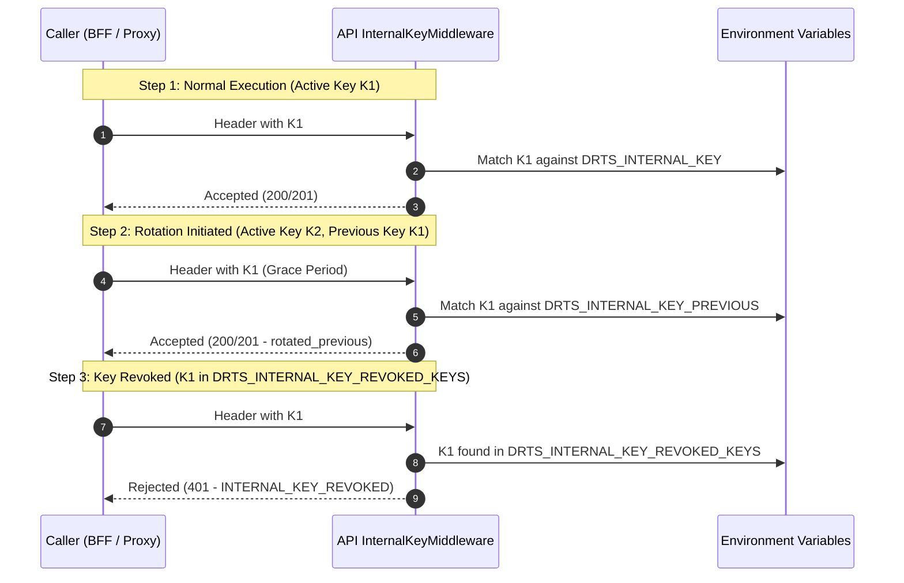
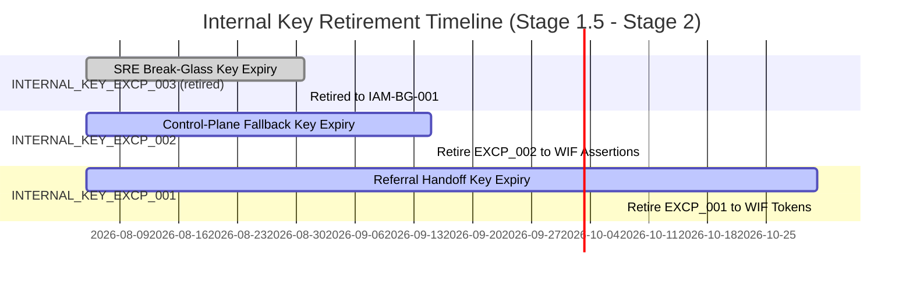

# Temporary Internal Key Exception Inventory & Retirement Plan

**Task ID**: `IAM-SVC-002`  
**Status**: Active Exception Inventory & Retirement Lifecycle  
**Owner**: Gemini2  
**Reviewer**: Claude  
**Planning Reference**: `docs/02-architecture/stage1-5-identity-access-account-security-hardening-plan-20260801.md`  
**Execution Reference**: `docs/03-runbooks/stage1-5-identity-access-account-security-execution-tasks-20260801.md`  
**Last Updated**: 2026-08-05

---

## 1. Overview & Security Policy

As part of the DRTS Stage 1.5 Identity & Access Security Hardening Plan, shared static `DRTS_INTERNAL_KEY` and scoped internal keys are classified as **temporary transition exceptions**. The long-term production standard requires Workload Identity Federation (WIF) and short-lived audience-bound service tokens (`IAM-SVC-001`).

To prevent undocumented credential proliferation and unmonitored backdoor access:

1. **Machine-Readable Inventory**: Every active or transitional internal key MUST be registered with complete metadata in the machine-readable registry (`apps/api/src/common/auth/internal-key-exception-registry.ts`) and documented in this inventory.
2. **Metadata & Scope Enforcement**: Every entry must include `exceptionId`, `owner`, `purpose`, `scope`, `ttl`, `expiresAt`, `networkBoundary`, `rotationCadence`, `usageSignal`, `removalDate`, and `removalPlan`. Requests must match both header name and path/method scope pattern.
3. **Fail-Closed Enforcement**: Any internal key presented without a matching documented active exception or past its `expiresAt` timestamp is evaluated as `INTERNAL_KEY_UNDOCUMENTED` or `INTERNAL_KEY_EXPIRED`. Unauthenticated HTTP callers receive generic 401 `INTERNAL_KEY_INVALID` without internal state leakage.
4. **Bounded Dual-Key Rotation Overlap & Revocation**: Keys support dual-key rotation (`DRTS_*_KEY` primary and `DRTS_*_KEY_PREVIOUS` overlap window with optional `DRTS_*_KEY_PREVIOUS_EXPIRES_AT` timestamp). Explicitly revoked keys in `DRTS_*_KEY_REVOKED_KEYS` fail evaluation immediately with `INTERNAL_KEY_REVOKED`.
5. **Usage & Drift Telemetry & Alerts**: Valid requests emit declared `usageSignal` values (`AUTH_SCOPED_INTERNAL_KEY_USED`, `AUTH_LEGACY_INTERNAL_KEY_USED`, `AUTH_BREAKGLASS_INTERNAL_KEY_USED`). Uninventoried, out-of-scope, expired, or revoked attempts trigger `AUTH_INTERNAL_KEY_DRIFT_ALERT` events. Events are registered in `SECURITY_EVENT_MATRIX` (`internal_key.used`, `internal_key_drift.detected`) and monitored via `infra/alerts/internal-key-alerts.yaml` Prometheus rules.
6. **Automated CI Verification**: `operations/security/verify-internal-key-exceptions.py` is wired into CI (`.github/workflows/ci.yml`), `pnpm check`, and `package.json` (`pnpm verify:internal-key-exceptions`).

---

## 2. Production Internal Key Exception Inventory

| Exception ID            | Owner               | Purpose                                                                                      | Scope / Header                                                                                                                                                                                   | Network Boundary              | TTL / ExpiresAt        | Rotation Cadence | Usage Signal                        | Target Removal Date | Removal Plan                                                                                                                                 |
| ----------------------- | ------------------- | -------------------------------------------------------------------------------------------- | ------------------------------------------------------------------------------------------------------------------------------------------------------------------------------------------------ | ----------------------------- | ---------------------- | ---------------- | ----------------------------------- | ------------------- | -------------------------------------------------------------------------------------------------------------------------------------------- |
| `INTERNAL_KEY_EXCP_001` | `referral-team`     | Scoped server-to-server referral embed handoff artifact issuance and consumption             | `x-drts-referral-handoff-key`<br>`POST partner/ingress/referral-embed-handoff`<br>`POST partner/ingress/referral-embed-handoff/consume`<br>`POST partner/ingress/referral-embed-handoff/consent` | `internal-vpc-to-api-ingress` | `2026-10-31T23:59:59Z` | `30d`            | `AUTH_SCOPED_INTERNAL_KEY_USED`     | `2026-10-31`        | Migrate `referral-embed-web` BFF caller to IAM-SVC-001 WIF token exchange once WIF proxy is enabled on referral web app.                     |
| `INTERNAL_KEY_EXCP_002` | `control-plane-ops` | Legacy control-plane proxy serverless fallback key when GCP WIF identity assertion is absent | `x-drts-internal-key`<br>`* *`<br>`POST partner/ingress/handoff`<br>`POST auth/token`                                                                                                            | `control-plane-proxy-to-api`  | `2026-09-15T23:59:59Z` | `14d`            | `AUTH_LEGACY_INTERNAL_KEY_USED`     | `2026-09-15`        | Full deprecation of `DRTS_INTERNAL_KEY` fallback in favor of mandatory WIF workload identity assertion headers on all control-plane proxies. |

### Retired exceptions

INTERNAL_KEY_EXCP_003 (sre-ops, staging emergency break-glass) reached its
`removalDate` of 2026-08-31 and was retired from the registry on 2026-09-01,
per its own removal plan: replaced by IAM-BG-001 two-person break-glass
approval with short session tokens, which shipped before that date.

Retiring it changed no request outcome. It stopped matching when it expired,
and `INTERNAL_KEY_EXCP_002` carries scope `* *` on the same header, so the
routes it had covered -- `GET health` and `POST ops/*` -- already resolved
through EXCP_002 in both staging and production. Verified against the
evaluator with and without the entry before removal.

---

## 3. Dual-Key Rotation & Revocation Protocol

Internal key rotation follows a zero-downtime dual-key model:



### Environment Variable Scheme

- **Primary Active Key**: `DRTS_INTERNAL_KEY` / `DRTS_REFERRAL_EMBED_HANDOFF_KEY`
- **Rotation Previous Key**: `DRTS_INTERNAL_KEY_PREVIOUS` / `DRTS_REFERRAL_EMBED_HANDOFF_KEY_PREVIOUS`
- **Revoked Keys List**: `DRTS_INTERNAL_KEY_REVOKED_KEYS` / `DRTS_REFERRAL_EMBED_HANDOFF_KEY_REVOKED_KEYS` (CSV)

---

## 4. Verification & Audit Tooling

Automated verification is integrated at two layers:

1. **Startup Validation (`apps/api/src/config/auth-startup-config.ts`)**:
   - `buildAuthStartupConfigReport` validates that any configured internal key has a complete, non-expired, documented entry in `INTERNAL_KEY_EXCEPTION_REGISTRY`.
   - Incomplete metadata triggers `MISSING_CONTROL` / `INVALID_FORMAT`. Expired exceptions trigger `UNSAFE_VALUE`.

2. **Automated Audit Script (`operations/security/verify-internal-key-exceptions.py`)**:
   - Executable verification tool that checks code registry against documentation metadata integrity.
   - Verifies machine-readable exception inventory, required metadata fields, document synchronization, and expiration timestamps. Live runtime route enforcement and drift detection are executed continuously by `AuthStartupConfig` and `InternalKeyMiddleware`.

```bash
python3 operations/security/verify-internal-key-exceptions.py
```

---

## 5. Exception Retirement Roadmap


