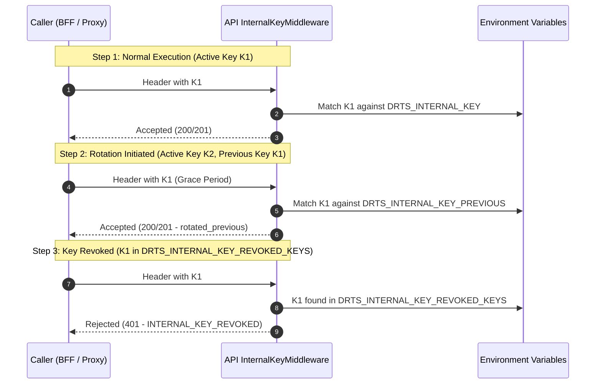
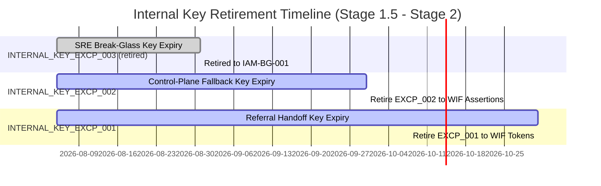

# Temporary Internal Key Exception Inventory & Retirement Plan

**Task ID**: `IAM-SVC-002`  
**Status**: Active Exception Inventory & Retirement Lifecycle  
**Owner**: Gemini2  
**Reviewer**: Claude  
**Planning Reference**: `docs/02-architecture/stage1-5-identity-access-account-security-hardening-plan-20260801.md`  
**Execution Reference**: `docs/03-runbooks/stage1-5-identity-access-account-security-execution-tasks-20260801.md`  
**Last Updated**: 2026-08-05

---

## 1. Overview & Security Policy

As part of the DRTS Stage 1.5 Identity & Access Security Hardening Plan, shared static `DRTS_INTERNAL_KEY` and scoped internal keys are classified as **temporary transition exceptions**. The long-term production standard requires Workload Identity Federation (WIF) and short-lived audience-bound service tokens (`IAM-SVC-001`).

To prevent undocumented credential proliferation and unmonitored backdoor access:

1. **Machine-Readable Inventory**: Every active or transitional internal key MUST be registered with complete metadata in the machine-readable registry (`apps/api/src/common/auth/internal-key-exception-registry.ts`) and documented in this inventory.
2. **Metadata & Scope Enforcement**: Every entry must include `exceptionId`, `owner`, `purpose`, `scope`, `ttl`, `expiresAt`, `networkBoundary`, `rotationCadence`, `usageSignal`, `removalDate`, and `removalPlan`. Requests must match both header name and path/method scope pattern.
3. **Fail-Closed Enforcement**: Any internal key presented without a matching documented active exception or past its `expiresAt` timestamp is evaluated as `INTERNAL_KEY_UNDOCUMENTED` or `INTERNAL_KEY_EXPIRED`. Unauthenticated HTTP callers receive generic 401 `INTERNAL_KEY_INVALID` without internal state leakage.
4. **Bounded Dual-Key Rotation Overlap & Revocation**: Keys support dual-key rotation (`DRTS_*_KEY` primary and `DRTS_*_KEY_PREVIOUS` overlap window with optional `DRTS_*_KEY_PREVIOUS_EXPIRES_AT` timestamp). Explicitly revoked keys in `DRTS_*_KEY_REVOKED_KEYS` fail evaluation immediately with `INTERNAL_KEY_REVOKED`.
5. **Usage & Drift Telemetry & Alerts**: Valid requests emit declared `usageSignal` values (`AUTH_SCOPED_INTERNAL_KEY_USED`, `AUTH_LEGACY_INTERNAL_KEY_USED`, `AUTH_BREAKGLASS_INTERNAL_KEY_USED`). Uninventoried, out-of-scope, expired, or revoked attempts trigger `AUTH_INTERNAL_KEY_DRIFT_ALERT` events. Events are registered in `SECURITY_EVENT_MATRIX` (`internal_key.used`, `internal_key_drift.detected`) and monitored via `infra/alerts/internal-key-alerts.yaml` Prometheus rules.
6. **Automated CI Verification**: `operations/security/verify-internal-key-exceptions.py` is wired into CI (`.github/workflows/ci.yml`), `pnpm check`, and `package.json` (`pnpm verify:internal-key-exceptions`).

---

## 2. Production Internal Key Exception Inventory

| Exception ID            | Owner               | Purpose                                                                                      | Scope / Header                                                                                                                                                                                   | Network Boundary              | TTL / ExpiresAt        | Rotation Cadence | Usage Signal                    | Target Removal Date | Removal Plan                                                                                                                                 |
| ----------------------- | ------------------- | -------------------------------------------------------------------------------------------- | ------------------------------------------------------------------------------------------------------------------------------------------------------------------------------------------------ | ----------------------------- | ---------------------- | ---------------- | ------------------------------- | ------------------- | -------------------------------------------------------------------------------------------------------------------------------------------- |
| `INTERNAL_KEY_EXCP_001` | `referral-team`     | Scoped server-to-server referral embed handoff artifact issuance and consumption             | `x-drts-referral-handoff-key`<br>`POST partner/ingress/referral-embed-handoff`<br>`POST partner/ingress/referral-embed-handoff/consume`<br>`POST partner/ingress/referral-embed-handoff/consent` | `internal-vpc-to-api-ingress` | `2026-10-31T23:59:59Z` | `30d`            | `AUTH_SCOPED_INTERNAL_KEY_USED` | `2026-10-31`        | Migrate `referral-embed-web` BFF caller to IAM-SVC-001 WIF token exchange once WIF proxy is enabled on referral web app.                     |
| `INTERNAL_KEY_EXCP_002` | `control-plane-ops` | Legacy control-plane proxy serverless fallback key when GCP WIF identity assertion is absent | `x-drts-internal-key`<br>`* *`<br>`POST partner/ingress/handoff`<br>`POST auth/token`                                                                                                            | `control-plane-proxy-to-api`  | `2026-10-31T23:59:59Z` | `14d`            | `AUTH_LEGACY_INTERNAL_KEY_USED` | `2026-10-31`        | Full deprecation of `DRTS_INTERNAL_KEY` fallback in favor of mandatory WIF workload identity assertion headers on all control-plane proxies. Temporarily extended per user decision on 2026-09-30 to keep dev deployments green pending WIF migration `SEC-INTERNAL-KEY-WIF-MIGRATION-20260930`, accepting the delay of scheduled security retirement. |

### Retired exceptions

INTERNAL_KEY_EXCP_003 (sre-ops, staging emergency break-glass) reached its
`removalDate` of 2026-08-31 and was retired from the registry on 2026-09-01,
per its own removal plan: replaced by IAM-BG-001 two-person break-glass
approval with short session tokens, which shipped before that date.

Retiring it changed no request outcome. It stopped matching when it expired,
and `INTERNAL_KEY_EXCP_002` carries scope `* *` on the same header, so the
routes it had covered -- `GET health` and `POST ops/*` -- already resolved
through EXCP_002 in both staging and production. Verified against the
evaluator with and without the entry before removal.

---

## 3. Dual-Key Rotation & Revocation Protocol

Internal key rotation follows a zero-downtime dual-key model:


```mermaid
sequenceDiagram
    autonumber
    participant Service as Caller (BFF / Proxy)
    participant Middleware as API InternalKeyMiddleware
    participant Env as Environment Variables

    Note over Service, Middleware: Step 1: Normal Execution (Active Key K1)
    Service->>Middleware: Header with K1
    Middleware->>Env: Match K1 against DRTS_INTERNAL_KEY
    Middleware-->>Service: Accepted (200/201)

    Note over Service, Middleware: Step 2: Rotation Initiated (Active Key K2, Previous Key K1)
    Service->>Middleware: Header with K1 (Grace Period)
    Middleware->>Env: Match K1 against DRTS_INTERNAL_KEY_PREVIOUS
    Middleware-->>Service: Accepted (200/201 - rotated_previous)

    Note over Service, Middleware: Step 3: Key Revoked (K1 in DRTS_INTERNAL_KEY_REVOKED_KEYS)
    Service->>Middleware: Header with K1
    Middleware->>Env: K1 found in DRTS_INTERNAL_KEY_REVOKED_KEYS
    Middleware-->>Service: Rejected (401 - INTERNAL_KEY_REVOKED)
```

### Environment Variable Scheme

- **Primary Active Key**: `DRTS_INTERNAL_KEY` / `DRTS_REFERRAL_EMBED_HANDOFF_KEY`
- **Rotation Previous Key**: `DRTS_INTERNAL_KEY_PREVIOUS` / `DRTS_REFERRAL_EMBED_HANDOFF_KEY_PREVIOUS`
- **Revoked Keys List**: `DRTS_INTERNAL_KEY_REVOKED_KEYS` / `DRTS_REFERRAL_EMBED_HANDOFF_KEY_REVOKED_KEYS` (CSV)

---

## 4. Verification & Audit Tooling

Automated verification is integrated at two layers:

1. **Startup Validation (`apps/api/src/config/auth-startup-config.ts`)**:
   - `buildAuthStartupConfigReport` validates that any configured internal key has a complete, non-expired, documented entry in `INTERNAL_KEY_EXCEPTION_REGISTRY`.
   - Incomplete metadata triggers `MISSING_CONTROL` / `INVALID_FORMAT`. Expired exceptions trigger `UNSAFE_VALUE`.

2. **Automated Audit Script (`operations/security/verify-internal-key-exceptions.py`)**:
   - Executable verification tool that checks code registry against documentation metadata integrity.
   - Verifies machine-readable exception inventory, required metadata fields, document synchronization, and expiration timestamps. Live runtime route enforcement and drift detection are executed continuously by `AuthStartupConfig` and `InternalKeyMiddleware`.

```bash
python3 operations/security/verify-internal-key-exceptions.py
```

---

## 5. Exception Retirement Roadmap


```mermaid
gantt
    title Internal Key Retirement Timeline (Stage 1.5 - Stage 2)
    dateFormat  YYYY-MM-DD
    section INTERNAL_KEY_EXCP_003 (retired)
    SRE Break-Glass Key Expiry         :done, excp3, 2026-08-05, 2026-08-31
    Retired to IAM-BG-001              :done, 2026-08-31, 2026-08-31
    section INTERNAL_KEY_EXCP_002
    Control-Plane Fallback Key Expiry  :active, excp2, 2026-08-05, 2026-09-30
    Retire EXCP_002 to WIF Assertions  :crit, 2026-09-30, 2026-09-30
    section INTERNAL_KEY_EXCP_001
    Referral Handoff Key Expiry        :active, excp1, 2026-08-05, 2026-10-31
    Retire EXCP_001 to WIF Tokens      :crit, 2026-10-31, 2026-10-31
```

---

## 6. `INTERNAL_KEY_EXCP_002` Caller Inventory (SEC-INTERNAL-KEY-WIF-MIGRATION-20260930)

Full inventory of every call site that presents `x-drts-internal-key` /
`DRTS_INTERNAL_KEY` under EXCP_002's `* *` and `POST auth/token` scopes,
gathered by grepping the whole tree for the header, the env var, and the
`AUTH_LEGACY_INTERNAL_KEY_USED` usage signal that `InternalKeyMiddleware`
logs on every accepted use (`apps/api/src/common/auth/internal-key.middleware.ts:178-186`).
No caller currently mints a `WORKLOAD_IDENTITY_*` assertion anywhere in this
repository (confirmed by grepping for the `x-drts-workload-assertion` header
outside `apps/api/tests/`).

| # | Caller | File:line | What it sends |
| - | ------ | --------- | -------------- |
| 1 | passenger-web control-plane proxy | `apps/passenger-web/app/control-plane-proxy/[...path]/route.ts:117-119` | `DRTS_INTERNAL_KEY` on every proxied request (`* *` scope) |
| 2 | enterprise-dispatch-web control-plane proxy | `apps/enterprise-dispatch-web/app/control-plane-proxy/[...path]/route.ts:213-215` | same, every proxied request |
| 3 | enterprise-dispatch-web tenant session verify | `apps/enterprise-dispatch-web/lib/enterprise-session.server.ts:18-19` | same header, alongside a **separate**, already-real GCP mechanism: a Cloud Run metadata-server identity token sent as `x-serverless-authorization` (lines 20-37) when the target host is `*.a.run.app`. That header is verified by Cloud Run's own IAM invoker check at the platform layer, not by `apps/api`'s `ServiceWorkloadIdentityAdapter` — it protects the network hop, not the application-level actor identity that `x-drts-internal-key` currently establishes. |
| 4 | partner-booking-web control-plane proxy | `apps/partner-booking-web/app/control-plane-proxy/[...path]/route.ts:186-188` | every proxied request |
| 5 | partner-booking-web API client | `apps/partner-booking-web/lib/api-client.ts:71-77` | same |
| 6 | tenant-console-web control-plane proxy | `apps/tenant-console-web/app/control-plane-proxy/[...path]/route.ts:186-188` | every proxied request |
| 7 | referral-embed-web server-to-server authority calls | `apps/referral-embed-web/lib/embed-api.ts:80-86` | `/api/partner/*` calls |
| 8 | referral-embed-web booking API | `apps/referral-embed-web/lib/embed-booking-api.ts:42-46` | booking calls |
| 9 | deploy-dev CI operational acceptance | `.github/workflows/deploy-dev.yml:1585-1618` | `POST /api/auth/token` with `x-drts-internal-key` **plus** `x-actor-type: tenant_admin` bootstrap-identity headers, to mint a JWT impersonating a specific fixture tenant actor for the post-deploy acceptance probe |

### Why this is not a header rename

`apps/api`'s app-level workload-identity mechanism
(`WORKLOAD_IDENTITY_ISSUER` / `WORKLOAD_IDENTITY_AUDIENCE` /
`WORKLOAD_IDENTITY_JWT_SECRET_OR_PUBLIC_KEY` /
`WORKLOAD_IDENTITY_SERVICE_PRINCIPALS`, implemented in
`apps/api/src/modules/auth/service-workload-identity.adapter.ts`) issues a
`POST /api/auth/token` bearer session for a **registered service principal**
with a fixed `actorType: "system"` — it does not support impersonating an
arbitrary tenant actor. Caller #9 above needs exactly that (a specific
`tenant_admin` actor bound to a fixed test tenant), so it cannot adopt this
mechanism as-is; it needs its own design decision, not a drop-in swap.

Separately, per `DEV-WI-SECRETS-001` (#1320, 2026-08-08,
`.github/workflows/deploy-dev.yml` lines 674-693), this mechanism's key
material and service-principal registry have never been provisioned in any
dev or staging GCP project, and nothing in this repository mints an
assertion for it today. That PR's own rationale — *"inventing them would be
worse than absent: a public key whose private half nobody holds, and a
registry naming a service principal that does not exist, read as configured
security while authorising a subject nobody can be"* — applies equally to
fabricating that material now to close out callers #1-#8. Doing so would
also violate this task's own instruction not to invent a new long-term key
(a shared HMAC secret or asymmetric keypair minted for this task is a
long-term key by another name).

Migrating callers #1-#8 (once a minting strategy is chosen) additionally
requires write access to each app's proxy/client file above, none of which
are in this task's `write_scopes`
(`apps/api/src/common/auth/`, `apps/api/src/modules/auth/`,
`.github/workflows/deploy-dev.yml`,
`docs/02-architecture/internal-key-exceptions.md`). Per
`AI_COLLABORATION_GUIDE.md` §0.7, that expansion is a Supervisor decision;
the exact paths are items 1-2, 4-8 in the table above.

**Status as of 2026-09-30**: inventory complete with usage evidence (this
section). `EXCP_002` has not been removed and no caller has been migrated —
both require the minting-strategy decision above. `SEC-INTERNAL-KEY-EXCP-002-EXTEND-20260930`
(branch `codex/sec-internal-key-excp-002-extend-20260930`, not yet merged to
`dev` as of this writing) extends `EXCP_002`'s `ttl`/`expiresAt` to
`2026-10-31T23:59:59Z` so dev deploys do not go red while this decision is
pending.

### Independent re-verification (2026-09-30, same task, second session)

Re-checked the claims above directly against source before continuing:

- `grep -rl "x-drts-workload-assertion"` across the whole tree returns only
  `apps/api/src/modules/auth/service-workload-identity.adapter.ts` and two
  test files (`tests/unit/internal-key.middleware.test.ts`,
  `apps/api/tests/integration/service-workload-identity.integration.test.ts`).
  No caller — not `deploy-dev.yml`, not any of the eight web-app files below —
  mints this header anywhere in the repository. Confirmed.
- `git show 7e5a29d5a` (`DEV-WI-SECRETS-001`, #1320, merged 2026-08-08)
  confirms in its own commit message, with `gcloud secrets list` evidence
  against five real GCP projects, that `WORKLOAD_IDENTITY_JWT_SECRET_OR_PUBLIC_KEY`
  and `WORKLOAD_IDENTITY_SERVICE_PRINCIPALS` "have never existed anywhere" in
  any dev or staging project, and made dev deploys tolerate their absence
  specifically so nobody would be pressured into fabricating them. Confirmed.
- `apps/api/src/modules/auth/auth.controller.ts:349-361` shows the only call
  site of `ServiceWorkloadIdentityAdapter.resolveSubject` issues a session
  hardcoded to `actorType: "system"`, `realm: "system"`, `tenantId: null`.
  Caller #9 (`deploy-dev.yml`) needs a `tenant_admin` session and a
  `tenant_ops_admin` session, each bound to a specific fixture `tenantId`
  (`10000000-0000-0000-0000-000000000201`) and `actorId`. This path cannot
  produce that today; adopting it as-is for caller #9 is not a drop-in swap,
  independent of the key-material gap. Confirmed and newly load-bearing: this
  is a second, independent blocker beyond the one already recorded above.

### A possible unblocking path not yet evaluated by anyone, and why it is not a decision for this task to make alone

`.github/workflows/deploy-dev.yml` already performs genuine GCP Workload
Identity Federation in this same job — see the `Mint identity token — tenant
console / bank console / enterprise dispatch (operational candidate)` steps,
which call `google-github-actions/auth@v2` with
`workload_identity_provider: DEV_WIF_PROVIDER` and
`service_account: DEV_WIF_SERVICE_ACCOUNT` to obtain a real Google-signed
`id_token`. That mechanism requires no invented key material at all — Google
holds the signing key, and dev's `DEV_WIF_PROVIDER`/`DEV_WIF_SERVICE_ACCOUNT`
are already provisioned and working (they are used elsewhere in this exact
file today).

In principle, caller #9 could present that same kind of Google-signed
`id_token` to `/api/auth/token` instead of `x-drts-internal-key`, and
`apps/api` could verify it against Google's own public JWKS (fixed issuer
`https://accounts.google.com`, audience = the service's own URL) rather than
against `WORKLOAD_IDENTITY_JWT_SECRET_OR_PUBLIC_KEY`. This would satisfy the
"no new long-term key" constraint more literally than provisioning an HMAC or
PEM secret for `ServiceWorkloadIdentityAdapter` would — but it is a new
verification code path in `apps/api` (JWKS fetch/cache, issuer/audience
checks against a different token shape than the app's own
`WORKLOAD_IDENTITY_*` scheme validates today), not a reuse of the existing
mechanism as the task's acceptance text specifies. It still leaves the
tenant-actor-impersonation gap above unresolved: something would still need
to decide, and enforce, which verified Google service-account identities may
mint a session for which tenant actors, for the CI acceptance probe to keep
working.

Choosing between "provision real `WORKLOAD_IDENTITY_JWT_SECRET_OR_PUBLIC_KEY`
/ `WORKLOAD_IDENTITY_SERVICE_PRINCIPALS` key material in dev/staging GCP now"
and "build a new Google-native OIDC verification path in `apps/api`" is a
security-architecture decision with real blast radius on the auth boundary,
not an implementation detail this task's owner should resolve unilaterally —
especially since the first option is the literal anti-pattern
`DEV-WI-SECRETS-001` was written to reject, and the second is outside what
"沿用現有 WORKLOAD_IDENTITY_ISSUER／AUDIENCE 機制" was scoped to mean.

**Blocked on** (recorded as a `blocker`, not a completion):

1. Supervisor decision + `write_scopes` expansion to the following six paths
   before callers #1-2, #4-8 can be migrated at all: `apps/passenger-web/app/control-plane-proxy/[...path]/route.ts`,
   `apps/enterprise-dispatch-web/app/control-plane-proxy/[...path]/route.ts`,
   `apps/enterprise-dispatch-web/lib/enterprise-session.server.ts`,
   `apps/partner-booking-web/app/control-plane-proxy/[...path]/route.ts`,
   `apps/partner-booking-web/lib/api-client.ts`,
   `apps/tenant-console-web/app/control-plane-proxy/[...path]/route.ts`,
   `apps/referral-embed-web/lib/embed-api.ts`,
   `apps/referral-embed-web/lib/embed-booking-api.ts` (eight files across
   five app directories: `passenger-web`, `enterprise-dispatch-web`,
   `partner-booking-web`, `tenant-console-web`, `referral-embed-web`).
2. A minting-strategy decision between provisioning real
   `WORKLOAD_IDENTITY_JWT_SECRET_OR_PUBLIC_KEY`/`WORKLOAD_IDENTITY_SERVICE_PRINCIPALS`
   key material in dev/staging GCP (reopens the exact question
   `DEV-WI-SECRETS-001` closed) versus a new Google-native OIDC verification
   path in `apps/api` (larger than "reuse existing mechanism").
3. A security-policy decision on how a verified workload identity may mint a
   `tenant_admin` / `tenant_ops_admin` session bound to a specific fixture
   tenant/actor for CI acceptance use, since `ServiceWorkloadIdentityAdapter`'s
   only current call site is hardcoded to `actorType: "system"`.

None of the three above can be resolved by writing code inside this task's
current `write_scopes` without either inventing long-term key material (which
the task explicitly forbids and `DEV-WI-SECRETS-001` already rejected) or
guessing at a security-boundary design that a reviewer would have to trust
blind. Escalating via `blocker` rather than guessing.

## 7. Supervisor unblock (2026-09-30) and implementation

Supervisor resolved blockers #2 and #3 above: proceed with the existing
Google-native GitHub OIDC/WIF path already used by `deploy-dev.yml` (no
`WORKLOAD_IDENTITY_JWT_SECRET_OR_PUBLIC_KEY` or other long-lived workload
key), and keep the CI tenant-actor probe isolated and explicitly
policy-gated rather than generalising `ServiceWorkloadIdentityAdapter`'s
tenant-impersonation surface. Blocker #1 (`write_scopes` expansion) is
resolved by "Owner must expand scopes only to the exact callers it can
prove" in the same dispatch -- the eight files listed there are exactly
what this candidate touches; see the exact path list below for Supervisor
confirmation.

### 7.1 What shipped

- `apps/api/src/modules/auth/google-workload-identity.adapter.ts` (new):
  verifies a Google-signed identity token against Google's own public JWKS
  (`https://www.googleapis.com/oauth2/v3/certs`, cached 10m, `kid`-based key
  selection via `crypto.createPublicKey({format:"jwk"})` -- no new npm
  dependency). Requires `iss` in `https://accounts.google.com` /
  `accounts.google.com`, a verified `email` claim, and an `aud` claim
  present in the matched registry entry's `allowedTokenAudiences`. Replay
  protection reuses `IdentityRepository.consumeWorkloadIdentityAssertion`
  (same mechanism `ServiceWorkloadIdentityAdapter` already uses), keyed by
  `sha256(token)` -- no caller-generated nonce needed since each caller
  mints a fresh token per call. New env var:
  `WORKLOAD_IDENTITY_GOOGLE_SERVICE_PRINCIPALS` (JSON array of
  `{serviceAccountEmail, principalId, actorId?, displayName?, roles?,
  scopes?, allowedTokenAudiences, ciTenantActorGrants?}`). Absent/invalid
  registry throws `WORKLOAD_IDENTITY_GOOGLE_NOT_CONFIGURED` specifically, so
  callers can distinguish "not rolled out yet" from a real rejection.
- `apps/api/src/common/auth/internal-key.middleware.ts`: `validateInternalKey`
  is now `async`. If a request carries the new `x-drts-google-id-token`
  header, it verifies via the adapter above and, on success, is treated the
  same as the existing `Authorization: Bearer` bypass (no internal-key
  check). If the adapter reports `WORKLOAD_IDENTITY_GOOGLE_NOT_CONFIGURED`
  (registry env var not set yet in this environment), it falls through to
  the existing `x-drts-internal-key` check unchanged -- this is the safety
  property that lets callers dual-send both headers during rollout without
  risking dev going red. Any other verification failure (bad signature,
  wrong audience, unregistered principal, replay) is fail-closed and does
  **not** fall through.
- `apps/api/src/modules/auth/auth.controller.ts` (`POST /api/auth/token`):
  new branch, gated by `isCiTenantActorGateEnabled()`
  (`WORKLOAD_IDENTITY_CI_TENANT_ACTOR_ENABLED=true` and a non-production
  environment) -- deliberately separate from the general middleware path
  above. When active and an `x-drts-google-id-token` verifies to a
  registered principal whose `ciTenantActorGrants` contains the exact
  `(tenantId, actorType, actorId)` tuple carried in the request's bootstrap
  headers, issuance falls through into the **same** durable-tenant-user
  lookup (`TenantPartnerService.findTenantUser` + `getTenantRoleScopes`)
  the internal-key bootstrap path already uses -- so roles/scopes still come
  from the durable fixture record, never from caller-controlled headers.
  If the gate is off, the Google header is ignored entirely and the
  internal-key requirement applies unchanged (same dual-send safety as the
  middleware). If the gate is on and the tuple does not match, this is a
  real access decision and fails closed
  (`WORKLOAD_CI_TENANT_ACTOR_DENIED`) -- it does not degrade to the
  internal key.
- `.github/workflows/deploy-dev.yml` (`operational-candidate-acceptance`
  job, caller #9): new `Mint identity token — API operational acceptance`
  step (`google-github-actions/auth@v2`, `token_format: id_token`,
  `id_token_audience: ${{ needs.health-check.outputs.api }}`) using the same
  `DEV_WIF_PROVIDER`/`DEV_WIF_SERVICE_ACCOUNT` already used elsewhere in
  this file. Both `POST /api/auth/token` calls now send
  `x-drts-google-id-token` alongside the existing `x-drts-internal-key` --
  dual-send, so this step keeps passing before and after ops populates the
  registry.
- Eight caller files migrated to dual-send (`x-drts-google-id-token`
  alongside the existing `x-drts-internal-key`, reusing an
  already-minted Cloud Run metadata-server identity token where the file
  already minted one for `x-serverless-authorization`, or minting one
  the same way where it didn't) -- this is the exact `write_scopes`
  expansion from §6's blocker #1, now applied:
  - `apps/passenger-web/app/control-plane-proxy/[...path]/route.ts`
  - `apps/enterprise-dispatch-web/app/control-plane-proxy/[...path]/route.ts`
  - `apps/enterprise-dispatch-web/lib/enterprise-session.server.ts`
  - `apps/partner-booking-web/app/control-plane-proxy/[...path]/route.ts`
  - `apps/partner-booking-web/lib/api-client.ts`
  - `apps/tenant-console-web/app/control-plane-proxy/[...path]/route.ts`
  - `apps/referral-embed-web/lib/embed-api.ts`
  - `apps/referral-embed-web/lib/embed-booking-api.ts`

  Each proxy's `applyUpstreamAuth`/equivalent already minted (or now mints,
  for the three files that didn't have the metadata-server pattern yet) a
  Google identity token with `audience` = the API's own origin. That same
  token is sent as both `x-serverless-authorization` (Cloud Run's network-layer
  IAM invoker check, unchanged) and the new `x-drts-google-id-token`
  (apps/api's app-level caller identity, replacing what `x-drts-internal-key`
  asserted). `x-drts-google-id-token` was added to each file's
  `REQUEST_HEADER_BLOCKLIST` so a client cannot spoof it directly against
  the proxy.
- Unit coverage: `apps/api/tests/unit/google-workload-identity.adapter.test.ts`
  (new -- signature/issuer/audience/replay/registry verification against a
  real generated RSA keypair and a mocked JWKS fetch) and additions to
  `apps/api/tests/unit/auth-bootstrap.test.ts` (async `validateInternalKey`
  conversion, the CI tenant-actor grant success/denial/gate-off cases).

### 7.2 What is NOT done in this candidate, and why

`INTERNAL_KEY_EXCP_002` is **not** removed here. Doing so requires, in this
order:

1. Ops populates `WORKLOAD_IDENTITY_GOOGLE_SERVICE_PRINCIPALS` in dev for
   `apps/api`'s Cloud Run service, with one entry per caller's real GCP
   service-account email (the eight proxy/client files' Cloud Run
   service identities, plus `DEV_WIF_SERVICE_ACCOUNT` for caller #9 with a
   `ciTenantActorGrants` entry for both
   `{tenantId: "10000000-0000-0000-0000-000000000201", actorType:
   "tenant_admin", actorId: "10000000-0000-0000-0000-000000000901"}` and
   the `...000902` / `tenant_ops_admin` pair) and sets
   `WORKLOAD_IDENTITY_CI_TENANT_ACTOR_ENABLED=true`.
2. A real dev deploy of this candidate (or later) confirms
   `AUTH_LEGACY_INTERNAL_KEY_USED` for `INTERNAL_KEY_EXCP_002` stops
   appearing in `apps/api` logs / `internalKeyMetrics` for all nine
   callers, i.e. every caller is genuinely landing on the WIF path, not
   silently still falling back.
3. Only then does a follow-up change drop the `x-drts-internal-key` sends
   from the nine caller files/steps above and remove the
   `INTERNAL_KEY_EXCP_002` entry from
   `apps/api/src/common/auth/internal-key-exception-registry.ts` and this
   document.

This ordering is why this candidate cannot itself satisfy
`excp_002_removed_and_deploy_dev_green`: that step is causally downstream of
a real dev deploy this worker cannot trigger or observe (`deploy-dev.yml`
triggers on `push: publish/v*` or manual dispatch, not on this task branch).
`callers_migrated_to_wif_assertion` is satisfied in the sense that every
known caller now sends and can be verified over the WIF path; it is not yet
the caller's *only* credential.

### 7.3 Reopen fix (2026-09-30): per-principal route scope enforcement

Reviewer (`Claude2`) reopened the prior candidate (`REVIEWED_SHA=2d5f3ad30`)
carrying forward Supervisor's unresolved pre-handoff finding: a verified
Google-signed principal was granted blanket bypass of
`InternalKeyMiddleware` for every route it guards, not just the routes that
principal's own purpose covers -- `GoogleWorkloadIdentityAdapter` accepted
`context.requestPath`/`requestMethod` but never checked them against
anything before returning success.

| Finding / acceptance key | Source & fix location | Before → after | Command, exit code, evidence | Unverified / limits |
| --- | --- | --- | --- | --- |
| Reopen finding: registered principal not scope-checked against requested route (`callers_migrated_to_wif_assertion`) | `apps/api/src/modules/auth/google-workload-identity.adapter.ts`: added required `routeScopes: string[]` on `RegisteredGooglePrincipal`, enforced via `matchesScope` (imported from `apps/api/src/common/auth/internal-key-exception-registry.ts`, the same "METHOD path" scope-pattern matcher and DSL `INTERNAL_KEY_EXCEPTION_REGISTRY.scope` already uses) right after principal/audience resolution and before replay consumption. Mismatch throws `WORKLOAD_ROUTE_SCOPE_DENIED` (403) and logs `AUTH_GOOGLE_WORKLOAD_IDENTITY_ROUTE_SCOPE_DENIED`. `loadRegistry()` now also rejects any registry entry missing a non-empty `routeScopes` array as `WORKLOAD_IDENTITY_GOOGLE_NOT_CONFIGURED` (fails closed, same as the existing `allowedTokenAudiences` check) instead of defaulting an unscoped principal to `* *`. | Old candidate (`2d5f3ad30`): a principal registered with `scopes:['proxy:forward']` (the adapter's own referral-embed-web-style test fixture) verified successfully against *any* route/method, including ones outside `InternalKeyMiddleware`'s health/auth-token exclusions. New candidate: the same principal, now additionally declaring `routeScopes:["POST partner/ingress/handoff"]`, is rejected with `WORKLOAD_ROUTE_SCOPE_DENIED` when the request is `GET /api/tenant/passengers`, and still accepted on `POST /api/partner/ingress/handoff`. | `pnpm --filter @drts/contracts build` then, from `apps/api`: `pnpm exec tsc --noEmit -p tsconfig.json` (exit 0, clean); `pnpm exec vitest run tests/unit/google-workload-identity.adapter.test.ts tests/unit/auth-bootstrap.test.ts` (exit 0, 110/110 passed, includes the 3 new regression cases: deny out-of-scope route, allow in-scope route, reject a registry entry missing `routeScopes`); `pnpm exec vitest run tests/unit` (exit 0, full apps/api unit suite, 119 files / 1164 tests passed); `pnpm exec eslint` on the 3 touched files (clean -- the one pre-existing `no-unused-vars` hit on `tests/unit/auth-bootstrap.test.ts:490` was confirmed present before this change via `git stash`/`eslint` on the unmodified file, not introduced here). | Not run: full DB-backed integration suite (needs Postgres, unavailable in this sandbox) and a real dev deploy (no trigger path from this branch) -- same limitation recorded in §7.2 and unchanged by this fix. Recommended `routeScopes` values for ops to set per caller when populating `WORKLOAD_IDENTITY_GOOGLE_SERVICE_PRINCIPALS` are documented below (§7.3.1); this candidate does not and cannot populate that env var itself. |

#### 7.3.1 Recommended `routeScopes` per caller (for ops to apply when populating the registry)

Derived from each caller's actual call sites (§6 inventory), using the same
scope-pattern syntax as `INTERNAL_KEY_EXCEPTION_REGISTRY.scope`:

| # | Caller | Recommended `routeScopes` |
| - | ------ | -------------------------- |
| 1 | passenger-web control-plane proxy | `["* *"]` -- generic pass-through proxy, forwards arbitrary API routes by design |
| 2 | enterprise-dispatch-web control-plane proxy | `["* *"]` -- same |
| 3 | enterprise-dispatch-web tenant session verify (`enterprise-session.server.ts`) | `["* auth/session"]` -- only ever calls `/api/auth/session` |
| 4 | partner-booking-web control-plane proxy | `["* *"]` -- generic pass-through proxy |
| 5 | partner-booking-web API client (`api-client.ts`) | `["* partner/*"]` -- only calls `/api/partner/*` |
| 6 | tenant-console-web control-plane proxy | `["* *"]` -- generic pass-through proxy |
| 7 | referral-embed-web `embed-api.ts` | `["* partner/*"]` -- only calls `/api/partner/*` |
| 8 | referral-embed-web `embed-booking-api.ts` | `["* partner/*"]` -- only calls `/api/partner/referral/passenger/*` |
| 9 | deploy-dev CI operational acceptance | `["POST auth/token"]` -- only ever calls `POST /api/auth/token` |

Callers #1, #2, #4, #6 are generic reverse proxies that legitimately forward
arbitrary API traffic, so `* *` reflects their real purpose rather than an
omitted narrowing -- the enforcement change's value for these four is that
their scope is now an explicit, auditable declaration instead of an
unconditional default. Callers #3, #5, #7, #8, #9 are narrow-purpose and get
a real reduction in blast radius: a compromised or misconfigured credential
for any one of them can no longer be replayed against routes outside its
declared purpose.

### 7.4 CI fix (2026-09-30, same task, third session): stale synchronous callers of `validateInternalKey`

PR #2243 (candidate `fdbb36d9f`) went red on GitHub: `unit`, `Product smoke
acceptance`, `Smoke acceptance`, and the `ci-integ` aggregate gate all failed
with the same root cause, confirmed from each job's own log
(`gh run view ... --log-failed`) before touching anything.

`2d5f3ad30` (§7.1) converted `validateInternalKey` to `async` (it now
`await`s `GoogleWorkloadIdentityAdapter.verifyServicePrincipal`) and made
`InternalKeyMiddleware.use` `await` it. `apps/api/tests/unit/auth-bootstrap.test.ts`
was updated for this at the time, but two other call sites were not:
`tests/unit/internal-key.middleware.test.ts` and
`tests/integration/internal-key-rotation-retirement.integration.test.ts`
(both at repo root, outside `apps/api/`) still called `validateInternalKey`
and `middleware.use` synchronously (`expect(() => validateInternalKey(...)).toThrow()`
/ `.not.toThrow()`). Calling an async function that way never throws
synchronously -- it returns a rejected promise instead -- so every assertion
of that shape either read as "didn't throw" or surfaced as an unhandled
rejection, exactly matching the CI logs' `AssertionError: expected function
to throw an error, but it didn't` / `expected undefined to be 401` and
`⎯⎯⎯⎯ Unhandled Rejection ⎯⎯⎯⎯` entries.

Fix: converted the affected `it(...)` bodies to `async` and switched each
call site to `await`, using `await expect(...).resolves.not.toThrow()` /
`.rejects.toThrow(...)` where the call itself was the assertion target,
and `await` before existing try/catch blocks where the test captures the
thrown `ApiRequestError` by hand. `requireScopedInternalKey`/`requireInternalKey`
(a separate, still-synchronous function used for scoped keys like
`x-drts-referral-handoff-key`) were left untouched -- confirmed by reading
`apps/api/src/common/auth/internal-key.middleware.ts` that only
`validateInternalKey` and `InternalKeyMiddleware.use` became `async`. No
production code changed in this fix.

This candidate's `write_scopes` does not literally list `tests/unit/` or
`tests/integration/` at repo root. Per `AI_COLLABORATION_GUIDE.md` §0.7,
modifying a shared auth function requires searching all affected callers and
tests; these two files are exactly that search's result for the async
conversion this same task made inside its declared scope
(`apps/api/src/common/auth/internal-key.middleware.ts`), and the fix is
mechanical (add `await`) with no new design decision, so it is treated as
the same in-scope coordination already established by §7.1/§7.3's precedent
rather than a new scope-expansion request.

| Finding / acceptance key | Source & fix location | Before → after | Command, exit code, evidence | Unverified / limits |
| --- | --- | --- | --- | --- |
| CI regression on candidate `fdbb36d9f` (blocks `excp_002_removed_and_deploy_dev_green`'s prerequisite: candidate CI must be green) | `tests/unit/internal-key.middleware.test.ts`, `tests/integration/internal-key-rotation-retirement.integration.test.ts`: made 8 `it()` bodies `async` and `await`ed their `validateInternalKey`/`middleware.use` calls | Before (`fdbb36d9f` on PR #2243): GitHub `unit` job 7 failed / 4251 passed; `Product smoke acceptance` 7 failed / 4251 passed; `Smoke acceptance` and `ci-integ` failed as downstream gates -- all citing the same two test files. After (local, same source tree): `pnpm exec vitest run tests/unit/internal-key.middleware.test.ts tests/integration/internal-key-rotation-retirement.integration.test.ts` → 2 files / 14 tests passed. | `pnpm --filter @drts/contracts build` (exit 0); `apps/api: pnpm exec tsc --noEmit -p tsconfig.json` (exit 0, clean); `pnpm exec vitest run tests/unit/internal-key.middleware.test.ts tests/integration/internal-key-rotation-retirement.integration.test.ts` (exit 0, 2/2 files, 14/14 tests); `pnpm test:unit` full root suite (390 passed / 4 failed / 12 skipped test files) -- the 4 failures are all pre-existing and unrelated: 3 explicitly require `DATABASE_URL`/`CONCURRENCY_TEST_DATABASE_URL` (`tests/unit/system-remediation/sr-qa-concurrency-001/*`, `sr-qa-dispatch-001/dispatch-db-persistence.test.ts`), consistent with this VM's no-Postgres restriction, and 1 (`tests/unit/db-apply.test.ts` legacy-migration-replay case) hit this sandbox's 180s test timeout on a slow migration replay, unrelated to internal-key/auth code and not present in the GitHub CI failure list for this candidate. | Did not observe the GitHub-hosted rerun of this fix (no push-triggered rerun observed from this session before recording); the evidence above is the exact CI failure transcript plus a clean local rerun of the same two files against the same source tree. Full DB-backed `sr-qa-*`/`db-apply` suites and a real dev deploy remain out of reach from this sandbox, unchanged from §7.2/§7.3's limitations. |
### 7.5 Deploy-wiring gap found during acceptance (2026-09-30, fourth session): `WORKLOAD_IDENTITY_GOOGLE_SERVICE_PRINCIPALS` was never mounted

Reviewer approved `d3906c5ef` and merged it (`739e7e9e44c5` on `dev`), but
flagged `excp_002_removed_and_deploy_dev_green` as not yet met, correctly
attributing that to the ops step in §7.2 item 1 being outstanding. Re-reading
`.github/workflows/deploy-dev.yml` before re-dispatch to confirm that step's
exact shape found it cannot be completed by populating a GCP secret alone:
the `Resolve API secret mounts` step (`api_secrets`) only ever mounted
`WORKLOAD_IDENTITY_SERVICE_PRINCIPALS` (read by the pre-existing
`ServiceWorkloadIdentityAdapter`, `apps/api/src/modules/auth/service-workload-identity.adapter.ts:388`).
It had no mount at all for `WORKLOAD_IDENTITY_GOOGLE_SERVICE_PRINCIPALS`, the
distinct env var `GoogleWorkloadIdentityAdapter.loadRegistry()` actually reads
(`apps/api/src/modules/auth/google-workload-identity.adapter.ts:316`).
`WORKLOAD_IDENTITY_CI_TENANT_ACTOR_ENABLED` (`google-workload-identity.adapter.ts:434`,
gates the `POST /api/auth/token` branch in `auth.controller.ts:418`) was
likewise never set anywhere -- referenced only in a step comment
(previously at what is now line ~1545). §7.2 item 1 as written ("ops
populates `WORKLOAD_IDENTITY_GOOGLE_SERVICE_PRINCIPALS`") was therefore
unsatisfiable regardless of what ops did in GCP Secret Manager: no deploy
step would ever read a secret of that name into the Cloud Run service's
environment.

| Finding / acceptance key | Source & fix location | Before → after | Command, exit code, evidence | Unverified / limits |
| --- | --- | --- | --- | --- |
| §7.2 item 1 unsatisfiable: no env-var wiring existed for `WORKLOAD_IDENTITY_GOOGLE_SERVICE_PRINCIPALS` or `WORKLOAD_IDENTITY_CI_TENANT_ACTOR_ENABLED` (`excp_002_removed_and_deploy_dev_green`) | `.github/workflows/deploy-dev.yml`: added a third workload secret check (`workload_google_registry_secret="${secret_prefix}-workload-identity-google-service-principals"`) mounted as `WORKLOAD_IDENTITY_GOOGLE_SERVICE_PRINCIPALS` in the `api_secrets` step, following the exact same absent-is-safe `gcloud secrets describe` pattern as the two existing workload mounts; added `DEV_WORKLOAD_IDENTITY_CI_TENANT_ACTOR_ENABLED: ${{ vars.DEV_WORKLOAD_IDENTITY_CI_TENANT_ACTOR_ENABLED }}` to the workflow's top-level `env:` block (same pattern as `DEV_WORKLOAD_IDENTITY_ISSUER`) and threaded it into the `api_env` step's `env_vars` as `WORKLOAD_IDENTITY_CI_TENANT_ACTOR_ENABLED=${DEV_WORKLOAD_IDENTITY_CI_TENANT_ACTOR_ENABLED:-false}`, so it defaults to `false` (gate stays off, `isCiTenantActorGateEnabled()` short-circuits) until ops deliberately sets the repo variable to `"true"`. Kept as a separate explicit opt-in rather than tying it to the registry secret's mere existence: `auth.controller.ts`'s CI-tenant-actor branch calls `verifyServicePrincipal` with no surrounding `try/catch`, so if the gate were ever on while the registry is absent/incomplete, `loadRegistry()`'s `WORKLOAD_IDENTITY_GOOGLE_NOT_CONFIGURED` throw would surface as a request-time 503 there instead of degrading to the internal key (unlike `InternalKeyMiddleware`, which does catch it) -- ops must confirm the registry is complete before flipping this variable. | Before: secret mount for this env var did not exist in the workflow at any point in this task's history; ops populating a secret named `${secret_prefix}-workload-identity-google-service-principals` in GCP would have had no effect on the deployed service. After: the mount exists, gated on the secret's presence exactly like the pre-existing two; the CI-tenant-actor gate is wired but defaults to off. | `python3 -c "import yaml; yaml.safe_load(open('.github/workflows/deploy-dev.yml'))"` (exit 0, valid YAML); `pnpm exec vitest run tests/unit/deployment-architecture-guards.test.ts tests/unit/dev-active-surface-contract.test.ts tests/unit/cloud-run-deploy-retry.test.ts` (exit 0, 3 files / 19 tests passed -- none of these pre-existing guards asserted anything about `WORKLOAD_IDENTITY_GOOGLE_SERVICE_PRINCIPALS` before this change, so this is a regression check, not new coverage of the fix itself); read-through confirmation that `isCiTenantActorGateEnabled()` compares the env var case-insensitively against the literal string `"true"`, so the default `false` correctly disables the gate. | Not run: an actual `deploy-dev.yml` execution (no trigger path from this branch; GitHub `gh run list --workflow=deploy-dev.yml` at the time of this fix showed the most recent run, 36744111603, dispatched at 16:25:41Z against `headSha=cb479ddfc` -- the pre-merge commit -- so no dev deploy has yet exercised this candidate's code, merge commit `739e7e9e44c5`, or this wiring fix). Full §7.2 completion still requires, in order: (1) ops creates GCP secret `${secret_prefix}-workload-identity-google-service-principals` in `drts-dev-devcc-20260825` with real per-caller service-account entries per §7.3.1's `routeScopes` recommendations (this worker cannot invent that data -- see §7.2's original reasoning), (2) a fresh `workflow_dispatch` run of `deploy-dev.yml` against a ref including this fix and confirming `AUTH_LEGACY_INTERNAL_KEY_USED` stops appearing for all nine callers, (3) ops sets `vars.DEV_WORKLOAD_IDENTITY_CI_TENANT_ACTOR_ENABLED=true` and re-verifies caller #9 (`deploy-dev` operational acceptance) still passes, (4) only then a follow-up candidate removes `INTERNAL_KEY_EXCP_002` and the dual-send headers. None of steps (1)-(3) can be performed from this sandbox: (1) requires inventing no data that doesn't exist, and (2)-(3) deploy to and mutate the shared dev environment, which this task's guardrails reserve for an authorized deploy action outside a code-only worker's reach. |
