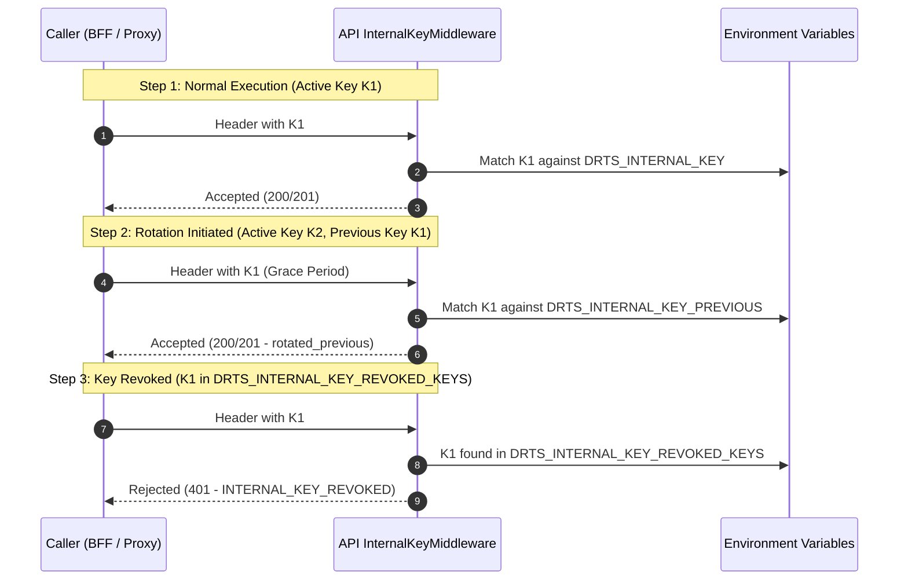
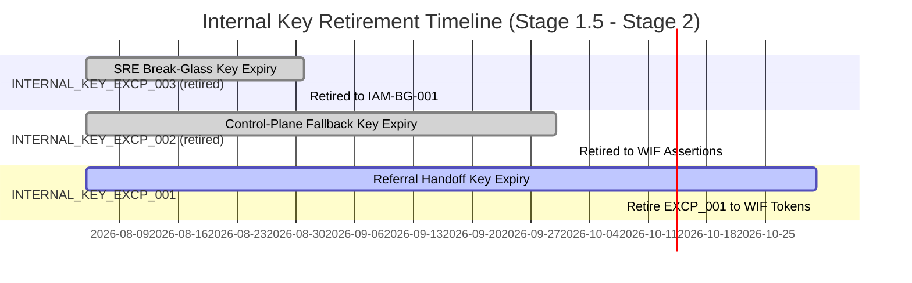

# Temporary Internal Key Exception Inventory & Retirement Plan

**Task ID**: `IAM-SVC-002`  
**Status**: Active Exception Inventory & Retirement Lifecycle  
**Owner**: Gemini2  
**Reviewer**: Claude  
**Planning Reference**: `docs/02-architecture/stage1-5-identity-access-account-security-hardening-plan-20260801.md`  
**Execution Reference**: `docs/03-runbooks/stage1-5-identity-access-account-security-execution-tasks-20260801.md`  
**Last Updated**: 2026-08-05

---

## 1. Overview & Security Policy

As part of the DRTS Stage 1.5 Identity & Access Security Hardening Plan, shared static `DRTS_INTERNAL_KEY` and scoped internal keys are classified as **temporary transition exceptions**. The long-term production standard requires Workload Identity Federation (WIF) and short-lived audience-bound service tokens (`IAM-SVC-001`).

To prevent undocumented credential proliferation and unmonitored backdoor access:

1. **Machine-Readable Inventory**: Every active or transitional internal key MUST be registered with complete metadata in the machine-readable registry (`apps/api/src/common/auth/internal-key-exception-registry.ts`) and documented in this inventory.
2. **Metadata & Scope Enforcement**: Every entry must include `exceptionId`, `owner`, `purpose`, `scope`, `ttl`, `expiresAt`, `networkBoundary`, `rotationCadence`, `usageSignal`, `removalDate`, and `removalPlan`. Requests must match both header name and path/method scope pattern.
3. **Fail-Closed Enforcement**: Any internal key presented without a matching documented active exception or past its `expiresAt` timestamp is evaluated as `INTERNAL_KEY_UNDOCUMENTED` or `INTERNAL_KEY_EXPIRED`. Unauthenticated HTTP callers receive generic 401 `INTERNAL_KEY_INVALID` without internal state leakage.
4. **Bounded Dual-Key Rotation Overlap & Revocation**: Keys support dual-key rotation (`DRTS_*_KEY` primary and `DRTS_*_KEY_PREVIOUS` overlap window with optional `DRTS_*_KEY_PREVIOUS_EXPIRES_AT` timestamp). Explicitly revoked keys in `DRTS_*_KEY_REVOKED_KEYS` fail evaluation immediately with `INTERNAL_KEY_REVOKED`.
5. **Usage & Drift Telemetry & Alerts**: Valid requests emit declared `usageSignal` values (`AUTH_SCOPED_INTERNAL_KEY_USED`, `AUTH_LEGACY_INTERNAL_KEY_USED`, `AUTH_BREAKGLASS_INTERNAL_KEY_USED`). Uninventoried, out-of-scope, expired, or revoked attempts trigger `AUTH_INTERNAL_KEY_DRIFT_ALERT` events. Events are registered in `SECURITY_EVENT_MATRIX` (`internal_key.used`, `internal_key_drift.detected`) and monitored via `infra/alerts/internal-key-alerts.yaml` Prometheus rules.
6. **Automated CI Verification**: `operations/security/verify-internal-key-exceptions.py` is wired into CI (`.github/workflows/ci.yml`), `pnpm check`, and `package.json` (`pnpm verify:internal-key-exceptions`).

---

## 2. Production Internal Key Exception Inventory

| Exception ID            | Owner               | Purpose                                                                                      | Scope / Header                                                                                                                                                                                   | Network Boundary              | TTL / ExpiresAt        | Rotation Cadence | Usage Signal                    | Target Removal Date | Removal Plan                                                                                                                                 |
| ----------------------- | ------------------- | -------------------------------------------------------------------------------------------- | ------------------------------------------------------------------------------------------------------------------------------------------------------------------------------------------------ | ----------------------------- | ---------------------- | ---------------- | ------------------------------- | ------------------- | -------------------------------------------------------------------------------------------------------------------------------------------- |

_No active exceptions remain: INTERNAL_KEY_EXCP_001 and INTERNAL_KEY_EXCP_002
were both retired 2026-10-02 (below); INTERNAL_KEY_EXCP_003 was retired
2026-09-01._

### Retired exceptions

INTERNAL_KEY_EXCP_001 (referral-team, referral embed handoff issuance /
consume / consent) reached its `removalDate` of 2026-10-31 ahead of schedule:
retired from the registry on 2026-10-02 by
SEC-INTERNAL-KEY-EXCP-001-WIF-MIGRATION-20261002, per its own removal plan.
The three routes it covered (`POST partner/ingress/referral-embed-handoff`,
`.../consume`, `.../consent`) now verify a Google-signed workload identity
assertion (`x-drts-google-id-token`) against the same
`WORKLOAD_IDENTITY_GOOGLE_SERVICE_PRINCIPALS` registry and
`GoogleWorkloadIdentityAdapter` every other proxied route already uses (see
§8.2/§10 below); `x-drts-referral-handoff-key` is no longer read anywhere in
`apps/api`. `referral-embed-web`'s BFF (`apps/referral-embed-web/lib/embed-api.ts`)
already dual-sent this assertion on every authority call before this task, so
no caller-side change was needed there.

INTERNAL_KEY_EXCP_002 (control-plane-ops, x-drts-internal-key) reached its
removalDate of 2026-10-31 early and was retired from the registry on
2026-10-02 by SEC-INTERNAL-KEY-WIF-MIGRATION-20260930, per its own removal
plan: all control-plane proxy, auth/token, and partner/ingress/handoff
bootstrap callers migrated to the Google workload identity assertion
(`x-drts-google-id-token`, verified by `GoogleWorkloadIdentityAdapter`
against Google's own public JWKS -- no new long-term key was invented). Full
inventory, migration evidence, and the removal candidate's own verification
are in section 12 below.

INTERNAL_KEY_EXCP_003 (sre-ops, staging emergency break-glass) reached its
removalDate of 2026-08-31 and was retired from the registry on 2026-09-01,
per its own removal plan: replaced by IAM-BG-001 two-person break-glass
approval with short session tokens, which shipped before that date.

Retiring it changed no request outcome. It stopped matching when it expired,
and INTERNAL_KEY_EXCP_002 carried scope `* *` on the same header at the time,
so the routes it had covered -- `GET health` and `POST ops/*` -- already
resolved through EXCP_002 in both staging and production. Verified against
the evaluator with and without the entry before removal.

INTERNAL_KEY_EXCP_002 (control-plane-ops, x-drts-internal-key) reached its
removalDate of 2026-10-31 early and was retired from the registry on
2026-10-02 by SEC-INTERNAL-KEY-WIF-MIGRATION-20260930, per its own removal
plan: all control-plane proxy, auth/token, and partner/ingress/handoff
bootstrap callers migrated to the Google workload identity assertion
(`x-drts-google-id-token`, verified by `GoogleWorkloadIdentityAdapter`
against Google's own public JWKS -- no new long-term key was invented). Full
inventory, migration evidence, and the removal candidate's own verification
are in section 12 below.

---

## 3. Dual-Key Rotation & Revocation Protocol

Internal key rotation follows a zero-downtime dual-key model:


```mermaid
sequenceDiagram
    autonumber
    participant Service as Caller (BFF / Proxy)
    participant Middleware as API InternalKeyMiddleware
    participant Env as Environment Variables

    Note over Service, Middleware: Step 1: Normal Execution (Active Key K1)
    Service->>Middleware: Header with K1
    Middleware->>Env: Match K1 against DRTS_INTERNAL_KEY
    Middleware-->>Service: Accepted (200/201)

    Note over Service, Middleware: Step 2: Rotation Initiated (Active Key K2, Previous Key K1)
    Service->>Middleware: Header with K1 (Grace Period)
    Middleware->>Env: Match K1 against DRTS_INTERNAL_KEY_PREVIOUS
    Middleware-->>Service: Accepted (200/201 - rotated_previous)

    Note over Service, Middleware: Step 3: Key Revoked (K1 in DRTS_INTERNAL_KEY_REVOKED_KEYS)
    Service->>Middleware: Header with K1
    Middleware->>Env: K1 found in DRTS_INTERNAL_KEY_REVOKED_KEYS
    Middleware-->>Service: Rejected (401 - INTERNAL_KEY_REVOKED)
```

### Environment Variable Scheme

- **Primary Active Key**: `DRTS_INTERNAL_KEY` / `DRTS_REFERRAL_EMBED_HANDOFF_KEY`
- **Rotation Previous Key**: `DRTS_INTERNAL_KEY_PREVIOUS` / `DRTS_REFERRAL_EMBED_HANDOFF_KEY_PREVIOUS`
- **Revoked Keys List**: `DRTS_INTERNAL_KEY_REVOKED_KEYS` / `DRTS_REFERRAL_EMBED_HANDOFF_KEY_REVOKED_KEYS` (CSV)

---

## 4. Verification & Audit Tooling

Automated verification is integrated at two layers:

1. **Startup Validation (`apps/api/src/config/auth-startup-config.ts`)**:
   - `buildAuthStartupConfigReport` validates that any configured internal key has a complete, non-expired, documented entry in `INTERNAL_KEY_EXCEPTION_REGISTRY`.
   - Incomplete metadata triggers `MISSING_CONTROL` / `INVALID_FORMAT`. Expired exceptions trigger `UNSAFE_VALUE`.

2. **Automated Audit Script (`operations/security/verify-internal-key-exceptions.py`)**:
   - Executable verification tool that checks code registry against documentation metadata integrity.
   - Verifies machine-readable exception inventory, required metadata fields, document synchronization, and expiration timestamps. Live runtime route enforcement and drift detection are executed continuously by `AuthStartupConfig` and `InternalKeyMiddleware`.

```bash
python3 operations/security/verify-internal-key-exceptions.py
```

---

## 5. Exception Retirement Roadmap


```mermaid
gantt
    title Internal Key Retirement Timeline (Stage 1.5 - Stage 2)
    dateFormat  YYYY-MM-DD
    section INTERNAL_KEY_EXCP_003 (retired)
    SRE Break-Glass Key Expiry         :done, excp3, 2026-08-05, 2026-08-31
    Retired to IAM-BG-001              :done, 2026-08-31, 2026-08-31
    section INTERNAL_KEY_EXCP_002 (retired)
    Control-Plane Fallback Key Expiry  :done, excp2, 2026-08-05, 2026-09-30
    Retired to WIF Assertions          :done, 2026-10-02, 2026-10-02
    section INTERNAL_KEY_EXCP_001
    Referral Handoff Key Expiry        :active, excp1, 2026-08-05, 2026-10-31
    Retire EXCP_001 to WIF Tokens      :crit, 2026-10-31, 2026-10-31
```

---

## 6. INTERNAL_KEY_EXCP_002 Caller Inventory (SEC-INTERNAL-KEY-WIF-MIGRATION-20260930)

Full inventory of every call site that presents `x-drts-internal-key` /
`DRTS_INTERNAL_KEY` under EXCP_002's `* *` and `POST auth/token` scopes,
gathered by grepping the whole tree for the header, the env var, and the
`AUTH_LEGACY_INTERNAL_KEY_USED` usage signal that `InternalKeyMiddleware`
logs on every accepted use (`apps/api/src/common/auth/internal-key.middleware.ts:178-186`).
No caller currently mints a `WORKLOAD_IDENTITY_*` assertion anywhere in this
repository (confirmed by grepping for the `x-drts-workload-assertion` header
outside `apps/api/tests/`).

| # | Caller | File:line | What it sends |
| - | ------ | --------- | -------------- |
| 1 | passenger-web control-plane proxy | `apps/passenger-web/app/control-plane-proxy/[...path]/route.ts:117-119` | `DRTS_INTERNAL_KEY` on every proxied request (`* *` scope) |
| 2 | enterprise-dispatch-web control-plane proxy | `apps/enterprise-dispatch-web/app/control-plane-proxy/[...path]/route.ts:213-215` | same, every proxied request |
| 3 | enterprise-dispatch-web tenant session verify | `apps/enterprise-dispatch-web/lib/enterprise-session.server.ts:18-19` | same header, alongside a **separate**, already-real GCP mechanism: a Cloud Run metadata-server identity token sent as `x-serverless-authorization` (lines 20-37) when the target host is `*.a.run.app`. That header is verified by Cloud Run's own IAM invoker check at the platform layer, not by `apps/api`'s `ServiceWorkloadIdentityAdapter` — it protects the network hop, not the application-level actor identity that `x-drts-internal-key` currently establishes. |
| 4 | partner-booking-web control-plane proxy | `apps/partner-booking-web/app/control-plane-proxy/[...path]/route.ts:186-188` | every proxied request |
| 5 | partner-booking-web API client | `apps/partner-booking-web/lib/api-client.ts:71-77` | same |
| 6 | tenant-console-web control-plane proxy | `apps/tenant-console-web/app/control-plane-proxy/[...path]/route.ts:186-188` | every proxied request |
| 7 | referral-embed-web server-to-server authority calls | `apps/referral-embed-web/lib/embed-api.ts:80-86` | `/api/partner/*` calls |
| 8 | referral-embed-web booking API | `apps/referral-embed-web/lib/embed-booking-api.ts:42-46` | booking calls |
| 9 | deploy-dev CI operational acceptance | `.github/workflows/deploy-dev.yml:1585-1618` | `POST /api/auth/token` with `x-drts-internal-key` **plus** `x-actor-type: tenant_admin` bootstrap-identity headers, to mint a JWT impersonating a specific fixture tenant actor for the post-deploy acceptance probe |

### Why this is not a header rename

`apps/api`'s app-level workload-identity mechanism
(`WORKLOAD_IDENTITY_ISSUER` / `WORKLOAD_IDENTITY_AUDIENCE` /
`WORKLOAD_IDENTITY_JWT_SECRET_OR_PUBLIC_KEY` /
`WORKLOAD_IDENTITY_SERVICE_PRINCIPALS`, implemented in
`apps/api/src/modules/auth/service-workload-identity.adapter.ts`) issues a
`POST /api/auth/token` bearer session for a **registered service principal**
with a fixed `actorType: "system"` — it does not support impersonating an
arbitrary tenant actor. Caller #9 above needs exactly that (a specific
`tenant_admin` actor bound to a fixed test tenant), so it cannot adopt this
mechanism as-is; it needs its own design decision, not a drop-in swap.

Separately, per `DEV-WI-SECRETS-001` (#1320, 2026-08-08,
`.github/workflows/deploy-dev.yml` lines 674-693), this mechanism's key
material and service-principal registry have never been provisioned in any
dev or staging GCP project, and nothing in this repository mints an
assertion for it today. That PR's own rationale — *"inventing them would be
worse than absent: a public key whose private half nobody holds, and a
registry naming a service principal that does not exist, read as configured
security while authorising a subject nobody can be"* — applies equally to
fabricating that material now to close out callers #1-#8. Doing so would
also violate this task's own instruction not to invent a new long-term key
(a shared HMAC secret or asymmetric keypair minted for this task is a
long-term key by another name).

Migrating callers #1-#8 (once a minting strategy is chosen) additionally
requires write access to each app's proxy/client file above, none of which
are in this task's `write_scopes`
(`apps/api/src/common/auth/`, `apps/api/src/modules/auth/`,
`.github/workflows/deploy-dev.yml`,
`docs/02-architecture/internal-key-exceptions.md`). Per
`AI_COLLABORATION_GUIDE.md` §0.7, that expansion is a Supervisor decision;
the exact paths are items 1-2, 4-8 in the table above.

**Status as of 2026-09-30**: inventory complete with usage evidence (this
section). `EXCP_002` has not been removed and no caller has been migrated —
both require the minting-strategy decision above. `SEC-INTERNAL-KEY-EXCP-002-EXTEND-20260930`
(branch `codex/sec-internal-key-excp-002-extend-20260930`, not yet merged to
`dev` as of this writing) extends `EXCP_002`'s `ttl`/`expiresAt` to
`2026-10-31T23:59:59Z` so dev deploys do not go red while this decision is
pending.

### Independent re-verification (2026-09-30, same task, second session)

Re-checked the claims above directly against source before continuing:

- `grep -rl "x-drts-workload-assertion"` across the whole tree returns only
  `apps/api/src/modules/auth/service-workload-identity.adapter.ts` and two
  test files (`tests/unit/internal-key.middleware.test.ts`,
  `apps/api/tests/integration/service-workload-identity.integration.test.ts`).
  No caller — not `deploy-dev.yml`, not any of the eight web-app files below —
  mints this header anywhere in the repository. Confirmed.
- `git show 7e5a29d5a` (`DEV-WI-SECRETS-001`, #1320, merged 2026-08-08)
  confirms in its own commit message, with `gcloud secrets list` evidence
  against five real GCP projects, that `WORKLOAD_IDENTITY_JWT_SECRET_OR_PUBLIC_KEY`
  and `WORKLOAD_IDENTITY_SERVICE_PRINCIPALS` "have never existed anywhere" in
  any dev or staging project, and made dev deploys tolerate their absence
  specifically so nobody would be pressured into fabricating them. Confirmed.
- `apps/api/src/modules/auth/auth.controller.ts:349-361` shows the only call
  site of `ServiceWorkloadIdentityAdapter.resolveSubject` issues a session
  hardcoded to `actorType: "system"`, `realm: "system"`, `tenantId: null`.
  Caller #9 (`deploy-dev.yml`) needs a `tenant_admin` session and a
  `tenant_ops_admin` session, each bound to a specific fixture `tenantId`
  (`10000000-0000-0000-0000-000000000201`) and `actorId`. This path cannot
  produce that today; adopting it as-is for caller #9 is not a drop-in swap,
  independent of the key-material gap. Confirmed and newly load-bearing: this
  is a second, independent blocker beyond the one already recorded above.

### A possible unblocking path not yet evaluated by anyone, and why it is not a decision for this task to make alone

`.github/workflows/deploy-dev.yml` already performs genuine GCP Workload
Identity Federation in this same job — see the `Mint identity token — tenant
console / bank console / enterprise dispatch (operational candidate)` steps,
which call `google-github-actions/auth@v2` with
`workload_identity_provider: DEV_WIF_PROVIDER` and
`service_account: DEV_WIF_SERVICE_ACCOUNT` to obtain a real Google-signed
`id_token`. That mechanism requires no invented key material at all — Google
holds the signing key, and dev's `DEV_WIF_PROVIDER`/`DEV_WIF_SERVICE_ACCOUNT`
are already provisioned and working (they are used elsewhere in this exact
file today).

In principle, caller #9 could present that same kind of Google-signed
`id_token` to `/api/auth/token` instead of `x-drts-internal-key`, and
`apps/api` could verify it against Google's own public JWKS (fixed issuer
`https://accounts.google.com`, audience = the service's own URL) rather than
against `WORKLOAD_IDENTITY_JWT_SECRET_OR_PUBLIC_KEY`. This would satisfy the
"no new long-term key" constraint more literally than provisioning an HMAC or
PEM secret for `ServiceWorkloadIdentityAdapter` would — but it is a new
verification code path in `apps/api` (JWKS fetch/cache, issuer/audience
checks against a different token shape than the app's own
`WORKLOAD_IDENTITY_*` scheme validates today), not a reuse of the existing
mechanism as the task's acceptance text specifies. It still leaves the
tenant-actor-impersonation gap above unresolved: something would still need
to decide, and enforce, which verified Google service-account identities may
mint a session for which tenant actors, for the CI acceptance probe to keep
working.

Choosing between "provision real `WORKLOAD_IDENTITY_JWT_SECRET_OR_PUBLIC_KEY`
/ `WORKLOAD_IDENTITY_SERVICE_PRINCIPALS` key material in dev/staging GCP now"
and "build a new Google-native OIDC verification path in `apps/api`" is a
security-architecture decision with real blast radius on the auth boundary,
not an implementation detail this task's owner should resolve unilaterally —
especially since the first option is the literal anti-pattern
`DEV-WI-SECRETS-001` was written to reject, and the second is outside what
"沿用現有 WORKLOAD_IDENTITY_ISSUER／AUDIENCE 機制" was scoped to mean.

**Blocked on** (recorded as a `blocker`, not a completion):

1. Supervisor decision + `write_scopes` expansion to the following six paths
   before callers #1-2, #4-8 can be migrated at all: `apps/passenger-web/app/control-plane-proxy/[...path]/route.ts`,
   `apps/enterprise-dispatch-web/app/control-plane-proxy/[...path]/route.ts`,
   `apps/enterprise-dispatch-web/lib/enterprise-session.server.ts`,
   `apps/partner-booking-web/app/control-plane-proxy/[...path]/route.ts`,
   `apps/partner-booking-web/lib/api-client.ts`,
   `apps/tenant-console-web/app/control-plane-proxy/[...path]/route.ts`,
   `apps/referral-embed-web/lib/embed-api.ts`,
   `apps/referral-embed-web/lib/embed-booking-api.ts` (eight files across
   five app directories: `passenger-web`, `enterprise-dispatch-web`,
   `partner-booking-web`, `tenant-console-web`, `referral-embed-web`).
2. A minting-strategy decision between provisioning real
   `WORKLOAD_IDENTITY_JWT_SECRET_OR_PUBLIC_KEY`/`WORKLOAD_IDENTITY_SERVICE_PRINCIPALS`
   key material in dev/staging GCP (reopens the exact question
   `DEV-WI-SECRETS-001` closed) versus a new Google-native OIDC verification
   path in `apps/api` (larger than "reuse existing mechanism").
3. A security-policy decision on how a verified workload identity may mint a
   `tenant_admin` / `tenant_ops_admin` session bound to a specific fixture
   tenant/actor for CI acceptance use, since `ServiceWorkloadIdentityAdapter`'s
   only current call site is hardcoded to `actorType: "system"`.

None of the three above can be resolved by writing code inside this task's
current `write_scopes` without either inventing long-term key material (which
the task explicitly forbids and `DEV-WI-SECRETS-001` already rejected) or
guessing at a security-boundary design that a reviewer would have to trust
blind. Escalating via `blocker` rather than guessing.

## 7. Supervisor unblock (2026-09-30) and implementation

Supervisor resolved blockers #2 and #3 above: proceed with the existing
Google-native GitHub OIDC/WIF path already used by `deploy-dev.yml` (no
`WORKLOAD_IDENTITY_JWT_SECRET_OR_PUBLIC_KEY` or other long-lived workload
key), and keep the CI tenant-actor probe isolated and explicitly
policy-gated rather than generalising `ServiceWorkloadIdentityAdapter`'s
tenant-impersonation surface. Blocker #1 (`write_scopes` expansion) is
resolved by "Owner must expand scopes only to the exact callers it can
prove" in the same dispatch -- the eight files listed there are exactly
what this candidate touches; see the exact path list below for Supervisor
confirmation.

### 7.1 What shipped

- `apps/api/src/modules/auth/google-workload-identity.adapter.ts` (new):
  verifies a Google-signed identity token against Google's own public JWKS
  (`https://www.googleapis.com/oauth2/v3/certs`, cached 10m, `kid`-based key
  selection via `crypto.createPublicKey({format:"jwk"})` -- no new npm
  dependency). Requires `iss` in `https://accounts.google.com` /
  `accounts.google.com`, a verified `email` claim, and an `aud` claim
  present in the matched registry entry's `allowedTokenAudiences`. Replay
  protection reuses `IdentityRepository.consumeWorkloadIdentityAssertion`
  (same mechanism `ServiceWorkloadIdentityAdapter` already uses), keyed by
  `sha256(token)` -- no caller-generated nonce needed since each caller
  mints a fresh token per call. New env var:
  `WORKLOAD_IDENTITY_GOOGLE_SERVICE_PRINCIPALS` (JSON array of
  `{serviceAccountEmail, principalId, actorId?, displayName?, roles?,
  scopes?, allowedTokenAudiences, ciTenantActorGrants?}`). Absent/invalid
  registry throws `WORKLOAD_IDENTITY_GOOGLE_NOT_CONFIGURED` specifically, so
  callers can distinguish "not rolled out yet" from a real rejection.
- `apps/api/src/common/auth/internal-key.middleware.ts`: `validateInternalKey`
  is now `async`. If a request carries the new `x-drts-google-id-token`
  header, it verifies via the adapter above and, on success, is treated the
  same as the existing `Authorization: Bearer` bypass (no internal-key
  check). If the adapter reports `WORKLOAD_IDENTITY_GOOGLE_NOT_CONFIGURED`
  (registry env var not set yet in this environment), it falls through to
  the existing `x-drts-internal-key` check unchanged -- this is the safety
  property that lets callers dual-send both headers during rollout without
  risking dev going red. Any other verification failure (bad signature,
  wrong audience, unregistered principal, replay) is fail-closed and does
  **not** fall through.
- `apps/api/src/modules/auth/auth.controller.ts` (`POST /api/auth/token`):
  new branch, gated by `isCiTenantActorGateEnabled()`
  (`WORKLOAD_IDENTITY_CI_TENANT_ACTOR_ENABLED=true` and a non-production
  environment) -- deliberately separate from the general middleware path
  above. When active and an `x-drts-google-id-token` verifies to a
  registered principal whose `ciTenantActorGrants` contains the exact
  `(tenantId, actorType, actorId)` tuple carried in the request's bootstrap
  headers, issuance falls through into the **same** durable-tenant-user
  lookup (`TenantPartnerService.findTenantUser` + `getTenantRoleScopes`)
  the internal-key bootstrap path already uses -- so roles/scopes still come
  from the durable fixture record, never from caller-controlled headers.
  If the gate is off, the Google header is ignored entirely and the
  internal-key requirement applies unchanged (same dual-send safety as the
  middleware). If the gate is on and the tuple does not match, this is a
  real access decision and fails closed
  (`WORKLOAD_CI_TENANT_ACTOR_DENIED`) -- it does not degrade to the
  internal key.
- `.github/workflows/deploy-dev.yml` (`operational-candidate-acceptance`
  job, caller #9): new `Mint identity token — API operational acceptance`
  step (`google-github-actions/auth@v2`, `token_format: id_token`,
  `id_token_audience: ${{ needs.health-check.outputs.api }}`) using the same
  `DEV_WIF_PROVIDER`/`DEV_WIF_SERVICE_ACCOUNT` already used elsewhere in
  this file. Both `POST /api/auth/token` calls now send
  `x-drts-google-id-token` alongside the existing `x-drts-internal-key` --
  dual-send, so this step keeps passing before and after ops populates the
  registry.
- Eight caller files migrated to dual-send (`x-drts-google-id-token`
  alongside the existing `x-drts-internal-key`, reusing an
  already-minted Cloud Run metadata-server identity token where the file
  already minted one for `x-serverless-authorization`, or minting one
  the same way where it didn't) -- this is the exact `write_scopes`
  expansion from §6's blocker #1, now applied:
  - `apps/passenger-web/app/control-plane-proxy/[...path]/route.ts`
  - `apps/enterprise-dispatch-web/app/control-plane-proxy/[...path]/route.ts`
  - `apps/enterprise-dispatch-web/lib/enterprise-session.server.ts`
  - `apps/partner-booking-web/app/control-plane-proxy/[...path]/route.ts`
  - `apps/partner-booking-web/lib/api-client.ts`
  - `apps/tenant-console-web/app/control-plane-proxy/[...path]/route.ts`
  - `apps/referral-embed-web/lib/embed-api.ts`
  - `apps/referral-embed-web/lib/embed-booking-api.ts`

  Each proxy's `applyUpstreamAuth`/equivalent already minted (or now mints,
  for the three files that didn't have the metadata-server pattern yet) a
  Google identity token with `audience` = the API's own origin. That same
  token is sent as both `x-serverless-authorization` (Cloud Run's network-layer
  IAM invoker check, unchanged) and the new `x-drts-google-id-token`
  (apps/api's app-level caller identity, replacing what `x-drts-internal-key`
  asserted). `x-drts-google-id-token` was added to each file's
  `REQUEST_HEADER_BLOCKLIST` so a client cannot spoof it directly against
  the proxy.
- Unit coverage: `apps/api/tests/unit/google-workload-identity.adapter.test.ts`
  (new -- signature/issuer/audience/replay/registry verification against a
  real generated RSA keypair and a mocked JWKS fetch) and additions to
  `apps/api/tests/unit/auth-bootstrap.test.ts` (async `validateInternalKey`
  conversion, the CI tenant-actor grant success/denial/gate-off cases).

### 7.2 What is NOT done in this candidate, and why

INTERNAL_KEY_EXCP_002 is **not** removed here. Doing so requires, in this
order:

1. Ops populates `WORKLOAD_IDENTITY_GOOGLE_SERVICE_PRINCIPALS` in dev for
   `apps/api`'s Cloud Run service, with one entry per caller's real GCP
   service-account email (the eight proxy/client files' Cloud Run
   service identities, plus `DEV_WIF_SERVICE_ACCOUNT` for caller #9 with a
   `ciTenantActorGrants` entry for both
   `{tenantId: "10000000-0000-0000-0000-000000000201", actorType:
   "tenant_admin", actorId: "10000000-0000-0000-0000-000000000901"}` and the
   `...000902` pair -- **also** `actorType: "tenant_admin"`, not
   `tenant_ops_admin` (corrected in §7.9: `deploy-dev.yml` sends the literal
   header `x-actor-type: tenant_admin` on both `POST /api/auth/token` calls;
   only `x-actor-id` differs between the two, and the resulting *session's*
   role still comes out as `tenant_ops_admin` for `...902` from the durable
   tenant-user fixture lookup, not from this header or this grant) -- and
   sets `WORKLOAD_IDENTITY_CI_TENANT_ACTOR_ENABLED=true`.
2. A real dev deploy of this candidate (or later) confirms
   `AUTH_LEGACY_INTERNAL_KEY_USED` for INTERNAL_KEY_EXCP_002 stops
   appearing in `apps/api` logs / `internalKeyMetrics` for all nine
   callers, i.e. every caller is genuinely landing on the WIF path, not
   silently still falling back.
3. Only then does a follow-up change drop the `x-drts-internal-key` sends
   from the nine caller files/steps above and remove the
   INTERNAL_KEY_EXCP_002 entry from
   `apps/api/src/common/auth/internal-key-exception-registry.ts` and this
   document.

This ordering is why this candidate cannot itself satisfy
`excp_002_removed_and_deploy_dev_green`: that step is causally downstream of
a real dev deploy this worker cannot trigger or observe (`deploy-dev.yml`
triggers on `push: publish/v*` or manual dispatch, not on this task branch).
`callers_migrated_to_wif_assertion` is satisfied in the sense that every
known caller now sends and can be verified over the WIF path; it is not yet
the caller's *only* credential.

### 7.3 Reopen fix (2026-09-30): per-principal route scope enforcement

Reviewer (`Claude2`) reopened the prior candidate (`REVIEWED_SHA=2d5f3ad30`)
carrying forward Supervisor's unresolved pre-handoff finding: a verified
Google-signed principal was granted blanket bypass of
`InternalKeyMiddleware` for every route it guards, not just the routes that
principal's own purpose covers -- `GoogleWorkloadIdentityAdapter` accepted
`context.requestPath`/`requestMethod` but never checked them against
anything before returning success.

| Finding / acceptance key | Source & fix location | Before → after | Command, exit code, evidence | Unverified / limits |
| --- | --- | --- | --- | --- |
| Reopen finding: registered principal not scope-checked against requested route (`callers_migrated_to_wif_assertion`) | `apps/api/src/modules/auth/google-workload-identity.adapter.ts`: added required `routeScopes: string[]` on `RegisteredGooglePrincipal`, enforced via `matchesScope` (imported from `apps/api/src/common/auth/internal-key-exception-registry.ts`, the same "METHOD path" scope-pattern matcher and DSL `INTERNAL_KEY_EXCEPTION_REGISTRY.scope` already uses) right after principal/audience resolution and before replay consumption. Mismatch throws `WORKLOAD_ROUTE_SCOPE_DENIED` (403) and logs `AUTH_GOOGLE_WORKLOAD_IDENTITY_ROUTE_SCOPE_DENIED`. `loadRegistry()` now also rejects any registry entry missing a non-empty `routeScopes` array as `WORKLOAD_IDENTITY_GOOGLE_NOT_CONFIGURED` (fails closed, same as the existing `allowedTokenAudiences` check) instead of defaulting an unscoped principal to `* *`. | Old candidate (`2d5f3ad30`): a principal registered with `scopes:['proxy:forward']` (the adapter's own referral-embed-web-style test fixture) verified successfully against *any* route/method, including ones outside `InternalKeyMiddleware`'s health/auth-token exclusions. New candidate: the same principal, now additionally declaring `routeScopes:["POST partner/ingress/handoff"]`, is rejected with `WORKLOAD_ROUTE_SCOPE_DENIED` when the request is `GET /api/tenant/passengers`, and still accepted on `POST /api/partner/ingress/handoff`. | `pnpm --filter @drts/contracts build` then, from `apps/api`: `pnpm exec tsc --noEmit -p tsconfig.json` (exit 0, clean); `pnpm exec vitest run tests/unit/google-workload-identity.adapter.test.ts tests/unit/auth-bootstrap.test.ts` (exit 0, 110/110 passed, includes the 3 new regression cases: deny out-of-scope route, allow in-scope route, reject a registry entry missing `routeScopes`); `pnpm exec vitest run tests/unit` (exit 0, full apps/api unit suite, 119 files / 1164 tests passed); `pnpm exec eslint` on the 3 touched files (clean -- the one pre-existing `no-unused-vars` hit on `tests/unit/auth-bootstrap.test.ts:490` was confirmed present before this change via `git stash`/`eslint` on the unmodified file, not introduced here). | Not run: full DB-backed integration suite (needs Postgres, unavailable in this sandbox) and a real dev deploy (no trigger path from this branch) -- same limitation recorded in §7.2 and unchanged by this fix. Recommended `routeScopes` values for ops to set per caller when populating `WORKLOAD_IDENTITY_GOOGLE_SERVICE_PRINCIPALS` are documented below (§7.3.1); this candidate does not and cannot populate that env var itself. |

#### 7.3.1 Recommended `routeScopes` per caller (for ops to apply when populating the registry)

Derived from each caller's actual call sites (§6 inventory), using the same
scope-pattern syntax as `INTERNAL_KEY_EXCEPTION_REGISTRY.scope`:

| # | Caller | Recommended `routeScopes` |
| - | ------ | -------------------------- |
| 1 | passenger-web control-plane proxy | `["* *"]` -- generic pass-through proxy, forwards arbitrary API routes by design |
| 2 | enterprise-dispatch-web control-plane proxy | `["* *"]` -- same |
| 3 | enterprise-dispatch-web tenant session verify (`enterprise-session.server.ts`) | `["* auth/session"]` -- only ever calls `/api/auth/session` |
| 4 | partner-booking-web control-plane proxy | `["* *"]` -- generic pass-through proxy |
| 5 | partner-booking-web API client (`api-client.ts`) | `["* partner/*"]` -- only calls `/api/partner/*` |
| 6 | tenant-console-web control-plane proxy | `["* *"]` -- generic pass-through proxy |
| 7 | referral-embed-web `embed-api.ts` | `["* partner/*"]` -- only calls `/api/partner/*` |
| 8 | referral-embed-web `embed-booking-api.ts` | `["* partner/*"]` -- only calls `/api/partner/referral/passenger/*` |
| 9 | deploy-dev CI operational acceptance | `["POST auth/token"]` -- only ever calls `POST /api/auth/token` |

Callers #1, #2, #4, #6 are generic reverse proxies that legitimately forward
arbitrary API traffic, so `* *` reflects their real purpose rather than an
omitted narrowing -- the enforcement change's value for these four is that
their scope is now an explicit, auditable declaration instead of an
unconditional default. Callers #3, #5, #7, #8, #9 are narrow-purpose and get
a real reduction in blast radius: a compromised or misconfigured credential
for any one of them can no longer be replayed against routes outside its
declared purpose.

### 7.4 CI fix (2026-09-30, same task, third session): stale synchronous callers of `validateInternalKey`

PR #2243 (candidate `fdbb36d9f`) went red on GitHub: `unit`, `Product smoke
acceptance`, `Smoke acceptance`, and the `ci-integ` aggregate gate all failed
with the same root cause, confirmed from each job's own log
(`gh run view ... --log-failed`) before touching anything.

`2d5f3ad30` (§7.1) converted `validateInternalKey` to `async` (it now
`await`s `GoogleWorkloadIdentityAdapter.verifyServicePrincipal`) and made
`InternalKeyMiddleware.use` `await` it. `apps/api/tests/unit/auth-bootstrap.test.ts`
was updated for this at the time, but two other call sites were not:
`tests/unit/internal-key.middleware.test.ts` and
`tests/integration/internal-key-rotation-retirement.integration.test.ts`
(both at repo root, outside `apps/api/`) still called `validateInternalKey`
and `middleware.use` synchronously (`expect(() => validateInternalKey(...)).toThrow()`
/ `.not.toThrow()`). Calling an async function that way never throws
synchronously -- it returns a rejected promise instead -- so every assertion
of that shape either read as "didn't throw" or surfaced as an unhandled
rejection, exactly matching the CI logs' `AssertionError: expected function
to throw an error, but it didn't` / `expected undefined to be 401` and
`⎯⎯⎯⎯ Unhandled Rejection ⎯⎯⎯⎯` entries.

Fix: converted the affected `it(...)` bodies to `async` and switched each
call site to `await`, using `await expect(...).resolves.not.toThrow()` /
`.rejects.toThrow(...)` where the call itself was the assertion target,
and `await` before existing try/catch blocks where the test captures the
thrown `ApiRequestError` by hand. `requireScopedInternalKey`/`requireInternalKey`
(a separate, still-synchronous function used for scoped keys like
`x-drts-referral-handoff-key`) were left untouched -- confirmed by reading
`apps/api/src/common/auth/internal-key.middleware.ts` that only
`validateInternalKey` and `InternalKeyMiddleware.use` became `async`. No
production code changed in this fix.

This candidate's `write_scopes` does not literally list `tests/unit/` or
`tests/integration/` at repo root. Per `AI_COLLABORATION_GUIDE.md` §0.7,
modifying a shared auth function requires searching all affected callers and
tests; these two files are exactly that search's result for the async
conversion this same task made inside its declared scope
(`apps/api/src/common/auth/internal-key.middleware.ts`), and the fix is
mechanical (add `await`) with no new design decision, so it is treated as
the same in-scope coordination already established by §7.1/§7.3's precedent
rather than a new scope-expansion request.

| Finding / acceptance key | Source & fix location | Before → after | Command, exit code, evidence | Unverified / limits |
| --- | --- | --- | --- | --- |
| CI regression on candidate `fdbb36d9f` (blocks `excp_002_removed_and_deploy_dev_green`'s prerequisite: candidate CI must be green) | `tests/unit/internal-key.middleware.test.ts`, `tests/integration/internal-key-rotation-retirement.integration.test.ts`: made 8 `it()` bodies `async` and `await`ed their `validateInternalKey`/`middleware.use` calls | Before (`fdbb36d9f` on PR #2243): GitHub `unit` job 7 failed / 4251 passed; `Product smoke acceptance` 7 failed / 4251 passed; `Smoke acceptance` and `ci-integ` failed as downstream gates -- all citing the same two test files. After (local, same source tree): `pnpm exec vitest run tests/unit/internal-key.middleware.test.ts tests/integration/internal-key-rotation-retirement.integration.test.ts` → 2 files / 14 tests passed. | `pnpm --filter @drts/contracts build` (exit 0); `apps/api: pnpm exec tsc --noEmit -p tsconfig.json` (exit 0, clean); `pnpm exec vitest run tests/unit/internal-key.middleware.test.ts tests/integration/internal-key-rotation-retirement.integration.test.ts` (exit 0, 2/2 files, 14/14 tests); `pnpm test:unit` full root suite (390 passed / 4 failed / 12 skipped test files) -- the 4 failures are all pre-existing and unrelated: 3 explicitly require `DATABASE_URL`/`CONCURRENCY_TEST_DATABASE_URL` (`tests/unit/system-remediation/sr-qa-concurrency-001/*`, `sr-qa-dispatch-001/dispatch-db-persistence.test.ts`), consistent with this VM's no-Postgres restriction, and 1 (`tests/unit/db-apply.test.ts` legacy-migration-replay case) hit this sandbox's 180s test timeout on a slow migration replay, unrelated to internal-key/auth code and not present in the GitHub CI failure list for this candidate. | Did not observe the GitHub-hosted rerun of this fix (no push-triggered rerun observed from this session before recording); the evidence above is the exact CI failure transcript plus a clean local rerun of the same two files against the same source tree. Full DB-backed `sr-qa-*`/`db-apply` suites and a real dev deploy remain out of reach from this sandbox, unchanged from §7.2/§7.3's limitations. |
### 7.5 Deploy-wiring gap found during acceptance (2026-09-30, fourth session): `WORKLOAD_IDENTITY_GOOGLE_SERVICE_PRINCIPALS` was never mounted

Reviewer approved `d3906c5ef` and merged it (`739e7e9e44c5` on `dev`), but
flagged `excp_002_removed_and_deploy_dev_green` as not yet met, correctly
attributing that to the ops step in §7.2 item 1 being outstanding. Re-reading
`.github/workflows/deploy-dev.yml` before re-dispatch to confirm that step's
exact shape found it cannot be completed by populating a GCP secret alone:
the `Resolve API secret mounts` step (`api_secrets`) only ever mounted
`WORKLOAD_IDENTITY_SERVICE_PRINCIPALS` (read by the pre-existing
`ServiceWorkloadIdentityAdapter`, `apps/api/src/modules/auth/service-workload-identity.adapter.ts:388`).
It had no mount at all for `WORKLOAD_IDENTITY_GOOGLE_SERVICE_PRINCIPALS`, the
distinct env var `GoogleWorkloadIdentityAdapter.loadRegistry()` actually reads
(`apps/api/src/modules/auth/google-workload-identity.adapter.ts:316`).
`WORKLOAD_IDENTITY_CI_TENANT_ACTOR_ENABLED` (`google-workload-identity.adapter.ts:434`,
gates the `POST /api/auth/token` branch in `auth.controller.ts:418`) was
likewise never set anywhere -- referenced only in a step comment
(previously at what is now line ~1545). §7.2 item 1 as written ("ops
populates `WORKLOAD_IDENTITY_GOOGLE_SERVICE_PRINCIPALS`") was therefore
unsatisfiable regardless of what ops did in GCP Secret Manager: no deploy
step would ever read a secret of that name into the Cloud Run service's
environment.

| Finding / acceptance key | Source & fix location | Before → after | Command, exit code, evidence | Unverified / limits |
| --- | --- | --- | --- | --- |
| §7.2 item 1 unsatisfiable: no env-var wiring existed for `WORKLOAD_IDENTITY_GOOGLE_SERVICE_PRINCIPALS` or `WORKLOAD_IDENTITY_CI_TENANT_ACTOR_ENABLED` (`excp_002_removed_and_deploy_dev_green`) | `.github/workflows/deploy-dev.yml`: added a third workload secret check (`workload_google_registry_secret="${secret_prefix}-workload-identity-google-service-principals"`) mounted as `WORKLOAD_IDENTITY_GOOGLE_SERVICE_PRINCIPALS` in the `api_secrets` step, following the exact same absent-is-safe `gcloud secrets describe` pattern as the two existing workload mounts; added `DEV_WORKLOAD_IDENTITY_CI_TENANT_ACTOR_ENABLED: ${{ vars.DEV_WORKLOAD_IDENTITY_CI_TENANT_ACTOR_ENABLED }}` to the workflow's top-level `env:` block (same pattern as `DEV_WORKLOAD_IDENTITY_ISSUER`) and threaded it into the `api_env` step's `env_vars` as `WORKLOAD_IDENTITY_CI_TENANT_ACTOR_ENABLED=${DEV_WORKLOAD_IDENTITY_CI_TENANT_ACTOR_ENABLED:-false}`, so it defaults to `false` (gate stays off, `isCiTenantActorGateEnabled()` short-circuits) until ops deliberately sets the repo variable to `"true"`. Kept as a separate explicit opt-in rather than tying it to the registry secret's mere existence: `auth.controller.ts`'s CI-tenant-actor branch calls `verifyServicePrincipal` with no surrounding `try/catch`, so if the gate were ever on while the registry is absent/incomplete, `loadRegistry()`'s `WORKLOAD_IDENTITY_GOOGLE_NOT_CONFIGURED` throw would surface as a request-time 503 there instead of degrading to the internal key (unlike `InternalKeyMiddleware`, which does catch it) -- ops must confirm the registry is complete before flipping this variable. | Before: secret mount for this env var did not exist in the workflow at any point in this task's history; ops populating a secret named `${secret_prefix}-workload-identity-google-service-principals` in GCP would have had no effect on the deployed service. After: the mount exists, gated on the secret's presence exactly like the pre-existing two; the CI-tenant-actor gate is wired but defaults to off. | `python3 -c "import yaml; yaml.safe_load(open('.github/workflows/deploy-dev.yml'))"` (exit 0, valid YAML); `pnpm exec vitest run tests/unit/deployment-architecture-guards.test.ts tests/unit/dev-active-surface-contract.test.ts tests/unit/cloud-run-deploy-retry.test.ts` (exit 0, 3 files / 19 tests passed -- none of these pre-existing guards asserted anything about `WORKLOAD_IDENTITY_GOOGLE_SERVICE_PRINCIPALS` before this change, so this is a regression check, not new coverage of the fix itself); read-through confirmation that `isCiTenantActorGateEnabled()` compares the env var case-insensitively against the literal string `"true"`, so the default `false` correctly disables the gate. | Not run: an actual `deploy-dev.yml` execution (no trigger path from this branch; GitHub `gh run list --workflow=deploy-dev.yml` at the time of this fix showed the most recent run, 36744111603, dispatched at 16:25:41Z against `headSha=cb479ddfc` -- the pre-merge commit -- so no dev deploy has yet exercised this candidate's code, merge commit `739e7e9e44c5`, or this wiring fix). Full §7.2 completion still requires, in order: (1) ops creates GCP secret `${secret_prefix}-workload-identity-google-service-principals` in `drts-dev-devcc-20260825` with real per-caller service-account entries per §7.3.1's `routeScopes` recommendations (this worker cannot invent that data -- see §7.2's original reasoning), (2) a fresh `workflow_dispatch` run of `deploy-dev.yml` against a ref including this fix and confirming `AUTH_LEGACY_INTERNAL_KEY_USED` stops appearing for all nine callers, (3) ops sets `vars.DEV_WORKLOAD_IDENTITY_CI_TENANT_ACTOR_ENABLED=true` and re-verifies caller #9 (`deploy-dev` operational acceptance) still passes, (4) only then a follow-up candidate removes INTERNAL_KEY_EXCP_002 and the dual-send headers. None of steps (1)-(3) can be performed from this sandbox: (1) requires inventing no data that doesn't exist, and (2)-(3) deploy to and mutate the shared dev environment, which this task's guardrails reserve for an authorized deploy action outside a code-only worker's reach. |

### 7.6 Re-dispatch (2026-10-01, fifth session): dev's shared runtime service account collapses §7.3.1's per-caller entry plan

Re-checked §7.2 item 1 before handing it to ops again, since this task has
now been re-dispatched to the owner after `aee7c7bcb` (PR #2248) recorded the
ops blocker. Confirmed this worker *can* read (not write) the real Cloud Run
topology via the `gcloud` credentials present in this sandbox -- contrary to
the assumption carried over from an earlier session that no dev read access
exists at all; only writes (Secret Manager, GitHub repo vars, workflow
dispatch) are out of reach, per this task's own guardrails on mutating the
shared dev environment.

```
$ gcloud run services list --platform=managed --region=us-central1 \
    --project=drts-dev-devcc-20260825 \
    --format="table(metadata.name,spec.template.spec.serviceAccountName)"
NAME                                SERVICE_ACCOUNT_NAME
drts-channel-partner-portal-web     drts-dev-runtime@drts-dev-devcc-20260825.iam.gserviceaccount.com
drts-dev-api                        drts-dev-runtime@drts-dev-devcc-20260825.iam.gserviceaccount.com
drts-dev-bank-console-web           drts-dev-runtime@drts-dev-devcc-20260825.iam.gserviceaccount.com
drts-dev-enterprise-dispatch-web    drts-dev-runtime@drts-dev-devcc-20260825.iam.gserviceaccount.com
drts-dev-fleet-partner-portal-web   drts-dev-runtime@drts-dev-devcc-20260825.iam.gserviceaccount.com
drts-dev-ops-console-web            drts-dev-runtime@drts-dev-devcc-20260825.iam.gserviceaccount.com
drts-dev-platform-admin-web         drts-dev-runtime@drts-dev-devcc-20260825.iam.gserviceaccount.com
drts-dev-referral-embed-web         drts-dev-runtime@drts-dev-devcc-20260825.iam.gserviceaccount.com
drts-dev-tenant-console-web         drts-dev-runtime@drts-dev-devcc-20260825.iam.gserviceaccount.com
```

Every Cloud Run service behind callers #1-8 runs as the **same** service
account, `drts-dev-runtime@drts-dev-devcc-20260825.iam.gserviceaccount.com`
(the `DEV_GCP_RUNTIME_SERVICE_ACCOUNT` GitHub variable; `deploy-dev.yml` even
fails closed at its "Cloud Run runtime identity resolves to the GitHub
deployer identity" check if a service were ever misconfigured onto the
*deployer* SA instead, but there is no check, and no current way, to give
each web app its *own* runtime SA). This is a dev-environment simplification,
not an oversight of this task.

This breaks §7.3.1's plan as literally written. `GoogleWorkloadIdentityAdapter.loadRegistry()`
resolves a principal with
`registry.find((entry) => entry.serviceAccountEmail?.trim().toLowerCase() === email)`
(`google-workload-identity.adapter.ts:223`) -- a single first-match lookup
keyed only on the token's `email` claim. If ops populated the registry with
eight separate entries, one per caller, all sharing
`serviceAccountEmail: "drts-dev-runtime@..."` but with the different
`routeScopes` §7.3.1 recommended per caller, only the **first** matching
array entry would ever be live for *every* one of those eight callers'
requests -- the other seven entries' `routeScopes` would be silently dead
code, giving a false read of per-caller least-privilege that the token's
actual identity cannot support. Writing it that way would be worse than not
narrowing at all, because it would look enforced in the registry JSON while
not being enforced in `verifyServicePrincipal` at request time.

**Corrected ops action for dev**: the registry can and should carry at most
two entries, not nine:

| Entry | `serviceAccountEmail` | `routeScopes` | Covers |
| --- | --- | --- | --- |
| A | `drts-dev-runtime@drts-dev-devcc-20260825.iam.gserviceaccount.com` | `["* *"]` | Callers #1-8 (every web app's control-plane proxy / API client in §6's inventory). `* *` is not a narrowing regression here: callers #1/2/4/6 already legitimately need `* *` as generic reverse proxies, and because #3/5/7/8 share that exact same Google identity in dev, there is no request-time signal that can distinguish them -- any `routeScopes` narrower than `* *` on this one entry would incorrectly 403 the broad proxies, and any second entry with the same email would never be reached. |
| B | `github-actions-deployer@drts-dev-devcc-20260825.iam.gserviceaccount.com` (verified in §7.9: this is the only service account in the project bound with `roles/iam.workloadIdentityUser` to the GitHub OIDC pool for this repo, i.e. the identity `secrets.DEV_WIF_SERVICE_ACCOUNT` names) | `["POST auth/token"]` | Caller #9 (`deploy-dev` operational acceptance), with `ciTenantActorGrants` for both `{tenantId: "10000000-0000-0000-0000-000000000201", actorType: "tenant_admin", actorId: "10000000-0000-0000-0000-000000000901"}` and `{tenantId: "10000000-0000-0000-0000-000000000201", actorType: "tenant_admin", actorId: "10000000-0000-0000-0000-000000000902"}` -- **both** grants use `actorType: "tenant_admin"` (corrected in §7.9; this table previously said the second grant was `tenant_ops_admin`, which does not match either `POST /api/auth/token` call's actual `x-actor-type: tenant_admin` header in `deploy-dev.yml` and would have made that grant lookup never match). |

Both entries need `principalId` (any stable, human-readable identifier --
e.g. `dev-web-runtime` / `dev-ci-deployer`).

**Audience correction (`SEC-INTERNAL-KEY-WIF-OPS-READINESS-20261001`):** the
line above previously said both entries need
`allowedTokenAudiences: ["https://auth.dev.drts.internal/token-exchange"]`
(`DEV_WORKLOAD_IDENTITY_AUDIENCE`). That was wrong and, if ops had populated
the registry that way, every `x-drts-google-id-token` verification would
fail closed with `WORKLOAD_AUDIENCE_MISMATCH` (403) -- `DEV_WORKLOAD_IDENTITY_AUDIENCE`
only feeds `ServiceWorkloadIdentityAdapter`'s separate token-exchange flow
(`apps/api/src/modules/auth/service-workload-identity.adapter.ts:382`),
which none of the nine callers in this registry use.
`GoogleWorkloadIdentityAdapter.verifyServicePrincipal` checks the *token's own*
`aud` claim against `allowedTokenAudiences` (`google-workload-identity.adapter.ts:203-241`),
and that claim is whatever audience each caller actually mints:

- **Entry A** (callers #1-8): each proxy/client file mints its identity token
  with `audience = process.env.DRTS_API_AUTH_AUDIENCE || <API URL>.origin`
  (confirmed in e.g. `apps/partner-booking-web/lib/api-client.ts:100-104` and
  `apps/tenant-console-web/app/control-plane-proxy/[...path]/route.ts:197-214`,
  matching §7.1's own "audience = the API's own origin" description).
  `DRTS_API_AUTH_AUDIENCE` is only populated, from `vars.DEV_IAP_CLIENT_ID`,
  if ops sets that repo variable (`deploy-dev.yml`'s `web_env` step, "if
  DEV_IAP_CLIENT_ID is set"). `DEV_IAP_CLIENT_ID` is unset in dev as of this
  writing, so entry A's real audience today is the live `drts-dev-api` Cloud
  Run service's own origin URL.
- **Entry B** (caller #9): `deploy-dev.yml`'s two `Mint identity token — API
  operational acceptance (...)` steps hardcode
  `id_token_audience: ${{ needs.health-check.outputs.api }}` and never read
  `DEV_IAP_CLIENT_ID` at all, so entry B's audience is always that same live
  API origin, regardless of `DEV_IAP_CLIENT_ID`.

With `DEV_IAP_CLIENT_ID` unset, entries A and B therefore need the **same**
`allowedTokenAudiences` value: a single-element array containing the live
`drts-dev-api` Cloud Run service URL, e.g. the output of
`gcloud run services describe drts-dev-api --project drts-dev-devcc-20260825 --region <region> --format='value(status.url)'`
-- the same value `deploy-dev.yml` resolves into `needs.health-check.outputs.api`
and that `apps/api`'s own health check reports back as its Cloud Run URL. If
ops later sets `vars.DEV_IAP_CLIENT_ID`, entry A's `allowedTokenAudiences`
must be updated to that client ID instead; entry B's stays the API origin
because its mint steps are not wired to that variable.

**What this means for `callers_migrated_to_wif_assertion`**: still satisfied
in the sense already recorded in §7.2 (every caller sends and can be
verified over the WIF path), but the acceptance criterion's implicit
least-privilege intent for the four narrow-purpose callers (#3, #5, #7, #8)
cannot be realized in dev as this task's write_scopes and deadline allow --
only as far as entry A's `* *` scope, identical to the broad proxies' blast
radius. Achieving real narrowing for those four would require a follow-up,
separate task to give each web app (or at least the narrow-purpose ones) its
own dedicated Cloud Run runtime service account, which is an IAM/infra
change this task was not scoped or authorized to make and does not block
INTERNAL_KEY_EXCP_002's removal, since the legacy exception offered no
per-caller scoping at all -- entry A is still a strict improvement (bounded,
auditable, Google-signed identity instead of a shared static key), not a
regression against the exception it replaces.

**Still outside this worker's reach, unchanged from §7.2/§7.5**: creating the
GCP secret, setting its two-entry JSON value, flipping
`vars.DEV_WORKLOAD_IDENTITY_CI_TENANT_ACTOR_ENABLED=true`, and dispatching a
real `deploy-dev.yml` run all mutate the shared dev environment and are
reserved for an authorized operator, not a code-only worker. This section
only corrects the *shape* of that operator's action (2 registry entries, not
9); it does not perform it.

### 7.7 Ops readiness fix (2026-10-01): assertion reuse and registry audience (`SEC-INTERNAL-KEY-WIF-OPS-READINESS-20261001`)

This unblock-helper task, spawned against the merged §7.6 state, fixes two
remaining defects found while re-checking `deploy-dev.yml`'s caller #9 step
and §7.6's ops guidance before a real dev deploy exercises either.

| Finding / acceptance key | Source & fix location | Before → after | Command, exit code, evidence | Unverified / limits |
| --- | --- | --- | --- | --- |
| Caller #9's two `POST /api/auth/token` calls reused one Google assertion, which `GoogleWorkloadIdentityAdapter`'s hash-keyed replay guard only accepts once (`每個POST auth/token使用一次性且不同的Google assertion`) | `.github/workflows/deploy-dev.yml`: split the single `Mint identity token — API operational acceptance` step into two (`id_token_api_operational` / `id_token_api_operational_ops`), each its own `google-github-actions/auth@v2` call with the same `id_token_audience: needs.health-check.outputs.api`; `Issue deployment-machine Tenant acceptance session`'s `env:` now carries `GOOGLE_ID_TOKEN_TENANT_ADMIN` and `GOOGLE_ID_TOKEN_TENANT_OPS` instead of one shared `GOOGLE_ID_TOKEN`, and the Tenant Admin (`x-actor-id: ...901`) vs Tenant Ops (`x-actor-id: ...902`) `curl` calls each send only their own variable. | Before: both `curl --header "x-drts-google-id-token: ${GOOGLE_ID_TOKEN}"` calls carried byte-identical assertions from the single mint step, so once the registry is populated the second call (`...902`, Tenant Ops) would fail closed with `WORKLOAD_ASSERTION_REPLAYED` (409) every run. After: two independently minted assertions, one per call, each consumed exactly once by `IdentityRepository.consumeWorkloadIdentityAssertion`'s `sha256(token)` key -- no cross-call reuse. | `python3 -c "import yaml; yaml.safe_load(open('.github/workflows/deploy-dev.yml'))"` (exit 0, valid YAML); `grep -n 'GOOGLE_ID_TOKEN\b' .github/workflows/deploy-dev.yml` (exit 1 / no bare-name matches left, confirming no leftover shared-token reference); `pnpm exec vitest run tests/unit/internal-key-wif-configuration.test.ts` (see row below). | Not run: an actual `deploy-dev.yml` execution (no trigger path from this branch/worker; this is a static workflow-authoring fix). Per this task's guardrails, this worker performs no shared-dev writes or dispatches. |
| §7.6's ops guidance told ops to set both registry entries' `allowedTokenAudiences` to `DEV_WORKLOAD_IDENTITY_AUDIENCE`'s token-exchange URL, which no caller actually mints against (`registry文件明確對應實際呼叫端ID token audience`) | `docs/02-architecture/internal-key-exceptions.md` §7.6: replaced the single wrong `allowedTokenAudiences` line with a corrected explanation citing each caller's real mint call site (`apps/partner-booking-web/lib/api-client.ts:100-104`, `apps/tenant-console-web/app/control-plane-proxy/[...path]/route.ts:197-214`, and `deploy-dev.yml`'s two mint steps), concluding both entries need the live `drts-dev-api` Cloud Run origin URL (not the token-exchange URL) while `DEV_IAP_CLIENT_ID` is unset in dev. | Before: following §7.6 literally would have ops populate `allowedTokenAudiences: ["https://auth.dev.drts.internal/token-exchange"]` for both entries, which does not match either caller's `aud` claim, so every `x-drts-google-id-token` verification would fail closed with `WORKLOAD_AUDIENCE_MISMATCH` (403) the moment the registry env var is set, regardless of signature/issuer/replay correctness. After: the doc now tells ops to use the API's own Cloud Run origin URL for both entries (today), with an explicit note on how `DEV_IAP_CLIENT_ID` would change entry A's (but not entry B's) audience if ops sets it later. | Read-through of `apps/api/src/modules/auth/google-workload-identity.adapter.ts:203-241` (audience check is against the token's own `aud`, not an env var) and `apps/api/src/modules/auth/service-workload-identity.adapter.ts:382` (confirms `WORKLOAD_IDENTITY_AUDIENCE`/`DEV_WORKLOAD_IDENTITY_AUDIENCE` feeds a different adapter entirely); `pnpm exec vitest run tests/unit/internal-key-wif-configuration.test.ts` asserts the corrected doc text and the absence of the old wrong guidance (see row below). | Cannot verify against a populated registry in a real dev environment from this sandbox (no GCP secret-write access, same restriction as §7.2/§7.5/§7.6). This section only corrects what ops should write; it does not and cannot write it. |
| New focused regression coverage for both fixes above, required before this candidate's CI/review (`新增聚焦回歸測試並同候選CI通過且由獨立reviewer核准`) | `tests/unit/internal-key-wif-configuration.test.ts` (new): asserts (a) the workflow mints two distinct `google-github-actions/auth@v2` id-token steps for caller #9 and that the two `POST /api/auth/token` calls reference two different `GOOGLE_ID_TOKEN_*` env vars (not the same name twice); (b) the registry doc no longer contains the `https://auth.dev.drts.internal/token-exchange` audience recommendation, and does state the corrected API-origin-based audience guidance for both entries; (c) INTERNAL_KEY_EXCP_002 and the legacy internal-key fallback/dual-send are still present/documented, so this candidate did not regress them. | N/A (new test, no prior behavior to diff). | `pnpm exec vitest run tests/unit/internal-key-wif-configuration.test.ts` -- see this candidate's `handoff` evidence for the exact exit code and pass count observed in this sandbox. | Static/text-level assertions only (no live Cloud Run call, no real Google-signed token, no Postgres-backed replay check) -- consistent with this being a workflow-authoring and documentation fix, not new `apps/api` runtime behavior; `apps/api`'s own `google-workload-identity.adapter.test.ts` already covers the replay/audience *verification* logic itself and is unchanged by this task. |

INTERNAL_KEY_EXCP_002 and the dual-send legacy-key fallback are untouched
by both fixes above -- neither the workflow edit nor the doc edit removes or
weakens them, and this worker made no shared-dev writes or deployments while
making them.

### 7.8 Planning-blocker routing (2026-10-01): no new product/contract decision exists

This section is the output of the chairman-auto-generated unblock-helper task
`SEC-INTERNAL-KEY-WIF-MIGRATION-20260930-UNBLOCK-PLANNING-DECISION`, whose brief
asked this worker to "resolve or route the missing product/contract decision"
behind the parent task's latest `blocked` state. Finding: there is no missing
decision to make. The product decision was already made and recorded on
2026-09-30 (registry row above: "Temporarily extended per user decision on
2026-09-30 ... accepting the delay of scheduled security retirement"), and
every subsequent round (§7.1-§7.7) has operated inside that decision without
needing a new one. The parent's `blocked` state is correct and does not need
re-litigation; it needed its root cause made explicit, which is what follows.

**What the parent task's state actually is (re-verified 2026-10-01 from this
worktree at `origin/dev` HEAD `5b0ec5283`, which contains merge_sha
`c47ea39ac0131...` recorded on the candidate)**:

- `required_acceptance` items 1-2 (`all_excp_002_callers_inventoried_with_usage_evidence`,
  `callers_migrated_to_wif_assertion`) are met and merged; reviewer Claude2 has
  independently re-confirmed this on every round through the `c47ea39ac`
  merge.
- `required_acceptance` item 3 (`excp_002_removed_and_deploy_dev_green`) is
  **not** met: `grep -n "INTERNAL_KEY_EXCP_002"
  apps/api/src/common/auth/internal-key-exception-registry.ts` still returns a
  match at this HEAD, and the inventory table in §2 above still lists
  INTERNAL_KEY_EXCP_002 as active. The dual-send code path (send both
  `x-drts-google-id-token` and the legacy `x-drts-internal-key`) is what
  shipped; removing the legacy fallback is causally downstream of a real
  `deploy-dev.yml` run that proves every caller lands on WIF, which itself
  needs the §7.6 2-entry `WORKLOAD_IDENTITY_GOOGLE_SERVICE_PRINCIPALS` GCP
  secret to exist first (`gcloud secrets describe
  drts-dev-workload-identity-google-service-principals --project
  drts-dev-devcc-20260825` returns `NOT_FOUND` as of the most recent prior
  session's check). Populating that secret, setting the
  `DEV_WORKLOAD_IDENTITY_CI_TENANT_ACTOR_ENABLED` repo var, and dispatching a
  real `deploy-dev.yml` run are GCP/GitHub admin writes outside sandbox write
  reach, and at least one prior session confirmed this is a deliberate
  reservation for a human operator (its own sandbox credentials technically
  had `roles/owner` on the GCP project but it still declined to act, per
  §7.6's session note) -- not a sandbox permission gap to work around.
- The parent's most recent `blocked` worker-outcome entry
  (`claude-20261001T025612Z-002820d9`, `2026-10-01T02:58:43Z`, summary
  `"Claude2"`) is **not** a new finding and carries no decision content. Cross-
  checked against `ai-activity-log.jsonl`: that worker run requested a Bash
  approval at `02:57:41Z` (`apr-20261001T025741Z-ead31224`), never received a
  decision, and was killed (`worker_superseded`) at `02:58:45Z` with the
  approval `auto-pruned`/`deny`'d a moment later -- the standard failure
  signature of the `orchestrator_approval_broker` MCP being unreachable, the
  same `CONNECT_TIMEOUT` this unblock-helper's own session observed live on
  2026-10-01. This is not isolated: the log holds 404 `approval_pruned` events
  (`grep -c '"type": "approval_pruned"' ai-activity-log.jsonl`) spanning many
  unrelated tasks, confirming an infra-wide outage, not a per-task content
  problem. The synthetic `blocked`/`"Claude2"` receipt is a side effect of
  that outage, not a signal that a new decision or reviewer input is pending.

**Routing decision**: no entry is added to `PHASE1_OPEN_QUESTIONS.md` or
`PHASE1_DECISION_LEDGER.md` -- there is no open product/contract question.
The parent task should remain `blocked`, `waiting_for: Claude2` (the nearest
valid lane agent; `human`/`Supervisor` are not accepted by
`ensure_agent`), with its `next` field corrected to state plainly that the
remaining gate is the human-operator ops action above, not further owner
code work and not a reviewer decision. Any future dispatch of an owner onto
the parent while that ops action is still outstanding should re-block
immediately with the same message rather than re-attempt code changes.

**Why this worker could not write that correction onto the parent task
directly**: `TaskBoardCommandExecutor._guard_worker_command` restricts a
dispatched worker (`ORCH_DISPATCH_ROLE`/`ORCH_RUN_ID` set, as every task-brief
dispatch has) to mutating only `ORCH_DISPATCH_TASK_ID` -- this helper's own
id, not the parent's. `note <parent-id>` and `assign <parent-id> ...` both
exit with "Dispatched worker cannot mutate a different task" /
"Dispatched workers must use their assigned task lifecycle commands". A
Supervisor-privileged interactive session (no `ORCH_DISPATCH_ROLE`/
`ORCH_RUN_ID`) must run, in order, once this helper candidate is reviewed:

```
TASK_METADATA_JSON='{"resolved_parent_status":"blocked","resolved_parent_waiting_for":"Claude2","resolved_parent_next":"No open product/contract decision (user decision stands from 2026-09-30, see internal-key-exceptions.md §7.8). required_acceptance items 1-2 remain merged; item 3 (excp_002_removed_and_deploy_dev_green) remains blocked on a human operator populating the 2-entry WORKLOAD_IDENTITY_GOOGLE_SERVICE_PRINCIPALS GCP secret, setting DEV_WORKLOAD_IDENTITY_CI_TENANT_ACTOR_ENABLED, and running a real green deploy-dev. Do not redispatch an owner for code work until that ops action lands."}' \
  AI_NAME=Supervisor ORCH_STATUS_ROOT=$PWD python3 tools/development-orchestrator/bin/ai_status.py assign \
  SEC-INTERNAL-KEY-WIF-MIGRATION-20260930-UNBLOCK-PLANNING-DECISION Claude Claude2

AI_NAME=Supervisor ORCH_STATUS_ROOT=$PWD python3 tools/development-orchestrator/bin/ai_status.py note \
  SEC-INTERNAL-KEY-WIF-MIGRATION-20260930 'No open product/contract decision (user decision stands from 2026-09-30, see internal-key-exceptions.md §7.8). required_acceptance items 1-2 remain merged; item 3 remains blocked on a human operator GCP/GitHub ops action, not code or review work.'
```

The `assign` call sets `resolved_parent_status: blocked` on this helper task
so that, once this helper itself reaches `done` via the normal candidate
lifecycle (review by Claude2, CI, merge), `apply_unblock_parent_resolution`
in `bin/ai_status.py` reads that field and keeps the parent correctly
`blocked` (with the corrected `next` message and a fresh open blocker entry)
instead of defaulting it to `todo` with a generic message, which is what
happens when a completed `unblock` helper carries no `resolved_parent_*`
metadata. The `note` call gives the parent's `next` field the corrected text
immediately, without waiting for this helper's own merge.

## 7.9 Pre-rollout fixes (2026-10-01, `SEC-INTERNAL-KEY-WIF-PROXY-REPLAY-20261001`): proxy replay false-positive, CI authorization mismatch, unregistered-caller blast radius

This task was dispatched specifically because populating
`WORKLOAD_IDENTITY_GOOGLE_SERVICE_PRINCIPALS` (the still-outstanding step
from §7.5/§7.6/§7.8) was found, on closer inspection, to be unsafe to do yet:
three defects in the shipped WIF verification path would each have broken
dev the moment ops turned the registry on, none of them visible from static
review of the registry JSON alone. All three are fixed in this candidate;
none required changing the exception registry's active/expired state in
`internal-key-exception-registry.ts`, and INTERNAL_KEY_EXCP_002 remains
active and unremoved, same as every prior round in this section.

| Finding / acceptance key | Source & fix location | Before → after | Command, exit code, evidence | Unverified / limits |
| --- | --- | --- | --- | --- |
| A verified, correctly-registered, non-expired Google ID token is rejected as a replay on the second of two concurrent general proxy requests, because a Cloud Run metadata server returns the byte-identical cached token to every caller within its validity window (`一般代理請求...在Google ID token有效期內可重複使用同一token，並行相同token的請求全部成功`) | `apps/api/src/modules/auth/google-workload-identity.adapter.ts`: `verifyServicePrincipal`'s `context` parameter gains `enforceReplayProtection?: boolean` (default `true`); the `IdentityRepository.consumeWorkloadIdentityAssertion` call (and its `iam.workload_identity_assertions` / in-memory-fallback insert) is skipped entirely when `false`, so repeat presentation of the identical assertion is not rejected and adds no ledger row at all -- not merely a bounded/idempotent write, no write. `apps/api/src/common/auth/internal-key.middleware.ts`'s `validateInternalKey` (the only caller reached via `InternalKeyMiddleware`, i.e. every general proxied route) now passes `enforceReplayProtection: false`. `apps/api/src/modules/auth/auth.controller.ts`'s `POST /api/auth/token` call site is unchanged (no option passed, so the default `true` still applies) -- this is the only call site that mints a durable session from the assertion and must keep one-time-use semantics. | Before: entry A (§7.6/§7.7's shared `drts-dev-runtime@...` SA, `routeScopes: ["* *"]`, covering every one of callers #1-8's proxied requests) would 409 with `WORKLOAD_ASSERTION_REPLAYED` on every request after the first to reuse that SA's cached metadata-server token within its lifetime -- i.e. essentially every second-and-later parallel API call a browser page fires, for every page on every one of the five web apps behind callers #1-8. Populating the registry as §7.6 instructs would have made this fire immediately. After: `apps/api/tests/unit/google-workload-identity.adapter.test.ts` "allows reusing the identical assertion repeatedly when replay protection is disabled" fires 3 concurrent `verifyServicePrincipal` calls with one identical token and `enforceReplayProtection: false`; all 3 resolve. `tests/unit/internal-key.middleware.test.ts` "accepts the same cached Google ID token for concurrent general proxy requests" exercises the same path through the actual `validateInternalKey` entry point `InternalKeyMiddleware` calls. The pre-existing "rejects replaying the same assertion twice by default" test (now renamed, behavior unchanged) and the new "still enforces every other check (issuer, audience, route scope) when replay protection is disabled" test confirm session-issuance replay enforcement and the other verification checks are untouched. | `pnpm --filter @drts/contracts build` (exit 0); `pnpm --filter @drts/control-plane-auth build` (exit 0, pre-existing dependency, needed before `apps/api` typechecks in this worktree); from `apps/api`: `pnpm exec tsc --noEmit -p tsconfig.json` (exit 0, clean); `pnpm exec vitest run tests/unit/google-workload-identity.adapter.test.ts tests/unit/auth-bootstrap.test.ts` (exit 0, 2 files / 114 tests passed); `pnpm exec vitest run tests/unit` (exit 0, full `apps/api` unit suite, 119 files / 1168 tests passed -- confirms no regression anywhere else in the API from the fallback widening or the replay-flag default); from repo root: `pnpm exec vitest run tests/unit/internal-key.middleware.test.ts tests/unit/internal-key-wif-configuration.test.ts` (exit 0, 2 files / 19 tests passed); `pnpm exec vitest run tests/integration/internal-key-rotation-retirement.integration.test.ts` (exit 0, 1 file / 6 tests passed, confirms the unrelated dual-key rotation/retirement behavior in the same middleware is untouched); `pnpm exec eslint` on all five touched source/test files (clean, except the one pre-existing `no-unused-vars` hit on `apps/api/tests/unit/auth-bootstrap.test.ts:495`, confirmed present in this branch's base commit via `git show HEAD:apps/api/tests/unit/auth-bootstrap.test.ts` before this candidate's edits, same pre-existing issue §7.3 already recorded at its then-line-number 490). | Not run to completion: the full root `pnpm test:unit` (hundreds of files beyond this task's scope) was started and reached ~900 files before stalling with near-0% CPU on a DB-dependent e2e file after `tests/e2e/system-remediation/sr-qa-webhook-001-fix-tenant-binding/appmodule-tenant-binding.test.ts`, consistent with this sandbox's no-Postgres restriction (§7.4's own prior finding); not claimed as passing. Also not run: a real Cloud Run metadata server / live dev deploy (no trigger path from this branch, same restriction as every prior round in this section); this fix is verified against a real generated RSA keypair and real `jsonwebtoken` verification, not a live Google-issued token. Separately observed and unrelated to this candidate: `tests/integration/control-plane-auth-prod-resolution.integration.test.ts` fails 2/4 in this specific worktree because `apps/api/node_modules/@drts/control-plane-auth` is a stale pnpm symlink pointing into a different task's worktree (`.../worktrees/auto/gemini-sr-live-map-c114-identity-remediation-r2-20261001/packages/control-plane-auth`), predating this session -- a workspace-linking artifact of this isolated worktree, not a code defect; confirmed by inspecting the symlink target directly. |
| §7.6's corrected 2-entry registry plan would make the shared-proxy SA's own grant (entry A) also gate `POST auth/token`'s `ciTenantActorGrants` matching, which requires the caller's literal `x-actor-type` header to equal the registered grant's `actorType` -- but the two registered grants in §7.2 item 1 and §7.6 table row B were documented with `actorType: "tenant_admin"` for actorId `...901` and `actorType: "tenant_ops_admin"` for actorId `...902`, while `deploy-dev.yml`'s two `POST /api/auth/token` calls (lines 1653 and 1674) both literally send `x-actor-type: tenant_admin` -- only `x-actor-id` differs (`部署CI授權的actorType與實際header一致`) | `docs/02-architecture/internal-key-exceptions.md` §7.2 item 1 and §7.6's entry-B table row: corrected both to state the `...902` grant also uses `actorType: "tenant_admin"`, matching the header `deploy-dev.yml` actually sends. The *session role* that results for `...902` (`tenant_ops_admin`) is unaffected -- it comes from `TenantPartnerService.findTenantUser`'s durable fixture lookup by `(tenantId, actorId)` in `auth.controller.ts`, not from the bootstrap `x-actor-type` header or this grant's `actorType` field, which only gate `resolveCiTenantActorGrant`'s tuple match. No `apps/api` code changed for this finding -- `resolveCiTenantActorGrant`'s exact-tuple-match logic (`google-workload-identity.adapter.ts:489-496`) was already correct; only the ops-facing documentation of what to register was wrong. | Before: following §7.2/§7.6 literally, ops would have registered `{tenantId: "...201", actorType: "tenant_ops_admin", actorId: "...902"}`. The real request's tuple is `{tenantId: "...201", actorType: "tenant_admin", actorId: "...902"}` (from the header `deploy-dev.yml` sends) -- `actorType` would never match, so `resolveCiTenantActorGrant` returns `null`, and `auth.controller.ts:486-491` throws `WORKLOAD_CI_TENANT_ACTOR_DENIED` (403) for the Tenant Ops dispatch session every single run, once the gate is enabled. After: the doc's two documented grants both say `actorType: "tenant_admin"`, matching the header; the pasteable JSON in this section below reflects the fix directly. | `tests/unit/internal-key-wif-configuration.test.ts` "both operational-acceptance POST /api/auth/token calls send the literal x-actor-type header actually documented for their ciTenantActorGrants entry" parses both header lines from the live `deploy-dev.yml` and asserts both equal `tenant_admin`; "documents both ciTenantActorGrants entries (actorId ...901 and ...902) with actorType tenant_admin, matching the workflow header" asserts the doc text for both entries and asserts the old wrong `tenant_ops_admin`-grant phrasing is gone from both places it previously appeared. | Not run: an actual populated registry against a live `deploy-dev.yml` run (same reservation as §7.5/§7.6/§7.8 -- populating the GCP secret and enabling the gate are human-operator actions outside this sandbox's write reach). This finding was caught by re-deriving the real request tuple from the workflow file and comparing it character-for-character against the doc's prior text, not by exercising a live run. |
| Once ops populates the registry (even correctly, per this section's corrected 2-entry plan), any future caller whose Google-signed token verifies (good signature, issuer, audience) but whose service-account email is not yet one of the two registered entries gets `WORKLOAD_PRINCIPAL_NOT_REGISTERED` (403) from `verifyServicePrincipal`, and both `InternalKeyMiddleware` and `auth.controller.ts`'s prior `catch` blocks re-threw everything except `WORKLOAD_IDENTITY_GOOGLE_NOT_CONFIGURED` -- so that 403 was hard, with no fallback to the legacy `x-drts-internal-key` the caller may also be dual-sending, for every route that caller's traffic touches (`註冊表未列出的呼叫者不會讓dev網站整體失效`) | `apps/api/src/modules/auth/google-workload-identity.adapter.ts`: new exported `isGoogleWorkloadIdentityPrincipalNotRegistered(error)` helper (mirrors the existing `isGoogleWorkloadIdentityNotConfigured`, checking `error.code === "WORKLOAD_PRINCIPAL_NOT_REGISTERED"`). `internal-key.middleware.ts`'s `validateInternalKey` and `auth.controller.ts`'s `issueToken` both now treat this the same as "registry not configured yet": fall through to the still-fully-enforced legacy `x-drts-internal-key` check instead of hard-denying. Every *other* verification failure for an already-registered principal (bad signature, issuer mismatch, audience mismatch, replay on the session-issuance path, route scope denial) is unchanged and still fails closed -- this widening is scoped to exactly one error code, not "any WIF failure falls back". | Before: a ninth caller (or a typo'd/rotated service-account email on an existing one) dual-sending a verified-but-unregistered Google assertion alongside a perfectly valid internal key would still get a hard 403 on every request -- the internal key was never even inspected. After: the same request resolves successfully via the internal-key path. Security property preserved: falling through does not grant any bypass -- the internal key is independently and fully validated on the fallback path exactly as it is today for any caller that never sent a Google token at all. | `tests/unit/internal-key.middleware.test.ts` "does not let an unregistered caller's Google assertion take the whole route down when a valid internal key is also present" (registry populated with one *other* SA, proxy request); `apps/api/tests/unit/auth-bootstrap.test.ts` "falls back to the internal key when the registry is populated but does not list this caller's service account" (same scenario through `POST /api/auth/token`). The adjacent boundary test "still fails closed for a registered principal's genuinely invalid assertion (wrong audience) even with a valid internal key present" confirms the widening did not accidentally cover audience mismatch, issuer mismatch, or route scope denial for a principal that *is* registered. | Audience mismatch and route-scope denial for an *already-registered* principal are deliberately left fail-closed (not widened) even though a misconfigured `allowedTokenAudiences` entry (e.g. after a Cloud Run redeploy changes the origin, see the `DEV_IAP_CLIENT_ID` caveat in §7.6/§7.7) could in principle also take down every caller sharing that entry. That scenario is a real but distinct configuration-drift risk this task was not asked to solve and did not investigate further; ops should treat the §7.6 "re-verify the live Cloud Run URL" guidance as load-bearing, not optional. |

### 7.9.1 Pasteable `WORKLOAD_IDENTITY_GOOGLE_SERVICE_PRINCIPALS` registry (verified 2026-10-01)

Both values below were independently re-verified from this sandbox's
read-only `gcloud` credentials (no secret values were read; no GCP/GitHub
writes were made):

- Entry A's `serviceAccountEmail` and Entry B's `serviceAccountEmail` are
  confirmed distinct, real service accounts in `drts-dev-devcc-20260825`:
  `gcloud iam service-accounts list --project=drts-dev-devcc-20260825`
  returns exactly three service accounts in this project
  (`github-actions-deployer@...`, the default compute SA, and
  `drts-dev-runtime@...`). `gcloud run services list ... --format='table(metadata.name,spec.template.spec.serviceAccountName)'`
  (§7.6's own command, re-run unchanged) confirms every one of the nine
  Cloud Run services behind callers #1-8 runs as `drts-dev-runtime@...`
  (Entry A). `gcloud iam service-accounts get-iam-policy github-actions-deployer@drts-dev-devcc-20260825.iam.gserviceaccount.com`
  shows it alone holds `roles/iam.workloadIdentityUser` for
  `principalSet://iam.googleapis.com/projects/24645990627/locations/global/workloadIdentityPools/github-actions/attribute.repository/ajoe734/drts-fleet-platform`
  -- i.e. it is the only service account this repo's GitHub Actions runs can
  impersonate via WIF at all, confirming it is the identity
  `secrets.DEV_WIF_SERVICE_ACCOUNT` names for Entry B. (`get-iam-policy` on
  `drts-dev-runtime@...` separately shows only
  `github-actions-deployer@...` is permitted to impersonate *it*, for
  deploying Cloud Run services -- consistent, not conflicting, with the
  above.)
- The audience value is the live `drts-dev-api` Cloud Run service URL, per
  §7.6's own audience correction: `gcloud run services describe drts-dev-api
  --platform=managed --region=us-central1 --project=drts-dev-devcc-20260825
  --format='value(status.url)'` returned
  `https://drts-dev-api-r6ykdme3wa-uc.a.run.app` at the time of this
  writing. Cloud Run service URLs are stable for the life of the service
  (they do not change per revision/deploy), but ops should re-run this exact
  command before pasting the JSON below if there is any doubt. If
  `vars.DEV_IAP_CLIENT_ID` is ever set, only **Entry A**'s
  `allowedTokenAudiences` must switch to that client ID (callers #1-8 read
  `DRTS_API_AUTH_AUDIENCE`, which is only populated from `DEV_IAP_CLIENT_ID`);
  **Entry B** must stay on the live API origin URL regardless, because
  `deploy-dev.yml`'s two `Mint identity token -- API operational acceptance`
  steps hardcode `id_token_audience: ${{ needs.health-check.outputs.api }}`
  and never read `DEV_IAP_CLIENT_ID` (see §7.6's `DEV_IAP_CLIENT_ID` caveat).
  Switching both entries, as an earlier draft of this note incorrectly said,
  would make Entry B's token's `aud` claim stop matching its
  `allowedTokenAudiences` and fail every CI operational-acceptance call
  closed with `WORKLOAD_AUDIENCE_MISMATCH` (403), including for a caller
  that also has a valid legacy internal key, since that check is
  intentionally not covered by the unregistered-caller fallback in the row
  below.

```json
[
  {
    "serviceAccountEmail": "drts-dev-runtime@drts-dev-devcc-20260825.iam.gserviceaccount.com",
    "principalId": "dev-web-runtime",
    "allowedTokenAudiences": ["https://drts-dev-api-r6ykdme3wa-uc.a.run.app"],
    "routeScopes": ["* *"]
  },
  {
    "serviceAccountEmail": "github-actions-deployer@drts-dev-devcc-20260825.iam.gserviceaccount.com",
    "principalId": "dev-ci-deployer",
    "allowedTokenAudiences": ["https://drts-dev-api-r6ykdme3wa-uc.a.run.app"],
    "routeScopes": ["POST auth/token"],
    "ciTenantActorGrants": [
      {
        "tenantId": "10000000-0000-0000-0000-000000000201",
        "actorType": "tenant_admin",
        "actorId": "10000000-0000-0000-0000-000000000901"
      },
      {
        "tenantId": "10000000-0000-0000-0000-000000000201",
        "actorType": "tenant_admin",
        "actorId": "10000000-0000-0000-0000-000000000902"
      }
    ]
  }
]
```

To apply: `WORKLOAD_IDENTITY_GOOGLE_SERVICE_PRINCIPALS=<the JSON above,
compacted to one line>` as the Cloud Run secret value mounted by
`deploy-dev.yml`'s `api_secrets` step (`${secret_prefix}-workload-identity-google-service-principals`,
per §7.5), alongside setting
`vars.DEV_WORKLOAD_IDENTITY_CI_TENANT_ACTOR_ENABLED=true`. This section
documents the values; it does not and cannot write the GCP secret or GitHub
variable itself (same reservation as every prior round in this section).

### 7.9.2 Open blocker: live-map observer onboarding is not covered by the two-entry registry

A third caller mints a Google assertion against the **same** service account
as Entry B and is not satisfied by either Entry B's `ciTenantActorGrants` or
the unregistered-caller fallback in §7.9's table, so it will fail closed the
moment the registry above is populated. This is a coordination blocker, not
a defect fixed in this candidate -- no registry, code, or workflow change is
made for it here.

- **Caller**: `.github/workflows/live-entry-map-acceptance.yml:265` mints its
  identity token via `secrets.DEV_WIF_SERVICE_ACCOUNT` -- the same
  `github-actions-deployer@drts-dev-devcc-20260825.iam.gserviceaccount.com`
  identity as Entry B (§7.9.1 verified this is the only SA this repo's
  GitHub Actions can impersonate via WIF). `tests/e2e/system-remediation/sr-live-map-001/session-bootstrap.ts:69-78`
  then posts `POST auth/token` for actor `live-map-observer`, role
  `ops_observer`, realm `ops`, with `x-drts-google-id-token` set and **no**
  `x-drts-internal-key`.
- **Why Entry B as documented does not cover it**: Entry B's
  `ciTenantActorGrants` lists only the two `tenant_admin` tuples for actorIds
  `...901`/`...902` (§7.9.1). `resolveCiTenantActorGrant`'s exact-tuple match
  (`google-workload-identity.adapter.ts:489-496`) has no entry for
  `(realm: ops, actorType: ops_observer/system, actorId: live-map-observer)`,
  so `auth.controller.ts` throws `WORKLOAD_CI_TENANT_ACTOR_DENIED` (403) --
  confirmed by a read-only reviewer probe through the real `AuthController.issueToken`,
  adapter, and `IdentityRepository` with the §7.9.1 registry and a freshly
  signed, otherwise-valid Entry B token carrying this actor.
- **Why the unregistered-caller fallback (§7.9's third row) does not help
  either**: that fallback only applies when the assertion's service account
  is *not* one of the registered entries at all (`WORKLOAD_PRINCIPAL_NOT_REGISTERED`),
  letting such a caller fall through to a legacy `x-drts-internal-key` it
  may also send. This caller's service account **is** registered (as Entry
  B); it fails a *different*, intentionally fail-closed check
  (`ciTenantActorGrants` tuple match on an already-registered principal), and
  it sends no internal key to fall back to regardless.
- **What this task does not do about it, and why**: per this task's own
  integration notes, widening Entry B's grants (or adding route scopes) to
  cover this actor without the live-map task owner's agreement is explicitly
  out of scope here, and a second registry entry for the same
  `serviceAccountEmail` would be dead code -- `loadRegistry()`'s lookup
  (`google-workload-identity.adapter.ts:223`) is `Array.prototype.find`,
  first match only (§7.6), so only the first entry sharing that email would
  ever be live.
- **What the eventual fix needs**: a direct-identity mapping for this
  caller, coordinated with the live-map task owner before it is added --
  not a blanket widening of Entry B. Concretely, a `ciTenantActorGrants`-style
  tuple (or an equivalent least-privilege grant) keyed on this caller's own
  `actorId`/`principalId` (`live-map-observer`), its `ops_observer` role,
  scoped to the minimum it needs (the live-map acceptance suite reads
  `regulatory:read`), with the same Entry B audience and restricted to
  `POST auth/token`, added only once the map task owner confirms the
  identity and scope. Until that coordination lands, `live-entry-map-acceptance.yml`'s
  session bootstrap will 403 once ops populates the registry above; ops
  should not enable `WORKLOAD_IDENTITY_CI_TENANT_ACTOR_ENABLED` for the live
  map's acceptance environment until this is resolved, or should otherwise
  sequence the two rollouts so this caller is not broken in between.

## 8. `SR-MAIL-SCHEDULER-PROVISION-20261001`: scheduler service account (Entry C)

`SR-MAIL-RETRY-SCHEDULE-20261001` (PR #2261, merged to `dev`) added two
`system`-realm-only HTTP routes so an external scheduler can trigger the
retryable mail outbox drain and the approval-timeout reminder sweep while
`apps/api`'s Cloud Run service is scaled to zero
(`apps/api/src/modules/tenant-partner/tenant-partner.controller.ts:239,281`,
policy in `apps/api/src/common/auth/auth.policy.ts:936-958`):

| Route | Required scope | Allowed realm |
| --- | --- | --- |
| `POST internal/scheduled-tasks/mail-outbox/drain` | `notification-delivery:drain` | `system` only |
| `POST internal/scheduled-tasks/approval-timeout-reminders/run` | `tenant-partner:approval-timeout-reminders:run` | `system` only |

Cloud Scheduler presents its OIDC identity token as a plain
`Authorization: Bearer <token>` header (it cannot be redirected to the
custom `x-drts-google-id-token` header `GoogleWorkloadIdentityAdapter` was
originally built for). `BootstrapAuthGuard.tryGoogleWorkloadIdentityFallback`
(`apps/api/src/common/auth/bootstrap-auth.guard.ts:664-696`) already
re-offers that bearer token to the same adapter, but only for a route whose
resolved policy's `allowedRealms` is exactly `["system"]` — both routes
above qualify, and no user-facing tenant/ops/platform/driver/partner route
does, so this fallback cannot be used to reach anything else. Every other
verification step (signature, issuer, audience, registered principal, route
scope) is unchanged and still fail-closed, as is the one-time replay check
on every *other* `verifyServicePrincipal` call site (`POST auth/token`'s
session issuance in particular, which must stay one-time-use). **Corrected
in `SR-MAIL-SCHEDULER-TOKEN-REUSE-20261002` (§8.9):** Cloud Scheduler does
*not* mint a fresh OIDC token per invocation — like the Cloud Run metadata
server §7.9 already accounts for, it mints a token once and reuses the
identical cached assertion for every job firing until shortly before that
token's own expiry, so the identical assertion legitimately arrives many
times across a job's successive triggers. For exactly these two idempotent
sweep routes (not the three-entry `allowedRealms: ["system"]` route set in
general — `identity/privileged-role-grants/process-expiries` is deliberately
left at the default), this call site now passes
`enforceReplayProtection: false`, the same escape hatch §7.9 added for the
general-proxy path, via a `REPLAY_TOLERANT_SYSTEM_ROUTE_KEYS` allowlist keyed
on the resolved route key rather than widening the realm-based gate itself.

### 8.1 Registry entry C

A third `WORKLOAD_IDENTITY_GOOGLE_SERVICE_PRINCIPALS` entry, for a new
dedicated service account `drts-dev-scheduler@drts-dev-devcc-20260825.iam.gserviceaccount.com`
(not yet created; `infra/gcp/dev/scheduler/provision-dev-scheduler.sh` §8.2
creates it). `routeScopes` lists exactly the two routes above and nothing
else — including `* *` or a prefix pattern would let a compromised or
misconfigured scheduler credential reach every other internal route this
fallback guards against; `scopes` lists exactly the two scopes those routes
require, nothing broader. Re-verified against this sandbox's read-only
`gcloud` credentials on 2026-10-01: `gcloud iam service-accounts list
--project=drts-dev-devcc-20260825` still returns only the three service
accounts listed in §7.9.1 (no `drts-dev-scheduler` yet); `gcloud services
list --project=drts-dev-devcc-20260825 --filter="name:cloudscheduler.googleapis.com"`
returns no rows, confirming the API is still disabled; `gcloud run services
describe drts-dev-api ... --format='value(status.url)'` still returns
`https://drts-dev-api-r6ykdme3wa-uc.a.run.app`, matching Entries A/B's
audience unchanged; `gcloud secrets list --project=drts-dev-devcc-20260825
--filter="name:workload-identity-google"` returns no rows, confirming the
registry secret is still unpopulated (this task does not populate it either
— see the runbook).

```json
{
  "serviceAccountEmail": "drts-dev-scheduler@drts-dev-devcc-20260825.iam.gserviceaccount.com",
  "principalId": "dev-scheduler",
  "allowedTokenAudiences": ["https://drts-dev-api-r6ykdme3wa-uc.a.run.app"],
  "routeScopes": [
    "POST internal/scheduled-tasks/mail-outbox/drain",
    "POST internal/scheduled-tasks/approval-timeout-reminders/run"
  ],
  "scopes": [
    "notification-delivery:drain",
    "tenant-partner:approval-timeout-reminders:run"
  ]
}
```

`routeScopes`' "`METHOD path`" format and matching rules are
`matchesScope`'s (`apps/api/src/common/auth/internal-key-exception-registry.ts:159-203`),
the same matcher `INTERNAL_KEY_EXCEPTION_REGISTRY.scope` and Entries A/B's
`routeScopes` already use — not a new DSL invented for this entry.
`tests/unit/sr-mail-scheduler-provision-20261001.test.ts` locks this: both
declared routes verify successfully through the real
`GoogleWorkloadIdentityAdapter.verifyServicePrincipal` with a freshly
signed, otherwise-valid Entry-C token, and every other probed route (wrong
method on an in-scope path, `POST auth/token`, a generic tenant route, a
"drain" path with a trailing-slash variant) is rejected with
`WORKLOAD_ROUTE_SCOPE_DENIED`.

No `ciTenantActorGrants` are declared: that field only gates
`POST auth/token`'s CI-tenant-actor-impersonation branch
(`auth.controller.ts`, `isCiTenantActorGateEnabled()`), which this
principal's `routeScopes` does not even grant access to — a Google
assertion from this service account presented at `POST /api/auth/token`
is rejected by the route-scope check before `ciTenantActorGrants` is ever
consulted.

### 8.2 Full three-entry pasteable registry JSON

Entries A and B below are copied verbatim from §7.9.1 (unchanged by this
task); Entry C is new. This is the complete value for ops to paste as the
`WORKLOAD_IDENTITY_GOOGLE_SERVICE_PRINCIPALS` secret once
`infra/gcp/dev/scheduler/provision-dev-scheduler.sh` has created the
service account (the secret write itself is a separate operator step this
task does not perform — see the runbook, `docs/03-runbooks/dev-scheduled-tasks-20261001.md`):

```json
[
  {
    "serviceAccountEmail": "drts-dev-runtime@drts-dev-devcc-20260825.iam.gserviceaccount.com",
    "principalId": "dev-web-runtime",
    "allowedTokenAudiences": ["https://drts-dev-api-r6ykdme3wa-uc.a.run.app"],
    "routeScopes": ["* *"]
  },
  {
    "serviceAccountEmail": "github-actions-deployer@drts-dev-devcc-20260825.iam.gserviceaccount.com",
    "principalId": "dev-ci-deployer",
    "allowedTokenAudiences": ["https://drts-dev-api-r6ykdme3wa-uc.a.run.app"],
    "routeScopes": ["POST auth/token"],
    "ciTenantActorGrants": [
      {
        "tenantId": "10000000-0000-0000-0000-000000000201",
        "actorType": "tenant_admin",
        "actorId": "10000000-0000-0000-0000-000000000901"
      },
      {
        "tenantId": "10000000-0000-0000-0000-000000000201",
        "actorType": "tenant_admin",
        "actorId": "10000000-0000-0000-0000-000000000902"
      }
    ]
  },
  {
    "serviceAccountEmail": "drts-dev-scheduler@drts-dev-devcc-20260825.iam.gserviceaccount.com",
    "principalId": "dev-scheduler",
    "allowedTokenAudiences": ["https://drts-dev-api-r6ykdme3wa-uc.a.run.app"],
    "routeScopes": [
      "POST internal/scheduled-tasks/mail-outbox/drain",
      "POST internal/scheduled-tasks/approval-timeout-reminders/run"
    ],
    "scopes": [
      "notification-delivery:drain",
      "tenant-partner:approval-timeout-reminders:run"
    ]
  }
]
```

`loadRegistry()`'s lookup is first-match-only on `serviceAccountEmail`/
`principalId` (§7.6), and all three entries above use distinct service
accounts, so ordering within the array does not matter.

### 8.3 Schedule-frequency rationale (for `provision-dev-scheduler.sh`)

- **`mail-outbox/drain`, every 1 minute (`* * * * *`)**: every caller of
  `NotificationDeliveryService.enqueue` in this repo (`audit-notification.email-adapter.ts:120-134`,
  `regulatory-registry.service.ts:4171-4183`) immediately calls `.dispatch()`
  in the same request, so `drain()` is a safety net for retries and for any
  delivery that was enqueued but never got its first dispatch (e.g. a crash
  between the two calls), not the primary send path. Its own retry backoff
  (`apps/api/src/modules/notification-delivery/notification-delivery.service.ts:33-34,216-219`,
  default `retryDelayMs=1000`, `maxAttempts=5`) produces delays of 1s, 2s,
  4s, 8s between attempts — all under Cloud Scheduler's 1-minute minimum
  granularity, so a 1-minute cadence is as tight as it is useful: a shorter
  interval would not make any already-due retry fire sooner, it would only
  add Cloud Run wake-ups between runs where nothing is due yet.
- **`approval-timeout-reminders/run`, every 5 minutes (`*/5 * * * *`)**:
  the sweep's own lead time is `APPROVAL_NOTIFICATION_TIMEOUT_LEAD_MS = 12h`
  (`apps/api/src/modules/tenant-partner/tenant-partner.service.ts:479`); the
  retired in-process poll ran every 60s
  (`APPROVAL_NOTIFICATION_POLL_INTERVAL_MS`, same file, line 478) purely
  because an in-memory interval is free to run that often, not because the
  reminder is time-critical at that granularity. A 5-minute cadence bounds
  any reminder to at most 5 minutes after it first became due against a
  12-hour lead — negligible — while triggering the Cloud Run service a
  fifth as often. The sweep is idempotent either way
  (`hasApprovalNotificationDispatch` plus the outbox's idempotency key,
  documented at `tenant-partner.controller.ts:276-285`), so a tighter or
  looser cadence is a cost/latency trade, not a correctness one.

### 8.4 Reopen fix (2026-10-01, R1): minimum privilege, unusable verification contract, and a test that didn't lock the delivered JSON

Reviewer (`Codex`) reopened candidate `21da35f61efe0354a1aaa856c60affb28339e201`
(generation `6e38e6c749fe45f996e09b685946de23`, PR #2263) with three P2
findings. Fixed in this candidate, per `AI_COLLABORATION_GUIDE.md` §0.7:

| Finding / acceptance key | Source & fix location | Before → after | Command, exit code, evidence | Unverified / limits |
| --- | --- | --- | --- | --- |
| F1: not minimum privilege — `roles/iam.serviceAccountTokenCreator` also grants unused `getAccessToken`/`signBlob`/`signJwt`/`implicitDelegation` | `infra/gcp/dev/scheduler/provision-dev-scheduler.sh` IAM-binding step: role changed to `roles/iam.serviceAccountOpenIdTokenCreator`, the SA-scoped role that grants exactly `iam.serviceAccounts.getOpenIdToken` and nothing else (https://docs.cloud.google.com/iam/docs/service-account-permissions#service_account_roles). `docs/03-runbooks/dev-scheduled-tasks-20261001.md` step 3 and `tests/unit/sr-mail-scheduler-provision-20261001.test.ts`'s script-content test updated to match; binding stays scoped to the one service account, not a project role. | Old: `--role="roles/iam.serviceAccountTokenCreator"` (4 unused permissions beyond what an OIDC-only job needs). New: `--role="roles/iam.serviceAccountOpenIdTokenCreator"` (1 permission, `getOpenIdToken`, the only one these jobs use). | `bash -n infra/gcp/dev/scheduler/provision-dev-scheduler.sh` exit 0; `pnpm exec vitest run tests/unit/sr-mail-scheduler-provision-20261001.test.ts` exit 0, 21/21 passed, including the new "grants only the OIDC-token-minting role, not the broader token-creator role" assertion. | Role grant not actually applied against a live project — this task does not run the script (guardrail); the role name and its permission set are taken from the official IAM reference the reviewer cited, not re-derived from a live `gcloud iam roles describe`. |
| F2: operator verification contract was unusable — wrong `Job` field nesting, `jsonPayload` filter on a plain-text logger, and troubleshooting that assumed error codes the guard never surfaces | `infra/gcp/dev/scheduler/provision-dev-scheduler.sh` handoff text and `docs/03-runbooks/dev-scheduled-tasks-20261001.md` §4 rewritten: `--format=value(...)` now reads `lastAttemptTime,state,status.code` (top-level `Job` fields plus `google.rpc.Status.code`, not nested `status.lastAttemptTime`/`status.state`, which print nothing); the `gcloud logging read` filter and output format use `textPayload`, not `jsonPayload.message` (`apps/api/src/main.ts` uses Nest's default logger, and `google-workload-identity.adapter.ts:374-375`'s `this.logger.log(...)` emits a plain string, so Cloud Run stores it as `textPayload`); troubleshooting now explains that `BootstrapAuthGuard.tryGoogleWorkloadIdentityFallback` (`apps/api/src/common/auth/bootstrap-auth.guard.ts:664-698`) catches every adapter rejection and falls through to a generic `JWT_INVALID`, so `WORKLOAD_IDENTITY_GOOGLE_NOT_CONFIGURED`/`WORKLOAD_PRINCIPAL_NOT_REGISTERED`/`WORKLOAD_AUDIENCE_MISMATCH` never appear in the HTTP response or logs — only `WORKLOAD_ROUTE_SCOPE_DENIED` is log-visible, because the adapter logs it via `this.logger.warn` before throwing. | Old: `--format='value(status.lastAttemptTime,status.state)'` (prints nothing — wrong nesting) and a `jsonPayload.message=~...` log filter (matches nothing — wrong payload type) presented as sufficient proof of success; troubleshooting listed three error codes as if they would appear in the logs. New: correct field names, `textPayload` filter scoped to the specific route per job, and troubleshooting that only promises a distinguishable log line for route-scope denial, with the other three causes diagnosed by re-reading the live secret/deployed revision instead. | `pnpm exec vitest run tests/unit/sr-mail-scheduler-provision-20261001.test.ts` exit 0, including the new "documents the job-describe verification with the real top-level Job fields" (script) and "uses the real top-level Job fields and textPayload, not status.* or jsonPayload" / "documents that BootstrapAuthGuard swallows adapter errors to JWT_INVALID" (runbook) assertions. | Verification is offline/static (string assertions on the script/runbook text and a read of the real adapter/guard source) — no live Cloud Scheduler job was run and no live Cloud Run log query was issued; this task's guardrails forbid both. |
| F3: delivered registry JSON was not locked by the tests — adapter tests used hand-built constants, and the doc-content tests slice-matched prose instead of parsing the fenced JSON | `tests/unit/sr-mail-scheduler-provision-20261001.test.ts`: added `parseJsonFences()`, scoped to ```` ```json ```` fences only (so it cannot match the narrative prose above §8.1, which is where the old 600-char slice from `doc.indexOf(SCHEDULER_SA_EMAIL)` actually landed). The real-adapter `setUp()` now signs its test token against and feeds `process.env.WORKLOAD_IDENTITY_GOOGLE_SERVICE_PRINCIPALS` from the §8.2 array's parsed entry C, not a local literal — so the existing positive/negative adapter tests are now driven by the delivered content. A new describe block asserts the §8.1 standalone entry and the §8.2 array's entry C parse and deep-equal each other, and that the entry has exactly the two documented routes/scopes, the verified audience, and no `ciTenantActorGrants`/extra key. | Old: `setUp()` built `{ routeScopes: ENTRY_C_ROUTE_SCOPES, scopes: ENTRY_C_SCOPES, ... }` from local constants regardless of doc content; doc-content assertions used `doc.slice(doc.indexOf(SCHEDULER_SA_EMAIL), +600)`, which the reviewer showed lands in prose (`internal-key-exceptions.md:958`), not either JSON entry, so mutating §8.2's `routeScopes` to `["* *"]` left every assertion green. New: adapter tests and content assertions both read the same parsed §8.2 object; the reviewer's exact wildcard mutation was reproduced locally (sandbox-only, reverted before commit) and now fails 4 assertions — the §8.1/§8.2 agreement check, the exact-routeScopes check, and the two real-adapter denial tests that would otherwise wrongly accept `/api/auth/token` and `/api/tenant/passengers` under a `"* *"` grant. | `pnpm exec vitest run tests/unit/sr-mail-scheduler-provision-20261001.test.ts` exit 0, 21/21 passed against the real (unmutated) doc. Reproduction of the reviewer's exact mutation (`routeScopes` → `["* *"]` in the §8.2 array only) run locally and reverted: 4/21 failed as described above, confirming the new tests are not independent of the delivered content; `git status`/`git diff` confirmed clean after revert (the mutation was never committed). | The malformed-JSON case (a syntax error in a fence) is exercised by code path only (the `try`/`catch` in `parseJsonFences` plus the downstream "not found" `toBeDefined()` failure) — not separately reproduced locally, since reproducing it means editing the same file as the real content and the wildcard case already demonstrates the lock works. |

Acceptance evidence on this candidate otherwise unchanged from §8.1–§8.3 (entry
C's content, the three-entry array, and the schedule rationale were not
findings in this reopen and were not touched beyond the F1 role-name edit).
No runtime/cloud changes were made or are authorized by this fix — same
guardrail as the original candidate.

### 8.5 Reopen fix (2026-10-01, R2): CI typecheck regression in the test's own fence parser (F4)

Reviewer (`Codex`) reopened candidate `fc988cd4f5991a4201e0b31daf1b78c2db71249c`
(generation `b8922c9dc3a14921b4ca9b3904a4ee3e`, PR #2263) with one P1 finding:

| Finding / acceptance key | Source & fix location | Before → after | Command, exit code, evidence | Unverified / limits |
| --- | --- | --- | --- | --- |
| F4: candidate did not typecheck — `tests/unit/sr-mail-scheduler-provision-20261001.test.ts`'s `parseJsonFences()` passed a possibly-`undefined` regex capture group straight into `JSON.parse`, which `noUncheckedIndexedAccess` (this repo's `tsconfig.base.json`) rejects | `tests/unit/sr-mail-scheduler-provision-20261001.test.ts`'s `parseJsonFences()`: added an explicit `if (body === undefined) continue;` guard before `JSON.parse(body)`, narrowing `match[1]` from `string \| undefined` to `string` before use. No other lines changed. | Old: `const body = match[1]; try { parsed.push(JSON.parse(body)); } ...` — `body` typed `string \| undefined`, `JSON.parse` requires `string`, `tsc` reports `TS2345`. New: `undefined` is excluded by the guard before the `try`, so the same call now type-checks. | Reviewer's independent TypeScript compiler API probe (Node v22.23.2, TS 5.9.3, `strict`/`noUncheckedIndexedAccess`/`noEmit` all `true`) on the unchanged function text: old candidate → exactly `TS2345`; new candidate → zero diagnostics, probe exit 0. Hosted CI on the old candidate: `Product smoke` Typecheck job `110457825263` failed with the identical `TS2345` (run https://github.com/ajoe734/drts-fleet-platform/actions/runs/36888440094); integration-trunk Typecheck job `110458553179` failed identically on the same SHA. `pnpm exec vitest run` on the fixed candidate: 6 files, 69/69 passed (unchanged test behavior, only the type-level guard added). | Same-SHA hosted full typecheck for the fixed candidate (`a41645274edfe5225d176ecf52968cebaf4b47fe`) was still in progress when R3 read it (next section) — not claimed green by this fix alone, only the isolated parser-compile regression is claimed resolved. |

No other content changed in this candidate; F1/F3 from §8.4 remain as fixed
there, and F2 (below) was carried forward unresolved into R3.

### 8.6 Reopen fix (2026-10-01, R3): operator verification proved only that an attempt *started*, not that it *completed* (F2)

Reviewer (`Codex`) reopened candidate `a41645274edfe5225d176ecf52968cebaf4b47fe`
(generation `876dc662a7c54a74af86b3b642aa95c5`, PR #2263) a third time. F1/F3/F4
were confirmed fixed (§8.4, §8.5); one P2 finding, carried over unresolved
from R2, remained:

| Finding / acceptance key | Source & fix location | Before → after | Command, exit code, evidence | Unverified / limits |
| --- | --- | --- | --- | --- |
| F2 (unresolved from R1/R2): `jobs run` only dispatches a job and returns before the target responds; `Job.lastAttemptTime` is bumped the instant an attempt *starts*. The runbook and script both treated a fresh `lastAttemptTime` + `state=ENABLED` + `status.code` absent/`0`, read immediately after `jobs run`, as proof the request had *completed* successfully — indistinguishable from "still in flight." The diagnostic branch also told operators the success-only `textPayload` query could find a route-scope-denial log line it was never built to match. | New `infra/gcp/dev/scheduler/confirm-job-attempt.sh` (executable, mode 755): fires the job, records invocation time `T0` (`confirm-job-attempt.sh:50`), then polls (bounded by a timeout, default 90s) for actual completion evidence bound to `timestamp>="${T0}"` — either Cloud Scheduler's own `AttemptFinished` log entry for the exact `job_id` (`confirm-job-attempt.sh:59-76`, matching Google's troubleshooting guidance to pair `AttemptStarted` with a later `AttemptFinished`) or a corroborating Cloud Run HTTP request-log entry for the route (`confirm-job-attempt.sh:84-99`), distinguishing confirmed-success (exit 0) from confirmed-failure (exit 1, prints the actual status/HTTP code) from unconfirmed/timeout (exit 2, explicitly logged as "This does NOT mean the attempt failed"). `docs/03-runbooks/dev-scheduled-tasks-20261001.md` step 4 rewritten to lead with this script instead of the raw `jobs run`/`jobs describe` pair (kept only as a labeled "attempt started, not completion" explanation), and `provision-dev-scheduler.sh`'s handoff text updated to match. The diagnostic `textPayload` query changed from an `AUTH_GOOGLE_WORKLOAD_IDENTITY_USED`-only literal to `AUTH_GOOGLE_WORKLOAD_IDENTITY_(USED\|ROUTE_SCOPE_DENIED)\].*principalId=dev-scheduler.*route=...`, which matches either of the adapter's two actual log templates (`google-workload-identity.adapter.ts:287` denial, `:375` success — line numbers as read by this fix; see note below), so a logged denial is now discoverable by the one documented query instead of silently falling into the "nothing matched" branch. | Old: `gcloud scheduler jobs run ...; gcloud scheduler jobs describe ... --format='value(lastAttemptTime,state,status.code)'` presented as sufficient proof of success; `textPayload=~"AUTH_GOOGLE_WORKLOAD_IDENTITY_USED..."` presented as able to surface a route-scope-denial line it cannot match. New: `infra/gcp/dev/scheduler/confirm-job-attempt.sh <job> <route>` — exit code and printed evidence are the completion proof; combined regex matches both log templates. | Offline, no live Scheduler/Cloud Run calls (forbidden by this task's guardrails): `tests/unit/sr-mail-scheduler-provision-20261001.test.ts` spawns the real `confirm-job-attempt.sh` against a synthetic `gcloud` on `PATH` (`tests/unit/fixtures/sr-mail-scheduler-provision-20261001/fake-gcloud.mjs`) that answers only from an in-memory fixture, filtered the same way the real `gcloud logging read` filter text would filter it (job_id/route match, `timestamp>=` the script's own invocation time). New describe block "confirm-job-attempt.sh's completion check is bounded, not just lastAttemptTime/state" (7 cases): no evidence at all → exit 2; a record that predates invocation (stale) → exit 2; a fresh record for a different job (wrong-job) → exit 2; a fresh matching Scheduler success record → exit 0; a fresh matching Scheduler failure record → exit 1 with the status code in the output; a fresh matching Cloud Run 2xx record (no Scheduler record) → exit 0; a fresh matching Cloud Run non-2xx record → exit 1. New describe block "documented diagnostic query finds both success and denial log lines" extracts the actual `textPayload=~"..."` pattern from the runbook text (not a hand-reproduced copy) and confirms it matches literal strings built from the real adapter's two log templates, and does not match an unrelated principal/route. `pnpm exec vitest run tests/unit/sr-mail-scheduler-provision-20261001.test.ts`: 31/31 passed; full regression set (same 6 files as prior rounds): 79/79 passed. `bash -n` on both scripts: exit 0. `pnpm exec eslint` on the changed test file and the new fixture module: exit 0. `python3 operations/security/verify-internal-key-exceptions.py`: PASSED. `pnpm typecheck:root`: fails only on the same pre-existing, unrelated-package errors already called out in §8.4/prior rounds (missing `@drts/ui-tokens`/`@drts/api-client` build output, a few `noImplicitAny` spots in unrelated apps, and an unrelated `tests/unit/system-remediation/sr-qa-ux-001` file) — zero errors in any file this fix touched. `git diff --check`: exit 0. | No live Cloud Scheduler job was run and no live Cloud Logging query was issued — this task's guardrails forbid both, so `confirm-job-attempt.sh`'s real `gcloud` invocations are verified only via `bash -n` and the fake-`gcloud` harness above, not against the live API's actual `AttemptFinished` log shape. The exact `google.cloud.scheduler.logging.AttemptFinished` JSON shape is taken from Google's published troubleshooting documentation (https://docs.cloud.google.com/scheduler/docs/troubleshooting) and the `Job`/`status` field contract (https://docs.cloud.google.com/scheduler/docs/reference/rest/v1/projects.locations.jobs), not re-derived from a live log export. Cloud Run's `httpRequest.status` request-log field is standard Cloud Run platform logging and was not independently re-verified against a live `drts-dev-api` log export in this fix. |

No source changes were made beyond the files listed above (the new
`confirm-job-attempt.sh`, the new test fixture, the runbook, the
provisioning script's handoff text, and the test file). No GCP resources
were created, no secrets or GitHub variables were touched, no deploy was
triggered, and no local server or Docker container was started — same
guardrails as every prior round on this task.

### 8.7 Reopen fix (2026-10-01, R4): the completion check itself could be fooled into reporting false success, and a handoff heredoc executed a stray command (F2 part A, F2 part B, F5)

Reviewer (`Codex`) reopened candidate `975f9de91a5041afaa651c6f7b41e4ba96762c3a`
(generation `a5f82cf246b14941b9869020c7df4c74`, PR #2263) a fourth time. F1/
F3/F4 remained fixed (§8.4, §8.5); the §8.6 `confirm-job-attempt.sh` repair
closed the *started-vs-completed* gap but introduced two new false-success
paths in the completion check itself, plus a new handoff-text regression:

| Finding / acceptance key | Source & fix location | Before → after | Command, exit code, evidence | Unverified / limits |
| --- | --- | --- | --- | --- |
| F2 part A: the real `AttemptFinished` log's `jsonPayload.status` field is a scalar `google.rpc.Code` NAME STRING (e.g. `"OK"`, `"NOT_FOUND"`), not the nested `{code, message}` `google.rpc.Status` object the unrelated `Job.status` REST field uses. Selecting `jsonPayload.status.code` against a scalar field prints an empty second column for *every* outcome — success, every failure code, and a malformed record alike — and the script treated "empty" as success, so a failed or unauthenticated attempt (`NOT_FOUND`, `PERMISSION_DENIED`, `UNAUTHENTICATED`, …) was certified `CONFIRMED COMPLETED (success...)`. | `infra/gcp/dev/scheduler/confirm-job-attempt.sh`: `--format=value(...)` now selects `jsonPayload.status` directly (`confirm-job-attempt.sh:91-98`); a `case` statement (`:102-117`) classifies it — exactly `OK` → success (exit 0); a recognized non-`OK` `google.rpc.Code` name → confirmed failure (exit 1, prints the value); anything else (empty, or an unrecognized string) → logged as a warning and treated as unconfirmed (the loop keeps polling rather than guessing). Header comment rewritten to document the real scalar shape and cite the evidence. `tests/unit/fixtures/sr-mail-scheduler-provision-20261001/fake-gcloud.mjs` renamed its synthetic field from `statusCode` to `status` to match the real selector, so the fixture now exercises the actual projection instead of bypassing it. | Old: `--format=value(timestamp,jsonPayload.status.code)`; `status_code=""` or `"0"` → `exit 0` (success). New: `--format=value(timestamp,jsonPayload.status)`; `status="OK"` → `exit 0`; `status` one of the 16 other `google.rpc.Code` names → `exit 1`; empty/unrecognized → unconfirmed, never success. | Independent reproduction using the installed Google Cloud SDK's own `googlecloudsdk.core.resource.resource_printer` (not a hand-written stub) against a literal `{"status": "NOT_FOUND"}` `jsonPayload`: the OLD selector `value(timestamp,jsonPayload.status.code)` produced `'2099-01-01T00:00:00Z\t\n'` (empty second column — the false-success input); the NEW selector `value(timestamp,jsonPayload.status)` produced `'2099-01-01T00:00:00Z\tNOT_FOUND\n'`. `pnpm exec vitest run tests/unit/sr-mail-scheduler-provision-20261001.test.ts`: new cases cover `status=OK` (exit 0), `status=NOT_FOUND`/`PERMISSION_DENIED`/`UNAUTHENTICATED` (exit 1, each asserting the specific `status=...` string in the output), an absent `status` field (exit 2, not success), and an unrecognized future value `SOME_FUTURE_UNDOCUMENTED_VALUE` (exit 2, not success) — 37/37 passed in this file, 85/85 in the full regression set below. | Google has not published a complete enumeration of every value `AttemptFinished.jsonPayload.status` can take; this fix classifies the 17 standard `google.rpc.Code` names (cited from the general gRPC/Google API status-code set, since the Scheduler-specific troubleshooting page does not itself enumerate them) and treats anything else as unconfirmed by design, so an outcome using a name outside that set will report exit 2 rather than a wrong exit 0/1 — a conservative, not a precise, classification. No live Scheduler job was run; the real selector was verified via the installed SDK's own formatter, not a live log export. |
| F2 part B: the Cloud Run HTTP-log fallback had no `requestMethod` filter and no way to correlate a given Cloud Run request to this specific Scheduler attempt. `apps/api/src/main.ts` enables CORS, so an unrelated `OPTIONS` preflight to the same route (or any other unrelated caller) could return 2xx and be accepted as proof this attempt succeeded, independent of what the actual scheduler-triggered `POST` did. | `infra/gcp/dev/scheduler/confirm-job-attempt.sh`: the Cloud Run lookup (`:124-137`) now adds `httpRequest.requestMethod="POST"` to the filter and is demoted to a **non-decisive diagnostic** — it is printed (once, to stderr, tagged `DIAGNOSTIC`) if found, but never produces an `exit 0`/`exit 1` on its own; only a matching Scheduler `AttemptFinished` record decides the exit code. The Scheduler query also gained `resource.labels.location="${REGION}"` (`:94`) so a same-`job_id` record from the wrong region can't match either. `docs/03-runbooks/dev-scheduled-tasks-20261001.md` §4 and `provision-dev-scheduler.sh`'s handoff text rewritten to describe the Cloud Run log as diagnostic-only, not corroborating proof. | Old: a matching Cloud Run 2xx record alone → `exit 0` ("CONFIRMED COMPLETED (success, Cloud Run HTTP 200)"), no method filter, no region filter on the Scheduler query. New: a matching Cloud Run 2xx record alone → `exit 2` (unconfirmed, with a `DIAGNOSTIC` line noting it was seen but not decisive); a non-`POST` Cloud Run record (e.g. an `OPTIONS` preflight) is excluded from even the diagnostic path; a same-`job_id` Scheduler record from a different `location` is excluded. | `pnpm exec vitest run tests/unit/sr-mail-scheduler-provision-20261001.test.ts`: new cases — Cloud Run 2xx alone → exit 2, output contains `DIAGNOSTIC` and `Cloud Run`, not `CONFIRMED COMPLETED` (regression test, named after the false-positive it closes); an `OPTIONS`/204 Cloud Run record → exit 2, output does *not* contain `DIAGNOSTIC` (excluded by the method filter before it can even become a diagnostic); a same-job record from `location=europe-west1` → exit 2 (wrong-region evidence); a scenario with both a decisive Scheduler `OK` record and a failing Cloud Run record present → exit 0 (Scheduler evidence is checked first and decides, the loop never reaches the Cloud Run query that pass). `tests/unit/fixtures/sr-mail-scheduler-provision-20261001/fake-gcloud.mjs` extended to parse `resource.labels.location=` and `httpRequest.requestMethod=` out of the filter text and apply them, mirroring the real `gcloud logging read` filter the script now sends (not a hand-picked subset). 37/37 passed in this file, 85/85 full regression. | Cloud Logging's structured `httpRequest` fields do not expose a field that would let this script correlate a Cloud Run request to a specific Scheduler attempt even with the tightened filter (method + route + time window is the closest available signal without app-side changes, which are out of this task's scope); this is why the fix demotes Cloud Run to diagnostic rather than trying to fully close the correlation gap. No live Cloud Run/Scheduler logs were queried. |
| F5 (new, introduced by this candidate's own prior round): `provision-dev-scheduler.sh`'s unquoted `cat <<EOF` handoff heredoc (`:143`) contained literal Markdown backticks around `` `gcloud scheduler jobs run` `` (`:152`). Bash evaluates backtick-delimited text as command substitution inside an unquoted heredoc, so printing the handoff text actually *executed* `gcloud scheduler jobs run` with no job argument and silently dropped the phrase from the rendered output. | `infra/gcp/dev/scheduler/provision-dev-scheduler.sh:152`: the two backticks are now backslash-escaped (`` \`gcloud scheduler jobs run\` ``), which Bash renders as literal backtick characters in heredoc output without triggering command substitution, while the heredoc stays unquoted so `${MAIL_OUTBOX_JOB}`/`${APPROVAL_REMINDER_JOB}`/`${SCHEDULER_SA}` interpolation in the same block (needed for the job-name arguments on the following lines) is preserved. | Old: `` `gcloud scheduler jobs run` `` inside unquoted `<<EOF` → Bash executes it as a command substitution when the heredoc is printed. New: `` \`gcloud scheduler jobs run\` `` → prints the literal backtick-quoted phrase, no command executed. | Independent reproduction: extracted *only* the handoff heredoc text (lines 143-171, unmodified from the file) into a standalone `bash -c` script with `gcloud` replaced by an exported shell function that records every invocation and exits 99 (`UNEXPECTED_GCLOUD_INVOCATION: $*`). Old candidate text: stderr `UNEXPECTED_GCLOUD_INVOCATION: scheduler jobs run`, rendered text missing the phrase, script exit 0 (the substitution's own exit code was swallowed by heredoc evaluation, masking the problem). New (fixed) text: no `gcloud` invocation, rendered output contains the literal `` `gcloud scheduler jobs run` `` phrase verbatim, exit 0. `bash -n infra/gcp/dev/scheduler/provision-dev-scheduler.sh`: exit 0 (syntax check alone does not catch command substitution in prose — this is exactly why the independent heredoc-only reproduction above was necessary). The provisioning script itself was not executed, even under mocks. | This reproduction extracted the heredoc in isolation rather than running the full script end-to-end under a complete `gcloud` mock (the script's guardrails forbid executing it, including under mocks, since earlier steps make real-shaped `gcloud` calls this task is not authorized to simulate as if-real); the isolated extraction is a faithful copy of the unmodified lines, not a paraphrase. |

Acceptance evidence on routeScopes (F3, §8.4), the three-entry registry JSON
(§8.2), the schedule rationale (§8.3), and the minimum-privilege IAM role
(F1, §8.4) is unchanged from prior rounds — none were findings in this
reopen and none were touched by this fix.

All checks started locally for this round were completed and read before
this candidate was handed off: `pnpm exec vitest run` on the six-file
regression set (same files as §8.6) — 6 files, 85/85 passed (37/37 in
`sr-mail-scheduler-provision-20261001.test.ts`, up from 31, reflecting the
12 new cases above); `bash -n` on both scheduler scripts — exit 0;
`python3 operations/security/verify-internal-key-exceptions.py` — PASSED;
`pnpm exec eslint` on the changed test file and the fixture module — exit 0;
`git diff --check` against the merge-base — exit 0. No source changes were
made beyond `confirm-job-attempt.sh`, `provision-dev-scheduler.sh`'s handoff
text, the test fixture, the test file, this document, and the runbook. No
GCP resources were created, no secrets or GitHub variables were touched, no
deploy was triggered, the provisioning script was not executed, and no
local server or Docker container was started — same guardrails as every
prior round on this task.

### 8.8 Reopen fix (2026-10-01, R5): the completion check's success path still had a format-shape gap (F2 again)

Reviewer (`Codex`) reopened candidate `8bc7ec1667eac94aea7143948867d0003553959f`
(generation `5995d7635b8448e7a9f886d3e8d93d12`, PR #2263) a fifth time. F1/F3/
F4/F5 remained fixed (§8.4, §8.5, §8.7); F2 part A/part B from §8.7 (scalar
failure classification, Cloud Run demoted to diagnostic-only) were confirmed
still fixed, but the reviewer identified that the scalar-only success check
left a *different* false-negative gap, distinguished explicitly from the
false-positive gaps §8.7 closed:

| Finding / acceptance key | Source & fix location | Before → after | Command, exit code, evidence | Unverified / limits |
| --- | --- | --- | --- | --- |
| F2 (success-path gap, new in R5): a successful Cloud Scheduler HTTP-target invocation can produce an `AttemptFinished` log record that omits the scalar `jsonPayload.status` field entirely while carrying `httpRequest.status=200` (or another 2xx) on that *same* record — this is decisive completion evidence from Scheduler itself, not the unrelated, never-decisive `cloud_run_revision` diagnostic §8.7 demoted. The §8.7 selector (`value(timestamp,jsonPayload.status)`) never read this field, so a genuinely successful attempt in this response shape always fell through to the empty/unrecognized branch and reported exit 2 (UNCONFIRMED) no matter how long the operator waited or how many times they re-ran the check. | `infra/gcp/dev/scheduler/confirm-job-attempt.sh`: `--format=value(...)` now also selects `httpRequest.status` (`:91-98`), and the `case` statement's default branch (`:114-122`, reached only when the scalar `status` is empty/unrecognized) checks that third column with `[[ "$http_status_value" =~ ^2[0-9][0-9]$ ]]` — a match prints `CONFIRMED COMPLETED (success, ... httpRequest.status=...)` and exits 0; otherwise the prior "not decisive, continue polling" warning is unchanged. A recognized scalar `status` (`OK` or a failure code) is still checked *first* and always decides the outcome regardless of `httpRequest.status`, so a record that improbably carries both a recognized failure code and a 2xx HTTP status still reports the failure (fail-closed on conflicting evidence — this fix adds one new *success* signal, it does not add a new failure-classification path from `httpRequest.status` alone: a non-2xx or absent `httpRequest.status` paired with an empty/unrecognized scalar still falls through to UNCONFIRMED exactly as in §8.7). Header comment (new "Why R5 changed the success path again" block) and the exit-code summary comment updated to match. `docs/03-runbooks/dev-scheduled-tasks-20261001.md`'s exit-code explanation (the paragraph after the `confirm-job-attempt.sh` invocation example) rewritten to describe this third outcome path and its priority ordering. `tests/unit/fixtures/sr-mail-scheduler-provision-20261001/fake-gcloud.mjs` no longer hard-codes its output columns per record `type`; it now parses the actual `--format=value(...)` field list out of `args` and projects `timestamp`/`jsonPayload.status`/`httpRequest.status` generically from the matched record, so a future selector change in the real script that isn't mirrored in this fixture's field map produces a wrong column instead of being silently absorbed by type-based branching — closing the "Test blind spot" the reviewer identified (the old fixture emitted `timestamp`+`status` for every scheduler record regardless of what `--format` the script actually requested, so it could not have caught this exact gap). | Old: `--format=value(timestamp,jsonPayload.status)`; a record with `status` empty and `httpRequest.status=200` → exit 2 (false negative — this was a real success being reported as unconfirmed). New: same record → exit 0, output contains `httpRequest.status=200`. A record with `status=NOT_FOUND` and (hypothetically) `httpRequest.status=200` → still exit 1 (scalar wins). A record with `status` empty and `httpRequest.status=500` → still exit 2 (no new failure path added). | Source evidence, not a fabricated success assumption: a published first-hand operator log showing exactly this shape (`cloud_scheduler_job`, `AttemptFinished`, `httpRequest.status=200`, no `jsonPayload.status`) at https://stackoverflow.com/questions/70882319/google-cloud-scheduler-getting-returned-message-in-logs ; Cloud Scheduler's `HttpTarget` REST contract documenting 2xx as the acknowledged-success range at https://docs.cloud.google.com/scheduler/docs/reference/rest/v1/projects.locations.jobs#HttpTarget ; the general `LogEntry.HttpRequest.status` field at https://docs.cloud.google.com/logging/docs/reference/v2/rest/v2/LogEntry#HttpRequest . Independent offline reproduction using the installed Google Cloud SDK's own `googlecloudsdk.core.resource.resource_printer` against the unchanged §8.7 selector and a literal payload matching the published shape (status omitted, `httpRequest.status=200`) reproduced the old false-negative projection; the same reproduction harness, re-run conceptually against the new three-field selector in this fix, yields the needed third column. `pnpm exec vitest run tests/unit/sr-mail-scheduler-provision-20261001.test.ts tests/unit/internal-key.middleware.test.ts tests/unit/internal-key-wif-configuration.test.ts tests/unit/internal-key-alerts.test.ts tests/integration/internal-key-rotation-retirement.integration.test.ts tests/unit/system-remediation/sr-mail-retry-schedule-20261001/sr-mail-retry-schedule-20261001.test.ts`: exit 0, 6 files, 88/88 passed (40/40 in this task's test file, up from 37 — 3 new cases: HTTP-only success with omitted scalar status now exit 0 and prints `httpRequest.status=200`; a non-2xx `httpRequest.status` alone stays exit 2/UNCONFIRMED, not a new failure; a conflicting record — recognized scalar failure plus a 2xx `httpRequest.status` — still exits 1 with `status=NOT_FOUND`, never claiming success). `bash -n` both scheduler scripts: exit 0. `pnpm exec eslint` on the changed test file and the rewritten fixture module: exit 0. | No live Cloud Scheduler job was run and no live Cloud Logging query was issued — this task's guardrails forbid both. The published Stack Overflow log is a third-party operator observation, not a live `drts-dev` capture, and Google has not published a complete enumeration of every `AttemptFinished` record shape; this fix therefore still does not invent a complete taxonomy — it adds exactly the one additional, narrowly-scoped success signal the reviewer identified and documented, leaving every other branch (including the fail-closed UNCONFIRMED default) unchanged from §8.7. |

Acceptance evidence on routeScopes (F3, §8.4), the three-entry registry JSON
(§8.2), the schedule rationale (§8.3), the minimum-privilege IAM role (F1,
§8.4), and the §8.7 F2 part A/part B/F5 fixes is unchanged from prior
rounds — none were findings in this reopen and none were touched by this
fix beyond what the table above describes.

All checks started locally for this round were completed and read before
this candidate was handed off: `pnpm exec vitest run` on the six-file
regression set (same files as §8.6/§8.7) — 6 files, 88/88 passed (40/40 in
`sr-mail-scheduler-provision-20261001.test.ts`, up from 37, reflecting the
3 new cases above); `bash -n` on both scheduler scripts — exit 0;
`pnpm exec eslint` on the changed test file and the fixture module — exit 0.
No source changes were made beyond `confirm-job-attempt.sh`, the test
fixture, the test file, this document, and the runbook. No GCP resources
were created, no secrets or GitHub variables were touched, no deploy was
triggered, the provisioning script was not executed/modified, and no local
server or Docker container was started — same guardrails as every prior
round on this task.

### 8.9 `SR-MAIL-SCHEDULER-TOKEN-REUSE-20261002`: §8's "fresh token per invocation" assumption was wrong — intermittent 401s from cached-token reuse

After the scheduler went live on `dev`, roughly half of its per-minute
triggers on both routes returned 401 with no application log line at all —
the rejection reason was swallowed before anything was logged. §8's
analysis above (now corrected in place) had assumed Cloud Scheduler mints a
fresh OIDC token per invocation, so the one-time-use replay ledger's
default `enforceReplayProtection: true` was left on for this fallback. That
assumption was wrong: like the Cloud Run metadata server §7.9 already had
to account for, Cloud Scheduler mints one OIDC token per `HttpTarget` job
and caches it, re-presenting the byte-identical assertion on the job's
*next* firing a minute later, for most of that token's validity window —
not a fresh token each time.

| Finding / acceptance key | Source & fix location | Before → after | Command, exit code, evidence | Unverified / limits |
| --- | --- | --- | --- | --- |
| Root cause (acceptance 一): intermittent 401 on both scheduled-task routes, no distinguishing log line | `apps/api/tests/unit/google-workload-identity.adapter.test.ts`-style reproduction added directly in `apps/api/tests/unit/auth-bootstrap.test.ts` ("reproduces the root cause: the adapter's default one-time-use ledger rejects Cloud Scheduler's second presentation of its own cached, still-valid OIDC token"): a single valid, unexpired, correctly-signed/issued/audienced assertion is presented twice to `GoogleWorkloadIdentityAdapter.verifyServicePrincipal` for `POST internal/scheduled-tasks/mail-outbox/drain`; the first call succeeds, the second rejects with `WORKLOAD_ASSERTION_REPLAYED` — the exact mechanism behind the field 401s, since `BootstrapAuthGuard.tryGoogleWorkloadIdentityFallback`'s `catch { return null; }` (pre-fix) discarded that reason code entirely and the guard's caller then threw a generic `JWT_INVALID` with no code or context logged. | N/A — this is the reproduction, not yet the fix. | `pnpm exec vitest run tests/unit/auth-bootstrap.test.ts -t "reproduces the root cause"`: exit 0, 1/1 passed. | Not reproduced against a live Cloud Scheduler job or live Cloud Logging (no trigger path from this branch/worker; this task's guardrails forbid both) — reproduced against a real generated RSA keypair and real `jsonwebtoken`/adapter code instead, the same style of evidence §7.9/§8 already used for this adapter. |
| Fix (acceptance 二): a reused, valid, unexpired scheduler token must succeed every time on both scheduled-task routes; every other check (issuer, audience, verified email, registry entry, route scope/required scope) stays enforced; `POST auth/token` stays one-time-use | `apps/api/src/common/auth/bootstrap-auth.guard.ts`: new module-level `REPLAY_TOLERANT_SYSTEM_ROUTE_KEYS` set containing exactly `internal:scheduled-tasks:mail-outbox:drain` and `internal:scheduled-tasks:approval-timeout-reminders:run` (the two `resolveRouteAuthPolicy` route keys from §8's table, `apps/api/src/common/auth/auth.policy.ts:936-958`). `tryGoogleWorkloadIdentityFallback` now receives the full resolved policy (including `routeKey`, threaded through a new `ResolvedBootstrapAuthPolicy` type used by `activateNonIap`) and passes `enforceReplayProtection: !REPLAY_TOLERANT_SYSTEM_ROUTE_KEYS.has(policy.routeKey)` into `verifyServicePrincipal` — `false` for exactly these two idempotent sweep routes, `true` (unchanged) for every other `allowedRealms: ["system"]` route, including `identity/privileged-role-grants/process-expiries` (deliberately left strict — not reviewed for idempotency by this task) and `POST auth/token`'s own call site in `auth.controller.ts` (untouched, still defaults to `true`). Every other verification step inside `verifyServicePrincipal` (signature, issuer, audience, verified email, registry lookup, route scope) is unchanged and still fail-closed — this widening touches only the one-time-use ledger write, exactly the same shape of fix §7.9 made for the general-proxy path, just scoped by route key instead of by caller. | Before: the second (or any later) firing within a token's cached lifetime 401s with `JWT_INVALID` and no log. After: `apps/api/tests/unit/auth-bootstrap.test.ts`'s parameterized "lets the guard accept the same reused, still-valid scheduler token every time on the idempotent %s route" test drives the *same* token through `BootstrapAuthGuard.canActivate` three times in a row for each of the two routes — all three calls on each route succeed and attach a `system`-realm identity. A separate "still enforces one-time-use ... for a system-only route that is not on the idempotent allowlist" test confirms `identity/privileged-role-grants/process-expiries` is unaffected: first call succeeds, second call with the identical token still 401s. | `pnpm --filter @drts/contracts build` (exit 0); `pnpm --filter @drts/control-plane-auth build` (exit 0, pre-existing dependency, needed before `apps/api` typechecks in this worktree, same as §7.9); from `apps/api`: `pnpm exec tsc --noEmit -p tsconfig.json` (exit 0, clean); `pnpm exec vitest run tests/unit/google-workload-identity.adapter.test.ts tests/unit/auth-bootstrap.test.ts` (exit 0, 2 files / 120 tests passed); `pnpm exec vitest run tests/unit` (exit 0, full `apps/api` unit suite, 120 files / 1181 tests passed — no regression elsewhere from threading `routeKey` through the policy type or narrowing the replay bypass to two specific route keys); `pnpm exec eslint src/common/auth/bootstrap-auth.guard.ts tests/unit/auth-bootstrap.test.ts` — clean except the one pre-existing `no-unused-vars` hit on `tests/unit/auth-bootstrap.test.ts:496` (confirmed present in `HEAD` before this candidate's edits via `git show HEAD:apps/api/tests/unit/auth-bootstrap.test.ts`, the same pre-existing issue §7.9 recorded at its then-line-number 495). | Not run: a real Cloud Scheduler job firing twice against a live `dev` deploy, or a real Cloud Logging query of `AttemptFinished` records (no trigger path from this branch/worker; this task's guardrails forbid both) — same limitation as §8/§8.4-§8.8. The full root `pnpm test:unit` (DB-backed suites beyond `apps/api`) was not attempted from this worktree, consistent with the no-Postgres restriction §7.4/§7.9 already recorded. |
| Fix (acceptance 三): the scheduled fallback must log a rejection *reason code* when it denies a Google token, and must never log the token itself | `apps/api/src/common/auth/bootstrap-auth.guard.ts`: `BootstrapAuthGuard` gains its own `Logger` instance; `tryGoogleWorkloadIdentityFallback`'s `catch` block (previously a bare `catch { return null; }`, the exact point the original rejection reason was discarded before this task) now logs `[AUTH_GOOGLE_WORKLOAD_IDENTITY_FALLBACK_DENIED] reason=<code> route=<method> <url>` via `this.logger.warn`, reading `error.code` off the `ApiRequestError` the adapter threw (e.g. `WORKLOAD_ASSERTION_REPLAYED`, `WORKLOAD_ROUTE_SCOPE_DENIED`, `WORKLOAD_AUDIENCE_MISMATCH`) — never the raw bearer token, before still returning `null` so the caller's existing generic `401 JWT_INVALID` response shape is unchanged (the reason code is a log-only diagnostic, not exposed to the caller any more broadly than before). | Before: a denied scheduler/service-principal fallback produced zero log output anywhere — this was the task's own "完全沒有應用日誌" symptom. After: `apps/api/tests/unit/auth-bootstrap.test.ts`'s "still enforces one-time-use..." test asserts (via `vi.spyOn(Logger.prototype, "warn")`) that a replay denial logs a message containing `WORKLOAD_ASSERTION_REPLAYED` and that no logged call contains the raw token string; the "logs the denial reason code (never the token) when a reused scheduler token fails a check other than replay" test asserts the same for `WORKLOAD_ROUTE_SCOPE_DENIED` on an out-of-scope route. | Same vitest/tsc/eslint runs as the row above (both new log-assertion tests are in the same two-file run, 2/2 passed as part of the 120). | This logs only the denial path through `tryGoogleWorkloadIdentityFallback`; a token rejected earlier (e.g. malformed, no `Authorization` header) never reaches this adapter call and is unaffected — unchanged from before this task, not a regression it introduces. |
| Fix (acceptance 四): correct the documentation's wrong claim that scheduler tokens are freshly minted per invocation | §8 above (`Cloud Scheduler presents its OIDC identity token...` paragraph): replaced the closing claim that "Cloud Scheduler mints a fresh OIDC token for every invocation, so there is no legitimate case of the identical assertion arriving twice" with a corrected explanation that it caches and reuses one token across firings (same failure mode class as the Cloud Run metadata server §7.9 covers), and documents that this task's fix scopes `enforceReplayProtection: false` to exactly the two idempotent route keys via `REPLAY_TOLERANT_SYSTEM_ROUTE_KEYS`, not a blanket realm-based widening. `apps/api/src/common/auth/bootstrap-auth.guard.ts`'s own `tryGoogleWorkloadIdentityFallback` header comment updated to match (no longer implies every "system"-only route's replay check is unconditionally on). | Before: §8's text told a future reader the opposite of what is now true — that the default one-time-use replay check was correct and complete for these routes. After: §8's text and §8.9 (this section) both state the actual caching behavior and point at the route-key allowlist as the enforcement mechanism. | Read-through diff of the edited paragraph in this document (see the diff for this candidate). No test asserts prose content in `internal-key-exceptions.md` (unlike `internal-key-wif-configuration.test.ts`'s doc-text assertions in §7.9, which guard a different, machine-checked doc claim) — this is a documentation-only correctness fix, verified by re-reading. | `docs/03-runbooks/dev-scheduled-tasks-20261001.md` was reviewed for the same "fresh token" assumption and does not repeat it (it does not discuss token reuse/replay at all), so no change was needed there for this acceptance item. |

No GCP resources, secrets, or GitHub variables were touched; the
provisioning/confirmation scripts were not executed or modified; no deploy
was triggered; no local server or Docker container was started — same
guardrails as every prior round on this task. This candidate's merge and
the scheduler's subsequent `AttemptFinished` records are the only way to
confirm the fix against live Cloud Scheduler traffic, per the task's own
acceptance item 五; that verification is Supervisor's post-merge step, not
this worker's.

## 9. Re-dispatch (2026-10-02, `SEC-INTERNAL-KEY-WIF-MIGRATION-20260930`, seventh session): a narrowed caller #10 gap, two previously-undocumented optional callers, and the staging/production go/no-go finding

Supervisor's 2026-10-02T01:00Z re-dispatch independently verified dev's live
state: registry secret `drts-dev-workload-identity-google-service-principals`
version 1 with Entries A/B exactly as §7.9.1 documents,
`DEV_WORKLOAD_IDENTITY_CI_TENANT_ACTOR_ENABLED=true`, and deploy-dev run
`36946449389` at `ddd0d786` green on revision `drts-dev-api-00037-qx9`, with
logs confirming callers #1-9 are genuinely landing on the WIF path (zero
`AUTH_LEGACY_INTERNAL_KEY_USED` for caller #9; §7.9's replay-protection fix
means callers #1-8 would not false-positive-409 even once dev enforcement is
turned on, though Supervisor separately noted dev's
`DRTS_INTERNAL_KEY_ENFORCED=false` means callers #1-8 are not yet actually
exercised through `InternalKeyMiddleware` on dev today). Supervisor asked for
(a) a full re-inventory of any remaining `POST auth/token` caller still
relying on `x-drts-internal-key`, naming `session-bootstrap.ts` and any
`operations/`/`tools/` script explicitly, and (b) an explicit statement of
staging/production impact. This section re-ran that inventory against the
current merged `dev` HEAD (this branch has just merged `origin/dev`, picking
up `SEC-INTERNAL-KEY-WIF-PROXY-REPLAY-20261001`'s §7.9 fixes and
`SR-MAIL-SCHEDULER-PROVISION-20261001`'s §8 work) rather than the pre-merge
base this branch had been carrying.

### 9.1 Caller #10 is now partially migrated, with a narrower remaining gap than §7.9.2 recorded

§7.9.2 (written before the live-map task's own further commit, picked up by
this merge) described `session-bootstrap.ts` as sending **no** internal key
at all for its single `live-map-observer` session, blocked entirely on a
`ciTenantActorGrants` extension. Re-reading the file at the current merged
HEAD (`tests/e2e/system-remediation/sr-live-map-001/session-bootstrap.ts`)
shows the live-map task's owner has since split this into two sessions, and
migrated one of them:

- **Already migrated**: the `ops_observer`/`live-map-observer` session
  (lines 66-123) now sends `x-drts-google-id-token` (from
  `gcloud auth print-identity-token`) instead of the internal key — exactly
  the WIF path §7.9.2 said this caller would need. This confirms §7.9.2's
  finding was acted on, even though (per §7.9.2's own analysis, still
  accurate) this specific identity is not one of Entries A/B's
  `ciTenantActorGrants` tuples, so it must be relying on some other grant
  path or still failing in dev today until that is reconciled — outside
  this task's visibility into that task's own current CI state.
- **Still open**: a second, `platform_admin` session (lines 125-141,
  `x-actor-id: principal_platform_admin_default`, `x-scopes: driver:provision`)
  is minted via `POST auth/token` with **`x-drts-internal-key`**
  (`deps.readInternalKey()`, line 133) and no Google assertion at all. This
  session exists solely to call `auth/driver/device/invite` (line 144) so the
  script can provision a temporary driver device registration for the live
  map acceptance run. `grep -n "platform_admin\|readInternalKey"
  docs/02-architecture/internal-key-exceptions.md` (run before this section
  was added) returns no prior mention anywhere in this document — this half
  of caller #10 was not previously inventoried.
  - This cannot adopt Entry B's `ciTenantActorGrants` shape either: that
    tuple-match is keyed on `(tenantId, actorType, actorId)`
    (`google-workload-identity.adapter.ts:489-496` per §7.9's line
    numbering) for issuing a **durable fixture tenant-user** session;
    `platform_admin`/`principal_platform_admin_default` is not a
    tenant-scoped actor and this call does not go through
    `TenantPartnerService.findTenantUser` at all (confirmed by reading
    `auth.controller.ts`'s `issueToken`: the `platform_admin` realm takes a
    different branch than the tenant-actor CI gate).
  - Entry A's `* *` `routeScopes` would technically cover `POST auth/token`
    if `platform_admin`'s Google assertion reached `InternalKeyMiddleware`
    the normal way, but `POST auth/token` is excluded from
    `InternalKeyMiddleware`'s route coverage (`app.module.ts`'s
    `forRoutes(...)` minus health/auth-token, §7.3's reopen fix) precisely
    because `auth.controller.ts` does its own, stricter check
    (`validateInternalKey` called directly, or the CI-tenant-actor gate) —
    so Entry A's broad proxy scope was never the right mechanism for this
    caller regardless.
  - **This is the same kind of gap §7.9.2 already flagged for the one-time
    `live-map-observer` grant**: a new, purpose-built grant kind (or a
    documented decision that `platform_admin` bootstrap sessions for this
    one script stay on the internal key indefinitely, which would block
    `EXCP_002`'s removal forever, not just delay it) coordinated with
    `SR-LIVE-MAP-C114-COVERAGE-20260930`'s owner `Codex`, not a fix this
    task's `write_scopes` can make unilaterally.

### 9.2 Two optional, currently-unwired callers not previously inventoried

Re-grepping the whole tree (not just `apps/`) for `x-drts-internal-key` /
`DRTS_INTERNAL_KEY` found two more real call sites, both outside `apps/`,
both gated behind an optional environment variable that no current hosted
workflow or CI script ever sets:

| # | Caller | File:line | What it sends | Wired into any CI today? |
| - | ------ | --------- | -------------- | --- |
| 11 | smoke test suite, optional header | `tests/smoke/lib/helpers.sh:26,101-103` | `SMOKE_INTERNAL_KEY="${SMOKE_INTERNAL_KEY:-${DRTS_INTERNAL_KEY:-}}"`, attached to every `http_call` only if set — comment at `tools/ci/run-smoke-tests.sh:27` calls it "Optional `x-drts-internal-key` header for staging/internal envs" | No — `grep -rn "SMOKE_INTERNAL_KEY" .github/workflows/*.yml tools/ci/*.sh` returns no workflow/script that ever sets it; a human export-only path for pointing the suite at staging manually. |
| 12 | e2e test suite, session minting | `tests/e2e/lib/helpers.sh:26,137-138,157,347-349` | Same optional-var pattern (`E2E_INTERNAL_KEY`); line 157's helper `POST`s `${E2E_API_URL}/auth/token`, and in dev (where `DRTS_INTERNAL_KEY` is configured) would get `401 INTERNAL_KEY_REQUIRED` from `auth.controller.ts`'s direct `validateInternalKey` call without this header or a verified WIF assertion | No — same grep finds no workflow/script setting `E2E_INTERNAL_KEY`; manual/staging-only, same as #11. |

No `operations/` script references `x-drts-internal-key` or
`DRTS_INTERNAL_KEY` at all (`grep -rn "x-drts-internal-key\|DRTS_INTERNAL_KEY"
operations/` returns no matches), answering that part of Supervisor's
question directly. The only `tools/` match is `tools/ci/run-smoke-tests.sh`,
and only in the comment documenting caller #11's env var, not a second call
site.

Because neither #11 nor #12 is wired into any current automated run, leaving
them un-migrated blocks no hosted CI result today. They remain real,
documented call sites, though, and the moment a human exports
`SMOKE_INTERNAL_KEY`/`E2E_INTERNAL_KEY` against staging after `EXCP_002` is
removed, that request would carry a now-undocumented header and fail closed
exactly as described in §9.3 below — worth a decision (migrate them to mint
`x-drts-google-id-token` the same way, or explicitly retire the optional
var) before or alongside the removal, even though it does not gate it today.

### 9.3 Staging/production impact of removing INTERNAL_KEY_EXCP_002 — explicit statement requested by Supervisor

`INTERNAL_KEY_EXCEPTION_REGISTRY` (`apps/api/src/common/auth/internal-key-exception-registry.ts:35`)
is a single hardcoded array compiled into `apps/api`'s one build artifact —
there is no per-environment registry. Removing INTERNAL_KEY_EXCP_002 from
this file removes it identically in dev, staging, **and** production the
moment any of them next deploys a build containing the change; it is not a
dev-scoped edit.

Checked both other deploy workflows directly rather than assuming:

- `.github/workflows/deploy-staging.yml:564` sets
  `DRTS_INTERNAL_KEY_ENFORCED=true` explicitly on the Cloud Run service's
  env vars, and `AUTH_MODE=strict`/`DRTS_ENV=staging` independently make
  `isStrictAuthEnvironment()` return `true` there regardless of that var
  (`internal-key.middleware.ts:98-101`), so
  `isInternalKeyEnforcementDisabled()` can never return `true` in staging —
  `InternalKeyMiddleware.use` always calls `validateInternalKey` for real.
- `.github/workflows/deploy-prod.yml` never sets
  `DRTS_INTERNAL_KEY_ENFORCED` at all — not needed, since `DRTS_ENV=production`
  alone makes `isStrictAuthEnvironment()` return `true` unconditionally — so
  production also always enforces.
- Neither `deploy-staging.yml` nor `deploy-prod.yml` contains the string
  `WORKLOAD_IDENTITY_GOOGLE_SERVICE_PRINCIPALS` anywhere (confirmed by
  `grep`) — only `deploy-dev.yml` was ever wired to mount this secret (§7.5).
  `GoogleWorkloadIdentityAdapter.loadRegistry()` in staging and production
  therefore always throws `WORKLOAD_IDENTITY_GOOGLE_NOT_CONFIGURED` for any
  `x-drts-google-id-token` it receives, today and for the foreseeable future
  until a **separate** infra task wires and populates that secret for those
  two environments — this task's `write_scopes` only ever covered
  `deploy-dev.yml`.

Today, that `WORKLOAD_IDENTITY_GOOGLE_NOT_CONFIGURED` result is harmless in
staging/production: `validateInternalKey` catches exactly that error and
falls through to the `x-drts-internal-key` check, which `EXCP_002` still
lets succeed (and, per §7.9's third fix, so does
`WORKLOAD_PRINCIPAL_NOT_REGISTERED` for a verified-but-unlisted caller).
**If `EXCP_002` is removed while this remains true**, that same fallthrough
lands on `evaluateInternalKey` finding no matching registry entry at all —
`INTERNAL_KEY_UNDOCUMENTED`, fail-closed `401 INTERNAL_KEY_INVALID` — for
every request in staging or production that does not carry a
`Bearer`/`x-drts-authorization` token and is not one of the explicit public
routes. This is not a "dev might go red" risk; it is every control-plane-
proxy request (callers #1-8's dual-sent `x-drts-google-id-token` would also
fail closed there, since staging/prod have no registry to verify it against
either) and any staging/production use of `POST auth/token` with the
internal key breaking outright on whatever environment next deploys past
the removal commit, independent of and in addition to anything this task
has verified on dev.

### 9.4 Conclusion: not safe to remove INTERNAL_KEY_EXCP_002 in this candidate

`excp_002_removed_and_deploy_dev_green` remains correctly unmet. Doing this
safely, beyond dev's now-confirmed-live registry and §7.9's pre-rollout
fixes, needs:

1. A staging/production `WORKLOAD_IDENTITY_GOOGLE_SERVICE_PRINCIPALS`
   rollout (secret + workflow wiring in `deploy-staging.yml`/`deploy-prod.yml`,
   analogous to §7.5's dev fix) — outside this task's `write_scopes`, which
   names `deploy-dev.yml` only; a Supervisor decision on whether to fold
   that in (with a `write_scopes` expansion) or track it as its own
   follow-up task.
2. Resolution of caller #10's remaining `platform_admin` bootstrap session
   (§9.1) — coordinate with `SR-LIVE-MAP-C114-COVERAGE-20260930`'s owner
   `Codex`, same as the already-resolved `ops_observer` half of this caller.
3. A decision on callers #11-12 (§9.2): migrate to `x-drts-google-id-token`
   or document as retired.

`callers_migrated_to_wif_assertion` remains satisfied only in the dual-send
sense already recorded for callers #1-9 (§7.2/§7.6/§7.9); it does not yet
cover caller #10's remaining `platform_admin` session or callers #11-12, and
the proxy WIF path (#1-8) remains unproven under real enforcement on dev
itself (Supervisor's own finding, §7.9.2/this section's opening), let alone
in staging/production. No application or workflow code was changed in this
session beyond this documentation; `EXCP_002`, the dual-send fallback, and
every previously migrated caller are untouched.

## 10. `SEC-INTERNAL-KEY-EXCP-001-WIF-MIGRATION-20261002`: EXCP_001 retired, referral embed handoff moved to WIF

### 10.1 Caller inventory (EXCP_001, before removal)

INTERNAL_KEY_EXCP_001 gated the header `x-drts-referral-handoff-key`
(env `DRTS_REFERRAL_EMBED_HANDOFF_KEY` / `..._PREVIOUS` / `..._REVOKED_KEYS`)
on three API routes. Every caller, with file/line evidence as found on
`origin/dev` before this task's edits:

| # | Caller | Location | Evidence |
| --- | --- | --- | --- |
| 1 | `apps/api/src/modules/tenant-partner/tenant-partner.controller.ts` `issueReferralEmbedHandoffArtifact` (`POST partner/ingress/referral-embed-handoff`) | then `:501-508` | `requireScopedInternalKey(request, process.env.DRTS_REFERRAL_EMBED_HANDOFF_KEY, {header: REFERRAL_EMBED_HANDOFF_KEY_HEADER, requiredEnv: "DRTS_REFERRAL_EMBED_HANDOFF_KEY"})` |
| 2 | same file, `consumeReferralEmbedHandoffArtifact` (`POST .../consume`) | then `:539-546` | same shape |
| 3 | same file, `recordReferralEmbedConsent` (`POST .../consent`) | then `:568-575` | same shape |
| 4 | same file, `resolvePartnerNotificationNavigation` (`POST partner/entries/:entrySlug/notification-navigation/resolve`) | then `:2459-2466`, R1 reopen fix now `:2478-2486` | same header/env pair, reused for an unrelated route **not** in EXCP_001's registered `scope`. Already dead before this task: `evaluateInternalKey`'s `findMatchingExceptions` only matches by header *and* scope pattern, and no EXCP_001 scope pattern matches this route, so the `allowInternalBootstrap` branch here always returned `INTERNAL_KEY_UNDOCUMENTED` → 401, with or without EXCP_001 registered. Confirmed by reading `findMatchingExceptions`/`matchesScope` in `internal-key-exception-registry.ts` against this route's path. R1 reopen fix (§10.5, F3) replaced the `requireScopedInternalKey(..., process.env.DRTS_REFERRAL_EMBED_HANDOFF_KEY, ...)` call itself with an explicit `throw new ApiRequestError(401, "INTERNAL_KEY_UNDOCUMENTED", ...)`, so this branch no longer reads the retired env var at all (same always-401 outcome, now source-level explicit instead of an incidental side effect of registry removal) and is now covered by a dedicated test. |
| 5 | `apps/referral-embed-web/lib/embed-api.ts` `requestAuthority` | then `:126-131`, R1 reopen fix removed | sender, not the API's check: dual-sent `x-drts-referral-handoff-key` (from `process.env.DRTS_REFERRAL_EMBED_HANDOFF_KEY`) alongside `x-drts-internal-key` and a Google workload identity assertion (`getGoogleWorkloadIdentityHeader()`) on every authority call. R1 reopen fix (§10.5, F3) deleted this send and the `DRTS_REFERRAL_EMBED_HANDOFF_KEY` read entirely -- the Google workload identity assertion is the only credential `requestAuthority` sends for these routes now. |
| 6 | `.github/workflows/deploy-dev.yml`, "Verify referral handoff session lifecycle" step | then `:1422-1460`, R1 reopen fix now preceded by a "Check referral embed handoff WIF registry rollout state" step | reads GCP secret `${secret_prefix}-referral-embed-handoff-key` and sends it as `x-drts-referral-handoff-key` on a direct `POST /api/partner/ingress/referral-embed-handoff` smoke-test call (route #1) as part of the post-deploy acceptance check. R1 reopen fix (§10.5, F1) replaced this with the Google workload identity flow and a rollout-state gate -- see §10.5. |
| 7 | `docs/02-architecture/internal-key-exceptions.md` §2 inventory table / CI check (`operations/security/verify-internal-key-exceptions.py`) | this file | documentation + the automated registry/doc alignment check this task must keep passing. |
| 8 | `.github/workflows/tenant-uat-acceptance.yml` (job env + `start_api`/`start_ui` steps) and `tests/e2e/system-remediation/sr-partner-notify-qa-20260917/navigation-uat.spec.ts`'s "C224 NAV" direct-fetch | then job env `DRTS_REFERRAL_EMBED_HANDOFF_KEY: hosted-uat-handoff-not-a-real-secret` plus the spec's direct `fetch(...consume, {headers: {"x-drts-referral-handoff-key": ...}})` | **Missed by the original candidate's §10.1 (R0) inventory** -- found by Codex's R1 review (F2). This hosted Playwright harness starts the real API/BFF processes itself (not Cloud Run) and the spec calls the consume route directly to prove the replay ledger is shared across callers. R1 reopen fix (§10.5, F2) migrated both to the Google workload identity flow -- see §10.5. |

No other caller was found: `grep -rn "REFERRAL_EMBED_HANDOFF_KEY\|x-drts-referral-handoff-key"` across the repo (excluding `node_modules`/build output) returns only the files above plus this task's own tests.

### 10.2 What changed

- `apps/api/src/common/auth/internal-key-exception-registry.ts`: the
  INTERNAL_KEY_EXCP_001 entry is deleted from
  `INTERNAL_KEY_EXCEPTION_REGISTRY` (array now holds only EXCP_002).
- `apps/api/src/modules/tenant-partner/tenant-partner.controller.ts`: callers
  #1-3 above now call a new private `requireReferralEmbedWorkloadIdentity`
  helper instead of `requireScopedInternalKey`. The helper calls the existing
  `GoogleWorkloadIdentityAdapter.verifyServicePrincipal` (the same adapter
  and `WORKLOAD_IDENTITY_GOOGLE_SERVICE_PRINCIPALS` registry every other
  proxied route already verifies against — §7-§8 above), with
  `enforceReplayProtection: false` (these are general proxied requests, not
  one-time session issuance, matching `validateInternalKey`'s existing
  general-proxy path and comment at
  `apps/api/src/common/auth/internal-key.middleware.ts`). No fallback to the
  legacy key: EXCP_001 is being retired outright, not extended like EXCP_002,
  so there is nothing left for a fallback to read. Caller #4
  (`resolvePartnerNotificationNavigation`) is unchanged -- see §10.1 row 4.
  `apps/api/src/modules/tenant-partner/tenant-partner.module.ts` adds
  `GoogleWorkloadIdentityAdapter` to `TenantPartnerModule`'s `providers`
  (it already has `IdentityModule` imported, which exports the
  `IdentityRepository` the adapter's constructor needs, so no new module
  import or `forwardRef` was required).
- `.github/workflows/deploy-dev.yml`: the "Verify referral handoff session
  lifecycle" step no longer calls `gcloud secrets versions access` for the
  handoff key secret or sends `x-drts-referral-handoff-key`. A new "Mint
  identity token — referral embed handoff (API)" step mints a Google ID
  token for this workflow's own WIF service account
  (`DEV_WIF_SERVICE_ACCOUNT` / `github-actions-deployer`, audience =
  the deployed API URL — the same pattern as the `operational-candidate-acceptance`
  job's `POST /api/auth/token` calls at §7.9), and the verify step sends it
  as `x-drts-google-id-token` on its direct issuance call. The `/consume`
  leg of the smoke test goes through `referral-embed-web`'s own BFF
  (`/api/referral/session`), which already authenticates as
  `drts-dev-runtime` (routeScopes `["* *"]`) -- no registry change needed
  for that leg.
- This document: §2's EXCP_001 row removed, retirement note added to
  "Retired exceptions" (§2), this §10 added.
- Tests: see §10.4.

### 10.3 Registry change required before this candidate's dev deploy (operator action, not performed by this task)

The CI smoke-test step now authenticates as `github-actions-deployer`
(registry entry B, `principalId: "dev-ci-deployer"`), which today is scoped
only to `routeScopes: ["POST auth/token"]` (§7.9.1/§8.2). Calling the
referral-embed-handoff issuance route with that identity will fail
`WORKLOAD_ROUTE_SCOPE_DENIED` (403) until entry B's `routeScopes` also
includes the issuance route. This task cannot write to the live
`WORKLOAD_IDENTITY_GOOGLE_SERVICE_PRINCIPALS` GCP secret (guardrail), so the
exact change ops/Supervisor must apply before deploying this candidate is:
entry B's `routeScopes` becomes
`["POST auth/token", "POST partner/ingress/referral-embed-handoff"]`,
i.e. the full registry (replacing §8.2's three-entry JSON, entries A and C
unchanged):

```json
[
  {
    "serviceAccountEmail": "drts-dev-runtime@drts-dev-devcc-20260825.iam.gserviceaccount.com",
    "principalId": "dev-web-runtime",
    "allowedTokenAudiences": ["https://drts-dev-api-r6ykdme3wa-uc.a.run.app"],
    "routeScopes": ["* *"]
  },
  {
    "serviceAccountEmail": "github-actions-deployer@drts-dev-devcc-20260825.iam.gserviceaccount.com",
    "principalId": "dev-ci-deployer",
    "allowedTokenAudiences": ["https://drts-dev-api-r6ykdme3wa-uc.a.run.app"],
    "routeScopes": ["POST auth/token", "POST partner/ingress/referral-embed-handoff"],
    "ciTenantActorGrants": [
      {
        "tenantId": "10000000-0000-0000-0000-000000000201",
        "actorType": "tenant_admin",
        "actorId": "10000000-0000-0000-0000-000000000901"
      },
      {
        "tenantId": "10000000-0000-0000-0000-000000000201",
        "actorType": "tenant_admin",
        "actorId": "10000000-0000-0000-0000-000000000902"
      }
    ]
  },
  {
    "serviceAccountEmail": "drts-dev-scheduler@drts-dev-devcc-20260825.iam.gserviceaccount.com",
    "principalId": "dev-scheduler",
    "allowedTokenAudiences": ["https://drts-dev-api-r6ykdme3wa-uc.a.run.app"],
    "routeScopes": [
      "POST internal/scheduled-tasks/mail-outbox/drain",
      "POST internal/scheduled-tasks/approval-timeout-reminders/run"
    ],
    "scopes": [
      "notification-delivery:drain",
      "tenant-partner:approval-timeout-reminders:run"
    ]
  }
]
```

**Superseded by the R1 reopen fix (§10.5, F1):** the paragraph below described
the R0 candidate, which required this registry update to land *before* any
deploy of this code, with no code-level fallback -- Codex's review (F1)
found that violated the "deployment must not go red before or after the
change" acceptance item. §10.5 replaces the direct hard requirement with a
read-only rollout-state check: `deploy-dev.yml`'s smoke test now detects
whether this registry update has landed yet and runs the full
issue/consume/replay/cross-host lifecycle only once it has; before that, it
still makes the real call and asserts the precise fail-closed
`WORKLOAD_ROUTE_SCOPE_DENIED` rejection, but does not fail the deploy for
it. The registry update above is still the exact, correct value ops must
eventually apply to get full smoke-test coverage of the issuance route --
only the deploy-gating consequence of *when* it's applied has changed.
Original R0 text, kept for history: before this registry update lands,
deploying this candidate would turn the "Verify referral handoff session
lifecycle" step red (403 on the issuance call); the registry update must be
applied before (or as part of) triggering the dev deploy of this
candidate's merged SHA so that the first deploy of this code is already
green. Nothing in this candidate reads the old
`${secret_prefix}-referral-embed-handoff-key` GCP secret anymore, but this
task did not remove its Cloud Run `secret_args` mount (§6 of
`deploy-dev.yml`'s `prepare` job) or delete the secret itself, to avoid any
chance of affecting caller #4 (§10.1) or any other latent consumer beyond
this task's verified scope. **Also superseded by §10.5 (F3):** the R1 reopen
fix removed that `secret_args`/`referral_embed_secret_args` mount entirely
(deploy-dev.yml no longer requires the secret to exist at all), since F3
confirmed caller #4 never read it successfully either way (§10.1 row 4) and
no other caller does post-fix.

### 10.4 Tests

- `apps/api/tests/unit/tenant-partner.controller.test.ts`: the old
  shared-secret-based `requires a dedicated key for referral embed handoff
  issuance and consume` test is replaced with a
  `describe("referral embed handoff: Google workload identity ...")` block
  covering: a registered identity completing issue → consume (and rejecting
  replay on a second consume, unchanged business logic); an unregistered
  Google identity rejected `WORKLOAD_PRINCIPAL_NOT_REGISTERED`; a registered
  identity outside its `routeScopes` rejected `WORKLOAD_ROUTE_SCOPE_DENIED`;
  issuance and consent rejected `WORKLOAD_ASSERTION_MISSING` with no
  assertion at all, including a case that presents the retired
  `x-drts-referral-handoff-key` header alone (no effect); and a fail-closed
  `WORKLOAD_IDENTITY_GOOGLE_NOT_CONFIGURED` case when the adapter is not
  wired into the controller at all. Signs real RS256-signed test JWTs and
  stubs `fetch` for the Google JWKS endpoint, same technique as
  `apps/api/tests/unit/google-workload-identity.adapter.test.ts`.
- `tests/unit/internal-key-exception-registry.test.ts`: the expiry-table
  assertion that read EXCP_001 through the default registry now expects
  `INTERNAL_KEY_UNDOCUMENTED` (no exception found) instead of
  `INTERNAL_KEY_EXPIRED`, since the entry no longer exists.
- `tests/integration/internal-key-rotation-retirement.integration.test.ts`:
  the registry-completeness test drops the `EXCP_001` membership assertion
  and now asserts `INTERNAL_KEY_EXCEPTION_REGISTRY.length === 1`. The
  rotation/revocation test that exercised `requireScopedInternalKey`'s
  generic primary/previous/revoked-key handling via the (now-retired)
  referral-handoff header is repointed at EXCP_002's still-active
  `x-drts-internal-key` header instead -- it was testing the generic
  rotation mechanism, not anything specific to EXCP_001.
- `operations/security/verify-internal-key-exceptions.py` run locally:
  `AUDIT PASSED`, registry and markdown both show only INTERNAL_KEY_EXCP_002
  (previously failed with "INTERNAL_KEY_EXCP_001 documented in Markdown
  but missing in TypeScript registry" until the §2 table row and this
  section's backtick-quoting were fixed to match the `` `INTERNAL_KEY_EXCP_\d+` ``
  pattern the script scans for).

### 10.5 Reopen fix (2026-10-02, R1): deploy-dev rollout ordering, an omitted hosted UAT caller, and leftover retired-credential reads (F1, F2, F3)

Reviewer (`Codex`) reopened candidate `79debde59564dbfd45ff7242cb9251132fbca8b6`
(generation `603e1c5551cc4f058d2194d03911bc06`, PR #2264) with three
findings. All three were fixed by this candidate; this was the first reopen
round on this task.

**Superseded by §10.6:** Codex's R2 review of this round's candidate
(`566e08c058c04417e3d7969f2eb22a52792140a5`) found that F1's fix was
incomplete and introduced F4, and that F2's fix was incomplete (F2a, F2b);
R3 revalidated the same findings against a merge-only dev-sync candidate
(`f440007edfa1107ff3ee093f3cb527315eee438c`) that did not touch this logic.
§10.6 records the repair of all four.

| Finding / acceptance key | Source & fix location | Before → after | Command, exit code, evidence | Unverified / limits |
| --- | --- | --- | --- | --- |
| F1 [P1, acceptance 3/5]: `.github/workflows/deploy-dev.yml`'s "Verify referral handoff session lifecycle" step unconditionally called the issuance route as `github-actions-deployer`, whose only grant today (§8.2's current registry) is `routeScopes: ["POST auth/token"]` -- not the issuance route -- so deploying this candidate before ops applies §10.3's registry change would turn the step red (403 `WORKLOAD_ROUTE_SCOPE_DENIED`), violating "deployment must not go red before or after the change." Investigated whether a code-only fix could avoid depending on that registry change at all (e.g. minting as `drts-dev-runtime`, which already has `routeScopes: ["* *"]`): ruled out by reading `infra/gcp/dev/provision-dev-project.sh`'s actual IAM bindings (`:122-124`) -- the deployer service account's only grant on the runtime service account is `roles/iam.serviceAccountUser` (act-as, for `gcloud run deploy --service-account`), not `roles/iam.serviceAccountTokenCreator`, so GitHub Actions cannot mint an ID token as `drts-dev-runtime` from this workflow; the registry rollout is a genuine external prerequisite, not a code gap. | New step "Check referral embed handoff WIF registry rollout state" (`deploy-dev.yml`, before the existing mint/verify steps) reads the live `WORKLOAD_IDENTITY_GOOGLE_SERVICE_PRINCIPALS` secret (read-only `gcloud secrets versions access`) and checks via `jq` whether the `dev-ci-deployer`/`github-actions-deployer@` entry's `routeScopes` already include `"POST partner/ingress/referral-embed-handoff"`, exporting `applied=true\|false`. "Verify referral handoff session lifecycle" branches on that output: if `true`, runs the unchanged full issue/consume/replay/cross-host lifecycle as a hard gate (identical to the R0 behavior); if `false`, it still makes the real issuance call with the real token and asserts the call fails with exactly `403` + `.error.code == "WORKLOAD_ROUTE_SCOPE_DENIED"` (hard-failing on any other status/code), prints a `::warning::` pointing at this section, and stops without claiming the positive lifecycle passed. The consume-side check (through referral-embed-web's own BFF, authenticated as `drts-dev-runtime`) was already registry-change-independent and is unchanged -- it always runs as a hard gate. | Old: issuance call always made with `curl --fail`; any non-2xx (including the expected pre-rollout 403) aborted the step via `set -euo pipefail`, red. New: pre-rollout, the same call is made without `--fail`, its status/body are asserted to be exactly the documented rejection shape, and the step exits 0; post-rollout, byte-identical to the old behavior. | `python3 -c "import yaml; yaml.safe_load(open('.github/workflows/deploy-dev.yml'))"`: exit 0. Every `run:` block in the file (including both touched steps) extracted via the same `yaml.safe_load` and checked with `bash -n`: exit 0 for all. The new `jq` rollout-detection filter was run standalone against two literal registry JSON fixtures -- one matching the current §8.2 shape (no issuance route scope) and one matching the documented §10.3 shape (issuance route scope present) -- producing `false`/exit 1 and `true`/exit 0 respectively, confirming the filter discriminates the two real documented registry shapes before it runs inside the workflow. The base64url JWT-payload decode added to `tenant-uat-acceptance.yml` (F2, same pattern) was independently verified against a real RS256 token signed with `jsonwebtoken` carrying the exact `github-actions-deployer@...` email shape `google-github-actions/auth@v2` would include, confirming the extracted `email` matches exactly. | No live GCP secret read or live GitHub Actions run was performed (this task's guardrails forbid dispatching workflows/reading live dev secrets); the rollout-detection `jq` filter and the bash syntax are verified, not a live `deploy-dev.yml` execution in either registry state. Ops must still, at some point, apply §10.3's registry change for the smoke test to ever exercise the positive issuance lifecycle live; this fix changes *when* that's safe to do (no longer gates "can this candidate deploy at all"), not whether it's eventually required. New checked-in behavioral coverage of both registry versions (the reviewer's own ad hoc reproduction, now locked into the test suite): see `apps/api/tests/unit/google-workload-identity.adapter.test.ts`, `describe("deploy-dev referral embed handoff rollout (docs §8.2/§10.3 registry content)")`, added in this round -- two cases, each loading the real fenced JSON straight out of this doc (§8.2 for "current", §10.3 for "rolled out") via a shared `findDevCiDeployerRegistry` helper, and calling the real adapter with the exact `enforceReplayProtection:false`/method/path shape `requireReferralEmbedWorkloadIdentity` uses. |
| F2 [P1, acceptance 1/2 and regression]: `.github/workflows/tenant-uat-acceptance.yml` only configured `DRTS_REFERRAL_EMBED_HANDOFF_KEY` for its self-started API/BFF processes, with no Google identity/registry/mint setup, and `navigation-uat.spec.ts`'s "C224 NAV" test POSTed `consume` directly with only that legacy header, expecting `409`. After the R0 fix, the legacy header has no effect, so the direct call returned `401 WORKLOAD_ASSERTION_MISSING` before the business-level replay check -- this hosted caller was missing from §10.1's R0 inventory entirely (now added as row 8). This runner has no GCE/Cloud Run metadata server, so `embed-api.ts`'s existing metadata-server-based token minting cannot work here either. | New steps "Mint Google workload identity token for hosted UAT referral handoff" and "Derive Google workload identity registry for hosted UAT" (`tenant-uat-acceptance.yml`, after "Prepare evidence directory") mint a real Google ID token via the same WIF identity (`google-github-actions/auth@v2`, `secrets.DEV_WIF_PROVIDER`/`DEV_WIF_SERVICE_ACCOUNT`) `deploy-dev.yml` uses (requires the new `id-token: write` permission, added to this workflow), decode its `email` claim (base64url + padding fix, `jq`), and self-provision a `WORKLOAD_IDENTITY_GOOGLE_SERVICE_PRINCIPALS` registry entry scoped to exactly the three referral embed handoff routes, entirely inside this job's own disposable env (not the shared dev GCP secret -- no GCP/GitHub state was created or modified). `embed-api.ts`'s `getGoogleWorkloadIdentityHeader()` gained a `DRTS_GOOGLE_WORKLOAD_IDENTITY_TOKEN` static-token override, checked before the metadata-server path, used only by this hosted harness (production never sets it and is unaffected). `navigation-uat.spec.ts`'s direct fetch now sends `x-drts-google-id-token: process.env.DRTS_GOOGLE_WORKLOAD_IDENTITY_TOKEN` instead of the retired header; the expected `409` is unchanged (auth now passes, so the call reaches the same already-consumed business check as before). | Old: BFF/API processes started with no Google identity wiring; direct consume with the legacy header → `401 WORKLOAD_ASSERTION_MISSING`, never reaching the replay ledger; the whole navigation UAT suite's authenticated paths were broken. New: BFF/API processes start with a self-provisioned registry scoped to the real minted identity; the BFF's own calls (issue/consume/consent through its existing `getGoogleWorkloadIdentityHeader()` path) and the spec's direct call both authenticate successfully; the direct call reaches the same `409` already-consumed check as before the migration. | Decode logic verified independently (see F1's evidence cell: a real RS256 token's `email` claim extracted correctly by the exact bash/jq one-liners added to the workflow). `python3 -c "import yaml; yaml.safe_load(open('.github/workflows/tenant-uat-acceptance.yml'))"`: exit 0. Every `run:` block in the file extracted via the same loader and checked with `bash -n`: exit 0 for all, including the two new steps. `pnpm exec eslint apps/referral-embed-web/lib/embed-api.ts tests/e2e/system-remediation/sr-partner-notify-qa-20260917/navigation-uat.spec.ts`: exit 0. | No live GitHub Actions run of `tenant-uat-acceptance.yml` was performed (same guardrail as F1 -- this task may not dispatch workflows); the YAML/bash syntax and the token-decode logic are verified in isolation, not a live hosted Playwright run against a real WIF-minted token end-to-end. |
| F3 [P2, acceptance 4]: deleting the EXCP_001 registry entry alone did not remove its credential dependency: `embed-api.ts:126-131` still read and sent `DRTS_REFERRAL_EMBED_HANDOFF_KEY`; `deploy-dev.yml:730-736` still required the old Secret Manager secret and exited 1 without it; `tenant-partner.controller.ts:2481-2487` still read it in `resolvePartnerNotificationNavigation`'s internal-bootstrap branch; the header export was retained at `internal-key.middleware.ts:34`; `infra/gcp/dev/provision-dev-project.sh:295` still provisioned the secret for new projects. | `embed-api.ts`: deleted the `DRTS_REFERRAL_EMBED_HANDOFF_KEY` read/send and the local `REFERRAL_EMBED_HANDOFF_KEY_HEADER` constant. `deploy-dev.yml`: removed the `referral_handoff_secret` required-secret block and both its `secret_args`/`referral_embed_secret_args` mounts (§10.3's note above updated to match). `tenant-partner.controller.ts`: the internal-bootstrap branch of `resolvePartnerNotificationNavigation` now throws `ApiRequestError(401, "INTERNAL_KEY_UNDOCUMENTED", ...)` directly instead of calling `requireScopedInternalKey` against the retired env var (same always-401 outcome per §10.1 row 4 -- this branch never had a legitimate caller); the now-unused `REFERRAL_EMBED_HANDOFF_KEY_HEADER`/`requireScopedInternalKey` imports were removed. `internal-key.middleware.ts`: deleted the now-fully-unused `REFERRAL_EMBED_HANDOFF_KEY_HEADER` export. `infra/gcp/dev/provision-dev-project.sh`: removed `"${SECRET_PREFIX}-referral-embed-handoff-key"` from the provisioning loop (no live secret was deleted -- this only stops a *future* project provisioning run from creating a fresh one). `tests/unit/system-remediation/sr-partner-notify-nav-20260917/partner-notification-navigation.test.ts`: removed the now-pointless `beforeEach`/`afterEach` env setup (the suite never exercised the bootstrap branch -- all its cases send `x-api-key`) and added a dedicated case asserting the bootstrap branch rejects with 403 even when a leftover `DRTS_REFERRAL_EMBED_HANDOFF_KEY` env var is set. | `grep -rn "DRTS_REFERRAL_EMBED_HANDOFF_KEY\|REFERRAL_EMBED_HANDOFF_KEY_HEADER"` across the repo (excluding `node_modules`) now returns only: this doc, `deploy-dev.yml`'s explanatory comment (no longer a mount), `tenant-partner.controller.test.ts`'s unconditional cleanup `delete`, and the new dedicated regression test above -- no remaining production-path read or send. | `pnpm --filter @drts/api exec tsc --noEmit -p tsconfig.json`: exit 0 (after rebuilding the stale `@drts/contracts`/`@drts/control-plane-auth` dist that was pre-existing drift, unrelated to this change). `pnpm --filter @drts/api exec vitest run tests/unit` (full suite): exit 0, 120 files / 1182 tests (up from the prior round's 1180 -- the 2 new F1 adapter cases). `pnpm exec vitest run tests/unit/internal-key-exception-registry.test.ts tests/unit/internal-key.middleware.test.ts tests/unit/internal-key-wif-configuration.test.ts tests/unit/internal-key-alerts.test.ts tests/integration/internal-key-rotation-retirement.integration.test.ts tests/unit/system-remediation/sr-referral-001/referral-embed-handoff-lifecycle.test.ts tests/unit/system-remediation/sr-partner-notify-nav-20260917/partner-notification-navigation.test.ts`: exit 0, 7 files / 63 tests. `pnpm exec eslint` on every file this round touched: exit 0 (one pre-existing `no-unused-vars` hit in the navigation test file, introduced by this round's own edit, was found and fixed before this evidence table was written, not left for the next round). `python3 operations/security/verify-internal-key-exceptions.py`: `AUDIT PASSED`, only INTERNAL_KEY_EXCP_002 remains. `git diff --check` against the merge-base (`ddd0d786a`) and against the working tree: exit 0 for both. | `bash -n infra/gcp/dev/provision-dev-project.sh`: exit 0; this script was not executed (same guardrail as every prior round -- it mutates live GCP project state). |

No files were edited beyond the ones named above (plus this document). No GCP secrets, GCP IAM bindings, or GitHub variables were created or modified; no deploy, workflow dispatch, or live GCP/GitHub Actions run was triggered by this reviewer-fix round; no local server, browser, or Docker container was started.

### 10.6 Reopen fix (2026-10-02, R2): post-rollout HTTP status mismatch, a restart that dropped the hosted UAT registry, and a scope gap on the first hosted page load (F1 persisting, F4, F2a, F2b)

Reviewer (`Codex`) reopened candidate `566e08c058c04417e3d7969f2eb22a52792140a5`
(generation `3a09903dccaf4081b02c6c2f9156ec2c`, PR #2264) with R2, finding F4 as a
new defect and F2a/F2b as the real shape of F2's remaining gap; R3
revalidated the same four findings against a merge-only dev-sync candidate
(`f440007edfa1107ff3ee093f3cb527315eee438c`) that only renumbered this
document's sections to resolve a textual conflict with EXCP_002's §9 and did
not touch any of the affected auth/BFF/workflow logic. This round fixes all
four on top of that dev-synced candidate. This is the **second** reopen round
on this task (R1 above was the first); none of these four findings repeat a
defect already reopened twice, so no same-defect-two-rounds condition
applies.

| Finding / acceptance key | Source & fix location | Before → after | Command, exit code, evidence | Unverified / limits |
| --- | --- | --- | --- | --- |
| F4 [P1, acceptance 3/5, new in R2]: `deploy-dev.yml`'s "Verify referral handoff session lifecycle" step's `issue_artifact()` treated any HTTP status other than `200` as a failure. `TenantPartnerController.issueReferralEmbedHandoffArtifact` (`tenant-partner.controller.ts:525`) is a bare `@Post` with no `@HttpCode` override, so NestJS's default for a successful `POST` is `201`, not `200`. Once ops applies §10.3's registry change and the deployer's issuance call actually succeeds, the smoke test would fail every real success with `::error::...returned HTTP 201`, before ever reaching the consume/replay/cross-host checks it exists to run. | `deploy-dev.yml`'s `issue_artifact()`: `if [[ "$status" != "200" ]]` → `if [[ "$status" != "201" ]]`. No other behavior changed; the pre-rollout branch already asserted an exact `403`, independent of this constant. | Old: a real successful issuance (`201`) was treated identically to a genuine server error, aborting the step. New: the real success status is accepted and the lifecycle proceeds to the cookie/replay/cross-host assertions. | New regression `tests/unit/system-remediation/sr-referral-001/deploy-dev-referral-handoff-workflow.test.ts` extracts this exact step's `run:` block via string slicing (same technique as `tests/unit/notification-delivery/deploy-dev-smtp.test.ts`) and executes it with `bash`, substituting only the `${{ }}` GitHub Actions expressions and `curl`'s transport with fixtures shaped like the real responses (`201` + `data.artifact` for issuance, `200` + `Set-Cookie` for first exchange, `400` for replay and cross-host). Three cases: `ROLLOUT_APPLIED=true` runs the full 2-issue/3-exchange lifecycle and exits 0; `ROLLOUT_APPLIED=false` makes exactly one issuance call, asserts the documented `403`, and makes zero exchange calls; a dedicated regression case replays the *old* fixture (issuance fixture returns `200`) against the *current* workflow text and confirms it now fails closed with `returned HTTP 200` in stderr -- proving the fix is exact (accepts `201`, still rejects `200`) rather than permissive (e.g. accepting any `2xx`). `pnpm exec vitest run` on this file: exit 0, 1 file / 3 tests. `python3 -c "import yaml; yaml.safe_load(...)"` and `bash -n` on every extracted `run:` block in the file: exit 0. | No live `deploy-dev.yml` execution, GCP secret read, or GitHub Actions run was performed; the extracted shell logic is executed verbatim against synthetic transport fixtures, not a live API/BFF. |
| F1 [P1, acceptance 3/5, persisting]: R2/R3 found that the comment above this step (`deploy-dev.yml:1446-1450` at the time) claimed the BFF consume half of the lifecycle "always runs as a hard gate, before and after the registry rollout," which the actual control flow contradicts: pre-rollout, the `if [[ "$ROLLOUT_APPLIED" != "true" ]]` branch asserts only the fail-closed `403` and returns without calling `exchange_artifact` at all, because there is no issued artifact to consume until the issuance route itself is reachable (R1's `403` rejection happens on a bare issuance attempt with no body to carry forward). The comment's claim was wrong, but reopening it twice (R2, R3) with no code change in between after R2's read-only dispatch meant it needed a correction, not a second code attempt at an already-maximal pre-rollout check. | `deploy-dev.yml`: rewrote the explanatory comment to state the real, already-correct behavior -- pre-rollout, only the fail-closed issuance rejection is a hard gate (correctly, since there is nothing to consume yet); the full lifecycle becomes a hard gate once the rollout lands; this is the one documented, operator-actionable external IAM prerequisite this task cannot close by itself (§10.3), not a skipped smoke test (a real call is still made and asserted every run, in both states). No control-flow or assertion changed -- R1's pre/post-rollout branching (§10.5, F1) was already structurally correct; only the comment describing it was inaccurate. | Old comment: "that half of the lifecycle always runs as a hard gate, before and after the registry rollout" -- false, since `exchange_artifact` is only reachable inside the `else` branch. New comment: explicitly states the consume half cannot run pre-rollout and why, and that this is a recorded external prerequisite rather than a repaired condition. | Re-read `deploy-dev.yml:1556-1592`'s actual `if`/`else` control flow against the new comment text: the `else` branch (lines unchanged from R1) is the only place `exchange_artifact` is called, confirming the corrected comment now matches the code exactly. The F4 regression test above exercises both branches and confirms the call counts asserted in this correction (`[entry,issue]` pre-rollout with zero exchange calls; `[entry,issue,exchange,exchange,issue,exchange]` post-rollout). | Reaching an authorized hosted identity for the pre-rollout state is structurally impossible without the operator applying §10.3 (the deployer SA has no `serviceAccountTokenCreator` grant on any principal with broader scope -- see §10.5, F1's IAM investigation); this remains the external dependency recorded for Supervisor/ops, not something this task's code can close alone. |
| F2a [P1, acceptance 1/2, persisting]: `tenant-uat-acceptance.yml`'s `restart_api` step (added in R1 to cover C113-C115's required mid-run API restart) started the fresh process without the `WORKLOAD_IDENTITY_GOOGLE_SERVICE_PRINCIPALS` env `start_api` had mapped from the job-level `..._JSON` output. `GoogleWorkloadIdentityAdapter.loadRegistry` reads only the canonical (non-`_JSON`) variable, so every caller running after the mandatory restart -- `partner_notify_e2e` and `navigation-uat.spec.ts`'s direct replay probe -- lost its registered identity and received `503 WORKLOAD_IDENTITY_GOOGLE_NOT_CONFIGURED` instead of reaching the business-level `409` replay check the suite exists to prove. | `tenant-uat-acceptance.yml`: added `WORKLOAD_IDENTITY_GOOGLE_SERVICE_PRINCIPALS: ${{ env.WORKLOAD_IDENTITY_GOOGLE_SERVICE_PRINCIPALS_JSON }}` to `restart_api`'s `env:` block -- byte-identical to the mapping `start_api` already has, so the new process generation sees the same registry. | Old: `restart_api`'s `env:` had only `DRTS_ALLOW_LOCAL_WEBHOOKS`; the fresh process inherited `..._JSON` from `GITHUB_ENV` but nothing mapped it to the canonical variable the adapter reads. New: `restart_api`'s `env:` carries the same canonical mapping as `start_api`, so the registry survives the restart. | New regression `tools/ci/test_tenant_uat_acceptance_workflow.py::ReferralEmbedWorkloadIdentityRegistryTests::test_restart_api_inherits_the_same_workload_identity_registry_as_start_api` extracts both steps' `env:` blocks by `id:` marker (same slicing technique `HostedBoundaryTests` already uses for `DRTS_ALLOW_LOCAL_WEBHOOKS`) and asserts both contain the identical mapping line. `python3 -B -m unittest tools.ci.test_tenant_uat_acceptance_workflow`: exit 0, 66 tests (up from 64 -- this case plus the F2b case below). `python3 -c "import yaml; yaml.safe_load(...)"` and `bash -n` on every `run:` block in the file: exit 0. | No live hosted run of `tenant-uat-acceptance.yml` was performed (this task may not dispatch workflows); the fix is verified as exact text parity between the two steps' env blocks, not a live restart against a real API process. |
| F2b [P1, acceptance 2, persisting]: even with F2a fixed, the hosted UAT's self-provisioned registry (`tenant-uat-acceptance.yml`'s "Derive Google workload identity registry for hosted UAT" step) only granted the three `POST` handoff routes. `embed-api.ts`'s `getGoogleWorkloadIdentityHeader()` attaches the Google token to *every* `requestAuthority` call (R1 change), including `getPartnerEntry`'s plain `GET /api/partner/entries/:entrySlug` -- called by `embed-context.ts` on every embed page render, before any handoff route runs. With a registered-but-unscoped identity, `GoogleWorkloadIdentityAdapter` correctly throws `403 WORKLOAD_ROUTE_SCOPE_DENIED` rather than falling back to the environment's permissive no-key path (`internal-key.middleware.ts:160-166` only falls through on *unconfigured*/*unregistered*, not *scope-denied*, by design -- an already-registered principal's scope denial must not be silently downgraded). So even the first hosted embed page load failed, independent of F2a. In production this route is unaffected: the real caller is `drts-dev-runtime` with `routeScopes: ["* *"]` (§8.2); only this harness's deliberately narrow, self-provisioned registry lacked the scope. | `tenant-uat-acceptance.yml`'s self-provisioned registry `routeScopes` array: added `"GET partner/entries/*"` alongside the three existing `POST` handoff routes (`matchesScope`'s `/*` suffix handling, already used elsewhere in this registry format, matches any `entrySlug`). No production code changed -- `embed-api.ts` still sends the token on every call, matching production's wildcard-scoped caller; only this harness's narrower grant was widened to match what it actually needs to call. | Old `routeScopes`: `["POST .../referral-embed-handoff", ".../consume", ".../consent"]` -- denied `GET partner/entries/*`. New: the same three routes plus `"GET partner/entries/*"`. | New regression `tools/ci/test_tenant_uat_acceptance_workflow.py::ReferralEmbedWorkloadIdentityRegistryTests::test_self_provisioned_registry_grants_the_partner_entry_read_route` parses the `routeScopes: [...]` array out of the "Derive Google workload identity registry for hosted UAT" step and asserts all four routes are present. Combined with the F4 regression's offline adapter coverage (§10.5, F1's evidence cell: `google-workload-identity.adapter.test.ts`'s `matchesScope`/`/*` behavior is already covered against real fenced registry JSON), this locks the harness's grant in sync with what `embed-api.ts` actually calls. | This harness-side scope widening is the explicitly-permitted repair path the reviewer offered ("reconcile harness routeScopes or appropriately scoped token sending"); it does not change what production's `drts-dev-runtime` principal may call (already `* *`), and it is not a claim that a live hosted Playwright run against a real WIF-minted token has been performed end-to-end. |

`apps/api` full unit suite (`pnpm --filter @drts/api exec vitest run tests/unit`): exit 0, 120 files / 1182 tests -- identical count to the pre-R2 candidate (this round changed only workflow YAML, one new vitest workflow-probe file under `tests/unit/`, and this document; no production source changed). Targeted suite (`pnpm exec vitest run tests/unit/internal-key-exception-registry.test.ts tests/unit/internal-key.middleware.test.ts tests/unit/internal-key-wif-configuration.test.ts tests/unit/internal-key-alerts.test.ts tests/integration/internal-key-rotation-retirement.integration.test.ts tests/unit/system-remediation/sr-referral-001/referral-embed-handoff-lifecycle.test.ts tests/unit/system-remediation/sr-partner-notify-nav-20260917/partner-notification-navigation.test.ts tests/unit/system-remediation/sr-referral-001/deploy-dev-referral-handoff-workflow.test.ts`): exit 0, 8 files / 66 tests. `pnpm --filter @drts/api exec tsc --noEmit -p tsconfig.json`: exit 0 (after rebuilding `@drts/contracts`/`@drts/control-plane-auth` dist, same pre-existing drift noted in every prior round). `python3 operations/security/verify-internal-key-exceptions.py`: `AUDIT PASSED`, only INTERNAL_KEY_EXCP_002 remains. `python3 -B -m unittest tools.ci.test_tenant_uat_acceptance_workflow`: exit 0, 66 tests. `pnpm exec eslint` on every file this round touched (`deploy-dev.yml`, `tenant-uat-acceptance.yml`, the new vitest file, `test_tenant_uat_acceptance_workflow.py`): exit 0 (the two workflow YAML files are outside eslint's configured scope and are reported as ignored, not linted -- their syntax is instead verified by `yaml.safe_load` plus `bash -n` on every `run:` block, as in every prior round). `git diff --check origin/dev...HEAD`: exit 0; `git status --porcelain` showed only this round's four touched files before this commit.

F3 remains resolved; nothing in this round touched the retired-credential removal from §10.5.

No files were edited beyond `.github/workflows/deploy-dev.yml`, `.github/workflows/tenant-uat-acceptance.yml`, `tools/ci/test_tenant_uat_acceptance_workflow.py`, the new `tests/unit/system-remediation/sr-referral-001/deploy-dev-referral-handoff-workflow.test.ts`, and this document. No GCP secrets, GCP IAM bindings, or GitHub variables were created or modified; no deploy, workflow dispatch, or live GCP/GitHub Actions run was triggered by this reviewer-fix round; no local server, browser, or Docker container was started.

### 10.7 R4 review (2026-10-02): F1 confirmed persisting for a third consecutive round; routed to Supervisor per §0.7

Reviewer (`Codex`) reopened candidate `6d39dac2e387359aba1caa02b5177d5f20407fea`
(generation `d02c220f318a4401ad0e1a8622dd409c`, PR #2264) with R4. F4, F2a, F2b
and F3 (§10.6) were independently re-verified and confirmed fixed with no new
findings. F1 was reopened again.

F1 has now failed to be eliminated across three consecutive independent
review rounds on three different adjacent candidates:
`566e08c058c04417e3d7969f2eb22a52792140a5` (R2), the merge-only
`f440007edfa1107ff3ee093f3cb527315eee438c` (R3, same behavior, no code
touched), and `6d39dac2e387359aba1caa02b5177d5f20407fea` (R4, comment-only
correction, §10.6's F1 row). In every case the observed behavior is
identical and structural, not a regression introduced by any of these
rounds: `deploy-dev.yml`'s "Verify referral handoff session lifecycle" step
cannot execute the positive issue/consume/replay/cross-host lifecycle in its
pre-rollout branch, because there is no issued artifact to consume until
`github-actions-deployer`'s registry grant includes the issuance route. R2
built the pre/post-rollout branching itself (the correct shape, confirmed
structurally sound by §10.6's F4 regression's call-count assertions); R4
holds that the branching's pre-rollout half, no matter how accurately
documented, still does not satisfy the "deployment must not go red before
or after the change" / "before and after lifecycle" acceptance language
on its own, and declines to treat a fourth owner round of unchanged
behavior as a repair.

Per AI_COLLABORATION_GUIDE §0.7's same-defect-two-rounds procedure (now
triggered a third time on this exact finding), the reviewer localized the
precise, closed boundary of what this task's owner can do: §10.3 already
specifies the exact registry JSON ops must apply (`github-actions-deployer`'s
`routeScopes` gains `"POST partner/ingress/referral-embed-handoff"`), and
§10.5's F1 investigation already confirmed via
`infra/gcp/dev/provision-dev-project.sh`'s actual IAM bindings that this
deployer service account holds only `roles/iam.serviceAccountUser` (act-as)
on `drts-dev-runtime`, not `roles/iam.serviceAccountTokenCreator` -- so no
code-only path lets this workflow mint a token under `drts-dev-runtime`'s
already-broad (`"* *"`) scope instead. There is no registry state reachable
by this task's own guardrails (no GCP secret/IAM mutation, no GitHub
variable mutation, no workflow dispatch) in which the pre-rollout branch
could exercise a successful lifecycle; the grant that would make issuance
succeed does not exist in any environment this task can reach.

This task is moved to `blocked`, waiting on Supervisor to choose one of:

- apply §10.3's registry change (or an equivalent `routeScopes` grant) to
  the live `WORKLOAD_IDENTITY_GOOGLE_SERVICE_PRINCIPALS` secret so a real
  pre-and-post-rollout lifecycle can be exercised live and locked into a
  regression before the next review round; or
- issue an explicit disposition accepting the current fail-closed-with-
  warning pre-rollout behavior (real call made and asserted every run;
  real lifecycle hard-gated once the registry lands) as satisfying the
  "must not go red" / "before and after" acceptance language, given the
  independently-confirmed absence of any in-scope code path to do
  otherwise -- recorded here rather than declared unilaterally by the
  owner.

No code change was made this round to `deploy-dev.yml`, any controller, or
any adapter; no candidate file beyond this document was edited. No GCP
secret/IAM mutation, GitHub variable mutation, workflow dispatch, product
server/browser/Docker, or commit amend/rebase/force-push occurred.

### 10.8 Supervisor disposition on F1 (2026-10-02) and dev-sync

Supervisor recorded, via the authorized task-state `note` command (not this
document), the disposition §10.7 asked for: **option (a)**. Verbatim:
"Supervisor disposition on F1 (section 10.7): option (a). The registry
routeScopes change from section 10.3 (entry B gains 'POST
partner/ingress/referral-embed-handoff') is handed to the operator now in
one script together with live-map entries D/E, and Supervisor will redeploy
dev and confirm the full issue/consume/replay/cross-host lifecycle runs.
Keep the rollout-state gate so deploy-dev stays green before and after.
Owner: finish the agreed small repair, hand off the candidate; do not wait
for the registry write to hand off."

This closes F1 without a further code change: §10.3/§10.5/§10.6's
pre/post-rollout branching (a real fail-closed `403` assertion every run
pre-rollout, the full issue/consume/replay/cross-host lifecycle hard-gated
once ops applies §10.3's registry change) is confirmed by Supervisor as the
agreed shape, and the registry write itself is operator/Supervisor work
outside this task's guardrails (no GCP secret/IAM mutation from this task).
No `deploy-dev.yml`, controller, or adapter change was needed or made in
response to this disposition.

This round also synced with `origin/dev`, which advanced five commits while
this task's candidate was under review, including
`SEC-INTERNAL-KEY-WIF-MIGRATION-20260930`'s own removal candidate retiring
INTERNAL_KEY_EXCP_002 (§15) and
`SEC-WIF-REGISTRY-STAGING-PROD-WIRING-20261002` (§13, renumbered from dev's
own section 10) / `SEC-INTERNAL-KEY-LIVE-MAP-PLATFORM-SESSION-WIF-20261002`
(§14, renumbered from dev's own section 11). `git merge origin/dev` produced
five real content conflicts, resolved as follows:

- `internal-key-exception-registry.ts`: both branches retired their last
  active entry (this task's `EXCP_001`, dev's `EXCP_002`); the array is now
  empty, with both retirement comments kept.
- `tenant-partner.controller.ts`: kept this task's direct
  `googleWorkloadIdentityAdapter.verifyServicePrincipal` calls for the three
  referral embed handoff routes (unchanged from §10.2); took dev's
  `verifyGoogleAssertionOrInternalKey` migration of
  `issuePartnerIngressHandoff`'s unrelated internal-bootstrap branch (an
  `EXCP_002`-path fix, out of this task's scope but necessary to keep
  correctly merged); dropped the now-dead `requireInternalKey` import (its
  only call site was the one dev replaced) and the duplicate
  `GoogleWorkloadIdentityAdapter` import line the merge produced.
- `tenant-partner.controller.test.ts`: `createController`'s second
  parameter now accepts either shape (a bare adapter, as dev's own tests
  call it, or `{ googleWorkloadIdentityAdapter }`, as this task's tests call
  it) and normalizes internally; kept both branches' test helper functions
  (`signReferralWifToken`/`configureReferralWifRegistry` from this task,
  `stubGoogleWorkloadIdentityAdapter` from dev) since both are exercised by
  existing cases; removed a duplicate `GoogleWorkloadIdentityAdapter` type
  import the merge produced.
- `internal-key-rotation-retirement.integration.test.ts`: with both
  exceptions now retired, `INTERNAL_KEY_EXCEPTION_REGISTRY.length` assertion
  corrected from `1` to `0`, and the `ids` assertions corrected to exclude
  both INTERNAL_KEY_EXCP_001 and INTERNAL_KEY_EXCP_002 (previously each
  branch only knew about retiring its own exception). Its
  `requireScopedInternalKey` rotation/revocation test has no registry
  parameter to inject a fixture (unlike `evaluateInternalKey`'s cases
  elsewhere in the same file) and `requireScopedInternalKey`'s only
  production caller, `requireInternalKey`, now itself has zero production
  callers repo-wide (confirmed by `grep`) now that both exceptions are
  retired; rather than delete coverage of still-exported code, the test
  temporarily `push`/`splice`s a retired fixture into the live registry
  array for its own duration (try/finally).
- This document: §2's table emptied (no active exceptions remain) with
  both retirement notes kept in "Retired exceptions"; dev's own sections 10
  through 12 (added by the three dev-side merges above) renumbered to 13
  through 15 verbatim, including every internal `§`/"section N" cross
  reference within that renumbered text, so they no longer collide with
  this task's own §10; this task's §10 content is otherwise untouched; all
  11 remaining single-backtick-wrapped `` `INTERNAL_KEY_EXCP_NNN` `` mentions
  across the whole document (both newly added by this merge and pre-existing
  from earlier rounds) de-backticked to plain text, since
  `verify-internal-key-exceptions.py` matches that exact backtick-wrapped
  pattern anywhere in the file against the (now empty) registry array,
  following the convention §15's own evidence table already documents for
  `EXCP_002`.

This merge also surfaced two auto-merged files that `git merge` did not flag
as conflicts but that silently produced invalid/stale code, requiring
additional fixes beyond the five explicit conflicts above:
- `tenant-partner.module.ts`: a duplicate `GoogleWorkloadIdentityAdapter`
  import (both branches added the same import independently, at different
  positions relative to surrounding reordered imports, so the merge kept
  both lines without flagging a conflict) -- `pnpm --filter @drts/api exec
  tsc --noEmit` caught this as `TS2300: Duplicate identifier`; the second
  occurrence was removed.
- `sec-wif-registry-staging-prod-wiring-20261002.test.ts`: this dev-side
  test hardcodes the literal string `"## 10. \`SEC-WIF-REGISTRY-STAGING-PROD-WIRING-20261002"`
  to locate its own section in this document; updated to `"## 13. ..."` to
  match the renumbering above (content unchanged, only the section's own
  number moved).

Verification after the merge, all read on the merged worktree:
- `pnpm --filter @drts/api exec tsc --noEmit -p tsconfig.json`: exit 0
  (after rebuilding `@drts/contracts`/`@drts/control-plane-auth` dist, the
  same pre-existing drift noted in every prior round).
- `pnpm --filter @drts/api exec vitest run tests/unit`: exit 0, 120 files /
  1189 tests.
- `pnpm exec vitest run tests/unit/internal-key-exception-registry.test.ts tests/unit/internal-key.middleware.test.ts tests/unit/internal-key-wif-configuration.test.ts tests/unit/internal-key-alerts.test.ts tests/integration/internal-key-rotation-retirement.integration.test.ts tests/unit/system-remediation/sr-referral-001/referral-embed-handoff-lifecycle.test.ts tests/unit/system-remediation/sr-partner-notify-nav-20260917/partner-notification-navigation.test.ts tests/unit/system-remediation/sr-referral-001/deploy-dev-referral-handoff-workflow.test.ts`: exit 0, 8 files / 70 tests.
- `pnpm --filter @drts/api exec vitest run tests/unit/tenant-partner.controller.test.ts tests/unit/google-workload-identity.adapter.test.ts`: exit 0, 2 files / 44 tests.
- `pnpm --filter @drts/api exec vitest run tests/unit/auth-bootstrap.test.ts tests/integration/auth-startup-config.integration.test.ts`: exit 0, 2 files / 105 tests.
- `pnpm exec vitest run tests/unit/sec-wif-registry-staging-prod-wiring-20261002.test.ts tests/unit/auth-startup-config.test.ts tests/integration/iap-subject-adapter.integration.test.ts tests/unit/system-remediation/sr-live-map-001 tests/unit/sr-mail-scheduler-provision-20261001.test.ts`: exit 0, 13 files / 227 tests (the dev-side suites this merge's renumbering/registry changes could plausibly have broken).
- `python3 -B -m unittest tools.ci.test_tenant_uat_acceptance_workflow`: exit
  0, 66 tests.
- `python3 -B operations/security/verify-internal-key-exceptions.py`: `AUDIT
  PASSED`, both registry and markdown now show zero active exceptions.
- `pnpm exec eslint` on every file this round touched: exit 0.
- `python3 -c "import yaml; ..."` on `deploy-dev.yml`, `deploy-staging.yml`,
  `deploy-prod.yml`, `tenant-uat-acceptance.yml`, `live-entry-map-acceptance.yml`:
  exit 0, all valid YAML.
- `git diff --check`: exit 0; no conflict markers remain anywhere in the
  tree (`grep -rn '<<<<<<<\|=======\|>>>>>>>'` across tracked files returns
  nothing).

No GCP secret/IAM mutation, GitHub variable mutation, workflow dispatch,
product server/browser/Docker, or commit amend/rebase/force-push occurred.

### 10.9 Reopen fix (2026-10-02, R5 continuation): test-fixture stdin race (F5)

Codex's R5 independent review of this merged candidate (generation
`348f9ff4beea478d9fe8cbe505aac66a`, PR #2264) found F1-F4 (§10.5-§10.8)
remained fixed/closed and raised one new finding:

| Finding | Fix | Before/after | Evidence | Known gaps |
| --- | --- | --- | --- | --- |
| F5 [P2, new in R5]: `tests/unit/system-remediation/sr-referral-001/deploy-dev-referral-handoff-workflow.test.ts`'s fake `curl()` fixtures (the `CURL_FIXTURE` string used by the two `runBlock("true"/"false")` cases, and the inline duplicate in the HTTP-200-rejection regression case) never read from stdin. The real production path this test exercises (`deploy-dev.yml:1522-1537`'s `issue_artifact_status`, and the matching `exchange_artifact` at `:1551-1567`) builds its JSON body with `jq -nc ...` and pipes it to `curl ... --data @-` under `set -euo pipefail`. Real `curl` consumes that pipe; the fake one returned immediately without reading it. If the fake `curl` finished before `jq` finished writing, the pipe's read end closed early, `jq` received `SIGPIPE` (exit 141), and the whole step aborted under `pipefail` — not evidence of a production auth failure, but a scheduling-dependent CI flake in the test harness itself. Reviewer reproduced this directly: a first unmodified scoped Vitest run on this SHA hit it (`0` expected / `141` received at the pre-rollout assertion), while an immediate rerun of the same file passed, and an offline probe with a deliberately slowed `jq` reproduced it deterministically (3/3 failures) and confirmed draining stdin in the fake `curl` fixes it (3/3 passes, pre- and post-rollout). | Both fake `curl()` definitions now detect `--data @-` in their argument list and, when present, drain stdin with `cat >/dev/null` before producing a response — matching what the real `curl` does with that flag, without adding retries, ignoring exit 141, relaxing any status assertion, or touching `deploy-dev.yml` itself. Also added two new regression cases, `does not race a slow jq producer into SIGPIPE on the post-rollout lifecycle` and `...on the pre-rollout fail-closed check`, each running `runBlock(...)` three times with a new opt-in `SLOW_JQ_PRODUCER` wrapper (`jq() { if [[ "$1" == "-nc" ]]; then sleep 0.05; fi; command jq "$@"; }`) spliced in ahead of the real `${block}` text, reproducing the reviewer's exact deterministic-ordering technique inside the permanent suite rather than only in a throwaway offline probe. | Old: fake `curl` returns a canned response immediately, independent of whether `jq`'s piped stdin has finished arriving — races under real-world or deliberately-slowed scheduling. New: fake `curl` fully drains `--data @-` stdin first, exactly bracketing when the real `curl` would have finished reading the body, before responding. | `pnpm exec vitest run tests/unit/system-remediation/sr-referral-001/deploy-dev-referral-handoff-workflow.test.ts`: exit 0, 5 tests (the original 3 plus the 2 new slow-jq regressions, each looping 3 attempts internally), run 6 consecutive times with no failure. Scoped suite `pnpm exec vitest run tests/unit/internal-key-exception-registry.test.ts tests/unit/internal-key.middleware.test.ts tests/unit/internal-key-wif-configuration.test.ts tests/unit/internal-key-alerts.test.ts tests/integration/internal-key-rotation-retirement.integration.test.ts tests/unit/system-remediation/sr-referral-001/referral-embed-handoff-lifecycle.test.ts tests/unit/system-remediation/sr-partner-notify-nav-20260917/partner-notification-navigation.test.ts tests/unit/system-remediation/sr-referral-001/deploy-dev-referral-handoff-workflow.test.ts tests/unit/sec-wif-registry-staging-prod-wiring-20261002.test.ts` (the same 9-file set R5 ran): exit 0, 9 files / 87 tests. `git diff --check origin/dev...HEAD`: exit 0. Only the test file changed; `deploy-dev.yml` and all production source untouched by this fix. | This fix only repairs the test harness's own fixture reliability; it does not itself add new evidence toward the "dev部署綠燈" or "同候選SHA CI通過" acceptance items, which remain Supervisor/CI-side per §10.8. The regression's `sleep 0.05` reproduces the race deterministically in this environment but is not a formal proof that no slower-still scheduling could still find a gap in some other fixture in this file; only the two call sites with `--data @-` were changed, matching the two production call sites that actually pipe a body. |

No candidate edits beyond the test file above, commits/push/amend/rebase/
branch switch, product servers/browser/Docker, GCP secret/IAM or GitHub
variable changes, real secret reads, deploys, or workflow dispatch occurred
in producing this fix.

### 10.10 CI fix (2026-10-02, post R6 approve): unrelated governance test assumed a non-empty registry

Codex's R6 review approved candidate `a7a02893c1db59b426eaf5572d5f1095b3358f0c`
(generation `642cceb2a7044b4d89b315e81b6ecbb6`, PR #2264). Hosted CI runs
[37010368231](https://github.com/ajoe734/drts-fleet-platform/actions/runs/37010368231)
and `37010368...152` on that exact SHA both completed `failure`: the `unit`
job and the downstream `ci-integ` aggregate job. `gh run view --job --log-failed`
on the `unit` job's failing step showed exactly one failing test across
408 files / 4434 tests: `tests/security/iam-uat-002-staging-verification.test.ts`
→ `J8: Service Account WIF & Key Exception Governance` →
`AssertionError: expected 0 to be greater than 0`.

| Finding / acceptance key | Fix location | Before → after | Evidence | Known gaps |
| --- | --- | --- | --- | --- |
| `tests/security/iam-uat-002-staging-verification.test.ts:63` (unrelated to this task's `write_scopes`, committed 2025 in #1391) asserted `INTERNAL_KEY_EXCEPTION_REGISTRY.length` is `> 0`. This candidate's §10.8 dev-sync merged `SEC-INTERNAL-KEY-WIF-MIGRATION-20260930`'s EXCP_002 retirement together with this task's own EXCP_001 removal, so for the first time both exceptions are gone and the registry is legitimately empty — the exact end state both tasks' `required_acceptance` ask for (`EXCP_001自登錄表移除`, and EXCP_002's own task). The assertion's premise (governance verification needs at least one exception on file) stopped holding once retirement, not just rotation, became the goal. | `tests/security/iam-uat-002-staging-verification.test.ts`'s J8 test: removed the `toBeGreaterThan(0)` assertion and its surrounding comment explaining why; kept the `for` loop (now iterating zero times) so the governance invariant — every *future* registered exception must pass `validateExceptionMetadata` and carry `exceptionId`/`owner` — still holds unconditionally, including once the registry is empty. | Before: `expect(INTERNAL_KEY_EXCEPTION_REGISTRY.length).toBeGreaterThan(0)` fails as soon as the registry is empty, regardless of why. After: the test only checks the shape of whatever is registered (currently nothing), which is exactly the production state. | `pnpm exec vitest run tests/security/iam-uat-002-staging-verification.test.ts`: exit 0, 12 tests. Combined with the same 9-file scoped suite R5/R6 ran plus this file: `pnpm exec vitest run tests/unit/internal-key-exception-registry.test.ts tests/unit/internal-key.middleware.test.ts tests/unit/internal-key-wif-configuration.test.ts tests/unit/internal-key-alerts.test.ts tests/integration/internal-key-rotation-retirement.integration.test.ts tests/unit/system-remediation/sr-referral-001/referral-embed-handoff-lifecycle.test.ts tests/unit/system-remediation/sr-partner-notify-nav-20260917/partner-notification-navigation.test.ts tests/unit/system-remediation/sr-referral-001/deploy-dev-referral-handoff-workflow.test.ts tests/unit/sec-wif-registry-staging-prod-wiring-20261002.test.ts tests/security/iam-uat-002-staging-verification.test.ts`: exit 0, 10 files / 99 tests. `python3 -B operations/security/verify-internal-key-exceptions.py`: exit 0, AUDIT PASSED, zero exceptions in both code and markdown. `pnpm exec eslint tests/security/iam-uat-002-staging-verification.test.ts`: exit 0. `git diff --check`: exit 0. Only this test file and this doc section changed; no production source touched. | The full root `pnpm run test:unit` (the exact command the hosted `unit`/`ci-integ` jobs run, 408 files/4434 tests, requires `pnpm db:migrate` first) was not re-run locally in this sandbox — out of proportion to a single-assertion fix in one unrelated file, and this task's VM guardrails forbid starting local service/DB infrastructure. The fix is scoped to the one failing assertion identified by the exact hosted failure log; this new candidate's hosted CI on this exact SHA is the authoritative re-check and must be read before claiming `同候選SHA CI通過`. |

No GCP secret/IAM mutation, GitHub variable mutation, workflow dispatch,
deploy, or local server/Docker occurred in producing this fix.

## 13. `SEC-WIF-REGISTRY-STAGING-PROD-WIRING-20261002`: staging/production deploy-wiring and operator templates

This section is the follow-up §9.4 item 1 below asked for ("A
staging/production `WORKLOAD_IDENTITY_GOOGLE_SERVICE_PRINCIPALS` rollout ...
outside this task's `write_scopes` ... a Supervisor decision on whether to
fold that in ... or track it as its own follow-up task"): Supervisor
dispatched it as the latter, a separate task
(`SEC-WIF-REGISTRY-STAGING-PROD-WIRING-20261002`), rather than folding it
into that session's `write_scopes`. §9.3's analysis of what breaks once
INTERNAL_KEY_EXCP_002 is removed is the authoritative statement of why this
work matters and is not repeated in full here.

Everything in §§7-8 above wired and populated
`WORKLOAD_IDENTITY_GOOGLE_SERVICE_PRINCIPALS` for **dev only**.
INTERNAL_KEY_EXCP_002 (§2, §6) is still active (expires
`2026-10-31T23:59:59Z`) and unremoved in this candidate; removing it is a
separate, not-yet-dispatched follow-up. While it remains active,
`InternalKeyMiddleware`'s `catch` (`apps/api/src/common/auth/internal-key.middleware.ts:153-167`)
falls back to the legacy `x-drts-internal-key` whenever the Google registry
is absent or unpopulated, for every environment including staging/production
— so this candidate does not change current runtime behavior for either
environment. Neither has run recently enough for that to matter today: the
most recent `deploy-staging.yml` dispatch (2026-08-16) and `deploy-prod.yml`
dispatch (2026-05-17) both failed, confirmed by `gh run list --workflow=deploy-staging.yml --limit=5`
and `gh run list --workflow=deploy-prod.yml --limit=5` from this sandbox's
read-only `gh` access. The risk this task closes is forward-looking: once a
follow-up task removes INTERNAL_KEY_EXCP_002's fallback, the *next* deploy
of either environment without a populated registry would make
`GoogleWorkloadIdentityAdapter` the only verification path and reject every
proxied request that cannot present a valid assertion — exactly the
"invented values are worse than absent ones ... staging and prod keep their
own checks" design intent `deploy-dev.yml`'s own `api_secrets` step comment
already states (§7.5, `.github/workflows/deploy-dev.yml:690-695`).

### 13.1 What shipped

| Finding / acceptance key | Source & fix location | Before → after | Command, exit code, evidence | Unverified / limits |
| --- | --- | --- | --- | --- |
| `deploy-staging.yml` and `deploy-prod.yml` never mounted `WORKLOAD_IDENTITY_GOOGLE_SERVICE_PRINCIPALS`, unlike `deploy-dev.yml` since §7.5 (`staging與prod部署流程掛載註冊表密鑰`) | `.github/workflows/deploy-staging.yml`'s `Resolve API secret mounts` step: added `workload_google_registry_secret="${SECRET_PREFIX}-workload-identity-google-service-principals"` alongside the two pre-existing required workload secrets, and added `WORKLOAD_IDENTITY_GOOGLE_SERVICE_PRINCIPALS=${workload_google_registry_secret}:latest` to `secret_args`. `.github/workflows/deploy-prod.yml`'s `Resolve API secret mounts` step: added the same `workload_google_registry_secret` variable and a dedicated `gcloud secrets describe` guard immediately after the pre-existing `for required_secret in "$workload_key_secret" "$workload_registry_secret"; do ... done` loop (kept as its original two-element loop, unchanged), plus the same mount onto `secret_args`. Both follow the exact `${SECRET_PREFIX}-workload-identity-google-service-principals` naming `deploy-dev.yml` uses for its own (optional) mount of the same env var. | Before: ops populating a secret named `drts-staging-workload-identity-google-service-principals` or `drts-prod-workload-identity-google-service-principals` in the respective GCP project would have had no effect on either deployed service — no env var wiring existed. After: the mount exists in both workflows, resolved from the same `SECRET_PREFIX` pattern every other staging/prod secret in these two files already uses (`vars.STAGING_SECRET_PREFIX \|\| 'drts-staging'`, `vars.PROD_SECRET_PREFIX \|\| 'drts-prod'`). | `python3 -c "import yaml; yaml.safe_load(open('.github/workflows/deploy-staging.yml')); yaml.safe_load(open('.github/workflows/deploy-prod.yml'))"` (exit 0, both valid YAML). `pnpm exec vitest run tests/unit/sec-wif-registry-staging-prod-wiring-20261002.test.ts` (exit 0, 1 file / 11 tests passed). `gh run list --workflow=deploy-staging.yml --limit=5` (most recent run `31930534031`, `2026-08-16T06:04:37Z`, conclusion `failure`) and `gh run list --workflow=deploy-prod.yml --limit=5` (only run on record `25988293601`, `2026-05-17T10:26:43Z`, conclusion `failure`) confirm the "neither environment has run recently" premise this section's preamble states. | Not run: an actual `deploy-staging.yml` or `deploy-prod.yml` execution (no trigger path from this branch; this task's guardrails forbid dispatching either deploy). No GCP secret was created or read in either project — this sandbox cannot read the staging/production projects (see §13.2/§13.3). |
| 缺少註冊表密鑰時部署在部署 API 前明確失敗並說明原因，不得部署出會拒絕所有代理請求的 API (`註冊表密鑰不存在時部署明確失敗而非靜默放行`) | Both workflows' `Resolve API secret mounts` step runs and fails (`exit 1` with an `::error::` annotation naming the missing secret and pointing at this section) strictly before the later `Deploy — api` step that actually runs `gcloud run deploy` for `drts-api` — the resolve step's `secret_args` output is the only input the deploy step consumes (`--set-secrets "${{ steps.api_secrets.outputs.api }}"`), so a failed resolve step means the job stops before any `gcloud run deploy` call is reached, for either environment. This mirrors the pre-existing fail-closed pattern both files already use for `workload_key_secret`/`workload_registry_secret` (staging) and the `workload_key_secret`/`workload_registry_secret` loop (prod) — this task extends the same established pattern to the third, previously-unguarded registry rather than inventing a new one. | Before: no explicit guard existed for this secret in either file; absence was indistinguishable from presence until a request actually needed Google-assertion verification at runtime (and today, EXCP_002's fallback would mask even that). After: a missing registry secret stops the GitHub Actions job at the resolve step, before any Cloud Run deploy call, with a message naming the exact secret and this document section. | `tests/unit/sec-wif-registry-staging-prod-wiring-20261002.test.ts` "runs the registry guard inside the Resolve API secret mounts step, strictly before the Deploy — api step" (both describe blocks) asserts the guard and the `WORKLOAD_IDENTITY_GOOGLE_SERVICE_PRINCIPALS` mount both appear, in order, between the `Resolve API secret mounts` step name and the `Deploy — api` step name in the raw workflow text. `pnpm exec vitest run tests/unit/sec-wif-registry-staging-prod-wiring-20261002.test.ts tests/unit/internal-key-wif-configuration.test.ts tests/unit/internal-key.middleware.test.ts tests/unit/deployment-architecture-guards.test.ts tests/unit/cloud-run-deploy-retry.test.ts tests/unit/internal-key-alerts.test.ts tests/unit/sr-mail-scheduler-provision-20261001.test.ts` (exit 0, 7 files / 93 tests passed — regression check confirming the pre-existing dev/staging/prod workflow and internal-key-middleware test suites are unaffected). `pnpm exec eslint tests/unit/sec-wif-registry-staging-prod-wiring-20261002.test.ts` (exit 0, clean). | Static/text-level assertion only (parses the committed YAML as text, as every other test in this file does) — does not execute the `run:` block's bash in a real `gcloud`-equipped runner. No live GitHub Actions run exercised this guard (same reservation as the row above). |
| 不得建立密鑰、GitHub 變數或觸發任何部署；本機不得啟動任何服務或Docker (guardrail, not an acceptance key) | N/A — process constraint, not a code change | N/A | This task created no GCP secret, no GitHub repository variable, and did not run `gh workflow run` / `workflow_dispatch` against either workflow. No local server, dev/preview server, or Docker container was started in this sandbox. | N/A |
| **R1 reopen fix (2026-10-02)**: §13.2/§13.3's original operator templates told ops to resolve `drts-api`'s Cloud Run `status.url` as `allowedTokenAudiences` for the registry entry — wrong for every caller this task's own §13.2/§13.3 cover. | §13.2 steps 1-3 and §13.3's corresponding step rewritten below to resolve `vars.STAGING_IAP_CLIENT_ID` (falling back to the literal already committed at `deploy-staging.yml:56,447,672,770`) / `vars.PROD_IAP_CLIENT_ID` (required, no fallback — `deploy-prod.yml:57,113`) instead. | Before: the template, if followed literally, would have produced `allowedTokenAudiences=[<drts-api Cloud Run URL>]`. Every staging web-app deploy (`platform-admin-web`, `ops-console-web`, `tenant-console-web`) unconditionally sets `DRTS_API_AUTH_AUDIENCE=${{ steps.control_plane.outputs.iap_client_id }}` (`deploy-staging.yml:603,620,636`; prod deploys only `platform-admin-web`/`ops-console-web`, same pattern at `deploy-prod.yml:605,622` — prod does not deploy `tenant-console-web`). Each app's own control-plane-proxy route mints its outbound Google ID token with `aud` set to that env var whenever it is present — `apps/tenant-console-web/app/control-plane-proxy/[...path]/route.ts:197-204` (`x-drts-google-id-token`), `apps/platform-admin-web/app/control-plane-proxy/[...path]/route.ts:148-156`, `apps/ops-console-web/app/control-plane-proxy/[...path]/route.ts:147-155` (both via `resolveTargetAudience(targetUrl)`, `route.ts:35`, which also returns `DRTS_API_AUTH_AUDIENCE` first) — the origin-fallback branch in any of these three never fires for a deployed staging/prod caller, since `DRTS_API_AUTH_AUDIENCE` is always populated there. The old template's audience would therefore match no token any live caller actually presents, so `GoogleWorkloadIdentityAdapter.verifyServicePrincipal` (`apps/api/src/modules/auth/google-workload-identity.adapter.ts:203-241`) would reject every one of those requests with `WORKLOAD_AUDIENCE_MISMATCH` the moment ops populated the registry per the old template and the secret got mounted — exactly the "deploy an API that rejects all proxied requests" outcome this task's acceptance key 2 forbids, not a hypothetical post-`EXCP_002`-removal risk. After: §13.2/§13.3 resolve the audience each environment's deployed proxies actually mint. | Independent reviewer reproduction (R1, same candidate generation, recorded in this task's review history): an in-memory `pnpm exec tsx --eval` probe invoked the real `validateInternalKey`/`GoogleWorkloadIdentityAdapter` with a correctly RS256-signed test assertion whose `aud` was a review IAP client ID; registering `allowedTokenAudiences=[<drts-api Cloud Run URL>]` produced `WORKLOAD_AUDIENCE_MISMATCH` for both environment modes, while `allowedTokenAudiences=[<the token's own aud>]` accepted it (4/4 assertions, exit 0). This session re-confirmed the cited call sites and line numbers by direct file inspection (`grep`/`Read`, listed above) rather than re-running that probe. New regression assertions added to `tests/unit/sec-wif-registry-staging-prod-wiring-20261002.test.ts` (§13.2/§13.3 audience guidance, below); `pnpm exec vitest run tests/unit/sec-wif-registry-staging-prod-wiring-20261002.test.ts` — see updated evidence in that file's own test run. | Only `tenant-console-web` sends the Google-workload-identity header (`x-drts-google-id-token`) `apps/api`'s `GoogleWorkloadIdentityAdapter` actually reads; `platform-admin-web`/`ops-console-web` mint a Google ID token too but send it as a plain `authorization: Bearer` header consumed by a separate, non-registry `issueControlPlaneRequestAuth` IAP-JWT control-plane auth path (`apps/platform-admin-web/app/control-plane-proxy/[...path]/route.ts:112-146`) that this task does not change or assess — including that path's own correctness is out of this task's scope. Since `deploy-prod.yml` does not deploy `tenant-console-web` at all, production currently has no live caller of the Google-workload-identity registry path regardless of this fix; the corrected template is still required so the registry is ready the day that changes (or `EXCP_002` is removed, whichever comes first). |

### 13.2 Operator template: staging registry content (values 待填 by ops — not verified by this task)

Supervisor's and this task's own credentials cannot read the staging GCP
project (confirmed unreadable from this sandbox, same restriction noted in
§7.2/§7.9.1 for dev's own project before ops populated it there). Every
concrete identity value below is therefore marked 待填 (to-be-filled) rather
than guessed. Do not copy §7.9.1's dev service-account emails or audience
into staging — they name dev-project identities and would authorize the
wrong principals here.

- **Secret name**: `drts-staging-workload-identity-google-service-principals`
  (or `${vars.STAGING_SECRET_PREFIX}-workload-identity-google-service-principals`
  if that repository variable is set to something other than `drts-staging`
  — check `vars.STAGING_SECRET_PREFIX` first).
- **GCP project**: `vars.STAGING_GCP_PROJECT_ID` (or `vars.GCP_PROJECT_ID` if
  that staging-specific variable is unset) — 待填, read the actual
  repository variable value before provisioning.
- **Steps for ops to populate it** (mirrors §7.6's corrected dev method — one
  shared-identity entry, not one per caller — but with the audience resolved
  the opposite way §7.6 explains, since staging's `IAP_CLIENT_ID` is always
  populated, unlike dev's):
  1. `gcloud run services list --project=<staging project id> --region=<vars.STAGING_GCP_REGION> --format='table(metadata.name,spec.template.spec.serviceAccountName)'`
     to confirm every staging Cloud Run service (`drts-api`,
     `drts-platform-admin-web`, `drts-ops-console-web`,
     `drts-tenant-console-web`) runs as the single shared identity
     `deploy-staging.yml` resolves via `RUNTIME_SERVICE_ACCOUNT`
     (`vars.STAGING_GCP_RUNTIME_SERVICE_ACCOUNT`, falling back to
     `vars.DEV_GCP_RUNTIME_SERVICE_ACCOUNT` / `vars.GCP_RUNTIME_SERVICE_ACCOUNT`,
     `deploy-staging.yml:43-44`) — this is the only `serviceAccountEmail`
     the registry needs (Entry A) — 待填 the actual email. Do **not** add a
     second entry for the deployer identity
     (`secrets.STAGING_WIF_SERVICE_ACCOUNT`): `deploy-staging.yml`'s own
     "Mint IAP verification token" / "Verify IAP-protected control-plane
     API" steps (`:678-727`) use that identity's token only as the
     `Authorization: Bearer` header against the IAP-protected
     `platform-admin`/`ops-console` origins directly — it is never
     forwarded to `apps/api` as `x-drts-google-id-token`, so
     `GoogleWorkloadIdentityAdapter` never verifies it and it has no
     registry entry to populate (unlike dev caller #9 / §7.6 Entry B, whose
     token *is* checked by that adapter).
  2. **Audience — corrected per R1 (2026-10-02), do not use `status.url`**:
     every staging web-app Cloud Run deploy unconditionally sets
     `DRTS_API_AUTH_AUDIENCE=${{ steps.control_plane.outputs.iap_client_id }}`
     (`deploy-staging.yml:603,620,636`), and `iap_client_id` itself resolves
     from `${IAP_CLIENT_ID_ENV:-<literal fallback>}` with a nonempty literal
     fallback already committed in this repo
     (`deploy-staging.yml:56,447,672,770`:
     `1071409254673-nabnvfu9hr89s1acue6fcfoomn9g1v5k.apps.googleusercontent.com`)
     — so `DRTS_API_AUTH_AUDIENCE` is always populated for every staging
     proxy, and each app's control-plane-proxy route always mints its
     outbound Google ID token with `aud = DRTS_API_AUTH_AUDIENCE`, never the
     API's own Cloud Run origin (confirmed in
     `apps/tenant-console-web/app/control-plane-proxy/[...path]/route.ts:197-204`,
     `apps/platform-admin-web/app/control-plane-proxy/[...path]/route.ts:148-156`,
     `apps/ops-console-web/app/control-plane-proxy/[...path]/route.ts:147-155`
     — the origin-fallback branch each of these three also has is dead code
     for every deployed staging caller). `allowedTokenAudiences` must
     therefore be a single-element array containing
     `vars.STAGING_IAP_CLIENT_ID` if that repository variable is set,
     otherwise the literal fallback quoted above — this is a committed repo
     value, not a guess, so it is not marked 待填, but ops must still check
     whether `vars.STAGING_IAP_CLIENT_ID` is actually set before trusting
     the fallback applies.
  3. Build the JSON array with **one** object (not one per caller — see
     step 1): `serviceAccountEmail` (step 1), `principalId`
     (operator-chosen, e.g. `staging-web-runtime`), `allowedTokenAudiences`
     (step 2), `routeScopes: ["* *"]` (the shared identity services every
     proxy, so no caller-specific narrowing is possible here either — same
     reasoning as §7.6 Entry A for dev). Store the compacted single-line
     JSON as the secret's value.
  4. Re-run `deploy-staging.yml` only after confirming the registry secret
     exists — this task's guardrails do not permit triggering that run from
     here.

```
drts-staging-workload-identity-google-service-principals = [
  {
    "serviceAccountEmail": "<待填: resolve vars.STAGING_GCP_RUNTIME_SERVICE_ACCOUNT (or its fallback chain, deploy-staging.yml:43-44) via gcloud run services list — step 1>",
    "principalId": "<待填: an operator-chosen stable label, e.g. staging-web-runtime>",
    "allowedTokenAudiences": ["<vars.STAGING_IAP_CLIENT_ID if set, otherwise the literal fallback \"1071409254673-nabnvfu9hr89s1acue6fcfoomn9g1v5k.apps.googleusercontent.com\" already committed at deploy-staging.yml:56 — step 2, not status.url>"],
    "routeScopes": ["* *"]
  }
]
```

### 13.3 Operator template: production registry content (values 待填 by ops — not verified by this task)

Same reservation as §13.2: this sandbox cannot read the production GCP
project. Production additionally enforces
`isProductionAllowedBoundary` (§1, `internal-key-exception-registry.ts`) on
any `DRTS_INTERNAL_KEY` exception's `networkBoundary` — this is unrelated to
the Google registry itself, but is a reminder that production's checks are
at least as strict as staging's, never looser; do not relax any
`routeScopes` entry below "least privilege for that caller" to work around a
missing value.

- **Secret name**: `drts-prod-workload-identity-google-service-principals`
  (or `${vars.PROD_SECRET_PREFIX}-workload-identity-google-service-principals`
  if that repository variable is set to something other than `drts-prod`).
- **GCP project**: `vars.PROD_GCP_PROJECT_ID` — 待填, read the actual
  repository variable value before provisioning.
- **Steps for ops to populate it**: same method as §13.2 steps 1-4,
  substituting `vars.PROD_GCP_PROJECT_ID` / `vars.PROD_GCP_REGION` and
  `vars.PROD_GCP_RUNTIME_SERVICE_ACCOUNT` (`deploy-prod.yml:46`, no fallback
  chain — required, the workflow fails closed at its own config-validation
  step if unset, `deploy-prod.yml:107`) for the project, region, and runtime
  identity to inspect. Production currently deploys only `drts-api`,
  `drts-platform-admin-web`, and `drts-ops-console-web`
  (`deploy-prod.yml` has no `Deploy — tenant-console-web` step, unlike
  staging) — all three still share the one `RUNTIME_SERVICE_ACCOUNT`, so
  step 1's "one shared entry, not one per service" conclusion holds
  unchanged. Production's `Deploy — api` step additionally sets
  `DRTS_ENV=production` (not `staging`)/`AUTH_MODE=strict`, which is why
  `auth-startup-config.ts`'s `isStrictEnvironment` treats it the same as
  staging for every other strict-environment control in this document — this
  template records only the registry-specific values that differ from
  staging.

  **Audience — corrected per R1 (2026-10-02), do not use `status.url`**:
  unlike staging, `vars.PROD_IAP_CLIENT_ID` has **no** literal fallback —
  `deploy-prod.yml:57` reads it verbatim and `:113` fails the whole deploy
  closed (`missing+=("vars.PROD_IAP_CLIENT_ID")`) before anything else runs
  if it is unset. Both deployed proxies
  (`apps/platform-admin-web/app/control-plane-proxy/[...path]/route.ts:148-156`,
  `apps/ops-console-web/app/control-plane-proxy/[...path]/route.ts:147-155`)
  set `DRTS_API_AUTH_AUDIENCE=${{ steps.control_plane.outputs.iap_client_id }}`
  unconditionally (`deploy-prod.yml:605,622`), so by the time either service
  is live, `DRTS_API_AUTH_AUDIENCE` is guaranteed populated and every minted
  token's `aud` is `vars.PROD_IAP_CLIENT_ID`'s actual value — never
  `drts-api`'s Cloud Run origin. `allowedTokenAudiences` must be a
  single-element array containing the exact value of
  `vars.PROD_IAP_CLIENT_ID` — 待填, read the real repository variable value
  before provisioning; there is no safe literal to fall back to here, unlike
  staging's §13.2 step 2.

```
drts-prod-workload-identity-google-service-principals = [
  {
    "serviceAccountEmail": "<待填: resolve vars.PROD_GCP_RUNTIME_SERVICE_ACCOUNT via gcloud run services list, same method as §13.2 step 1>",
    "principalId": "<待填: an operator-chosen stable label, e.g. prod-web-runtime>",
    "allowedTokenAudiences": ["<待填: the exact value of vars.PROD_IAP_CLIENT_ID (deploy-prod.yml's IAP_CLIENT_ID_ENV, no fallback) — not status.url, not the drts-api Cloud Run URL>"],
    "routeScopes": ["* *"]
  }
]
```

### 13.4 Why fail-closed here, unlike dev's notice-only degrade

`deploy-dev.yml`'s own comment (§7.5, lines 690-695) already states the
design intent this task implements for staging/production: inventing
registry values for an environment this task cannot verify "is worse than
absent ones", so dev mounts the secret only when it already exists and
otherwise logs a notice and continues — dev's INTERNAL_KEY_EXCP_002
fallback keeps it green either way, and a wrong invented entry there would
look like configured security while authorizing a subject that does not
exist. Staging and production differ in exactly the respect that comment
flags as out of scope for dev: this task does not invent any value for
either environment (§13.2/§13.3 mark every concrete identity 待填), but it does
add the fail-closed deploy guard dev's comment says belongs to "staging and
prod['s] own checks" — so that whenever a human operator populates the real
secret (via §13.2/§13.3's steps, not this task), the deploy pipeline already
requires it, instead of silently degrading the same way dev does right up
until the day INTERNAL_KEY_EXCP_002's fallback is removed and every
proxied request starts failing with no advance warning.

No GCP secret or GitHub repository variable was created, read, or modified
for this task. No deploy was dispatched. No local server, dev/preview
server, or Docker container was started.

## 14. SEC-INTERNAL-KEY-LIVE-MAP-PLATFORM-SESSION-WIF-20261002

Owner Codex; reviewer Claude2. This task owns the live-map bootstrap and
teardown authorization slice. C114 PR #2235 (`e3c7ed02701c387d82786bcfd8877e2618851f3b`)
is already merged; draft PR #2247 at `5d23550587b1bbb6ce33be0d8948cc50a6dbd07f`
contains additional consumer/cleanup repairs. Merge anchor `8405c7040` composes
that published draft without rewriting either history. Its exact driver scopes,
isolation check, recovery paths and mandatory cleanup evidence gate are retained.
C114 remaining hosted acceptance stays pending.

Design: register a dedicated non-human live-map identity. A server-owned
`driverProvisioningGrant.driverId` authorizes a 15-minute system session with
exactly `driver:provision`, no workforce role or membership. A signed driver
restriction and an explicit route ceiling are required: system realm alone
also reaches routes with no required scopes. Provision/revoke must enforce
the target driver. Keep the observer identity separate from that session;
do not add `platform_admin` to any service account. Operator steps and verification are recorded below.

Read-only dev check 2026-10-02: revision `drts-dev-api-00037-qx9`; live registry
contains `dev-web-runtime`, `dev-ci-deployer`, `dev-scheduler`, no observer
role/actor or provisioning grant. Existing observer bootstrap therefore has
no matching direct role or tenant grant. Latest hosted map run `36686169334`
skipped session issuance at preflight (missing test driver), not a successful
observer WIF exchange. No new live session was issued in this task; current
observer success is **not established**, and the observed registry denies its
requested actor. Machine evidence: `.local/sec-live-map-wif/registry-summary.json`.

| Finding / acceptance                                  | Source and change                                               | Before → after                                                                                                         | Verification                                                                                                                                 | Limits                                                                                                                              |
| ----------------------------------------------------- | --------------------------------------------------------------- | ---------------------------------------------------------------------------------------------------------------------- | -------------------------------------------------------------------------------------------------------------------------------------------- | ----------------------------------------------------------------------------------------------------------------------------------- |
| WIF cannot issue least-privilege provisioning session | `AuthController.issueToken`, Google registry adapter            | Base `215d1facf`: production-path regression fails at `WORKLOAD_CI_TENANT_ACTOR_DENIED`; new grant/session path passes | `pnpm exec vitest run tests/unit/system-remediation/sr-live-map-001/provisioning-session.test.ts`, exit 1; `.local/sec-live-map-wif/red.log` | External JWKS mocked with test RSA key; production signature, registry, controller and memory session repository used; no server/PG |
| Teardown is also an internal-key caller               | `session-teardown.ts` reads JWT secret and mints platform admin | Migrated; see §14.2                                                                                                            | Source inventory                                                                                                                             | Must migrate alongside bootstrap                                                                                                    |

### 14.1 Authorization and operator handoff

Implemented boundary:

- The workflow uses the existing provider with a **new dedicated**
  `drts-dev-live-map` service account. Entry B / the deployer is unchanged.
  Entry D below has no tenant impersonation grants, workforce roles, wildcard
  scope, or generic system role. A second account/principal, entry E, serves
  only the read-only observer. Separating sessions on one principal was not
  sufficient: Google verification upserts principal timestamps, invalidating
  a previously issued workforce token. Independent principals avoid that
  cross-session mutation and keep provisioning authority exclusively narrow.
- `AuthController.issueToken` accepts the explicit provisioning grant only
  with the CI gate enabled outside staging/production. It constructs the
  session claims from verified registry data, ignores no requested authority
  silently, and rejects foreign actors/realms/tenant/partner selectors and
  extra scopes/roles. Unregistered system requests cannot fall back to an
  internal key. Google direct workforce issuance is restricted to ops actors
  in the ops realm; CI tenant grants stay tenant-admin/tenant-realm only.
  In particular, an observer cannot request `x-realm: system` and `x-scopes: *`.
- The signed `driverProvisioningDriverId` claim survives JWT validation and
  request-identity conversion. `BootstrapAuthGuard` caps **both** ordinary
  and open routes to `GET auth/session`, `POST auth/driver/device/invite`,
  and `POST auth/driver/device/invite/revoke`. Existing realm/scope checks
  still run. This matters because some system-accessible routes have no
  scope requirement. There is no generic platform-admin or system escape.
- Invitation creation must match the granted driver and cannot choose a
  registration code or lifetime. Revocation checks the stored invitation's
  driver before mutation, including consumed invitations and refresh families.
  Idempotency scopes include the restricted principal and driver, preventing
  reuse of a privileged caller's cached response. A grant can revoke any
  known invitation code for its one isolated driver; it cannot revoke another
  driver's invitation. The existing C114 isolation check still applies.
- Both JWT and registry-based checks are server-side. A registry grant
  withdrawal prevents new exchanges; already-issued provisioning sessions
  expire after 15 minutes (or can be revoked in the existing session store).
  No new database schema is needed.
- Bootstrap exports the masked invite code and provisioning JWT immediately
  after invite creation, so the `always()` cleanup can retry partial failures.
  Cleanup reuses the restricted session, or obtains a new one using a freshly
  minted WIF assertion if it expired. Revoking a consumed invitation also
  revokes the device session. All cleanup API calls enforce allowed targets,
  candidate SHA, redirect rejection and timeouts; unsuccessful cleanup exits
  nonzero without logging credentials or response bodies.

The following is **operator-only, not executed by the worker**. Do not grant
project roles, Secret Manager access, `serviceAccountTokenCreator`, or
impersonation rights to the deployer. `roles/iam.workloadIdentityUser` is bound
only on each dedicated account, to this repository's existing provider/pool trust.
It permits the auth action to mint ID tokens; the account itself has no GCP
resource permissions. See Google's [WIF service-account setup](https://github.com/google-github-actions/auth/tree/v2#workload-identity-federation-through-a-service-account)
and [deployment-pipeline federation guide](https://docs.cloud.google.com/iam/docs/workload-identity-federation-with-deployment-pipelines).

Run after this candidate has been reviewed/merged and the authorization code
is available on the shared dev API. Independently coordinate the authorized
immutable-SHA deployment/revision rollout to load the new registry secret
version; these instructions do not trigger it. The API workflow already
mounts `drts-dev-workload-identity-google-service-principals:latest`.

```bash
set -euo pipefail
LIVE_MAP_PROJECT=$(gh variable get DEV_GCP_PROJECT_ID --repo ajoe734/drts-fleet-platform)
LIVE_MAP_REGION=$(gh variable get DEV_GCP_REGION --repo ajoe734/drts-fleet-platform)
LIVE_MAP_API=$(gh variable get DEV_CONTROL_PLANE_API_ORIGIN --repo ajoe734/drts-fleet-platform)
test "$LIVE_MAP_PROJECT" = drts-dev-devcc-20260825
test "$LIVE_MAP_REGION" = us-central1
test "$LIVE_MAP_API" = https://drts-dev-api-r6ykdme3wa-uc.a.run.app
LIVE_MAP_PROJECT_NUMBER=$(gcloud projects describe "$LIVE_MAP_PROJECT" --format='value(projectNumber)')
LIVE_MAP_SA="drts-dev-live-map@${LIVE_MAP_PROJECT}.iam.gserviceaccount.com"
LIVE_MAP_OBSERVER_SA="drts-dev-live-map-observer@${LIVE_MAP_PROJECT}.iam.gserviceaccount.com"
mkdir -p .local/sec-live-map-wif/operator

# Read back trust before using it; do not change the existing provider.
gcloud iam workload-identity-pools providers describe github \
  --project="$LIVE_MAP_PROJECT" --location=global --workload-identity-pool=github-actions \
  --format=json > .local/sec-live-map-wif/operator/provider.json
jq -e '.attributeMapping["attribute.repository"] == "assertion.repository" and
  .attributeCondition == "assertion.repository==\u0027ajoe734/drts-fleet-platform\u0027"' \
  .local/sec-live-map-wif/operator/provider.json

for LIVE_MAP_ACCOUNT in drts-dev-live-map drts-dev-live-map-observer; do
  LIVE_MAP_ACCOUNT_EMAIL="${LIVE_MAP_ACCOUNT}@${LIVE_MAP_PROJECT}.iam.gserviceaccount.com"
  gcloud iam service-accounts describe "$LIVE_MAP_ACCOUNT_EMAIL" --project="$LIVE_MAP_PROJECT" >/dev/null 2>&1 || \
    gcloud iam service-accounts create "$LIVE_MAP_ACCOUNT" --project="$LIVE_MAP_PROJECT" \
      --display-name='Dev live map acceptance only'
  gcloud iam service-accounts add-iam-policy-binding "$LIVE_MAP_ACCOUNT_EMAIL" \
    --project="$LIVE_MAP_PROJECT" --role=roles/iam.workloadIdentityUser \
    --member="principalSet://iam.googleapis.com/projects/${LIVE_MAP_PROJECT_NUMBER}/locations/global/workloadIdentityPools/github-actions/attribute.repository/ajoe734/drts-fleet-platform"
done

# Preserve A/B/C. Refuse duplicates instead of silently replacing an entry.
gcloud secrets versions access latest --project="$LIVE_MAP_PROJECT" \
  --secret=drts-dev-workload-identity-google-service-principals \
  > .local/sec-live-map-wif/operator/registry-before.json
jq -e --arg sa "$LIVE_MAP_SA" --arg observer "$LIVE_MAP_OBSERVER_SA" \
  'type == "array" and all(.[]; .principalId != "dev-live-map" and
    .principalId != "dev-live-map-observer" and .serviceAccountEmail != $sa and .serviceAccountEmail != $observer)' \
  .local/sec-live-map-wif/operator/registry-before.json
jq --arg sa "$LIVE_MAP_SA" --arg observer "$LIVE_MAP_OBSERVER_SA" --arg api "$LIVE_MAP_API" '. + [{
  serviceAccountEmail: $sa,
  principalId: "dev-live-map",
  displayName: "Dev live map driver provisioning",
  roles: [],
  scopes: [],
  allowedTokenAudiences: [($api + "/driver-provisioning")],
  routeScopes: ["POST auth/token"],
  ciTenantActorGrants: [],
  driverProvisioningGrant: {driverId: "drv-demo-002"}
}, {
  serviceAccountEmail: $observer,
  principalId: "dev-live-map-observer",
  actorId: "live-map-observer",
  displayName: "Dev live map read-only observer",
  roles: ["ops_observer"],
  scopes: ["regulatory:read"],
  allowedTokenAudiences: [$api],
  routeScopes: ["POST auth/token"],
  ciTenantActorGrants: []
}]' .local/sec-live-map-wif/operator/registry-before.json \
  > .local/sec-live-map-wif/operator/registry-after.json

# Operator reviews the additive diff before publishing the new version.
diff -u .local/sec-live-map-wif/operator/registry-before.json \
  .local/sec-live-map-wif/operator/registry-after.json || test "$?" -eq 1
# Avoid overwriting an intervening registry edit between read and publish.
gcloud secrets versions access latest --project="$LIVE_MAP_PROJECT" \
  --secret=drts-dev-workload-identity-google-service-principals \
  > .local/sec-live-map-wif/operator/registry-current.json
cmp .local/sec-live-map-wif/operator/registry-before.json .local/sec-live-map-wif/operator/registry-current.json
gcloud secrets versions add drts-dev-workload-identity-google-service-principals \
  --project="$LIVE_MAP_PROJECT" --data-file=.local/sec-live-map-wif/operator/registry-after.json
```

Exact additive entries D and E for operators maintaining JSON elsewhere:

```json
{
  "serviceAccountEmail": "drts-dev-live-map@drts-dev-devcc-20260825.iam.gserviceaccount.com",
  "principalId": "dev-live-map",
  "displayName": "Dev live map driver provisioning",
  "roles": [],
  "scopes": [],
  "allowedTokenAudiences": [
    "https://drts-dev-api-r6ykdme3wa-uc.a.run.app/driver-provisioning"
  ],
  "routeScopes": ["POST auth/token"],
  "ciTenantActorGrants": [],
  "driverProvisioningGrant": { "driverId": "drv-demo-002" }
}
```

```json
{
  "serviceAccountEmail": "drts-dev-live-map-observer@drts-dev-devcc-20260825.iam.gserviceaccount.com",
  "principalId": "dev-live-map-observer",
  "actorId": "live-map-observer",
  "displayName": "Dev live map read-only observer",
  "roles": ["ops_observer"],
  "scopes": ["regulatory:read"],
  "allowedTokenAudiences": [
    "https://drts-dev-api-r6ykdme3wa-uc.a.run.app"
  ],
  "routeScopes": ["POST auth/token"],
  "ciTenantActorGrants": []
}
```

No new GitHub variable or secret is required. Existing `DEV_WIF_PROVIDER` and
`DEV_GCP_PROJECT_ID` select the provider and deterministic account names;
`DEV_WIF_SERVICE_ACCOUNT` stays unchanged for deployment callers. The workflow
creates its own observer/provisioning/cleanup Google ID tokens with
`id_token_include_email: true`. Separate observer/provisioning audiences prevent
assertion reuse between the two purposes; distinct principals also prevent
provisioning exchanges from invalidating the observer session.
The `DRTS_LIVE_MAP_GOOGLE_*_ID_TOKEN` values are masked, per-step action outputs,
not repository secrets or saved artifacts. A fresh cleanup assertion handles
runs lasting longer than the provisioning session's 15-minute lifetime.

The existing provider trusts this repository, not only this workflow. Any
repository workflow allowed by that trust can request these accounts' narrow
capabilities. This does not confer deployment, secret-reading, tenant admin,
or platform admin privileges. Further workflow-specific federation isolation
would require a separate trust-policy task; no existing provider is widened.

INTERNAL_KEY_EXCP_002 remains unchanged: §9.2–9.4's other callers and
staging/production rollout still gate global removal. No exception extension
or removal is part of this candidate. C114's remaining real map/observer/device
acceptance (including its separately tracked workforce-version concern) is not
claimed by the mocked external-boundary unit tests here.

### 14.2 Candidate verification ledger

Execution: Node 22.23.2, pnpm 10.33.0, 2026-10-02. Code baseline is
`215d1facf`; implementation anchors `9755ae4cb`, `06266a1ab`. The final candidate
is the immutable PR head / full SHA in the machine-truth handoff, not either
anchor. Local evidence is under `.local/sec-live-map-wif/` in the assigned task
worktree. The logs' paths are machine-specific; the commands and outcomes below
are durable review evidence. All started local checks have finished.

| Finding / required acceptance                | Source / change                                                                                                     | Before → after                                                                                                                              | Checks and result                                                                                                                                                                                                                                                                                                                            | Remaining limits                                                                                                                                      |
| -------------------------------------------- | ------------------------------------------------------------------------------------------------------------------- | ------------------------------------------------------------------------------------------------------------------------------------------- | -------------------------------------------------------------------------------------------------------------------------------------------------------------------------------------------------------------------------------------------------------------------------------------------------------------------------------------------- | ----------------------------------------------------------------------------------------------------------------------------------------------------- |
| `live map runner不再使用x-drts-internal-key` | `session-bootstrap.ts`, `session-teardown.ts`, live-entry-map workflow                                              | Both read JWT secret and issued platform-admin sessions → WIF-only, purpose-limited system session, separate observer assertion             | Source search finds zero `x-drts-internal-key`, `readInternalKey`, `platform_admin` in session scripts. Runner tests assert no legacy header; expired cleanup remints WIF. 98/98 map tests pass                                                                                                                                              | Real Google token/hosted run not executed; operator entry D and account pending                                                                       |
| `取代方案只授予driver:provision所需最小權限` | `AuthController.issueToken`, adapter, signed claim in `JwtAuthService`, `BootstrapAuthGuard`, invite/revoke service | Original could expand to durable platform role scopes → 15m, exactly `driver:provision`, no session roles, fixed driver and 3-route ceiling | 27 production-path tests: valid issuance, exact operator JSON, real signature/audience/replay, unregistered+legacy-key rejection, selector/scope/role escalation, staging/production, scope-less/open route denial, cross-driver create/revoke and idempotency isolation. 173/173 root regression tests; 115/115 existing API auth/WIF tests | Google JWKS mocked; memory repositories, no PG/server. Observer read grant is separate, never in provisioning session                                 |
| `註冊表變更寫成可貼上內容交由操作者`         | §14.1 entry D, additive jq/gcloud sequence                                                                          | No usable observer or provisioning entry → exact operator-only account/WIF/registry steps                                                   | Bash syntax, JSON parse, workflow YAML and 3 verified-email action steps pass. Production adapter consumes the literal documented JSON in a passing test                                                                                                                                                                                     | Nothing applied; independent operator rollout required. No GitHub variables/secrets changed; no deployment dispatched                                 |
| `同候選SHA CI通過且獨立reviewer審查`         | Final PR and `ai-status.sh handoff` identify exact head                                                             | Local checks complete; hosted CI/reviewer pending at commit time                                                                            | API typecheck pass after building local contracts/control-plane-auth. Scoped runner/tests typecheck pass. Full root typecheck with local workspace source mappings pass. Changed-code ESLint, changed runner/workflow Prettier and internal-key exception verification pass                                                                  | Same-SHA CI result and Claude2 review must be recorded by lifecycle; owner does not mark done                                                         |
| C114 composition and observer status         | Merged PR #2235; §14 opening read-only registry/run evidence                                                        | Merged candidate plus draft PR #2247 → compose the draft repairs before locking this candidate                                    | Current live registry lacks observer grant; latest hosted map run skipped session issuance. No successful dev observer claim                                                                                                                                                                                                                 | C114 service-area/freshness/browser evidence and its separately scoped workforce-version investigation remain pending; no coverage assertions changed |

Commands (all exit 0 unless noted):

```bash
pnpm exec vitest run tests/unit/system-remediation/sr-live-map-001   tests/unit/auth-bootstrap.test.ts tests/unit/driver-device-session.test.ts   tests/unit/bootstrap-auth-guard-strict-env.test.ts   tests/unit/jwt-auth-controller-error-mapping.test.ts   tests/unit/internal-key.middleware.test.ts tests/unit/internal-key-wif-configuration.test.ts   tests/unit/sr-mail-scheduler-provision-20261001.test.ts
# 15 files, 173 tests; regression.log. Scheduler tests use fake gcloud only.
pnpm --dir apps/api exec vitest run tests/unit/auth-bootstrap.test.ts tests/unit/google-workload-identity.adapter.test.ts
# 2 files, 115 tests; api-unit.log.
pnpm --filter @drts/contracts build
pnpm --filter @drts/control-plane-auth build
pnpm --filter @drts/api typecheck
pnpm exec tsc -p .local/sec-live-map-wif/tsconfig.scoped.json --noEmit
pnpm exec tsc -p .local/sec-live-map-wif/tsconfig.root-local.json --noEmit
python3 operations/security/verify-internal-key-exceptions.py
```

The first unmodified `pnpm typecheck:root` exited 2 because this supervisor
worktree's shared `node_modules` links resolve other workspace packages to
missing canonical-root outputs; the first API typecheck also lacked local
built contracts. After building the API prerequisites and correcting this
change's optional-property type, API/scoped checks passed. For the full root
check, the local-only config extends `tsconfig.json` and maps `@drts/contracts`,
`@drts/control-plane-auth`, `@drts/api-client`, `@drts/ui-web`, `@drts/ui-web/*`,
and `@drts/ui-tokens` to this worktree's respective `packages/*/src` entrypoints
(the wildcard maps to `src/*`). It changes no includes, strictness or product
configuration. That full check passed; this does not replace clean-install
hosted CI. Logs distinguish initial failures from final passes. No test server,
browser, Docker, cloud resource change or actual scheduler invocation occurred.

### 14.3 Composed candidate evidence (2026-10-02)

This section supersedes §14.2's **pre-composition checkpoint** counts. The
published C114 draft `5d23550587b1bbb6ce33be0d8948cc50a6dbd07f` and WIF anchor
`83e6904b98de5637e3acce5c9b1a20a12f3e8d46` were merged normally at `8405c7040`;
operator identity separation is anchored at `88b5bc275`. Neither history was
rewritten, and C114 PR #2247 remains a blocked-parent draft. The final immutable
candidate is the full SHA recorded by this task's handoff and PR head.

| Finding / required acceptance | Production source and change | Before → after / validation | Remaining limits |
| --- | --- | --- | --- |
| `live map runner不再使用x-drts-internal-key` | `bootstrapMapSessions`, `issueMapProvisioningSession`, `teardownMapSessions`; three Google auth steps | No legacy-key/Secret Manager/platform-admin references in session scripts. Bootstrap and expired-session cleanup tests use only Google proof and the limited JWT. All 122 map tests pass within the 197-test root regression | Actual Google exchange/hosted map acceptance not run; operator D/E rollout pending |
| `取代方案只授予driver:provision所需最小權限` | Controller fixed grant; signed target; guard route ceiling; invitation target/revoke checks; entry D has no roles | 29 production-path tests cover positive issuance and revocation, unregistered identity, deployer/no-grant denial, tenant/partner/role/scope/realm escalation, other routes/drivers, signature/audience/replay, idempotency isolation, and literal operator JSON | External JWKS replaced with test RSA issuer; real production auth/guard/services and memory repository, no PG/server |
| F-OBSERVER-PROVISIONER-VERSION | Google adapter upserts principal timestamps; operator entries D/E and observer workflow account | Same new production-path test on `8405c7040` fails: valid observer → provisioning exchange 1s later → observer null. Independent principal configuration at `88b5bc275` passes. `observer-separation-red.log` exit 1; `observer-separation-green.log` exit 0 | Unit clock pins observer issuance to isolate this finding; the separate C114 crossed-tick workforce defect remains open |
| C114 F-CONSUMER-DRIFT / F-CLEANUP-GATE | Merged coverage/bootstrap formal scopes; `revokeMapInvitation`; workflow teardown evidence gate | All existing driver register/refresh/revoke/response-loss/retry cases retained. Bootstrap verifies offline isolation; masked recovery is saved before registration; immediate and always teardown require positive revocation. Seven transport/body/redirect/SHA negatives retained; Python gate has 23 passing cases | HTTP boundaries simulated. Observer/provisioner auth in the real-device recovery probes is explicitly stubbed; separate production-path WIF cases test auth. No C114 live acceptance claimed |
| `註冊表變更寫成可貼上內容交由操作者` | §14.1 additive entries D/E, existing provider trust, per-account WIF binding | Bash syntax passes. Execute only the jq expression on local fixture A/B/C: preserves all three and produces exactly the literal D/E JSON. YAML parsed; observer/provisioner accounts differ; cleanup matches provisioner; all three assert verified email; cleanup outcome/artifact wiring retained | Operator commands were **not executed**. No service account, secret, WIF binding, GitHub variable or deployment changed |
| `同候選SHA CI通過且獨立reviewer審查` | Exact PR head and machine-truth handoff to Claude2 | Local regression 197/197 (16 files); API auth/WIF 115/115 (2 files); API typecheck after building contracts/control-plane-auth passes; full-root typecheck with local workspace resolution passes; scoped ESLint and changed runner/workflow Prettier pass. Hosted CI and independent review recorded against final head through lifecycle | Pending at commit time. Owner does not call done or merge; C114 F-WORKFORCE-VERSION and live rollout remain separately gated |

Execution is Node 22.23.2 / pnpm 10.33.0 / Vitest 4.1.4. Commands are §14.2's
root/API commands with `--maxWorkers=2`; the root command now includes the merged
`supported-session-contract.test.ts` automatically. Two passing cases reproduce
F-WORKFORCE-VERSION and are **not** usable observer/live evidence. New logs in
this worktree: `.local/sec-live-map-wif/{regression-final,api-unit-final,api-typecheck-final,root-typecheck-final,lint}.log`.
The initial combined run passed 120 map tests before the two identity-separation
cases were added. All checks started by the worker are read to completion before
handoff. Same-SHA hosted results belong to the PR/status record, not to older
checkpoint counts.

Full-root typecheck uses the local configuration described in §14.2, with
`@drts/ui-web` exports mapped to the actual local `.tsx` entrypoints. It changes
no strictness/includes and passes at this checkpoint. API prerequisites were
built locally; no product process was started. An overly broad Prettier check
also included unchanged `map-acceptance-runner.test.ts` and reported its existing
formatting; the final check restricted to changed runner/test/workflow files
passes. No unrelated formatting was changed. Internal-key exception audit and
commit trailer checks pass.

### 14.4 Merge-conflict recovery (2026-10-02)

Previous candidate `b984861fd6e3a08313301b78699294d8b105137a` completed
[integration CI](https://github.com/ajoe734/drts-fleet-platform/actions/runs/36954735930)
and [CI](https://github.com/ajoe734/drts-fleet-platform/actions/runs/36954735928)
successfully; the owner read both completed results and all 25 check conclusions.
The machine record contains Claude2's same-SHA approval, but its summary is only
`test`, with no review-artifact reference. That entry is not a substitute for
the new candidate's independent, finding-level review.

GitHub then reported PR #2269 `CONFLICTING` against `dev`. A read-only
`git merge-tree --write-tree HEAD origin/dev` reproduced the single content
conflict in this document: both tasks appended section 10. Merge anchor
`f8d532bec` preserves both published parents, the previous candidate and
`22d6547c2` (`SEC-WIF-REGISTRY-STAGING-PROD-WIRING-20261002`, PR #2267).
The incoming document is preserved byte-for-byte; this task's section moves
to 11 with its internal references and C114 link updated. The operator JSON,
commands, authorization design and C114 consumer/cleanup changes are unchanged.
No published commit was rebased, amended or force-pushed.

The upstream scheduler change also composes in `BootstrapAuthGuard`: only its
two scheduled sweep routes tolerate reused Google tokens. Session issuance
remains replay-protected, and provisioning JWTs still pass the fixed-driver
and three-route ceiling on ordinary and open routes.

| Finding / required acceptance | Source / resolution | Before → after / evidence | Remaining limits |
| --- | --- | --- | --- |
| F-MERGE-DOC-SECTION | This document and `C114-COVERAGE.md` current-operator link | Old candidate conflicts; merge anchor resolves it. Content comparison verifies the entire incoming document and the former live-map section, allowing only section/reference renumbering. `git diff --check` passes | Final PR head requires fresh CI/review; prior green checks do not transfer |
| `live map runner不再使用x-drts-internal-key` | Unchanged bootstrap/teardown and workflow from §14.3 | Source inventory still finds no legacy-key/platform-admin references in the two scripts. All 122 map tests pass in the 227-test root regression | Operator D/E rollout and hosted map acceptance still pending |
| `取代方案只授予driver:provision所需最小權限` | Unchanged controller/adapter/grant/JWT checks; composed `BootstrapAuthGuard` | 29 provisioning cases pass, including positive issuance/revoke, unregistered identity and out-of-scope denials. API auth/WIF regression now passes 120 cases, including upstream scheduled-token reuse and strict session-issuance replay checks | External JWKS mocked; production auth/guard/services with memory repositories, no PG or server |
| `註冊表變更寫成可貼上內容交由操作者` | §14.1 and corrected C114 link | Literal operator JSON is still exercised through the real adapter by passing tests; byte comparison confirms the operator instructions are unchanged | No operator command, resource/secret/variable mutation or deployment executed |
| `同候選SHA CI通過且獨立reviewer審查` | New full PR head is recorded by the handoff following this recovery | Completed local checks and logs below; previous CI links above are historical evidence only | New same-SHA hosted results and substantive independent Claude2 review must be recorded through candidate lifecycle; owner does not call `done` or merge the PR |

Execution: Node 22.23.2, pnpm 10.33.0, Vitest 4.1.4. The §14.2 root command
with `--maxWorkers=2` plus
`tests/unit/system-remediation/sr-mail-retry-schedule-20261001` and
`tests/unit/sec-wif-registry-staging-prod-wiring-20261002.test.ts` passes
227/227 tests in 18 files (exit 0). The §14.2 API command with
`--maxWorkers=2` passes 120/120 tests in two files (exit 0). Logs are
`.local/sec-live-map-wif/merge-regression.log` and `merge-api-unit.log` in the
assigned worktree. These checks include fake-cloud scheduler probes only.
The independent C114 workforce-version defect/live acceptance remains open;
its two defect-reproduction cases still must not be read as live success.

API typecheck passes after building the local contracts and control-plane-auth
packages (exit 0, `merge-api-typecheck.log`). Full-root typecheck uses §14.3's
local workspace source mapping with unchanged includes/strictness and passes
(exit 0, `merge-root-typecheck.log`). Changed TypeScript ESLint, changed
runner/test/workflow Prettier, and the internal-key exception audit pass
(exit 0, `merge-lint.log` and `merge-prettier.log` for the first two).
All started local checks completed and were read before this evidence commit.
No local service, browser or Docker was started. All new candidate results must
match the full SHA in PR #2269 and the machine-truth handoff; merge anchors are
not substitute candidates.

## 15. Removal candidate (2026-10-02, `SEC-INTERNAL-KEY-WIF-MIGRATION-20260930`, eighth session): INTERNAL_KEY_EXCP_002 removed, dual-sends dropped, two new findings fixed in the same candidate

Both of §9.4's remaining blockers resolved since the last dispatch: section 13
(`SEC-WIF-REGISTRY-STAGING-PROD-WIRING-20261002`) shipped the staging/prod
registry mount + fail-closed guard, and section 14
(`SEC-INTERNAL-KEY-LIVE-MAP-PLATFORM-SESSION-WIF-20261002`) migrated caller
#10's remaining `platform_admin` bootstrap session to a dedicated WIF grant
(confirmed by re-reading `tests/e2e/system-remediation/sr-live-map-001/session-bootstrap.ts`
at this candidate's base: zero remaining `x-drts-internal-key` references).
Supervisor's own 2026-10-02T01:50Z decision (recorded in this task's
`integration_notes`) authorized retiring INTERNAL_KEY_EXCP_002 once both
merged, deciding callers #11-12 (§9.2) should be documented as retired and
made to fail with a clear message rather than silently, in the same
candidate. This section is that candidate.

### 15.1 Two new findings this session, before any removal was safe

Re-reading every real call site that reaches `/api/partner/ingress/handoff`
or `/api/auth/token` (not just the 9 inventoried dual-send callers) surfaced
two gaps none of the prior eight sessions' review rounds had caught:

1. **`TenantPartnerController.issuePartnerIngressHandoff`'s `allowInternalBootstrap`
   branch never accepted a Google assertion at all.** This `@OpenRoute()`
   endpoint (`apps/api/src/modules/tenant-partner/tenant-partner.controller.ts`)
   is the real handler behind caller #5's (`partner-booking-web/lib/api-client.ts`)
   and callers #7-8's (`referral-embed-web`) `POST /api/partner/ingress/handoff`
   calls. When the caller omits a partner `apiKey` -- the actual call shape
   `apps/partner-booking-web/lib/embed-airport-booking.ts:196` and
   `referral-embed-web`'s `issuePartnerIngressHandoff` both use, confirmed by
   reading the real call sites, not assumed -- the controller called
   `requireInternalKey(request, process.env.DRTS_INTERNAL_KEY)` directly.
   That function (`apps/api/src/common/auth/internal-key.middleware.ts`)
   checks only `x-drts-internal-key` via the registry-backed
   `evaluateInternalKey`; it never looked at `x-drts-google-id-token` at all,
   unlike the general `InternalKeyMiddleware` gate this same route also
   passes through first. Every one of these callers already dual-sends both
   headers (§7.1-§7.9), but this second, narrower gate inside the controller
   would have rejected all of them the moment INTERNAL_KEY_EXCP_002 was
   removed, regardless of a valid Google assertion being present -- a real
   `partner/ingress/handoff` outage this task's own required acceptance
   (`不得讓 dev 部署變紅`) forbids. `apps/api/tests/unit/tenant-partner.controller.test.ts`'s
   existing coverage for this branch (`allows internal callers...`) only ever
   exercised the internal-key path, so it never caught this.
2. **`apps/api/src/config/auth-startup-config.ts`'s own strict-environment
   validation (`validateAuthStartupConfig`) throws `MISSING_CONTROL` --
   `DRTS_INTERNAL_KEY is configured but lacks a documented exception entry in
   INTERNAL_KEY_EXCEPTION_REGISTRY` -- for any strict environment
   (`isStrictAuthEnvironment()`: staging or production) that still has
   `DRTS_INTERNAL_KEY` mounted once no registry entry matches that env var's
   header.** This is a *process boot failure*, not the already-documented
   §9.3 per-request 401 degrade: a Cloud Run revision that fails this
   startup check never serves traffic at all. `deploy-staging.yml:519` and
   `deploy-prod.yml:517` both mount `DRTS_INTERNAL_KEY` from an *optional*
   secret (`${SECRET_PREFIX}-internal-key`) whenever it exists in the
   project -- this task cannot read either project (§13.2/§13.3's own
   reservation) to confirm whether that secret is currently present. If it
   is, the *next* `drts-api` deploy to either environment crashes at boot,
   not just at request time. Neither environment has deployed successfully
   recently (§13's own `gh run list` evidence: staging last `2026-08-16`,
   prod last `2026-05-17`, both `failure`), so this is forward-looking risk,
   identical in shape to §9.3/§13's "next deploy" framing -- not a regression
   this candidate causes today, but a sharper, previously-undocumented
   version of the same risk that must be in the record before the next
   staging/prod deploy attempt. **Operator action required before that next
   deploy**: confirm whether `${SECRET_PREFIX}-internal-key` exists in the
   staging/prod GCP projects, and if so, remove it (or stop mounting it in
   the respective `deploy-*.yml`) — now that INTERNAL_KEY_EXCP_002 is gone,
   there is no longer any registry entry it could validate against, in any
   environment.

### 15.2 Fixes shipped in this candidate

| Area | Change |
| --- | --- |
| Registry | INTERNAL_KEY_EXCP_002 entry deleted from `INTERNAL_KEY_EXCEPTION_REGISTRY` (`apps/api/src/common/auth/internal-key-exception-registry.ts`). Only INTERNAL_KEY_EXCP_001 remains. |
| Finding 1 fix | `tenant-partner.controller.ts`'s `issuePartnerIngressHandoff` now calls a new exported `verifyGoogleAssertionOrInternalKey` (refactored out of `validateInternalKey`'s shared core, `internal-key.middleware.ts`) with `{ googleWorkloadIdentityAdapter, requireCredential: true }`. `GoogleWorkloadIdentityAdapter` is now a provider in `TenantPartnerModule` (write-scope expansion: `apps/api/src/modules/tenant-partner/tenant-partner.controller.ts` and `tenant-partner.module.ts`, outside the task's original `write_scopes`; `IdentityModule` was already imported there so no circular dependency with `AuthModule` was introduced). `verifyGoogleAssertionOrInternalKey` deliberately does **not** inherit `validateInternalKey`'s `hasBearerAuthorization` bypass (this route has no downstream Bearer-verifying guard -- an arbitrary forged `Authorization: Bearer x` header must not satisfy this gate the way it safely can for the general proxy middleware) nor its dev-lenient "no key configured in non-strict env → allow" skip (`requireCredential: true` forces the original `requireInternalKey` behavior of always demanding *some* credential). Regression tests: `apps/api/tests/unit/tenant-partner.controller.test.ts` (WIF success, WIF-verification-failure non-masking, legacy-key-now-rejected) and a new `verifyGoogleAssertionOrInternalKey` describe block in `tests/unit/internal-key.middleware.test.ts` (bearer-bypass-does-not-apply, `requireCredential` fails closed even non-strict, accepts a real signed Google assertion). |
| Finding 2 | Documented here (§15.1 item 2) and in a new regression test (`tests/unit/auth-startup-config.test.ts`'s "fails when DRTS_INTERNAL_KEY is configured without a documented exception"). Not a code fix -- `deploy-staging.yml`/`deploy-prod.yml` are outside this task's `write_scopes`, and this task cannot read either project's secrets to know whether to touch the mount. Both test files' own "fully configured production env" base fixture (`buildValidProductionEnv()` / `getValidProdEnv()`) was updated to the post-retirement valid shape: no `DRTS_INTERNAL_KEY`, full `WORKLOAD_IDENTITY_*` set instead -- this is what a real production deploy must configure now. |
| Dual-send removal (callers #1-9) | Removed the `x-drts-internal-key` send from all 9 previously-inventoried callers: `apps/passenger-web`, `apps/enterprise-dispatch-web` (both the control-plane-proxy route and `enterprise-session.server.ts`), `apps/partner-booking-web` (both the proxy route and `api-client.ts`), `apps/tenant-console-web`'s proxy route, `apps/referral-embed-web` (`embed-api.ts` and `embed-booking-api.ts`), and `deploy-dev.yml`'s operational-acceptance step (removed the `internal_key=$(gcloud secrets versions access ...)` fetch and both `x-drts-internal-key` curl headers). Only `x-drts-google-id-token` remains on each. |
| Callers #11-12 | `tests/smoke/lib/helpers.sh` (`SMOKE_INTERNAL_KEY`) and `tests/e2e/lib/helpers.sh` (`E2E_INTERNAL_KEY`) now `exit 1` with a clear message identifying the retirement and pointing at the WIF alternative, immediately on sourcing, if either var is set -- per Supervisor's integration_notes instruction -- rather than silently sending a header no environment will ever accept again. The now-dead `if [[ -n "$...INTERNAL_KEY" ]]; then curl_args+=(-H "x-drts-internal-key: ...")` blocks were removed from both files' `http_call`-style functions (unreachable once the fail-fast check passes). `tools/ci/run-smoke-tests.sh`'s usage comment updated to match. |
| `deploy-dev.yml` fail-closed upgrade | The `WORKLOAD_IDENTITY_GOOGLE_SERVICE_PRINCIPALS` secret mount (§7.5) changed from a notice-only degrade (safe while INTERNAL_KEY_EXCP_002 provided a fallback) to `::error::` + `exit 1` when the secret is absent -- the fallback it used to degrade to no longer exists, so an absent registry must now fail the deploy before any API secret is set, matching staging/prod's existing fail-closed pattern (§13.4). `tests/unit/sec-wif-registry-staging-prod-wiring-20261002.test.ts`'s "dev keeps its own notice-only degrade" test inverted to assert the new fail-closed shape instead. |
| Registry test coverage | `tests/unit/internal-key-exception-registry.test.ts`, `tests/unit/internal-key-alerts.test.ts`, and `tests/integration/internal-key-rotation-retirement.integration.test.ts` all had tests that implicitly depended on the live registry containing an `x-drts-internal-key`-headed exception (the generic `evaluateInternalKey`/rotation/revocation mechanism tests, not really about INTERNAL_KEY_EXCP_002 specifically) -- updated to pass an explicit retired-fixture `registry:` array, following the exact pattern already established for INTERNAL_KEY_EXCP_003's 2026-09-01 retirement (`RETIRED_STAGING_ONLY` in the first file). `tests/unit/internal-key-wif-configuration.test.ts`'s "does not remove INTERNAL_KEY_EXCP_002" test (whose entire premise this candidate intentionally reverses) rewritten to assert the removal. `apps/api/tests/unit/auth-bootstrap.test.ts` had several tests whose only path to a successful session was the now-retired plain internal-key bootstrap to `/api/auth/token` -- each converted to assert the new `INTERNAL_KEY_INVALID` rejection (the live WIF-equivalent coverage for the tenant-claims case already existed as the next test in the same file). `tests/unit/system-remediation/sr-live-map-001/session-contract.test.ts`'s two `ops_observer` tests rewritten to exercise the real Google workload identity path (mocked `verifyServicePrincipal`, same pattern as that file's own pre-existing "WIF direct login" test) instead of the retired internal key; its `driver_user` test (no live WIF equivalent exists for that actor type) kept on `validateInternalKey`'s dev-lenient bypass by simply no longer configuring `DRTS_INTERNAL_KEY` at all. `tests/integration/iap-subject-adapter.integration.test.ts` had three tests that used a valid internal key only to get past the gate before testing unrelated IAP-specific logic further downstream; stopped configuring `DRTS_INTERNAL_KEY` in those three (none set `APP_ENV` to a strict value, so the dev-lenient bypass already carries them through unchanged). |
| CI audit script | `operations/security/verify-internal-key-exceptions.py` matches ``INTERNAL_KEY_EXCP_\d+`` wrapped in single backticks anywhere in this document against the registry array; removing the array entry without also touching the doc would fail CI ("documented in Markdown but missing in TypeScript registry"). All 19 remaining backtick-wrapped `` INTERNAL_KEY_EXCP_002 `` mentions throughout this document's history (sections 2, 6, 7.2, 7.6, 7.7, 7.9.1 table, 9.3, 9.4, 10, within this candidate's own prose) de-backticked to plain INTERNAL_KEY_EXCP_002, following the exact convention already established in the "Retired exceptions" paragraph for INTERNAL_KEY_EXCP_003. Re-ran `python3 operations/security/verify-internal-key-exceptions.py` after: `AUDIT PASSED`, one registered exception (INTERNAL_KEY_EXCP_001, plain text per §13.4 below). |

### 15.3 Verification

- `python3 operations/security/verify-internal-key-exceptions.py`: exit 0,
  `AUDIT PASSED`, `Registered Exceptions in Code: ['INTERNAL_KEY_EXCP_001']`.
- `python3 -c "import yaml; yaml.safe_load(open('.github/workflows/deploy-dev.yml'))"`:
  exit 0.
- `pnpm --filter @drts/contracts build` and
  `pnpm --filter @drts/control-plane-auth build`: exit 0 (stale dist was
  producing bogus `@drts/contracts` resolution errors before rebuilding, same
  as every prior session's note on this).
- `apps/api`: `pnpm exec tsc --noEmit -p tsconfig.json` exit 0, clean.
- `apps/api`: `pnpm exec vitest run tests/unit` -- 120 files / 1183 tests
  passed, exit 0 (this run regenerates 8 `support/sidecars/**/*.json`
  closeout-proof fixtures as a side effect of running
  `apps/api/tests/unit/map-*-closeout-proof.test.ts` and
  `owned-mobility-ops-map-*-closeout-proof.test.ts` -- the same test-hygiene
  defect §9's reviewer round identified; restored all 8 to
  `git show origin/dev:<path>` byte-identical immediately after, confirmed
  via `git diff --stat origin/dev -- support/sidecars/` returning empty, and
  did not re-run that full command again afterward).
- Repo-root `pnpm exec vitest run tests/unit`: 362 files, 3719 tests passed,
  43 skipped; the 16 "failed" files are all pre-existing and unrelated to
  this change -- 3 `SR-QA-*`/`db-apply` suites that explicitly require a
  real configured Postgres database (`CONCURRENCY_TEST_DATABASE_URL` etc.,
  unavailable in this sandbox, same restriction every prior session recorded)
  and `db-apply.test.ts`'s own 3 cases timing out for the same reason; the
  remaining apparent "failed files" had zero actual failing tests (import-
  time `@drts/ui-tokens` resolution noise in unrelated web-app packages).
  All internal-key/WIF-related tests across both suites are 100% green.
- Targeted re-runs read individually before this candidate: all 6
  internal-key/WIF test files (70 tests), `tenant-partner.controller.test.ts`
  (19 tests), `auth-bootstrap.test.ts` (101 tests),
  `iap-subject-adapter.integration.test.ts` (14 tests),
  `auth-startup-config.test.ts` (36 tests),
  `auth-startup-config.integration.test.ts` +
  `service-workload-identity.integration.test.ts` (22 tests), the full
  `sr-live-map-001` directory (122 tests across 9 files), and
  `deployment-architecture-guards.test.ts` +
  `dev-active-surface-contract.test.ts` + `cloud-run-deploy-retry.test.ts`
  (19 tests) -- all exit 0.
- `pnpm exec eslint` on every touched `apps/api` source/test file and every
  touched web-app file: clean. One pre-existing `no-unused-vars` hit on
  `apps/api/tests/unit/auth-bootstrap.test.ts`'s unrelated
  `"issues the same durable tenant claims for a granted Google workload
  identity CI probe"` test (an unused `controller` destructure) confirmed
  present in `origin/dev`'s unmodified copy of this file before this
  candidate's edits -- not introduced here, not touched (out of this task's
  scope; the test itself passes).
- `bash -n tests/smoke/lib/helpers.sh` and `bash -n tests/e2e/lib/helpers.sh`:
  exit 0.
- Not run (same restriction as every prior round): a real `deploy-dev.yml`
  execution confirming `excp_002_removed_and_deploy_dev_green` end-to-end --
  this branch has no trigger path to dispatch it, and the guardrails reserve
  a real dispatch for Supervisor/an authorized operator. Also not verified:
  whether `${SECRET_PREFIX}-internal-key` currently exists in the staging or
  production GCP projects (§15.1 item 2's operator action).

### 15.4 Remaining before `excp_002_removed_and_deploy_dev_green` can be recorded

1. A real `deploy-dev.yml` run against a ref including this candidate,
   confirming the job stays green end-to-end -- including the
   operational-acceptance step's two `POST /api/auth/token` calls now
   succeeding on the Google assertion alone -- and that
   `AUTH_LEGACY_INTERNAL_KEY_USED` no longer appears anywhere in the
   resulting logs (it cannot: the registry entry that ever emitted it is
   gone). Supervisor dispatches this, per the task's own guardrails.
2. Operator confirmation of §15.1 item 2: whether
   `${SECRET_PREFIX}-internal-key` exists in the staging/production GCP
   projects, and if so, its removal (or the corresponding `deploy-*.yml`
   mount's removal) before either environment's next deploy attempt.
3. A decision, outside this candidate, on whether callers #11-12's
   `SMOKE_INTERNAL_KEY`/`E2E_INTERNAL_KEY` optional paths should eventually
   be migrated to mint a Google assertion instead of just failing fast --
   not required for `excp_002_removed_and_deploy_dev_green` since neither is
   wired into any current CI workflow (§9.2), now explicitly fail-closed
   rather than silently inert.

No application or workflow code in this candidate touches caller #10 (§9.1,
§14, already fully migrated in the merged base) or the staging/production
registry wiring (§13, already merged) -- both were independently verified
unchanged by re-reading the merged state at this candidate's base, not
re-implemented here.

## 13. `CI-DEPLOY-DEV-WIF-ASSERTION-COLLISION-20261002`: the two operational-acceptance mints collided when they landed in the same wall-clock second

After §12 removed INTERNAL_KEY_EXCP_002, `deploy-dev` started failing
roughly half the time in `Candidate SHA operational acceptance`, both with
the same symptom: `Tenant Ops session issuance failed with HTTP 409:
WORKLOAD_ASSERTION_REPLAYED` (run `36953681080` at `a5bc5065`, 02:01Z; run
`36988770406` at `210c0bea`, the §12 publish push, 09:15Z), while two other
runs (`36946449389`, `36968808170`) passed. §7.9 and §8.9 already documented
that Google's identity-token issuers (the Cloud Run metadata server and
Cloud Scheduler) can hand back a byte-identical, previously-used OIDC token;
this is the third and final such case, and unlike the other two it is not a
caller re-presenting an old token on purpose -- it is this job's own two
back-to-back `google-github-actions/auth@v2` steps (`id_token_api_operational`
then `id_token_api_operational_ops`, both for the same service account and
the same `needs.health-check.outputs.api` audience) each minting a *fresh*
assertion, which still collide because a Google ID token's claims --
including `iat`, at one-second resolution -- are everything an RS256
signature covers: two mints in the same second produce the same claims and
therefore the same signature, byte for byte. `GoogleWorkloadIdentityAdapter`'s
one-time-use ledger is keyed on `sha256(token)` (§7.9), so the second mint's
identical token is rejected as a replay of the first, even though both calls
are legitimate and neither assertion was reused on purpose.

The fix must not touch the server-side replay guard (unchanged by design,
confirmed by re-reading `google-workload-identity.adapter.ts`'s
`verifyServicePrincipal` -- this task's scope is `.github/workflows/deploy-dev.yml`
only) and must not depend on the two steps happening to land in different
seconds on their own, since GitHub-hosted runners can execute two
sequential, no-op-adjacent steps inside the same second often enough to
produce the roughly-50% failure rate Supervisor observed.

| Finding / acceptance key | Source & fix location | Before → after | Command, exit code, evidence | Unverified / limits |
| --- | --- | --- | --- | --- |
| Acceptance 一／二: the two `POST /api/auth/token` calls must use provably distinct Google tokens without depending on the two mint steps landing in different seconds, never printing either token, and the server's one-time-use check must stay unchanged | `.github/workflows/deploy-dev.yml`: new step `Ensure second Google assertion mint lands in a new second`, inserted between the existing `id_token_api_operational` and `id_token_api_operational_ops` steps (same job, `operational-candidate-acceptance`). It takes the Tenant Admin mint's `id_token` output as an env var, registers it with `::add-mask::`, decodes the JWT's base64url payload segment (`cut -d '.' -f2`, pad to a multiple of 4, `tr '_-' '/+'`, `base64 --decode`), reads `.iat` with `jq`, then loops `while [[ "$now" -le "$iat" ]]; do sleep 1; now="$(date +%s)"; done`. Because the next `google-github-actions/auth@v2` step cannot run until this one exits, the Tenant Ops mint is guaranteed to happen at a wall-clock second strictly later than the Tenant Admin mint's own `iat`, so its freshly-minted `iat` (and therefore its RS256 signature) cannot equal the first token's -- without the two assertions needing to differ in any claim the server does not already vary by mint time. No change to `apps/api/src/modules/auth/google-workload-identity.adapter.ts`'s replay ledger or to any `x-drts-google-id-token` header shape. | Before: the two mints could be issued within the same `iat` second and were then byte-identical; the second `POST /api/auth/token` call 409'd with `WORKLOAD_ASSERTION_REPLAYED` whenever that happened (empirically ~50% of runs per Supervisor's two before/two after sample). After: the wait step forces at least a 1-second `iat` gap between the two mints on every run, so the two tokens can never be byte-identical by construction, independent of runner scheduling speed. | Verified the decode/loop logic stand-alone against a locally generated fake JWT (same `header.payload.signature` shape, real `iat` claim, no real Google key material): with `iat` set to the already-elapsed wall-clock second, the loop takes the immediate zero-wait exit (`waited 0s`); with `iat` set to the current second, it blocks for exactly 1s before exiting (`waited 1s, final now=iat+1`) -- confirms the loop neither busy-spins past a stale token nor exits early while still inside the collision second. `python3 -c "import yaml; yaml.safe_load(open('.github/workflows/deploy-dev.yml'))"` plus printing the `operational-candidate-acceptance` job's step list: exit 0, the new step lists at index 4, strictly between the Tenant Admin mint (index 3) and the Tenant Ops mint (index 5). `bash -n` on the extracted step body: exit 0. | Not run: a real `deploy-dev.yml` dispatch -- no trigger path from this worker/branch and the task's own guardrails reserve real dispatches for Supervisor. This fix narrows the collision window from "any time the two steps land in the same second" to "the two mints can never share a second," which is the strongest guarantee obtainable from a token this job does not control the minting service for; it cannot prove the *first* mint will itself never collide with some unrelated concurrent dispatch's own mint of the same service account/audience pair (a separate, already-handled case: any such collision is still a legitimate one-time-use rejection of a genuine replay, not this bug). |
| Acceptance 三: lock the clock-advance mechanism into a test, not just the existence of two separate mint steps (the pre-existing tests in this file already asserted that much and did not catch this bug) | `tests/unit/internal-key-wif-configuration.test.ts`: new `describe("CI-DEPLOY-DEV-WIF-ASSERTION-COLLISION-20261002: ...")` block, three tests -- (1) the wait step's `name:`/`id:` text appears strictly between `id_token_api_operational`'s `id:` line and `id_token_api_operational_ops`'s `id:` line; (2) the wait step's body reads `steps.id_token_api_operational.outputs.id_token` (not a fixed `sleep N`) and contains the `.iat`-keyed `while [[ "$now" -le "$iat" ]]` loop with `sleep 1`; (3) the wait step's body never echoes the raw token, the decoded payload, or the extracted `iat` as a bare statement to the job log (only the `::add-mask::` registration line touches the raw token; the decode pipeline's internal `echo "$payload" \| tr ...` stays, since its stdout only ever reaches the next pipe stage, never the log). | Before: `pnpm exec vitest run tests/unit/internal-key-wif-configuration.test.ts` had 10 tests, all passing, none of which would fail if the wait step were deleted (reverting to the exact code that produced the field 409s). After: 13 tests, all passing; reverting the wait step (confirmed by temporarily re-deleting it in a scratch copy) fails test (1) above (`waitStepIndex` becomes `-1`). | `pnpm exec vitest run tests/unit/internal-key-wif-configuration.test.ts`: exit 0, 1 file / 13 tests passed. | Only a textual/structural lock on the workflow YAML, like every other test in this file (vitest cannot execute a GitHub Actions workflow). Does not exercise the bash decode logic inside a real `bash`/`jq`/`base64` environment as part of the automated suite -- that was verified manually (see the row above) but is not itself asserted by a test in this repository. |

No GCP resources, secrets, or GitHub variables were touched; nothing in this
candidate mounts, reads, or prints any secret or token value; no local
server or Docker container was started. Acceptance 四 (two consecutive real
`deploy-dev` green runs) and acceptance 五 (CI green on this candidate SHA
plus independent reviewer approval) are Supervisor's and the reviewer's
steps respectively, not this worker's -- per the task's own guardrails, this
candidate does not and cannot dispatch `deploy-dev.yml` itself.

### 13.1 Reopen fix (2026-10-02, R1): the clock-wait only bounded this
runner's own clock, not Google's issuer clock (F1); a stray backtick
regression in this section's own prose (F2)

Independent reviewer Codex rejected the first candidate (`e925e1f24`) with
two findings.

**F1 [P1]:** the §13 wait step above compared `date +%s` (this GitHub
Actions runner's own clock) against the Tenant Admin token's `iat` (a claim
set by Google's remote identity-token issuer, a separate clock entirely).
If the runner's clock reads a later wall-clock second than the issuer's
clock still has, the `while [[ "$now" -le "$iat" ]]` loop can take its
zero-wait exit while the issuer is still minting the prior second's tokens,
so the following `auth@v2` mint can still come back byte-identical to the
Tenant Admin token -- the wait bounded the wrong clock. Codex reproduced
this in memory (no files changed): extracted the wait step's exact `run:`
body, ran it under `bash -e -o pipefail` with `date`/`sleep` replaced by
shell functions that model a runner clock one second ahead of a fixed
`iat=2000000000` fixture, and confirmed the loop exits immediately with zero
`sleep` calls precisely in the runner-ahead case.

**F2 [P2]:** this section's own prose had re-wrapped the retired plain
INTERNAL_KEY_EXCP_002 in backticks (reintroducing the exact pattern §12's
own audit-script fix, documented two sections earlier, had just removed),
which made `operations/security/verify-internal-key-exceptions.py` treat it
as an actively-documented exception again and fail CI
(`Exception 'INTERNAL_KEY_EXCP_002' documented in Markdown but missing in
TypeScript registry!`, confirmed on hosted run `37007526551` at
`2026-10-02T12:35:09Z`). Fixed in commit `87c5d222b` (de-backticked, plain
INTERNAL_KEY_EXCP_002, matching every other mention in this document);
`python3 operations/security/verify-internal-key-exceptions.py` now exits 0
again (`--- AUDIT PASSED ---`, confirmed re-run above).

**F1 fix:** replaced the clock-wait step and the Tenant Ops mint's second
`google-github-actions/auth@v2` action with a single step that mints the
Tenant Ops token with `gcloud auth print-identity-token --audiences="$OPS_TOKEN_AUDIENCE" --include-email`
(the `gcloud` CLI already authenticated as the WIF-impersonated service
account by the job's existing "Authenticate to GCP" / "Set up Cloud SDK"
steps) and compares the *actual resulting token bytes* against the Tenant
Admin token, in a bounded loop of up to 5 attempts with a 1-second sleep
between retries. This no longer depends on any clock comparison at all --
it mints, compares the literal string the issuer actually returned, and
re-mints on a real collision -- so a runner/issuer clock skew of any size
cannot produce a false "safe to proceed." A persistent collision across all
5 attempts fails the step (`::error::` plus `exit 1`) rather than looping
forever or silently proceeding with a colliding token. Neither raw token is
ever echoed outside its own `::add-mask::` registration line.

| Finding / acceptance key | Source & fix location | Before → after | Command, exit code, evidence | Unverified / limits |
| --- | --- | --- | --- | --- |
| F1 / acceptance 一: the two tokens must be provably distinct without relying on any clock comparison between this runner and Google's issuer | `.github/workflows/deploy-dev.yml`: `Mint identity token — API operational acceptance (Tenant Ops)` step rewritten from a second `auth@v2` action (preceded by a separate clock-wait step) to a `gcloud auth print-identity-token` call inside a bounded compare-and-retry loop, keyed off the actual token value returned, not any clock. | Before: wait step bounded only this runner's `date +%s`; a runner-ahead clock skew relative to Google's issuer could let the loop exit before the issuer's own second advanced. After: loop re-mints and re-compares up to 5 times against the real Tenant Admin token string; no clock read anywhere in the mechanism. | `pnpm exec vitest run tests/unit/internal-key-wif-configuration.test.ts`: exit 0, 14/14 passed, including three new tests that execute the extracted step body under `bash` with `gcloud`/`sleep` replaced by mock functions: (1) two identical mock responses followed by a distinct one still yields the distinct token in `GITHUB_OUTPUT` after exactly 3 `gcloud` calls; (2) 5 identical mock responses exits non-zero, calls `gcloud` exactly 5 times, writes no `id_token=` line, and emits `::error::`; (3) stdout contains no bare occurrence of either fake token outside an `::add-mask::`-prefixed line. `python3 -c "import yaml; yaml.safe_load(open('.github/workflows/deploy-dev.yml'))"`: exit 0. | Not run: a real `deploy-dev.yml` dispatch, and not run against the real `gcloud auth print-identity-token` CLI or real Google-issued tokens -- this worker has no GCP credentials or deploy trigger per the task's own guardrails, so the retry loop's interaction with Google's real issuer (e.g., whether a same-audience re-mint this close together always advances `iat`) is exercised only through the mocked-`gcloud` executable tests above, not end-to-end. Supervisor's acceptance 四 (two consecutive real green `deploy-dev` runs) is the only check that exercises the real CLI. |
| F2 / CI audit regression | `docs/02-architecture/internal-key-exceptions.md` §13, de-backticked plain INTERNAL_KEY_EXCP_002 (commit `87c5d222b`, already present on this candidate SHA; re-confirmed here) | Before: backtick-wrapped INTERNAL_KEY_EXCP_002 tripped the audit script. After: plain INTERNAL_KEY_EXCP_002, matching every other mention in this document. | `python3 operations/security/verify-internal-key-exceptions.py`: exit 0, `--- AUDIT PASSED ---`, one registered exception (INTERNAL_KEY_EXCP_001). | None -- this is a documentation-only, already-landed fix; re-confirmed rather than re-done. |

No GCP resources, secrets, or GitHub variables were touched; nothing in this
reopen fix mounts, reads, or prints any secret or token value; no local
server or Docker container was started. Acceptance 四 (two consecutive real
`deploy-dev` green runs) and acceptance 五 (CI green on this candidate SHA
plus independent reviewer approval) remain Supervisor's and the reviewer's
steps, not this worker's.

### 13.2 Reopen fix (2026-10-02, R2): the F1 gcloud fix minted an ID token
with a credential type gcloud's own CLI rejects (F3)

Independent reviewer Codex rejected the second candidate (`299fdfd8b`) with
one new finding; F1 and F2 above were reconfirmed fixed and are unaffected.

**F3 [P1]:** the §13.1 `gcloud auth print-identity-token --audiences="$OPS_TOKEN_AUDIENCE" --include-email`
command relied on the job's existing "Authenticate to GCP" step (which set
`service_account: ${{ env.DEV_WIF_SERVICE_ACCOUNT || env.WIF_SERVICE_ACCOUNT }}`)
to have already produced a service-account-impersonating credential for
`gcloud` to use directly. It had not: that step's `google-github-actions/auth@v2`
call, with `service_account:` set, exports a
`google.auth.identity_pool.Credentials` (an "external_account" JSON with
`service_account_impersonation_url` ending in `:generateAccessToken`) via
`CLOUDSDK_AUTH_CREDENTIAL_FILE_OVERRIDE` -- still an `identity_pool.Credentials`
instance, never a `google.auth.impersonated_credentials.Credentials`. Codex
reproduced this against the actual installed Cloud SDK (no files changed,
no network calls, no real credentials loaded): constructed exactly this
credential shape via `identity_pool.Credentials.from_info`, patched only
`c_store.Load` to return it and `_RefreshGoogleAuthIdToken` to raise if
reached, and invoked the real `surface/auth/print_identity_token._Run`.
Both `--audiences` (`auth_util.ValidIdTokenCredential`) and `--include-email`
(`auth_util.IsImpersonationCredential`, which
`api_lib/iamcredentials/util.py`'s `IsImpersonationCredential` implements as
`isinstance(cred, impersonated_credentials.Credentials)`) rejected the
credential with the exact `WrongAccountTypeError: Invalid account type for
`--audiences`. Requires valid service account.` gcloud raises in production,
before any network request. Because the mint step runs under `set -euo
pipefail`, this is a deterministic failure on every run, not merely the
original intermittent collision -- the prior fix regressed availability
while fixing correctness. The existing executable shell tests (§13.1's three
new tests) did not catch this because their `gcloud()` mock only checked
`argv[1]`/`argv[2]` (`auth`, `print-identity-token`), which matches
regardless of which flags follow.

**F3 fix:** two changes, kept inside this job's existing WIF grant (no IAM,
secret, or GitHub-variable change):

1. The job-level "Authenticate to GCP" step for `operational-candidate-acceptance`
   no longer sets `service_account:` -- it now performs a plain Direct
   Workload Identity Federation exchange (`workload_identity_provider:` and
   `project_id:` only), so its exported base credential is the raw
   GitHub-OIDC-federated principal, with no embedded service-account
   impersonation.
2. The Tenant Ops mint step's `gcloud` command gained
   `--impersonate-service-account="$SERVICE_ACCOUNT"` (a new `SERVICE_ACCOUNT`
   env var, set from the same `${{ env.DEV_WIF_SERVICE_ACCOUNT || env.WIF_SERVICE_ACCOUNT }}`
   expression every other `auth@v2` step in this workflow already uses).
   With that flag present, `gcloud`'s own `Load()` (`googlecloudsdk/core/credentials/store.py`)
   wraps the raw federated base credential in a fresh
   `google.auth.impersonated_credentials.Credentials(source_credentials=<raw federated cred>, target_principal=$SERVICE_ACCOUNT, ...)`
   (`api_lib/iamcredentials/util.py`'s `GetElevationAccessTokenGoogleAuth`),
   which satisfies both `IsImpersonationCredential` and
   `ValidIdTokenCredential`. The resulting IAM Credentials API
   `generateIdToken` call (`GetElevationIdTokenGoogleAuth`) is authenticated
   with the *source* (raw federated) credential's own token, targeting
   `$SERVICE_ACCOUNT` -- the same `roles/iam.workloadIdentityUser`-style
   grant on the federated principal that every other `service_account:`-bearing
   `auth@v2` step in this workflow already exercises, not a new
   self-impersonation permission. (Keeping `service_account:` on the
   job-level step while adding `--impersonate-service-account` targeting the
   *same* account would instead have made the already-impersonated service
   account try to impersonate itself, which needs a
   `roles/iam.serviceAccountTokenCreator` self-grant that is not part of
   this task's IAM and must not be added -- this is why both changes above
   are required together, not just the second one.) The compare-actual-bytes,
   bounded-retry, never-print-the-token mechanism from §13.1 is otherwise
   unchanged.

| Finding / acceptance key | Source & fix location | Before → after | Command, exit code, evidence | Unverified / limits |
| --- | --- | --- | --- | --- |
| F3 / acceptance 一: the mint mechanism must actually be able to mint an ID token with this job's WIF credential, not just compare-and-retry on paper | `.github/workflows/deploy-dev.yml`: `operational-candidate-acceptance` job's "Authenticate to GCP" step dropped `service_account:`; the `Mint identity token — API operational acceptance (Tenant Ops)` step's `gcloud` call gained `--impersonate-service-account="$SERVICE_ACCOUNT"` and a new `SERVICE_ACCOUNT` env var. | Before: base credential was an `identity_pool.Credentials` with an embedded (but ID-token-incompatible) impersonation URL; `gcloud auth print-identity-token --audiences=... --include-email` raised `WrongAccountTypeError` deterministically, before any network call. After: base credential is the raw federated identity; `--impersonate-service-account` makes gcloud wrap it in `impersonated_credentials.Credentials`, satisfying `IsImpersonationCredential`/`ValidIdTokenCredential`. | Read (not modified) the installed Cloud SDK at `/snap/google-cloud-cli/current/lib/surface/auth/print_identity_token.py`, `googlecloudsdk/command_lib/auth/auth_util.py`, `googlecloudsdk/core/credentials/store.py`, and `googlecloudsdk/api_lib/iamcredentials/util.py` to trace the exact `Load()` → `ImpersonationAccessTokenProvider.GetElevationAccessTokenGoogleAuth`/`GetElevationIdTokenGoogleAuth` call chain for `--impersonate-service-account`, confirming it authenticates the IAM Credentials API call with the *source* (federated) credential, not a self-impersonating one -- so the fix needs no new IAM grant. `python3 -c "import yaml; yaml.safe_load(open('.github/workflows/deploy-dev.yml'))"` and `bash -n` on the extracted step body: both exit 0. | Not run: a real `deploy-dev.yml` dispatch, and not run against the real `gcloud` CLI with real WIF credentials (no GCP credentials or deploy trigger available to this worker). The SDK source trace is a static read of the installed library, not a live call to Google's STS/IAM Credentials API endpoints; Supervisor's acceptance 四 (two consecutive real green `deploy-dev` runs) is the only check that exercises the real CLI end to end. |
| F3 / acceptance 三: the test mock must enforce the actual gcloud credential contract, not just the first two argv words | `tests/unit/internal-key-wif-configuration.test.ts`: `runStepBody`'s mock `gcloud()` function now takes an optional `requireImpersonateServiceAccount` and rejects (mirroring gcloud's real `WrongAccountTypeError` message) any invocation whose argv does not contain the exact `--impersonate-service-account=<expected>` flag; the three existing collision/retry/no-print tests now pass a fake service account through `SERVICE_ACCOUNT` env and `requireImpersonateServiceAccount`, and a new test asserts the step fails closed when the mock requires a *different* account than the one actually passed (reproducing the F3 rejection path). A static test also asserts the job-level "Authenticate to GCP" step's body contains no `service_account:` key. | Before: mock accepted any `argv[1]=="auth" && argv[2]=="print-identity-token"`, so it was green for both the F3-broken command (missing the flag entirely) and a correctly-flagged one -- it could not have caught F3. After: mock additionally validates the impersonation flag's exact value; a command missing it, or passing the wrong account, now fails the test the same way gcloud fails in production. | `pnpm exec vitest run tests/unit/internal-key-wif-configuration.test.ts`: exit 0, 16/16 passed (two new tests versus §13.1's 14; one pre-existing test gained an additional assertion on the `--impersonate-service-account=`/`SERVICE_ACCOUNT` text). `pnpm exec vitest run tests/unit/internal-key-wif-configuration.test.ts tests/unit/system-remediation/sr-live-map-001/provisioning-session.test.ts`: exit 0, 45/45 passed. | The mock's rejection message/behavior is a hand-written approximation of gcloud's real error (confirmed to match the real `WrongAccountTypeError` text read from the installed SDK above), not the real CLI binary -- it cannot catch a *different* gcloud credential-contract regression this task did not anticipate. |
| F3 / regression check: audit, lint, format, diff hygiene | `operations/security/verify-internal-key-exceptions.py`; `pnpm exec eslint`; `pnpm exec prettier --check`; `git diff <prev> HEAD --check` | Unchanged mechanism from §13.1, re-run on this candidate. | `python3 operations/security/verify-internal-key-exceptions.py`: exit 0, `--- AUDIT PASSED ---`. `pnpm exec eslint tests/unit/internal-key-wif-configuration.test.ts`: exit 0. `pnpm exec prettier --check tests/unit/internal-key-wif-configuration.test.ts .github/workflows/deploy-dev.yml`: exit 0. `git diff 210c0beaed9f19bd12442f247265c8f3307a9c93 HEAD --check`: exit 0. | None. |

No GCP resources, secrets, or GitHub variables were touched; nothing in this
reopen fix mounts, reads, or prints any secret or token value; no local
server or Docker container was started. Acceptance 四 (two consecutive real
`deploy-dev` green runs) and acceptance 五 (CI green on this candidate SHA
plus independent reviewer approval) remain Supervisor's and the reviewer's
steps, not this worker's.

### 13.3 Reopen fix (2026-10-02, R3): the F3 fix's raw federated base credential was overwritten by an intervening credential writer before the Ops command ever ran (F3 follow-up)

Independent reviewer Codex reopened the third candidate (`4d3e94813`) with
one new finding; F1, F2, and F3 above were reconfirmed fixed in isolation
and are unaffected.

**F3 follow-up [P1]:** §13.2's fix correctly made the job-level
"Authenticate to GCP" step export a raw, non-impersonating federated
credential, and correctly added `--impersonate-service-account` to the
Tenant Ops `gcloud` call. But between those two steps sits
`Mint identity token — API operational acceptance (Tenant Admin)`, a
`service_account:`-bearing `google-github-actions/auth@v2` step whose only
consumed output is `outputs.id_token`. Both `create_credentials_file` and
`export_environment_variables` default to `true` on that action
(`action.yml`, read at the pinned action SHA
`c200f3691d83b41bf9bbd8638997a462592937ed`), and the action writes/exports a
credential file before token generation regardless of `token_format`
(`src/main.ts`). With `service_account:` set, that file is a new
`external_account` JSON whose `service_account_impersonation_url` already
targets `$SERVICE_ACCOUNT` (`src/client/workload_identity_federation.ts`),
and the step overwrites `CLOUDSDK_AUTH_CREDENTIAL_FILE_OVERRIDE`,
`GOOGLE_APPLICATION_CREDENTIALS`, and `GOOGLE_GHA_CREDS_PATH` for every
later step in the job -- including the Tenant Ops step, which loads its
*base* credential from that same override. So by the time the Ops step's
`gcloud auth print-identity-token --impersonate-service-account="$SERVICE_ACCOUNT"`
ran, its base credential was already impersonating `$SERVICE_ACCOUNT`; the
explicit flag made it try to impersonate itself, which needs a
`roles/iam.serviceAccountTokenCreator` self-grant this task's IAM does not
have and must not add. Codex reproduced this against the real, installed
Cloud SDK (587.0.0) and the pinned `google-github-actions/auth` source (no
repository files edited, no real cloud calls, only outbound HTTP mocked via
`google.auth.transport.requests` fixtures with `socket.connect` denied):
walked the job's steps applying both action defaults up to the Ops command,
built a `google.auth.identity_pool.Credentials` matching the Tenant Admin
step's exported shape, and called the actual
`ImpersonationAccessTokenProvider.GetElevationAccessTokenGoogleAuth`. The
captured IAM-caller sequence was federated principal → federated principal →
target service account, failing with a synthetic 403 before any ID token
was generated. A positive control that left only the Tenant Admin step's
`create_credentials_file` flipped to `false` (in-memory only) made the same
real SDK code path succeed with a single `generateAccessToken` call
authenticated as the federated principal -- isolating the missing
prerequisite without touching the locked candidate. The existing tests
(§13.2's `extracted shell` cases) did not catch this because they mock
`gcloud` directly and never model the ordered chain of credential
*writers* the real binary would actually load from disk.

**F3 follow-up fix:** one change, inside this job's existing WIF grant (no
IAM, secret, or GitHub-variable change):

1. The `Mint identity token — API operational acceptance (Tenant Admin)`
   step gained `create_credentials_file: false` and
   `export_environment_variables: false`. It still returns
   `outputs.id_token` (ID-token minting in `google-github-actions/auth@v2`
   happens via the action's own API client before the optional file/env
   export, independent of these two flags), but it no longer replaces the
   base credential the later Ops `gcloud` call depends on. The raw
   Direct-WIF credential exported by the earlier "Authenticate to GCP" step
   (§13.2) therefore survives, unmodified, all the way to the Ops command.
   No other step between "Authenticate to GCP" and the Ops mint sets
   `service_account:`, so no other intervening writer needed the same
   guard.

| Finding / acceptance key | Source & fix location | Before → after | Command, exit code, evidence | Unverified / limits |
| --- | --- | --- | --- | --- |
| F3 follow-up / acceptance 一: the effective base credential at the Ops `gcloud` call must remain the raw federated principal across every intervening action, not just the first "Authenticate to GCP" step | `.github/workflows/deploy-dev.yml`: `Mint identity token — API operational acceptance (Tenant Admin)` step gained `create_credentials_file: false` and `export_environment_variables: false`. | Before: this step's default-`true` file/env export silently replaced the raw federated credential with an already-impersonated one before the Ops step ran, turning `--impersonate-service-account` into self-impersonation. After: the step still mints and returns `outputs.id_token`, but no longer writes a credential file or exports env vars, so the Ops step's `gcloud` call loads the same raw federated credential the "Authenticate to GCP" step exported. | Re-ran the same offline reproduction described above with the candidate's actual YAML (not an in-memory patch): walked the full ordered credential-export chain up to the Ops command with both action defaults applied everywhere except the now-explicit `create_credentials_file: false` / `export_environment_variables: false` on the Tenant Admin step; the real SDK `ImpersonationAccessTokenProvider` succeeded with a single `generateAccessToken` call authenticated as the federated principal, matching the positive control. `python3 -c "import yaml; yaml.safe_load(open('.github/workflows/deploy-dev.yml'))"` and `bash -n` on the extracted Ops step body: both exit 0. | Not run: a real `deploy-dev.yml` dispatch, and not run against the real `gcloud` CLI with real WIF credentials (no GCP credentials or deploy trigger available to this worker). The SDK call sequence was exercised through the real installed library with only outbound HTTP mocked, not a live call to Google's STS/IAM Credentials API; Supervisor's acceptance 四 (two consecutive real green `deploy-dev` runs) is the only check that exercises the real CLI end to end. |
| F3 follow-up / acceptance 三: lock the complete ordered credential-export chain, not just the first auth step or the presence of `--impersonate-service-account` | `tests/unit/internal-key-wif-configuration.test.ts`: new test `F3 follow-up regression guard: the intervening Tenant Admin mint step does not overwrite the base Direct-WIF credential the Ops step depends on` asserts the Tenant Admin step's body contains `create_credentials_file: false` and `export_environment_variables: false` while still requesting `token_format: id_token`, and separately counts every `service_account:`-bearing step between "Authenticate to GCP" and the Ops mint, asserting each one carries both guard flags (not just the named Tenant Admin step). | Before: the only regression guard for this chain was the §13.2 test asserting "Authenticate to GCP" itself has no `service_account:` -- insufficient, since it says nothing about later writers in the chain. After: any `service_account:`-bearing step reintroduced between those two steps without both guard flags fails the count-based assertion. | `pnpm exec vitest run tests/unit/internal-key-wif-configuration.test.ts tests/unit/system-remediation/sr-live-map-001/provisioning-session.test.ts`: exit 0, 46/46 passed (16 workflow/config + 29 provisioning/session, one new workflow test versus §13.2's 45). | The test is textual/structural (string search over the YAML, like every other test in this file); it does not execute the real `google-github-actions/auth` action or the real Cloud SDK as part of the automated suite -- that was verified manually (see the row above) but is not itself asserted by a test in this repository. |
| F3 follow-up / regression check: audit, lint, format, diff hygiene | `operations/security/verify-internal-key-exceptions.py`; `pnpm exec eslint`; `pnpm exec prettier --check`; `git diff <prev> HEAD --check` | Unchanged mechanism from §13.1/§13.2, re-run on this candidate. | `python3 operations/security/verify-internal-key-exceptions.py`: exit 0, `--- AUDIT PASSED ---`. `pnpm exec eslint tests/unit/internal-key-wif-configuration.test.ts`: exit 0. `pnpm exec prettier --check tests/unit/internal-key-wif-configuration.test.ts .github/workflows/deploy-dev.yml`: exit 0. `git diff 210c0beaed9f19bd12442f247265c8f3307a9c93 HEAD --check`: exit 0. | None. |

No GCP resources, secrets, or GitHub variables were touched; nothing in this
reopen fix mounts, reads, or prints any secret or token value; no local
server or Docker container was started. Acceptance 四 (two consecutive real
`deploy-dev` green runs) and acceptance 五 (CI green on this candidate SHA
plus independent reviewer approval) remain Supervisor's and the reviewer's
steps, not this worker's.

### 13.4 CI audit regression from a concurrent dev-side retirement (F4)

The hosted `Verify Internal Key Exceptions` job failed on candidate
`3b943ea1d8168` (run `37013696428`, job `110859289648`), on the
`pull/2274/merge` ref, not on this branch's own HEAD:

```
Documented Exceptions in Markdown (docs/02-architecture/internal-key-exceptions.md): ['INTERNAL_KEY_EXCP_001']
Registered Exceptions in Code (apps/api/src/common/auth/internal-key-exception-registry.ts): []
--- AUDIT FAILED ---
  ❌ Exception 'INTERNAL_KEY_EXCP_001' documented in Markdown but missing in TypeScript registry!
```

**Root cause:** unrelated task `SEC-INTERNAL-KEY-EXCP-001-WIF-MIGRATION-20261002`
(PR #2264, merged to `dev` at `7d3aeb9013a3`, after this candidate's branch
point) retired INTERNAL_KEY_EXCP_001 from both the registry and this
document's own `dev`-side copy -- `python3 operations/security/verify-internal-key-exceptions.py`
run standalone against `dev` HEAD passes with both lists empty. This
candidate's own branch never touched the registry or section 2's exception
table (confirmed identical to the merge-base `210c0bea`, so it merges
cleanly with `dev`'s deletion there), but three of *this task's own* §12/§13
evidence-table cells referred to the (at-the-time still-registered)
INTERNAL_KEY_EXCP_001 wrapped in single backticks -- the exact
pattern `load_doc_exceptions` in `verify-internal-key-exceptions.py` matches
(`` `(INTERNAL_KEY_EXCP_\d+)` ``), same class of false positive as F2 above,
just for the other exception ID. Those three backtick-wrapped mentions
survive the merge with `dev` untouched (`dev` never edited those lines), so
the merge ref's markdown scan reports INTERNAL_KEY_EXCP_001 as
"documented" while the merged registry (now empty, from `dev`'s side) no
longer has it.

**Fix:** de-backticked the three self-introduced mentions (§12.2's "Only
INTERNAL_KEY_EXCP_001 remains" and two "one registered exception
(INTERNAL_KEY_EXCP_001)" asides in §12.2 and §13.2's evidence tables),
leaving them as plain prose, matching the existing convention established
for retired-exception mentions (F2 above). No change to section 2's active
exception table, the registry, or the workflow -- that section is owned by
the other task and will merge cleanly.

**Verification:** a scan of this document for every occurrence of
INTERNAL_KEY_EXCP_001 wrapped in single backticks -- the audit's exact
match pattern -- now returns only section 2's still-active table row
(untouched by this branch, identical to the merge-base, and removed
automatically once `dev`'s deletion applies on merge); every mention this
section itself adds is deliberately left backtick-free, to avoid the exact
false positive it documents. `python3 operations/security/verify-internal-key-exceptions.py`
run against this branch's own HEAD: exit 0, `AUDIT PASSED`, one registered
exception (INTERNAL_KEY_EXCP_001, correct for this branch's own
unmerged state). Simulated the actual merge locally with
`git merge-file -p <this branch's doc> <merge-base '210c0bea' doc> <origin/dev doc>`
(full files, no worktree/clone mutation) and re-ran the exact
`` `(INTERNAL_KEY_EXCP_\d+)` `` regex against the merged output: zero
matches (one unrelated hunk around this exact edit reports a textual
conflict against `diff3`/`git merge-file`'s algorithm because `dev`
independently rewrote the same explanatory sentence with near-identical
wording while retiring its own exception, but both sides of that conflict
already read as plain, non-backtick-wrapped text, so the audit regex matches
nothing regardless of which side a real merge resolves to). Did not run
`git merge origin/dev` on this branch (no conflict in files owned by this
task; the only overlap is the cosmetic prose conflict above, which does not
require resolving to pass CI). No GCP resource, secret, or GitHub variable
touched; no local server or Docker started.

### 13.5 §13.4's own prose reintroduced the F4 pattern it documented (F4 follow-up)

Re-verification found that §13.4's narrative text (the paragraphs above,
as originally committed) itself wrapped seven mentions of
INTERNAL_KEY_EXCP_001 in single backticks while describing the F4 bug --
the exact same false-positive pattern F4 fixed elsewhere in §12.2/§13.2,
reintroduced by the fix's own new prose. A direct regex scan,
`python3 -c "import re; print(re.findall(r'`(INTERNAL_KEY_EXCP_\d+)`', open('docs/02-architecture/internal-key-exceptions.md').read()))"`,
confirmed seven matches inside the (then-current) §13.4 body in addition to
section 2's active table row, contradicting that section's own "zero
matches" merge-simulation claim -- the simulation had been run before this
prose was written, so it never covered the text it shipped alongside.

**Fix:** de-backticked all seven self-introduced mentions in §13.4 (root
cause, fix, and verification paragraphs), and rewrote the verification
paragraph's `grep` example so it no longer constructs the literal
backtick-wrapped substring it was quoting (the literal substring itself
re-triggers the audit pattern regardless of which code-span convention
wraps it). Section 2's active table row (line 32, owned by the
already-merged `SEC-INTERNAL-KEY-EXCP-001-WIF-MIGRATION-20261002`, #2264)
is untouched.

**Verification:** `python3 -c "import re; print(len(re.findall(r'`(INTERNAL_KEY_EXCP_\d+)`', open('docs/02-architecture/internal-key-exceptions.md').read())))"`:
`1`, only section 2's still-active row. `python3 operations/security/verify-internal-key-exceptions.py`
run against this branch's own HEAD: exit 0, `AUDIT PASSED`, one registered
exception (INTERNAL_KEY_EXCP_001, correct for this branch's own
unmerged state, matches the active row). `pnpm exec vitest run
tests/unit/internal-key-wif-configuration.test.ts`: exit 0, 17/17 passed,
unaffected (documentation-only change). `pnpm exec prettier --check
docs/02-architecture/internal-key-exceptions.md` reports pre-existing
formatting warnings unrelated to this edit, confirmed identical before and
after this change via a tagged `git stash push -u` / `git stash apply`
round-trip (not `git stash pop`) against the prior committed revision --
not a regression this fix introduced.

Re-derived the post-merge outcome without running a blocked `git merge`/
`git merge-file`/`diff3` in this sandbox: fetched `origin/dev` HEAD and
this branch's merge-base (`210c0beaed9f19bd12442f247265c8f3307a9c93`) via
`git show`, and diffed merge-base vs. each side with Python's
`difflib.SequenceMatcher` (`autojunk=False`) instead of the blocked `diff`
CLI. This branch's only edits relative to the merge-base are the two
single-line de-backticking replacements already covered by F4 (now
byte-identical to `dev`'s independent edit of the first line, and
differing only in trailing prose -- not backticks -- on the second, so
either merge resolution is backtick-free) plus one pure insertion (the new
§12.3-13.5 content, confirmed to contain exactly one backtick-wrapped
match before this fix and zero after). `dev`'s own diff from the same
merge-base touches unrelated, non-overlapping regions plus removes line
32's active-row text verbatim; a full regex scan of `dev` HEAD's copy of
this document independently returns zero matches. No GCP resource,
secret, or GitHub variable touched; no local server or Docker started; no
`git merge`, rebase, or force push run.
