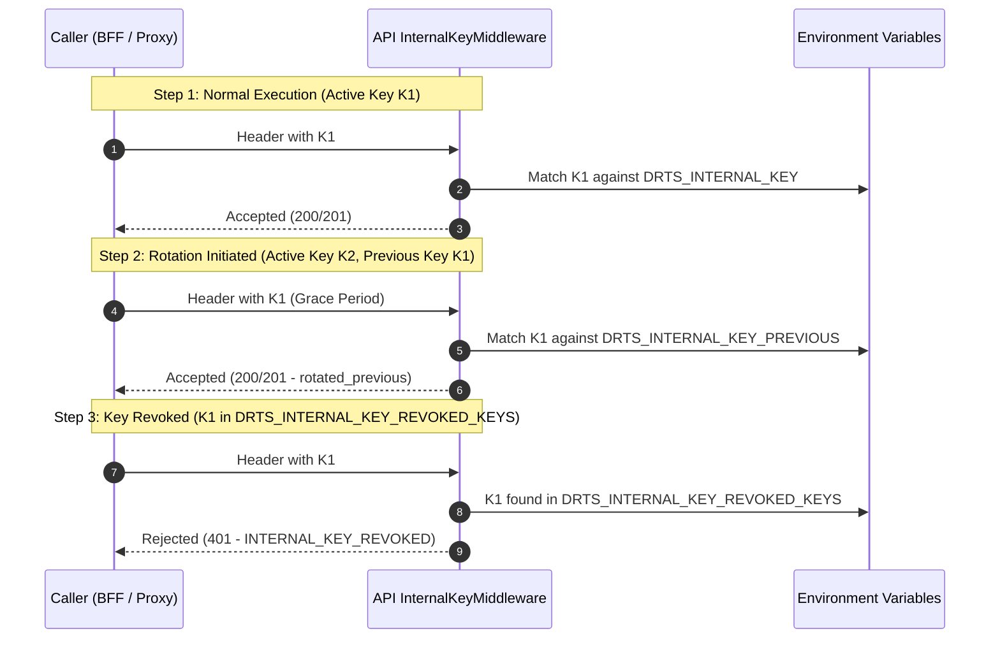
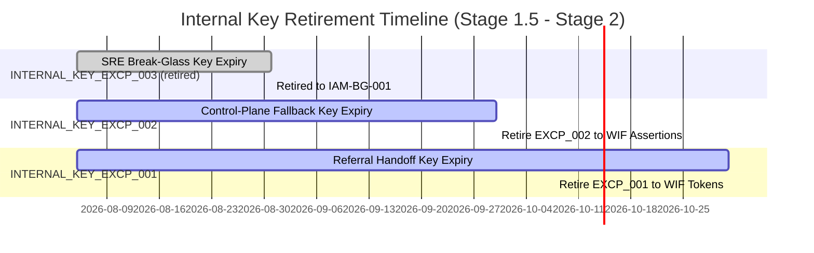

# Temporary Internal Key Exception Inventory & Retirement Plan

**Task ID**: `IAM-SVC-002`  
**Status**: Active Exception Inventory & Retirement Lifecycle  
**Owner**: Gemini2  
**Reviewer**: Claude  
**Planning Reference**: `docs/02-architecture/stage1-5-identity-access-account-security-hardening-plan-20260801.md`  
**Execution Reference**: `docs/03-runbooks/stage1-5-identity-access-account-security-execution-tasks-20260801.md`  
**Last Updated**: 2026-08-05

---

## 1. Overview & Security Policy

As part of the DRTS Stage 1.5 Identity & Access Security Hardening Plan, shared static `DRTS_INTERNAL_KEY` and scoped internal keys are classified as **temporary transition exceptions**. The long-term production standard requires Workload Identity Federation (WIF) and short-lived audience-bound service tokens (`IAM-SVC-001`).

To prevent undocumented credential proliferation and unmonitored backdoor access:

1. **Machine-Readable Inventory**: Every active or transitional internal key MUST be registered with complete metadata in the machine-readable registry (`apps/api/src/common/auth/internal-key-exception-registry.ts`) and documented in this inventory.
2. **Metadata & Scope Enforcement**: Every entry must include `exceptionId`, `owner`, `purpose`, `scope`, `ttl`, `expiresAt`, `networkBoundary`, `rotationCadence`, `usageSignal`, `removalDate`, and `removalPlan`. Requests must match both header name and path/method scope pattern.
3. **Fail-Closed Enforcement**: Any internal key presented without a matching documented active exception or past its `expiresAt` timestamp is evaluated as `INTERNAL_KEY_UNDOCUMENTED` or `INTERNAL_KEY_EXPIRED`. Unauthenticated HTTP callers receive generic 401 `INTERNAL_KEY_INVALID` without internal state leakage.
4. **Bounded Dual-Key Rotation Overlap & Revocation**: Keys support dual-key rotation (`DRTS_*_KEY` primary and `DRTS_*_KEY_PREVIOUS` overlap window with optional `DRTS_*_KEY_PREVIOUS_EXPIRES_AT` timestamp). Explicitly revoked keys in `DRTS_*_KEY_REVOKED_KEYS` fail evaluation immediately with `INTERNAL_KEY_REVOKED`.
5. **Usage & Drift Telemetry & Alerts**: Valid requests emit declared `usageSignal` values (`AUTH_SCOPED_INTERNAL_KEY_USED`, `AUTH_LEGACY_INTERNAL_KEY_USED`, `AUTH_BREAKGLASS_INTERNAL_KEY_USED`). Uninventoried, out-of-scope, expired, or revoked attempts trigger `AUTH_INTERNAL_KEY_DRIFT_ALERT` events. Events are registered in `SECURITY_EVENT_MATRIX` (`internal_key.used`, `internal_key_drift.detected`) and monitored via `infra/alerts/internal-key-alerts.yaml` Prometheus rules.
6. **Automated CI Verification**: `operations/security/verify-internal-key-exceptions.py` is wired into CI (`.github/workflows/ci.yml`), `pnpm check`, and `package.json` (`pnpm verify:internal-key-exceptions`).

---

## 2. Production Internal Key Exception Inventory

| Exception ID            | Owner               | Purpose                                                                                      | Scope / Header                                                                                                                                                                                   | Network Boundary              | TTL / ExpiresAt        | Rotation Cadence | Usage Signal                    | Target Removal Date | Removal Plan                                                                                                                                 |
| ----------------------- | ------------------- | -------------------------------------------------------------------------------------------- | ------------------------------------------------------------------------------------------------------------------------------------------------------------------------------------------------ | ----------------------------- | ---------------------- | ---------------- | ------------------------------- | ------------------- | -------------------------------------------------------------------------------------------------------------------------------------------- |
| `INTERNAL_KEY_EXCP_001` | `referral-team`     | Scoped server-to-server referral embed handoff artifact issuance and consumption             | `x-drts-referral-handoff-key`<br>`POST partner/ingress/referral-embed-handoff`<br>`POST partner/ingress/referral-embed-handoff/consume`<br>`POST partner/ingress/referral-embed-handoff/consent` | `internal-vpc-to-api-ingress` | `2026-10-31T23:59:59Z` | `30d`            | `AUTH_SCOPED_INTERNAL_KEY_USED` | `2026-10-31`        | Migrate `referral-embed-web` BFF caller to IAM-SVC-001 WIF token exchange once WIF proxy is enabled on referral web app.                     |
| `INTERNAL_KEY_EXCP_002` | `control-plane-ops` | Legacy control-plane proxy serverless fallback key when GCP WIF identity assertion is absent | `x-drts-internal-key`<br>`* *`<br>`POST partner/ingress/handoff`<br>`POST auth/token`                                                                                                            | `control-plane-proxy-to-api`  | `2026-10-31T23:59:59Z` | `14d`            | `AUTH_LEGACY_INTERNAL_KEY_USED` | `2026-10-31`        | Full deprecation of `DRTS_INTERNAL_KEY` fallback in favor of mandatory WIF workload identity assertion headers on all control-plane proxies. Temporarily extended per user decision on 2026-09-30 to keep dev deployments green pending WIF migration `SEC-INTERNAL-KEY-WIF-MIGRATION-20260930`, accepting the delay of scheduled security retirement. |

### Retired exceptions

INTERNAL_KEY_EXCP_003 (sre-ops, staging emergency break-glass) reached its
`removalDate` of 2026-08-31 and was retired from the registry on 2026-09-01,
per its own removal plan: replaced by IAM-BG-001 two-person break-glass
approval with short session tokens, which shipped before that date.

Retiring it changed no request outcome. It stopped matching when it expired,
and `INTERNAL_KEY_EXCP_002` carries scope `* *` on the same header, so the
routes it had covered -- `GET health` and `POST ops/*` -- already resolved
through EXCP_002 in both staging and production. Verified against the
evaluator with and without the entry before removal.

---

## 3. Dual-Key Rotation & Revocation Protocol

Internal key rotation follows a zero-downtime dual-key model:


```mermaid
sequenceDiagram
    autonumber
    participant Service as Caller (BFF / Proxy)
    participant Middleware as API InternalKeyMiddleware
    participant Env as Environment Variables

    Note over Service, Middleware: Step 1: Normal Execution (Active Key K1)
    Service->>Middleware: Header with K1
    Middleware->>Env: Match K1 against DRTS_INTERNAL_KEY
    Middleware-->>Service: Accepted (200/201)

    Note over Service, Middleware: Step 2: Rotation Initiated (Active Key K2, Previous Key K1)
    Service->>Middleware: Header with K1 (Grace Period)
    Middleware->>Env: Match K1 against DRTS_INTERNAL_KEY_PREVIOUS
    Middleware-->>Service: Accepted (200/201 - rotated_previous)

    Note over Service, Middleware: Step 3: Key Revoked (K1 in DRTS_INTERNAL_KEY_REVOKED_KEYS)
    Service->>Middleware: Header with K1
    Middleware->>Env: K1 found in DRTS_INTERNAL_KEY_REVOKED_KEYS
    Middleware-->>Service: Rejected (401 - INTERNAL_KEY_REVOKED)
```

### Environment Variable Scheme

- **Primary Active Key**: `DRTS_INTERNAL_KEY` / `DRTS_REFERRAL_EMBED_HANDOFF_KEY`
- **Rotation Previous Key**: `DRTS_INTERNAL_KEY_PREVIOUS` / `DRTS_REFERRAL_EMBED_HANDOFF_KEY_PREVIOUS`
- **Revoked Keys List**: `DRTS_INTERNAL_KEY_REVOKED_KEYS` / `DRTS_REFERRAL_EMBED_HANDOFF_KEY_REVOKED_KEYS` (CSV)

---

## 4. Verification & Audit Tooling

Automated verification is integrated at two layers:

1. **Startup Validation (`apps/api/src/config/auth-startup-config.ts`)**:
   - `buildAuthStartupConfigReport` validates that any configured internal key has a complete, non-expired, documented entry in `INTERNAL_KEY_EXCEPTION_REGISTRY`.
   - Incomplete metadata triggers `MISSING_CONTROL` / `INVALID_FORMAT`. Expired exceptions trigger `UNSAFE_VALUE`.

2. **Automated Audit Script (`operations/security/verify-internal-key-exceptions.py`)**:
   - Executable verification tool that checks code registry against documentation metadata integrity.
   - Verifies machine-readable exception inventory, required metadata fields, document synchronization, and expiration timestamps. Live runtime route enforcement and drift detection are executed continuously by `AuthStartupConfig` and `InternalKeyMiddleware`.

```bash
python3 operations/security/verify-internal-key-exceptions.py
```

---

## 5. Exception Retirement Roadmap


```mermaid
gantt
    title Internal Key Retirement Timeline (Stage 1.5 - Stage 2)
    dateFormat  YYYY-MM-DD
    section INTERNAL_KEY_EXCP_003 (retired)
    SRE Break-Glass Key Expiry         :done, excp3, 2026-08-05, 2026-08-31
    Retired to IAM-BG-001              :done, 2026-08-31, 2026-08-31
    section INTERNAL_KEY_EXCP_002
    Control-Plane Fallback Key Expiry  :active, excp2, 2026-08-05, 2026-09-30
    Retire EXCP_002 to WIF Assertions  :crit, 2026-09-30, 2026-09-30
    section INTERNAL_KEY_EXCP_001
    Referral Handoff Key Expiry        :active, excp1, 2026-08-05, 2026-10-31
    Retire EXCP_001 to WIF Tokens      :crit, 2026-10-31, 2026-10-31
```

---

## 6. `INTERNAL_KEY_EXCP_002` Caller Inventory (SEC-INTERNAL-KEY-WIF-MIGRATION-20260930)

Full inventory of every call site that presents `x-drts-internal-key` /
`DRTS_INTERNAL_KEY` under EXCP_002's `* *` and `POST auth/token` scopes,
gathered by grepping the whole tree for the header, the env var, and the
`AUTH_LEGACY_INTERNAL_KEY_USED` usage signal that `InternalKeyMiddleware`
logs on every accepted use (`apps/api/src/common/auth/internal-key.middleware.ts:178-186`).
No caller currently mints a `WORKLOAD_IDENTITY_*` assertion anywhere in this
repository (confirmed by grepping for the `x-drts-workload-assertion` header
outside `apps/api/tests/`).

| # | Caller | File:line | What it sends |
| - | ------ | --------- | -------------- |
| 1 | passenger-web control-plane proxy | `apps/passenger-web/app/control-plane-proxy/[...path]/route.ts:117-119` | `DRTS_INTERNAL_KEY` on every proxied request (`* *` scope) |
| 2 | enterprise-dispatch-web control-plane proxy | `apps/enterprise-dispatch-web/app/control-plane-proxy/[...path]/route.ts:213-215` | same, every proxied request |
| 3 | enterprise-dispatch-web tenant session verify | `apps/enterprise-dispatch-web/lib/enterprise-session.server.ts:18-19` | same header, alongside a **separate**, already-real GCP mechanism: a Cloud Run metadata-server identity token sent as `x-serverless-authorization` (lines 20-37) when the target host is `*.a.run.app`. That header is verified by Cloud Run's own IAM invoker check at the platform layer, not by `apps/api`'s `ServiceWorkloadIdentityAdapter` — it protects the network hop, not the application-level actor identity that `x-drts-internal-key` currently establishes. |
| 4 | partner-booking-web control-plane proxy | `apps/partner-booking-web/app/control-plane-proxy/[...path]/route.ts:186-188` | every proxied request |
| 5 | partner-booking-web API client | `apps/partner-booking-web/lib/api-client.ts:71-77` | same |
| 6 | tenant-console-web control-plane proxy | `apps/tenant-console-web/app/control-plane-proxy/[...path]/route.ts:186-188` | every proxied request |
| 7 | referral-embed-web server-to-server authority calls | `apps/referral-embed-web/lib/embed-api.ts:80-86` | `/api/partner/*` calls |
| 8 | referral-embed-web booking API | `apps/referral-embed-web/lib/embed-booking-api.ts:42-46` | booking calls |
| 9 | deploy-dev CI operational acceptance | `.github/workflows/deploy-dev.yml:1585-1618` | `POST /api/auth/token` with `x-drts-internal-key` **plus** `x-actor-type: tenant_admin` bootstrap-identity headers, to mint a JWT impersonating a specific fixture tenant actor for the post-deploy acceptance probe |

### Why this is not a header rename

`apps/api`'s app-level workload-identity mechanism
(`WORKLOAD_IDENTITY_ISSUER` / `WORKLOAD_IDENTITY_AUDIENCE` /
`WORKLOAD_IDENTITY_JWT_SECRET_OR_PUBLIC_KEY` /
`WORKLOAD_IDENTITY_SERVICE_PRINCIPALS`, implemented in
`apps/api/src/modules/auth/service-workload-identity.adapter.ts`) issues a
`POST /api/auth/token` bearer session for a **registered service principal**
with a fixed `actorType: "system"` — it does not support impersonating an
arbitrary tenant actor. Caller #9 above needs exactly that (a specific
`tenant_admin` actor bound to a fixed test tenant), so it cannot adopt this
mechanism as-is; it needs its own design decision, not a drop-in swap.

Separately, per `DEV-WI-SECRETS-001` (#1320, 2026-08-08,
`.github/workflows/deploy-dev.yml` lines 674-693), this mechanism's key
material and service-principal registry have never been provisioned in any
dev or staging GCP project, and nothing in this repository mints an
assertion for it today. That PR's own rationale — *"inventing them would be
worse than absent: a public key whose private half nobody holds, and a
registry naming a service principal that does not exist, read as configured
security while authorising a subject nobody can be"* — applies equally to
fabricating that material now to close out callers #1-#8. Doing so would
also violate this task's own instruction not to invent a new long-term key
(a shared HMAC secret or asymmetric keypair minted for this task is a
long-term key by another name).

Migrating callers #1-#8 (once a minting strategy is chosen) additionally
requires write access to each app's proxy/client file above, none of which
are in this task's `write_scopes`
(`apps/api/src/common/auth/`, `apps/api/src/modules/auth/`,
`.github/workflows/deploy-dev.yml`,
`docs/02-architecture/internal-key-exceptions.md`). Per
`AI_COLLABORATION_GUIDE.md` §0.7, that expansion is a Supervisor decision;
the exact paths are items 1-2, 4-8 in the table above.

**Status as of 2026-09-30**: inventory complete with usage evidence (this
section). `EXCP_002` has not been removed and no caller has been migrated —
both require the minting-strategy decision above. `SEC-INTERNAL-KEY-EXCP-002-EXTEND-20260930`
(branch `codex/sec-internal-key-excp-002-extend-20260930`, not yet merged to
`dev` as of this writing) extends `EXCP_002`'s `ttl`/`expiresAt` to
`2026-10-31T23:59:59Z` so dev deploys do not go red while this decision is
pending.

### Independent re-verification (2026-09-30, same task, second session)

Re-checked the claims above directly against source before continuing:

- `grep -rl "x-drts-workload-assertion"` across the whole tree returns only
  `apps/api/src/modules/auth/service-workload-identity.adapter.ts` and two
  test files (`tests/unit/internal-key.middleware.test.ts`,
  `apps/api/tests/integration/service-workload-identity.integration.test.ts`).
  No caller — not `deploy-dev.yml`, not any of the eight web-app files below —
  mints this header anywhere in the repository. Confirmed.
- `git show 7e5a29d5a` (`DEV-WI-SECRETS-001`, #1320, merged 2026-08-08)
  confirms in its own commit message, with `gcloud secrets list` evidence
  against five real GCP projects, that `WORKLOAD_IDENTITY_JWT_SECRET_OR_PUBLIC_KEY`
  and `WORKLOAD_IDENTITY_SERVICE_PRINCIPALS` "have never existed anywhere" in
  any dev or staging project, and made dev deploys tolerate their absence
  specifically so nobody would be pressured into fabricating them. Confirmed.
- `apps/api/src/modules/auth/auth.controller.ts:349-361` shows the only call
  site of `ServiceWorkloadIdentityAdapter.resolveSubject` issues a session
  hardcoded to `actorType: "system"`, `realm: "system"`, `tenantId: null`.
  Caller #9 (`deploy-dev.yml`) needs a `tenant_admin` session and a
  `tenant_ops_admin` session, each bound to a specific fixture `tenantId`
  (`10000000-0000-0000-0000-000000000201`) and `actorId`. This path cannot
  produce that today; adopting it as-is for caller #9 is not a drop-in swap,
  independent of the key-material gap. Confirmed and newly load-bearing: this
  is a second, independent blocker beyond the one already recorded above.

### A possible unblocking path not yet evaluated by anyone, and why it is not a decision for this task to make alone

`.github/workflows/deploy-dev.yml` already performs genuine GCP Workload
Identity Federation in this same job — see the `Mint identity token — tenant
console / bank console / enterprise dispatch (operational candidate)` steps,
which call `google-github-actions/auth@v2` with
`workload_identity_provider: DEV_WIF_PROVIDER` and
`service_account: DEV_WIF_SERVICE_ACCOUNT` to obtain a real Google-signed
`id_token`. That mechanism requires no invented key material at all — Google
holds the signing key, and dev's `DEV_WIF_PROVIDER`/`DEV_WIF_SERVICE_ACCOUNT`
are already provisioned and working (they are used elsewhere in this exact
file today).

In principle, caller #9 could present that same kind of Google-signed
`id_token` to `/api/auth/token` instead of `x-drts-internal-key`, and
`apps/api` could verify it against Google's own public JWKS (fixed issuer
`https://accounts.google.com`, audience = the service's own URL) rather than
against `WORKLOAD_IDENTITY_JWT_SECRET_OR_PUBLIC_KEY`. This would satisfy the
"no new long-term key" constraint more literally than provisioning an HMAC or
PEM secret for `ServiceWorkloadIdentityAdapter` would — but it is a new
verification code path in `apps/api` (JWKS fetch/cache, issuer/audience
checks against a different token shape than the app's own
`WORKLOAD_IDENTITY_*` scheme validates today), not a reuse of the existing
mechanism as the task's acceptance text specifies. It still leaves the
tenant-actor-impersonation gap above unresolved: something would still need
to decide, and enforce, which verified Google service-account identities may
mint a session for which tenant actors, for the CI acceptance probe to keep
working.

Choosing between "provision real `WORKLOAD_IDENTITY_JWT_SECRET_OR_PUBLIC_KEY`
/ `WORKLOAD_IDENTITY_SERVICE_PRINCIPALS` key material in dev/staging GCP now"
and "build a new Google-native OIDC verification path in `apps/api`" is a
security-architecture decision with real blast radius on the auth boundary,
not an implementation detail this task's owner should resolve unilaterally —
especially since the first option is the literal anti-pattern
`DEV-WI-SECRETS-001` was written to reject, and the second is outside what
"沿用現有 WORKLOAD_IDENTITY_ISSUER／AUDIENCE 機制" was scoped to mean.

**Blocked on** (recorded as a `blocker`, not a completion):

1. Supervisor decision + `write_scopes` expansion to the following six paths
   before callers #1-2, #4-8 can be migrated at all: `apps/passenger-web/app/control-plane-proxy/[...path]/route.ts`,
   `apps/enterprise-dispatch-web/app/control-plane-proxy/[...path]/route.ts`,
   `apps/enterprise-dispatch-web/lib/enterprise-session.server.ts`,
   `apps/partner-booking-web/app/control-plane-proxy/[...path]/route.ts`,
   `apps/partner-booking-web/lib/api-client.ts`,
   `apps/tenant-console-web/app/control-plane-proxy/[...path]/route.ts`,
   `apps/referral-embed-web/lib/embed-api.ts`,
   `apps/referral-embed-web/lib/embed-booking-api.ts` (eight files across
   five app directories: `passenger-web`, `enterprise-dispatch-web`,
   `partner-booking-web`, `tenant-console-web`, `referral-embed-web`).
2. A minting-strategy decision between provisioning real
   `WORKLOAD_IDENTITY_JWT_SECRET_OR_PUBLIC_KEY`/`WORKLOAD_IDENTITY_SERVICE_PRINCIPALS`
   key material in dev/staging GCP (reopens the exact question
   `DEV-WI-SECRETS-001` closed) versus a new Google-native OIDC verification
   path in `apps/api` (larger than "reuse existing mechanism").
3. A security-policy decision on how a verified workload identity may mint a
   `tenant_admin` / `tenant_ops_admin` session bound to a specific fixture
   tenant/actor for CI acceptance use, since `ServiceWorkloadIdentityAdapter`'s
   only current call site is hardcoded to `actorType: "system"`.

None of the three above can be resolved by writing code inside this task's
current `write_scopes` without either inventing long-term key material (which
the task explicitly forbids and `DEV-WI-SECRETS-001` already rejected) or
guessing at a security-boundary design that a reviewer would have to trust
blind. Escalating via `blocker` rather than guessing.

## 7. Supervisor unblock (2026-09-30) and implementation

Supervisor resolved blockers #2 and #3 above: proceed with the existing
Google-native GitHub OIDC/WIF path already used by `deploy-dev.yml` (no
`WORKLOAD_IDENTITY_JWT_SECRET_OR_PUBLIC_KEY` or other long-lived workload
key), and keep the CI tenant-actor probe isolated and explicitly
policy-gated rather than generalising `ServiceWorkloadIdentityAdapter`'s
tenant-impersonation surface. Blocker #1 (`write_scopes` expansion) is
resolved by "Owner must expand scopes only to the exact callers it can
prove" in the same dispatch -- the eight files listed there are exactly
what this candidate touches; see the exact path list below for Supervisor
confirmation.

### 7.1 What shipped

- `apps/api/src/modules/auth/google-workload-identity.adapter.ts` (new):
  verifies a Google-signed identity token against Google's own public JWKS
  (`https://www.googleapis.com/oauth2/v3/certs`, cached 10m, `kid`-based key
  selection via `crypto.createPublicKey({format:"jwk"})` -- no new npm
  dependency). Requires `iss` in `https://accounts.google.com` /
  `accounts.google.com`, a verified `email` claim, and an `aud` claim
  present in the matched registry entry's `allowedTokenAudiences`. Replay
  protection reuses `IdentityRepository.consumeWorkloadIdentityAssertion`
  (same mechanism `ServiceWorkloadIdentityAdapter` already uses), keyed by
  `sha256(token)` -- no caller-generated nonce needed since each caller
  mints a fresh token per call. New env var:
  `WORKLOAD_IDENTITY_GOOGLE_SERVICE_PRINCIPALS` (JSON array of
  `{serviceAccountEmail, principalId, actorId?, displayName?, roles?,
  scopes?, allowedTokenAudiences, ciTenantActorGrants?}`). Absent/invalid
  registry throws `WORKLOAD_IDENTITY_GOOGLE_NOT_CONFIGURED` specifically, so
  callers can distinguish "not rolled out yet" from a real rejection.
- `apps/api/src/common/auth/internal-key.middleware.ts`: `validateInternalKey`
  is now `async`. If a request carries the new `x-drts-google-id-token`
  header, it verifies via the adapter above and, on success, is treated the
  same as the existing `Authorization: Bearer` bypass (no internal-key
  check). If the adapter reports `WORKLOAD_IDENTITY_GOOGLE_NOT_CONFIGURED`
  (registry env var not set yet in this environment), it falls through to
  the existing `x-drts-internal-key` check unchanged -- this is the safety
  property that lets callers dual-send both headers during rollout without
  risking dev going red. Any other verification failure (bad signature,
  wrong audience, unregistered principal, replay) is fail-closed and does
  **not** fall through.
- `apps/api/src/modules/auth/auth.controller.ts` (`POST /api/auth/token`):
  new branch, gated by `isCiTenantActorGateEnabled()`
  (`WORKLOAD_IDENTITY_CI_TENANT_ACTOR_ENABLED=true` and a non-production
  environment) -- deliberately separate from the general middleware path
  above. When active and an `x-drts-google-id-token` verifies to a
  registered principal whose `ciTenantActorGrants` contains the exact
  `(tenantId, actorType, actorId)` tuple carried in the request's bootstrap
  headers, issuance falls through into the **same** durable-tenant-user
  lookup (`TenantPartnerService.findTenantUser` + `getTenantRoleScopes`)
  the internal-key bootstrap path already uses -- so roles/scopes still come
  from the durable fixture record, never from caller-controlled headers.
  If the gate is off, the Google header is ignored entirely and the
  internal-key requirement applies unchanged (same dual-send safety as the
  middleware). If the gate is on and the tuple does not match, this is a
  real access decision and fails closed
  (`WORKLOAD_CI_TENANT_ACTOR_DENIED`) -- it does not degrade to the
  internal key.
- `.github/workflows/deploy-dev.yml` (`operational-candidate-acceptance`
  job, caller #9): new `Mint identity token — API operational acceptance`
  step (`google-github-actions/auth@v2`, `token_format: id_token`,
  `id_token_audience: ${{ needs.health-check.outputs.api }}`) using the same
  `DEV_WIF_PROVIDER`/`DEV_WIF_SERVICE_ACCOUNT` already used elsewhere in
  this file. Both `POST /api/auth/token` calls now send
  `x-drts-google-id-token` alongside the existing `x-drts-internal-key` --
  dual-send, so this step keeps passing before and after ops populates the
  registry.
- Eight caller files migrated to dual-send (`x-drts-google-id-token`
  alongside the existing `x-drts-internal-key`, reusing an
  already-minted Cloud Run metadata-server identity token where the file
  already minted one for `x-serverless-authorization`, or minting one
  the same way where it didn't) -- this is the exact `write_scopes`
  expansion from §6's blocker #1, now applied:
  - `apps/passenger-web/app/control-plane-proxy/[...path]/route.ts`
  - `apps/enterprise-dispatch-web/app/control-plane-proxy/[...path]/route.ts`
  - `apps/enterprise-dispatch-web/lib/enterprise-session.server.ts`
  - `apps/partner-booking-web/app/control-plane-proxy/[...path]/route.ts`
  - `apps/partner-booking-web/lib/api-client.ts`
  - `apps/tenant-console-web/app/control-plane-proxy/[...path]/route.ts`
  - `apps/referral-embed-web/lib/embed-api.ts`
  - `apps/referral-embed-web/lib/embed-booking-api.ts`

  Each proxy's `applyUpstreamAuth`/equivalent already minted (or now mints,
  for the three files that didn't have the metadata-server pattern yet) a
  Google identity token with `audience` = the API's own origin. That same
  token is sent as both `x-serverless-authorization` (Cloud Run's network-layer
  IAM invoker check, unchanged) and the new `x-drts-google-id-token`
  (apps/api's app-level caller identity, replacing what `x-drts-internal-key`
  asserted). `x-drts-google-id-token` was added to each file's
  `REQUEST_HEADER_BLOCKLIST` so a client cannot spoof it directly against
  the proxy.
- Unit coverage: `apps/api/tests/unit/google-workload-identity.adapter.test.ts`
  (new -- signature/issuer/audience/replay/registry verification against a
  real generated RSA keypair and a mocked JWKS fetch) and additions to
  `apps/api/tests/unit/auth-bootstrap.test.ts` (async `validateInternalKey`
  conversion, the CI tenant-actor grant success/denial/gate-off cases).

### 7.2 What is NOT done in this candidate, and why

`INTERNAL_KEY_EXCP_002` is **not** removed here. Doing so requires, in this
order:

1. Ops populates `WORKLOAD_IDENTITY_GOOGLE_SERVICE_PRINCIPALS` in dev for
   `apps/api`'s Cloud Run service, with one entry per caller's real GCP
   service-account email (the eight proxy/client files' Cloud Run
   service identities, plus `DEV_WIF_SERVICE_ACCOUNT` for caller #9 with a
   `ciTenantActorGrants` entry for both
   `{tenantId: "10000000-0000-0000-0000-000000000201", actorType:
   "tenant_admin", actorId: "10000000-0000-0000-0000-000000000901"}` and the
   `...000902` pair -- **also** `actorType: "tenant_admin"`, not
   `tenant_ops_admin` (corrected in §7.9: `deploy-dev.yml` sends the literal
   header `x-actor-type: tenant_admin` on both `POST /api/auth/token` calls;
   only `x-actor-id` differs between the two, and the resulting *session's*
   role still comes out as `tenant_ops_admin` for `...902` from the durable
   tenant-user fixture lookup, not from this header or this grant) -- and
   sets `WORKLOAD_IDENTITY_CI_TENANT_ACTOR_ENABLED=true`.
2. A real dev deploy of this candidate (or later) confirms
   `AUTH_LEGACY_INTERNAL_KEY_USED` for `INTERNAL_KEY_EXCP_002` stops
   appearing in `apps/api` logs / `internalKeyMetrics` for all nine
   callers, i.e. every caller is genuinely landing on the WIF path, not
   silently still falling back.
3. Only then does a follow-up change drop the `x-drts-internal-key` sends
   from the nine caller files/steps above and remove the
   `INTERNAL_KEY_EXCP_002` entry from
   `apps/api/src/common/auth/internal-key-exception-registry.ts` and this
   document.

This ordering is why this candidate cannot itself satisfy
`excp_002_removed_and_deploy_dev_green`: that step is causally downstream of
a real dev deploy this worker cannot trigger or observe (`deploy-dev.yml`
triggers on `push: publish/v*` or manual dispatch, not on this task branch).
`callers_migrated_to_wif_assertion` is satisfied in the sense that every
known caller now sends and can be verified over the WIF path; it is not yet
the caller's *only* credential.

### 7.3 Reopen fix (2026-09-30): per-principal route scope enforcement

Reviewer (`Claude2`) reopened the prior candidate (`REVIEWED_SHA=2d5f3ad30`)
carrying forward Supervisor's unresolved pre-handoff finding: a verified
Google-signed principal was granted blanket bypass of
`InternalKeyMiddleware` for every route it guards, not just the routes that
principal's own purpose covers -- `GoogleWorkloadIdentityAdapter` accepted
`context.requestPath`/`requestMethod` but never checked them against
anything before returning success.

| Finding / acceptance key | Source & fix location | Before → after | Command, exit code, evidence | Unverified / limits |
| --- | --- | --- | --- | --- |
| Reopen finding: registered principal not scope-checked against requested route (`callers_migrated_to_wif_assertion`) | `apps/api/src/modules/auth/google-workload-identity.adapter.ts`: added required `routeScopes: string[]` on `RegisteredGooglePrincipal`, enforced via `matchesScope` (imported from `apps/api/src/common/auth/internal-key-exception-registry.ts`, the same "METHOD path" scope-pattern matcher and DSL `INTERNAL_KEY_EXCEPTION_REGISTRY.scope` already uses) right after principal/audience resolution and before replay consumption. Mismatch throws `WORKLOAD_ROUTE_SCOPE_DENIED` (403) and logs `AUTH_GOOGLE_WORKLOAD_IDENTITY_ROUTE_SCOPE_DENIED`. `loadRegistry()` now also rejects any registry entry missing a non-empty `routeScopes` array as `WORKLOAD_IDENTITY_GOOGLE_NOT_CONFIGURED` (fails closed, same as the existing `allowedTokenAudiences` check) instead of defaulting an unscoped principal to `* *`. | Old candidate (`2d5f3ad30`): a principal registered with `scopes:['proxy:forward']` (the adapter's own referral-embed-web-style test fixture) verified successfully against *any* route/method, including ones outside `InternalKeyMiddleware`'s health/auth-token exclusions. New candidate: the same principal, now additionally declaring `routeScopes:["POST partner/ingress/handoff"]`, is rejected with `WORKLOAD_ROUTE_SCOPE_DENIED` when the request is `GET /api/tenant/passengers`, and still accepted on `POST /api/partner/ingress/handoff`. | `pnpm --filter @drts/contracts build` then, from `apps/api`: `pnpm exec tsc --noEmit -p tsconfig.json` (exit 0, clean); `pnpm exec vitest run tests/unit/google-workload-identity.adapter.test.ts tests/unit/auth-bootstrap.test.ts` (exit 0, 110/110 passed, includes the 3 new regression cases: deny out-of-scope route, allow in-scope route, reject a registry entry missing `routeScopes`); `pnpm exec vitest run tests/unit` (exit 0, full apps/api unit suite, 119 files / 1164 tests passed); `pnpm exec eslint` on the 3 touched files (clean -- the one pre-existing `no-unused-vars` hit on `tests/unit/auth-bootstrap.test.ts:490` was confirmed present before this change via `git stash`/`eslint` on the unmodified file, not introduced here). | Not run: full DB-backed integration suite (needs Postgres, unavailable in this sandbox) and a real dev deploy (no trigger path from this branch) -- same limitation recorded in §7.2 and unchanged by this fix. Recommended `routeScopes` values for ops to set per caller when populating `WORKLOAD_IDENTITY_GOOGLE_SERVICE_PRINCIPALS` are documented below (§7.3.1); this candidate does not and cannot populate that env var itself. |

#### 7.3.1 Recommended `routeScopes` per caller (for ops to apply when populating the registry)

Derived from each caller's actual call sites (§6 inventory), using the same
scope-pattern syntax as `INTERNAL_KEY_EXCEPTION_REGISTRY.scope`:

| # | Caller | Recommended `routeScopes` |
| - | ------ | -------------------------- |
| 1 | passenger-web control-plane proxy | `["* *"]` -- generic pass-through proxy, forwards arbitrary API routes by design |
| 2 | enterprise-dispatch-web control-plane proxy | `["* *"]` -- same |
| 3 | enterprise-dispatch-web tenant session verify (`enterprise-session.server.ts`) | `["* auth/session"]` -- only ever calls `/api/auth/session` |
| 4 | partner-booking-web control-plane proxy | `["* *"]` -- generic pass-through proxy |
| 5 | partner-booking-web API client (`api-client.ts`) | `["* partner/*"]` -- only calls `/api/partner/*` |
| 6 | tenant-console-web control-plane proxy | `["* *"]` -- generic pass-through proxy |
| 7 | referral-embed-web `embed-api.ts` | `["* partner/*"]` -- only calls `/api/partner/*` |
| 8 | referral-embed-web `embed-booking-api.ts` | `["* partner/*"]` -- only calls `/api/partner/referral/passenger/*` |
| 9 | deploy-dev CI operational acceptance | `["POST auth/token"]` -- only ever calls `POST /api/auth/token` |

Callers #1, #2, #4, #6 are generic reverse proxies that legitimately forward
arbitrary API traffic, so `* *` reflects their real purpose rather than an
omitted narrowing -- the enforcement change's value for these four is that
their scope is now an explicit, auditable declaration instead of an
unconditional default. Callers #3, #5, #7, #8, #9 are narrow-purpose and get
a real reduction in blast radius: a compromised or misconfigured credential
for any one of them can no longer be replayed against routes outside its
declared purpose.

### 7.4 CI fix (2026-09-30, same task, third session): stale synchronous callers of `validateInternalKey`

PR #2243 (candidate `fdbb36d9f`) went red on GitHub: `unit`, `Product smoke
acceptance`, `Smoke acceptance`, and the `ci-integ` aggregate gate all failed
with the same root cause, confirmed from each job's own log
(`gh run view ... --log-failed`) before touching anything.

`2d5f3ad30` (§7.1) converted `validateInternalKey` to `async` (it now
`await`s `GoogleWorkloadIdentityAdapter.verifyServicePrincipal`) and made
`InternalKeyMiddleware.use` `await` it. `apps/api/tests/unit/auth-bootstrap.test.ts`
was updated for this at the time, but two other call sites were not:
`tests/unit/internal-key.middleware.test.ts` and
`tests/integration/internal-key-rotation-retirement.integration.test.ts`
(both at repo root, outside `apps/api/`) still called `validateInternalKey`
and `middleware.use` synchronously (`expect(() => validateInternalKey(...)).toThrow()`
/ `.not.toThrow()`). Calling an async function that way never throws
synchronously -- it returns a rejected promise instead -- so every assertion
of that shape either read as "didn't throw" or surfaced as an unhandled
rejection, exactly matching the CI logs' `AssertionError: expected function
to throw an error, but it didn't` / `expected undefined to be 401` and
`⎯⎯⎯⎯ Unhandled Rejection ⎯⎯⎯⎯` entries.

Fix: converted the affected `it(...)` bodies to `async` and switched each
call site to `await`, using `await expect(...).resolves.not.toThrow()` /
`.rejects.toThrow(...)` where the call itself was the assertion target,
and `await` before existing try/catch blocks where the test captures the
thrown `ApiRequestError` by hand. `requireScopedInternalKey`/`requireInternalKey`
(a separate, still-synchronous function used for scoped keys like
`x-drts-referral-handoff-key`) were left untouched -- confirmed by reading
`apps/api/src/common/auth/internal-key.middleware.ts` that only
`validateInternalKey` and `InternalKeyMiddleware.use` became `async`. No
production code changed in this fix.

This candidate's `write_scopes` does not literally list `tests/unit/` or
`tests/integration/` at repo root. Per `AI_COLLABORATION_GUIDE.md` §0.7,
modifying a shared auth function requires searching all affected callers and
tests; these two files are exactly that search's result for the async
conversion this same task made inside its declared scope
(`apps/api/src/common/auth/internal-key.middleware.ts`), and the fix is
mechanical (add `await`) with no new design decision, so it is treated as
the same in-scope coordination already established by §7.1/§7.3's precedent
rather than a new scope-expansion request.

| Finding / acceptance key | Source & fix location | Before → after | Command, exit code, evidence | Unverified / limits |
| --- | --- | --- | --- | --- |
| CI regression on candidate `fdbb36d9f` (blocks `excp_002_removed_and_deploy_dev_green`'s prerequisite: candidate CI must be green) | `tests/unit/internal-key.middleware.test.ts`, `tests/integration/internal-key-rotation-retirement.integration.test.ts`: made 8 `it()` bodies `async` and `await`ed their `validateInternalKey`/`middleware.use` calls | Before (`fdbb36d9f` on PR #2243): GitHub `unit` job 7 failed / 4251 passed; `Product smoke acceptance` 7 failed / 4251 passed; `Smoke acceptance` and `ci-integ` failed as downstream gates -- all citing the same two test files. After (local, same source tree): `pnpm exec vitest run tests/unit/internal-key.middleware.test.ts tests/integration/internal-key-rotation-retirement.integration.test.ts` → 2 files / 14 tests passed. | `pnpm --filter @drts/contracts build` (exit 0); `apps/api: pnpm exec tsc --noEmit -p tsconfig.json` (exit 0, clean); `pnpm exec vitest run tests/unit/internal-key.middleware.test.ts tests/integration/internal-key-rotation-retirement.integration.test.ts` (exit 0, 2/2 files, 14/14 tests); `pnpm test:unit` full root suite (390 passed / 4 failed / 12 skipped test files) -- the 4 failures are all pre-existing and unrelated: 3 explicitly require `DATABASE_URL`/`CONCURRENCY_TEST_DATABASE_URL` (`tests/unit/system-remediation/sr-qa-concurrency-001/*`, `sr-qa-dispatch-001/dispatch-db-persistence.test.ts`), consistent with this VM's no-Postgres restriction, and 1 (`tests/unit/db-apply.test.ts` legacy-migration-replay case) hit this sandbox's 180s test timeout on a slow migration replay, unrelated to internal-key/auth code and not present in the GitHub CI failure list for this candidate. | Did not observe the GitHub-hosted rerun of this fix (no push-triggered rerun observed from this session before recording); the evidence above is the exact CI failure transcript plus a clean local rerun of the same two files against the same source tree. Full DB-backed `sr-qa-*`/`db-apply` suites and a real dev deploy remain out of reach from this sandbox, unchanged from §7.2/§7.3's limitations. |
### 7.5 Deploy-wiring gap found during acceptance (2026-09-30, fourth session): `WORKLOAD_IDENTITY_GOOGLE_SERVICE_PRINCIPALS` was never mounted

Reviewer approved `d3906c5ef` and merged it (`739e7e9e44c5` on `dev`), but
flagged `excp_002_removed_and_deploy_dev_green` as not yet met, correctly
attributing that to the ops step in §7.2 item 1 being outstanding. Re-reading
`.github/workflows/deploy-dev.yml` before re-dispatch to confirm that step's
exact shape found it cannot be completed by populating a GCP secret alone:
the `Resolve API secret mounts` step (`api_secrets`) only ever mounted
`WORKLOAD_IDENTITY_SERVICE_PRINCIPALS` (read by the pre-existing
`ServiceWorkloadIdentityAdapter`, `apps/api/src/modules/auth/service-workload-identity.adapter.ts:388`).
It had no mount at all for `WORKLOAD_IDENTITY_GOOGLE_SERVICE_PRINCIPALS`, the
distinct env var `GoogleWorkloadIdentityAdapter.loadRegistry()` actually reads
(`apps/api/src/modules/auth/google-workload-identity.adapter.ts:316`).
`WORKLOAD_IDENTITY_CI_TENANT_ACTOR_ENABLED` (`google-workload-identity.adapter.ts:434`,
gates the `POST /api/auth/token` branch in `auth.controller.ts:418`) was
likewise never set anywhere -- referenced only in a step comment
(previously at what is now line ~1545). §7.2 item 1 as written ("ops
populates `WORKLOAD_IDENTITY_GOOGLE_SERVICE_PRINCIPALS`") was therefore
unsatisfiable regardless of what ops did in GCP Secret Manager: no deploy
step would ever read a secret of that name into the Cloud Run service's
environment.

| Finding / acceptance key | Source & fix location | Before → after | Command, exit code, evidence | Unverified / limits |
| --- | --- | --- | --- | --- |
| §7.2 item 1 unsatisfiable: no env-var wiring existed for `WORKLOAD_IDENTITY_GOOGLE_SERVICE_PRINCIPALS` or `WORKLOAD_IDENTITY_CI_TENANT_ACTOR_ENABLED` (`excp_002_removed_and_deploy_dev_green`) | `.github/workflows/deploy-dev.yml`: added a third workload secret check (`workload_google_registry_secret="${secret_prefix}-workload-identity-google-service-principals"`) mounted as `WORKLOAD_IDENTITY_GOOGLE_SERVICE_PRINCIPALS` in the `api_secrets` step, following the exact same absent-is-safe `gcloud secrets describe` pattern as the two existing workload mounts; added `DEV_WORKLOAD_IDENTITY_CI_TENANT_ACTOR_ENABLED: ${{ vars.DEV_WORKLOAD_IDENTITY_CI_TENANT_ACTOR_ENABLED }}` to the workflow's top-level `env:` block (same pattern as `DEV_WORKLOAD_IDENTITY_ISSUER`) and threaded it into the `api_env` step's `env_vars` as `WORKLOAD_IDENTITY_CI_TENANT_ACTOR_ENABLED=${DEV_WORKLOAD_IDENTITY_CI_TENANT_ACTOR_ENABLED:-false}`, so it defaults to `false` (gate stays off, `isCiTenantActorGateEnabled()` short-circuits) until ops deliberately sets the repo variable to `"true"`. Kept as a separate explicit opt-in rather than tying it to the registry secret's mere existence: `auth.controller.ts`'s CI-tenant-actor branch calls `verifyServicePrincipal` with no surrounding `try/catch`, so if the gate were ever on while the registry is absent/incomplete, `loadRegistry()`'s `WORKLOAD_IDENTITY_GOOGLE_NOT_CONFIGURED` throw would surface as a request-time 503 there instead of degrading to the internal key (unlike `InternalKeyMiddleware`, which does catch it) -- ops must confirm the registry is complete before flipping this variable. | Before: secret mount for this env var did not exist in the workflow at any point in this task's history; ops populating a secret named `${secret_prefix}-workload-identity-google-service-principals` in GCP would have had no effect on the deployed service. After: the mount exists, gated on the secret's presence exactly like the pre-existing two; the CI-tenant-actor gate is wired but defaults to off. | `python3 -c "import yaml; yaml.safe_load(open('.github/workflows/deploy-dev.yml'))"` (exit 0, valid YAML); `pnpm exec vitest run tests/unit/deployment-architecture-guards.test.ts tests/unit/dev-active-surface-contract.test.ts tests/unit/cloud-run-deploy-retry.test.ts` (exit 0, 3 files / 19 tests passed -- none of these pre-existing guards asserted anything about `WORKLOAD_IDENTITY_GOOGLE_SERVICE_PRINCIPALS` before this change, so this is a regression check, not new coverage of the fix itself); read-through confirmation that `isCiTenantActorGateEnabled()` compares the env var case-insensitively against the literal string `"true"`, so the default `false` correctly disables the gate. | Not run: an actual `deploy-dev.yml` execution (no trigger path from this branch; GitHub `gh run list --workflow=deploy-dev.yml` at the time of this fix showed the most recent run, 36744111603, dispatched at 16:25:41Z against `headSha=cb479ddfc` -- the pre-merge commit -- so no dev deploy has yet exercised this candidate's code, merge commit `739e7e9e44c5`, or this wiring fix). Full §7.2 completion still requires, in order: (1) ops creates GCP secret `${secret_prefix}-workload-identity-google-service-principals` in `drts-dev-devcc-20260825` with real per-caller service-account entries per §7.3.1's `routeScopes` recommendations (this worker cannot invent that data -- see §7.2's original reasoning), (2) a fresh `workflow_dispatch` run of `deploy-dev.yml` against a ref including this fix and confirming `AUTH_LEGACY_INTERNAL_KEY_USED` stops appearing for all nine callers, (3) ops sets `vars.DEV_WORKLOAD_IDENTITY_CI_TENANT_ACTOR_ENABLED=true` and re-verifies caller #9 (`deploy-dev` operational acceptance) still passes, (4) only then a follow-up candidate removes `INTERNAL_KEY_EXCP_002` and the dual-send headers. None of steps (1)-(3) can be performed from this sandbox: (1) requires inventing no data that doesn't exist, and (2)-(3) deploy to and mutate the shared dev environment, which this task's guardrails reserve for an authorized deploy action outside a code-only worker's reach. |

### 7.6 Re-dispatch (2026-10-01, fifth session): dev's shared runtime service account collapses §7.3.1's per-caller entry plan

Re-checked §7.2 item 1 before handing it to ops again, since this task has
now been re-dispatched to the owner after `aee7c7bcb` (PR #2248) recorded the
ops blocker. Confirmed this worker *can* read (not write) the real Cloud Run
topology via the `gcloud` credentials present in this sandbox -- contrary to
the assumption carried over from an earlier session that no dev read access
exists at all; only writes (Secret Manager, GitHub repo vars, workflow
dispatch) are out of reach, per this task's own guardrails on mutating the
shared dev environment.

```
$ gcloud run services list --platform=managed --region=us-central1 \
    --project=drts-dev-devcc-20260825 \
    --format="table(metadata.name,spec.template.spec.serviceAccountName)"
NAME                                SERVICE_ACCOUNT_NAME
drts-channel-partner-portal-web     drts-dev-runtime@drts-dev-devcc-20260825.iam.gserviceaccount.com
drts-dev-api                        drts-dev-runtime@drts-dev-devcc-20260825.iam.gserviceaccount.com
drts-dev-bank-console-web           drts-dev-runtime@drts-dev-devcc-20260825.iam.gserviceaccount.com
drts-dev-enterprise-dispatch-web    drts-dev-runtime@drts-dev-devcc-20260825.iam.gserviceaccount.com
drts-dev-fleet-partner-portal-web   drts-dev-runtime@drts-dev-devcc-20260825.iam.gserviceaccount.com
drts-dev-ops-console-web            drts-dev-runtime@drts-dev-devcc-20260825.iam.gserviceaccount.com
drts-dev-platform-admin-web         drts-dev-runtime@drts-dev-devcc-20260825.iam.gserviceaccount.com
drts-dev-referral-embed-web         drts-dev-runtime@drts-dev-devcc-20260825.iam.gserviceaccount.com
drts-dev-tenant-console-web         drts-dev-runtime@drts-dev-devcc-20260825.iam.gserviceaccount.com
```

Every Cloud Run service behind callers #1-8 runs as the **same** service
account, `drts-dev-runtime@drts-dev-devcc-20260825.iam.gserviceaccount.com`
(the `DEV_GCP_RUNTIME_SERVICE_ACCOUNT` GitHub variable; `deploy-dev.yml` even
fails closed at its "Cloud Run runtime identity resolves to the GitHub
deployer identity" check if a service were ever misconfigured onto the
*deployer* SA instead, but there is no check, and no current way, to give
each web app its *own* runtime SA). This is a dev-environment simplification,
not an oversight of this task.

This breaks §7.3.1's plan as literally written. `GoogleWorkloadIdentityAdapter.loadRegistry()`
resolves a principal with
`registry.find((entry) => entry.serviceAccountEmail?.trim().toLowerCase() === email)`
(`google-workload-identity.adapter.ts:223`) -- a single first-match lookup
keyed only on the token's `email` claim. If ops populated the registry with
eight separate entries, one per caller, all sharing
`serviceAccountEmail: "drts-dev-runtime@..."` but with the different
`routeScopes` §7.3.1 recommended per caller, only the **first** matching
array entry would ever be live for *every* one of those eight callers'
requests -- the other seven entries' `routeScopes` would be silently dead
code, giving a false read of per-caller least-privilege that the token's
actual identity cannot support. Writing it that way would be worse than not
narrowing at all, because it would look enforced in the registry JSON while
not being enforced in `verifyServicePrincipal` at request time.

**Corrected ops action for dev**: the registry can and should carry at most
two entries, not nine:

| Entry | `serviceAccountEmail` | `routeScopes` | Covers |
| --- | --- | --- | --- |
| A | `drts-dev-runtime@drts-dev-devcc-20260825.iam.gserviceaccount.com` | `["* *"]` | Callers #1-8 (every web app's control-plane proxy / API client in §6's inventory). `* *` is not a narrowing regression here: callers #1/2/4/6 already legitimately need `* *` as generic reverse proxies, and because #3/5/7/8 share that exact same Google identity in dev, there is no request-time signal that can distinguish them -- any `routeScopes` narrower than `* *` on this one entry would incorrectly 403 the broad proxies, and any second entry with the same email would never be reached. |
| B | `github-actions-deployer@drts-dev-devcc-20260825.iam.gserviceaccount.com` (verified in §7.9: this is the only service account in the project bound with `roles/iam.workloadIdentityUser` to the GitHub OIDC pool for this repo, i.e. the identity `secrets.DEV_WIF_SERVICE_ACCOUNT` names) | `["POST auth/token"]` | Caller #9 (`deploy-dev` operational acceptance), with `ciTenantActorGrants` for both `{tenantId: "10000000-0000-0000-0000-000000000201", actorType: "tenant_admin", actorId: "10000000-0000-0000-0000-000000000901"}` and `{tenantId: "10000000-0000-0000-0000-000000000201", actorType: "tenant_admin", actorId: "10000000-0000-0000-0000-000000000902"}` -- **both** grants use `actorType: "tenant_admin"` (corrected in §7.9; this table previously said the second grant was `tenant_ops_admin`, which does not match either `POST /api/auth/token` call's actual `x-actor-type: tenant_admin` header in `deploy-dev.yml` and would have made that grant lookup never match). |

Both entries need `principalId` (any stable, human-readable identifier --
e.g. `dev-web-runtime` / `dev-ci-deployer`).

**Audience correction (`SEC-INTERNAL-KEY-WIF-OPS-READINESS-20261001`):** the
line above previously said both entries need
`allowedTokenAudiences: ["https://auth.dev.drts.internal/token-exchange"]`
(`DEV_WORKLOAD_IDENTITY_AUDIENCE`). That was wrong and, if ops had populated
the registry that way, every `x-drts-google-id-token` verification would
fail closed with `WORKLOAD_AUDIENCE_MISMATCH` (403) -- `DEV_WORKLOAD_IDENTITY_AUDIENCE`
only feeds `ServiceWorkloadIdentityAdapter`'s separate token-exchange flow
(`apps/api/src/modules/auth/service-workload-identity.adapter.ts:382`),
which none of the nine callers in this registry use.
`GoogleWorkloadIdentityAdapter.verifyServicePrincipal` checks the *token's own*
`aud` claim against `allowedTokenAudiences` (`google-workload-identity.adapter.ts:203-241`),
and that claim is whatever audience each caller actually mints:

- **Entry A** (callers #1-8): each proxy/client file mints its identity token
  with `audience = process.env.DRTS_API_AUTH_AUDIENCE || <API URL>.origin`
  (confirmed in e.g. `apps/partner-booking-web/lib/api-client.ts:100-104` and
  `apps/tenant-console-web/app/control-plane-proxy/[...path]/route.ts:197-214`,
  matching §7.1's own "audience = the API's own origin" description).
  `DRTS_API_AUTH_AUDIENCE` is only populated, from `vars.DEV_IAP_CLIENT_ID`,
  if ops sets that repo variable (`deploy-dev.yml`'s `web_env` step, "if
  DEV_IAP_CLIENT_ID is set"). `DEV_IAP_CLIENT_ID` is unset in dev as of this
  writing, so entry A's real audience today is the live `drts-dev-api` Cloud
  Run service's own origin URL.
- **Entry B** (caller #9): `deploy-dev.yml`'s two `Mint identity token — API
  operational acceptance (...)` steps hardcode
  `id_token_audience: ${{ needs.health-check.outputs.api }}` and never read
  `DEV_IAP_CLIENT_ID` at all, so entry B's audience is always that same live
  API origin, regardless of `DEV_IAP_CLIENT_ID`.

With `DEV_IAP_CLIENT_ID` unset, entries A and B therefore need the **same**
`allowedTokenAudiences` value: a single-element array containing the live
`drts-dev-api` Cloud Run service URL, e.g. the output of
`gcloud run services describe drts-dev-api --project drts-dev-devcc-20260825 --region <region> --format='value(status.url)'`
-- the same value `deploy-dev.yml` resolves into `needs.health-check.outputs.api`
and that `apps/api`'s own health check reports back as its Cloud Run URL. If
ops later sets `vars.DEV_IAP_CLIENT_ID`, entry A's `allowedTokenAudiences`
must be updated to that client ID instead; entry B's stays the API origin
because its mint steps are not wired to that variable.

**What this means for `callers_migrated_to_wif_assertion`**: still satisfied
in the sense already recorded in §7.2 (every caller sends and can be
verified over the WIF path), but the acceptance criterion's implicit
least-privilege intent for the four narrow-purpose callers (#3, #5, #7, #8)
cannot be realized in dev as this task's write_scopes and deadline allow --
only as far as entry A's `* *` scope, identical to the broad proxies' blast
radius. Achieving real narrowing for those four would require a follow-up,
separate task to give each web app (or at least the narrow-purpose ones) its
own dedicated Cloud Run runtime service account, which is an IAM/infra
change this task was not scoped or authorized to make and does not block
`INTERNAL_KEY_EXCP_002`'s removal, since the legacy exception offered no
per-caller scoping at all -- entry A is still a strict improvement (bounded,
auditable, Google-signed identity instead of a shared static key), not a
regression against the exception it replaces.

**Still outside this worker's reach, unchanged from §7.2/§7.5**: creating the
GCP secret, setting its two-entry JSON value, flipping
`vars.DEV_WORKLOAD_IDENTITY_CI_TENANT_ACTOR_ENABLED=true`, and dispatching a
real `deploy-dev.yml` run all mutate the shared dev environment and are
reserved for an authorized operator, not a code-only worker. This section
only corrects the *shape* of that operator's action (2 registry entries, not
9); it does not perform it.

### 7.7 Ops readiness fix (2026-10-01): assertion reuse and registry audience (`SEC-INTERNAL-KEY-WIF-OPS-READINESS-20261001`)

This unblock-helper task, spawned against the merged §7.6 state, fixes two
remaining defects found while re-checking `deploy-dev.yml`'s caller #9 step
and §7.6's ops guidance before a real dev deploy exercises either.

| Finding / acceptance key | Source & fix location | Before → after | Command, exit code, evidence | Unverified / limits |
| --- | --- | --- | --- | --- |
| Caller #9's two `POST /api/auth/token` calls reused one Google assertion, which `GoogleWorkloadIdentityAdapter`'s hash-keyed replay guard only accepts once (`每個POST auth/token使用一次性且不同的Google assertion`) | `.github/workflows/deploy-dev.yml`: split the single `Mint identity token — API operational acceptance` step into two (`id_token_api_operational` / `id_token_api_operational_ops`), each its own `google-github-actions/auth@v2` call with the same `id_token_audience: needs.health-check.outputs.api`; `Issue deployment-machine Tenant acceptance session`'s `env:` now carries `GOOGLE_ID_TOKEN_TENANT_ADMIN` and `GOOGLE_ID_TOKEN_TENANT_OPS` instead of one shared `GOOGLE_ID_TOKEN`, and the Tenant Admin (`x-actor-id: ...901`) vs Tenant Ops (`x-actor-id: ...902`) `curl` calls each send only their own variable. | Before: both `curl --header "x-drts-google-id-token: ${GOOGLE_ID_TOKEN}"` calls carried byte-identical assertions from the single mint step, so once the registry is populated the second call (`...902`, Tenant Ops) would fail closed with `WORKLOAD_ASSERTION_REPLAYED` (409) every run. After: two independently minted assertions, one per call, each consumed exactly once by `IdentityRepository.consumeWorkloadIdentityAssertion`'s `sha256(token)` key -- no cross-call reuse. | `python3 -c "import yaml; yaml.safe_load(open('.github/workflows/deploy-dev.yml'))"` (exit 0, valid YAML); `grep -n 'GOOGLE_ID_TOKEN\b' .github/workflows/deploy-dev.yml` (exit 1 / no bare-name matches left, confirming no leftover shared-token reference); `pnpm exec vitest run tests/unit/internal-key-wif-configuration.test.ts` (see row below). | Not run: an actual `deploy-dev.yml` execution (no trigger path from this branch/worker; this is a static workflow-authoring fix). Per this task's guardrails, this worker performs no shared-dev writes or dispatches. |
| §7.6's ops guidance told ops to set both registry entries' `allowedTokenAudiences` to `DEV_WORKLOAD_IDENTITY_AUDIENCE`'s token-exchange URL, which no caller actually mints against (`registry文件明確對應實際呼叫端ID token audience`) | `docs/02-architecture/internal-key-exceptions.md` §7.6: replaced the single wrong `allowedTokenAudiences` line with a corrected explanation citing each caller's real mint call site (`apps/partner-booking-web/lib/api-client.ts:100-104`, `apps/tenant-console-web/app/control-plane-proxy/[...path]/route.ts:197-214`, and `deploy-dev.yml`'s two mint steps), concluding both entries need the live `drts-dev-api` Cloud Run origin URL (not the token-exchange URL) while `DEV_IAP_CLIENT_ID` is unset in dev. | Before: following §7.6 literally would have ops populate `allowedTokenAudiences: ["https://auth.dev.drts.internal/token-exchange"]` for both entries, which does not match either caller's `aud` claim, so every `x-drts-google-id-token` verification would fail closed with `WORKLOAD_AUDIENCE_MISMATCH` (403) the moment the registry env var is set, regardless of signature/issuer/replay correctness. After: the doc now tells ops to use the API's own Cloud Run origin URL for both entries (today), with an explicit note on how `DEV_IAP_CLIENT_ID` would change entry A's (but not entry B's) audience if ops sets it later. | Read-through of `apps/api/src/modules/auth/google-workload-identity.adapter.ts:203-241` (audience check is against the token's own `aud`, not an env var) and `apps/api/src/modules/auth/service-workload-identity.adapter.ts:382` (confirms `WORKLOAD_IDENTITY_AUDIENCE`/`DEV_WORKLOAD_IDENTITY_AUDIENCE` feeds a different adapter entirely); `pnpm exec vitest run tests/unit/internal-key-wif-configuration.test.ts` asserts the corrected doc text and the absence of the old wrong guidance (see row below). | Cannot verify against a populated registry in a real dev environment from this sandbox (no GCP secret-write access, same restriction as §7.2/§7.5/§7.6). This section only corrects what ops should write; it does not and cannot write it. |
| New focused regression coverage for both fixes above, required before this candidate's CI/review (`新增聚焦回歸測試並同候選CI通過且由獨立reviewer核准`) | `tests/unit/internal-key-wif-configuration.test.ts` (new): asserts (a) the workflow mints two distinct `google-github-actions/auth@v2` id-token steps for caller #9 and that the two `POST /api/auth/token` calls reference two different `GOOGLE_ID_TOKEN_*` env vars (not the same name twice); (b) the registry doc no longer contains the `https://auth.dev.drts.internal/token-exchange` audience recommendation, and does state the corrected API-origin-based audience guidance for both entries; (c) `INTERNAL_KEY_EXCP_002` and the legacy internal-key fallback/dual-send are still present/documented, so this candidate did not regress them. | N/A (new test, no prior behavior to diff). | `pnpm exec vitest run tests/unit/internal-key-wif-configuration.test.ts` -- see this candidate's `handoff` evidence for the exact exit code and pass count observed in this sandbox. | Static/text-level assertions only (no live Cloud Run call, no real Google-signed token, no Postgres-backed replay check) -- consistent with this being a workflow-authoring and documentation fix, not new `apps/api` runtime behavior; `apps/api`'s own `google-workload-identity.adapter.test.ts` already covers the replay/audience *verification* logic itself and is unchanged by this task. |

`INTERNAL_KEY_EXCP_002` and the dual-send legacy-key fallback are untouched
by both fixes above -- neither the workflow edit nor the doc edit removes or
weakens them, and this worker made no shared-dev writes or deployments while
making them.

### 7.8 Planning-blocker routing (2026-10-01): no new product/contract decision exists

This section is the output of the chairman-auto-generated unblock-helper task
`SEC-INTERNAL-KEY-WIF-MIGRATION-20260930-UNBLOCK-PLANNING-DECISION`, whose brief
asked this worker to "resolve or route the missing product/contract decision"
behind the parent task's latest `blocked` state. Finding: there is no missing
decision to make. The product decision was already made and recorded on
2026-09-30 (registry row above: "Temporarily extended per user decision on
2026-09-30 ... accepting the delay of scheduled security retirement"), and
every subsequent round (§7.1-§7.7) has operated inside that decision without
needing a new one. The parent's `blocked` state is correct and does not need
re-litigation; it needed its root cause made explicit, which is what follows.

**What the parent task's state actually is (re-verified 2026-10-01 from this
worktree at `origin/dev` HEAD `5b0ec5283`, which contains merge_sha
`c47ea39ac0131...` recorded on the candidate)**:

- `required_acceptance` items 1-2 (`all_excp_002_callers_inventoried_with_usage_evidence`,
  `callers_migrated_to_wif_assertion`) are met and merged; reviewer Claude2 has
  independently re-confirmed this on every round through the `c47ea39ac`
  merge.
- `required_acceptance` item 3 (`excp_002_removed_and_deploy_dev_green`) is
  **not** met: `grep -n "INTERNAL_KEY_EXCP_002"
  apps/api/src/common/auth/internal-key-exception-registry.ts` still returns a
  match at this HEAD, and the inventory table in §2 above still lists
  `INTERNAL_KEY_EXCP_002` as active. The dual-send code path (send both
  `x-drts-google-id-token` and the legacy `x-drts-internal-key`) is what
  shipped; removing the legacy fallback is causally downstream of a real
  `deploy-dev.yml` run that proves every caller lands on WIF, which itself
  needs the §7.6 2-entry `WORKLOAD_IDENTITY_GOOGLE_SERVICE_PRINCIPALS` GCP
  secret to exist first (`gcloud secrets describe
  drts-dev-workload-identity-google-service-principals --project
  drts-dev-devcc-20260825` returns `NOT_FOUND` as of the most recent prior
  session's check). Populating that secret, setting the
  `DEV_WORKLOAD_IDENTITY_CI_TENANT_ACTOR_ENABLED` repo var, and dispatching a
  real `deploy-dev.yml` run are GCP/GitHub admin writes outside sandbox write
  reach, and at least one prior session confirmed this is a deliberate
  reservation for a human operator (its own sandbox credentials technically
  had `roles/owner` on the GCP project but it still declined to act, per
  §7.6's session note) -- not a sandbox permission gap to work around.
- The parent's most recent `blocked` worker-outcome entry
  (`claude-20261001T025612Z-002820d9`, `2026-10-01T02:58:43Z`, summary
  `"Claude2"`) is **not** a new finding and carries no decision content. Cross-
  checked against `ai-activity-log.jsonl`: that worker run requested a Bash
  approval at `02:57:41Z` (`apr-20261001T025741Z-ead31224`), never received a
  decision, and was killed (`worker_superseded`) at `02:58:45Z` with the
  approval `auto-pruned`/`deny`'d a moment later -- the standard failure
  signature of the `orchestrator_approval_broker` MCP being unreachable, the
  same `CONNECT_TIMEOUT` this unblock-helper's own session observed live on
  2026-10-01. This is not isolated: the log holds 404 `approval_pruned` events
  (`grep -c '"type": "approval_pruned"' ai-activity-log.jsonl`) spanning many
  unrelated tasks, confirming an infra-wide outage, not a per-task content
  problem. The synthetic `blocked`/`"Claude2"` receipt is a side effect of
  that outage, not a signal that a new decision or reviewer input is pending.

**Routing decision**: no entry is added to `PHASE1_OPEN_QUESTIONS.md` or
`PHASE1_DECISION_LEDGER.md` -- there is no open product/contract question.
The parent task should remain `blocked`, `waiting_for: Claude2` (the nearest
valid lane agent; `human`/`Supervisor` are not accepted by
`ensure_agent`), with its `next` field corrected to state plainly that the
remaining gate is the human-operator ops action above, not further owner
code work and not a reviewer decision. Any future dispatch of an owner onto
the parent while that ops action is still outstanding should re-block
immediately with the same message rather than re-attempt code changes.

**Why this worker could not write that correction onto the parent task
directly**: `TaskBoardCommandExecutor._guard_worker_command` restricts a
dispatched worker (`ORCH_DISPATCH_ROLE`/`ORCH_RUN_ID` set, as every task-brief
dispatch has) to mutating only `ORCH_DISPATCH_TASK_ID` -- this helper's own
id, not the parent's. `note <parent-id>` and `assign <parent-id> ...` both
exit with "Dispatched worker cannot mutate a different task" /
"Dispatched workers must use their assigned task lifecycle commands". A
Supervisor-privileged interactive session (no `ORCH_DISPATCH_ROLE`/
`ORCH_RUN_ID`) must run, in order, once this helper candidate is reviewed:

```
TASK_METADATA_JSON='{"resolved_parent_status":"blocked","resolved_parent_waiting_for":"Claude2","resolved_parent_next":"No open product/contract decision (user decision stands from 2026-09-30, see internal-key-exceptions.md §7.8). required_acceptance items 1-2 remain merged; item 3 (excp_002_removed_and_deploy_dev_green) remains blocked on a human operator populating the 2-entry WORKLOAD_IDENTITY_GOOGLE_SERVICE_PRINCIPALS GCP secret, setting DEV_WORKLOAD_IDENTITY_CI_TENANT_ACTOR_ENABLED, and running a real green deploy-dev. Do not redispatch an owner for code work until that ops action lands."}' \
  AI_NAME=Supervisor ORCH_STATUS_ROOT=$PWD python3 tools/development-orchestrator/bin/ai_status.py assign \
  SEC-INTERNAL-KEY-WIF-MIGRATION-20260930-UNBLOCK-PLANNING-DECISION Claude Claude2

AI_NAME=Supervisor ORCH_STATUS_ROOT=$PWD python3 tools/development-orchestrator/bin/ai_status.py note \
  SEC-INTERNAL-KEY-WIF-MIGRATION-20260930 'No open product/contract decision (user decision stands from 2026-09-30, see internal-key-exceptions.md §7.8). required_acceptance items 1-2 remain merged; item 3 remains blocked on a human operator GCP/GitHub ops action, not code or review work.'
```

The `assign` call sets `resolved_parent_status: blocked` on this helper task
so that, once this helper itself reaches `done` via the normal candidate
lifecycle (review by Claude2, CI, merge), `apply_unblock_parent_resolution`
in `bin/ai_status.py` reads that field and keeps the parent correctly
`blocked` (with the corrected `next` message and a fresh open blocker entry)
instead of defaulting it to `todo` with a generic message, which is what
happens when a completed `unblock` helper carries no `resolved_parent_*`
metadata. The `note` call gives the parent's `next` field the corrected text
immediately, without waiting for this helper's own merge.

## 7.9 Pre-rollout fixes (2026-10-01, `SEC-INTERNAL-KEY-WIF-PROXY-REPLAY-20261001`): proxy replay false-positive, CI authorization mismatch, unregistered-caller blast radius

This task was dispatched specifically because populating
`WORKLOAD_IDENTITY_GOOGLE_SERVICE_PRINCIPALS` (the still-outstanding step
from §7.5/§7.6/§7.8) was found, on closer inspection, to be unsafe to do yet:
three defects in the shipped WIF verification path would each have broken
dev the moment ops turned the registry on, none of them visible from static
review of the registry JSON alone. All three are fixed in this candidate;
none required changing the exception registry's active/expired state in
`internal-key-exception-registry.ts`, and `INTERNAL_KEY_EXCP_002` remains
active and unremoved, same as every prior round in this section.

| Finding / acceptance key | Source & fix location | Before → after | Command, exit code, evidence | Unverified / limits |
| --- | --- | --- | --- | --- |
| A verified, correctly-registered, non-expired Google ID token is rejected as a replay on the second of two concurrent general proxy requests, because a Cloud Run metadata server returns the byte-identical cached token to every caller within its validity window (`一般代理請求...在Google ID token有效期內可重複使用同一token，並行相同token的請求全部成功`) | `apps/api/src/modules/auth/google-workload-identity.adapter.ts`: `verifyServicePrincipal`'s `context` parameter gains `enforceReplayProtection?: boolean` (default `true`); the `IdentityRepository.consumeWorkloadIdentityAssertion` call (and its `iam.workload_identity_assertions` / in-memory-fallback insert) is skipped entirely when `false`, so repeat presentation of the identical assertion is not rejected and adds no ledger row at all -- not merely a bounded/idempotent write, no write. `apps/api/src/common/auth/internal-key.middleware.ts`'s `validateInternalKey` (the only caller reached via `InternalKeyMiddleware`, i.e. every general proxied route) now passes `enforceReplayProtection: false`. `apps/api/src/modules/auth/auth.controller.ts`'s `POST /api/auth/token` call site is unchanged (no option passed, so the default `true` still applies) -- this is the only call site that mints a durable session from the assertion and must keep one-time-use semantics. | Before: entry A (§7.6/§7.7's shared `drts-dev-runtime@...` SA, `routeScopes: ["* *"]`, covering every one of callers #1-8's proxied requests) would 409 with `WORKLOAD_ASSERTION_REPLAYED` on every request after the first to reuse that SA's cached metadata-server token within its lifetime -- i.e. essentially every second-and-later parallel API call a browser page fires, for every page on every one of the five web apps behind callers #1-8. Populating the registry as §7.6 instructs would have made this fire immediately. After: `apps/api/tests/unit/google-workload-identity.adapter.test.ts` "allows reusing the identical assertion repeatedly when replay protection is disabled" fires 3 concurrent `verifyServicePrincipal` calls with one identical token and `enforceReplayProtection: false`; all 3 resolve. `tests/unit/internal-key.middleware.test.ts` "accepts the same cached Google ID token for concurrent general proxy requests" exercises the same path through the actual `validateInternalKey` entry point `InternalKeyMiddleware` calls. The pre-existing "rejects replaying the same assertion twice by default" test (now renamed, behavior unchanged) and the new "still enforces every other check (issuer, audience, route scope) when replay protection is disabled" test confirm session-issuance replay enforcement and the other verification checks are untouched. | `pnpm --filter @drts/contracts build` (exit 0); `pnpm --filter @drts/control-plane-auth build` (exit 0, pre-existing dependency, needed before `apps/api` typechecks in this worktree); from `apps/api`: `pnpm exec tsc --noEmit -p tsconfig.json` (exit 0, clean); `pnpm exec vitest run tests/unit/google-workload-identity.adapter.test.ts tests/unit/auth-bootstrap.test.ts` (exit 0, 2 files / 114 tests passed); `pnpm exec vitest run tests/unit` (exit 0, full `apps/api` unit suite, 119 files / 1168 tests passed -- confirms no regression anywhere else in the API from the fallback widening or the replay-flag default); from repo root: `pnpm exec vitest run tests/unit/internal-key.middleware.test.ts tests/unit/internal-key-wif-configuration.test.ts` (exit 0, 2 files / 19 tests passed); `pnpm exec vitest run tests/integration/internal-key-rotation-retirement.integration.test.ts` (exit 0, 1 file / 6 tests passed, confirms the unrelated dual-key rotation/retirement behavior in the same middleware is untouched); `pnpm exec eslint` on all five touched source/test files (clean, except the one pre-existing `no-unused-vars` hit on `apps/api/tests/unit/auth-bootstrap.test.ts:495`, confirmed present in this branch's base commit via `git show HEAD:apps/api/tests/unit/auth-bootstrap.test.ts` before this candidate's edits, same pre-existing issue §7.3 already recorded at its then-line-number 490). | Not run to completion: the full root `pnpm test:unit` (hundreds of files beyond this task's scope) was started and reached ~900 files before stalling with near-0% CPU on a DB-dependent e2e file after `tests/e2e/system-remediation/sr-qa-webhook-001-fix-tenant-binding/appmodule-tenant-binding.test.ts`, consistent with this sandbox's no-Postgres restriction (§7.4's own prior finding); not claimed as passing. Also not run: a real Cloud Run metadata server / live dev deploy (no trigger path from this branch, same restriction as every prior round in this section); this fix is verified against a real generated RSA keypair and real `jsonwebtoken` verification, not a live Google-issued token. Separately observed and unrelated to this candidate: `tests/integration/control-plane-auth-prod-resolution.integration.test.ts` fails 2/4 in this specific worktree because `apps/api/node_modules/@drts/control-plane-auth` is a stale pnpm symlink pointing into a different task's worktree (`.../worktrees/auto/gemini-sr-live-map-c114-identity-remediation-r2-20261001/packages/control-plane-auth`), predating this session -- a workspace-linking artifact of this isolated worktree, not a code defect; confirmed by inspecting the symlink target directly. |
| §7.6's corrected 2-entry registry plan would make the shared-proxy SA's own grant (entry A) also gate `POST auth/token`'s `ciTenantActorGrants` matching, which requires the caller's literal `x-actor-type` header to equal the registered grant's `actorType` -- but the two registered grants in §7.2 item 1 and §7.6 table row B were documented with `actorType: "tenant_admin"` for actorId `...901` and `actorType: "tenant_ops_admin"` for actorId `...902`, while `deploy-dev.yml`'s two `POST /api/auth/token` calls (lines 1653 and 1674) both literally send `x-actor-type: tenant_admin` -- only `x-actor-id` differs (`部署CI授權的actorType與實際header一致`) | `docs/02-architecture/internal-key-exceptions.md` §7.2 item 1 and §7.6's entry-B table row: corrected both to state the `...902` grant also uses `actorType: "tenant_admin"`, matching the header `deploy-dev.yml` actually sends. The *session role* that results for `...902` (`tenant_ops_admin`) is unaffected -- it comes from `TenantPartnerService.findTenantUser`'s durable fixture lookup by `(tenantId, actorId)` in `auth.controller.ts`, not from the bootstrap `x-actor-type` header or this grant's `actorType` field, which only gate `resolveCiTenantActorGrant`'s tuple match. No `apps/api` code changed for this finding -- `resolveCiTenantActorGrant`'s exact-tuple-match logic (`google-workload-identity.adapter.ts:489-496`) was already correct; only the ops-facing documentation of what to register was wrong. | Before: following §7.2/§7.6 literally, ops would have registered `{tenantId: "...201", actorType: "tenant_ops_admin", actorId: "...902"}`. The real request's tuple is `{tenantId: "...201", actorType: "tenant_admin", actorId: "...902"}` (from the header `deploy-dev.yml` sends) -- `actorType` would never match, so `resolveCiTenantActorGrant` returns `null`, and `auth.controller.ts:486-491` throws `WORKLOAD_CI_TENANT_ACTOR_DENIED` (403) for the Tenant Ops dispatch session every single run, once the gate is enabled. After: the doc's two documented grants both say `actorType: "tenant_admin"`, matching the header; the pasteable JSON in this section below reflects the fix directly. | `tests/unit/internal-key-wif-configuration.test.ts` "both operational-acceptance POST /api/auth/token calls send the literal x-actor-type header actually documented for their ciTenantActorGrants entry" parses both header lines from the live `deploy-dev.yml` and asserts both equal `tenant_admin`; "documents both ciTenantActorGrants entries (actorId ...901 and ...902) with actorType tenant_admin, matching the workflow header" asserts the doc text for both entries and asserts the old wrong `tenant_ops_admin`-grant phrasing is gone from both places it previously appeared. | Not run: an actual populated registry against a live `deploy-dev.yml` run (same reservation as §7.5/§7.6/§7.8 -- populating the GCP secret and enabling the gate are human-operator actions outside this sandbox's write reach). This finding was caught by re-deriving the real request tuple from the workflow file and comparing it character-for-character against the doc's prior text, not by exercising a live run. |
| Once ops populates the registry (even correctly, per this section's corrected 2-entry plan), any future caller whose Google-signed token verifies (good signature, issuer, audience) but whose service-account email is not yet one of the two registered entries gets `WORKLOAD_PRINCIPAL_NOT_REGISTERED` (403) from `verifyServicePrincipal`, and both `InternalKeyMiddleware` and `auth.controller.ts`'s prior `catch` blocks re-threw everything except `WORKLOAD_IDENTITY_GOOGLE_NOT_CONFIGURED` -- so that 403 was hard, with no fallback to the legacy `x-drts-internal-key` the caller may also be dual-sending, for every route that caller's traffic touches (`註冊表未列出的呼叫者不會讓dev網站整體失效`) | `apps/api/src/modules/auth/google-workload-identity.adapter.ts`: new exported `isGoogleWorkloadIdentityPrincipalNotRegistered(error)` helper (mirrors the existing `isGoogleWorkloadIdentityNotConfigured`, checking `error.code === "WORKLOAD_PRINCIPAL_NOT_REGISTERED"`). `internal-key.middleware.ts`'s `validateInternalKey` and `auth.controller.ts`'s `issueToken` both now treat this the same as "registry not configured yet": fall through to the still-fully-enforced legacy `x-drts-internal-key` check instead of hard-denying. Every *other* verification failure for an already-registered principal (bad signature, issuer mismatch, audience mismatch, replay on the session-issuance path, route scope denial) is unchanged and still fails closed -- this widening is scoped to exactly one error code, not "any WIF failure falls back". | Before: a ninth caller (or a typo'd/rotated service-account email on an existing one) dual-sending a verified-but-unregistered Google assertion alongside a perfectly valid internal key would still get a hard 403 on every request -- the internal key was never even inspected. After: the same request resolves successfully via the internal-key path. Security property preserved: falling through does not grant any bypass -- the internal key is independently and fully validated on the fallback path exactly as it is today for any caller that never sent a Google token at all. | `tests/unit/internal-key.middleware.test.ts` "does not let an unregistered caller's Google assertion take the whole route down when a valid internal key is also present" (registry populated with one *other* SA, proxy request); `apps/api/tests/unit/auth-bootstrap.test.ts` "falls back to the internal key when the registry is populated but does not list this caller's service account" (same scenario through `POST /api/auth/token`). The adjacent boundary test "still fails closed for a registered principal's genuinely invalid assertion (wrong audience) even with a valid internal key present" confirms the widening did not accidentally cover audience mismatch, issuer mismatch, or route scope denial for a principal that *is* registered. | Audience mismatch and route-scope denial for an *already-registered* principal are deliberately left fail-closed (not widened) even though a misconfigured `allowedTokenAudiences` entry (e.g. after a Cloud Run redeploy changes the origin, see the `DEV_IAP_CLIENT_ID` caveat in §7.6/§7.7) could in principle also take down every caller sharing that entry. That scenario is a real but distinct configuration-drift risk this task was not asked to solve and did not investigate further; ops should treat the §7.6 "re-verify the live Cloud Run URL" guidance as load-bearing, not optional. |

### 7.9.1 Pasteable `WORKLOAD_IDENTITY_GOOGLE_SERVICE_PRINCIPALS` registry (verified 2026-10-01)

Both values below were independently re-verified from this sandbox's
read-only `gcloud` credentials (no secret values were read; no GCP/GitHub
writes were made):

- Entry A's `serviceAccountEmail` and Entry B's `serviceAccountEmail` are
  confirmed distinct, real service accounts in `drts-dev-devcc-20260825`:
  `gcloud iam service-accounts list --project=drts-dev-devcc-20260825`
  returns exactly three service accounts in this project
  (`github-actions-deployer@...`, the default compute SA, and
  `drts-dev-runtime@...`). `gcloud run services list ... --format='table(metadata.name,spec.template.spec.serviceAccountName)'`
  (§7.6's own command, re-run unchanged) confirms every one of the nine
  Cloud Run services behind callers #1-8 runs as `drts-dev-runtime@...`
  (Entry A). `gcloud iam service-accounts get-iam-policy github-actions-deployer@drts-dev-devcc-20260825.iam.gserviceaccount.com`
  shows it alone holds `roles/iam.workloadIdentityUser` for
  `principalSet://iam.googleapis.com/projects/24645990627/locations/global/workloadIdentityPools/github-actions/attribute.repository/ajoe734/drts-fleet-platform`
  -- i.e. it is the only service account this repo's GitHub Actions runs can
  impersonate via WIF at all, confirming it is the identity
  `secrets.DEV_WIF_SERVICE_ACCOUNT` names for Entry B. (`get-iam-policy` on
  `drts-dev-runtime@...` separately shows only
  `github-actions-deployer@...` is permitted to impersonate *it*, for
  deploying Cloud Run services -- consistent, not conflicting, with the
  above.)
- The audience value is the live `drts-dev-api` Cloud Run service URL, per
  §7.6's own audience correction: `gcloud run services describe drts-dev-api
  --platform=managed --region=us-central1 --project=drts-dev-devcc-20260825
  --format='value(status.url)'` returned
  `https://drts-dev-api-r6ykdme3wa-uc.a.run.app` at the time of this
  writing. Cloud Run service URLs are stable for the life of the service
  (they do not change per revision/deploy), but ops should re-run this exact
  command before pasting the JSON below if there is any doubt. If
  `vars.DEV_IAP_CLIENT_ID` is ever set, only **Entry A**'s
  `allowedTokenAudiences` must switch to that client ID (callers #1-8 read
  `DRTS_API_AUTH_AUDIENCE`, which is only populated from `DEV_IAP_CLIENT_ID`);
  **Entry B** must stay on the live API origin URL regardless, because
  `deploy-dev.yml`'s two `Mint identity token -- API operational acceptance`
  steps hardcode `id_token_audience: ${{ needs.health-check.outputs.api }}`
  and never read `DEV_IAP_CLIENT_ID` (see §7.6's `DEV_IAP_CLIENT_ID` caveat).
  Switching both entries, as an earlier draft of this note incorrectly said,
  would make Entry B's token's `aud` claim stop matching its
  `allowedTokenAudiences` and fail every CI operational-acceptance call
  closed with `WORKLOAD_AUDIENCE_MISMATCH` (403), including for a caller
  that also has a valid legacy internal key, since that check is
  intentionally not covered by the unregistered-caller fallback in the row
  below.

```json
[
  {
    "serviceAccountEmail": "drts-dev-runtime@drts-dev-devcc-20260825.iam.gserviceaccount.com",
    "principalId": "dev-web-runtime",
    "allowedTokenAudiences": ["https://drts-dev-api-r6ykdme3wa-uc.a.run.app"],
    "routeScopes": ["* *"]
  },
  {
    "serviceAccountEmail": "github-actions-deployer@drts-dev-devcc-20260825.iam.gserviceaccount.com",
    "principalId": "dev-ci-deployer",
    "allowedTokenAudiences": ["https://drts-dev-api-r6ykdme3wa-uc.a.run.app"],
    "routeScopes": ["POST auth/token"],
    "ciTenantActorGrants": [
      {
        "tenantId": "10000000-0000-0000-0000-000000000201",
        "actorType": "tenant_admin",
        "actorId": "10000000-0000-0000-0000-000000000901"
      },
      {
        "tenantId": "10000000-0000-0000-0000-000000000201",
        "actorType": "tenant_admin",
        "actorId": "10000000-0000-0000-0000-000000000902"
      }
    ]
  }
]
```

To apply: `WORKLOAD_IDENTITY_GOOGLE_SERVICE_PRINCIPALS=<the JSON above,
compacted to one line>` as the Cloud Run secret value mounted by
`deploy-dev.yml`'s `api_secrets` step (`${secret_prefix}-workload-identity-google-service-principals`,
per §7.5), alongside setting
`vars.DEV_WORKLOAD_IDENTITY_CI_TENANT_ACTOR_ENABLED=true`. This section
documents the values; it does not and cannot write the GCP secret or GitHub
variable itself (same reservation as every prior round in this section).

### 7.9.2 Open blocker: live-map observer onboarding is not covered by the two-entry registry

A third caller mints a Google assertion against the **same** service account
as Entry B and is not satisfied by either Entry B's `ciTenantActorGrants` or
the unregistered-caller fallback in §7.9's table, so it will fail closed the
moment the registry above is populated. This is a coordination blocker, not
a defect fixed in this candidate -- no registry, code, or workflow change is
made for it here.

- **Caller**: `.github/workflows/live-entry-map-acceptance.yml:265` mints its
  identity token via `secrets.DEV_WIF_SERVICE_ACCOUNT` -- the same
  `github-actions-deployer@drts-dev-devcc-20260825.iam.gserviceaccount.com`
  identity as Entry B (§7.9.1 verified this is the only SA this repo's
  GitHub Actions can impersonate via WIF). `tests/e2e/system-remediation/sr-live-map-001/session-bootstrap.ts:69-78`
  then posts `POST auth/token` for actor `live-map-observer`, role
  `ops_observer`, realm `ops`, with `x-drts-google-id-token` set and **no**
  `x-drts-internal-key`.
- **Why Entry B as documented does not cover it**: Entry B's
  `ciTenantActorGrants` lists only the two `tenant_admin` tuples for actorIds
  `...901`/`...902` (§7.9.1). `resolveCiTenantActorGrant`'s exact-tuple match
  (`google-workload-identity.adapter.ts:489-496`) has no entry for
  `(realm: ops, actorType: ops_observer/system, actorId: live-map-observer)`,
  so `auth.controller.ts` throws `WORKLOAD_CI_TENANT_ACTOR_DENIED` (403) --
  confirmed by a read-only reviewer probe through the real `AuthController.issueToken`,
  adapter, and `IdentityRepository` with the §7.9.1 registry and a freshly
  signed, otherwise-valid Entry B token carrying this actor.
- **Why the unregistered-caller fallback (§7.9's third row) does not help
  either**: that fallback only applies when the assertion's service account
  is *not* one of the registered entries at all (`WORKLOAD_PRINCIPAL_NOT_REGISTERED`),
  letting such a caller fall through to a legacy `x-drts-internal-key` it
  may also send. This caller's service account **is** registered (as Entry
  B); it fails a *different*, intentionally fail-closed check
  (`ciTenantActorGrants` tuple match on an already-registered principal), and
  it sends no internal key to fall back to regardless.
- **What this task does not do about it, and why**: per this task's own
  integration notes, widening Entry B's grants (or adding route scopes) to
  cover this actor without the live-map task owner's agreement is explicitly
  out of scope here, and a second registry entry for the same
  `serviceAccountEmail` would be dead code -- `loadRegistry()`'s lookup
  (`google-workload-identity.adapter.ts:223`) is `Array.prototype.find`,
  first match only (§7.6), so only the first entry sharing that email would
  ever be live.
- **What the eventual fix needs**: a direct-identity mapping for this
  caller, coordinated with the live-map task owner before it is added --
  not a blanket widening of Entry B. Concretely, a `ciTenantActorGrants`-style
  tuple (or an equivalent least-privilege grant) keyed on this caller's own
  `actorId`/`principalId` (`live-map-observer`), its `ops_observer` role,
  scoped to the minimum it needs (the live-map acceptance suite reads
  `regulatory:read`), with the same Entry B audience and restricted to
  `POST auth/token`, added only once the map task owner confirms the
  identity and scope. Until that coordination lands, `live-entry-map-acceptance.yml`'s
  session bootstrap will 403 once ops populates the registry above; ops
  should not enable `WORKLOAD_IDENTITY_CI_TENANT_ACTOR_ENABLED` for the live
  map's acceptance environment until this is resolved, or should otherwise
  sequence the two rollouts so this caller is not broken in between.

## 8. `SR-MAIL-SCHEDULER-PROVISION-20261001`: scheduler service account (Entry C)

`SR-MAIL-RETRY-SCHEDULE-20261001` (PR #2261, merged to `dev`) added two
`system`-realm-only HTTP routes so an external scheduler can trigger the
retryable mail outbox drain and the approval-timeout reminder sweep while
`apps/api`'s Cloud Run service is scaled to zero
(`apps/api/src/modules/tenant-partner/tenant-partner.controller.ts:239,281`,
policy in `apps/api/src/common/auth/auth.policy.ts:936-958`):

| Route | Required scope | Allowed realm |
| --- | --- | --- |
| `POST internal/scheduled-tasks/mail-outbox/drain` | `notification-delivery:drain` | `system` only |
| `POST internal/scheduled-tasks/approval-timeout-reminders/run` | `tenant-partner:approval-timeout-reminders:run` | `system` only |

Cloud Scheduler presents its OIDC identity token as a plain
`Authorization: Bearer <token>` header (it cannot be redirected to the
custom `x-drts-google-id-token` header `GoogleWorkloadIdentityAdapter` was
originally built for). `BootstrapAuthGuard.tryGoogleWorkloadIdentityFallback`
(`apps/api/src/common/auth/bootstrap-auth.guard.ts:664-696`) already
re-offers that bearer token to the same adapter, but only for a route whose
resolved policy's `allowedRealms` is exactly `["system"]` — both routes
above qualify, and no user-facing tenant/ops/platform/driver/partner route
does, so this fallback cannot be used to reach anything else. Every other
verification step (signature, issuer, audience, registered principal, route
scope, one-time replay) is unchanged and still fail-closed. This call site
does not pass `enforceReplayProtection: false`, so the default `true`
applies, same as every other `verifyServicePrincipal` call site except the
general-proxy one §7.9 fixed (`InternalKeyMiddleware`'s, which must tolerate
a cached, repeated token). That default is correct here: Cloud Scheduler
mints a fresh OIDC token for every invocation, so there is no legitimate
case of the identical assertion arriving twice, unlike the cached-token
proxy scenario §7.9 fixed.

### 8.1 Registry entry C

A third `WORKLOAD_IDENTITY_GOOGLE_SERVICE_PRINCIPALS` entry, for a new
dedicated service account `drts-dev-scheduler@drts-dev-devcc-20260825.iam.gserviceaccount.com`
(not yet created; `infra/gcp/dev/scheduler/provision-dev-scheduler.sh` §8.2
creates it). `routeScopes` lists exactly the two routes above and nothing
else — including `* *` or a prefix pattern would let a compromised or
misconfigured scheduler credential reach every other internal route this
fallback guards against; `scopes` lists exactly the two scopes those routes
require, nothing broader. Re-verified against this sandbox's read-only
`gcloud` credentials on 2026-10-01: `gcloud iam service-accounts list
--project=drts-dev-devcc-20260825` still returns only the three service
accounts listed in §7.9.1 (no `drts-dev-scheduler` yet); `gcloud services
list --project=drts-dev-devcc-20260825 --filter="name:cloudscheduler.googleapis.com"`
returns no rows, confirming the API is still disabled; `gcloud run services
describe drts-dev-api ... --format='value(status.url)'` still returns
`https://drts-dev-api-r6ykdme3wa-uc.a.run.app`, matching Entries A/B's
audience unchanged; `gcloud secrets list --project=drts-dev-devcc-20260825
--filter="name:workload-identity-google"` returns no rows, confirming the
registry secret is still unpopulated (this task does not populate it either
— see the runbook).

```json
{
  "serviceAccountEmail": "drts-dev-scheduler@drts-dev-devcc-20260825.iam.gserviceaccount.com",
  "principalId": "dev-scheduler",
  "allowedTokenAudiences": ["https://drts-dev-api-r6ykdme3wa-uc.a.run.app"],
  "routeScopes": [
    "POST internal/scheduled-tasks/mail-outbox/drain",
    "POST internal/scheduled-tasks/approval-timeout-reminders/run"
  ],
  "scopes": [
    "notification-delivery:drain",
    "tenant-partner:approval-timeout-reminders:run"
  ]
}
```

`routeScopes`' "`METHOD path`" format and matching rules are
`matchesScope`'s (`apps/api/src/common/auth/internal-key-exception-registry.ts:159-203`),
the same matcher `INTERNAL_KEY_EXCEPTION_REGISTRY.scope` and Entries A/B's
`routeScopes` already use — not a new DSL invented for this entry.
`tests/unit/sr-mail-scheduler-provision-20261001.test.ts` locks this: both
declared routes verify successfully through the real
`GoogleWorkloadIdentityAdapter.verifyServicePrincipal` with a freshly
signed, otherwise-valid Entry-C token, and every other probed route (wrong
method on an in-scope path, `POST auth/token`, a generic tenant route, a
"drain" path with a trailing-slash variant) is rejected with
`WORKLOAD_ROUTE_SCOPE_DENIED`.

No `ciTenantActorGrants` are declared: that field only gates
`POST auth/token`'s CI-tenant-actor-impersonation branch
(`auth.controller.ts`, `isCiTenantActorGateEnabled()`), which this
principal's `routeScopes` does not even grant access to — a Google
assertion from this service account presented at `POST /api/auth/token`
is rejected by the route-scope check before `ciTenantActorGrants` is ever
consulted.

### 8.2 Full three-entry pasteable registry JSON

Entries A and B below are copied verbatim from §7.9.1 (unchanged by this
task); Entry C is new. This is the complete value for ops to paste as the
`WORKLOAD_IDENTITY_GOOGLE_SERVICE_PRINCIPALS` secret once
`infra/gcp/dev/scheduler/provision-dev-scheduler.sh` has created the
service account (the secret write itself is a separate operator step this
task does not perform — see the runbook, `docs/03-runbooks/dev-scheduled-tasks-20261001.md`):

```json
[
  {
    "serviceAccountEmail": "drts-dev-runtime@drts-dev-devcc-20260825.iam.gserviceaccount.com",
    "principalId": "dev-web-runtime",
    "allowedTokenAudiences": ["https://drts-dev-api-r6ykdme3wa-uc.a.run.app"],
    "routeScopes": ["* *"]
  },
  {
    "serviceAccountEmail": "github-actions-deployer@drts-dev-devcc-20260825.iam.gserviceaccount.com",
    "principalId": "dev-ci-deployer",
    "allowedTokenAudiences": ["https://drts-dev-api-r6ykdme3wa-uc.a.run.app"],
    "routeScopes": ["POST auth/token"],
    "ciTenantActorGrants": [
      {
        "tenantId": "10000000-0000-0000-0000-000000000201",
        "actorType": "tenant_admin",
        "actorId": "10000000-0000-0000-0000-000000000901"
      },
      {
        "tenantId": "10000000-0000-0000-0000-000000000201",
        "actorType": "tenant_admin",
        "actorId": "10000000-0000-0000-0000-000000000902"
      }
    ]
  },
  {
    "serviceAccountEmail": "drts-dev-scheduler@drts-dev-devcc-20260825.iam.gserviceaccount.com",
    "principalId": "dev-scheduler",
    "allowedTokenAudiences": ["https://drts-dev-api-r6ykdme3wa-uc.a.run.app"],
    "routeScopes": [
      "POST internal/scheduled-tasks/mail-outbox/drain",
      "POST internal/scheduled-tasks/approval-timeout-reminders/run"
    ],
    "scopes": [
      "notification-delivery:drain",
      "tenant-partner:approval-timeout-reminders:run"
    ]
  }
]
```

`loadRegistry()`'s lookup is first-match-only on `serviceAccountEmail`/
`principalId` (§7.6), and all three entries above use distinct service
accounts, so ordering within the array does not matter.

### 8.3 Schedule-frequency rationale (for `provision-dev-scheduler.sh`)

- **`mail-outbox/drain`, every 1 minute (`* * * * *`)**: every caller of
  `NotificationDeliveryService.enqueue` in this repo (`audit-notification.email-adapter.ts:120-134`,
  `regulatory-registry.service.ts:4171-4183`) immediately calls `.dispatch()`
  in the same request, so `drain()` is a safety net for retries and for any
  delivery that was enqueued but never got its first dispatch (e.g. a crash
  between the two calls), not the primary send path. Its own retry backoff
  (`apps/api/src/modules/notification-delivery/notification-delivery.service.ts:33-34,216-219`,
  default `retryDelayMs=1000`, `maxAttempts=5`) produces delays of 1s, 2s,
  4s, 8s between attempts — all under Cloud Scheduler's 1-minute minimum
  granularity, so a 1-minute cadence is as tight as it is useful: a shorter
  interval would not make any already-due retry fire sooner, it would only
  add Cloud Run wake-ups between runs where nothing is due yet.
- **`approval-timeout-reminders/run`, every 5 minutes (`*/5 * * * *`)**:
  the sweep's own lead time is `APPROVAL_NOTIFICATION_TIMEOUT_LEAD_MS = 12h`
  (`apps/api/src/modules/tenant-partner/tenant-partner.service.ts:479`); the
  retired in-process poll ran every 60s
  (`APPROVAL_NOTIFICATION_POLL_INTERVAL_MS`, same file, line 478) purely
  because an in-memory interval is free to run that often, not because the
  reminder is time-critical at that granularity. A 5-minute cadence bounds
  any reminder to at most 5 minutes after it first became due against a
  12-hour lead — negligible — while triggering the Cloud Run service a
  fifth as often. The sweep is idempotent either way
  (`hasApprovalNotificationDispatch` plus the outbox's idempotency key,
  documented at `tenant-partner.controller.ts:276-285`), so a tighter or
  looser cadence is a cost/latency trade, not a correctness one.

### 8.4 Reopen fix (2026-10-01, R1): minimum privilege, unusable verification contract, and a test that didn't lock the delivered JSON

Reviewer (`Codex`) reopened candidate `21da35f61efe0354a1aaa856c60affb28339e201`
(generation `6e38e6c749fe45f996e09b685946de23`, PR #2263) with three P2
findings. Fixed in this candidate, per `AI_COLLABORATION_GUIDE.md` §0.7:

| Finding / acceptance key | Source & fix location | Before → after | Command, exit code, evidence | Unverified / limits |
| --- | --- | --- | --- | --- |
| F1: not minimum privilege — `roles/iam.serviceAccountTokenCreator` also grants unused `getAccessToken`/`signBlob`/`signJwt`/`implicitDelegation` | `infra/gcp/dev/scheduler/provision-dev-scheduler.sh` IAM-binding step: role changed to `roles/iam.serviceAccountOpenIdTokenCreator`, the SA-scoped role that grants exactly `iam.serviceAccounts.getOpenIdToken` and nothing else (https://docs.cloud.google.com/iam/docs/service-account-permissions#service_account_roles). `docs/03-runbooks/dev-scheduled-tasks-20261001.md` step 3 and `tests/unit/sr-mail-scheduler-provision-20261001.test.ts`'s script-content test updated to match; binding stays scoped to the one service account, not a project role. | Old: `--role="roles/iam.serviceAccountTokenCreator"` (4 unused permissions beyond what an OIDC-only job needs). New: `--role="roles/iam.serviceAccountOpenIdTokenCreator"` (1 permission, `getOpenIdToken`, the only one these jobs use). | `bash -n infra/gcp/dev/scheduler/provision-dev-scheduler.sh` exit 0; `pnpm exec vitest run tests/unit/sr-mail-scheduler-provision-20261001.test.ts` exit 0, 21/21 passed, including the new "grants only the OIDC-token-minting role, not the broader token-creator role" assertion. | Role grant not actually applied against a live project — this task does not run the script (guardrail); the role name and its permission set are taken from the official IAM reference the reviewer cited, not re-derived from a live `gcloud iam roles describe`. |
| F2: operator verification contract was unusable — wrong `Job` field nesting, `jsonPayload` filter on a plain-text logger, and troubleshooting that assumed error codes the guard never surfaces | `infra/gcp/dev/scheduler/provision-dev-scheduler.sh` handoff text and `docs/03-runbooks/dev-scheduled-tasks-20261001.md` §4 rewritten: `--format=value(...)` now reads `lastAttemptTime,state,status.code` (top-level `Job` fields plus `google.rpc.Status.code`, not nested `status.lastAttemptTime`/`status.state`, which print nothing); the `gcloud logging read` filter and output format use `textPayload`, not `jsonPayload.message` (`apps/api/src/main.ts` uses Nest's default logger, and `google-workload-identity.adapter.ts:374-375`'s `this.logger.log(...)` emits a plain string, so Cloud Run stores it as `textPayload`); troubleshooting now explains that `BootstrapAuthGuard.tryGoogleWorkloadIdentityFallback` (`apps/api/src/common/auth/bootstrap-auth.guard.ts:664-698`) catches every adapter rejection and falls through to a generic `JWT_INVALID`, so `WORKLOAD_IDENTITY_GOOGLE_NOT_CONFIGURED`/`WORKLOAD_PRINCIPAL_NOT_REGISTERED`/`WORKLOAD_AUDIENCE_MISMATCH` never appear in the HTTP response or logs — only `WORKLOAD_ROUTE_SCOPE_DENIED` is log-visible, because the adapter logs it via `this.logger.warn` before throwing. | Old: `--format='value(status.lastAttemptTime,status.state)'` (prints nothing — wrong nesting) and a `jsonPayload.message=~...` log filter (matches nothing — wrong payload type) presented as sufficient proof of success; troubleshooting listed three error codes as if they would appear in the logs. New: correct field names, `textPayload` filter scoped to the specific route per job, and troubleshooting that only promises a distinguishable log line for route-scope denial, with the other three causes diagnosed by re-reading the live secret/deployed revision instead. | `pnpm exec vitest run tests/unit/sr-mail-scheduler-provision-20261001.test.ts` exit 0, including the new "documents the job-describe verification with the real top-level Job fields" (script) and "uses the real top-level Job fields and textPayload, not status.* or jsonPayload" / "documents that BootstrapAuthGuard swallows adapter errors to JWT_INVALID" (runbook) assertions. | Verification is offline/static (string assertions on the script/runbook text and a read of the real adapter/guard source) — no live Cloud Scheduler job was run and no live Cloud Run log query was issued; this task's guardrails forbid both. |
| F3: delivered registry JSON was not locked by the tests — adapter tests used hand-built constants, and the doc-content tests slice-matched prose instead of parsing the fenced JSON | `tests/unit/sr-mail-scheduler-provision-20261001.test.ts`: added `parseJsonFences()`, scoped to ```` ```json ```` fences only (so it cannot match the narrative prose above §8.1, which is where the old 600-char slice from `doc.indexOf(SCHEDULER_SA_EMAIL)` actually landed). The real-adapter `setUp()` now signs its test token against and feeds `process.env.WORKLOAD_IDENTITY_GOOGLE_SERVICE_PRINCIPALS` from the §8.2 array's parsed entry C, not a local literal — so the existing positive/negative adapter tests are now driven by the delivered content. A new describe block asserts the §8.1 standalone entry and the §8.2 array's entry C parse and deep-equal each other, and that the entry has exactly the two documented routes/scopes, the verified audience, and no `ciTenantActorGrants`/extra key. | Old: `setUp()` built `{ routeScopes: ENTRY_C_ROUTE_SCOPES, scopes: ENTRY_C_SCOPES, ... }` from local constants regardless of doc content; doc-content assertions used `doc.slice(doc.indexOf(SCHEDULER_SA_EMAIL), +600)`, which the reviewer showed lands in prose (`internal-key-exceptions.md:958`), not either JSON entry, so mutating §8.2's `routeScopes` to `["* *"]` left every assertion green. New: adapter tests and content assertions both read the same parsed §8.2 object; the reviewer's exact wildcard mutation was reproduced locally (sandbox-only, reverted before commit) and now fails 4 assertions — the §8.1/§8.2 agreement check, the exact-routeScopes check, and the two real-adapter denial tests that would otherwise wrongly accept `/api/auth/token` and `/api/tenant/passengers` under a `"* *"` grant. | `pnpm exec vitest run tests/unit/sr-mail-scheduler-provision-20261001.test.ts` exit 0, 21/21 passed against the real (unmutated) doc. Reproduction of the reviewer's exact mutation (`routeScopes` → `["* *"]` in the §8.2 array only) run locally and reverted: 4/21 failed as described above, confirming the new tests are not independent of the delivered content; `git status`/`git diff` confirmed clean after revert (the mutation was never committed). | The malformed-JSON case (a syntax error in a fence) is exercised by code path only (the `try`/`catch` in `parseJsonFences` plus the downstream "not found" `toBeDefined()` failure) — not separately reproduced locally, since reproducing it means editing the same file as the real content and the wildcard case already demonstrates the lock works. |

Acceptance evidence on this candidate otherwise unchanged from §8.1–§8.3 (entry
C's content, the three-entry array, and the schedule rationale were not
findings in this reopen and were not touched beyond the F1 role-name edit).
No runtime/cloud changes were made or are authorized by this fix — same
guardrail as the original candidate.

### 8.5 Reopen fix (2026-10-01, R2): CI typecheck regression in the test's own fence parser (F4)

Reviewer (`Codex`) reopened candidate `fc988cd4f5991a4201e0b31daf1b78c2db71249c`
(generation `b8922c9dc3a14921b4ca9b3904a4ee3e`, PR #2263) with one P1 finding:

| Finding / acceptance key | Source & fix location | Before → after | Command, exit code, evidence | Unverified / limits |
| --- | --- | --- | --- | --- |
| F4: candidate did not typecheck — `tests/unit/sr-mail-scheduler-provision-20261001.test.ts`'s `parseJsonFences()` passed a possibly-`undefined` regex capture group straight into `JSON.parse`, which `noUncheckedIndexedAccess` (this repo's `tsconfig.base.json`) rejects | `tests/unit/sr-mail-scheduler-provision-20261001.test.ts`'s `parseJsonFences()`: added an explicit `if (body === undefined) continue;` guard before `JSON.parse(body)`, narrowing `match[1]` from `string \| undefined` to `string` before use. No other lines changed. | Old: `const body = match[1]; try { parsed.push(JSON.parse(body)); } ...` — `body` typed `string \| undefined`, `JSON.parse` requires `string`, `tsc` reports `TS2345`. New: `undefined` is excluded by the guard before the `try`, so the same call now type-checks. | Reviewer's independent TypeScript compiler API probe (Node v22.23.2, TS 5.9.3, `strict`/`noUncheckedIndexedAccess`/`noEmit` all `true`) on the unchanged function text: old candidate → exactly `TS2345`; new candidate → zero diagnostics, probe exit 0. Hosted CI on the old candidate: `Product smoke` Typecheck job `110457825263` failed with the identical `TS2345` (run https://github.com/ajoe734/drts-fleet-platform/actions/runs/36888440094); integration-trunk Typecheck job `110458553179` failed identically on the same SHA. `pnpm exec vitest run` on the fixed candidate: 6 files, 69/69 passed (unchanged test behavior, only the type-level guard added). | Same-SHA hosted full typecheck for the fixed candidate (`a41645274edfe5225d176ecf52968cebaf4b47fe`) was still in progress when R3 read it (next section) — not claimed green by this fix alone, only the isolated parser-compile regression is claimed resolved. |

No other content changed in this candidate; F1/F3 from §8.4 remain as fixed
there, and F2 (below) was carried forward unresolved into R3.

### 8.6 Reopen fix (2026-10-01, R3): operator verification proved only that an attempt *started*, not that it *completed* (F2)

Reviewer (`Codex`) reopened candidate `a41645274edfe5225d176ecf52968cebaf4b47fe`
(generation `876dc662a7c54a74af86b3b642aa95c5`, PR #2263) a third time. F1/F3/F4
were confirmed fixed (§8.4, §8.5); one P2 finding, carried over unresolved
from R2, remained:

| Finding / acceptance key | Source & fix location | Before → after | Command, exit code, evidence | Unverified / limits |
| --- | --- | --- | --- | --- |
| F2 (unresolved from R1/R2): `jobs run` only dispatches a job and returns before the target responds; `Job.lastAttemptTime` is bumped the instant an attempt *starts*. The runbook and script both treated a fresh `lastAttemptTime` + `state=ENABLED` + `status.code` absent/`0`, read immediately after `jobs run`, as proof the request had *completed* successfully — indistinguishable from "still in flight." The diagnostic branch also told operators the success-only `textPayload` query could find a route-scope-denial log line it was never built to match. | New `infra/gcp/dev/scheduler/confirm-job-attempt.sh` (executable, mode 755): fires the job, records invocation time `T0` (`confirm-job-attempt.sh:50`), then polls (bounded by a timeout, default 90s) for actual completion evidence bound to `timestamp>="${T0}"` — either Cloud Scheduler's own `AttemptFinished` log entry for the exact `job_id` (`confirm-job-attempt.sh:59-76`, matching Google's troubleshooting guidance to pair `AttemptStarted` with a later `AttemptFinished`) or a corroborating Cloud Run HTTP request-log entry for the route (`confirm-job-attempt.sh:84-99`), distinguishing confirmed-success (exit 0) from confirmed-failure (exit 1, prints the actual status/HTTP code) from unconfirmed/timeout (exit 2, explicitly logged as "This does NOT mean the attempt failed"). `docs/03-runbooks/dev-scheduled-tasks-20261001.md` step 4 rewritten to lead with this script instead of the raw `jobs run`/`jobs describe` pair (kept only as a labeled "attempt started, not completion" explanation), and `provision-dev-scheduler.sh`'s handoff text updated to match. The diagnostic `textPayload` query changed from an `AUTH_GOOGLE_WORKLOAD_IDENTITY_USED`-only literal to `AUTH_GOOGLE_WORKLOAD_IDENTITY_(USED\|ROUTE_SCOPE_DENIED)\].*principalId=dev-scheduler.*route=...`, which matches either of the adapter's two actual log templates (`google-workload-identity.adapter.ts:287` denial, `:375` success — line numbers as read by this fix; see note below), so a logged denial is now discoverable by the one documented query instead of silently falling into the "nothing matched" branch. | Old: `gcloud scheduler jobs run ...; gcloud scheduler jobs describe ... --format='value(lastAttemptTime,state,status.code)'` presented as sufficient proof of success; `textPayload=~"AUTH_GOOGLE_WORKLOAD_IDENTITY_USED..."` presented as able to surface a route-scope-denial line it cannot match. New: `infra/gcp/dev/scheduler/confirm-job-attempt.sh <job> <route>` — exit code and printed evidence are the completion proof; combined regex matches both log templates. | Offline, no live Scheduler/Cloud Run calls (forbidden by this task's guardrails): `tests/unit/sr-mail-scheduler-provision-20261001.test.ts` spawns the real `confirm-job-attempt.sh` against a synthetic `gcloud` on `PATH` (`tests/unit/fixtures/sr-mail-scheduler-provision-20261001/fake-gcloud.mjs`) that answers only from an in-memory fixture, filtered the same way the real `gcloud logging read` filter text would filter it (job_id/route match, `timestamp>=` the script's own invocation time). New describe block "confirm-job-attempt.sh's completion check is bounded, not just lastAttemptTime/state" (7 cases): no evidence at all → exit 2; a record that predates invocation (stale) → exit 2; a fresh record for a different job (wrong-job) → exit 2; a fresh matching Scheduler success record → exit 0; a fresh matching Scheduler failure record → exit 1 with the status code in the output; a fresh matching Cloud Run 2xx record (no Scheduler record) → exit 0; a fresh matching Cloud Run non-2xx record → exit 1. New describe block "documented diagnostic query finds both success and denial log lines" extracts the actual `textPayload=~"..."` pattern from the runbook text (not a hand-reproduced copy) and confirms it matches literal strings built from the real adapter's two log templates, and does not match an unrelated principal/route. `pnpm exec vitest run tests/unit/sr-mail-scheduler-provision-20261001.test.ts`: 31/31 passed; full regression set (same 6 files as prior rounds): 79/79 passed. `bash -n` on both scripts: exit 0. `pnpm exec eslint` on the changed test file and the new fixture module: exit 0. `python3 operations/security/verify-internal-key-exceptions.py`: PASSED. `pnpm typecheck:root`: fails only on the same pre-existing, unrelated-package errors already called out in §8.4/prior rounds (missing `@drts/ui-tokens`/`@drts/api-client` build output, a few `noImplicitAny` spots in unrelated apps, and an unrelated `tests/unit/system-remediation/sr-qa-ux-001` file) — zero errors in any file this fix touched. `git diff --check`: exit 0. | No live Cloud Scheduler job was run and no live Cloud Logging query was issued — this task's guardrails forbid both, so `confirm-job-attempt.sh`'s real `gcloud` invocations are verified only via `bash -n` and the fake-`gcloud` harness above, not against the live API's actual `AttemptFinished` log shape. The exact `google.cloud.scheduler.logging.AttemptFinished` JSON shape is taken from Google's published troubleshooting documentation (https://docs.cloud.google.com/scheduler/docs/troubleshooting) and the `Job`/`status` field contract (https://docs.cloud.google.com/scheduler/docs/reference/rest/v1/projects.locations.jobs), not re-derived from a live log export. Cloud Run's `httpRequest.status` request-log field is standard Cloud Run platform logging and was not independently re-verified against a live `drts-dev-api` log export in this fix. |

No source changes were made beyond the files listed above (the new
`confirm-job-attempt.sh`, the new test fixture, the runbook, the
provisioning script's handoff text, and the test file). No GCP resources
were created, no secrets or GitHub variables were touched, no deploy was
triggered, and no local server or Docker container was started — same
guardrails as every prior round on this task.

### 8.7 Reopen fix (2026-10-01, R4): the completion check itself could be fooled into reporting false success, and a handoff heredoc executed a stray command (F2 part A, F2 part B, F5)

Reviewer (`Codex`) reopened candidate `975f9de91a5041afaa651c6f7b41e4ba96762c3a`
(generation `a5f82cf246b14941b9869020c7df4c74`, PR #2263) a fourth time. F1/
F3/F4 remained fixed (§8.4, §8.5); the §8.6 `confirm-job-attempt.sh` repair
closed the *started-vs-completed* gap but introduced two new false-success
paths in the completion check itself, plus a new handoff-text regression:

| Finding / acceptance key | Source & fix location | Before → after | Command, exit code, evidence | Unverified / limits |
| --- | --- | --- | --- | --- |
| F2 part A: the real `AttemptFinished` log's `jsonPayload.status` field is a scalar `google.rpc.Code` NAME STRING (e.g. `"OK"`, `"NOT_FOUND"`), not the nested `{code, message}` `google.rpc.Status` object the unrelated `Job.status` REST field uses. Selecting `jsonPayload.status.code` against a scalar field prints an empty second column for *every* outcome — success, every failure code, and a malformed record alike — and the script treated "empty" as success, so a failed or unauthenticated attempt (`NOT_FOUND`, `PERMISSION_DENIED`, `UNAUTHENTICATED`, …) was certified `CONFIRMED COMPLETED (success...)`. | `infra/gcp/dev/scheduler/confirm-job-attempt.sh`: `--format=value(...)` now selects `jsonPayload.status` directly (`confirm-job-attempt.sh:91-98`); a `case` statement (`:102-117`) classifies it — exactly `OK` → success (exit 0); a recognized non-`OK` `google.rpc.Code` name → confirmed failure (exit 1, prints the value); anything else (empty, or an unrecognized string) → logged as a warning and treated as unconfirmed (the loop keeps polling rather than guessing). Header comment rewritten to document the real scalar shape and cite the evidence. `tests/unit/fixtures/sr-mail-scheduler-provision-20261001/fake-gcloud.mjs` renamed its synthetic field from `statusCode` to `status` to match the real selector, so the fixture now exercises the actual projection instead of bypassing it. | Old: `--format=value(timestamp,jsonPayload.status.code)`; `status_code=""` or `"0"` → `exit 0` (success). New: `--format=value(timestamp,jsonPayload.status)`; `status="OK"` → `exit 0`; `status` one of the 16 other `google.rpc.Code` names → `exit 1`; empty/unrecognized → unconfirmed, never success. | Independent reproduction using the installed Google Cloud SDK's own `googlecloudsdk.core.resource.resource_printer` (not a hand-written stub) against a literal `{"status": "NOT_FOUND"}` `jsonPayload`: the OLD selector `value(timestamp,jsonPayload.status.code)` produced `'2099-01-01T00:00:00Z\t\n'` (empty second column — the false-success input); the NEW selector `value(timestamp,jsonPayload.status)` produced `'2099-01-01T00:00:00Z\tNOT_FOUND\n'`. `pnpm exec vitest run tests/unit/sr-mail-scheduler-provision-20261001.test.ts`: new cases cover `status=OK` (exit 0), `status=NOT_FOUND`/`PERMISSION_DENIED`/`UNAUTHENTICATED` (exit 1, each asserting the specific `status=...` string in the output), an absent `status` field (exit 2, not success), and an unrecognized future value `SOME_FUTURE_UNDOCUMENTED_VALUE` (exit 2, not success) — 37/37 passed in this file, 85/85 in the full regression set below. | Google has not published a complete enumeration of every value `AttemptFinished.jsonPayload.status` can take; this fix classifies the 17 standard `google.rpc.Code` names (cited from the general gRPC/Google API status-code set, since the Scheduler-specific troubleshooting page does not itself enumerate them) and treats anything else as unconfirmed by design, so an outcome using a name outside that set will report exit 2 rather than a wrong exit 0/1 — a conservative, not a precise, classification. No live Scheduler job was run; the real selector was verified via the installed SDK's own formatter, not a live log export. |
| F2 part B: the Cloud Run HTTP-log fallback had no `requestMethod` filter and no way to correlate a given Cloud Run request to this specific Scheduler attempt. `apps/api/src/main.ts` enables CORS, so an unrelated `OPTIONS` preflight to the same route (or any other unrelated caller) could return 2xx and be accepted as proof this attempt succeeded, independent of what the actual scheduler-triggered `POST` did. | `infra/gcp/dev/scheduler/confirm-job-attempt.sh`: the Cloud Run lookup (`:124-137`) now adds `httpRequest.requestMethod="POST"` to the filter and is demoted to a **non-decisive diagnostic** — it is printed (once, to stderr, tagged `DIAGNOSTIC`) if found, but never produces an `exit 0`/`exit 1` on its own; only a matching Scheduler `AttemptFinished` record decides the exit code. The Scheduler query also gained `resource.labels.location="${REGION}"` (`:94`) so a same-`job_id` record from the wrong region can't match either. `docs/03-runbooks/dev-scheduled-tasks-20261001.md` §4 and `provision-dev-scheduler.sh`'s handoff text rewritten to describe the Cloud Run log as diagnostic-only, not corroborating proof. | Old: a matching Cloud Run 2xx record alone → `exit 0` ("CONFIRMED COMPLETED (success, Cloud Run HTTP 200)"), no method filter, no region filter on the Scheduler query. New: a matching Cloud Run 2xx record alone → `exit 2` (unconfirmed, with a `DIAGNOSTIC` line noting it was seen but not decisive); a non-`POST` Cloud Run record (e.g. an `OPTIONS` preflight) is excluded from even the diagnostic path; a same-`job_id` Scheduler record from a different `location` is excluded. | `pnpm exec vitest run tests/unit/sr-mail-scheduler-provision-20261001.test.ts`: new cases — Cloud Run 2xx alone → exit 2, output contains `DIAGNOSTIC` and `Cloud Run`, not `CONFIRMED COMPLETED` (regression test, named after the false-positive it closes); an `OPTIONS`/204 Cloud Run record → exit 2, output does *not* contain `DIAGNOSTIC` (excluded by the method filter before it can even become a diagnostic); a same-job record from `location=europe-west1` → exit 2 (wrong-region evidence); a scenario with both a decisive Scheduler `OK` record and a failing Cloud Run record present → exit 0 (Scheduler evidence is checked first and decides, the loop never reaches the Cloud Run query that pass). `tests/unit/fixtures/sr-mail-scheduler-provision-20261001/fake-gcloud.mjs` extended to parse `resource.labels.location=` and `httpRequest.requestMethod=` out of the filter text and apply them, mirroring the real `gcloud logging read` filter the script now sends (not a hand-picked subset). 37/37 passed in this file, 85/85 full regression. | Cloud Logging's structured `httpRequest` fields do not expose a field that would let this script correlate a Cloud Run request to a specific Scheduler attempt even with the tightened filter (method + route + time window is the closest available signal without app-side changes, which are out of this task's scope); this is why the fix demotes Cloud Run to diagnostic rather than trying to fully close the correlation gap. No live Cloud Run/Scheduler logs were queried. |
| F5 (new, introduced by this candidate's own prior round): `provision-dev-scheduler.sh`'s unquoted `cat <<EOF` handoff heredoc (`:143`) contained literal Markdown backticks around `` `gcloud scheduler jobs run` `` (`:152`). Bash evaluates backtick-delimited text as command substitution inside an unquoted heredoc, so printing the handoff text actually *executed* `gcloud scheduler jobs run` with no job argument and silently dropped the phrase from the rendered output. | `infra/gcp/dev/scheduler/provision-dev-scheduler.sh:152`: the two backticks are now backslash-escaped (`` \`gcloud scheduler jobs run\` ``), which Bash renders as literal backtick characters in heredoc output without triggering command substitution, while the heredoc stays unquoted so `${MAIL_OUTBOX_JOB}`/`${APPROVAL_REMINDER_JOB}`/`${SCHEDULER_SA}` interpolation in the same block (needed for the job-name arguments on the following lines) is preserved. | Old: `` `gcloud scheduler jobs run` `` inside unquoted `<<EOF` → Bash executes it as a command substitution when the heredoc is printed. New: `` \`gcloud scheduler jobs run\` `` → prints the literal backtick-quoted phrase, no command executed. | Independent reproduction: extracted *only* the handoff heredoc text (lines 143-171, unmodified from the file) into a standalone `bash -c` script with `gcloud` replaced by an exported shell function that records every invocation and exits 99 (`UNEXPECTED_GCLOUD_INVOCATION: $*`). Old candidate text: stderr `UNEXPECTED_GCLOUD_INVOCATION: scheduler jobs run`, rendered text missing the phrase, script exit 0 (the substitution's own exit code was swallowed by heredoc evaluation, masking the problem). New (fixed) text: no `gcloud` invocation, rendered output contains the literal `` `gcloud scheduler jobs run` `` phrase verbatim, exit 0. `bash -n infra/gcp/dev/scheduler/provision-dev-scheduler.sh`: exit 0 (syntax check alone does not catch command substitution in prose — this is exactly why the independent heredoc-only reproduction above was necessary). The provisioning script itself was not executed, even under mocks. | This reproduction extracted the heredoc in isolation rather than running the full script end-to-end under a complete `gcloud` mock (the script's guardrails forbid executing it, including under mocks, since earlier steps make real-shaped `gcloud` calls this task is not authorized to simulate as if-real); the isolated extraction is a faithful copy of the unmodified lines, not a paraphrase. |

Acceptance evidence on routeScopes (F3, §8.4), the three-entry registry JSON
(§8.2), the schedule rationale (§8.3), and the minimum-privilege IAM role
(F1, §8.4) is unchanged from prior rounds — none were findings in this
reopen and none were touched by this fix.

All checks started locally for this round were completed and read before
this candidate was handed off: `pnpm exec vitest run` on the six-file
regression set (same files as §8.6) — 6 files, 85/85 passed (37/37 in
`sr-mail-scheduler-provision-20261001.test.ts`, up from 31, reflecting the
12 new cases above); `bash -n` on both scheduler scripts — exit 0;
`python3 operations/security/verify-internal-key-exceptions.py` — PASSED;
`pnpm exec eslint` on the changed test file and the fixture module — exit 0;
`git diff --check` against the merge-base — exit 0. No source changes were
made beyond `confirm-job-attempt.sh`, `provision-dev-scheduler.sh`'s handoff
text, the test fixture, the test file, this document, and the runbook. No
GCP resources were created, no secrets or GitHub variables were touched, no
deploy was triggered, the provisioning script was not executed, and no
local server or Docker container was started — same guardrails as every
prior round on this task.

### 8.8 Reopen fix (2026-10-01, R5): the completion check's success path still had a format-shape gap (F2 again)

Reviewer (`Codex`) reopened candidate `8bc7ec1667eac94aea7143948867d0003553959f`
(generation `5995d7635b8448e7a9f886d3e8d93d12`, PR #2263) a fifth time. F1/F3/
F4/F5 remained fixed (§8.4, §8.5, §8.7); F2 part A/part B from §8.7 (scalar
failure classification, Cloud Run demoted to diagnostic-only) were confirmed
still fixed, but the reviewer identified that the scalar-only success check
left a *different* false-negative gap, distinguished explicitly from the
false-positive gaps §8.7 closed:

| Finding / acceptance key | Source & fix location | Before → after | Command, exit code, evidence | Unverified / limits |
| --- | --- | --- | --- | --- |
| F2 (success-path gap, new in R5): a successful Cloud Scheduler HTTP-target invocation can produce an `AttemptFinished` log record that omits the scalar `jsonPayload.status` field entirely while carrying `httpRequest.status=200` (or another 2xx) on that *same* record — this is decisive completion evidence from Scheduler itself, not the unrelated, never-decisive `cloud_run_revision` diagnostic §8.7 demoted. The §8.7 selector (`value(timestamp,jsonPayload.status)`) never read this field, so a genuinely successful attempt in this response shape always fell through to the empty/unrecognized branch and reported exit 2 (UNCONFIRMED) no matter how long the operator waited or how many times they re-ran the check. | `infra/gcp/dev/scheduler/confirm-job-attempt.sh`: `--format=value(...)` now also selects `httpRequest.status` (`:91-98`), and the `case` statement's default branch (`:114-122`, reached only when the scalar `status` is empty/unrecognized) checks that third column with `[[ "$http_status_value" =~ ^2[0-9][0-9]$ ]]` — a match prints `CONFIRMED COMPLETED (success, ... httpRequest.status=...)` and exits 0; otherwise the prior "not decisive, continue polling" warning is unchanged. A recognized scalar `status` (`OK` or a failure code) is still checked *first* and always decides the outcome regardless of `httpRequest.status`, so a record that improbably carries both a recognized failure code and a 2xx HTTP status still reports the failure (fail-closed on conflicting evidence — this fix adds one new *success* signal, it does not add a new failure-classification path from `httpRequest.status` alone: a non-2xx or absent `httpRequest.status` paired with an empty/unrecognized scalar still falls through to UNCONFIRMED exactly as in §8.7). Header comment (new "Why R5 changed the success path again" block) and the exit-code summary comment updated to match. `docs/03-runbooks/dev-scheduled-tasks-20261001.md`'s exit-code explanation (the paragraph after the `confirm-job-attempt.sh` invocation example) rewritten to describe this third outcome path and its priority ordering. `tests/unit/fixtures/sr-mail-scheduler-provision-20261001/fake-gcloud.mjs` no longer hard-codes its output columns per record `type`; it now parses the actual `--format=value(...)` field list out of `args` and projects `timestamp`/`jsonPayload.status`/`httpRequest.status` generically from the matched record, so a future selector change in the real script that isn't mirrored in this fixture's field map produces a wrong column instead of being silently absorbed by type-based branching — closing the "Test blind spot" the reviewer identified (the old fixture emitted `timestamp`+`status` for every scheduler record regardless of what `--format` the script actually requested, so it could not have caught this exact gap). | Old: `--format=value(timestamp,jsonPayload.status)`; a record with `status` empty and `httpRequest.status=200` → exit 2 (false negative — this was a real success being reported as unconfirmed). New: same record → exit 0, output contains `httpRequest.status=200`. A record with `status=NOT_FOUND` and (hypothetically) `httpRequest.status=200` → still exit 1 (scalar wins). A record with `status` empty and `httpRequest.status=500` → still exit 2 (no new failure path added). | Source evidence, not a fabricated success assumption: a published first-hand operator log showing exactly this shape (`cloud_scheduler_job`, `AttemptFinished`, `httpRequest.status=200`, no `jsonPayload.status`) at https://stackoverflow.com/questions/70882319/google-cloud-scheduler-getting-returned-message-in-logs ; Cloud Scheduler's `HttpTarget` REST contract documenting 2xx as the acknowledged-success range at https://docs.cloud.google.com/scheduler/docs/reference/rest/v1/projects.locations.jobs#HttpTarget ; the general `LogEntry.HttpRequest.status` field at https://docs.cloud.google.com/logging/docs/reference/v2/rest/v2/LogEntry#HttpRequest . Independent offline reproduction using the installed Google Cloud SDK's own `googlecloudsdk.core.resource.resource_printer` against the unchanged §8.7 selector and a literal payload matching the published shape (status omitted, `httpRequest.status=200`) reproduced the old false-negative projection; the same reproduction harness, re-run conceptually against the new three-field selector in this fix, yields the needed third column. `pnpm exec vitest run tests/unit/sr-mail-scheduler-provision-20261001.test.ts tests/unit/internal-key.middleware.test.ts tests/unit/internal-key-wif-configuration.test.ts tests/unit/internal-key-alerts.test.ts tests/integration/internal-key-rotation-retirement.integration.test.ts tests/unit/system-remediation/sr-mail-retry-schedule-20261001/sr-mail-retry-schedule-20261001.test.ts`: exit 0, 6 files, 88/88 passed (40/40 in this task's test file, up from 37 — 3 new cases: HTTP-only success with omitted scalar status now exit 0 and prints `httpRequest.status=200`; a non-2xx `httpRequest.status` alone stays exit 2/UNCONFIRMED, not a new failure; a conflicting record — recognized scalar failure plus a 2xx `httpRequest.status` — still exits 1 with `status=NOT_FOUND`, never claiming success). `bash -n` both scheduler scripts: exit 0. `pnpm exec eslint` on the changed test file and the rewritten fixture module: exit 0. | No live Cloud Scheduler job was run and no live Cloud Logging query was issued — this task's guardrails forbid both. The published Stack Overflow log is a third-party operator observation, not a live `drts-dev` capture, and Google has not published a complete enumeration of every `AttemptFinished` record shape; this fix therefore still does not invent a complete taxonomy — it adds exactly the one additional, narrowly-scoped success signal the reviewer identified and documented, leaving every other branch (including the fail-closed UNCONFIRMED default) unchanged from §8.7. |

Acceptance evidence on routeScopes (F3, §8.4), the three-entry registry JSON
(§8.2), the schedule rationale (§8.3), the minimum-privilege IAM role (F1,
§8.4), and the §8.7 F2 part A/part B/F5 fixes is unchanged from prior
rounds — none were findings in this reopen and none were touched by this
fix beyond what the table above describes.

All checks started locally for this round were completed and read before
this candidate was handed off: `pnpm exec vitest run` on the six-file
regression set (same files as §8.6/§8.7) — 6 files, 88/88 passed (40/40 in
`sr-mail-scheduler-provision-20261001.test.ts`, up from 37, reflecting the
3 new cases above); `bash -n` on both scheduler scripts — exit 0;
`pnpm exec eslint` on the changed test file and the fixture module — exit 0.
No source changes were made beyond `confirm-job-attempt.sh`, the test
fixture, the test file, this document, and the runbook. No GCP resources
were created, no secrets or GitHub variables were touched, no deploy was
triggered, the provisioning script was not executed/modified, and no local
server or Docker container was started — same guardrails as every prior
round on this task.

## 9. Re-dispatch (2026-10-02, `SEC-INTERNAL-KEY-WIF-MIGRATION-20260930`, seventh session): a narrowed caller #10 gap, two previously-undocumented optional callers, and the staging/production go/no-go finding

Supervisor's 2026-10-02T01:00Z re-dispatch independently verified dev's live
state: registry secret `drts-dev-workload-identity-google-service-principals`
version 1 with Entries A/B exactly as §7.9.1 documents,
`DEV_WORKLOAD_IDENTITY_CI_TENANT_ACTOR_ENABLED=true`, and deploy-dev run
`36946449389` at `ddd0d786` green on revision `drts-dev-api-00037-qx9`, with
logs confirming callers #1-9 are genuinely landing on the WIF path (zero
`AUTH_LEGACY_INTERNAL_KEY_USED` for caller #9; §7.9's replay-protection fix
means callers #1-8 would not false-positive-409 even once dev enforcement is
turned on, though Supervisor separately noted dev's
`DRTS_INTERNAL_KEY_ENFORCED=false` means callers #1-8 are not yet actually
exercised through `InternalKeyMiddleware` on dev today). Supervisor asked for
(a) a full re-inventory of any remaining `POST auth/token` caller still
relying on `x-drts-internal-key`, naming `session-bootstrap.ts` and any
`operations/`/`tools/` script explicitly, and (b) an explicit statement of
staging/production impact. This section re-ran that inventory against the
current merged `dev` HEAD (this branch has just merged `origin/dev`, picking
up `SEC-INTERNAL-KEY-WIF-PROXY-REPLAY-20261001`'s §7.9 fixes and
`SR-MAIL-SCHEDULER-PROVISION-20261001`'s §8 work) rather than the pre-merge
base this branch had been carrying.

### 9.1 Caller #10 is now partially migrated, with a narrower remaining gap than §7.9.2 recorded

§7.9.2 (written before the live-map task's own further commit, picked up by
this merge) described `session-bootstrap.ts` as sending **no** internal key
at all for its single `live-map-observer` session, blocked entirely on a
`ciTenantActorGrants` extension. Re-reading the file at the current merged
HEAD (`tests/e2e/system-remediation/sr-live-map-001/session-bootstrap.ts`)
shows the live-map task's owner has since split this into two sessions, and
migrated one of them:

- **Already migrated**: the `ops_observer`/`live-map-observer` session
  (lines 66-123) now sends `x-drts-google-id-token` (from
  `gcloud auth print-identity-token`) instead of the internal key — exactly
  the WIF path §7.9.2 said this caller would need. This confirms §7.9.2's
  finding was acted on, even though (per §7.9.2's own analysis, still
  accurate) this specific identity is not one of Entries A/B's
  `ciTenantActorGrants` tuples, so it must be relying on some other grant
  path or still failing in dev today until that is reconciled — outside
  this task's visibility into that task's own current CI state.
- **Still open**: a second, `platform_admin` session (lines 125-141,
  `x-actor-id: principal_platform_admin_default`, `x-scopes: driver:provision`)
  is minted via `POST auth/token` with **`x-drts-internal-key`**
  (`deps.readInternalKey()`, line 133) and no Google assertion at all. This
  session exists solely to call `auth/driver/device/invite` (line 144) so the
  script can provision a temporary driver device registration for the live
  map acceptance run. `grep -n "platform_admin\|readInternalKey"
  docs/02-architecture/internal-key-exceptions.md` (run before this section
  was added) returns no prior mention anywhere in this document — this half
  of caller #10 was not previously inventoried.
  - This cannot adopt Entry B's `ciTenantActorGrants` shape either: that
    tuple-match is keyed on `(tenantId, actorType, actorId)`
    (`google-workload-identity.adapter.ts:489-496` per §7.9's line
    numbering) for issuing a **durable fixture tenant-user** session;
    `platform_admin`/`principal_platform_admin_default` is not a
    tenant-scoped actor and this call does not go through
    `TenantPartnerService.findTenantUser` at all (confirmed by reading
    `auth.controller.ts`'s `issueToken`: the `platform_admin` realm takes a
    different branch than the tenant-actor CI gate).
  - Entry A's `* *` `routeScopes` would technically cover `POST auth/token`
    if `platform_admin`'s Google assertion reached `InternalKeyMiddleware`
    the normal way, but `POST auth/token` is excluded from
    `InternalKeyMiddleware`'s route coverage (`app.module.ts`'s
    `forRoutes(...)` minus health/auth-token, §7.3's reopen fix) precisely
    because `auth.controller.ts` does its own, stricter check
    (`validateInternalKey` called directly, or the CI-tenant-actor gate) —
    so Entry A's broad proxy scope was never the right mechanism for this
    caller regardless.
  - **This is the same kind of gap §7.9.2 already flagged for the one-time
    `live-map-observer` grant**: a new, purpose-built grant kind (or a
    documented decision that `platform_admin` bootstrap sessions for this
    one script stay on the internal key indefinitely, which would block
    `EXCP_002`'s removal forever, not just delay it) coordinated with
    `SR-LIVE-MAP-C114-COVERAGE-20260930`'s owner `Codex`, not a fix this
    task's `write_scopes` can make unilaterally.

### 9.2 Two optional, currently-unwired callers not previously inventoried

Re-grepping the whole tree (not just `apps/`) for `x-drts-internal-key` /
`DRTS_INTERNAL_KEY` found two more real call sites, both outside `apps/`,
both gated behind an optional environment variable that no current hosted
workflow or CI script ever sets:

| # | Caller | File:line | What it sends | Wired into any CI today? |
| - | ------ | --------- | -------------- | --- |
| 11 | smoke test suite, optional header | `tests/smoke/lib/helpers.sh:26,101-103` | `SMOKE_INTERNAL_KEY="${SMOKE_INTERNAL_KEY:-${DRTS_INTERNAL_KEY:-}}"`, attached to every `http_call` only if set — comment at `tools/ci/run-smoke-tests.sh:27` calls it "Optional `x-drts-internal-key` header for staging/internal envs" | No — `grep -rn "SMOKE_INTERNAL_KEY" .github/workflows/*.yml tools/ci/*.sh` returns no workflow/script that ever sets it; a human export-only path for pointing the suite at staging manually. |
| 12 | e2e test suite, session minting | `tests/e2e/lib/helpers.sh:26,137-138,157,347-349` | Same optional-var pattern (`E2E_INTERNAL_KEY`); line 157's helper `POST`s `${E2E_API_URL}/auth/token`, and in dev (where `DRTS_INTERNAL_KEY` is configured) would get `401 INTERNAL_KEY_REQUIRED` from `auth.controller.ts`'s direct `validateInternalKey` call without this header or a verified WIF assertion | No — same grep finds no workflow/script setting `E2E_INTERNAL_KEY`; manual/staging-only, same as #11. |

No `operations/` script references `x-drts-internal-key` or
`DRTS_INTERNAL_KEY` at all (`grep -rn "x-drts-internal-key\|DRTS_INTERNAL_KEY"
operations/` returns no matches), answering that part of Supervisor's
question directly. The only `tools/` match is `tools/ci/run-smoke-tests.sh`,
and only in the comment documenting caller #11's env var, not a second call
site.

Because neither #11 nor #12 is wired into any current automated run, leaving
them un-migrated blocks no hosted CI result today. They remain real,
documented call sites, though, and the moment a human exports
`SMOKE_INTERNAL_KEY`/`E2E_INTERNAL_KEY` against staging after `EXCP_002` is
removed, that request would carry a now-undocumented header and fail closed
exactly as described in §9.3 below — worth a decision (migrate them to mint
`x-drts-google-id-token` the same way, or explicitly retire the optional
var) before or alongside the removal, even though it does not gate it today.

### 9.3 Staging/production impact of removing `INTERNAL_KEY_EXCP_002` — explicit statement requested by Supervisor

`INTERNAL_KEY_EXCEPTION_REGISTRY` (`apps/api/src/common/auth/internal-key-exception-registry.ts:35`)
is a single hardcoded array compiled into `apps/api`'s one build artifact —
there is no per-environment registry. Removing `INTERNAL_KEY_EXCP_002` from
this file removes it identically in dev, staging, **and** production the
moment any of them next deploys a build containing the change; it is not a
dev-scoped edit.

Checked both other deploy workflows directly rather than assuming:

- `.github/workflows/deploy-staging.yml:564` sets
  `DRTS_INTERNAL_KEY_ENFORCED=true` explicitly on the Cloud Run service's
  env vars, and `AUTH_MODE=strict`/`DRTS_ENV=staging` independently make
  `isStrictAuthEnvironment()` return `true` there regardless of that var
  (`internal-key.middleware.ts:98-101`), so
  `isInternalKeyEnforcementDisabled()` can never return `true` in staging —
  `InternalKeyMiddleware.use` always calls `validateInternalKey` for real.
- `.github/workflows/deploy-prod.yml` never sets
  `DRTS_INTERNAL_KEY_ENFORCED` at all — not needed, since `DRTS_ENV=production`
  alone makes `isStrictAuthEnvironment()` return `true` unconditionally — so
  production also always enforces.
- Neither `deploy-staging.yml` nor `deploy-prod.yml` contains the string
  `WORKLOAD_IDENTITY_GOOGLE_SERVICE_PRINCIPALS` anywhere (confirmed by
  `grep`) — only `deploy-dev.yml` was ever wired to mount this secret (§7.5).
  `GoogleWorkloadIdentityAdapter.loadRegistry()` in staging and production
  therefore always throws `WORKLOAD_IDENTITY_GOOGLE_NOT_CONFIGURED` for any
  `x-drts-google-id-token` it receives, today and for the foreseeable future
  until a **separate** infra task wires and populates that secret for those
  two environments — this task's `write_scopes` only ever covered
  `deploy-dev.yml`.

Today, that `WORKLOAD_IDENTITY_GOOGLE_NOT_CONFIGURED` result is harmless in
staging/production: `validateInternalKey` catches exactly that error and
falls through to the `x-drts-internal-key` check, which `EXCP_002` still
lets succeed (and, per §7.9's third fix, so does
`WORKLOAD_PRINCIPAL_NOT_REGISTERED` for a verified-but-unlisted caller).
**If `EXCP_002` is removed while this remains true**, that same fallthrough
lands on `evaluateInternalKey` finding no matching registry entry at all —
`INTERNAL_KEY_UNDOCUMENTED`, fail-closed `401 INTERNAL_KEY_INVALID` — for
every request in staging or production that does not carry a
`Bearer`/`x-drts-authorization` token and is not one of the explicit public
routes. This is not a "dev might go red" risk; it is every control-plane-
proxy request (callers #1-8's dual-sent `x-drts-google-id-token` would also
fail closed there, since staging/prod have no registry to verify it against
either) and any staging/production use of `POST auth/token` with the
internal key breaking outright on whatever environment next deploys past
the removal commit, independent of and in addition to anything this task
has verified on dev.

### 9.4 Conclusion: not safe to remove `INTERNAL_KEY_EXCP_002` in this candidate

`excp_002_removed_and_deploy_dev_green` remains correctly unmet. Doing this
safely, beyond dev's now-confirmed-live registry and §7.9's pre-rollout
fixes, needs:

1. A staging/production `WORKLOAD_IDENTITY_GOOGLE_SERVICE_PRINCIPALS`
   rollout (secret + workflow wiring in `deploy-staging.yml`/`deploy-prod.yml`,
   analogous to §7.5's dev fix) — outside this task's `write_scopes`, which
   names `deploy-dev.yml` only; a Supervisor decision on whether to fold
   that in (with a `write_scopes` expansion) or track it as its own
   follow-up task.
2. Resolution of caller #10's remaining `platform_admin` bootstrap session
   (§9.1) — coordinate with `SR-LIVE-MAP-C114-COVERAGE-20260930`'s owner
   `Codex`, same as the already-resolved `ops_observer` half of this caller.
3. A decision on callers #11-12 (§9.2): migrate to `x-drts-google-id-token`
   or document as retired.

`callers_migrated_to_wif_assertion` remains satisfied only in the dual-send
sense already recorded for callers #1-9 (§7.2/§7.6/§7.9); it does not yet
cover caller #10's remaining `platform_admin` session or callers #11-12, and
the proxy WIF path (#1-8) remains unproven under real enforcement on dev
itself (Supervisor's own finding, §7.9.2/this section's opening), let alone
in staging/production. No application or workflow code was changed in this
session beyond this documentation; `EXCP_002`, the dual-send fallback, and
every previously migrated caller are untouched.

## 10. SEC-INTERNAL-KEY-LIVE-MAP-PLATFORM-SESSION-WIF-20261002

Owner Codex; reviewer Claude2. This task owns the live-map bootstrap and
teardown authorization slice. C114 PR #2235 (`e3c7ed02701c387d82786bcfd8877e2618851f3b`)
is already merged; draft PR #2247 at `5d23550587b1bbb6ce33be0d8948cc50a6dbd07f`
contains additional consumer/cleanup repairs. That draft was discovered during
final GitHub cross-check and must be composed before candidate handoff. C114
remaining hosted acceptance stays pending.

Design: register a dedicated non-human live-map identity. A server-owned
`driverProvisioningGrant.driverId` authorizes a 15-minute system session with
exactly `driver:provision`, no workforce role or membership. A signed driver
restriction and an explicit route ceiling are required: system realm alone
also reaches routes with no required scopes. Provision/revoke must enforce
the target driver. Keep the observer identity separate from that session;
do not add `platform_admin` to any service account. Operator steps and verification are recorded below.

Read-only dev check 2026-10-02: revision `drts-dev-api-00037-qx9`; live registry
contains `dev-web-runtime`, `dev-ci-deployer`, `dev-scheduler`, no observer
role/actor or provisioning grant. Existing observer bootstrap therefore has
no matching direct role or tenant grant. Latest hosted map run `36686169334`
skipped session issuance at preflight (missing test driver), not a successful
observer WIF exchange. No new live session was issued in this task; current
observer success is **not established**, and the observed registry denies its
requested actor. Machine evidence: `.local/sec-live-map-wif/registry-summary.json`.

| Finding / acceptance                                  | Source and change                                               | Before → after                                                                                                         | Verification                                                                                                                                 | Limits                                                                                                                              |
| ----------------------------------------------------- | --------------------------------------------------------------- | ---------------------------------------------------------------------------------------------------------------------- | -------------------------------------------------------------------------------------------------------------------------------------------- | ----------------------------------------------------------------------------------------------------------------------------------- |
| WIF cannot issue least-privilege provisioning session | `AuthController.issueToken`, Google registry adapter            | Base `215d1facf`: production-path regression fails at `WORKLOAD_CI_TENANT_ACTOR_DENIED`; new grant/session path passes | `pnpm exec vitest run tests/unit/system-remediation/sr-live-map-001/provisioning-session.test.ts`, exit 1; `.local/sec-live-map-wif/red.log` | External JWKS mocked with test RSA key; production signature, registry, controller and memory session repository used; no server/PG |
| Teardown is also an internal-key caller               | `session-teardown.ts` reads JWT secret and mints platform admin | Migrated; see §10.2                                                                                                            | Source inventory                                                                                                                             | Must migrate alongside bootstrap                                                                                                    |

### 10.1 Authorization and operator handoff

Implemented boundary:

- The workflow uses the existing provider with a **new dedicated**
  `drts-dev-live-map` service account. Entry B / the deployer is unchanged.
  Entry D below has no tenant impersonation grants, platform role, wildcard
  scope, or generic system role. Its observer role serves the existing,
  separate read-only map observer session; the provisioning session never
  inherits that role or `regulatory:read`.
- `AuthController.issueToken` accepts the explicit provisioning grant only
  with the CI gate enabled outside staging/production. It constructs the
  session claims from verified registry data, ignores no requested authority
  silently, and rejects foreign actors/realms/tenant/partner selectors and
  extra scopes/roles. Unregistered system requests cannot fall back to an
  internal key. Google direct workforce issuance is restricted to ops actors
  in the ops realm; CI tenant grants stay tenant-admin/tenant-realm only.
  In particular, an observer cannot request `x-realm: system` and `x-scopes: *`.
- The signed `driverProvisioningDriverId` claim survives JWT validation and
  request-identity conversion. `BootstrapAuthGuard` caps **both** ordinary
  and open routes to `GET auth/session`, `POST auth/driver/device/invite`,
  and `POST auth/driver/device/invite/revoke`. Existing realm/scope checks
  still run. This matters because some system-accessible routes have no
  scope requirement. There is no generic platform-admin or system escape.
- Invitation creation must match the granted driver and cannot choose a
  registration code or lifetime. Revocation checks the stored invitation's
  driver before mutation, including consumed invitations and refresh families.
  Idempotency scopes include the restricted principal and driver, preventing
  reuse of a privileged caller's cached response. A grant can revoke any
  known invitation code for its one isolated driver; it cannot revoke another
  driver's invitation. The existing C114 isolation check still applies.
- Both JWT and registry-based checks are server-side. A registry grant
  withdrawal prevents new exchanges; already-issued provisioning sessions
  expire after 15 minutes (or can be revoked in the existing session store).
  No new database schema is needed.
- Bootstrap exports the masked invite code and provisioning JWT immediately
  after invite creation, so the `always()` cleanup can retry partial failures.
  Cleanup reuses the restricted session, or obtains a new one using a freshly
  minted WIF assertion if it expired. Revoking a consumed invitation also
  revokes the device session. All cleanup API calls enforce allowed targets,
  candidate SHA, redirect rejection and timeouts; unsuccessful cleanup exits
  nonzero without logging credentials or response bodies.

The following is **operator-only, not executed by the worker**. Do not grant
project roles, Secret Manager access, `serviceAccountTokenCreator`, or
impersonation rights to the deployer. `roles/iam.workloadIdentityUser` is bound
only on the new account, to this repository's existing provider/pool trust.
It permits the auth action to mint ID tokens; the account itself has no GCP
resource permissions. See Google's [WIF service-account setup](https://github.com/google-github-actions/auth/tree/v2#workload-identity-federation-through-a-service-account)
and [deployment-pipeline federation guide](https://docs.cloud.google.com/iam/docs/workload-identity-federation-with-deployment-pipelines).

Run after this candidate has been reviewed/merged and the authorization code
is available on the shared dev API. Independently coordinate the authorized
immutable-SHA deployment/revision rollout to load the new registry secret
version; these instructions do not trigger it. The API workflow already
mounts `drts-dev-workload-identity-google-service-principals:latest`.

```bash
set -euo pipefail
LIVE_MAP_PROJECT=$(gh variable get DEV_GCP_PROJECT_ID --repo ajoe734/drts-fleet-platform)
LIVE_MAP_REGION=$(gh variable get DEV_GCP_REGION --repo ajoe734/drts-fleet-platform)
LIVE_MAP_API=$(gh variable get DEV_CONTROL_PLANE_API_ORIGIN --repo ajoe734/drts-fleet-platform)
test "$LIVE_MAP_PROJECT" = drts-dev-devcc-20260825
test "$LIVE_MAP_REGION" = us-central1
test "$LIVE_MAP_API" = https://drts-dev-api-r6ykdme3wa-uc.a.run.app
LIVE_MAP_PROJECT_NUMBER=$(gcloud projects describe "$LIVE_MAP_PROJECT" --format='value(projectNumber)')
LIVE_MAP_SA="drts-dev-live-map@${LIVE_MAP_PROJECT}.iam.gserviceaccount.com"
mkdir -p .local/sec-live-map-wif/operator

# Read back trust before using it; do not change the existing provider.
gcloud iam workload-identity-pools providers describe github \
  --project="$LIVE_MAP_PROJECT" --location=global --workload-identity-pool=github-actions \
  --format=json > .local/sec-live-map-wif/operator/provider.json
jq -e '.attributeMapping["attribute.repository"] == "assertion.repository" and
  .attributeCondition == "assertion.repository==\u0027ajoe734/drts-fleet-platform\u0027"' \
  .local/sec-live-map-wif/operator/provider.json

gcloud iam service-accounts describe "$LIVE_MAP_SA" --project="$LIVE_MAP_PROJECT" >/dev/null 2>&1 || \
  gcloud iam service-accounts create drts-dev-live-map --project="$LIVE_MAP_PROJECT" \
    --display-name='Dev live map acceptance only'
gcloud iam service-accounts add-iam-policy-binding "$LIVE_MAP_SA" \
  --project="$LIVE_MAP_PROJECT" --role=roles/iam.workloadIdentityUser \
  --member="principalSet://iam.googleapis.com/projects/${LIVE_MAP_PROJECT_NUMBER}/locations/global/workloadIdentityPools/github-actions/attribute.repository/ajoe734/drts-fleet-platform"

# Preserve A/B/C. Refuse duplicates instead of silently replacing an entry.
gcloud secrets versions access latest --project="$LIVE_MAP_PROJECT" \
  --secret=drts-dev-workload-identity-google-service-principals \
  > .local/sec-live-map-wif/operator/registry-before.json
jq -e --arg sa "$LIVE_MAP_SA" \
  'type == "array" and all(.[]; .principalId != "dev-live-map" and .serviceAccountEmail != $sa)' \
  .local/sec-live-map-wif/operator/registry-before.json
jq --arg sa "$LIVE_MAP_SA" --arg api "$LIVE_MAP_API" '. + [{
  serviceAccountEmail: $sa,
  principalId: "dev-live-map",
  actorId: "live-map-observer",
  displayName: "Dev live map acceptance",
  roles: ["ops_observer"],
  scopes: [],
  allowedTokenAudiences: [$api, ($api + "/driver-provisioning")],
  routeScopes: ["POST auth/token"],
  ciTenantActorGrants: [],
  driverProvisioningGrant: {driverId: "drv-demo-002"}
}]' .local/sec-live-map-wif/operator/registry-before.json \
  > .local/sec-live-map-wif/operator/registry-after.json

# Operator reviews the additive diff before publishing the new version.
diff -u .local/sec-live-map-wif/operator/registry-before.json \
  .local/sec-live-map-wif/operator/registry-after.json || test "$?" -eq 1
# Avoid overwriting an intervening registry edit between read and publish.
gcloud secrets versions access latest --project="$LIVE_MAP_PROJECT" \
  --secret=drts-dev-workload-identity-google-service-principals \
  > .local/sec-live-map-wif/operator/registry-current.json
cmp .local/sec-live-map-wif/operator/registry-before.json .local/sec-live-map-wif/operator/registry-current.json
gcloud secrets versions add drts-dev-workload-identity-google-service-principals \
  --project="$LIVE_MAP_PROJECT" --data-file=.local/sec-live-map-wif/operator/registry-after.json
```

Exact additive entry D for operators maintaining JSON elsewhere:

```json
{
  "serviceAccountEmail": "drts-dev-live-map@drts-dev-devcc-20260825.iam.gserviceaccount.com",
  "principalId": "dev-live-map",
  "actorId": "live-map-observer",
  "displayName": "Dev live map acceptance",
  "roles": ["ops_observer"],
  "scopes": [],
  "allowedTokenAudiences": [
    "https://drts-dev-api-r6ykdme3wa-uc.a.run.app",
    "https://drts-dev-api-r6ykdme3wa-uc.a.run.app/driver-provisioning"
  ],
  "routeScopes": ["POST auth/token"],
  "ciTenantActorGrants": [],
  "driverProvisioningGrant": { "driverId": "drv-demo-002" }
}
```

No new GitHub variable or secret is required. Existing `DEV_WIF_PROVIDER` and
`DEV_GCP_PROJECT_ID` select the provider and deterministic account name;
`DEV_WIF_SERVICE_ACCOUNT` stays unchanged for deployment callers. The workflow
creates its own observer/provisioning/cleanup Google ID tokens with
`id_token_include_email: true`. Separate observer/provisioning audiences prevent
the replay ledger from rejecting the second exchange as the same assertion.
The `DRTS_LIVE_MAP_GOOGLE_*_ID_TOKEN` values are masked, per-step action outputs,
not repository secrets or saved artifacts. A fresh cleanup assertion handles
runs lasting longer than the provisioning session's 15-minute lifetime.

The existing provider trusts this repository, not only this workflow. Any
repository workflow allowed by that trust can request this account's narrow
capabilities. This does not confer deployment, secret-reading, tenant admin,
or platform admin privileges. Further workflow-specific federation isolation
would require a separate trust-policy task; no existing provider is widened.

`INTERNAL_KEY_EXCP_002` remains unchanged: §9.2–9.4's other callers and
staging/production rollout still gate global removal. No exception extension
or removal is part of this candidate. C114's remaining real map/observer/device
acceptance (including its separately tracked workforce-version concern) is not
claimed by the mocked external-boundary unit tests here.

### 10.2 Candidate verification ledger

Execution: Node 22.23.2, pnpm 10.33.0, 2026-10-02. Code baseline is
`215d1facf`; implementation anchors `9755ae4cb`, `06266a1ab`. The final candidate
is the immutable PR head / full SHA in the machine-truth handoff, not either
anchor. Local evidence is under `.local/sec-live-map-wif/` in the assigned task
worktree. The logs' paths are machine-specific; the commands and outcomes below
are durable review evidence. All started local checks have finished.

| Finding / required acceptance                | Source / change                                                                                                     | Before → after                                                                                                                              | Checks and result                                                                                                                                                                                                                                                                                                                            | Remaining limits                                                                                                                                      |
| -------------------------------------------- | ------------------------------------------------------------------------------------------------------------------- | ------------------------------------------------------------------------------------------------------------------------------------------- | -------------------------------------------------------------------------------------------------------------------------------------------------------------------------------------------------------------------------------------------------------------------------------------------------------------------------------------------- | ----------------------------------------------------------------------------------------------------------------------------------------------------- |
| `live map runner不再使用x-drts-internal-key` | `session-bootstrap.ts`, `session-teardown.ts`, live-entry-map workflow                                              | Both read JWT secret and issued platform-admin sessions → WIF-only, purpose-limited system session, separate observer assertion             | Source search finds zero `x-drts-internal-key`, `readInternalKey`, `platform_admin` in session scripts. Runner tests assert no legacy header; expired cleanup remints WIF. 98/98 map tests pass                                                                                                                                              | Real Google token/hosted run not executed; operator entry D and account pending                                                                       |
| `取代方案只授予driver:provision所需最小權限` | `AuthController.issueToken`, adapter, signed claim in `JwtAuthService`, `BootstrapAuthGuard`, invite/revoke service | Original could expand to durable platform role scopes → 15m, exactly `driver:provision`, no session roles, fixed driver and 3-route ceiling | 27 production-path tests: valid issuance, exact operator JSON, real signature/audience/replay, unregistered+legacy-key rejection, selector/scope/role escalation, staging/production, scope-less/open route denial, cross-driver create/revoke and idempotency isolation. 173/173 root regression tests; 115/115 existing API auth/WIF tests | Google JWKS mocked; memory repositories, no PG/server. Observer read grant is separate, never in provisioning session                                 |
| `註冊表變更寫成可貼上內容交由操作者`         | §10.1 entry D, additive jq/gcloud sequence                                                                          | No usable observer or provisioning entry → exact operator-only account/WIF/registry steps                                                   | Bash syntax, JSON parse, workflow YAML and 3 verified-email action steps pass. Production adapter consumes the literal documented JSON in a passing test                                                                                                                                                                                     | Nothing applied; independent operator rollout required. No GitHub variables/secrets changed; no deployment dispatched                                 |
| `同候選SHA CI通過且獨立reviewer審查`         | Final PR and `ai-status.sh handoff` identify exact head                                                             | Local checks complete; hosted CI/reviewer pending at commit time                                                                            | API typecheck pass after building local contracts/control-plane-auth. Scoped runner/tests typecheck pass. Full root typecheck with local workspace source mappings pass. Changed-code ESLint, changed runner/workflow Prettier and internal-key exception verification pass                                                                  | Same-SHA CI result and Claude2 review must be recorded by lifecycle; owner does not mark done                                                         |
| C114 composition and observer status         | Merged PR #2235; §10 opening read-only registry/run evidence                                                        | Merged candidate plus draft PR #2247 → compose the draft repairs before locking this candidate                                    | Current live registry lacks observer grant; latest hosted map run skipped session issuance. No successful dev observer claim                                                                                                                                                                                                                 | C114 service-area/freshness/browser evidence and its separately scoped workforce-version investigation remain pending; no coverage assertions changed |

Commands (all exit 0 unless noted):

```bash
pnpm exec vitest run tests/unit/system-remediation/sr-live-map-001   tests/unit/auth-bootstrap.test.ts tests/unit/driver-device-session.test.ts   tests/unit/bootstrap-auth-guard-strict-env.test.ts   tests/unit/jwt-auth-controller-error-mapping.test.ts   tests/unit/internal-key.middleware.test.ts tests/unit/internal-key-wif-configuration.test.ts   tests/unit/sr-mail-scheduler-provision-20261001.test.ts
# 15 files, 173 tests; regression.log. Scheduler tests use fake gcloud only.
pnpm --dir apps/api exec vitest run tests/unit/auth-bootstrap.test.ts tests/unit/google-workload-identity.adapter.test.ts
# 2 files, 115 tests; api-unit.log.
pnpm --filter @drts/contracts build
pnpm --filter @drts/control-plane-auth build
pnpm --filter @drts/api typecheck
pnpm exec tsc -p .local/sec-live-map-wif/tsconfig.scoped.json --noEmit
pnpm exec tsc -p .local/sec-live-map-wif/tsconfig.root-local.json --noEmit
python3 operations/security/verify-internal-key-exceptions.py
```

The first unmodified `pnpm typecheck:root` exited 2 because this supervisor
worktree's shared `node_modules` links resolve other workspace packages to
missing canonical-root outputs; the first API typecheck also lacked local
built contracts. After building the API prerequisites and correcting this
change's optional-property type, API/scoped checks passed. For the full root
check, the local-only config extends `tsconfig.json` and maps `@drts/contracts`,
`@drts/control-plane-auth`, `@drts/api-client`, `@drts/ui-web`, `@drts/ui-web/*`,
and `@drts/ui-tokens` to this worktree's respective `packages/*/src` entrypoints
(the wildcard maps to `src/*`). It changes no includes, strictness or product
configuration. That full check passed; this does not replace clean-install
hosted CI. Logs distinguish initial failures from final passes. No test server,
browser, Docker, cloud resource change or actual scheduler invocation occurred.
