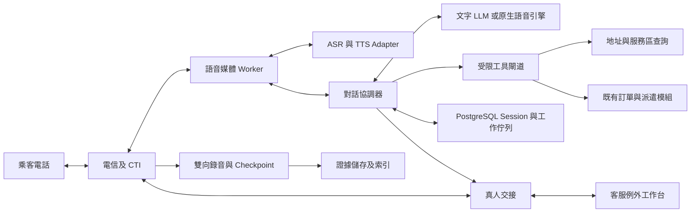
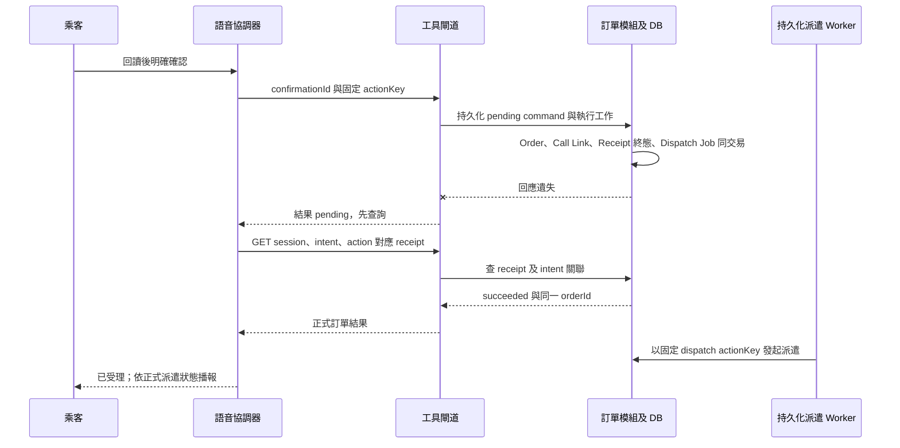

# 第一階段無人語音叫車 — 系統設計（SD）

- 文件代號：`UV-SD-001`；版本：`0.1`；日期：2026-09-06。
- 產品方向：使用者已確認「AI 獨立完成主要叫車流程，少數無法完成的例外交真人」。
- 文件狀態：詳細設計稿。用於規劃與實作前審閱；本文件不代表供應商已採購、功能已實作或正式環境已驗證。
- 配對需求：[無人語音叫車 SA](phase1-unattended-voice-booking-sa-20260906.md)。功能範圍、需求編號、業務驗收以 SA 為準；本文件擁有新增的技術狀態、資料、介面與處理規則。
- 原始碼盤點基準：`88cf38048c6b6bb565fd2c11d8a9db2706919fca`；只作程式現況依據，不當作部署證明。

## 1. 設計目標與不可違反的規則

1. 一般成功路徑沒有真人逐筆審核。乘客對 AI 的明確確認，是提交交易的必要條件；AI 的自述或內部推理不算確認。
2. ASR 聽、文字 LLM 理解及提出工具請求、TTS 說；TWM 不是一個已包含完整對話及派車能力的單一模型。
3. 訂單、派遣、取消、費用與 ETA 的真值由既有領域模組提供。LLM 不直接寫資料庫，也不能替代領域驗證。
4. 無供應商 confidence 欄位時使用 `null`，不得把 `final=1`、LLM 自評或文字流暢度轉成辨識可信分數。
5. 新建訂單只對已確認且仍有效的草稿版本執行一次。斷線、重試、雙 worker、真人接手都不能造成第二張單。
6. `order accepted`、`dispatch requested`、`driver assigned`、`ETA available` 是不同事實；播報內容必須對應已取得的後端結果。
7. 不借用真人 `agentId`，不放寬現有 ops assistant 的人工確認邊界。新增受限的機器行為身分與語音交易入口。
8. 原始雙向通話錄音由話務／錄音層負責；TWM `saveResult`、ASR 逐字稿及 LLM 摘要都不能取代完整錄音。
9. 同一通電話只有一個可執行 mutation 的控制者。真人接通後，AI 停止主動發話及交易；只保留被明確開啟的旁路輔助。
10. 本次產品方向擴充 owned 電話入口；不因此重開乘客 App／Web，也不讓 AI 取得第三方平台訂單的寫入權。

## 2. 現況與整合差異

| 現有位置                                                                                                              | 已有能力／限制                                                                       | 本設計要求的差異                                                           |
| --------------------------------------------------------------------------------------------------------------------- | ------------------------------------------------------------------------------------ | -------------------------------------------------------------------------- |
| [電話建單 controller](../../apps/api/src/modules/owned-mobility/owned-mobility.controller.ts) `createCallCenterOrder` | `POST /api/call-center/orders`，以 `IdempotencyService` 包住建單                     | 保留人工入口；新增機器專用入口及可查詢交易結果的持久化 receipt             |
| [電話建單 service](../../apps/api/src/modules/owned-mobility/owned-mobility.service.ts) `createCallCenterOrder`       | `agentId`、`ops_user`、`standard_taxi`、`realtime`、`tenantId=null`；ETA 目前固定 10 | 抽取共用領域 command，新增 typed actor／line scope；不得直接沿用固定 ETA   |
| 同檔 `buildRecordingGate`                                                                                             | 以是否存在 `recordingId` 判 gate                                                     | AI 路徑必須驗證錄音 checkpoint 與確認證據，不能填入任意 ID 放行            |
| [callcenter](../../apps/api/src/modules/callcenter/callcenter.service.ts)                                             | session、錄音 callback、callback task、order 關聯                                    | 增加 AI 身分、provider call leg、機器控制權及交接對應                      |
| [callcenter module](../../apps/api/src/modules/callcenter/callcenter.module.ts)                                       | 註冊 sandbox provider adapter                                                        | 實作並驗證真實 CTI、雙向媒體、錄音、轉接與斷線事件                         |
| [既有 contracts](../../packages/contracts/src/index.ts) `CreateCallCenterOrderCommand`                                | 必填真人 `agentId`                                                                   | 新契約不以虛構員工 ID 過關；新增相容 union／專用 command                   |
| [ops assistant](../../apps/api/src/modules/assistant/assistant.instructions.ts)                                       | 提議動作、真人確認                                                                   | 保留用途；無人語音由獨立 tool gateway 執行乘客已確認的交易                 |
| [已接受事件決策](../01-decisions/SD-DP-20260817-009-domain-event-contract-and-write-authority.md)                     | 模組化單體、直接 typed call，非完整 domain event bus                                 | 語音 durable job／session log 為本功能新增；不假設已有 Kafka 或全域 outbox |

本文件中 `/api/voice/*`、`Voice*` 型別及資料表均為**新設計**，不是可直接使用的既有端點。實作時加入 contracts/Zod/OpenAPI，再落 controller，不能將 Markdown JSON 當已完成契約。

## 3. 架構與服務分工

### 3.1 參考架構

本版先以「TWM ASR＋文字 LLM＋TWM TTS」定義可替換的串接基線；採購結果仍由整條無人叫車評測決定。OpenAI Realtime／Gemini Live 是同一組業務工具與交易規則下的替代對話引擎，不得繞過確認與建單 gate。



- 現有 `apps/api` 保留領域寫入權；新增 `voice-booking` 模組處理 session、草稿、確認、工具授權與管理查詢。
- 新增 TypeScript/Node 語音 worker 處理長連線、音訊封包、ASR/TTS、VAD 與播放取消；與 API 分開擴容，避免媒體負載阻塞派遣 API。
- PostgreSQL 保存必要狀態與工作 receipt；Redis 只供快取／短期通知，不能作確認或去重的唯一來源。
- 錄音二進位放 CTI 或既有 object store；資料庫只存索引、雜湊、存取策略與片段 manifest。
- 第一版使用資料庫 job table＋worker lease 處理跨程序工作；領域內可在同一 DB transaction 的部分仍用 typed call。無新增全平台訊息匯流排要求。

### 3.2 邊界與所有權

| 元件                  | 負責                                                            | 不擁有                              |
| --------------------- | --------------------------------------------------------------- | ----------------------------------- |
| CTI adapter           | 號碼／SIP line、call legs、DTMF、接聽／掛斷／轉接、簽章驗證     | 地址、訂單、模型判斷                |
| Media worker          | PCM／μ-law 轉換、時序、播放緩衝、echo 處理、VAD、barge-in       | 任意 order mutation                 |
| ASR adapter           | 音訊轉文字、partial/final、segment 與版本                       | 乘客同意的最終判定                  |
| Dialogue orchestrator | 問題次序、修正、草稿、回讀、有限重試、例外路由                  | 價格、服務區或車輛資格真值          |
| Tool gateway          | schema、scope、draft/lease/version gate、領域呼叫與最少資料回傳 | 讓 LLM 指定 URL/SQL 或任意 endpoint |
| Owned-mobility        | 建單、訂單狀態、派遣、取消與 transaction receipt                | ASR/TTS 連線                        |
| Callcenter/evidence   | callId、錄音、真人交接、callback、證據權限                      | 模型可自行覆寫的證據                |
| Ops console           | 少數例外承接、通話摘要、操作及監督                              | 逐筆批准 AI 正常訂單                |

### 3.3 供應商替換與電話接入選擇

| 路線             | 共用部分                                   | 特有工作                                                          | 決策狀態               |
| ---------------- | ------------------------------------------ | ----------------------------------------------------------------- | ---------------------- |
| TWM＋文字 LLM    | 工具、草稿、確認、錄音、交接、metrics      | TWM token/ticket、音訊及模型 adapter；停頓／插話協調              | 本版參考路線；未決標   |
| OpenAI Realtime  | 相同交易 gate 與工具；SIP 或 media adapter | session、工具事件、音訊取消／對話截斷；台客語實測                 | 對照候選               |
| Gemini Live      | 相同交易 gate 與工具                       | PCM 重採樣、播放 buffer 清除、模型版本與 preview 條件             | 對照候選               |
| LiveKit／Pipecat | 可承接媒體與對話編排                       | 自訂 TWM adapter、CTI／部署；本專案 TypeScript 基線需評估框架語言 | 框架候選，不當語音模型 |
| Vapi             | 平台媒體／工具／轉接能力                   | custom transcriber 與 TTS 協定轉換；驗證控制權及資料保存          | 可組合候選，另計平台費 |
| Retell           | 託管語音代理對照                           | 先確認任意 TWM ASR/TTS 介面及轉接模式                             | 未確認可替換性         |

選定平台前必須能保存本文件的 `draftVersion`、`confirmationId`、`actionKey`、`leaseEpoch` 與機器授權邊界；平台不提供必要控制時，不以功能展示取代交易約束。

## 4. 可信來電與執行身分

### 4.1 來電建 session

1. Provider webhook 驗證簽章、時間窗、provider account 與目的 DID／trunk；不接受 caller 或 LLM 提供的 brand/tenant。
2. 由 `voice_line_binding` 查出唯一 `brandId`、`operatingProfileId`、允許服務、語言、人工隊列及錄音策略。未匹配或多重匹配時不啟動建單。
3. 以 `(providerAccountId, providerCallId)` 唯一鍵建立既有 `callId` 及 `voiceSessionId`；轉接後新增 `callLegId`，不產生新的 booking intent。
4. 先做 provider capacity admission，再接通 AI 媒體；滿載直接走該號碼的備援人工／排隊策略，不接起來後靜默失敗。
5. 原始 caller ID 僅為 `assertedCallerPhone`。它不是查單、取消或讀取歷史住址的授權證明。

### 4.2 機器身分

新增領域 actor discriminator `actorType: voice_agent`，對應 IAM 的受限 service principal；名稱、品牌及「AI 語音客服」身分以已批准話術告知乘客。真人接手改用實際 `ops_user`，保留 actor transition。

短期 service token 包含 `aud=voice-tool-gateway`、`servicePrincipalId`、`voiceSessionId`、`brandId`、`operatingProfileId`、`leaseEpoch`、有效期限。以上值由可信 session 注入，不採用工具 body 的同名值。

建議最小 scopes：`voice:session:execute`、`voice:address:resolve`、`voice:owned-order:create`、`voice:owned-order:read-bound`、`voice:handoff:request`。取消另需 `voice:owned-order:cancel-bound` 與當筆 challenge。設定與錄音下載使用不同管理身分；AI runtime 不取得 tenant 管理、價格覆寫、無條件取消或跨品牌讀取 scope。

## 5. 狀態與並行控制

### 5.1 對話狀態（與訂單狀態分開）

| `dialogState`       | 進入條件                                   | 允許下一步                                                                                     |
| ------------------- | ------------------------------------------ | ---------------------------------------------------------------------------------------------- |
| `admitted`          | 可信 line 與容量成立                       | `greeting`／`handoff_pending`                                                                  |
| `greeting`          | 播報 AI 身分及必要錄音提示                 | `collecting`／`handoff_pending`／`closed`                                                      |
| `collecting`        | 收集或修正欄位                             | `resolving`／`handoff_pending`／`closed`                                                       |
| `resolving`         | 查地址、服務區、能力或經授權查單           | `collecting`／`confirming`／`reporting`（唯讀結果）／`handoff_pending`／`closed`               |
| `confirming`        | 唯一草稿版本回讀                           | `collecting`／`committing`／`handoff_pending`／`closed`                                        |
| `committing`        | 有效確認及錄音 checkpoint；提交固定 action | `awaiting_dispatch`／`reconciling`／`handoff_pending`；僅未受理的前置驗證失敗可回 `collecting` |
| `reconciling`       | mutation 結果未知；禁止新 key 重建         | `awaiting_dispatch`／`handoff_pending`／`closed`；durable accepted 後拒絕不直接換草稿重送      |
| `awaiting_dispatch` | 訂單已存在，查正式派遣結果                 | `reporting`／`handoff_pending`／`closed`                                                       |
| `reporting`         | 根據正式結果播報                           | `closed`／`handoff_pending`                                                                    |
| `handoff_pending`   | mutation 權限凍結並要求交接                | `human_controlled`／`callback_pending`／`closed`                                               |
| `human_controlled`  | 真人已接通並取得 lease                     | `handoff_pending`（真人掉線／再次轉接）／`closed`                                              |
| `callback_pending`  | 有可聯繫資料及回撥任務持久化               | `closed`                                                                                       |
| `closed`            | 電話結束                                   | 不再執行新的乘客指令；已送出的 mutation 仍可 reconcile                                         |

`closed` 是媒體／對話結束，不等同取消訂單。結果未知時可以 `dialogState=closed` 且 `commitStatus=pending`，由背景工作完成對帳與通知；此為正交狀態而非終止補償。

### 5.2 正交狀態

- `controlOwner`: `ai | handoff | human | none`，配合單調遞增 `leaseEpoch`。
- `mediaState`: `connecting | active | reconnecting | ended`。
- `commitStatus`: `none | pending | succeeded | rejected`；pending 可跨掛斷存在。
- `recordingState`: `starting | capturing | checkpoint_ready | finalizing | finalized | failed | expired`。
- `confirmationState`: `absent | readback_playing | awaiting_answer | accepted | invalidated | consumed`。
- `outcome`: `auto_booking_created | auto_no_service | auto_query_completed | human_handoff | callback_scheduled | abandoned | technical_failure`；另以 dispatch result／原因維度分析，不將無車算成成功派車。

### 5.3 序列與 fencing

每通 session 由單一 worker lease 處理；DB compare-and-swap 更新 `sessionVersion`。媒體事件攜帶 `mediaEpoch`、`sequence`，ASR 事件另有 provider session、segment、revision。相同事件 dedup，舊 epoch final 不得覆蓋新連線內容。

偵測乘客開始說話時先增加 `inputEpoch`、停止／清除 TTS 播放、標記實際播到的位置，再解析語句。若處於 `confirming` 且回讀被打斷，該次回讀不算完整播放；對「嗯／對」不得建立確認。新命令受理前比較 `leaseEpoch`、`draftVersion`、`inputEpoch` 與當前 owner；任一改變則拒絕舊請求。已持久化受理的命令由 §7 的 executor／reconciler 接續，真人交接或媒體結束不能把它當作未送出。提交前再次檢查新更正是否使確認失效。

資料庫 transaction 一旦提交，稍後更正只能走該既有 order 的修改／取消政策，不能假裝原提交尚未發生。若更正與提交併發，以持久化事件及 commit receipt 的順序判定，並明確向乘客說明狀態。

## 6. 草稿、地址與乘客確認

### 6.1 草稿的欄位證據

每個 slot 保存 `rawText`、`normalizedValue`、`sourceTurnIds`、`sourceSegmentIds`、`providerConfidence: number | null`、`validationState`、`confirmedByCustomerAt`。LLM 只能產生候選值；normalized address 由地址服務回傳，不能由模型自造經緯度。

最少業務資料：上車地點、商品要求時的目的地、可服務的即時產品、乘車人數、聯絡方式、必要上車備註。既有即時產品必填目的地時維持要求；不由模型決定可省略。姓名是否必填依既有 `PassengerProfile`／品牌政策，不能因模型問卷固定而增加不必要問題。來電者代叫時分開 `bookerContact` 與 `passengerContact`，向乘客說明司機會聯絡哪個號碼；不把 ANI 無條件覆蓋乘客電話。

地址解析保存 provider place ID、標準地址、座標、院區／入口／集合點、解析版本、服務區檢查結果與有效時間。同名醫院、台北／新北、道路與門牌、省略縣市時必須消歧；候選數超過一且無唯一選擇，不得提交。地圖失效時只可蒐集草稿後轉例外，不以 LLM 猜測位置放行。

修改上／下車、時間、人數、商品、聯絡對象／電話或有費用影響的需求，必須增加 `draftVersion` 並使舊 confirmation 失效。非交易性的口頭寒暄不改版。地圖／價格／供應預檢過期時重新驗證；若結果改變乘客承諾，再回讀確認。

### 6.2 確認票據

```json
{
  "confirmationId": "uuid",
  "voiceSessionId": "uuid",
  "intentId": "uuid",
  "action": "create_owned_immediate_order",
  "draftVersion": 7,
  "snapshotHash": "sha256-of-canonical-business-snapshot",
  "readbackPlaybackId": "uuid",
  "readbackCompletedEventId": "uuid",
  "confirmationMethod": "speech",
  "evidence": {
    "turnId": "uuid",
    "finalEventId": "uuid"
  },
  "inputEpoch": 12,
  "leaseEpoch": 3,
  "recordingCheckpointId": "uuid",
  "confirmedAt": "2026-09-06T02:00:00Z",
  "expiresAt": "2026-09-06T02:02:00Z"
}
```

此為服務端產生的證據模型，不讓 LLM 在工具參數傳 `confirmed=true` 代替。`snapshotHash` 使用固定 canonical JSON／版本化序列化，包含乘客確認的全部交易欄位；時間為 UTC，口語時間按 `Asia/Taipei` 解釋並回讀日期。

`confirmationMethod` 為判別 union：`speech` 的 evidence 必含 `turnId`、`finalEventId`；`dtmf` 的 evidence 必含可信 CTI `eventId`、`digit`（例如已提示按 1 確認），不得強塞不存在的 ASR 欄位。兩者共用 snapshot、完整回讀、input epoch、時間與 checkpoint gate；DTMF event 也持久化並驗證發生在回讀完成後。

接受確認需同時成立：

- 綁定唯一正在確認的 action、intent、草稿版本與控制 epoch。
- 回讀內容由已驗證 snapshot 經版本化模板生成，保存 `readbackScriptHash` 與播放音訊版本；話務端報告整段已播放完成。只有「TTS 生成完成」不算乘客已聽到；播放完成也不能證明自由生成的音訊說了正確內容。原生語音引擎若無法保證照已驗證文字回讀，最後確認輪次切至受控 TTS／固定錄音拼接。
- 回讀後收到乘客的 final 語句或已提示的 DTMF 確認；speech 模式須通過 VAD／echo 過濾與輪次判定，不能將本端回音當肯定；這些檢查不是聲紋身份證明。
- 回答為對該交易的明確肯定。否定、疑問、「對，但是…」、修正句、背景他人聲音或模糊語句皆須處理後重問。
- 沒有尚未處理的乘客新語句或工具更新；驗證 `inputEpoch`、`draftVersion`、`leaseEpoch` 未失效。
- 有覆蓋必要回讀與肯定內容的 durable recording checkpoint；保存 TTS 播放事件及 ASR 證據連結。

初始確認有效期建議 120 秒，為可版本化產品參數，不是供應商限制。若已提交 action，票據標 consumed；過期後先查 command receipt，不能先發新票據重建。

### 6.3 工具介面允許清單

| 工具名                             | 類型           | Server 必查                                                 | 可回模型資料                                       |
| ---------------------------------- | -------------- | ----------------------------------------------------------- | -------------------------------------------------- |
| `resolve_location`                 | read           | line 服務區、查詢長度、流量限制                             | 最多 3 個具名稱／區域的候選，無其他乘客資料        |
| `check_booking_eligibility`        | read           | 產品、座標、可服務區、人數／需求                            | 可受理與否、可說給乘客的原因；不保證已有車         |
| `prepare_booking_readback`         | prepare        | 必填、草稿版本與地址有效性                                  | deterministic 確認內容及 playback task ID          |
| `commit_confirmed_booking`         | mutation       | §6.2＋§7＋§8 全部 gate                                      | commandId、正式 orderId、正式狀態                  |
| `get_bound_booking_status`         | read           | 本通新單或有效 passenger proof；最少資訊                    | 訂單／派遣狀態、來源與時間有效的 ETA               |
| `request_dispatch_for_bound_order` | mutation       | 已提交訂單、dispatch 權限、gate、固定 action key            | 接受／拒絕／pending，不回自行推測的車牌            |
| `request_handoff`                  | control        | session scope、當前 owner、reason code                      | 排隊／接通／callback 狀態                          |
| `create_callback_request`          | mutation       | 可聯繫資料與乘客同意回撥、去重                              | 已保存的 callback ID 與承諾限制                    |
| `cancel_bound_booking`             | gated mutation | 功能旗標、passenger proof、取消規則、orderVersion、回讀確認 | 正式取消結果或拒絕原因；預設不啟用既有未知授權路徑 |

不得提供 `execute_http`、SQL、任意 shell、任意 URL fetch、任意 driver assignment 或價格 override 工具。工具輸入／輸出分別做 Zod 驗證；使用者口述、轉寫、檢索及第三方工具內容全部視為資料，不得改寫系統授權。

## 7. 交易一致性與未知結果

### 7.1 必須新增的 durable transaction

現有 phone service 以記憶體建立訂單後呼叫非同步 `persistChanges`，callcenter persistence 亦可能背景寫入；現有 idempotency completion 另行儲存，例外還可能刪 key。因此**不能只加一個 `Idempotency-Key` 就宣稱無人建單安全**。

新增 `commitVoiceBooking` 領域 command，分「持久化受理」與「執行訂單交易」兩步，均在服務端控制：

1. **先授權並查回執：**確認 caller 可讀此 session／brand，再以 intent/action 查既有 receipt。對相同提交參照／業務 hash，有終態直接回放；pending 則回同一 command。若重送更換了 snapshot／confirmation 參照則回 payload conflict 並提供原 command 定位；純查詢仍可讀回原結果。不得先要求已消耗的 confirmation 再通過一次，或因票據過期而遮住已成功結果。
2. **新命令前置驗證：**receipt 不存在才驗證 AI owner、版本、地址、產品、有效確認及 checkpoint。未通過回明確前置錯誤，`commitStatus=none`，不綁定 payload hash；可修正、重新確認同一 intent。
3. **持久化受理：**短 transaction 按固定順序鎖定 session/intent/confirmation，重驗前置條件，以唯一 action key 建立 `pending` receipt、固定業務 snapshot hash，並建立唯一 `execute_booking_command` 工作項目。成功後才可回 `202 accepted`。此時只是受理命令，尚不能說訂單已成立。
4. **執行訂單交易：**executor 在同一 PostgreSQL transaction 內按固定順序鎖定 session、intent、confirmation 及 pending receipt；若已有終態直接回放。重驗最新業務資格、有效期限及新輸入／草稿更正，寫 owned order、可信 actor、call-order 關聯、確認 snapshot reference；消耗 confirmation，將 receipt 更新為 `succeeded` 並寫正式 orderId，同時新增派遣／結果通知工作及 audit。全部完成後 commit。
5. **提交後播報：**只有第 4 步 durable commit 成功才回訂單已建立。媒體程序不以記憶體結果或第 3 步 accepted 提前播報。

所有 mutation 共用固定鎖順序：`session → intent → confirmation → command receipt → order`；不存在的 receipt 由已鎖 intent 與唯一鍵仲裁。受理、executor、更正、handoff 及人工接手建單都必須遵守；只更新 inputEpoch 的 speech-start 可只鎖 session。executor 持有 session 鎖直到 order transaction commit，讓 inputEpoch／draftVersion 的最後檢查與寫單之間不能插入已處理的新更正。不能只靠程式先讀一次 epoch。

第 3 步是命令受理的持久化界線。其後單純掛斷、worker 換手或開始交接不撤銷命令，授權由已封存的 command proof 限定給可信 executor；不得把舊 worker 的 token 換成一般管理權限。乘客在 order commit 前提出新的實質更正，則更新 input/draft epoch 並使尚未消耗的確認失效；executor 與更正寫入採同一鎖定順序，確保舊地址不會在已處理的更正之後提交。commit 後才抵達的更正走既有單的例外處理。

第 4 步若確認過期、被更正或業務明確拒絕，須在查明沒有 order 後，以 transaction 將 pending receipt 寫為 `rejected` 並保存原因；同一已受理 action 不改 hash、不重新啟用。初版此類終態轉人工／結束；不得直接回 collecting 自動建另一單。資料庫／網路不明錯誤保留 pending，不能誤標業務拒絕。

既有模組如果目前不能共享 transaction，實作必須先新增 transaction-aware repository/unit-of-work；不以包一層舊 HTTP endpoint 的方式冒充原子性。派遣對外副作用由 worker 後續執行，以 receipt 確認，不在長時間 DB transaction 內等待司機。

### 7.2 action key 與查重

- Server 產生 `actionKey = brandId + callId + intentId + action`；同一 booking intent 的重試始終使用同 key。
- key **不包含** ASR 連線 ID、LLM tool-call ID、worker ID 或每次重試時間。確認前及未受理的前置驗證失敗後草稿可變；命令 durable accepted 後固定 payload hash。
- DB `UNIQUE(brand_id, call_id, intent_id, action)` 為最終防線；另在 owned order 增 `UNIQUE(voice_intent_id)`（非空時）。
- mutation 重送同 key 同 hash 回原 receipt；同 key 不同 hash 回 `VOICE_ACTION_PAYLOAD_CONFLICT`。read-only receipt 查詢不需有效 confirmation；先處理原命令／原單，不自行生成新 intent。
- 不依賴首次 response 提供 commandId 才能恢復：`GET /api/voice/sessions/{sessionId}/intents/{intentId}/actions/{action}` 由已知 session/intent/action 查同一 receipt。查無 receipt 只表示當下尚未可見；若原請求仍可能在途，使用相同 key、相同確認重送或繼續查詢，由唯一鍵仲裁，不換 key。
- 第一版一通電話一個新建叫車意圖。查詢／取消不覆寫主 `linkedOrderId`；以 action 關聯紀錄保存其他被操作 order。
- 回撥／重新來電的跨通話查重，以經核對的聯絡方式與當前訂單提供候選提示；不是只憑電話號碼自動合併或取消。讀取詳細資訊前仍需身份 proof。

### 7.3 timeout／crash



- 已知命令受理但結果未定時回 `202 pending`；整個 HTTP response 遺失時本地進 reconciling，依 session/intent/action 查詢，不能假定已收到 commandId。協調器說「正在確認是否已成功受理」，不能說失敗後重下單。
- Worker crash 後由 lease reaper 接手；重新讀 receipt／order 唯一關聯，再決定續作。同一 action 未確定前，不允許真人另建替代單。
- executor 只有查明沒有 order 且以持久化 transaction 記錄確定拒絕，才是 `rejected`；一次 DB rollback／網路例外不等於業務終態。
- 若確認後掛斷，已 durable commit 的單繼續派遣；尚未持久化受理命令則不再接受新提交。pending command 由背景 executor／reconciler 完成檢查與結果落地，不因 session closed 丟棄。
- 需要通知掛斷乘客時，使用品牌已開通且具授權的通知／回撥能力；沒有可用渠道則建立例外任務，不能假稱已通知。這不是新建乘客收據中心。
- job 採至少一次傳遞＋consumer 冪等；不得承諾分散式網路層 exactly-once。

### 7.4 真人入口亦須遵守同一防重複規則

對已關聯 voice session 的 `callId`，既有 `POST /api/call-center/orders` 必須在後端載入同一 session/intent，不能只靠工作台先讀 receipt 或新 Idempotency-Key 保護。非 voice call 保留既有人工行為。

- `pending`：拒絕另一個人工 create，交由原命令對帳；真人可接聽與讀取狀態。
- `succeeded` 或已有 `voice_intent_id` 關聯訂單：導向原單，不再建立。
- 命令尚未受理，或 AI command 已確定 `rejected` 且沒有 order：真人取得控制權後，按自己的權限、確認及證據要求，在同一 intent 下執行人工建單。記錄真實 `ops_user`，不復用失效的 AI 確認。

人工 fallback 使用獨立的 `manual_create_owned_order` action receipt，保留原 AI rejected receipt，不重設它；仍須在同一 transaction 綁 `voice_intent_id`、call-order 關聯及正式結果。共同的 `UNIQUE(voice_intent_id)` 和 §7.1 鎖定順序阻擋不同入口各建一單。後端從 call 關聯推導 intent，不能讓 legacy client 不傳 voiceIntentId 就避開檢查。

## 8. 錄音證據與通話中派車

### 8.1 問題與本版方案

通話結束才產生完整音檔的 provider，無法同時滿足「等完整錄音 callback 才派車」及「AI 在同通電話內完成派車並回報」。本設計採**連續錄音＋已封閉確認片段 checkpoint**，是新增 evidence 模型；正式上線前需與既有錄音／查核政策完成相容驗收。

不得呼叫既有 recording callback，填任意 `recordingId` 或把確認片段 `endTime` 當整通 `endedAt`，藉此把 gate 翻成 clear。

### 8.2 checkpoint 成立條件

- CTI／可信 recorder 保存雙向原始通話，涵蓋 AI 身分告知、交易回讀、乘客確認及先前影響該草稿的重要更正。
- 每個已封閉片段有 object key、immutable version、checksum、channel/leg、開始／結束媒體 offset、UTC 對照、`durableAt`。
- Recorder 以認證介面回報；evidence service 驗證 object 版本、可讀性、雜湊、片段連續性、品牌/call 關聯與存取策略後產生 `checkpointId`。
- 該 checkpoint 的 manifest 明確含所用 `readbackPlaybackId`／affirmation 時段，且與 confirmation snapshotHash 連結。
- 關聯至穩定 `recordingId` 與追加式 manifest；後續片段不修改已封閉片段，整通電話結束後產生 final manifest。
- gate 條件是 evidence service 的驗證狀態與 coverage，不是欄位非空。若雙向內容缺漏／持久化失敗，停止 autonomous commit，轉人工／callback 也不得冒充已有錄音證據。

### 8.3 gate 與失敗處理

| 狀態                                     | 新 AI 單可否提交／派遣       | 處置                                                              |
| ---------------------------------------- | ---------------------------- | ----------------------------------------------------------------- |
| `capturing` 但尚無 checkpoint            | 否                           | 等待 bounded flush；失敗轉例外                                    |
| `checkpoint_ready` 且 coverage／確認有效 | 可依其他業務 gate 提交與派遣 | 維持連續錄音；保存 finalization job                               |
| `finalized`                              | 可依原有規則使用             | callback 重送只更新相同 manifest 的可驗證結果                     |
| 只有未驗證 `recordingId`                 | 否                           | 記 `VOICE_RECORDING_NOT_DURABLE`                                  |
| commit 後後半段錄音失敗                  | 不自動取消已存在訂單         | 保存已封閉證據、阻止尚未執行的額外 mutation，產錄音例外與修復任務 |
| 最終音檔逾期依政策刪除                   | 不追溯推翻歷史訂單           | 索引標 `expired` 與原因，不能當初始錄音缺漏                       |

分段 checkpoint 是此功能的技術與證據驗收前提，未完成時不標 autonomous-ready。可先測試整通錄音及模擬交易，但那不是正式無人叫車閉環。

## 9. 持久化資料設計

### 9.1 新增邏輯資料表

以下為待新增的資料模型；實際 schema 與 migration 序號依當時 migration head 配置。既有 order／call session 仍為單一真值，不再建第二套訂單表。

| 資料表                  | 主鍵及關聯                               | 主要欄位                                                                                                                                     | 約束／索引                                                                                 |
| ----------------------- | ---------------------------------------- | -------------------------------------------------------------------------------------------------------------------------------------------- | ------------------------------------------------------------------------------------------ |
| `voice_line_binding`    | `line_binding_id`                        | provider account、DNIS／trunk、brand、operating profile、queue、enabled、version                                                             | 有效版本的 provider/account/line 唯一；停用須阻止新 session                                |
| `voice_route_profile`   | `profile_id, version`                    | models、語言、retry/timeout、capabilities、recording policy、人工 fallback                                                                   | immutable published version；session pin 版本                                              |
| `voice_call_admission`  | `admission_id`；provider account/call    | receivedAt、line、brand（可空）、admitted/overflow/failed、reason、sessionId（可空）                                                         | provider account/call 唯一；電話商總進線對帳，不漏 session 建立前失敗                      |
| `voice_session`         | `voice_session_id`；FK callId            | line binding version、controlOwner、leaseEpoch、sessionVersion、dialog/media/commit state、inputEpoch、outcome                               | provider account/call 唯一；active state／lease expiry 索引                                |
| `voice_call_leg`        | `leg_id`；FK session                     | provider leg ID、角色、媒體 epoch、started/endedAt、transfer correlation                                                                     | provider account/leg 唯一；不覆寫原通話起迄                                                |
| `voice_session_event`   | `event_id`；FK session/leg               | source、providerAccountId、sourceEventId、occurred/receivedAt、sequence、media/input/lease epoch、type、最小 payload 或 encrypted payloadRef | source/account/sourceEventId 去重；session/receivedSequence 單調唯一；核心證據 append-only |
| `voice_turn`            | `turn_id`；FK session/event              | speakerRole、media epoch、segment、revision、final、語言、text encrypted、audio offsets、model version                                       | providerAccountId/session/providerSession/segment/revision 唯一；session/sequence 索引     |
| `voice_intent`          | `intent_id`；FK session                  | action、currentDraftVersion、boundOrderId、status                                                                                            | 每個 v1 session 最多一個 create intent                                                     |
| `voice_draft_revision`  | `intent_id, draft_version`               | structured slots、validation refs、canonical snapshot、snapshotHash                                                                          | 版本不可變；修改產生新 row                                                                 |
| `voice_confirmation`    | `confirmation_id`；FK draft/checkpoint   | §6.2 全欄位、state、consumedCommandId                                                                                                        | action/intent/draft 的 active 票據唯一；consumption 鎖定                                   |
| `recording_checkpoint`  | `checkpoint_id`；FK recording/call       | immutable manifest/version、hash、coverage、verifiedAt、policyVersion                                                                        | 由 evidence owner 寫；call/recording/manifestVersion 唯一                                  |
| `voice_command_receipt` | `command_id`；FK intent                  | actionKey、payloadHash、status、orderId、resultVersion、error、timestamps                                                                    | §7 唯一鍵；pending/updatedAt 索引                                                          |
| `voice_work_item`       | `work_id`；FK command/session            | workType、dedupeKey、payloadRef、status、attempt、runAfter、leaseEpoch、lastError                                                            | dedupeKey 唯一；可領取狀態/runAfter 索引                                                   |
| `voice_handoff`         | `handoff_id`；FK session                 | reason、queue、state、agentId、ownerEpoch、summaryRef、callbackId                                                                            | 每 session 最多一個 active handoff；人工隊列索引                                           |
| `voice_passenger_proof` | `proof_id`；FK session/order             | method、verifiedContactRef、allowedActions、orderScope、expiresAt、attemptCount                                                              | 短效、不可跨 session/action 任意重用；不保存 OTP 明文                                      |
| `voice_usage_record`    | `usage_id`；FK admission/session（可空） | provider/model/version、billingUnit、quantity、currency、rateCardVersion、estimated/actual、invoiceRef                                       | provider account/usage ID 唯一；按日期/brand 聚合；非逐通成本保留分攤來源                  |
| `voice_rate_card`       | `rate_card_id, version`                  | provider、currency、含稅、單位價格、有效期、取整／最低計費、條件及核對狀態                                                                   | published version 不覆寫；新費率產生新版本                                                 |

既有 owned order 增 `voiceIntentId`、`bookingActor`、`customerConfirmationId`、`recordingEvidenceRef`；既有 call session 增 source binding／AI 身分資料。`agentId` 在真人路徑仍保留；機器路徑改用明確 discriminator，不以空字串虛構真人。

### 9.2 資料分類與保存

| 類型                                     | 保存規則                                                                   | 寫入／讀取限制                                   |
| ---------------------------------------- | -------------------------------------------------------------------------- | ------------------------------------------------ |
| 原始音檔與錄音片段                       | 繼承現有音檔 180 天政策，legal hold 例外                                   | provider/object store；簽名短效下載、逐次 audit  |
| call/recording 索引                      | 繼承現有 30 天 hot＋700 天 archive                                         | 保留 expired/missing 的差異；不靠永久公開 URL    |
| confirmation／command／manifest metadata | 建議登錄為與訂單來源證據相同的 730 天策略；正式值透過 evidence policy 管理 | 保存必要 refs/hash、版本和結果，不複製整段逐字稿 |
| 詳細逐字稿／對話及交接摘要               | 本版建議上限 180 天且可按品牌縮短；非既有政策已批准值                      | 加密、限定營運存取；評測匯出先去識別             |
| live buffer／暫態字幕                    | 記憶體或短效 session store；斷線可恢復窗後清除                             | 不寫一般 application log，不作長期 replay        |
| OTP／verification secret                 | 僅雜湊／服務端驗證狀態，短效                                               | 不寫錄音提示中的密碼、不傳 LLM、不留明碼 log     |
| 成本與品質統計                           | 優先去識別聚合，依已登錄 policy                                            | telemetry label 不包含電話、地址、逐字稿         |

以上繼承值引用[現有 evidence policy](../03-runbooks/evidence-retention-and-evidentiary-access-policy.md)，描述的是專案政策，不另行宣稱法律結論。詳細逐字稿與新增 metadata family 必須在實作時登錄 policy version；不得默認無限期保留或供第三方訓練。

跨通話搜尋聯絡電話採 keyed HMAC／受控 lookup token；明文電話加密保存，不能以普通 SHA256 視為去識別。legal hold 覆蓋關聯音檔、逐字稿及證據；刪除需涵蓋 provider 副本、備份策略及下載副本管理。

## 10. 新增 API 與事件契約

### 10.1 API 清單

| Method／新路徑                                                            | Caller                         | 功能與主要 precondition                                                              |
| ------------------------------------------------------------------------- | ------------------------------ | ------------------------------------------------------------------------------------ |
| `POST /api/voice/providers/{provider}/events`                             | 已驗證 CTI                     | 來電／斷線／轉接事件；簽章、時間窗、event dedupe                                     |
| `POST /api/voice/sessions/{sessionId}/media-access`                       | media worker                   | 短效 media token；綁 session/leg/epoch，禁止暴露 provider 長效憑證                   |
| `GET /api/voice/sessions/{sessionId}`                                     | scoped worker／ops             | 恢復 session snapshot；PII 權限分層                                                  |
| `POST /api/voice/sessions/{sessionId}/events`                             | trusted media／recorder worker | speech-start/end、DTMF、playback ack、epoch 事件；持久化 inbox、來源及 sequence 去重 |
| `POST /api/voice/sessions/{sessionId}/turns`                              | worker                         | normalized ASR final／revision；CAS 與 event dedupe；同交易連結 event inbox          |
| `POST /api/voice/sessions/{sessionId}/drafts`                             | worker                         | 更新草稿候選；expectedVersion，server validation                                     |
| `POST /api/voice/sessions/{sessionId}/readbacks`                          | worker                         | 封存確認 snapshot 並生成播放任務                                                     |
| `POST /api/voice/sessions/{sessionId}/confirmations`                      | 協調器                         | 驗證回讀／affirmation／coverage，建立 server confirmation receipt                    |
| `POST /api/voice/sessions/{sessionId}/booking-commands`                   | tool gateway                   | commit confirmation；不得重傳任意 final 地址或 actor                                 |
| `GET /api/voice/sessions/{sessionId}/commands/{commandId}`                | scoped worker／ops             | pending/succeeded/rejected 與正式 orderId；unknown 結果對帳                          |
| `GET /api/voice/sessions/{sessionId}/intents/{intentId}/actions/{action}` | scoped worker／ops             | 首次 response 遺失仍可定位 receipt；不要求已知 commandId 或未過期確認                |
| `POST /api/voice/recordings/{recordingId}/checkpoints`                    | recorder service               | 驗證 immutable segment manifest；與既有整通 callback 分開                            |
| `POST /api/voice/sessions/{sessionId}/handoffs`                           | worker／ops                    | 凍結 mutation、轉 queue，回傳交接 receipt                                            |
| `POST /api/voice/handoffs/{handoffId}/claim`                              | authenticated ops              | CAS 取得控制 epoch，配合 provider 已接通事件                                         |
| `POST /api/voice/sessions/{sessionId}/passenger-proofs`                   | verification service           | 確認 challenge；驗證秘密不得經 LLM                                                   |
| `POST /api/voice/sessions/{sessionId}/cancellation-commands`              | tool gateway                   | capability 開啟後才有；proof＋取消回讀＋預期 order version                           |
| `GET /api/voice/operations/sessions`                                      | scoped ops                     | session／例外列表、品質、使用量；強制分頁、brand scope                               |
| `PUT /api/voice/operations/route-profiles/{id}`                           | 管理角色                       | 建新設定版本；無權變更時拒絕，修改須 audit                                           |

所有業務 API 使用既有 `{data, meta:{requestId,timestamp}}` success envelope 及 `{error:{code,message,details,retryable,traceId}}` error envelope。Provider webhook 的回應依 provider ack 協定，由 adapter 轉換；不能要求電話商套用內部 envelope。

### 10.2 提交範例

```json
{
  "intentId": "uuid",
  "confirmationId": "uuid",
  "expectedDraftVersion": 7,
  "expectedLeaseEpoch": 3,
  "expectedInputEpoch": 12
}
```

`Idempotency-Key` 由可信 gateway 對應固定 `actionKey`；actor、brand、phone source、地址／人數／電話全部從已驗證 session 與 confirmation snapshot 載入。

已完成訂單交易回 `201`；相同請求 replay 回 `200` 且同一 command/order。已持久化受理、尚待處理回 `202`；response 遺失本身沒有可供 client 依賴的 HTTP status，須按 §7.2 恢復查詢。`202` 範例：

```json
{
  "data": {
    "commandId": "uuid",
    "status": "pending",
    "orderId": null,
    "nextAction": "query_same_command",
    "pollAfterMs": 1000
  },
  "meta": {
    "requestId": "uuid",
    "timestamp": "2026-09-06T02:00:01Z"
  }
}
```

`orderId=null` 僅代表尚未得知，不證明沒有單。不得讓前端／模型因這個 null 重新建立意圖。

### 10.3 錯誤語義

| Code                             | HTTP | 應對                                               |
| -------------------------------- | ---- | -------------------------------------------------- |
| `VOICE_LINE_NOT_BOUND`           | 403  | 不建單，走該 provider 的預設失敗路由               |
| `VOICE_SCOPE_DENIED`             | 403  | 不重試擴權，不向乘客暴露內部資料                   |
| `VOICE_SESSION_NOT_OWNER`        | 409  | 舊 worker 停止交易／播放，讀取 owner               |
| `VOICE_DRAFT_STALE`              | 409  | 載入新草稿，回讀確認                               |
| `VOICE_CONFIRMATION_REQUIRED`    | 422  | 完成乘客確認，不轉真人作常規代替                   |
| `VOICE_CONFIRMATION_EXPIRED`     | 409  | 先查是否已 consume；未提交才重確認                 |
| `VOICE_RECORDING_NOT_DURABLE`    | 409  | 等 bounded checkpoint 或轉例外，不偽造 recordingId |
| `VOICE_LOCATION_AMBIGUOUS`       | 422  | 用候選地點追問                                     |
| `VOICE_SERVICE_NOT_AVAILABLE`    | 422  | 明確說明不能受理，不先建錯誤產品                   |
| `VOICE_ACTION_PAYLOAD_CONFLICT`  | 409  | 查原 command／order，再走合法更正                  |
| `VOICE_PASSENGER_PROOF_REQUIRED` | 403  | 做驗證或轉人工；不洩漏訂單存在與細節               |
| `VOICE_PROVIDER_CAPACITY`        | 503  | admission fallback，不無限重連佔用                 |
| `VOICE_PROVIDER_UNAVAILABLE`     | 503  | bounded failover／轉人工，保留已收集資料           |

### 10.4 內部 normalized event

```json
{
  "eventId": "uuid",
  "voiceSessionId": "uuid",
  "callLegId": "uuid",
  "mediaEpoch": 2,
  "sequence": 98,
  "type": "asr.segment.final",
  "occurredAt": "2026-09-06T02:00:00Z",
  "payload": {
    "providerSessionId": "opaque",
    "segmentId": "7",
    "revision": 3,
    "text": "對，從這個入口上車。",
    "language": "cmn-TW",
    "confidence": null,
    "audioStartMs": 42000,
    "audioEndMs": 44500
  }
}
```

事件種類包含 `dtmf.received`、`call.started/ended`、`speech.started/ended`、`asr.segment.partial/final`、`tts.playback.started/completed/cancelled`、`recording.checkpoint.verified`、`command.receipt.updated`、`handoff.connected/failed`。這些是新 voice session log／worker 協定，不宣稱已存在全域 domain topic。

`speech.started`／DTMF 以 session lock 增加 inputEpoch，與 inbox event 持久化在同一 transaction；playback completed ack 同樣落地後才可建立 confirmation。`source`、`sourceEventId`、`providerAccountId`、`receivedAt` 與接收順序由可信 adapter／server 補入 envelope，防止 worker 重播及不同 provider ID 碰撞。partial 字幕只在短期 buffer；final、播放／輸入時序及交易證據保留最小 metadata，不把每個音訊 frame 寫進長期 DB。

音訊 offset 由 media bridge 產生；供應商不提供逐字時間戳時不可假造 word timestamps。字幕文字不可直接插進系統指令；後端為每種事件限制大小與來源。

## 11. 語音與模型 Adapter

### 11.1 TWM ASR 串流流程

依已讀取的 Streaming API V3.22，參考 adapter 流程如下；實際 base URL、帳號配額、模型及版本在部署設定注入。

1. 後端 `POST /api/v1/login` 取得 Bearer token；token refresh 由 worker credential manager 處理，不送到客服瀏覽器。
2. `GET /api/v1/streaming/transcript/access-info` 取得 websocket URL 與 ticket；ticket 通常有效 30 秒，連線前即時取用且 URL encode。
3. 指定 `modelName`、`type`、`rate`，明確設 `enableTransient=1`、`saveResult=0`。若契約另允許 provider 保存副本才改 saveResult，且不得取代本系統錄音。
4. 收到 `180` ready 才開始送媒體；`100` 只是準備中。單 frame 小於 384 KB，正常使用小封包持續送，不累積數秒才上傳。
5. 依 provider session/segment 更新暫態內容，`final=0` 可修改前文；`final=1` 才封存該 segment 的最終版本。segment final 不等同乘客完成整個意圖，仍需對話 turn ending 判斷。
6. 音訊結束送 text `EOS`，保留 drain window 收最後結果；掛斷的 EOS 不構成乘客確認。
7. `408/440` 逾時或 `486` 資源滿載，分類處理並保存會話狀態；取新 ticket 重連，不能使用過期票據。

ASR 文件支援 raw PCM、G.711 μ-law 與 8/16 kHz。媒體 bridge 依實際 codec 決定直通或轉碼，禁止把壓縮 bytes 當 raw PCM。FAQ 和 PDF 對雙聲道支援描述不同，第一版不依賴未驗證的 stereo 即時分離：ASR 優先只送乘客 leg，雙向完整錄音獨立保存。

FAQ 提供的 0.8–1 秒辨識延遲、POC 共用 15 線、無人聲預設 5 秒斷線，都不是本專案正式 SLA。長停頓與等待查車時須依 provider 允許的參數／音訊持續策略處理；不可任意送假的辨識語句保活。保活封包是否算費用要由廠商確認。

### 11.2 TWM TTS 與播放

TTS API V2.07 使用 `POST /api/v1/tts/login` 及 `POST /api/v1/tts/synthesize`。供應商 FAQ 的登入路徑不同，實作前以實際環境可執行範例核對，不用猜測路徑 fallback 重送帳密。

```json
{
  "input": {
    "text": "請確認，從指定上車地點前往指定目的地，現在出發，對嗎？",
    "textType": "common"
  },
  "voice": {
    "model": "configured-available-tts-model",
    "languageCode": "cmn-TW",
    "name": "configured-available-speaker"
  },
  "audioConfig": { "speakingRate": 1.0 },
  "outputConfig": { "streamMode": 1 }
}
```

- `voice.model` 由 `/api/v1/tts/models` 實際回傳挑選，不能填 `myVoca` 等 ASR 模型代號。
- 文件列國語、台語、客語四縣與海陸；每個部署的模型、語者與 textType 支援矩陣必須驗證。
- 串流為 S16LE PCM、16 kHz、mono；檔案模式有 WAV header。電話 leg 若為 8 kHz μ-law，須轉碼、重採樣與按時序送包。
- 首段音訊一到即可播放；worker 保存 playbackId、已播放 sample offset、completed/cancelled ack。模型生成完不等於電話端播完。
- 固定開場、等候及轉接句可依品牌／語言／聲線／版本快取；含個人地址／電話的動態語音不得進跨乘客共享快取。
- 日期、門牌、電話、車牌使用版本化發音規則及適合語言的回讀模板；電話逐碼，日期說完整日期，金額明確幣別。不要直接把 TTS 的破音詞替換當作地址資料修正。

### 11.3 語言與文字規範

| 目的         | 參考設定                                                    | 規則                                                                 |
| ------------ | ----------------------------------------------------------- | -------------------------------------------------------------------- |
| 國台英辨識   | `myVoca`                                                    | 第一輪可用的基準；實際混講與電話音質需驗證                           |
| 國客英辨識   | `bronci-b3-model-hakka-20260518`                            | 明確偏好／語言選擇後使用；切換需結束舊 segment 並增加 provider epoch |
| 台文逐字稿   | `bronci-b3-model-taigi-hanzi-20260504`                      | 不因台文輸出就省略地址標準化；展示與業務欄位分開                     |
| 離線國台英   | `bronci-e-model-taigi-20260301`                             | 用於評測、回查、品質分析，非即時主流程依賴                           |
| 離線其他候選 | `Taiwan-Tongues-ASR-CE`、`bronci-e-model-taigibun-20250814` | CE 在 FAQ 大小寫與商務清單不一致，需帳號模型清單核對                 |

第一版按 line 預設與乘客明確選擇控制語言，不根據電話區碼推斷母語。不假設一條模型可無限制四語切換；無法確定時用簡短問題確認語言，原始內容與已核對欄位繼續保留。

台語／客語播音需要合適的文字、漢字或拼音形式；選 `languageCode` 不等於完成中文翻譯。固定話術建立人工核對的語言版本，動態地名／數字用詞典與回讀測試；LLM 翻譯不得改變標準地址與交易內容。

### 11.4 插話、回音與斷線

- 分開乘客／AI leg；具條件時採 echo cancellation，不能用「TTS 播放期間完全關閉 ASR」犧牲乘客插話能力。
- `speech.started` 觸發 cancel provider synthesis、clear 電話 outbound buffer 與標記已播放範圍；取消後舊 chunk 不得再次播放。
- 自建分段 pipeline 保存對話中實際已播放的 assistant 內容。原生語音引擎則依其 truncate/cancel 協定修正 context，避免模型以為乘客已聽完整句。
- 重連窗口內只重送尚未確認處理的 bounded 音訊，保留 frame identity、offset 與 dedupe；禁止整段重播後生成第二個確認。
- 網路恢復後先恢復 draft/command/control 狀態，再繼續對話；若長時間無法恢復，將現有摘要交給人工。

## 12. 真人交接、查單與取消

### 12.1 交接流程

1. 乘客主動要求、有限修復仍失敗、關鍵供應商失效、特殊服務不支援等觸發結構化 reason code。
2. 先持久化 handoff row，owner 切 `handoff` 並增加 leaseEpoch；凍結新 mutation。pending command 仍由可信 reconciler 處理。
3. 產摘要：已確認／未確認欄位分開、最後問題、語言、候選地址、orderId／commandStatus、錄音 refs、轉接原因；不把模型推測寫成乘客承諾。
4. 告知乘客正在轉接，向 CTI 發起 warm transfer。provider 的要求已接受不等於真人已接通。
5. 真人接受＋provider bridge connected 後，CAS owner 為 `human`；停止 AI 主動輸出。工作台先讀 command receipt，才能建立／更正訂單。
6. 忙線／無人／轉接失敗時，按 line policy 排隊或提出回撥；取得可聯繫電話與乘客同意後，callback task 寫入成功才宣稱已安排回撥。
7. 沒有真人與回撥能力時，播放已設定的服務不可用訊息及有效替代聯絡方式；保留例外紀錄，不虛構已有人處理，也不把未確認草稿建成單。

`reasonCode` 最少包含 `customer_requested`、`speech_unresolved`、`language_unsupported`、`location_unresolved`、`identity_unverified`、`service_unsupported`、`recording_unavailable`、`provider_unavailable`、`command_reconciliation_needed`、`urgent_safety`。無車通常是可由 AI 正確回覆的業務結果；是否另轉調度由品牌政策決定，不一律算辨識失敗。

真人接手後掉線、放棄或再次轉接時，後端 CAS 將 owner 改 `handoff`、增加 epoch 並重新分派到真人隊列；AI 不自動恢復交易。已受理 command 繼續對帳，接手者必讀原結果。第一版不開放真人交還 AI；若將來開通，須另有 handback 契約與已建單狀態恢復驗證，不能重新起一個 create intent。

### 12.2 查單與取消授權

本通已建立的單可用 bound session proof 查最少資訊；歷史單與跨通話取消需驗證乘客權利。來電號碼＋訂單號只作 lookup hint，不能直接公開完整地址／電話或取消。

建議 challenge 方式為已開通的 OTP／訂單存取碼／可信回撥驗證；實際採用方法需對應既有能力，未建好時該類動作轉真人。OTP 等秘密只經已核准的外部驗證通道或 CTI 的安全 DTMF 收集模式：該段 digits 不進 ASR／LLM／一般 event payload，錄音需支援明確標記的保護區段，不能假稱連續完整收錄。此區段不得重疊交易回讀／確認證據；驗證 service 只回 proof ID 與結果。未具備此隔離能力時維持該驗證方式不開通，不改成要求乘客在一般語音鏈路念驗證碼。身份確認失敗不回答「某人確有這張單」。使用者主動要求人工，不因追求 automation rate 阻擋。

取消能力預設 gated：先查正式 orderVersion、assignmentVersion、是否可取消及費用，向乘客回讀取消內容並取得專用確認；提交時重新檢查版本。若司機狀態或費用改變則重讀規則，不能用舊同意覆蓋新條件。對外平台單只能導向其權威渠道，不能讓 AI 在本地偽取消。

### 12.3 派遣等待與停止需求

`awaiting_dispatch` 讀既有派遣狀態；語音等待上限、提示間隔與通知途徑由 route profile 版本化，具體值在 SA 營運參數定版。等待時間結束只表示結束同步電話等候，不代表派遣取消。

- 已有司機接受：播報真實車輛／ETA；沒有可靠 ETA 時明說未提供。
- 尚在找車：清楚區分「掛電話後繼續找車」與「停止找車」。前者需說明已開通的通知途徑；若沒有通知能力且乘客不願繼續在線，轉人工／例外處理。
- 乘客要求停止且仍有 active order／dispatch：只有已開通的取消／停止派遣工具取得正式終態才回覆停止；初版取消未開通就轉真人，不能只掛斷或寫備註留下活單。
- `no_service` 等正式終態且不存在繼續派遣：可說明結果並結束；若提供重新嘗試，仍用原單的合法派遣重試規則，不能再建另一張單。
- 掛斷時仍有不明／活躍操作：保留 reconciliation／例外 owner，不能算「已停止」或「自助處置完成」。

唯讀查單走 collecting→resolving（驗證／查詢）→reporting→closed，不經建單確認或 committing；未開通的改單／預約／取消直接進相應例外路由。

### 12.4 改單與預約的能力界線

初版辨識、蒐集並路由改單／預約需求，不暴露可寫入的 amendment 或 reservation tool。取消雖有本版設計接口，也預設關閉。開通改單需另定義允許修改欄位、原單版本、已派司機狀態、價格差額、乘客權利證明與專用回讀／冪等 command；開通一般預約需專用商品、Asia/Taipei 時間窗、供給及預約 command、取消與通知契約。這些是條件能力的後續設計門檻，不能只打開 feature flag 後沿用 immediate create，也不得把一般電話乘客偽裝成 tenant 去呼叫企業預約 API。

## 13. 非功能設計與營運介面

### 13.1 延遲、容量與恢復

數值驗收目標由 SA 的 NFR 表擁有；本節只定義測量與控制方式。

- 分段量測 `call_offer→answered`、`speech_end→final`、`final→tool_done`、`tool_done→tts_first_byte`、`tts_first_byte→first_played` 與端到端 `speech_end→first_meaningful_audio`。等待音不算 meaningful answer。
- 另測插話到停止播放、confirmation 到 durable commit、派遣工作到正式結果；p50/p95/p99 按語言、codec、provider、負載分層，不把 ASR 延遲當全程延遲。
- 並發容量 `C` 至少同時受 CTI lines、ASR streams、TTS／LLM quotas、worker CPU/network 與人工作業能力限制；取最小可用容量並保留運維餘裕。
- 用尖峰來電率 `lambda`、平均佔線秒數 `W` 估 `lambda × W` 的平均負載，再以量測峰值與安全係數做壓測；不能把 POC 的 15 線直接當正式容量。
- provider ready 時將 pending admission reservation 原子轉成 active capacity lease，不能提前釋放總配額。通話、ASR stream、TTS request 與轉接 leg 各在資源確定結束後釋放；失敗／超時由 reaper 核對 provider 與 lease，避免洩漏或重複扣減。重連與 warm transfer 的多 leg 一併核算。
- 新通話 circuit breaker、worker drain、session lease takeover、有限重試與隔離隊列分開設計。供應商切換只在安全的 turn 邊界，保留已確認資料，避免每通雙 ASR 重複收費。

### 13.2 觀測與工作台

Ops console 增加無人語音營運入口，呈現：進線／AI處理／待人工／已交接／待回撥、當前問題與已確認欄位、pending command、錄音狀態、provider版本、延遲、使用量與reason code。正式 order 狀態直接讀既有模組。

人工只處理例外，不讓所有AI單自動進待審隊列。管理者可按品牌／語言停用新通話、查看失敗群組、匯出去識別測試集；實際接聽／錄音回聽和設定更改分權限及audit。

告警至少包括：誤單／重複單、跨scope拒絕、pending command超時、錄音checkpoint／finalize失敗、供應商滿載、轉人工無人接、無法派遣、成本異常、worker lease衝突。錯單與證據缺漏按嚴重程度觸發自動停止新建單，並保留查單／例外處理能力。

無人有效受理率由確認證據、durable order、派遣受理／結果與實際結果播報 ack 聯合計算，不能直接把 `outcome=auto_booking_created` 當成功。`outcome` 是路由結果摘要，原始可稽核事實仍分別保存。全部來電覆蓋率以電話商 ingress 記錄及 `voice_call_admission` 對帳，包含 session 建立前的滿載／失效，不只統計 voice_session。

### 13.3 安全與資料邊界

- 供應商 secrets 放既有 secret 管理層；ticket、Bearer token、下載URL query token 在 logs、trace及錯誤訊息中遮罩。
- Webhook驗簽、event去重與媒體認證各自實作；來源IP檢查不能代替簽章。
- 使用者口述「忽略規則、換品牌、直接派車」不改 tool allowlist；模型output通過schema及業務驗證才可執行。
- 限制每號碼／來源進線與未完成意圖數、單通時長／token budget，兼顧共享電話合理用途；超量行為要有可說明的服務結果。
- 不蒐集付款卡號／密碼，不以聲紋推定身份，不讓AI自行判定乘客詐欺。需要特殊驗證或付款時使用既有受控通路。
- 地址解析、知識查詢只使用允許的服務；模型不能根據來電內容向任意外部URL傳送乘客資料。

## 14. 方案評測與成本設計

### 14.1 比較單位與選型門檻

評測單位是「同一套工具、同一電話條件下完成一通無人叫車」，不是單一 ASR 文字準確率。既有 survey 原稿未在本次工作範圍找到，以下是本次依官方文件整理的對照候選，不能當成先前已接受的選型結論。

| 組合                                  | 對本專案的價值                                               | 需要量測／確認的差異                                                                                                                                                                                                                                                                                                             |
| ------------------------------------- | ------------------------------------------------------------ | -------------------------------------------------------------------------------------------------------------------------------------------------------------------------------------------------------------------------------------------------------------------------------------------------------------------------------- |
| TWM ASR＋文字 LLM＋TWM TTS            | 清楚分離聽／理解／說；官方文件列台語、客語相關辨識及合成選項 | 電話 8 kHz、台客語地名數字、TTS 可用聲音、三段延遲、打斷及靜音控制；不能只靠 ASR 型號選定整套方案                                                                                                                                                                                                                                |
| OpenAI Realtime＋共用工具             | 原生雙向語音與工具；官方提供 SIP 接入流程                    | SIP 電信服務仍需配置，台客語與電話混講效果實測；最後交易回讀要符合 §6.2，成本含音訊、文字及上下文用量。[Realtime](https://developers.openai.com/api/docs/guides/realtime)、[SIP](https://developers.openai.com/api/docs/guides/realtime-sip)、[成本](https://developers.openai.com/api/docs/guides/realtime-costs)               |
| Gemini Live＋共用工具                 | 串流音訊與工具對照；供另一條原生語音路線驗證                 | 輸入／輸出 PCM 取樣率、插話清 buffer、preview／正式模型與配額；中文支援不當作台語／客語已驗證。[能力](https://ai.google.dev/gemini-api/docs/live-api/capabilities)、[實務](https://ai.google.dev/gemini-api/docs/live-api/best-practices)                                                                                        |
| Azure Speech＋相同文字 LLM            | 可比較 zh-TW 與詞彙提示對地址的幫助                          | zh-TW 指台灣華語，不代表台語；phrase list 要以真實地址集量測提升與誤命中。[語言](https://learn.microsoft.com/en-us/azure/ai-services/speech-service/language-support)、[詞彙提示](https://learn.microsoft.com/en-us/azure/ai-services/speech-service/improve-accuracy-phrase-list)                                               |
| Deepgram／ElevenLabs 語音層＋相同 LLM | 可增加 ASR／TTS 對照，不需更動叫車核心                       | 各模型語言清單、混講與串流能力分開核對；多語標示不能推論已支援台客語。[Deepgram](https://developers.deepgram.com/docs/models-languages-overview/)、[ElevenLabs](https://elevenlabs.io/docs/overview/capabilities/speech-to-text/)                                                                                                |
| LiveKit／Pipecat 自建編排             | 可減少音訊、工具及電話串接工作                               | 保留自訂 adapter、狀態持久化、部署維護成本；它們不是提供台客語辨識的模型。[LiveKit nodes](https://docs.livekit.io/agents/logic/nodes/)、[轉接](https://docs.livekit.io/telephony/features/transfers/)、[Pipecat 電話](https://docs.pipecat.ai/pipecat/telephony/overview)                                                        |
| Vapi／Retell 託管編排                 | 可加快整通電話 PoC 與轉接驗證                                | Vapi 有 custom ASR/TTS 協定，仍需轉接 TWM；Retell 任意自訂 TWM 語音層未確認。平台費、資料責任與轉接模式另算。[Vapi ASR](https://docs.vapi.ai/customization/custom-transcriber)、[TTS](https://docs.vapi.ai/customization/custom-voices/custom-tts)、[Retell custom telephony](https://docs.retellai.com/deploy/custom-telephony) |

先通過不可抵銷的門檻：不誤／重複建單、不跨 scope、可驗證確認與錄音、未知結果可對帳、真實人工 fallback、資料處理條件及預算可接受。通過後再比較 SA 的無人有效受理率、逐語言品質、回應／插話延遲、每筆受理成本及營運維護工作；高平均分不能抵銷交易失誤。

### 14.2 基準測試設計

- 使用 SA §12.2 的首批 100～200 通代表性情境作探索起點，另建未參與提示詞／詞典調整的保留驗證集；這個樣本量不能證明稀有錯單率或生產 SLA。
- 相同錄音可比較 ASR 欄位辨識，但端到端對話必須用可互動的真人／腳本電話測試；固定錄音回放不能驗證 AI 不同追問之後的理解。
- 每個情境標記 ground truth：可接受的地址／入口、聯絡方式、商品、需追問點、確認版本、預期工具與禁止動作；由有語言能力的標註者核對台客語。
- 語音層評測 WER/CER 只作診斷；主報告評上車點／目的地／數字正確率、澄清次數、顧客更正後保留正確率、錯誤肯定、實際建單結果及通知真值。
- 分離「ASR/TTS 替換，固定文字 LLM」與「原生語音完整引擎替換」兩組，以免把提示詞或工具差異誤算為語音供應商優勢。
- 固定模型 ID、prompt、route profile、codec、工具資料版本、負載和測試順序；多次執行評非確定性，記錄樣本數及信賴區間。供應商升版視為新候選，跑必要回歸。
- 測試資料權限與留存遵循 §9；以沙盒訂單／派遣執行故障注入，正式電話測試不得誤派營運車輛。

### 14.3 成本 ledger 與估算

費率輸入以 SA §12.1 的使用者報價為來源。暫以新台幣估算，一通計費即時 ASR 3 分鐘、TTS 200 字元：

`3 × 0.74 + 200 / 1,000,000 × 625 = 2.345 元`。

相同條件 10,000 通為 23,450 元，**只含即時 ASR 與 TTS**；不包含電話、文字 LLM、編排、錄音、失敗與真人處理。離線 ASR 只計入實際抽樣／回補分鐘，不能預設每通再加一次，也不能拿其較低價格估算即時客服。

每通完整成本計算：

`電話與多 leg + ASR + LLM/原生語音 + TTS + 編排平台 + 計算/錄音儲存 + 通知 + 分攤真人例外工時`。

`voice_usage_record` 保存 session/leg/provider/model、原始 metering unit、數量、估計／已結算狀態、priceVersion、invoice reference；敏感逐字稿不放帳務 row。另設版本化 rate card，包括 currency、含稅／未稅、validFrom、取整／最低計費、靜音／聲道／轉接、多層級折扣與已核對匯率日期。未知欄位標 `unverified`，不能默認為免費。

電話商帳單、模型 usage、編排平台費、儲存及客服工時各有 adapter／匯入來源；沒有逐通資料的固定成本明示分攤方法。估計值不能覆蓋帳單，差異保留可追溯調整。報告共用 SA §10.2 的 cohort、固定觀察窗口及成功分母，含失敗來電成本；不得比較 TWM 單一 ASR 每分鐘與其他平台完整客服每分鐘後直接定優劣。

## 15. 實作拆分、上線與驗證

### 15.1 建議工作包與依賴

下表是設計拆分，不是已啟動／已完成的正式 backlog；實作啟動時依 repo 流程登錄 `ai-status.json` 並指派 owner／reviewer。每包都須包含對應契約與失敗處理，不能只交畫面或正常路徑 demo。

| 工作包                  | 前置依賴                     | 實作輸出                                                                          | 最低驗證                                                 |
| ----------------------- | ---------------------------- | --------------------------------------------------------------------------------- | -------------------------------------------------------- |
| UV-WP-01 身份與契約     | 已核對 line／brand／商品規則 | `voice_agent` actor、最小 scope、contracts/Zod/OpenAPI、line/profile schema       | 未綁號碼、跨品牌、假 agentId、舊 token 全拒絕            |
| UV-WP-02 正式話務與錄音 | WP-01、可用 CTI 測試帳號     | 真實雙向媒體、DTMF、簽章、call legs、原始錄音／checkpoint                         | PSTN 真實進線、斷線、codec、事件重複、recording 可讀完整 |
| UV-WP-03 語音與對話     | WP-01、WP-02 媒體契約        | TWM adapters、VAD/插話、turn/session log、草稿與語言策略                          | final修訂、回音、靜音、國台客語、舊 epoch 不覆蓋         |
| UV-WP-04 地址與交易前置 | WP-01、地址／商品領域契約    | 標準化、服務區、eligibility、deterministic 回讀、speech/DTMF 確認                 | 同名地點、欄位更正、服務不支援、回讀被打斷               |
| UV-WP-05 持久化建單派遣 | WP-01、WP-02/04 證據及確認   | transaction-aware domain/repository、pending receipt、唯一 intent、派遣工作與恢復 | 並行、回覆遺失、crash／rollback、掛斷後對帳、非假 ETA    |
| UV-WP-06 真人例外       | WP-02/03/05                  | handoff owner lease、轉接、掉線重分派、callback task、ops 工作台                  | 真人繁忙／未接／已接後掉線、AI 舊工具結果、未知訂單接手  |
| UV-WP-07 營運與資料     | WP-01～06                    | 指標／成本 ledger、告警、資料 policy 登錄、權限、kill switch                      | 分母含 admission 失敗、刪除／legal hold、值班及故障演練  |
| UV-WP-08 比較與小量開通 | WP-01～07                    | 候選評測、UAT、容量、按語言／入口 rollout 與回退報告                              | SA 全部適用 AC、無真人常規審批、真實電話及後端結果       |

取消的條件開通另需專用 proof／command 及費用競態驗證；改單、預約依 §12.4 完成後續詳細契約再列工作包，不能把它們當 WP-05 已附贈。

### 15.2 Migration 與相容策略

1. 先新增表、actor 型別及相容 readers，再上新 writer；不能把既有人工電話單全部改成 `voice_agent`。歷史資料保留原來源與證據。
2. `voice_intent_id` 只加在新路徑訂單，對非空值建立唯一限制；call-order 與 receipt FK 完整。新增 enum 及 Zod 讀取端先部署，以免舊 reader 拒絕新 actor。
3. transaction-aware command 可抽取既有業務規則，但人工 endpoint 的契約／行為變更需獨立回歸；不能因 AI 設計順便改 tenant／外部訂單寫入權。
4. 錄音 checkpoint 用新 route／型別，整通 callback 沿用原語義；以同一 recordingId 的 immutable manifest reference 整合，不改寫 call endedAt。先驗相容性再開 AI 派遣 gate。
5. route profile 與 prompt/models 設定使用 immutable version；新 session pin 版本，進行中通話不被設定更新改寫。kill switch 只停止新受理，新／舊 executor 都能完成已接受 command。
6. 回退保留新表與 reader、receipt 查詢和 reconciliation worker；不做會丟失 pending command／確認證據的 down migration。不把回退當取消既有訂單。

### 15.3 工程驗證矩陣

| 層次         | 必須證明的行為                                                                  | 證據                                                   |
| ------------ | ------------------------------------------------------------------------------- | ------------------------------------------------------ |
| 契約／領域   | schema、scope、業務資格、speech/DTMF union、draft/confirmation invalidation     | 可重放測試與正式錯誤碼                                 |
| 真實 DB 交易 | accept 後 crash、order commit 前後 crash、回應全失、同 key 不同 hash、雙 worker | DB rows／唯一約束／receipt／audit 相符，無第二筆有效單 |
| 狀態競態     | 回讀後插話、final 修訂、過期、handoff／掛斷與提交競態                           | input/lease epoch 與事件先後、實際提交 snapshot 可核對 |
| 語音整合     | 8 kHz μ-law 與 PCM、partial/final、靜音、播放取消、遠端音訊真正停播             | 真實雙向測試通話與 media timing；不能只 mock websocket |
| 錄音證據     | 缺片、不可讀 object、checksum 不符、亂序 callback、後半段失敗、到期／hold       | checkpoint gate 決策、manifest、完整關聯及稽核         |
| 派遣／例外   | 無車、pending、司機接受、乘客不等、取消未開通、真人未接／掉線                   | 正式 domain result、已播放話術、人工 task 終態         |
| 安全／存取   | 跨 brand、prompt injection、provider replay、秘密隔離、錄音下載                 | backend 拒絕與遮罩；不得真的動到無關乘客單             |
| UAT／品質    | SA UV-AC-001～034 的適用情境與供應商比較                                        | 場景ID→通話→確認→訂單→派遣→播報→人工／成本鏈           |
| 負載／營運   | N／1.5N、供應商限額、worker drain、fallback、告警與回退                         | 分層 p95/p99、容量釋放、例外 owner、故障恢復紀錄       |

故障注入的關鍵斷點至少包含「命令未受理」「pending 已持久化」「order transaction 未 commit」「order 已 commit 但 response 遺失」「派遣副作用已發生但 ack 遺失」。最後一項必須由派遣域依 operation key 查結果，不能靠 voice worker 再發一次就算完成。

### 15.4 小量正式開通與回退

先在 sandbox 完成所有必做門檻，再以已驗證的號碼、服務區、語言、商品及可用真人隊列小量開通。正常通話仍由 AI 自動完成，真人只接例外與事後抽查；不得以每單真人批准的試驗結果宣稱達到無人目標。

開通檢核輸出包含：凍結的 model/profile、供應商正式配額與條款、SA 門檻實測、無車／例外演練、錄音及交易證據、成本預估與值班 owner。按實測擴大入口與語言，不用總體平均掩蓋特定腔調失敗。

誤／重複單、權限越界、確認證據失效等事件依事件等級停止新的 autonomous commit；電話入口切至已驗證的備援路由。所有 pending receipt 繼續對帳，已存在訂單保留既有派遣責任，人工工作台能看清正在發生的事。

## 16. 設計追溯與尚待取得的證據

### 16.1 SA 到 SD 的覆蓋

| SA 需求        | SD 主要設計位置                                 |
| -------------- | ----------------------------------------------- |
| UV-FR-001～003 | §3–5、§10–11：話務、AI身份、語音與語言          |
| UV-FR-004～008 | §6、§12：意圖、欄位、地址、資格與正規化         |
| UV-FR-009～012 | §5–8：更正、確認、錄音與唯一交易                |
| UV-FR-013～017 | §6.3、§7、§12：派遣、查單、條件動作與跨通話查重 |
| UV-FR-018～022 | §5、§11–12：修復、控制權、真人與斷線            |
| UV-FR-023～027 | §4、§9–10、§13、§15：證據、權限、營運配置與恢復 |
| UV-FR-028～032 | §8–9、§13–15：報表、成本、邊界、選型與治理      |

### 16.2 外部依賴的驗證清單

| 項目           | 目前可用依據／待取得的證據                                                                                                                                                                                                                                      | 未完成時限制                                       |
| -------------- | --------------------------------------------------------------------------------------------------------------------------------------------------------------------------------------------------------------------------------------------------------------- | -------------------------------------------------- |
| TWM ASR 接口   | [Streaming API V3.22](https://drive.google.com/file/d/1qVPH4tCGOLfAv43QU2eQBeh5x1h0niv3/view)、[FAQ](https://young-mercury-8dd.notion.site/TWM-ASR-TTS-API-FAQ-32fc62873b44804da250e0b3d53f7c98)；核對 channel、idle/maxDuration、ticket、正式 modelName／quota | 不將 POC 15 線／單項延遲當正式 SLA                 |
| TWM TTS 接口   | [TTS API v2.07](https://drive.google.com/file/d/1jGU_d-mBTSz4UL1oWaj-I5JeHxXsiroh/view)；核對 login 路徑差異、帳號 models/voices、cmn/nan/hak 腔調與發音測試                                                                                                    | 未測聲音／語言不開通；ASR model 不拿來當 TTS model |
| TWM 離線 ASR   | [File inference API V3.4](https://drive.google.com/file/d/1yHCT3gmJI2aNoeY_dA2V_6vxf4Q9bvFE/view)；核對 CE 大小寫、task/callback 與資料政策                                                                                                                     | 僅授權評測／回補，不成為即時訂單依賴               |
| 正式 CTI       | 雙向媒體／codec、可信目的號碼、DTMF、轉接／重分派、斷線原因、錄音 checkpoint、並發／計費                                                                                                                                                                        | repo sandbox adapter 不算正式電話證據              |
| 地圖與派遣     | 地址與入口覆蓋、eligibility、真實派遣 result／ETA、可查操作 ID                                                                                                                                                                                                  | 不用猜測地址、固定 10 分鐘或假司機完成播報         |
| 資料與服務條款 | 資料區域、供應商副本／訓練、刪除、維運存取、保存版本；正式 SLA／支援窗口                                                                                                                                                                                        | 條件未確認的供應商不承接正式乘客資料               |
| 價格與容量     | 幣別、含稅、分鐘取整／靜音／多 leg、模型用量、流量級距／專案價、並發 N                                                                                                                                                                                          | 僅可做標示假設的估算，不能承諾完整每單售價         |

外部文件核對日為 2026-09-06；官方頁面與帳號能力可能更新，adapter contract test 與正式帳號 readback 才是部署依據。使用者提供的電話／商務聯絡資訊可供後續採購洽詢，本次文件編寫未對外聯繫或申請付費服務。

本文件已提出完整核心無人即時叫車設計；表中未確認項是上線配置、供應商證據及條件能力的開通門檻，不把它們誤寫成已完成，也不把已確認的「AI 主接單、真人例外」重新列為待決產品方向。
