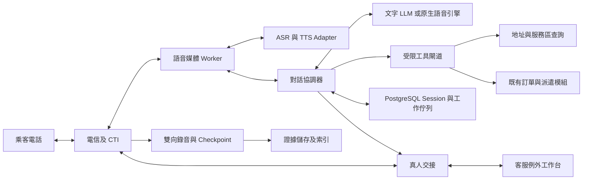
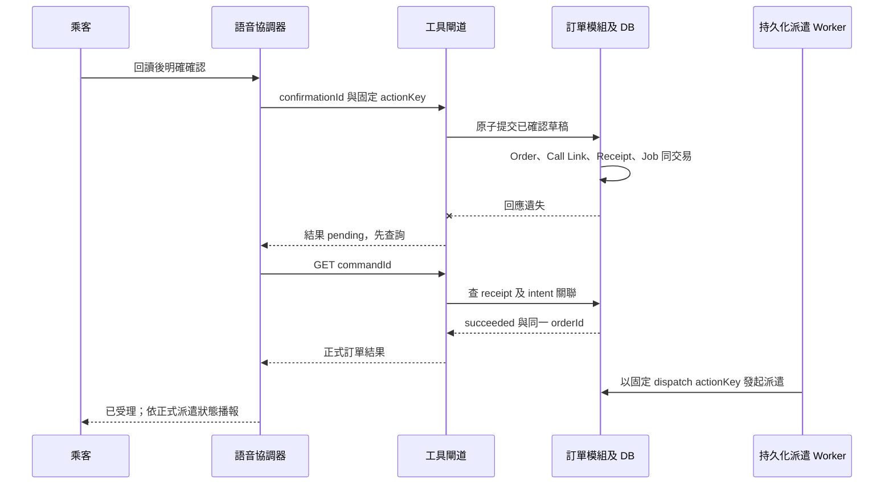

# 第一階段無人語音叫車 — 系統設計（SD）

- 文件代號：`UV-SD-001`；版本：`0.1`；日期：2026-09-06。
- 產品方向：使用者已確認「AI 獨立完成主要叫車流程，少數無法完成的例外交真人」。
- 文件狀態：詳細設計稿。用於規劃與實作前審閱；本文件不代表供應商已採購、功能已實作或正式環境已驗證。
- 配對需求：[無人語音叫車 SA](phase1-unattended-voice-booking-sa-20260906.md)。功能範圍、需求編號、業務驗收以 SA 為準；本文件擁有新增的技術狀態、資料、介面與處理規則。
- 原始碼盤點基準：`88cf38048c6b6bb565fd2c11d8a9db2706919fca`；只作程式現況依據，不當作部署證明。

## 1. 設計目標與不可違反的規則

1. 一般成功路徑沒有真人逐筆審核。乘客對 AI 的明確確認，是提交交易的必要條件；AI 的自述或內部推理不算確認。
2. ASR 聽、文字 LLM 理解及提出工具請求、TTS 說；TWM 不是一個已包含完整對話及派車能力的單一模型。
3. 訂單、派遣、取消、費用與 ETA 的真值由既有領域模組提供。LLM 不直接寫資料庫，也不能替代領域驗證。
4. 無供應商 confidence 欄位時使用 `null`，不得把 `final=1`、LLM 自評或文字流暢度轉成辨識可信分數。
5. 新建訂單只對已確認且仍有效的草稿版本執行一次。斷線、重試、雙 worker、真人接手都不能造成第二張單。
6. `order accepted`、`dispatch requested`、`driver assigned`、`ETA available` 是不同事實；播報內容必須對應已取得的後端結果。
7. 不借用真人 `agentId`，不放寬現有 ops assistant 的人工確認邊界。新增受限的機器行為身分與語音交易入口。
8. 原始雙向通話錄音由話務／錄音層負責；TWM `saveResult`、ASR 逐字稿及 LLM 摘要都不能取代完整錄音。
9. 同一通電話只有一個可執行 mutation 的控制者。真人接通後，AI 停止主動發話及交易；只保留被明確開啟的旁路輔助。
10. 本次產品方向擴充 owned 電話入口；不因此重開乘客 App／Web，也不讓 AI 取得第三方平台訂單的寫入權。

## 2. 現況與整合差異

| 現有位置 | 已有能力／限制 | 本設計要求的差異 |
| --- | --- | --- |
| [電話建單 controller](../../apps/api/src/modules/owned-mobility/owned-mobility.controller.ts) `createCallCenterOrder` | `POST /api/call-center/orders`，以 `IdempotencyService` 包住建單 | 保留人工入口；新增機器專用入口及可查詢交易結果的持久化 receipt |
| [電話建單 service](../../apps/api/src/modules/owned-mobility/owned-mobility.service.ts) `createCallCenterOrder` | `agentId`、`ops_user`、`standard_taxi`、`realtime`、`tenantId=null`；ETA 目前固定 10 | 抽取共用領域 command，新增 typed actor／line scope；不得直接沿用固定 ETA |
| 同檔 `buildRecordingGate` | 以是否存在 `recordingId` 判 gate | AI 路徑必須驗證錄音 checkpoint 與確認證據，不能填入任意 ID 放行 |
| [callcenter](../../apps/api/src/modules/callcenter/callcenter.service.ts) | session、錄音 callback、callback task、order 關聯 | 增加 AI 身分、provider call leg、機器控制權及交接對應 |
| [callcenter module](../../apps/api/src/modules/callcenter/callcenter.module.ts) | 註冊 sandbox provider adapter | 實作並驗證真實 CTI、雙向媒體、錄音、轉接與斷線事件 |
| [既有 contracts](../../packages/contracts/src/index.ts) `CreateCallCenterOrderCommand` | 必填真人 `agentId` | 新契約不以虛構員工 ID 過關；新增相容 union／專用 command |
| [ops assistant](../../apps/api/src/modules/assistant/assistant.instructions.ts) | 提議動作、真人確認 | 保留用途；無人語音由獨立 tool gateway 執行乘客已確認的交易 |
| [已接受事件決策](../01-decisions/SD-DP-20260817-009-domain-event-contract-and-write-authority.md) | 模組化單體、直接 typed call，非完整 domain event bus | 語音 durable job／session log 為本功能新增；不假設已有 Kafka 或全域 outbox |

本文件中 `/api/voice/*`、`Voice*` 型別及資料表均為**新設計**，不是可直接使用的既有端點。實作時加入 contracts/Zod/OpenAPI，再落 controller，不能將 Markdown JSON 當已完成契約。

## 3. 架構與服務分工

### 3.1 參考架構

本版先以「TWM ASR＋文字 LLM＋TWM TTS」定義可替換的串接基線；採購結果仍由整條無人叫車評测決定。OpenAI Realtime／Gemini Live 是同一組業務工具與交易規則下的替代對話引擎，不得繞過確認與建單 gate。



- 現有 `apps/api` 保留領域寫入權；新增 `voice-booking` 模組處理 session、草稿、確認、工具授權與管理查詢。
- 新增 TypeScript/Node 語音 worker 處理長連線、音訊封包、ASR/TTS、VAD 與播放取消；與 API 分開擴容，避免媒體負載阻塞派遣 API。
- PostgreSQL 保存必要狀態與工作 receipt；Redis 只供快取／短期通知，不能作確認或去重的唯一來源。
- 錄音二進位放 CTI 或既有 object store；資料庫只存索引、雜湊、存取策略與片段 manifest。
- 第一版使用資料庫 job table＋worker lease 處理跨程序工作；領域內可在同一 DB transaction 的部分仍用 typed call。無新增全平台訊息匯流排要求。

### 3.2 邊界與所有權

| 元件 | 負責 | 不擁有 |
| --- | --- | --- |
| CTI adapter | 號碼／SIP line、call legs、DTMF、接聽／掛斷／轉接、簽章驗證 | 地址、訂單、模型判斷 |
| Media worker | PCM／μ-law 轉換、時序、播放緩衝、echo 處理、VAD、barge-in | 任意 order mutation |
| ASR adapter | 音訊轉文字、partial/final、segment 與版本 | 乘客同意的最終判定 |
| Dialogue orchestrator | 問題次序、修正、草稿、回讀、有限重試、例外路由 | 價格、服務區或車輛資格真值 |
| Tool gateway | schema、scope、draft/lease/version gate、領域呼叫與最少資料回傳 | 讓 LLM 指定 URL/SQL 或任意 endpoint |
| Owned-mobility | 建單、訂單狀態、派遣、取消與 transaction receipt | ASR/TTS 連線 |
| Callcenter/evidence | callId、錄音、真人交接、callback、證據權限 | 模型可自行覆寫的證據 |
| Ops console | 少數例外承接、通話摘要、操作及監督 | 逐筆批准 AI 正常訂單 |

### 3.3 供應商替換與電話接入選擇

| 路線 | 共用部分 | 特有工作 | 決策狀態 |
| --- | --- | --- | --- |
| TWM＋文字 LLM | 工具、草稿、確認、錄音、交接、metrics | TWM token/ticket、音訊及模型 adapter；停頓／插話協調 | 本版參考路線；未決標 |
| OpenAI Realtime | 相同交易 gate 與工具；SIP 或 media adapter | session、工具事件、音訊取消／對話截斷；台客語實測 | 對照候選 |
| Gemini Live | 相同交易 gate 與工具 | PCM 重採樣、播放 buffer 清除、模型版本與 preview 條件 | 對照候選 |
| LiveKit／Pipecat | 可承接媒體與對話編排 | 自訂 TWM adapter、CTI／部署；本專案 TypeScript 基線需評估框架語言 | 框架候選，不當語音模型 |
| Vapi | 平台媒體／工具／轉接能力 | custom transcriber 與 TTS 協定轉換；驗證控制權及資料保存 | 可組合候選，另計平台費 |
| Retell | 託管語音代理對照 | 先確認任意 TWM ASR/TTS 介面及轉接模式 | 未確認可替換性 |

選定平台前必須能保存本文件的 `draftVersion`、`confirmationId`、`actionKey`、`leaseEpoch` 與機器授權邊界；平台不提供必要控制時，不以功能展示取代交易約束。

## 4. 可信來電與執行身分

### 4.1 來電建 session

1. Provider webhook 驗證簽章、時間窗、provider account 與目的 DID／trunk；不接受 caller 或 LLM 提供的 brand/tenant。
2. 由 `voice_line_binding` 查出唯一 `brandId`、`operatingProfileId`、允許服務、語言、人工隊列及錄音策略。未匹配或多重匹配時不啟動建單。
3. 以 `(providerAccountId, providerCallId)` 唯一鍵建立既有 `callId` 及 `voiceSessionId`；轉接後新增 `callLegId`，不產生新的 booking intent。
4. 先做 provider capacity admission，再接通 AI 媒體；滿載直接走該號碼的備援人工／排隊策略，不接起來後靜默失敗。
5. 原始 caller ID 僅為 `assertedCallerPhone`。它不是查單、取消或讀取歷史住址的授權證明。

### 4.2 機器身分

新增領域 actor discriminator `actorType: voice_agent`，對應 IAM 的受限 service principal；名稱、品牌及「AI 語音客服」身分以已批准話術告知乘客。真人接手改用實際 `ops_user`，保留 actor transition。

短期 service token 包含 `aud=voice-tool-gateway`、`servicePrincipalId`、`voiceSessionId`、`brandId`、`operatingProfileId`、`leaseEpoch`、有效期限。以上值由可信 session 注入，不採用工具 body 的同名值。

建議最小 scopes：`voice:session:execute`、`voice:address:resolve`、`voice:owned-order:create`、`voice:owned-order:read-bound`、`voice:handoff:request`。取消另需 `voice:owned-order:cancel-bound` 與當筆 challenge。設定與錄音下載使用不同管理身分；AI runtime 不取得 tenant 管理、價格覆寫、無條件取消或跨品牌讀取 scope。

## 5. 狀態與並行控制

### 5.1 對話狀態（與訂單狀態分開）

| `dialogState` | 進入條件 | 允許下一步 |
| --- | --- | --- |
| `admitted` | 可信 line 與容量成立 | `greeting`／`handoff_pending` |
| `greeting` | 播報 AI 身分及必要錄音提示 | `collecting`／`handoff_pending`／`closed` |
| `collecting` | 收集或修正欄位 | `resolving`／`handoff_pending`／`closed` |
| `resolving` | 查地址、服務區、能力 | `collecting`／`confirming`／`handoff_pending`／`closed` |
| `confirming` | 唯一草稿版本回讀 | `collecting`／`committing`／`handoff_pending`／`closed` |
| `committing` | 有效確認及錄音 checkpoint，action receipt 已建立 | `awaiting_dispatch`／`reconciling`／`collecting`／`handoff_pending` |
| `reconciling` | mutation 結果未知；禁止新 key 重建 | `awaiting_dispatch`／`collecting`／`handoff_pending`／`closed` |
| `awaiting_dispatch` | 訂單已存在，查正式派遣結果 | `reporting`／`handoff_pending`／`closed` |
| `reporting` | 根據正式結果播報 | `closed`／`handoff_pending` |
| `handoff_pending` | mutation 權限凍結並要求交接 | `human_controlled`／`callback_pending`／`closed` |
| `human_controlled` | 真人已接通並取得 lease | `closed` |
| `callback_pending` | 有可聯繫資料及回撥任務持久化 | `closed` |
| `closed` | 電話結束 | 不再執行新的乘客指令；已送出的 mutation 仍可 reconcile |

`closed` 是媒體／對話結束，不等同取消訂單。結果未知時可以 `dialogState=closed` 且 `commitStatus=pending`，由背景工作完成對帳與通知；此為正交狀態而非終止補償。

### 5.2 正交狀態

- `controlOwner`: `ai | handoff | human | none`，配合單調遞增 `leaseEpoch`。
- `mediaState`: `connecting | active | reconnecting | ended`。
- `commitStatus`: `none | pending | succeeded | rejected`；pending 可跨掛斷存在。
- `recordingState`: `starting | capturing | checkpoint_ready | finalizing | finalized | failed | expired`。
- `confirmationState`: `absent | readback_playing | awaiting_answer | accepted | invalidated | consumed`。
- `outcome`: `auto_booking_created | auto_no_service | auto_query_completed | human_handoff | callback_scheduled | abandoned | technical_failure`；另以 dispatch result／原因維度分析，不將無車算成成功派車。

### 5.3 序列與 fencing

每通 session 由單一 worker lease 處理；DB compare-and-swap 更新 `sessionVersion`。媒體事件攜帶 `mediaEpoch`、`sequence`，ASR 事件另有 provider session、segment、revision。相同事件 dedup，舊 epoch final 不得覆蓋新連線內容。

偵測乘客開始說話時先增加 `inputEpoch`、停止／清除 TTS 播放、標記實際播到的位置，再解析語句。若處於 `confirming` 且回讀被打斷，該次回讀不算完整播放；對「嗯／對」不得建立確認。交易執行前比較 `leaseEpoch`、`draftVersion`、`inputEpoch` 與當前 owner；任一改變則撤銷舊請求。

資料庫 transaction 一旦提交，稍後更正只能走該既有 order 的修改／取消政策，不能假裝原提交尚未發生。若更正與提交併發，以持久化事件及 commit receipt 的順序判定，並明確向乘客說明狀態。

## 6. 草稿、地址與乘客確認

### 6.1 草稿的欄位證據

每個 slot 保存 `rawText`、`normalizedValue`、`sourceTurnIds`、`sourceSegmentIds`、`providerConfidence: number | null`、`validationState`、`confirmedByCustomerAt`。LLM 只能產生候選值；normalized address 由地址服務回傳，不能由模型自造經緯度。

最少業務資料：上／下車地點、可服務的即時產品、乘車人數、聯絡方式、必要上車備註。姓名是否必填依既有 `PassengerProfile`／品牌政策，不能因模型問卷固定而增加不必要問題。來電者代叫時分開 `bookerContact` 與 `passengerContact`，向乘客說明司機會聯絡哪個號碼；不把 ANI 無條件覆蓋乘客電話。

地址解析保存 provider place ID、標準地址、座標、院區／入口／集合點、解析版本、服務區檢查結果與有效時間。同名醫院、台北／新北、道路與門牌、省略縣市時必須消歧；候選數超過一且無唯一選擇，不得提交。地圖失效時只可蒐集草稿後轉例外，不以 LLM 猜測位置放行。

修改上／下車、時間、人数、商品、聯絡對象／電話或有費用影響的需求，必須增加 `draftVersion` 並使舊 confirmation 失效。非交易性的口頭寒暄不改版。地圖／價格／供應預檢過期時重新驗證；若結果改變乘客承諾，再回讀確認。

### 6.2 確認票據

```json
{
  "confirmationId": "uuid",
  "voiceSessionId": "uuid",
  "intentId": "uuid",
  "action": "create_owned_immediate_order",
  "draftVersion": 7,
  "snapshotHash": "sha256-of-canonical-business-snapshot",
  "readbackPlaybackId": "uuid",
  "readbackCompletedEventId": "uuid",
  "affirmationTurnId": "uuid",
  "affirmationFinalEventId": "uuid",
  "inputEpoch": 12,
  "leaseEpoch": 3,
  "recordingCheckpointId": "uuid",
  "confirmedAt": "2026-09-06T02:00:00Z",
  "expiresAt": "2026-09-06T02:02:00Z"
}
```

此為服務端產生的證據模型，不讓 LLM 在工具參數傳 `confirmed=true` 代替。`snapshotHash` 使用固定 canonical JSON／版本化序列化，包含乘客確認的全部交易欄位；時間為 UTC，口語時間按 `Asia/Taipei` 解釋並回讀日期。

接受確認需同時成立：

- 綁定唯一正在確認的 action、intent、草稿版本與控制 epoch。
- 話務端報告整段交易回讀已播放完成；只有「TTS 生成完成」不算乘客已聽到。
- 回讀後收到乘客的 final 語句或已提示的 DTMF 確認；VAD/echo 層證明不是本端 TTS 回音。
- 回答為對該交易的明確肯定。否定、疑問、「對，但是…」、修正句、背景他人聲音或模糊語句皆須處理後重問。
- 沒有尚未處理的乘客新語句或工具更新；驗證 `inputEpoch`、`draftVersion`、`leaseEpoch` 未失效。
- 有覆蓋必要回讀與肯定內容的 durable recording checkpoint；保存 TTS 播放事件及 ASR 證據連結。

初始確認有效期建議 120 秒，為可版本化產品參數，不是供應商限制。若已提交 action，票據標 consumed；過期後先查 command receipt，不能先發新票据重建。

### 6.3 工具介面允許清單

| 工具名 | 類型 | Server 必查 | 可回模型資料 |
| --- | --- | --- | --- |
| `resolve_location` | read | line 服務區、查詢長度、流量限制 | 最多 3 個具名稱／區域的候選，無其他乘客資料 |
| `check_booking_eligibility` | read | 產品、座標、可服務區、人数／需求 | 可受理與否、可說給乘客的原因；不保證已有車 |
| `prepare_booking_readback` | prepare | 必填、草稿版本與地址有效性 | deterministic 確認內容及 playback task ID |
| `commit_confirmed_booking` | mutation | §6.2＋§7＋§8 全部 gate | commandId、正式 orderId、正式狀態 |
| `get_bound_booking_status` | read | 本通新單或有效 passenger proof；最少資訊 | 訂單／派遣狀態、來源與時間有效的 ETA |
| `request_dispatch_for_bound_order` | mutation | 已提交訂單、dispatch 權限、gate、固定 action key | 接受／拒絕／pending，不回自行推測的車牌 |
| `request_handoff` | control | session scope、當前 owner、reason code | 排隊／接通／callback 状態 |
| `create_callback_request` | mutation | 可聯繫資料與乘客同意回撥、去重 | 已保存的 callback ID 与承諾限制 |
| `cancel_bound_booking` | gated mutation | 功能旗標、passenger proof、取消規則、orderVersion、回讀確認 | 正式取消結果或拒絕原因；預設不啟用既有未知授權路徑 |

不得提供 `execute_http`、SQL、任意 shell、任意 URL fetch、任意 driver assignment 或價格 override 工具。工具輸入／輸出分別做 Zod 驗證；使用者口述、轉寫、檢索及第三方工具內容全部視為資料，不得改寫系統授權。

## 7. 交易一致性與未知結果

### 7.1 必須新增的 durable transaction

現有 phone service 以記憶體建立訂單後呼叫非同步 `persistChanges`，callcenter persistence 亦可能背景寫入；現有 idempotency completion 另行儲存，例外還可能刪 key。因此**不能只加一個 `Idempotency-Key` 就宣稱無人建單安全**。

新增 `commitVoiceBooking` 領域 command，必須在同一 PostgreSQL transaction 中：

1. 鎖定 `voice_intent`、session owner 及 confirmation，檢查版本與有效證據。
2. 取得／建立唯一 command receipt；已 succeeded 則回原結果，payload hash 不同則拒絕。
3. 執行既有地址、產品、服務區及營運資格規則，不跳過任何原有 gate。
4. 寫 owned order、可信 actor、call-order 關聯及確認 snapshot reference。
5. 消耗 confirmation，寫 `voice_command_receipt.status=succeeded` 與正式 orderId。
6. 寫 `voice_work_item` 的派遣／結果通知工作與必要 audit entry，全部成功後 commit。
7. commit 成功後才回傳建單成功。媒體程序不以記憶體結果提前播報。

既有模組如果目前不能共享 transaction，實作必須先新增 transaction-aware repository/unit-of-work；不以包一層舊 HTTP endpoint 的方式冒充原子性。派遣對外副作用由 worker 後續執行，以 receipt 確認，不在長時間 DB transaction 內等待司機。

### 7.2 action key 與查重

- Server 產生 `actionKey = brandId + callId + intentId + action`；同一 booking intent 的重試始終使用同 key。
- key **不包含** ASR 連線 ID、LLM tool-call ID、worker ID 或每次重試時間。確認前草稿可變；首個 action 開始後固定 payload hash。
- DB `UNIQUE(brand_id, call_id, intent_id, action)` 為最終防線；另在 owned order 增 `UNIQUE(voice_intent_id)`（非空時）。
- 同 key 同 hash 回原 receipt；同 key 不同 hash 回 `VOICE_ACTION_PAYLOAD_CONFLICT`，先處理原單，不自行生成新 intent。
- 第一版一通電話一個新建叫車意圖。查詢／取消不覆寫主 `linkedOrderId`；以 action 關聯紀錄保存其他被操作 order。
- 回撥／重新來電的跨通話查重，以經核對的聯絡方式與當前訂單提供候選提示；不是只凭電話號碼自動合併或取消。讀取詳細資訊前仍需身份 proof。

### 7.3 timeout／crash



- Gateway timeout 回 `202 pending`，協調器說「正在確認是否已成功受理」，不能說失敗後重下單。
- Worker crash 後由 lease reaper 接手；重新讀 receipt／order 唯一關聯，再决定續作。同一 action 未確定前，不允許真人另建替代單。
- DB 明確拒絕且 rollback 才是 `rejected`；網路例外不等於交易 rollback。
- 若確認後掛斷，已 durable commit 的單繼續派遣；未開始提交則不新建。pending command 由背景 reconcile，不因 session closed 丟棄。
- 需要通知掛斷乘客時，使用品牌已開通且具授權的通知／回撥能力；沒有可用渠道则建立例外任務，不能假稱已通知。這不是新建乘客收據中心。
- job 採至少一次傳遞＋consumer 冪等；不得承諾分散式網路層 exactly-once。

## 8. 錄音證據與通話中派車

### 8.1 問題與本版方案

通話結束才產生完整音檔的 provider，無法同時滿足「等完整錄音 callback 才派車」及「AI 在同通電話內完成派車並回報」。本設計採**連續錄音＋已封閉確認片段 checkpoint**，是新增 evidence 模型；正式上線前需與既有錄音／查核政策完成相容驗收。

不得呼叫既有 recording callback，填任意 `recordingId` 或把確認片段 `endTime` 當整通 `endedAt`，藉此把 gate 翻成 clear。

### 8.2 checkpoint 成立條件

- CTI／可信 recorder 保存雙向原始通話，涵蓋 AI 身分告知、交易回讀、乘客確認及先前影響該草稿的重要更正。
- 每個已封閉片段有 object key、immutable version、checksum、channel/leg、開始／結束媒體 offset、UTC 對照、`durableAt`。
- Recorder 以認證介面回報；evidence service 驗證 object 版本、可讀性、雜湊、片段連續性、品牌/call 關聯與存取策略後產生 `checkpointId`。
- 該 checkpoint 的 manifest 明確含所用 `readbackPlaybackId`／affirmation 時段，且與 confirmation snapshotHash 連結。
- 關聯至穩定 `recordingId` 與追加式 manifest；後續片段不修改已封閉片段，整通電話結束後產生 final manifest。
- gate 條件是 evidence service 的驗證狀態與 coverage，不是欄位非空。若雙向內容缺漏／持久化失敗，停止 autonomous commit，轉人工／callback 也不得冒充已有錄音證據。

### 8.3 gate 與失敗處理

| 狀態 | 新 AI 單可否提交／派遣 | 處置 |
| --- | --- | --- |
| `capturing` 但尚無 checkpoint | 否 | 等待 bounded flush；失敗轉例外 |
| `checkpoint_ready` 且 coverage／確認有效 | 可依其他業務 gate 提交與派遣 | 維持連續錄音；保存 finalization job |
| `finalized` | 可依原有規則使用 | callback 重送只更新相同 manifest 的可驗證結果 |
| 只有未驗證 `recordingId` | 否 | 記 `VOICE_RECORDING_NOT_DURABLE` |
| commit 後後半段錄音失敗 | 不自動取消已存在訂單 | 保存已封閉證據、阻止尚未執行的額外 mutation，產錄音例外與修復任務 |
| 最終音檔逾期依政策刪除 | 不追溯推翻歷史訂單 | 索引標 `expired` 與原因，不能當初始錄音缺漏 |

分段 checkpoint 是此功能的技術與證據驗收前提，未完成時不標 autonomous-ready。可先測試整通錄音及模擬交易，但那不是正式無人叫車閉環。

## 9. 持久化資料設計

### 9.1 新增邏輯資料表

以下為待新增的資料模型；實際 schema 與 migration 序號依當時 migration head 配置。既有 order／call session 仍為單一真值，不再建第二套訂單表。

| 資料表 | 主鍵及關聯 | 主要欄位 | 約束／索引 |
| --- | --- | --- | --- |
| `voice_line_binding` | `line_binding_id` | provider account、DNIS／trunk、brand、operating profile、queue、enabled、version | 有效版本的 provider/account/line 唯一；停用須阻止新 session |
| `voice_route_profile` | `profile_id, version` | models、語言、retry/timeout、capabilities、recording policy、人工 fallback | immutable published version；session pin 版本 |
| `voice_session` | `voice_session_id`；FK callId | line binding version、controlOwner、leaseEpoch、sessionVersion、dialog/media/commit state、inputEpoch、outcome | provider account/call 唯一；active state／lease expiry 索引 |
| `voice_call_leg` | `leg_id`；FK session | provider leg ID、角色、媒體 epoch、started/endedAt、transfer correlation | provider account/leg 唯一；不覆寫原通話起迄 |
| `voice_turn` | `turn_id`；FK session | speakerRole、media epoch、segment、revision、final、語言、text encrypted、audio offsets、model version | providerSession/segment/revision 唯一；session/sequence 索引 |
| `voice_intent` | `intent_id`；FK session | action、currentDraftVersion、boundOrderId、status | 每個 v1 session 最多一個 create intent |
| `voice_draft_revision` | `intent_id, draft_version` | structured slots、validation refs、canonical snapshot、snapshotHash | 版本不可變；修改產生新 row |
| `voice_confirmation` | `confirmation_id`；FK draft/checkpoint | §6.2 全欄位、state、consumedCommandId | action/intent/draft 的 active 票據唯一；consumption 鎖定 |
| `recording_checkpoint` | `checkpoint_id`；FK recording/call | immutable manifest/version、hash、coverage、verifiedAt、policyVersion | 由 evidence owner 寫；call/recording/manifestVersion 唯一 |
| `voice_command_receipt` | `command_id`；FK intent | actionKey、payloadHash、status、orderId、resultVersion、error、timestamps | §7 唯一鍵；pending/updatedAt 索引 |
| `voice_work_item` | `work_id`；FK command/session | workType、dedupeKey、payloadRef、status、attempt、runAfter、leaseEpoch、lastError | dedupeKey 唯一；可領取狀態/runAfter 索引 |
| `voice_handoff` | `handoff_id`；FK session | reason、queue、state、agentId、ownerEpoch、summaryRef、callbackId | 每 session 最多一個 active handoff；人工隊列索引 |
| `voice_passenger_proof` | `proof_id`；FK session/order | method、verifiedContactRef、allowedActions、orderScope、expiresAt、attemptCount | 短效、不可跨 session/action 任意重用；不保存 OTP 明文 |
| `voice_usage_record` | `usage_id`；FK session | provider/model/version、billingUnit、quantity、currency、rateCardVersion、estimated/actual | provider usage ID 唯一；按日期/brand 聚合 |

既有 owned order 增 `voiceIntentId`、`bookingActor`、`customerConfirmationId`、`recordingEvidenceRef`；既有 call session 增 source binding／AI 身分資料。`agentId` 在真人路徑仍保留；機器路徑改用明確 discriminator，不以空字串虛構真人。

### 9.2 資料分類與保存

| 類型 | 保存規則 | 寫入／讀取限制 |
| --- | --- | --- |
| 原始音檔與錄音片段 | 繼承現有音檔 180 天政策，legal hold 例外 | provider/object store；簽名短效下載、逐次 audit |
| call/recording 索引 | 繼承現有 30 天 hot＋700 天 archive | 保留 expired/missing 的差異；不靠永久公開 URL |
| confirmation／command／manifest metadata | 建議登錄為與訂單來源證據相同的 730 天策略；正式值透過 evidence policy 管理 | 保存必要 refs/hash、版本和結果，不複製整段逐字稿 |
| 詳細逐字稿／對話及交接摘要 | 本版建議上限 180 天且可按品牌縮短；非既有政策已批准值 | 加密、限定營運存取；評測匯出先去識別 |
| live buffer／暫態字幕 | 記憶體或短效 session store；斷線可恢復窗後清除 | 不寫一般 application log，不作長期 replay |
| OTP／verification secret | 僅雜湊／服務端驗證狀態，短效 | 不寫錄音提示中的密碼、不傳 LLM、不留明碼 log |
| 成本與品質統計 | 優先去識別聚合，依已登錄 policy | telemetry label 不包含電話、地址、逐字稿 |

以上繼承值引用[現有 evidence policy](../03-runbooks/evidence-retention-and-evidentiary-access-policy.md)，描述的是專案政策，不另行宣稱法律結論。詳細逐字稿與新增 metadata family 必須在實作時登錄 policy version；不得默認無限期保留或供第三方訓練。

跨通話搜尋聯絡電話採 keyed HMAC／受控 lookup token；明文電話加密保存，不能以普通 SHA256 視為去識別。legal hold 覆蓋關聯音檔、逐字稿及證據；刪除需涵蓋 provider 副本、備份策略及下載副本管理。

## 10. 新增 API 與事件契約

### 10.1 API 清單

| Method／新路徑 | Caller | 功能與主要 precondition |
| --- | --- | --- |
| `POST /api/voice/providers/{provider}/events` | 已驗證 CTI | 來電／斷線／轉接事件；簽章、時間窗、event dedupe |
| `POST /api/voice/sessions/{sessionId}/media-access` | media worker | 短效 media token；綁 session/leg/epoch，禁止暴露 provider 長效憑證 |
| `GET /api/voice/sessions/{sessionId}` | scoped worker／ops | 恢復 session snapshot；PII 權限分層 |
| `POST /api/voice/sessions/{sessionId}/turns` | worker | normalized ASR final／revision；CAS 与 event dedupe |
| `POST /api/voice/sessions/{sessionId}/drafts` | worker | 更新草稿候選；expectedVersion，server validation |
| `POST /api/voice/sessions/{sessionId}/readbacks` | worker | 封存確認 snapshot 並生成播放任務 |
| `POST /api/voice/sessions/{sessionId}/confirmations` | 協調器 | 驗證回讀／affirmation／coverage，建立 server confirmation receipt |
| `POST /api/voice/sessions/{sessionId}/booking-commands` | tool gateway | commit confirmation；不得重傳任意 final 地址或 actor |
| `GET /api/voice/sessions/{sessionId}/commands/{commandId}` | scoped worker／ops | pending/succeeded/rejected 與正式 orderId；unknown 結果對帳 |
| `POST /api/voice/recordings/{recordingId}/checkpoints` | recorder service | 驗證 immutable segment manifest；與既有整通 callback 分開 |
| `POST /api/voice/sessions/{sessionId}/handoffs` | worker／ops | 凍結 mutation、轉 queue，回傳交接 receipt |
| `POST /api/voice/handoffs/{handoffId}/claim` | authenticated ops | CAS 取得控制 epoch，配合 provider 已接通事件 |
| `POST /api/voice/sessions/{sessionId}/passenger-proofs` | verification service | 確認 challenge；驗證秘密不得經 LLM |
| `POST /api/voice/sessions/{sessionId}/cancellation-commands` | tool gateway | capability 開啟後才有；proof＋取消回讀＋預期 order version |
| `GET /api/voice/operations/sessions` | scoped ops | session／例外列表、品質、使用量；強制分頁、brand scope |
| `PUT /api/voice/operations/route-profiles/{id}` | 管理角色 | 建新設定版本；無權變更時拒絕，修改須 audit |

所有業務 API 使用既有 `{data, meta:{requestId,timestamp}}` success envelope 及 `{error:{code,message,details,retryable,traceId}}` error envelope。Provider webhook 的回應依 provider ack 協定，由 adapter 轉換；不能要求電話商套用內部 envelope。

### 10.2 提交範例

```json
{
  "intentId": "uuid",
  "confirmationId": "uuid",
  "expectedDraftVersion": 7,
  "expectedLeaseEpoch": 3,
  "expectedInputEpoch": 12
}
```

`Idempotency-Key` 由可信 gateway 對應固定 `actionKey`；actor、brand、phone source、地址／人数／電話全部從已驗證 session 與 confirmation snapshot 載入。

已提交回 `201`；相同請求 replay 回 `200` 且同一 command/order。回應遺失或尚待處理回 `202`：

```json
{
  "data": {
    "commandId": "uuid",
    "status": "pending",
    "orderId": null,
    "nextAction": "query_same_command",
    "pollAfterMs": 1000
  },
  "meta": {
    "requestId": "uuid",
    "timestamp": "2026-09-06T02:00:01Z"
  }
}
```

`orderId=null` 僅代表尚未得知，不證明沒有單。不得讓前端／模型因這個 null 重新建立意圖。

### 10.3 錯誤語義

| Code | HTTP | 應對 |
| --- | --- | --- |
| `VOICE_LINE_NOT_BOUND` | 403 | 不建單，走該 provider 的預設失敗路由 |
| `VOICE_SCOPE_DENIED` | 403 | 不重試擴權，不向乘客暴露內部資料 |
| `VOICE_SESSION_NOT_OWNER` | 409 | 舊 worker 停止交易／播放，讀取 owner |
| `VOICE_DRAFT_STALE` | 409 | 載入新草稿，回讀確認 |
| `VOICE_CONFIRMATION_REQUIRED` | 422 | 完成乘客確認，不轉真人作常規代替 |
| `VOICE_CONFIRMATION_EXPIRED` | 409 | 先查是否已 consume；未提交才重確認 |
| `VOICE_RECORDING_NOT_DURABLE` | 409 | 等 bounded checkpoint 或轉例外，不偽造 recordingId |
| `VOICE_LOCATION_AMBIGUOUS` | 422 | 用候選地點追問 |
| `VOICE_SERVICE_NOT_AVAILABLE` | 422 | 明確說明不能受理，不先建錯誤產品 |
| `VOICE_ACTION_PAYLOAD_CONFLICT` | 409 | 查原 command／order，再走合法更正 |
| `VOICE_PASSENGER_PROOF_REQUIRED` | 403 | 做驗證或轉人工；不洩漏訂單存在與細節 |
| `VOICE_PROVIDER_CAPACITY` | 503 | admission fallback，不無限重連佔用 |
| `VOICE_PROVIDER_UNAVAILABLE` | 503 | bounded failover／轉人工，保留已收集資料 |

### 10.4 內部 normalized event

```json
{
  "eventId": "uuid",
  "voiceSessionId": "uuid",
  "callLegId": "uuid",
  "mediaEpoch": 2,
  "sequence": 98,
  "type": "asr.segment.final",
  "occurredAt": "2026-09-06T02:00:00Z",
  "payload": {
    "providerSessionId": "opaque",
    "segmentId": "7",
    "revision": 3,
    "text": "對，從這個入口上車。",
    "language": "cmn-TW",
    "confidence": null,
    "audioStartMs": 42000,
    "audioEndMs": 44500
  }
}
```

事件種類包含 `call.started/ended`、`speech.started/ended`、`asr.segment.partial/final`、`tts.playback.started/completed/cancelled`、`recording.checkpoint.verified`、`command.receipt.updated`、`handoff.connected/failed`。這些是新 voice session log／worker 協定，不宣稱已存在全域 domain topic。

音訊 offset 由 media bridge 產生；供應商不提供逐字時間戳時不可假造 word timestamps。字幕文字不可直接插進系統指令；後端為每種事件限制大小與來源。
