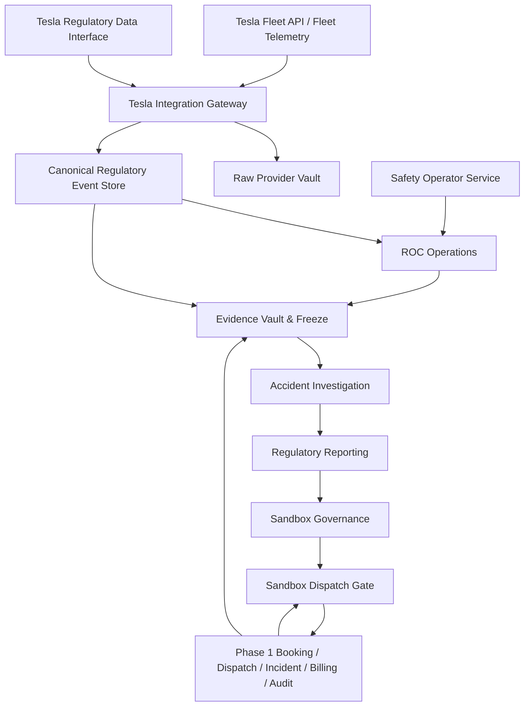
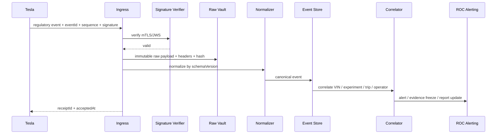

# Phase 2 系統設計文件（SD）


> 文件基準日：2026-06-25  
> 適用專案：計程車自動駕駛專案 Phase 2  
> 正式定位：**Tesla FSD 在地監理沙盒營運、安全監控與事故證據平台**  
> 系統邊界：Tesla 負責 FSD 感知、規劃與車輛控制；本平台負責在地監理、沙盒條件、Tesla 資料介接、行控、安全員、事故、證據與監理報告。  
> 明確排除：不建置路側 RSU／SPaT／V2X，不監看方向盤角度、煞車深度或 Tesla 內部感知物件，不建立遠端駕駛或第三方 FSD 控制。


## 1. 設計總覽



## 2. Bounded Context 與 Landing Zones

### 2.1 Backend Modules

```text
apps/api/src/modules/tesla-integration
apps/api/src/modules/tesla-telemetry
apps/api/src/modules/tesla-regulatory-events
apps/api/src/modules/sandbox-governance
apps/api/src/modules/sandbox-dispatch-gate
apps/api/src/modules/safety-operator
apps/api/src/modules/roc-operations
apps/api/src/modules/vehicle-evidence
apps/api/src/modules/accident-investigation
apps/api/src/modules/regulatory-reporting
```

### 2.2 Frontend / Mobile

```text
apps/roc-console-web                   # 新增，獨立於一般 Ops Console
apps/platform-admin-web               # 增加 sandbox / Tesla integration governance
apps/ops-console-web                  # 增加 AV fallback / passenger recovery
apps/driver-app                       # 增加 Safety Operator Mode
```

### 2.3 Shared Packages

```text
packages/contracts                    # canonical DTO / event / error contracts
packages/api-client                   # typed clients
packages/shared-test-fixtures         # Tesla mock / sandbox scenarios
packages/ui-web                       # ROC shared web primitives only
```

## 3. Tesla Integration Architecture

### 3.1 Public Fleet Plane

用途：Tesla 公開 Fleet API／Fleet Telemetry。

- OAuth and business token
- virtual key pairing
- telemetry configuration
- vehicle status and location
- SOC / range / charging
- navigation destination / waypoints
- approved non-driving commands
- provider health and rate limit

公開介面不得被解讀為可控制 FSD。命令 broker 僅允許 allowlist 中 Tesla 公開提供且沙盒政策允許的 command。

### 3.2 Regulatory Data Plane

用途：Tesla 原廠 FSD 監理資料合作介面。

接口模式：

1. `push`：mTLS + JWS webhook／event stream；
2. `pull backfill`：按 VIN、時間與 sequence 回補；
3. `session summary`：行程後 summary；
4. `incident evidence reference`：重大事件資料索引。

系統不得假設 endpoint 已公開；透過 `TeslaRegulatoryEventProvider` adapter 隔離合作契約。

```ts
interface TeslaRegulatoryEventProvider {
  getCapabilities(vin: string): Promise<TeslaRegulatoryCapabilityProfile>;
  verifyEventSignature(raw: Uint8Array, headers: Record<string, string>): Promise<boolean>;
  normalizeEvent(raw: unknown): Promise<TeslaAutonomyTransitionEvent>;
  listEvents(input: TeslaRegulatoryBackfillQuery): Promise<TeslaAutonomyTransitionEvent[]>;
  getSessionSummary(sessionId: string): Promise<TeslaAutonomySessionSummary>;
  getIncidentEvidence(providerIncidentId: string): Promise<TeslaIncidentEvidenceReference>;
}
```

Adapters：

```text
TeslaPublicTelemetryAdapter
TeslaRegulatorySandboxAdapter
TeslaRegulatoryMockAdapter      # 測試用，不能當外部實證
```

## 4. Event Ingestion Pipeline



### 4.1 Idempotency

- unique `(provider_code, provider_event_id)`
- sequence per VIN or session
- duplicate payload preserved as delivery attempt but not duplicate canonical event
- hash mismatch on same providerEventId => security incident

### 4.2 Gap Detection

- track last sequence per VIN/session
- detect missing sequence or stale heartbeat
- queue backfill request
- if gap exceeds policy threshold, mark vehicle `regulatory_data_incomplete` and stop new AV assignments

## 5. Sandbox Governance Model

### 5.1 Program Hierarchy

```text
SandboxExperimentProgram
 ├─ JurisdictionProfile
 ├─ ApprovalDocumentVersion
 ├─ ApprovedOperatingArea / RouteVersion
 ├─ ApprovedOperatingSchedule
 ├─ ApprovedVehicleEnrollment
 ├─ ApprovedSafetyOperator
 ├─ ReportingPolicy
 ├─ EvidenceRetentionPolicy
 └─ SuspensionResumePolicy
```

### 5.2 Route / Area

使用 PostGIS：

- `operating_area.geometry`：Polygon / MultiPolygon
- `approved_route.geometry`：LineString / MultiLineString
- `pickup_dropoff_zone.geometry`：Polygon
- versioned and effective-dated

不依賴高精地圖或路側設備；geometry 僅作在地核准範圍與營運監管。

## 6. Sandbox Dispatch Gate

輸入：Phase 1 booking + candidate Tesla vehicle + safety operator + experiment snapshot。

檢核：

- service entitlement
- time window
- pickup / dropoff / route inside approval
- vehicle enrollment and qualification
- safety operator qualification and shift
- Tesla capability and integration health
- telemetry and regulatory event freshness
- SOC / range policy
- operational hold / incident
- trip count / mileage limits
- required evidence recorder health

輸出：

```ts
type SandboxDispatchDecision =
  | "eligible"
  | "eligible_requires_manual_release"
  | "ineligible_outside_approved_area"
  | "ineligible_outside_approved_time"
  | "ineligible_vehicle_not_approved"
  | "ineligible_safety_operator_missing"
  | "ineligible_provider_capability_missing"
  | "ineligible_telemetry_stale"
  | "ineligible_regulatory_feed_stale"
  | "ineligible_insufficient_soc"
  | "ineligible_evidence_recorder_unhealthy"
  | "ineligible_operational_hold";
```

Evaluation snapshot 必須跟 order assignment 一起保存，避免日後政策版本改變後無法還原。

## 7. Takeover Correlation Model

接管使用三份互不覆蓋的 record：

1. `TeslaAutonomyTransitionEvent` - Tesla 原廠技術事件；
2. `SafetyOperatorTakeoverReport` - 安全員操作與觀察；
3. `RocTakeoverResponseRecord` - ROC 營運處置。

三者由 `takeoverCorrelationId` 關聯。系統產出 `CorrelatedTakeoverCase`，但保留原始時間與來源；不合併成單一「真相時間」。

若資料不一致，建立 `EvidenceDiscrepancyCase`，不由平台自行裁定。

## 8. Evidence Architecture

### 8.1 Data Sources

- Tesla raw regulatory events
- Tesla Fleet Telemetry
- independent onboard evidence recorder
- Safety Operator App reports and uploads
- ROC actions and communications
- Phase 1 booking / dispatch / incident / audit
- post-incident external CCTV / police / insurer documents

### 8.2 Evidence Layers

```text
Raw Provider Vault     - original Tesla payloads / signatures
Telemetry Store        - time-series context
Video Evidence Store   - immutable event clips / original files
Canonical Event Store  - normalized query model
Evidence Manifest      - hash / source / custody / legal hold
Investigation Bundle   - controlled export package
```

### 8.3 Freeze Trigger

- collision or SOS
- Tesla major regulatory event
- safety operator takeover requiring incident
- ROC major-event classification
- route/time violation
- evidence recorder health failure during active trip
- authority preservation request

Evidence freeze 只保全資料，不自動判定責任。

## 9. ROC Architecture

ROC 是 operation control plane，不是 remote driving station。

允許：

- acknowledge alert
- stop new dispatch
- operational hold
- notify safety operator
- request safety operator takeover
- open incident / evidence freeze
- invoke Phase 1 human fallback
- approved Tesla non-driving commands

禁止：

- remote steering / braking / acceleration
- direct FSD engagement/disengagement command unless Tesla officially provides and approval explicitly allows it
- changing Tesla driving decisions

## 10. Phase 1 Integration

| Phase 1 domain | Phase 2 integration |
|---|---|
| Booking / Order | 保留原 booking；加 sandbox fulfillment metadata |
| Dispatch | 在 assignment 前呼叫 Sandbox Dispatch Gate |
| Driver App | Safety Operator Mode，與一般司機 mode 分離 |
| Incident | Phase 2 accident case 可關聯但不取代 Phase 1 incident |
| Billing | 原 billing authority；附 sandbox/AV fulfillment dimensions |
| Audit | 全部 command、report、evidence access 進 append-only audit |
| Reporting | 新增 sandbox reports；共用 artifact lifecycle |
| Human supply | AV failure 時直接建立 fallback assignment，保留原訂單 |

## 11. Deployment Topology（GCP）

```text
External HTTPS LB / Cloud Armor
  ├─ Cloud Run: core API
  ├─ Cloud Run: ROC Console
  ├─ Cloud Run: Tesla event ingress（獨立 scaling / ingress policy）
  ├─ Cloud Run: report/evidence jobs
  └─ Pub/Sub: telemetry and regulatory event topics

Cloud SQL PostgreSQL + PostGIS
BigQuery or managed analytical store for telemetry analytics
Cloud Storage buckets with versioning / retention / legal hold
Secret Manager + KMS
Cloud Logging / Monitoring / Alerting
```

Telemetry receiver 需依 Tesla Fleet Telemetry server protocol 與連線模式另行部署；其 output 經 Pub/Sub 送入 canonical pipeline。

## 12. Failure Modes

| Failure | Behavior |
|---|---|
| Fleet Telemetry stale | ROC warning；超門檻 no-new-dispatch |
| Regulatory event gap | backfill；未補齊前 capability degraded |
| Tesla token expired | integration hold；禁止新派單 |
| Evidence recorder unhealthy | active trip alert；下一趟禁派；依 policy 決定現有行程處置 |
| ROC unavailable | safety operator local procedure；no-new-dispatch；incident queue recovery |
| Database unavailable | durable queue；fail closed for new AV assignments |
| Tesla schema unknown | raw preserved；canonical quarantine；vehicle capability hold |
| Local map service unavailable | 不影響 Tesla driving；但 sandbox eligibility 無法證明時禁派 |
