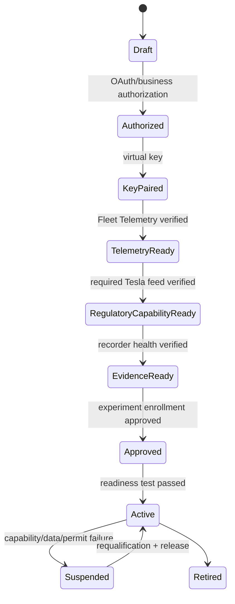
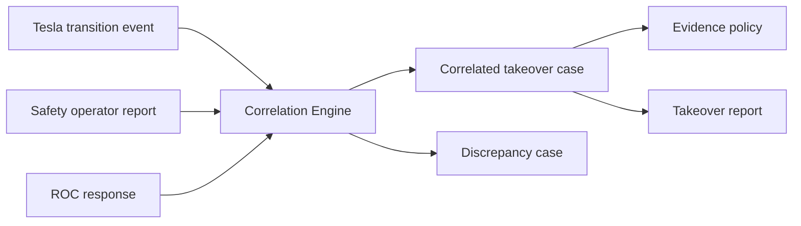
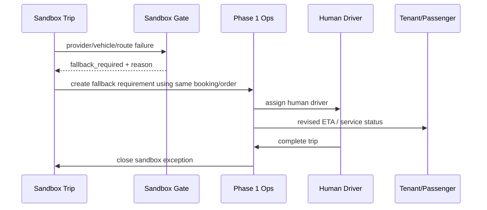

# Phase 2 Business Flows 與狀態機


> 文件基準日：2026-06-25  
> 適用專案：計程車自動駕駛專案 Phase 2  
> 正式定位：**Tesla FSD 在地監理沙盒營運、安全監控與事故證據平台**  
> 系統邊界：Tesla 負責 FSD 感知、規劃與車輛控制；本平台負責在地監理、沙盒條件、Tesla 資料介接、行控、安全員、事故、證據與監理報告。  
> 明確排除：不建置路側 RSU／SPaT／V2X，不監看方向盤角度、煞車深度或 Tesla 內部感知物件，不建立遠端駕駛或第三方 FSD 控制。


## 1. Tesla Vehicle Onboarding



## 2. Sandbox Trip State

```text
planned
eligibility_check
manual_release_pending
eligible
vehicle_assigned
pre_trip_pending
ready
in_service
human_takeover_active
human_driving
fsd_resumed
fallback_required
completed
cancelled
incident_hold
```

規則：

- `in_service` 只表示沙盒行程進行中，不代表 FSD 一定 engaged。
- FSD engaged 狀態由 Tesla session/event 資料顯示，與 trip state 分離。

## 3. Takeover Correlation



## 4. Accident Flow

```text
detected
→ roc_acknowledged
→ operation_suspended
→ emergency_response_active
→ evidence_frozen
→ initial_notification_sent
→ police_or_authority_handoff
→ investigation_active
→ corrective_action_required
→ authority_review
→ resume_authorized
→ closed
```

## 5. Human Taxi Fallback



## 6. Provider Data Gap

```text
healthy
→ delayed
→ gap_detected
→ backfill_in_progress
→ complete
or
→ incomplete_hold
→ regulator_data_incident
→ restored_after_review
```

No-new-dispatch threshold 由 experiment policy 配置。

## 7. Evidence Freeze

```text
requested
→ collecting
→ sealed
```

Exception：

```text
collecting → partial
collecting → failed
partial → supplemented → sealed
```

`sealed` 後原 manifest 不可修改；新增補件以新 manifest version 關聯。

## 8. Suspension / Resume

```text
active
→ suspended
→ corrective_action_in_progress
→ authority_review
→ resume_authorized
→ active
```

沒有 `resume_authorized` 不得恢復新派單。
