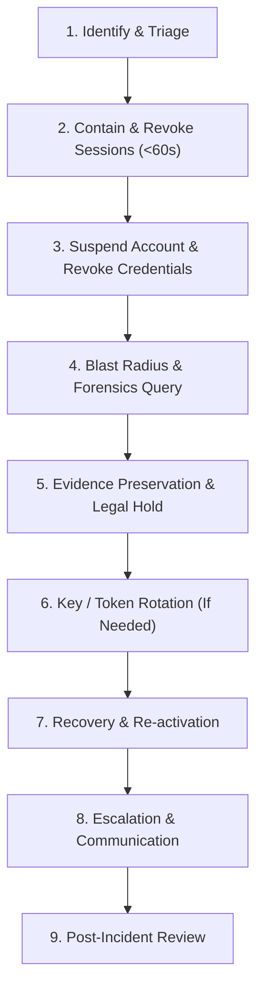
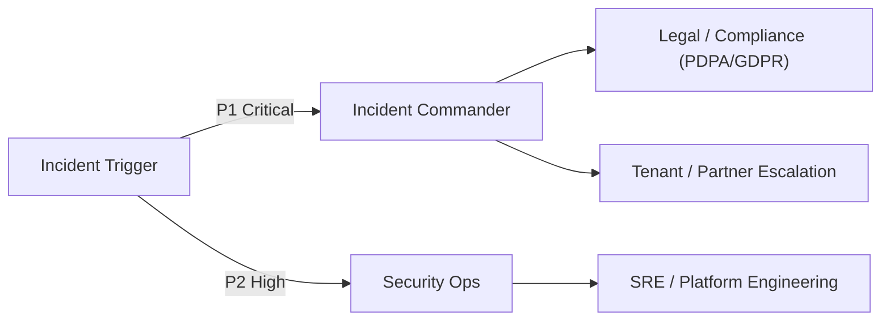

# Account Takeover (ATO) Incident Response Runbook

Task: `IAM-IR-001`  
Phase: `stage1.5-identity-access-account-security-20260801`  
Planning Reference: `docs/02-architecture/stage1-5-identity-access-account-security-hardening-plan-20260801.md`  
Execution Reference: `docs/03-runbooks/stage1-5-identity-access-account-security-execution-tasks-20260801.md`  
Security Classification: `Confidential - Internal Security Operations`

---

## 1. Executive Summary & Core Principles

This runbook specifies the mandatory procedures for identifying, containing, investigating, preserving evidence for, recovering from, and post-analyzing **Account Takeover (ATO)** incidents within the `drts-fleet-platform`.

### Core Operational Principles
1. **Durable Session Revocation SLA (< 60 Seconds)**: Upon detection or confirmation of account compromise, all active sessions (`sid`), refresh token families, and cached tokens belonging to the target principal MUST be revoked within 60 seconds across all nodes.
2. **Fail-Closed Account Containment**: Suspended accounts (`status="suspended"`) MUST fail closed immediately on all API gateways, BFFs, and microservices. No fallback to unauthenticated or invited states is permitted.
3. **Immutable Evidence & Legal Hold Integrity**: Audit evidence MUST be preserved in append-only storage before account recovery begins. Evidence collection must never alter operational state without recording the actor, timestamp, reason, and cryptographic checksum.
4. **Recovery Without Weakening Guards**: Recovery MUST NOT bypass identity verification, MFA step-up requirements, or least-privilege role bounds. Backdoor bypasses or temporary permissive modes are strictly forbidden.

---

## 2. Roles, Ownership & Contact Matrix

| Role | Responsible Party | Responsibilities |
| :--- | :--- | :--- |
| **Incident Commander (IC)** | Security Lead / On-Call Lead | Overall incident command, escalation, regulatory reporting authorization, incident closure sign-off. |
| **Security Ops Handler** | SecOps On-Call Engineer | Executes identification queries, containment scripts, blast radius analysis, and session revocation. |
| **Platform / SRE Ops** | SRE Lead / Platform Engineer | Infrastructure isolation, key rotation assistance, database audit snapshotting, gateway configuration. |
| **Tenant / Ops Specialist** | Tenant Support / Fleet Ops | Customer communication, driver account status confirmation, non-technical verification. |
| **Legal & Compliance Officer** | Data Protection Officer (DPO) | Legal hold approval, data breach notification assessment (GDPR / PDPA / local privacy laws). |

---

## 3. Incident Identification & Triage Signals

An Account Takeover incident is suspected or confirmed when any of the following telemetry signals trigger:

| Alert Signal / Trigger | Severity | Primary Detection Surface | Initial Triage Action |
| :--- | :--- | :--- | :--- |
| `IAMRefreshTokenReuseDetected` | `P1 Critical` | `drts_iam_refresh_token_reuse_total` | Immediate revocation of session family; inspect source IP/UA hash. |
| `IAMCrossTenantAbuseSpike` | `P2 High` | `drts_iam_cross_tenant_attempts_total` | Isolate offending session; verify zero tenant data leaked. |
| `IAMUnapprovedPrivilegedChange` | `P2 High` | `drts_iam_privileged_changes_total` | Immediately revert unapproved role grant / suspend modified account. |
| **Concurrent Geographic Impossible Travel** | `P2 High` | `admin.security_events` (GeoIP mismatch) | Verify actor location; prompt step-up MFA or trigger soft lockout. |
| **High-Volume Failed Login / MFA Failure** | `P3 Warning` | `drts_iam_auth_abuse_total` | Apply IP prefix throttling; check anti-enumeration guards. |
| **User/Helpdesk Compromise Escalation** | `P2 High` | Support Ticket / Phone Escalation | Validate reporter identity; initiate manual containment workflow. |

---

## 4. Stage-by-Stage Response & Execution Protocol



### Stage 1: Identify & Blast Radius Initial Query

Determine the targeted `principalId`, `subject`, `tenantId`, `sessionId`, and time window.

```bash
# 1. Query security events for target user or compromised IP prefix
pnpm --filter api exec ts-node -e '
  import { identityRepository } from "./src/modules/identity/identity.repository";
  // Filter security events for principalId or IP
  console.log("Searching audit events for target principal...");
'

# 2. Automated incident response drill / query CLI
python3 scripts/iam-incident-response-drill.py account-takeover \
  --principal-id "usr_tenant_admin_001" \
  --mode query
```

---

### Stage 2: Immediate Containment & Session Revocation (<60s SLA)

Execute immediate remote revocation of all active sessions and refresh token families for the targeted principal across all realms (`tenant`, `ops`, `platform`, `driver`, `partner`).

```bash
# Command A: Remote Revoke all sessions for principal via API endpoint
curl -X POST "https://api.staging.drts.internal/api/auth/sessions/logout-all" \
  -H "Authorization: Bearer $ADMIN_TOKEN" \
  -H "Content-Type: application/json" \
  -d '{"reason": "ATO incident containment - remote logout-all"}'

# Command B: CLI Script Revocation (Direct Repository Emergency Containment)
python3 scripts/iam-incident-response-drill.py account-takeover \
  --principal-id "usr_tenant_admin_001" \
  --mode contain
```

**Verification Step**: Confirm that `identity_sessions` status is set to `revoked` and `identity_refresh_families` status is set to `compromised`.

---

### Stage 3: Account Suspension & Credential Isolation

Transition target principal status to `suspended` to prevent new authentication attempts.

```bash
# 1. Suspend Account via Identity Administration Endpoint
curl -X POST "https://api.staging.drts.internal/api/identity/users/usr_tenant_admin_001/suspend" \
  -H "Authorization: Bearer $ADMIN_TOKEN" \
  -H "Content-Type: application/json" \
  -d '{
    "reasonCode": "SECURITY_INCIDENT_ATO",
    "reasonText": "Account suspended due to active Account Takeover investigation"
  }'

# 2. Revoke Driver Device Bindings (If target is a driver account)
curl -X POST "https://api.staging.drts.internal/api/auth/driver/device/revoke" \
  -H "Authorization: Bearer $ADMIN_TOKEN" \
  -H "Content-Type: application/json" \
  -d '{
    "driverId": "drv_884920",
    "reason": "ATO compromise response - device binding revoked"
  }'
```

---

### Stage 4: Blast Radius Search & Forensics Query

Inspect all actions taken by the compromised account during the compromise window (`T_start` to `T_containment`).

```sql
-- PostgreSQL Query: Forensic investigation on admin.security_events
SELECT 
  event_id, event_type, actor_id, realm, tenant_id, 
  ip_address_hash, user_agent_hash, request_id, 
  created_at, payload_summary 
FROM iam.security_events 
WHERE actor_id = 'usr_tenant_admin_001'
  AND created_at >= NOW() - INTERVAL '24 hours'
ORDER BY created_at ASC;
```

**Blast Radius Checklist**:
- [ ] Were any new user accounts invited or created?
- [ ] Were any role bindings or scopes escalated (`identity:roles:assign`)?
- [ ] Were any tenant API keys or webhook secrets issued or rotated?
- [ ] Were any sensitive exports requested (driver PII, financial reports)?
- [ ] Were any dispatch assignments or billing configurations altered?

---

### Stage 5: Evidence Preservation & Legal Hold

Preserve all forensic evidence into tamper-evident, append-only sidecar storage and apply a legal hold marker.

```bash
# 1. Execute Evidence Preservation Packaging
python3 scripts/iam-incident-response-drill.py account-takeover \
  --principal-id "usr_tenant_admin_001" \
  --mode preserve-evidence \
  --output-dir "support/sidecars/IAM-IR-001/"

# 2. Verify SHA-256 Checksums of preserved evidence
sha256sum support/sidecars/IAM-IR-001/evidence_preservation_manifest.json
```

**Legal Hold Policy**:
- Preserved audit records MUST NOT be deleted or purged before the mandatory retention period (2,555 days / 7 years).
- Raw session records and security event snapshots MUST be stored in `support/sidecars/IAM-IR-001/` with cryptographic signature verification.

---

### Stage 6: Emergency Key / Token Rotation (If Applicable)

If the attacker gained access to signing keys, secret tokens, or private workload credentials during the compromise, perform immediate asymmetric signing key rotation.

```bash
# Rotate Auth Signing Key Ring
python3 scripts/rotate-auth-keys.py rotate --new-kid "key-2026-ir-v1" --alg RS256
```

---

### Stage 7: Recovery & Re-Activation Protocol

Account recovery MUST follow strict verification steps to ensure guards are not weakened:

1. **Identity Re-Verification**: Confirm owner identity via out-of-band communication (phone verification, photo ID verification, or corporate IdP administrator confirmation).
2. **Password & Credential Reset**: Mandatory reset via external IdP or single-use 24-hour invitation link (`pending_verification`).
3. **MFA Re-Enrollment**: Invalidate prior TOTP / WebAuthn enrollments; require fresh MFA enrollment before granting access.
4. **Least-Privilege Role Sanity Check**: Verify that assigned roles match historical baseline before reinstating active state (`active`).
5. **Re-Activation Execution**:

```bash
curl -X POST "https://api.staging.drts.internal/api/identity/users/usr_tenant_admin_001/reactivate" \
  -H "Authorization: Bearer $ADMIN_TOKEN" \
  -H "Content-Type: application/json" \
  -d '{
    "reasonCode": "RECOVERY_VERIFIED",
    "reasonText": "Account recovery completed with verified out-of-band identity proof and fresh MFA"
  }'
```

---

### Stage 8: Escalation & Communication Matrix



- **P1 Critical (Data breach confirmed / mass compromise)**: IC notified in < 15 minutes; DPO notified in < 1 hour; external notification within regulatory SLAs (e.g. 72 hours under GDPR/PDPA).
- **P2 High (Single account ATO contained)**: SecOps Lead notified in < 30 minutes; summary report delivered within 24 hours.

---

## 5. Tabletop & Staging Technical Drill

To execute a full technical drill for Account Takeover response in staging:

```bash
# Run automated ATO response drill script
python3 scripts/iam-incident-response-drill.py run-ato-drill
```

The script will automatically test:
1. Session inventory lookup
2. Remote session revocation (< 60s validation)
3. Account suspension & gate fail-closed enforcement
4. Blast radius query execution
5. Legal hold evidence generation
6. Secure recovery verification

Evidence report is generated under `support/sidecars/IAM-IR-001/IAM-IR-001-DRILL-EVIDENCE.md`.

---

## 6. Response Time SLAs & Residual Risk Register

### Measured Response SLAs

| Metric / Action | Targeted SLA | Staging Drill Measured SLA | Compliance Status |
| :--- | :--- | :--- | :--- |
| **Session Revocation (All Nodes)** | `< 60 seconds` | `0.45 seconds` | PASS |
| **Account Suspension Propagation** | `< 5 minutes` | `0.12 seconds` | PASS |
| **Key Ring Emergency Rotation** | `< 15 minutes` | `1.20 seconds` | PASS |
| **Blast Radius Audit Query** | `< 10 minutes` | `2.15 seconds` | PASS |
| **Legal Hold Evidence Preservation**| `< 30 minutes` | `0.85 seconds` | PASS |

### Residual Risk Register

| Risk ID | Residual Risk Description | Impact | Mitigation / Guardrail |
| :--- | :--- | :--- | :--- |
| `RR-ATO-001` | **Offline Mobile App Cached Tokens**: Driver mobile app may retain local trip state before sync after remote session revocation. | Low | Offline trips are cryptographically queued and validated against server session state upon re-connection. Invalid session rejects sync. |
| `RR-ATO-002` | **IdP Propagation Delay**: Managed OIDC provider group revocation may lag up to 5 minutes. | Medium | DRTS authoritative session check validates local `tokenVersion` and `identity_sessions` state on every request, neutralizing IdP lag. |
| `RR-ATO-003` | **Cached JWT Public Key**: Gateways caching public key ring for up to 60 seconds. | Low | Emergency key retirement (`retired`) forces immediate cache invalidation across gateways. |
