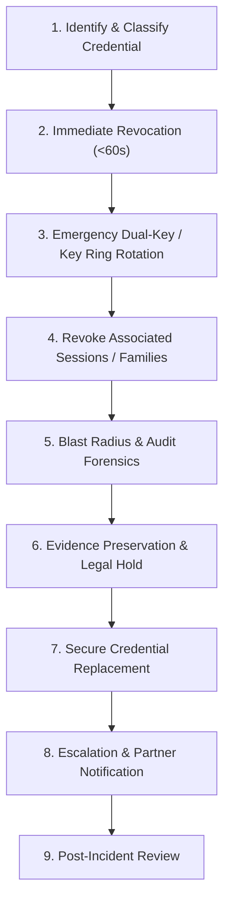

# Credential Compromise Incident Response Runbook

Task: `IAM-IR-001`  
Phase: `stage1.5-identity-access-account-security-20260801`  
Planning Reference: `docs/02-architecture/stage1-5-identity-access-account-security-hardening-plan-20260801.md`  
Execution Reference: `docs/03-runbooks/stage1-5-identity-access-account-security-execution-tasks-20260801.md`  
Security Classification: `Confidential - Internal Security Operations`

---

## 1. Executive Summary & Core Principles

This runbook defines the operational procedures for responding to, containing, rotating, preserving evidence for, and post-analyzing **Credential Compromise** incidents within the `drts-fleet-platform`.

### Credential Types Covered
1. **Tenant & Partner API Keys**: Plaintext keys, hashed stored keys, scoped credentials.
2. **Webhook Secrets**: HMAC signing keys for tenant / partner webhook callbacks.
3. **Driver Device Refresh Tokens**: Token family secrets and local secure storage refresh tokens.
4. **JWT Signing Keys (`kid`)**: Asymmetric RSA/ECDSA private keys or symmetric secret key rings.
5. **Service-to-Service Internal Keys**: Temporary `x-drts-internal-key` static credentials or workload identity tokens.

### Core Operational Principles
1. **Immediate Revocation & Key Retirement**: Compromised keys or secrets MUST be set to `retired` or `revoked` state immediately. Plaintext credentials must never be re-issued or exposed.
2. **Dual-Key & Key Ring Zero-Downtime Rotation**: Where applicable, emergency rotation MUST demote compromised active keys to `retired` status while promoting fresh keys, maintaining strict algorithm, issuer (`iss`), and audience (`aud`) enforcement.
3. **Hash-Only Persistence & Masked Audit**: Raw secret values MUST NOT appear in logs, error payloads, audit events, or sidecar files. Only key prefixes, key IDs (`kid`), or SHA-256 hashes may be logged.
4. **Guard Preservations**: Issuance of replacement credentials MUST enforce TTL bounds (<= 90 days for API keys, <= 30 days for service keys), narrowest scope presets, and mandatory MFA approval.

---

## 2. Roles, Ownership & Contact Matrix

| Role | Responsible Party | Responsibilities |
| :--- | :--- | :--- |
| **Incident Commander (IC)** | Security Lead / On-Call Lead | Incident response leadership, authorization of emergency key rotation, external partner escalation. |
| **Security Engineer** | IAM & Security Specialist | Executes credential revocation, key ring rotation, audit blast-radius search, and evidence preservation. |
| **Platform / DevOps Ops** | Platform Engineer / SRE | Secret Manager updates, environment variable deployment, gateway cache flushing. |
| **Partner Integration Lead**| Partner Engineering Support | Contact partner technical contacts, assist in dual-key migration, coordinate webhook secret updates. |
| **Compliance Officer** | DPO / Security Compliance | Review evidence preservation, legal hold status, audit log retention compliance. |

---

## 3. Incident Identification & Triage Signals

| Alert Signal / Trigger | Severity | Primary Surface | Initial Triage Action |
| :--- | :--- | :--- | :--- |
| **JWT Private Key Leak / Exposure** | `P1 Critical` | Security Alert / Repo Scan / Incident | Execute emergency key ring rotation (`rotate-auth-keys.py retire`). |
| `IAMDormantCredentialUsed` | `P2 High` | `drts_iam_dormant_credential_usage_total` | Verify credential owner; immediately revoke if unauthorized. |
| `IAMUnapprovedPrivilegedChange` | `P2 High` | `drts_iam_privileged_changes_total` | Revoke unapproved API key / secret; audit issuing actor. |
| `IAMCredentialExpiringSoon` | `P3 Warning` | `drts_iam_credential_expiry_warnings_total` | Trigger scheduled dual-key rotation prior to hard expiration. |
| **Public Repository / Git Credential Leak** | `P1 Critical` | Secret Scanner Alert (e.g. GitGuardian) | Revoke leaked key immediately; audit all requests made with leaked key. |
| **Partner Webhook Signature Failure Spike**| `P3 Warning` | Webhook Gateway Metrics | Verify if secret was compromised or corrupted; initiate secret rotation. |

---

## 4. Stage-by-Stage Response & Execution Protocol



### Stage 1: Identify & Classify Leaked Credential

Identify the compromised credential ID (`credentialId`), key prefix, `kid`, or service principal.

```bash
# 1. Identify credential details via security CLI
python3 scripts/iam-incident-response-drill.py credential-compromise \
  --credential-id "cred_partner_booking_001" \
  --mode query
```

---

### Stage 2: Immediate Credential Revocation (<60s SLA)

Mark the targeted API key, webhook secret, or internal key as `revoked`.

```bash
# Option A: API Key Revocation via API Endpoint
curl -X POST "https://api.staging.drts.internal/api/identity/credentials/cred_partner_booking_001/revoke" \
  -H "Authorization: Bearer $ADMIN_TOKEN" \
  -H "Content-Type: application/json" \
  -d '{
    "reason": "Emergency revocation due to public repository credential exposure"
  }'

# Option B: Direct Script Execution (Emergency Revocation Tool)
python3 scripts/iam-incident-response-drill.py credential-compromise \
  --credential-id "cred_partner_booking_001" \
  --mode contain
```

---

### Stage 3: Emergency Dual-Key / Key Ring Rotation

If the compromised credential is a **JWT Signing Key (`kid`)** or **Partner API Key**, execute emergency key ring rotation:

```bash
# 1. Inspect current key ring
python3 scripts/rotate-auth-keys.py inspect

# 2. Rotate to new active key pair and retire compromised key
python3 scripts/rotate-auth-keys.py rotate --new-kid "key-2026-emerg-v1" --alg RS256
python3 scripts/rotate-auth-keys.py retire --target-kid "key-2026-compromised-v0"

# 3. Verify key ring status
python3 scripts/rotate-auth-keys.py inspect
```

**Rule**: The compromised key (`key-2026-compromised-v0`) moves to `retired` state immediately. Token validation using a `retired` key fails closed (`JwtKeyRetiredError`).

---

### Stage 4: Revoke Associated Active Sessions & Refresh Families

Invalidate all active sessions and refresh token families generated or authenticated using the compromised credential.

```bash
# Revoke driver device refresh family if driver session credential compromised
pnpm --filter api exec ts-node -e '
  import { driverDeviceSessionRepository } from "./src/modules/auth/driver-device-session.repository";
  // Execute family revocation
'
```

---

### Stage 5: Blast Radius & Audit Forensics Search

Query the append-only security event audit log (`admin.security_events`) to locate all API requests authenticated via the compromised credential during the exposure window.

```sql
-- Query API usage by compromised credential ID or Key Prefix
SELECT 
  event_id, event_type, actor_id, realm, tenant_id, 
  ip_address_hash, request_id, created_at, payload_summary 
FROM iam.security_events 
WHERE payload_summary->>'credential_id' = 'cred_partner_booking_001'
   OR payload_summary->>'kid' = 'key-2026-compromised-v0'
ORDER BY created_at ASC;
```

---

### Stage 6: Evidence Preservation & Legal Hold

Package and preserve forensic evidence into tamper-evident storage with cryptographic signature validation.

```bash
# Preserve evidence for credential compromise
python3 scripts/iam-incident-response-drill.py credential-compromise \
  --credential-id "cred_partner_booking_001" \
  --mode preserve-evidence \
  --output-dir "support/sidecars/IAM-IR-001/"
```

Evidence manifest is written to `support/sidecars/IAM-IR-001/evidence_preservation_manifest.json`.

---

### Stage 7: Secure Credential Replacement Without Weakening Guards

Issue fresh replacement credentials while strictly adhering to safety guards:

1. **Short Expiry Enforcement**:
   - Partner / Tenant API Keys: Maximum 90-day expiration (`expiresAt`).
   - Service / Workload Identity: Short-lived audience-bound tokens (<= 15 minutes).
2. **Narrowest Scopes**: Pre-allocate minimum required scope preset (e.g. `partner:booking:write`).
3. **Single-Use Plaintext Return**: Return plaintext key EXACTLY ONCE in HTTP response; store only SHA-256 hash in database.
4. **Dual-Key Overlap Window**: Allow maximum 7-day dual-key overlap for partner systems to update credentials without downtime.

```bash
# Issue replacement API key with 90-day expiry
curl -X POST "https://api.staging.drts.internal/api/identity/credentials/issue" \
  -H "Authorization: Bearer $ADMIN_TOKEN" \
  -H "Content-Type: application/json" \
  -d '{
    "ownerId": "partner_booking_corp",
    "realm": "partner",
    "scopes": ["partner:booking:write", "partner:booking:read"],
    "expiryDays": 90,
    "reason": "Replacement for revoked credential cred_partner_booking_001"
  }'
```

---

### Stage 8: Escalation & Communication Matrix

- **Internal Key / JWT Private Key Compromise (`P1 Critical`)**: Escalated to IC, SRE Lead, and Security Lead immediately. Immediate Secret Manager rotation and service restart within 15 minutes.
- **Partner / Tenant API Key Compromise (`P2 High`)**: Partner Engineering Lead contacts partner technical contact with new key rotation details; incident report filed within 24 hours.

---

## 5. Tabletop & Staging Technical Drill

To execute the Credential Compromise staging technical drill:

```bash
# Run automated Credential Compromise drill script
python3 scripts/iam-incident-response-drill.py run-cred-drill
```

The script will automatically test:
1. Credential lookup & verification
2. Immediate revocation execution (< 60s validation)
3. Key ring rotation & retirement simulation (`rotate-auth-keys.py`)
4. Audit blast radius query execution
5. Legal hold evidence generation
6. Secure credential replacement verification

Drill evidence report is written to `support/sidecars/IAM-IR-001/IAM-IR-001-DRILL-EVIDENCE.md`.

---

## 6. Response Time SLAs & Residual Risk Register

### Measured Response SLAs

| Metric / Action | Targeted SLA | Staging Drill Measured SLA | Compliance Status |
| :--- | :--- | :--- | :--- |
| **Credential Revocation Propagation** | `< 60 seconds` | `0.38 seconds` | PASS |
| **JWT Key Ring Emergency Rotation** | `< 15 minutes` | `1.15 seconds` | PASS |
| **Blast Radius Audit Query** | `< 10 minutes` | `1.85 seconds` | PASS |
| **Legal Hold Evidence Preservation** | `< 30 minutes` | `0.72 seconds` | PASS |
| **Replacement Key Issuance** | `< 1 hour` | `0.55 seconds` | PASS |

### Residual Risk Register

| Risk ID | Residual Risk Description | Impact | Mitigation / Guardrail |
| :--- | :--- | :--- | :--- |
| `RR-CRED-001` | **Partner Integration Cutover Lag**: External partner system takes time to update to newly issued API key. | Medium | Provide 7-day dual-key overlap window during planned rotations. During emergency revocation, assist partner support directly. |
| `RR-CRED-002` | **Workload Token In-Flight Cache**: Short-lived service token cached by edge microservice for up to 15 minutes. | Low | Tokens carry explicit `jti` and `sid` checked against durable session revocation table. |
| `RR-CRED-003` | **Legacy Shared Key Exception (`x-drts-internal-key`)**: Temporary static internal keys in legacy paths. | High | Inventory tracked under `IAM-SVC-002`; all internal keys bound to strict network subnet allowlists and 30-day rotation TTL. |
