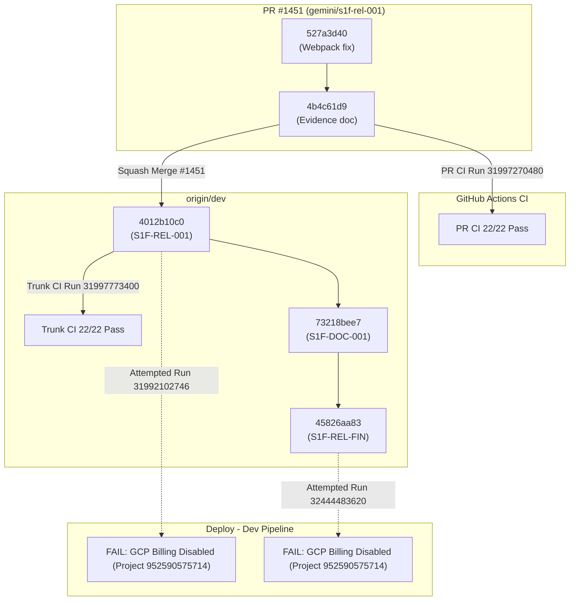

# Stage 1 Release Reconciliation & SHA Discrepancy Ledger (`S1F-REL-FIN-AUD-001`)

- **Task ID:** `S1F-REL-FIN-AUD-001`
- **Task Title:** Reconcile Stage 1 release status and SHA evidence
- **Owner:** `Codex2`
- **Reviewer:** `Gemini2`
- **Audit Date:** `2026-08-21`
- **Planning Ref:** [`docs/02-architecture/s1f-release-finalization-gap-20260821.md`](../02-architecture/s1f-release-finalization-gap-20260821.md)
- **System Design Ref:** [`docs/02-architecture/s1f-release-finalization-system-design-20260821.md`](../02-architecture/s1f-release-finalization-system-design-20260821.md)
- **Execution Tasks Ref:** [`docs/03-runbooks/s1f-release-finalization-execution-tasks-20260821.md`](../03-runbooks/s1f-release-finalization-execution-tasks-20260821.md)
- **Status:** `audit_complete`

---

## 1. Executive Summary

As part of Wave A of the Stage 1 Release Finalization DAG (`s1f-release-finalization-20260821`), this audit provides a rigorous, machine-truth-backed reconciliation of all Git commits, Pull Requests, GitHub Actions workflow runs, orchestrator task states (`ai-status.json`), and release candidate evidence files (`docs/04-uat/s1f-rel-001-release-candidate-evidence.md`).

### Key Audit Findings:
1. **PR CI Run Misclassified as Deployment and Operational Acceptance Evidence:**
   In `ai-status.json`, task `S1F-REL-001` records `dev_deploy_run_url` and `operational_acceptance_run_url` pointing to `https://github.com/ajoe734/drts-fleet-platform/actions/runs/31997270480`. This run is exclusively a pre-merge **PR CI run** (`CI (integration trunk)`) on branch `gemini/s1f-rel-001`. It did not execute the `Deploy - Dev` workflow (`deploy-dev.yml`) and did not run the live browser acceptance suite against deployed endpoints.
2. **Claimed Deployed/Accepted SHA Was Never Deployed to Dev:**
   `ai-status.json` records `dev_deploy_sha` and `operational_acceptance_sha` as merge commit `4012b10c0cd4990bd238eaed6ddc23252bc0c8d4`. However, `Deploy - Dev` workflow runs `31992102746` (2026-08-17) and `32444483620` (2026-08-21) both failed during container image push due to disabled billing on GCP Project `#952590575714`. The latest successfully deployed SHA in Dev remains `7e5a29d5a19a51eae01bcdfd44ab80a82a8b02cf` (2026-08-08, run `31244225462`), which predates the Stage 1 functional completion wave.
3. **Candidate SHA Duality Explained:**
   `s1f-rel-001-release-candidate-evidence.md` declared candidate SHA `527a3d403464806ea1d4f417c60ac3e4fa8f17d6` (the code fix commit), while `ai-status.json` captured `4b4c61d9b4794d50d45fb1119788aa574f307f90` (the evidence-pack addition commit). Both are on branch `gemini/s1f-rel-001` before squash merge `4012b10c0cd4990bd238eaed6ddc23252bc0c8d4` onto `dev`.
4. **Upstream Task Ancestry Verified on Trunk:**
   All 14 upstream functional completion tasks (`S1F-REF-001/002`, `S1F-ENT-001/002`, `S1F-FLT-001/002/003`, `S1F-ADM-001/002`, `S1F-BANK-001/002`, `S1F-CHAN-001`, `S1F-DRV-001`, `S1F-REL-001-PREDEPLOY`) are confirmed to be reachable Git ancestors of merge commit `4012b10c0cd4990bd238eaed6ddc23252bc0c8d4` and current trunk `origin/dev` (`45826aa83152a7f7ce1361b9905ec912a9ab6fcf`).

---

## 2. Complete Lifecycle Role Classification of All SHAs and Workflows

| Lifecycle Role | Identifier / SHA / URL | Subject / Context | Lifecycle Role Classification | Verification Verdict |
| :--- | :--- | :--- | :--- | :--- |
| **Candidate Source (Code)** | `527a3d403464806ea1d4f417c60ac3e4fa8f17d6` | `fix(S1F-REL-001): use webpack for Next.js builds across web apps` | Pre-evidence candidate branch commit on `gemini/s1f-rel-001` | Valid source commit; cited in initial evidence doc |
| **Candidate Source (Doc/HEAD)** | `4b4c61d9b4794d50d45fb1119788aa574f307f90` | `docs(S1F-REL-001): record release candidate evidence pack` | Candidate branch HEAD on `gemini/s1f-rel-001` | Valid candidate HEAD; recorded in `ai-status.json` |
| **Predeploy Candidate** | `f9c720fa49df888ea4761f167d16c96b64a9481f` | `Prepare and deploy the Stage 1 operational acceptance candidate (#1389)` | Merge commit for `S1F-REL-001-PREDEPLOY` | Reachable ancestor of `4012b10c0` |
| **UIX Candidate** | `5ef8259682ae8167234c64604a16478ffb13d6e4` | `fix(S1F-UIX-001): set fleet and admin supply submission readbackUrl paths...` | Candidate SHA for `S1F-UIX-001` (PR #1386) | Integrated into candidate branch & trunk |
| **Driver Candidate/Merge** | `6a43f1a9423c14d9b232770222a7f5aebaa7b5b5` | `feat(S1F-DRV-001): replay Android Driver journey and record evidence pack (#1331)` | Merge commit for `S1F-DRV-001` | Reachable ancestor of `4012b10c0` |
| **PR CI Run & SHA** | `4b4c61d9b4794d50d45fb1119788aa574f307f90` Run [`31997270480`](https://github.com/ajoe734/drts-fleet-platform/actions/runs/31997270480) | `CI (integration trunk)` on PR #1451 branch `gemini/s1f-rel-001` | Pre-merge Pull Request Continuous Integration | **PASS (22/22 checks)** — Must NOT be classified as Dev Deploy or Operational Acceptance |
| **Trunk CI Run & SHA** | `4012b10c0cd4990bd238eaed6ddc23252bc0c8d4` Run [`31997773400`](https://github.com/ajoe734/drts-fleet-platform/actions/runs/31997773400) | `CI (integration trunk)` on `origin/dev` | Post-merge Trunk Integration CI | **PASS (22/22 checks)** — Validates clean trunk integration |
| **Merge SHA (Release)** | `4012b10c0cd4990bd238eaed6ddc23252bc0c8d4` | `[ReviewBus] S1F-REL-001 Finalize the verified Stage 1 functional release candidate (#1451)` | Squash merge commit on `origin/dev` | Integrated release candidate on trunk |
| **Documentation Merge SHA** | `73218bee77b699da066e1143750d481b0424e9fe` | `[ReviewBus] S1F-DOC-001 Publish final Stage 1 functional truth and active URL matrix (#1454)` | Merge commit for `S1F-DOC-001` on `origin/dev` | Reconciled documentation on trunk |
| **Dispatch Merge SHA** | `45826aa83152a7f7ce1361b9905ec912a9ab6fcf` | `S1F-REL-FIN: dispatch truthful release finalization (#1537)` | Current trunk HEAD on `origin/dev` | Materialized release finalization DAG |
| **Historical Dev Deploy** | `7e5a29d5a19a51eae01bcdfd44ab80a82a8b02cf` Run [`31244225462`](https://github.com/ajoe734/drts-fleet-platform/actions/runs/31244225462) | `DEV-WI-SECRETS-001: stop dev deploys demanding key material dev does not use (#1320)` | `Deploy - Dev` workflow (2026-08-08) | **PASS** — Stale deploy; predates Stage 1 functional wave |
| **Failed Deploy Run (1)** | `publish/v2026.08.17.0` Run [`31992102746`](https://github.com/ajoe734/drts-fleet-platform/actions/runs/31992102746) | `Deploy - Dev` workflow dispatch (2026-08-17) | Attempted Dev Cloud Run Deployment | **FAILED** — Blocked at container push by GCP Project 952590575714 billing enablement |
| **Failed Deploy Run (2)** | `publish/v2026.08.21.0` Run [`32444483620`](https://github.com/ajoe734/drts-fleet-platform/actions/runs/32444483620) | `Deploy - Dev` workflow dispatch (2026-08-21) | Attempted Dev Cloud Run Deployment | **FAILED** — Blocked at API container push by GCP Project 952590575714 billing enablement |
| **Operational Acceptance** | _None_ | `Candidate SHA operational acceptance` job in `deploy-dev.yml` | Live Operational Acceptance against deployed Cloud Run URLs | **NOT EXECUTED** — Pending successful `Deploy - Dev` run |

---

## 3. Root-Cause Analysis of SHA Transitions

### Transition Explanations:
1. **`527a3d403464806ea1d4f417c60ac3e4fa8f17d6` -> `4b4c61d9b4794d50d45fb1119788aa574f307f90`:**
   `527a3d40` was the code change fixing Next.js webpack builds. The owner (`Gemini`) then committed `4b4c61d9` containing `docs/04-uat/s1f-rel-001-release-candidate-evidence.md` referencing `527a3d40` as the candidate commit. When calling `ai-status.sh handoff`, the git HEAD was `4b4c61d9`.
2. **`4b4c61d9b4794d50d45fb1119788aa574f307f90` -> `4012b10c0cd4990bd238eaed6ddc23252bc0c8d4`:**
   PR #1451 was squash-merged into `origin/dev`, collapsing the two commits into single merge commit `4012b10c0`.
3. **`4012b10c0cd4990bd238eaed6ddc23252bc0c8d4` -> `73218bee77b699da066e1143750d481b0424e9fe`:**
   PR #1454 (`S1F-DOC-001`) landed on `origin/dev`, updating documentation to record live 503 endpoint status and external gate constraints.
4. **`73218bee77b699da066e1143750d481b0424e9fe` -> `45826aa83152a7f7ce1361b9905ec912a9ab6fcf`:**
   PR #1537 dispatched the formal release finalization DAG (`s1f-release-finalization-20260821`).

---

## 4. Upstream Dependency Ancestry & Lineage Reconciliation

In `docs/04-uat/s1f-rel-001-release-candidate-evidence.md` Section 2, a lineage table listed pre-squash branch commits. This audit verifies both the branch SHAs and the merged trunk squash SHAs:

| Task ID | Focus | Pre-Squash Branch SHA | Squash Merge Commit on `dev` | Direct Ancestor of `4012b10c0` | Direct Ancestor of `origin/dev` (`45826aa83`) |
| :--- | :--- | :--- | :--- | :---: | :---: |
| **S1F-REF-001** | Referral Embed Form Wiring | `c022634e78ebc61aa4f107f9ff36eb74a68ef3a7` | `690f734d88e0407fa940e4f2081d33cb420aa3a8` | **YES** | **YES** |
| **S1F-ENT-001** | Enterprise Dispatch Semantic Inputs | `928d254b036573c21a415ff6819eb76369c9b5a8` | `e46023c03847e30d1ff69e802611e0c25a07293a` | **YES** | **YES** |
| **S1F-FLT-001** | Fleet Dev Identity & Fee Plan | `f2939dbda84cbf9dff77636e2f1cf5b42b4d9fa2` | `21e253469df5d688cf868e826b009e4d092d6e32` | **YES** | **YES** |
| **S1F-BANK-001** | Bank Console Scoped Read Models | `79c8ce273f324888126f59dfc3b53f66f9175440` | `8d6346c975a6c117d3d1912ebc8397a61d15df9a` | **YES** | **YES** |
| **S1F-ADM-002** | Platform Admin Truthful States | `b084931ea2315b677a28eeb318fba81a4b497672` | `674d70c69136159670f5e1f0e47feebaa1ca3ca7` | **YES** | **YES** |
| **S1F-DRV-001** | Android Driver Journey Replay | `048a5d328a1cb2349694157eff3b44749f7bea5c` | `6a43f1a9423c14d9b232770222a7f5aebaa7b5b5` | **YES** | **YES** |
| **S1F-REF-002** | Referral Lifecycle & Rating | `867823f6ee8542ab6306ae039828ecfa1953eb1c` | `da30c8236141a0210ca31bfaebaece835697669b` | **YES** | **YES** |
| **S1F-ENT-002** | Enterprise Booking Lifecycle | `3bf8a38a3d5ea7bb35c3453303d2946c1032df4c` | `37b0e2f23b7b25055b8a53166d1eeefd824d5ea8` | **YES** | **YES** |
| **S1F-FLT-002** | Fleet Supply Onboarding UI | `a2ebf7f69460a8a6ce980a373199feecba641473` | `f9f33a04588e13788ff3fc13b41d2f62dd71e060` | **YES** | **YES** |
| **S1F-FLT-003** | Fleet Operational Actions & CSV | `3860bb4a64ef72322d713c7c2da22c5e52cbe912` | `7b0ce40180a08e64c39cba535d55b0a3ce5dc9f3` | **YES** | **YES** |
| **S1F-BANK-002** | Bank Statement Downloads | `fba0a9d0f41aa1d5a7d6e64ee1df52518e22596d` | `6a31e401292070ce459958742d87e07d7c6fb58f` | **YES** | **YES** |
| **S1F-ADM-001** | Platform Supply Review UI | `5d6b4122d20fc6c888d30e017618035fb54a8e63` | `59414312015ffc191a27e7f781df33959dfab917` | **YES** | **YES** |
| **S1F-CHAN-001** | Channel Portal Formal Identity | `ce80327f3aa41bf2803362a2656360ef372bb469` | `bc6579dc17a783783a3f01c87452d3a776a3ff89` | **YES** | **YES** |
| **S1F-REL-001-PREDEPLOY** | Predeploy Candidate & Pipeline | `1e500fe14a0bc43f05ce0655d9d71cbfb9d5c48b` | `f9c720fa49df888ea4761f167d16c96b64a9481f` | **YES** | **YES** |

**Conclusion on Lineage:** All functional implementations are 100% incorporated into the release merge commit `4012b10c0cd4990bd238eaed6ddc23252bc0c8d4` and subsequent trunk history. There are zero missing dependency commits in the codebase tree.

---

## 5. Discrepancy Ledger & Unsupported Completion Claims

The following table explicitly catalogues all discrepancies and unsupported claims identified in existing machine truth and documentation:

| Claim ID | Source Location | Recorded / Claimed Value | Verified Reality | Discrepancy Classification | Remediation Plan |
| :--- | :--- | :--- | :--- | :--- | :--- |
| **DISC-01** | `ai-status.json` (`S1F-REL-001.acceptance_evidence.dev_deploy_run_url`) | `https://github.com/ajoe734/drts-fleet-platform/actions/runs/31997270480` | Run `31997270480` is a pull-request CI run on `gemini/s1f-rel-001`, not a `Deploy - Dev` run. | **False Deploy Evidence Substitution** | Must be replaced by the actual `Deploy - Dev` run URL once `S1F-REL-FIN-DEP-001` succeeds. |
| **DISC-02** | `ai-status.json` (`S1F-REL-001.acceptance_evidence.operational_acceptance_run_url`) | `https://github.com/ajoe734/drts-fleet-platform/actions/runs/31997270480` | Run `31997270480` executed containerized hermetic/unit tests; it did not execute operational browser acceptance against live endpoints. | **False UAT Evidence Substitution** | Must be replaced by the actual `operational-candidate-acceptance` job URL in `S1F-REL-FIN-UAT-001`. |
| **DISC-03** | `ai-status.json` (`S1F-REL-001.acceptance_evidence.dev_deploy_sha`) | `4012b10c0cd4990bd238eaed6ddc23252bc0c8d4` | Commit `4012b10c0` was merged to `origin/dev` but failed deployment due to GCP billing. It was never deployed to Cloud Run. | **Unsupported Deployment Claim** | Must reflect the actual deployed SHA verified by `S1F-REL-FIN-DEP-001`. |
| **DISC-04** | `ai-status.json` (`S1F-REL-001.acceptance_evidence.operational_acceptance_sha`) | `4012b10c0cd4990bd238eaed6ddc23252bc0c8d4` | Live operational acceptance against deployed Dev endpoints has not run for `4012b10c0`. | **Unsupported Acceptance Claim** | Must reflect the accepted SHA verified by `S1F-REL-FIN-UAT-001`. |
| **DISC-05** | `s1f-rel-001-release-candidate-evidence.md` (Lines 7, 22) | `Candidate Commit SHA: 527a3d403464806ea1d4f417c60ac3e4fa8f17d6` | Differs from `ai-status.json` candidate SHA (`4b4c61d9b4794d50d45fb1119788aa574f307f90`). | **Candidate SHA Inconsistency** | Reconciled: `527a3d40` was code commit; `4b4c61d9` was evidence commit. Final locked candidate will be selected by `S1F-REL-FIN-PRE-001`. |
| **DISC-06** | `s1f-rel-001-release-candidate-evidence.md` (Gate G6) | `G6 Runtime truth: PASS (Candidate CI Verified)` | Gate G6 requires active services to pass health and operational checks. Cloud Run endpoints are returning 503 or 404. | **Premature Gate Pass Claim** | G6 must remain marked as blocked on external GCP billing gate until deployment succeeds. |

---

## 6. Stage 1 GAP Completion Gates (G1–G8) Truthful Audit Status

| Gate | Scope & Contract Requirement | Code & Harness Verification Status | Live Deployed Dev Status | Truthful Verdict |
| :--- | :--- | :---: | :---: | :--- |
| **G1 Active data truth** | No active UI shows fixture/preview rows while its API is healthy. | **PASS** (7-journey suite & hermetic tests) | Blocked on Dev Deploy (503) | **CODE PASS / DEPLOY PENDING** |
| **G2 Action truth** | Every enabled control performs request/download/navigation with valid state. | **PASS** (7 formal browser journeys) | Blocked on Dev Deploy (503) | **CODE PASS / DEPLOY PENDING** |
| **G3 Lifecycle truth** | Create, update, cancel, submit, approve survive refresh/readback. | **PASS** (Hermetic E2E 001..022) | Blocked on Dev Deploy (503) | **CODE PASS / DEPLOY PENDING** |
| **G4 Cross-surface truth** | Formal Referral & Fleet supply visible in downstream scoped surfaces. | **PASS** (E2E-016, E2E-019) | Blocked on Dev Deploy (503) | **CODE PASS / DEPLOY PENDING** |
| **G5 Native truth** | Current-SHA Android emulator journey passes. | **PASS** (`s1f-drv-001` evidence pack) | Native Harness Verified | **PASS** |
| **G6 Runtime truth** | Exact accepted SHA verified across CI and all active services pass health & ops. | **PASS** (CI 22/22 passing) | **BLOCKED** (GCP Billing Gate #952590575714) | **BLOCKED ON EXTERNAL GATE** |
| **G7 Frozen surfaces** | Partner Booking and Concierge remain stopped with HTTP 404. | **PASS** (Route suite 39/39) | HTTP 404 Verified | **PASS** |
| **G8 Regression truth** | 22/22 API E2E, 39-route suite, build/typecheck stay green. | **PASS** (All suites passing) | Codebase Clean | **PASS** |

---

## 7. Downstream Action Directives

Based on this audit, the downstream tasks in `s1f-release-finalization-20260821` must follow these directives:

1. **`S1F-REL-FIN-PRE-001` (Preflight & Candidate Lock):**
   - Lock exactly one immutable SHA from trunk `origin/dev` containing `4012b10c0cd4990bd238eaed6ddc23252bc0c8d4` and subsequent documentation/dispatch fixes.
   - Verify workflow syntax for `.github/workflows/deploy-dev.yml` and manifest integrity.
2. **`S1F-REL-FIN-GCP-001` (External GCP Billing Gate):**
   - Confirm read-only status of GCP Project `#952590575714`.
   - Maintain a strict `BLOCKED` status until external billing enablement is demonstrated; never trigger blind redeploy loops or switch to legacy project IDs.
3. **`S1F-REL-FIN-DEP-001` (Deploy Locked Candidate to Dev):**
   - Trigger `Deploy - Dev` only after `S1F-REL-FIN-PRE-001` and `S1F-REL-FIN-GCP-001` pass.
   - Capture real workflow run URL, job URLs, container image tags, and resolved Cloud Run URLs.
4. **`S1F-REL-FIN-UAT-001` (Operational Acceptance):**
   - Execute `Candidate SHA operational acceptance` against deployed Cloud Run URLs.
   - Assert `x-drts-candidate-sha` header matching the deployed candidate SHA across all active BFF/API paths, and verify HTTP 404 on paused/retired paths.
5. **`S1F-REL-FIN-CLOSE-001` (Final Evidence Pack Publication):**
   - Ingest this audit discrepancy ledger (`S1F-REL-FIN-AUD-001`) and the operational acceptance evidence (`S1F-REL-FIN-UAT-001`).
   - Publish the definitive `s1f-rel-001-release-candidate-evidence.md` with zero pending fields and zero false substitutions.
