# SR-QA-WEBHOOK-001 — API keys／Webhook簽章與故障恢复驗收：完成證據

- Task: `SR-QA-WEBHOOK-001`
- Title: API keys／Webhook簽章與故障恢复驗收
- Status: `in_progress` → handoff pending (this recovery pass)
- Owner: `Claude2` (availability-first reassignment; prior owner `Claude` never locked a candidate — see §0.2)
- Reviewer: `Claude`
- Base SHA (`origin/dev`, this recovery pass): `25ecae6295898d80883f03a9f5a1276fab03ab24`
- Candidate SHA: recorded at handoff time via `git rev-parse HEAD`
- Prior unlocked branch head (source of the ported work, preserved, not discarded): `origin/claude/sr-qa-webhook-001@6e311d8de` (its own Base SHA was `70355aba97c23dd1cd592b71f1d3dfe6315d91ff`, now superseded — see §0.2)
- Worktree: `/home/lupin/workspace/drts-fleet-platform/.artifacts/worktrees/auto/claude2-sr-qa-webhook-001`
- Branch: `claude2/sr-qa-webhook-001-recovery-20260911`
- Planning Ref: `docs/04-uat/system-remediation-20260906/source/capabilities.json` (C111, C112, C113, C114, C115)
- Task Spec: `docs/03-runbooks/system-remediation-20260906/SR-QA-WEBHOOK-001.md`

## 0. Recovery Note (2026-09-08)

The original `Gemini` lane became auth-unavailable after landing commit `75138b3cbadbaf4e6508cc5c5b6513fddea5a640`
("SR-QA-WEBHOOK-001: verify api keys and webhook recovery lifecycle") on top of an
older `origin/dev` base (`b32ab8bad...`). Per user-authorized parallel-dispatch
recovery, this task resumed under `Claude` with an independent reviewer
(`Codex2`). The four task-scoped artifacts from that commit (this doc, the unit
spec, the Playwright spec, and the evidence JSON — all inside `write_scopes`,
no shared files touched) were carried forward byte-for-byte onto a fresh
`origin/dev` (`70355aba9...`), then re-executed in place to confirm they still
pass against current canonical code (no rewrite, no regression skip). Only the
hardcoded `BASE_SHA` constant in `sr-qa-webhook-001.spec.ts` was updated from
the stale 9/6 value to the new rebase base SHA so evidence stays internally
consistent; no test assertions or business-code behavior were changed.

## 0.1 Review Remediation Note (2026-09-08, second pass)

`Codex2` rejected candidate `024c4b0ad1a7de7ce3b4d3a7d1b124c127f4d52a` with four
findings, addressed as follows (no product/business code touched — only the
three `write_scopes` files plus this doc):

1. **E2E spec fabricated keys/signatures locally instead of exercising the
   product.** `sr-qa-webhook-001.spec.ts` previously generated plaintext keys,
   IDs, and HMAC signatures with local `crypto` calls and never called
   `TenantPartnerService` / `WebhookDispatchService`. Root cause for *why* it
   was written that way: Playwright's TS transform parses class constructors
   against the modern TC39 decorators proposal and rejects NestJS's
   parameter-decorated constructors (`@Optional() private readonly x?: Foo`)
   with "Decorators cannot be used to decorate parameters" — confirmed by
   directly importing `TenantPartnerService` into the `.spec.ts` file and
   reproducing the failure. The fix keeps the real services in play without
   forking product code: `run-webhook-lifecycle.ts` (new, inside this task's
   `tests/e2e/.../sr-qa-webhook-001/` write scope) runs the full C111/C112
   lifecycle out-of-process via `tsx` — the same TypeScript pipeline this
   repo's own vitest unit suite already relies on for these decorated classes
   — against a real local HTTP receiver, and prints one JSON result line. The
   Playwright spec spawns that script, parses its JSON, and asserts on it;
   every fact asserted (key masking, rotation overlap, revocation, HMAC
   validity, 503 backoff, auto-disable, secret-rotation recovery, replay
   rejection) now traces to a real `TenantPartnerService`/`WebhookDispatchService`
   write + readback, not a local fabrication.
2. **C111 "revocation" was declared without exercising it.** The E2E lifecycle
   now issues a second key, calls `revokeApiKey`, reads back `status: "revoked"`
   via `listApiKeys`, and asserts that a subsequent `rotateApiKey` on the
   revoked key throws `TENANT_API_KEY_NOT_ROTATABLE` (409).
3. **Unit suite's timeout case destroyed the socket immediately (not a real
   timeout); the queued 503 case was never retried to recovery; the outbox-key
   dedup case only reused one live service instance.** `sr-qa-webhook-001.test.ts`
   gained three cases:
   - `C112-3` rewritten: the receiver now holds the connection open and never
     responds; a `WebhookFetch` wrapping real `fetch()` with an
     `AbortController` on a 150 ms timer is injected into `WebhookDispatchService`,
     and the test asserts real elapsed wall-clock time (`>= 130ms`) before the
     abort is caught as a queued retry — a genuine timeout, not an instant
     `res.destroy()`.
   - `C112-2b` (new): after a 503 puts a delivery in `queued`, the receiver is
     switched to 200 and the test waits out the service's own real,
     unmodified `setTimeout`-scheduled retry (default 30 s backoff, no fake
     timers, no manual re-dispatch call) until the delivery reads back as
     `delivered` and the endpoint is promoted back to `active`.
   - `C112-9` (new): two independently-constructed `TenantPartnerService`
     instances share one in-memory repository double that implements the same
     `isEnabled`/`loadState`/`persistChanges` contract as the real
     Postgres-backed `TenantPartnerRepository` (keyed by `webhookId`/`deliveryId`,
     exactly like its SQL upserts). The second instance only ever sees state
     that passed through `persistChanges()` — never the first instance's live
     JS object graph — reproducing a process restart. Publishing the same
     `outboxKey` against the restarted instance returns the same `deliveryId`
     and the receiver still shows exactly one request, proving the dedup is
     backed by the repository contract, not merely by same-instance state.
4. **`git diff --check` trailing-whitespace exit 2 on this doc; evidence/doc
   SHA inconsistency.** Trailing whitespace on the two Mermaid lines removed.
   `origin/dev` has since advanced to `6f4ac8c74...`; a `git rebase origin/dev`
   was attempted per branch-strategy guardrails but the harness deferred the
   command in this session (destructive-git-op confirmation gate). The branch's
   merge-base with `origin/dev` is still `70355aba97c23dd1cd592b71f1d3dfe6315d91ff`
   (verified via `git merge-base HEAD origin/dev`) — the same commit already
   recorded as `BASE_SHA` — so base/candidate/evidence provenance stays
   internally consistent even though `dev` has moved further ahead; the branch
   contains no content that conflicts with those later commits (only this
   task's own `write_scopes` files changed). Section 4 below reflects a fresh
   re-run of all three test commands against this candidate.

---

## 0.2 Recovery via Claude2 (2026-09-11)

`ai-status.sh show SR-QA-WEBHOOK-001` records the canonical task as `in_progress`,
owner `Claude2`, with no `candidate_sha`/PR/CI fields — i.e. no prior lane ever
locked a candidate for this task through the task-board lifecycle. `git ls-remote
origin refs/heads/claude2/sr-qa-webhook-001-recovery-20260911` returned empty
before this session started (branch never pushed), and `git branch -vv` showed
this local branch tracking `origin/dev` directly with zero own commits — a
genuinely fresh recovery worktree, not a stalled candidate.

However `origin/claude/sr-qa-webhook-001@6e311d8de` (never deleted, never
pushed through a PR/candidate lock) contains real, service-integrated work
for this exact task ID: 25 real unit/integration cases and a real-service E2E
lifecycle runner, with an honestly-scoped ⚠️ partial for C113–C115 (see §6.4).
Per this task's own instruction ("已有功能先驗而非重寫" — verify existing
work rather than rewrite it), that work was **ported, not rewritten**:

1. `git merge --ff-only origin/dev` brought this branch from its stale base
   up to fresh `origin/dev` (`25ecae6295898d80883f03a9f5a1276fab03ab24`),
   fast-forward only, zero conflicts, before any task file was touched.
2. `git checkout origin/claude/sr-qa-webhook-001 -- tests/unit/system-remediation/sr-qa-webhook-001/ tests/e2e/system-remediation/sr-qa-webhook-001/ docs/04-uat/system-remediation-20260906/SR-QA-WEBHOOK-001.md`
   copied the four task-scoped artifacts byte-for-byte (§0/§0.1 above and
   everything below this section is that copy, prior to the SHA/status edits
   in §0.2/§4) — no shared file outside `write_scopes` was touched.
3. The ported suite was re-executed as-is against the fresh base, with no
   test-assertion or business-code edits, to confirm it is still real and not
   stale-passing:
   - `pnpm exec vitest run tests/unit/system-remediation/sr-qa-webhook-001/sr-qa-webhook-001.test.ts` → 25/25 passed.
   - `pnpm exec playwright test -c playwright.system-remediation.config.ts tests/e2e/system-remediation/sr-qa-webhook-001/sr-qa-webhook-001.spec.ts` → 1/1 passed; the spawned `run-webhook-lifecycle.ts` runner regenerated `evidence-sr-qa-webhook-001.json` from a fresh, real `TenantPartnerService`/`WebhookDispatchService` run (new tenant/key/webhook/delivery IDs, new HMAC signatures, `candidateSha`/`headSha` = the fresh base) — proving the pass is a live re-execution, not a copied artifact.
   - `pnpm --filter @drts/api exec vitest run tests/unit/webhook-dispatch.service.test.ts` → 2/2 passed (existing dispatch-core regression, unbroken).
   - `git diff --check` → exit 0.
   - Only the hardcoded `BASE_SHA` constant in `sr-qa-webhook-001.spec.ts` was
     updated (`70355aba9...` → `25ecae629...`) so self-recorded evidence
     stays internally consistent with the new base; no assertions changed.
4. The task-required check command,
   `pnpm exec playwright test -c playwright.system-remediation.config.ts sr-qa-webhook-001`
   (positional arg, not a path), was also run as literally specified. On the
   current `origin/dev` this positional filter no longer scopes to this
   task's own spec file — it runs the full `tests/e2e/system-remediation/`
   suite (36 tests across `sr-qa-webhook-001`, `sr-host-fe-001`,
   `sr-ops-shell-001`). This task's own spec still passes (1/1); the other 14
   failures are `sr-host-fe-001`/`sr-ops-shell-001` browser specs failing with
   `net::ERR_CONNECTION_REFUSED` because they need a running product dev
   server, which this VM is explicitly restricted from starting. This is a
   pre-existing filter/config behavior shared across all `system-remediation`
   Playwright specs, not something introduced by or in scope for this task's
   `write_scopes`; it is reported here for honesty rather than silently
   re-run with a narrower invocation only.
5. The prior `Codex2` review's C113/C114/C115 scope boundary (§6.4 below —
   "超出本任務標題核心範圍，且需要更大規模的 sandbox/route/scheduler 測試建置")
   was independently re-checked, not just trusted: `grep` across
   `apps/api/src` for a deployed document/registry expiry scheduler found no
   such cron/scheduler entity point, confirming C115's backlog/restart/
   catch-up gap is a genuine deployment-verification gap (needs a live
   scheduler/cron deployment to observe), not something this task's
   `write_scopes` (tests + this doc only) can close by writing more local
   test code. C113/C114 remain genuine external gates (bank/ERP/SSO sandbox
   credentials, Google Maps Platform live credentials) unavailable in this
   environment. §6.4's recommendation to scope any further closure as a new
   canonical sub-task, rather than quietly patch it into this task, still
   stands and is carried forward unchanged into this handoff.

## 1. 問題根因與能力盤點（Fix 前與驗收缺口分析）

本驗收任務針對 2026-09-06 UAT 觀察與 134 能力盤點中整合與自動化領域的核心能力（C111, C112, C113, C114, C115）進行全生命週期可重跑驗收：

1. **C111: 租戶技術管理員 — API keys、輪替、撤銷與密鑰遮罩**
   - **歷史現狀與缺口**: 租戶 API Key 與治理策略雖然已實作，但缺乏對最小 scope、相容別名正規化、預設 60 天到期、90 天上限約束、輪替雙重疊窗（`overlap_active`）、重疊期滿自動撤銷（`auto_revoked` / `rotation_overlap_elapsed`）、手動即時撤銷（`manual_revoke`）以及資料庫遮罩防護（庫存僅保留 SHA-256 `keyHash`，讀取遮罩 `keyPrefix` 前 12 碼與 `maskedSuffix` 後 4 碼）的端到端檢驗。
   - **驗收策略**: 透過寫入後重新讀取 DB/服務狀態，驗證從發行、輪替、過期至撤銷的狀態機閉環。

2. **C112: Webhook 接收平臺 — 簽章、重試、停用、回放與密鑰輪替**
   - **歷史現狀與缺口**: 過去僅依賴單元測試 mock 介面，未建立「真機受控本機 HTTP 接收器（Controlled Local HTTP Receiver）」。不能把存在 interface 當作驗收完成。
   - **驗收策略**: 透過動態隨機埠本機 `http.Server` 作為受控接收端，對真實 HTTP POST 請求進行位元組層級 HMAC-SHA256 驗簽（`x-drts-webhook-signature` 格式 `v=<ver>;t=<timestamp>;sig=<hex>`）、200 晉升驗證、503 指數退避計算、網路中斷防護、非重試錯誤自動停用（`disabled` 狀態與 `disableReason = "delivery_failed"`）、重放攻擊防護（Timestamp 300s 邊界與 Delivery ID 唯一性）、密鑰輪替（版本推進至 v=2 且歷史記錄排除明文）以及重啟去重。

3. **C113: 租戶／外部系統 — ERP／企業 SSO／銀行帳本同步（外部門禁 GATE）**
   - **驗收與邊界**: 驗證對帳單模型（`SettlementStatementRecord`）結構（`period`、`periodStart`、`periodEnd`、`totals.fareTotal`）、資料提取與無效期別防護。誠實申報實體銀行專線（H2H MPLS）與企業 SSO（SAML 2.0 / Azure AD）為外部門禁，不冒充已連線真機。

4. **C114: 地圖／定位資料提供者 — 真地圖、地理編碼、路由／ETA（外部門禁 MAP,GATE）**
   - **驗收與邊界**: 驗證地理編碼解析（台灣核心座標經緯度邊界約束）與無效輸入錯誤防護。誠實申報正式 Google Maps Platform 臺灣配額憑證與車載 GPS 硬體為外部門禁。

5. **C115: 錄音與證照保存作業 — 背景補件、到期掃描與告警回執（驗收缺口）**
   - **驗收與邊界**: 驗證電話叫車進件錄音回調狀態機（`callStarted` -> `recordingPending` -> `recordingReady` 促使訂單由 `recording_pending` 推進至 `ready_for_dispatch`；`recordingFailed` 促使標記為 `recording_missing`）。誠實申報電信業者實體 SIP Trunking 語音線路與 Cloud Run 持久定時排程器為環境限制。

---

## 2. 驗收架構與測試設計

```mermaid
flowchart TD
    subgraph Webhook_Delivery_Lifecycle [C112 Webhook 送達與故障恢復驗收]
        WH_CREATE[1. 建立 Webhook 端點] -->|初始狀態: test_pending| WH_PENDING[test_pending]
        WH_PENDING -->|發送 tenant.webhook.test| WH_DISPATCH[WebhookDispatchService 真 HTTP POST]
        WH_DISPATCH -->|帶簽章 v=1;t=...;sig=...| HTTP_RECEIVER[本機受控 HTTP 接收器 127.0.0.1:port]

        HTTP_RECEIVER -->|驗證 HMAC-SHA256 成功並回傳 200 OK| WH_ACTIVATE[2. 晉升狀態: active, 更新 lastDeliveredAt]
        HTTP_RECEIVER -->|回傳 503 Service Unavailable| WH_BACKOFF[3. 指數退避排程: queued, attempt+1, delay=30s]
        HTTP_RECEIVER -->|回傳 400 或超過重試上限| WH_DISABLE[4. 自動停用: disabled, disableReason: delivery_failed]

        WH_ACTIVATE -->|呼叫 rotateWebhookSecret| WH_ROTATE[5. 密鑰輪替: v=2, 狀態回退 test_pending]
        WH_ROTATE -->|以新密鑰驗簽通過 / 舊密鑰失效| WH_V2_DELIVERY[v=2 簽章交付驗證]
    end

    subgraph API_Key_Governance [C111 租戶 API Key 治理驗收]
        AK_ISSUE[發行 API Key] -->|最小 scope, 預設 60 天, 上限 90 天| AK_ACTIVE[狀態: active, 明文只回傳一次]
        AK_ACTIVE -->|密鑰遮罩| AK_MASK[keyPrefix: 12碼 / maskedSuffix: ****xxxx / 庫存只留 SHA-256 keyHash]
        AK_ACTIVE -->|呼叫 rotateApiKey| AK_OVERLAP[舊 Key 進入 overlap_active 雙重疊窗]
        AK_OVERLAP -->|重疊期滿| AK_AUTO_REVOKE[舊 Key 自動撤銷: auto_revoked]
        AK_ACTIVE -->|呼叫 revokeApiKey| AK_REVOKED[即刻撤銷: revoked, 拒絕旋轉 409]
    end
```



---

## 3. Write Scopes 遵循檢查

嚴格遵守任務指派之 3 處可寫入範圍，未修改未指派之共用檔案：
1. `tests/unit/system-remediation/sr-qa-webhook-001/sr-qa-webhook-001.test.ts`（單元／整合規格，25 項測試案例，含本輪新增 C112-2b／C112-3 重寫／C112-9）
2. `tests/e2e/system-remediation/sr-qa-webhook-001/sr-qa-webhook-001.spec.ts`（Playwright E2E 規格，改為 spawn 下方 runner 並斷言其 JSON 結果，附證據收集器與 SHA 追蹤）
3. `tests/e2e/system-remediation/sr-qa-webhook-001/run-webhook-lifecycle.ts`（本輪新增：以 `tsx` 於子行程執行真實 `TenantPartnerService` / `WebhookDispatchService` 生命週期，詳見 0.1 節理由）
4. `tests/e2e/system-remediation/sr-qa-webhook-001/evidence-sr-qa-webhook-001.json`（自動化執行所產生之機器證據包）
5. `docs/04-uat/system-remediation-20260906/SR-QA-WEBHOOK-001.md`（本證據文件）

---

## 4. 驗證指令與執行日誌（附 Exit Code）

以下為 Claude2 recovery 輪（2026-09-11，§0.2）在本 worktree 對 fresh base `25ecae6295898d80883f03a9f5a1276fab03ab24` 重跑之結果，取代先前輪次之過期日誌（原始 2026-09-08 日誌內容仍留存於 git 歷史 `origin/claude/sr-qa-webhook-001@6e311d8de`，未刪除）。C112-2b 案例刻意等待服務內部真實 30 秒排程重試（未使用 fake timer 或手動觸發），因此單元測試整體耗時明顯增加，屬預期行為。

### 4.1 Git Diff 格式檢查
```text
$ git diff --check
exit code: 0
```

### 4.2 本次專屬全套單元／整合測試（25/25 通過）
```text
$ pnpm exec vitest run tests/unit/system-remediation/sr-qa-webhook-001/sr-qa-webhook-001.test.ts

 RUN  v4.1.4 /home/lupin/workspace/drts-fleet-platform/.artifacts/worktrees/auto/claude2-sr-qa-webhook-001

 Test Files  1 passed (1)
      Tests  25 passed (25)
   Start at  05:47:05
   Duration  34.23s (transform 2.62s, setup 0ms, import 3.59s, tests 30.45s, environment 0ms)
exit code: 0
```

### 4.3 Playwright 系統驗收測試（spawn 真實服務 runner，附受控 HTTP Receiver 與證據落盤）

本任務自身的 spec 檔案路徑範圍（1/1 通過）：
```text
$ pnpm exec playwright test -c playwright.system-remediation.config.ts tests/e2e/system-remediation/sr-qa-webhook-001/sr-qa-webhook-001.spec.ts

Running 1 test using 1 worker

  ✓  1 tests/e2e/system-remediation/sr-qa-webhook-001/sr-qa-webhook-001.spec.ts:124:7 › SR-QA-WEBHOOK-001: API Keys, Webhook HMAC Signatures, and Fault Recovery E2E Verification › C111 & C112 E2E: Validates complete Webhook HMAC signature, fault recovery, and API key governance lifecycle against the real TenantPartnerService with write-then-read evidence (1.7s)

  1 passed (2.8s)
exit code: 0
```

任務要求的原字面指令（positional filter，非路徑）— 誠實記錄其在目前 `origin/dev` 已擴大匹配範圍之行為，見 §0.2 第 4 點：
```text
$ pnpm exec playwright test -c playwright.system-remediation.config.ts sr-qa-webhook-001

Running 36 tests using ... workers
  ✓ ... sr-qa-webhook-001.spec.ts › C111 & C112 E2E ... (this task's own case, passed)
  ✘ 14 failed — all in sr-host-fe-001/host-browser-acceptance.spec.ts and
    sr-ops-shell-001/ops-shell-acceptance.spec.ts (net::ERR_CONNECTION_REFUSED;
    these unrelated specs need a running product dev server, which this VM is
    restricted from starting — not a regression introduced by this task)
  22 passed (8.8s)
exit code: 1
```

證據檔 `evidence-sr-qa-webhook-001.json` 於此次重跑後重新落盤（來自本任務自身 spec 檔案範圍之單次執行）；`baseSha` 為 `25ecae6295898d80883f03a9f5a1276fab03ab24`，`candidateSha` / `headSha` 為本次重跑時 worktree 的實際 `git rev-parse HEAD`（見該檔案，並見下方 §6.2 記錄之落盤時刻值）。

### 4.4 既有 Webhook 派發核心單元測試（2/2 通過，回歸驗證未破壞既有派發邏輯）
```text
$ pnpm --filter @drts/api exec vitest run tests/unit/webhook-dispatch.service.test.ts

 RUN  v4.1.4 /home/lupin/workspace/drts-fleet-platform/.artifacts/worktrees/auto/claude2-sr-qa-webhook-001/apps/api

 Test Files  1 passed (1)
      Tests  2 passed (2)
   Start at  05:48:35
   Duration  528ms (transform 93ms, setup 0ms, import 327ms, tests 12ms, environment 0ms)
exit code: 0
```

---

## 5. 驗收標準與 C111–C115 能力逐項對照表

| 能力編號 | 角色 | 驗收項目與能力 | 測試案例與證明依據 | 驗收結果 |
| --- | --- | --- | --- | --- |
| **C111** | 租戶技術管理員 | 最小 scope、到期時間、輪替重疊窗、立即撤銷、密鑰遮罩 | `C111-1` 驗證 `tenant:webhooks:read` 最小 scope 與相容別名正規化。<br>`C111-2` 驗證明文金鑰僅發行回傳一次，API 回讀 `keyPrefix` 前 12 碼與 `maskedSuffix`（`****xxxx`），庫存不存明文。<br>`C111-3` 驗證預設 60 天到期，超過 90 天拋出錯誤拒絕。<br>`C111-4` 驗證輪替後舊 key 進入 `overlap_active` 並設定 `overlapEndsAt`。<br>`C111-5` 驗證重疊期滿後自動轉為 `auto_revoked`，原因為 `rotation_overlap_elapsed`。<br>`C111-6` 驗證手動即時撤銷（`status: "revoked"`）並拒絕旋轉已撤銷金鑰（409 Conflict）。<br>E2E `run-webhook-lifecycle.ts` 額外以獨立第二把 key 實跑 `revokeApiKey` → `listApiKeys` 回讀 `revoked` → `rotateApiKey` 拋出 `TENANT_API_KEY_NOT_ROTATABLE`，取代先前僅宣告未實跑的撤銷案例。 | ✅ 通過 |
| **C112** | Webhook 接收平臺 | 簽章、重試、停用、回放與密鑰輪替（本機受控 Receiver） | `C112-1` 啟動本機真 HTTP server，驗證請求 header `x-drts-webhook-signature` 之 HMAC-SHA256 簽名正確無誤，200 成功後端點由 `test_pending` 晉升為 `active`。<br>`C112-2` 接收器模擬 503，驗證狀態為 `queued` 並精準計算指數退避延遲（30s）。<br>`C112-2b`（新增）：接收器恢復 200 後，**等待服務內部真實 `setTimeout` 排程重試（無 fake timer、無手動觸發）**，驗證送達記錄回讀為 `delivered` 且端點回晉升 `active`。<br>`C112-3`（重寫）：接收器保持連線開啟永不回應，透過注入的 `WebhookFetch`（真 `fetch` + `AbortController`，150ms）驗證服務等待真實逾時（量測實際耗時 ≥130ms）後才捕獲為 queued，而非先前的立即 `res.destroy()`。<br>`C112-4` 接收器回傳非重試 400，端點自動停用為 `disabled`（原因 `delivery_failed`）並寫入營運告警通知。<br>`C112-5` 驗證非活躍端點完全隔離於生產事件派發。<br>`C112-6` 接收端驗證 Timestamp 時效性與 Delivery ID 唯一性，重複重放回傳 409 拒絕。<br>`C112-7` 密鑰輪替至 `v=2`，端點退回待測，新簽名以新密鑰驗簽通過、以舊密鑰驗簽失敗。<br>`C112-8` 驗證相同 outboxKey 於同一服務實例幂等去重，重複派發不重複投遞。<br>`C112-9`（新增）：兩個各自建構的 `TenantPartnerService` 實例共用同一個實作 `isEnabled`/`loadState`/`persistChanges` 契約（比照真實 `TenantPartnerRepository` SQL upsert 之 `webhookId`/`deliveryId` 鍵）的記憶體 repository double，模擬行程重啟；重啟後第二實例以相同 outboxKey 發布，回傳相同 `deliveryId` 且 receiver 僅收到一次請求，證明去重來自 repository 持久層而非同一實例的記憶體物件。 | ✅ 通過 |
| **C113** | 租戶／外部系統 | ERP／企業 SSO／銀行帳本同步（外部門禁 GATE） | `C113-1` 走訪 `listTenantSettlementStatements` 與對帳單模型，驗證期別、收支總額與不可變日期。<br>`C113-2` 驗證無效期別查詢拋出 `VALIDATION_ERROR`。<br>`C113-3` 明確宣告實體銀行專線與企業 SSO 為外部門禁。 | ⚠️ 部分驗收：僅涵蓋對帳單資料模型與門禁申報，**未涵蓋** capability-source sandbox mapping、resend、reconciliation 深度能力（見 §6.4 未竟事項），不宣稱完整通過 |
| **C114** | 地圖／定位提供者 | 真地圖、地理編碼、路由／ETA（外部門禁 MAP,GATE） | `C114-1` 走訪地理編碼服務，驗證台北市地址解析落在台灣合法經緯度範圍內。<br>`C114-2` 驗證空白無效地址安全拋出防護例外。<br>`C114-3` 明確宣告正式 Google Maps Platform 配額憑證為外部門禁。 | ⚠️ 部分驗收：僅涵蓋地理編碼邊界，**未涵蓋** 路由／ETA 失敗案例（見 §6.4），不宣稱完整通過 |
| **C115** | 錄音與證照保存 | 背景補件、到期掃描與告警回執（驗收缺口） | `C115-1` 走訪電話叫車錄音生命週期：`recordingPending` 保留於 `recording_pending`，`recordingReady` 到達後晉升為 `ready_for_dispatch` 並綁定 `recording_bound` 旗標。<br>`C115-2` `recordingFailed` 到達後訂單合規標記為 `recording_missing`。<br>`C115-3` 明確宣告實體 PBX 語音硬體與 Cloud Run 持久排程為環境限制。 | ⚠️ 部分驗收：僅涵蓋錄音回調狀態機，**未涵蓋** scheduler backlog／restart／catch-up（見 §6.4），不宣稱完整通過 |

---

## 6. 資源 ID 清單與環境邊界聲明

### 6.1 自動化測試追蹤之資源 ID（Claude2 recovery 輪重跑，取自 `evidence-sr-qa-webhook-001.json`）
- **Tenant ID**: `689af6a5-2dd8-4deb-8ba9-ca7e070006a5`（Code: `TEN_A_S0_647FE838`）
- **租戶 API Keys**:
  - `api_key_e1bacb9c-da25-446a-9a1c-73d9cc6ebdde`（Prefix: `tk_3f81cc5b9`, Suffix: `****d6d8`, Scopes: `tenant:webhooks:read`, `tenant:write`）
  - `api_key_27f44a77-7e97-4e08-8d1e-8d9db488247a`（Rotated Key, Status: `active`, Overlap Ends: `2026-09-18T05:48:26.251Z`）
  - `api_key_953712bd-4f8f-4474-97f7-895b8fdfc1c8`（Revocation target key, Status: `revoked`, Reason: `manual_revoke` — 實跑撤銷＋拒絕旋轉）
- **Webhook 端點**:
  - `wh_31996c88-7eb8-495f-8857-4ed65b0bdce6`（URL: `http://127.0.0.1:44931/webhooks/receiver`）
- **Webhook 送達記錄 (Delivery ID)**:
  - `wd_0146617b-4bb3-49ec-9004-c2ad5ea74297`（Status: `queued`, HTTP Status: 503, Attempt: 1, Next Attempt: `2026-09-11T05:48:56.304Z`）
- **對帳單 ID**: `settlement-statement-tenant-demo-001-2026-03`（既有未變更）
- **電話進件與錄音 Session ID**: `provider-call-rec-001`（Recording: `rec_wire_ready_001`，既有未變更）

單元測試（`sr-qa-webhook-001.test.ts`）中每個 case 各自透過 `TenantPartnerService` / `WebhookDispatchService` 產生獨立的 tenant/apiKey/webhookEndpoint/delivery 實例並以 `listApiKeys` / `listWebhookEndpoints` / `listWebhookDeliveriesByWebhook` 寫入後回讀驗證；上列 ID 僅為 E2E Playwright 單一案例之追蹤樣本，非全部 25 個單元案例的完整清單。E2E 案例本身已改為透過 `run-webhook-lifecycle.ts` 子行程呼叫真實服務產生（見 §0.1），Playwright spec 僅解析其 JSON 結果並記錄至 evidence。

### 6.2 機器證據包檔案
- 路徑: `tests/e2e/system-remediation/sr-qa-webhook-001/evidence-sr-qa-webhook-001.json`
- 內容包含: Base SHA、Candidate/Head SHA（皆取自落盤當下 `git rev-parse HEAD`）、測試狀態（`passed`）、退出碼（`0`）、HTTP 呼叫記錄、控制台日誌、實體資源 ID 追蹤以及外部門禁清單。
- Base SHA 固定為 fresh `origin/dev` 值 `25ecae6295898d80883f03a9f5a1276fab03ab24`（見 §0.2）；Candidate/Head SHA 為產生當下 `git rev-parse HEAD` 的自動寫入值（非手填），此輪重跑時等於同一個 base SHA（尚未提交 commit）。**已知限制**：由於證據檔內容必須先確定才能被 commit，其自我記錄的 SHA 在結構上必然是「產生時的 HEAD」（即最終 commit 的父版本），而非最終 commit 自身的雜湊——沒有任何 commit-then-regenerate 迴圈能讓一個檔案的內容包含它自己 commit 後才存在的雜湊。handoff 時的 `CANDIDATE_SHA`（`git rev-parse HEAD`，本任務最終 commit）因此預期會比證據檔內 `candidateSha`/`headSha` 新一個 commit；這是先天時序限制，不是 SHA 記錄錯誤，讀者比對時應預期這一個 commit 的差距。

### 6.3 Live／真機未做部分明列（誠實申報，不冒充完成）
1. **GATE-C113-ERP-SSO-BANK (外部門禁)**:
   - 實體銀行專線（MPLS Leased Line / SWIFT MT940 對帳檔案自動傳輸協定）與企業 SSO（SAML 2.0 / Azure AD / Okta 租戶身分同盟）需正式商務合約與實體網通設定；本次以標準資料模型、讀取模型與整合邏輯完成驗收。
2. **GATE-C114-GOOGLE-MAPS (外部門禁)**:
   - Google Maps Platform 正式授權金鑰與臺灣地址計費配額需正式雲端專案設定；本次以 MockGeoProvider 與坐標邊界防護完成驗收。
3. **LIMITATION-C115-CTI-CRON (真機環境限制)**:
   - 實體電信業者 SIP Trunking 語音 PBX 總機錄音設備與 Cloud Run 無伺服器持久計時排程（Scale-to-zero 環境需依賴 Cloud Scheduler / Cloud Tasks 外部觸發）；本次以 SandboxWebhookAdapter 語音回調配對生命週期完成驗收。

### 6.4 未竟驗收事項（reviewer 指出，誠實記錄為未關閉，不冒充完整通過）

`Codex2` 的 review 指出 C113–C115 目前的測試僅是 fixture／mock／常數宣告層級，未覆蓋以下深度能力；本輪未新增這些案例（超出本任務標題「API keys／Webhook簽章與故障恢复驗收」核心範圍，且需要更大規模的 sandbox/route/scheduler 測試建置），如實列出而非宣稱已通過：

1. **C113 — capability-source sandbox mapping／resend／reconciliation**：目前只驗證 `listTenantSettlementStatements`／`getTenantSettlementStatement` 的資料結構與無效期別防護，未驗證銀行對帳來源的 sandbox 對映、補送（resend）與對帳差異調解（reconciliation）流程。
2. **C114 — 路由／ETA 失敗案例**：目前只驗證地理編碼（geocoding）邊界與空白輸入防護，未驗證路由規劃（routing）或 ETA 計算失敗時的降級／重試行為。
3. **C115 — scheduler backlog／restart／catch-up**：目前只驗證單次 webhook 回調驅動的訂單狀態機，未驗證背景排程器在待辦堆積（backlog）、服務重啟、或補做（catch-up）情境下的行為。

以上三項為本任務已知、明確記錄的未關閉缺口；若後續 wave 需要關閉，應由 supervisor 以 canonical task command 建立具追溯來源的新驗收子任務，而非在本任務範圍內默默補測或逕稱已完成。
