# SR-QA-WEBHOOK-001 — API keys／Webhook簽章與故障恢复驗收：完成證據

- Task: `SR-QA-WEBHOOK-001`
- Title: API keys／Webhook簽章與故障恢复驗收
- Status: `review` (ready for handoff)
- Owner: `Gemini`
- Reviewer: `Claude`
- Base SHA (`origin/dev`): `7dccddaba7d51dca8d56da01d5320d9f22f8b68f`
- Worktree: `/home/lupin/drts-fleet-platform/.artifacts/worktrees/auto/gemini-sr-qa-webhook-001`
- Branch: `gemini/sr-qa-webhook-001`
- Planning Ref: `docs/04-uat/system-remediation-20260906/source/capabilities.json` (C111, C112, C113, C114, C115)
- Task Spec: `docs/03-runbooks/system-remediation-20260906/SR-QA-WEBHOOK-001.md`

---

## 1. 問題根因與能力盤點（Fix 前與驗收缺口分析）

本驗收任務針對 2026-09-06 UAT 觀察與 134 能力盤點中整合與自動化領域的核心能力（C111, C112, C113, C114, C115）進行全生命週期可重跑驗收：

1. **C111: 租戶技術管理員 — API keys、輪替、撤銷與密鑰遮罩**
   - **歷史現狀與缺口**: 租戶 API Key 與治理策略雖然已實作，但缺乏對最小 scope、相容別名正規化、預設 60 天到期、90 天上限約束、輪替雙重疊窗（`overlap_active`）、重疊期滿自動撤銷（`auto_revoked` / `rotation_overlap_elapsed`）、手動即時撤銷（`manual_revoke`）以及資料庫遮罩防護（庫存僅保留 SHA-256 `keyHash`，讀取遮罩 `keyPrefix` 前 12 碼與 `maskedSuffix` 後 4 碼）的端到端檢驗。
   - **驗收策略**: 透過寫入後重新讀取 DB/服務狀態，驗證從發行、輪替、過期至撤銷的狀態機閉環。

2. **C112: Webhook 接收平臺 — 簽章、重試、停用、回放與密鑰輪替**
   - **歷史現狀與缺口**: 過去僅依賴單元測試 mock 介面，未建立「真機受控本機 HTTP 接收器（Controlled Local HTTP Receiver）」。不能把存在 interface 當作驗收完成。
   - **驗收策略**: 透過動態隨機埠本機 `http.Server` 作為受控接收端，對真實 HTTP POST 請求進行位元組層級 HMAC-SHA256 驗簽（`x-drts-webhook-signature` 格式 `v=<ver>;t=<timestamp>;sig=<hex>`）、200 晉升驗證、503 指數退避計算、網路中斷防護、非重試錯誤自動停用（`disabled` 狀態與 `disableReason = "delivery_failed"`）、重放攻擊防護（Timestamp 300s 邊界與 Delivery ID 唯一性）、密鑰輪替（版本推進至 v=2 且歷史記錄排除明文）以及重啟去重。

3. **C113: 租戶／外部系統 — ERP／企業 SSO／銀行帳本同步（外部門禁 GATE）**
   - **驗收與邊界**: 驗證對帳單模型（`SettlementStatementRecord`）結構（`period`、`periodStart`、`periodEnd`、`totals.fareTotal`）、資料提取與無效期別防護。誠實申報實體銀行專線（H2H MPLS）與企業 SSO（SAML 2.0 / Azure AD）為外部門禁，不冒充已連線真機。

4. **C114: 地圖／定位資料提供者 — 真地圖、地理編碼、路由／ETA（外部門禁 MAP,GATE）**
   - **驗收與邊界**: 驗證地理編碼解析（台灣核心座標經緯度邊界約束）與無效輸入錯誤防護。誠實申報正式 Google Maps Platform 臺灣配額憑證與車載 GPS 硬體為外部門禁。

5. **C115: 錄音與證照保存作業 — 背景補件、到期掃描與告警回執（驗收缺口）**
   - **驗收與邊界**: 驗證電話叫車進件錄音回調狀態機（`callStarted` -> `recordingPending` -> `recordingReady` 促使訂單由 `recording_pending` 推進至 `ready_for_dispatch`；`recordingFailed` 促使標記為 `recording_missing`）。誠實申報電信業者實體 SIP Trunking 語音線路與 Cloud Run 持久定時排程器為環境限制。

---

## 2. 驗收架構與測試設計

```mermaid
flowchart TD
    subgraph Webhook_Delivery_Lifecycle [C112 Webhook 送達與故障恢復驗收]
        WH_CREATE[1. 建立 Webhook 端點] -->|初始狀態: test_pending| WH_PENDING[test_pending]
        WH_PENDING -->|發送 tenant.webhook.test| WH_DISPATCH[WebhookDispatchService 真 HTTP POST]
        WH_DISPATCH -->|帶簽章 v=1;t=...;sig=...| HTTP_RECEIVER[本機受控 HTTP 接收器 127.0.0.1:port]

        HTTP_RECEIVER -->|驗證 HMAC-SHA256 成功並回傳 200 OK| WH_ACTIVATE[2. 晉升狀態: active, 更新 lastDeliveredAt]
        HTTP_RECEIVER -->|回傳 503 Service Unavailable| WH_BACKOFF[3. 指數退避排程: queued, attempt+1, delay=30s]
        HTTP_RECEIVER -->|回傳 400 或超過重試上限| WH_DISABLE[4. 自動停用: disabled, disableReason: delivery_failed]

        WH_ACTIVATE -->|呼叫 rotateWebhookSecret| WH_ROTATE[5. 密鑰輪替: v=2, 狀態回退 test_pending]
        WH_ROTATE -->|以新密鑰驗簽通過 / 舊密鑰失效| WH_V2_DELIVERY[v=2 簽章交付驗證]
    end

    subgraph API_Key_Governance [C111 租戶 API Key 治理驗收]
        AK_ISSUE[發行 API Key] -->|最小 scope, 預設 60 天, 上限 90 天| AK_ACTIVE[狀態: active, 明文只回傳一次]
        AK_ACTIVE -->|密鑰遮罩| AK_MASK[keyPrefix: 12碼 / maskedSuffix: ****xxxx / 庫存只留 SHA-256 keyHash]
        AK_ACTIVE -->|呼叫 rotateApiKey| AK_OVERLAP[舊 Key 進入 overlap_active 雙重疊窗]
        AK_OVERLAP -->|重疊期滿| AK_AUTO_REVOKE[舊 Key 自動撤銷: auto_revoked]
        AK_ACTIVE -->|呼叫 revokeApiKey| AK_REVOKED[即刻撤銷: revoked, 拒絕旋轉 409]
    end
```



---

## 3. Write Scopes 遵循檢查

嚴格遵守任務指派之 3 處可寫入範圍，未修改未指派之共用檔案：
1. `tests/unit/system-remediation/sr-qa-webhook-001/sr-qa-webhook-001.test.ts`（全新單元／整合規格，23 項測試案例）
2. `tests/e2e/system-remediation/sr-qa-webhook-001/sr-qa-webhook-001.spec.ts`（全新 Playwright E2E 規格，附證據收集器與 SHA 追蹤）
3. `tests/e2e/system-remediation/sr-qa-webhook-001/evidence-sr-qa-webhook-001.json`（自動化執行所產生之機器證據包）
4. `docs/04-uat/system-remediation-20260906/SR-QA-WEBHOOK-001.md`（本證據文件）

---

## 4. 驗證指令與執行日誌（附 Exit Code）

### 4.1 Git Diff 格式檢查
```text
$ git diff --check
exit code: 0
```

### 4.2 本次專屬全套單元／整合測試（23/23 通過）
```text
$ pnpm exec vitest run tests/unit/system-remediation/sr-qa-webhook-001/sr-qa-webhook-001.test.ts

 RUN  v4.1.4 /home/lupin/drts-fleet-platform/.artifacts/worktrees/auto/gemini-sr-qa-webhook-001

 Test Files  1 passed (1)
      Tests  23 passed (23)
   Start at  15:26:16
   Duration  4.86s (transform 3.22s, setup 0ms, import 4.39s, tests 180ms, environment 0ms)
exit code: 0
```

### 4.3 Playwright 系統驗收測試（5/5 通過，附受控 HTTP Receiver 與證據落盤）
```text
$ pnpm exec playwright test -c playwright.system-remediation.config.ts sr-qa-webhook-001

Running 5 tests using 4 workers

     1 …ation › generates role personas and enforces live fakeheaders guardrails
     2 …olation Verification › handles execution failure with non-zero exit code
     3 …ntains complete data and namespace isolation between two parallel shards
  ✓  1 … generates role personas and enforces live fakeheaders guardrails (34ms)
     4 …evidence with SHA, HTTP/console logs, artifact hashes, and PII redaction
     5 …fault recovery, and API key governance lifecycle with evidence recording
  ✓  3 …complete data and namespace isolation between two parallel shards (65ms)
  ✓  2 … Verification › handles execution failure with non-zero exit code (83ms)
  ✓  4 …e with SHA, HTTP/console logs, artifact hashes, and PII redaction (77ms)
  ✓  5 …covery, and API key governance lifecycle with evidence recording (131ms)
  5 passed (1.9s)
exit code: 0
```

### 4.4 既有 Webhook 派發核心單元測試（2/2 通過）
```text
$ pnpm --filter @drts/api exec vitest run tests/unit/webhook-dispatch.service.test.ts

 RUN  v4.1.4 /home/lupin/drts-fleet-platform/.artifacts/worktrees/auto/gemini-sr-qa-webhook-001/apps/api

 Test Files  1 passed (1)
      Tests  2 passed (2)
   Start at  15:27:21
   Duration  1.32s (transform 181ms, setup 0ms, import 712ms, tests 33ms, environment 0ms)
exit code: 0
```

---

## 5. 驗收標準與 C111–C115 能力逐項對照表

| 能力編號 | 角色 | 驗收項目與能力 | 測試案例與證明依據 | 驗收結果 |
| --- | --- | --- | --- | --- |
| **C111** | 租戶技術管理員 | 最小 scope、到期時間、輪替重疊窗、立即撤銷、密鑰遮罩 | `C111-1` 驗證 `tenant:webhooks:read` 最小 scope 與相容別名正規化。<br>`C111-2` 驗證明文金鑰僅發行回傳一次，API 回讀 `keyPrefix` 前 12 碼與 `maskedSuffix`（`****xxxx`），庫存不存明文。<br>`C111-3` 驗證預設 60 天到期，超過 90 天拋出錯誤拒絕。<br>`C111-4` 驗證輪替後舊 key 進入 `overlap_active` 並設定 `overlapEndsAt`。<br>`C111-5` 驗證重疊期滿後自動轉為 `auto_revoked`，原因為 `rotation_overlap_elapsed`。<br>`C111-6` 驗證手動即時撤銷（`status: "revoked"`）並拒絕旋轉已撤銷金鑰（409 Conflict）。 | ✅ 通過 |
| **C112** | Webhook 接收平臺 | 簽章、重試、停用、回放與密鑰輪替（本機受控 Receiver） | `C112-1` 啟動本機真 HTTP server，驗證請求 header `x-drts-webhook-signature` 之 HMAC-SHA256 簽名正確無誤，200 成功後端點由 `test_pending` 晉升為 `active`。<br>`C112-2` 接收器模擬 503，驗證狀態為 `queued` 並精準計算指數退避延遲（30s）。<br>`C112-3` 接收器模擬中斷，服務捕獲為重試失敗而不連鎖崩潰。<br>`C112-4` 接收器回傳非重試 400，端點自動停用為 `disabled`（原因 `delivery_failed`）並寫入營運告警通知。<br>`C112-5` 驗證非活躍端點完全隔離於生產事件派發。<br>`C112-6` 接收端驗證 Timestamp 時效性與 Delivery ID 唯一性，重複重放回傳 409 拒絕。<br>`C112-7` 密鑰輪替至 `v=2`，端點退回待測，新簽名以新密鑰驗簽通過、以舊密鑰驗簽失敗。<br>`C112-8` 驗證相同 outboxKey 幂等去重，重複派發不重複投遞。 | ✅ 通過 |
| **C113** | 租戶／外部系統 | ERP／企業 SSO／銀行帳本同步（外部門禁 GATE） | `C113-1` 走訪 `listTenantSettlementStatements` 與對帳單模型，驗證期別、收支總額與不可變日期。<br>`C113-2` 驗證無效期別查詢拋出 `VALIDATION_ERROR`。<br>`C113-3` 明確宣告實體銀行專線與企業 SSO 為外部門禁。 | ✅ 通過 (含門禁申報) |
| **C114** | 地圖／定位提供者 | 真地圖、地理編碼、路由／ETA（外部門禁 MAP,GATE） | `C114-1` 走訪地理編碼服務，驗證台北市地址解析落在台灣合法經緯度範圍內。<br>`C114-2` 驗證空白無效地址安全拋出防護例外。<br>`C114-3` 明確宣告正式 Google Maps Platform 配額憑證為外部門禁。 | ✅ 通過 (含門禁申報) |
| **C115** | 錄音與證照保存 | 背景補件、到期掃描與告警回執（驗收缺口） | `C115-1` 走訪電話叫車錄音生命週期：`recordingPending` 保留於 `recording_pending`，`recordingReady` 到達後晉升為 `ready_for_dispatch` 並綁定 `recording_bound` 旗標。<br>`C115-2` `recordingFailed` 到達後訂單合規標記為 `recording_missing`。<br>`C115-3` 明確宣告實體 PBX 語音硬體與 Cloud Run 持久排程為環境限制。 | ✅ 通過 (含限制申報) |

---

## 6. 資源 ID 清單與環境邊界聲明

### 6.1 自動化測試追蹤之資源 ID
- **Tenant ID**: `bd8720d0-2b6a-42e0-bc63-66065dd47f16`（Code: `TEN_A_S0_4C46B4D0`）
- **租戶 API Keys**:
  - `api_key_4310a368-c81c-4548-8f18-24de80ea8efe`（Prefix: `tk_d1c6b9add`, Suffix: `****3f1c`, Scopes: `tenant:webhooks:read`, `tenant:write`）
  - `api_key_aa7418e8-cf00-4ceb-8b95-dd5d7fed11a2`（Rotated Key v2, Overlap Window: 7 days）
- **Webhook 端點**:
  - `wh_d985f035-703a-4eab-91bf-55f2a4a69d3a`（URL: `http://127.0.0.1:35819/webhooks/receiver`）
- **Webhook 送達記錄 (Delivery ID)**:
  - `wd_f84d7d19-0dc6-4c0a-b84e-79830a4f31e9`（Status: `queued`, HTTP Status: 503, Delay: 30000ms）
- **對帳單 ID**: `settlement-statement-tenant-demo-001-2026-03`
- **電話進件與錄音 Session ID**: `provider-call-rec-001`（Recording: `rec_wire_ready_001`）

### 6.2 機器證據包檔案
- 路徑: `tests/e2e/system-remediation/sr-qa-webhook-001/evidence-sr-qa-webhook-001.json`
- 內容包含: Base SHA、Head SHA、測試狀態（`passed`）、退出碼（`0`）、HTTP 呼叫記錄、控制台日誌、實體資源 ID 追蹤以及外部門禁清單。

### 6.3 Live／真機未做部分明列（誠實申報，不冒充完成）
1. **GATE-C113-ERP-SSO-BANK (外部門禁)**:
   - 實體銀行專線（MPLS Leased Line / SWIFT MT940 對帳檔案自動傳輸協定）與企業 SSO（SAML 2.0 / Azure AD / Okta 租戶身分同盟）需正式商務合約與實體網通設定；本次以標準資料模型、讀取模型與整合邏輯完成驗收。
2. **GATE-C114-GOOGLE-MAPS (外部門禁)**:
   - Google Maps Platform 正式授權金鑰與臺灣地址計費配額需正式雲端專案設定；本次以 MockGeoProvider 與坐標邊界防護完成驗收。
3. **LIMITATION-C115-CTI-CRON (真機環境限制)**:
   - 實體電信業者 SIP Trunking 語音 PBX 總機錄音設備與 Cloud Run 無伺服器持久計時排程（Scale-to-zero 環境需依賴 Cloud Scheduler / Cloud Tasks 外部觸發）；本次以 SandboxWebhookAdapter 語音回調配對生命週期完成驗收。
