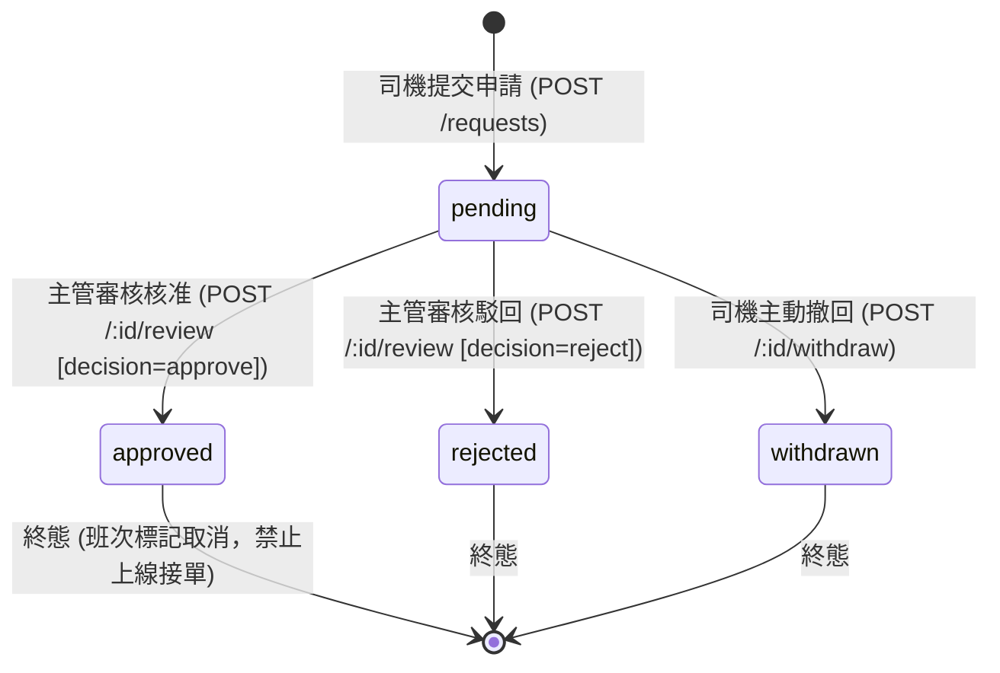
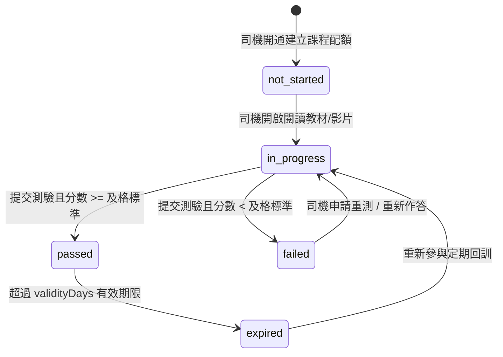

# System Remediation 20260906: Feature Contracts (請假／學院／Host 最小可實作契約)

- **文檔狀態**: Canonical Design Contract for System Remediation
- **任務編號**: `SR-DESIGN-001`
- **Owner**: `Gemini2`
- **Reviewer**: `Gemini`
- **涵蓋缺口 (Gaps)**: `N01`, `N02`, `N03`
- **涵蓋能力 (Capabilities)**: `C012`, `C052`, `C059`, `C071`
- **規範追溯**:
  - `phase1_prd_detailed_v1.md` §9.4.7 (Shift & Attendance: 請假申請), §9.4.9 (Settings & Academy: 教學影片/SOP/測驗), §12.6 (Host 自車四項唯讀權限)
  - `phase1_service_contracts_v1.md` (API envelope, error structure)
  - `infra/migrations/V0002__enum_types.sql`, `V0004__regulatory_registry.sql`, `V0068__canonical_identity_authority.sql`, `V0084__standardise_currency_code_twd.sql`

---

## 1. 核心架構原則與邊界約束 (Architectural Principles & Boundaries)

1. **沿用權威 API 與資料模型，禁止虛假完成**:
   - 廢除前端硬編碼或固定百分比 fixture（如 `FX_FLEET_TRAINING`），完訓率與逾期名單必須自後端真實數據庫紀錄動態計算。
   - 收益、維保、任務、案件必須沿用既有權威來源（`ops.platform_earnings`, `reg.vehicle_maintenance`, `ops.trips`, `crm.complaint_cases`），絕不建立第二套對帳或結算真值。
2. **遵守現行 Realm 定義，不自創非標準 Realm**:
   - 依現有 `IAM_REALMS` (`system`, `platform`, `tenant`, `ops`, `driver`, `partner`) 進行授權映射：
     - **請假 (Leave)**: 申請端為 `driver` realm，審核端為 `ops` realm。
     - **學院 (Academy)**: 學員端為 `driver` realm，管理端為 `partner` realm（車行合作夥伴 `fleet_company_partner`）。
     - **車主 (Host)**: 採用 `partner` realm（對應 `core.partner_type_t` 之 `individual_owner`，或具備 `host` 角色的車主身份）。不建立不存在的 `host` realm。
3. **明示既有欄位與不確定點落點 (Explicit Unknowns & Resolutions)**:
   - 貨幣代碼全系統統一為 `TWD`（依循 `V0084__standardise_currency_code_twd.sql`）。
   - 請假申請與排班狀態同步：請假核准自動連動班次（overlapping shifts flagged/cancelled），並阻擋請假期間的司機出勤上線（`clock-in` 拒絕）。
   - Host 資訊嚴格採用唯讀受限投影（Restricted Read Projection）：嚴格遮蔽乘客個人資訊（PII）與車身碼敏感位元（VIN masking），查驗無權車輛一律返回 `404 NOT_FOUND` 防止車輛 ID 探測枚舉。
4. **下游任務依賴與 Migration 編號分配**:
   - `SR-CONTRACT-001` 將依據本契約產生 `@drts/contracts` 與 `@drts/api-client` 型別。
   - 後續專屬 Migration 分配：
     - 請假服務 (SR-LEAVE-BE-001): `infra/migrations/V0086__sr_driver_leave.sql`
     - 學院服務 (SR-ACADEMY-BE-001): `infra/migrations/V0087__sr_driver_academy.sql`
     - Host 投影服務 (SR-HOST-BE-001): `infra/migrations/V0088__sr_host_vehicle_access.sql`

---

## 2. Family 1: 請假工作流程契約 (Driver Leave Workflow)

### 2.1 追溯與問題定義
- **Gap ID**: `N01`（請假申請沒有完整工作流程）
- **Capability ID**: `C052`（司機／排班主管: 請假申請、審核與班表聯動）
- **PRD 參照**: §9.4.7 Shift & Attendance（3. 請假申請）
- **現狀差距**: 目前 `apps/api/src/modules/shift-attendance/` 僅具備 `clockIn`, `clockOut`, `listShifts`, `abandonShift`, `listAttendance`，缺少請假申請、撤回、主管審核及請假期間阻擋出勤之完整閉環。

### 2.2 角色與 IAM 映射
| 角色 | Realm | Role Code | Required Scopes | Resource Constraint | 操作範圍 |
| :--- | :--- | :--- | :--- | :--- | :--- |
| **司機 (Driver)** | `driver` | `driver_user` | `driver:read`, `driver:write` | `kind: "driver"`, `actorId == driverId` | 建立請假、查看自身假單、撤回待審假單 |
| **排班主管 (Ops Manager)** | `ops` | `ops_user` / `dispatcher` | `ops:read`, `ops:write` | Tenant / Area Boundary | 查看轄下司機假單、核准假單、駁回假單 |
| **系統/派車服務 (System)** | `system` | `system` | `system:internal` | 無 | 驗證司機出勤資格，請假中禁止上線 |

### 2.3 狀態機與生命週期 (State Machine)


**業務不變式 (Business Invariants)**:
1. `startTime < endTime` 且 `startTime` 不得早於系統容許寬限時間（不允許直接跨過寬限期補歷史假單）。
2. 同一司機在 `pending` 或 `approved` 狀態的時間區間不得與既有假單重疊（衝突時返回 `409 LEAVE_OVERLAPPING_REQUEST`）。
3. 假單經主管核准 (`approved`) 後：
   - 系統查詢該區間內司機已排定之班次（`ops.shifts`），自動將衝突班次標記為請假調離，並將被影響班次 ID 記錄於 `impactedShiftIds`。
   - 司機於請假時間區間內呼叫 `POST /api/shift-attendance/clock-in` 時，系統強制拒絕並回傳 `409 DRIVER_ON_LEAVE`。
4. 只有 `pending` 狀態的假單允許被司機撤回 (`withdrawn`) 或由主管審核 (`approved`/`rejected`)。已結案假單再次操作回傳 `409 LEAVE_INVALID_STATE_TRANSITION`。

### 2.4 資料模型與 TypeScript 契約
```typescript
export type DriverLeaveType =
  | "annual"       // 特休
  | "sick"         // 病假
  | "personal"     // 事假
  | "bereavement"  // 喪假
  | "emergency";   // 緊急事假

export type DriverLeaveStatus =
  | "pending"      // 待審核
  | "approved"     // 已核准
  | "rejected"     // 已駁回
  | "withdrawn";   // 已撤回

export interface DriverLeaveRecord {
  leaveId: string;               // UUID
  driverId: string;              // 司機識別碼
  leaveType: DriverLeaveType;
  startTime: string;             // ISO 8601 UTC
  endTime: string;               // ISO 8601 UTC
  reason: string;                // 請假理由
  status: DriverLeaveStatus;
  reviewedByPrincipalId: string | null;
  reviewedAt: string | null;     // ISO 8601 UTC
  reviewNotes: string | null;    // 審核備註/駁回原因
  impactedShiftIds: string[];    // 連動受影響班次
  createdAt: string;
  updatedAt: string;
}

export interface CreateDriverLeaveCommand {
  leaveType: DriverLeaveType;
  startTime: string;
  endTime: string;
  reason: string;
}

export interface WithdrawDriverLeaveCommand {
  reason?: string;
}

export interface ReviewDriverLeaveCommand {
  decision: "approve" | "reject";
  reviewNotes?: string;
}

export interface DriverLeaveQueryFilter {
  driverId?: string;
  status?: DriverLeaveStatus;
  startTimeFrom?: string;
  endTimeTo?: string;
  limit?: number;
  offset?: number;
}
```

### 2.5 API 路由與 Envelope 規格
所有回應均使用標準 `@drts/api` 之 `ApiSuccessEnvelope<T>`。

#### 1. 建立請假申請
- **Method & Path**: `POST /api/driver-leave/requests`
- **Auth**: Realm `driver`, Scope `driver:write`
- **Request Body**: `CreateDriverLeaveCommand`
- **Success Response (201 Created)**:
  ```json
  {
    "success": true,
    "data": {
      "leaveId": "lv_d82a1b5c-4f91-4c92-91d8-847291048123",
      "driverId": "driver_001",
      "leaveType": "personal",
      "startTime": "2026-09-10T08:00:00.000Z",
      "endTime": "2026-09-10T17:00:00.000Z",
      "reason": "Family urgent appointment",
      "status": "pending",
      "reviewedByPrincipalId": null,
      "reviewedAt": null,
      "reviewNotes": null,
      "impactedShiftIds": [],
      "createdAt": "2026-09-06T06:30:00.000Z",
      "updatedAt": "2026-09-06T06:30:00.000Z"
    },
    "requestId": "req_lv_create_001",
    "timestamp": "2026-09-06T06:30:00.123Z"
  }
  ```

#### 2. 查詢假單列表
- **Method & Path**: `GET /api/driver-leave/requests`
- **Auth**:
  - 司機 (`driver` realm): 自動限定 `driverId = identity.actorId`。
  - 營運人員 (`ops` realm): 可透過 query 參數 `driverId`、`status` 篩選轄下車隊假單。
- **Success Response (200 OK)**:
  ```json
  {
    "success": true,
    "data": {
      "items": [ /* DriverLeaveRecord[] */ ],
      "total": 1,
      "limit": 20,
      "offset": 0
    },
    "requestId": "req_lv_list_001",
    "timestamp": "2026-09-06T06:31:00.000Z"
  }
  ```

#### 3. 司機主動撤回假單
- **Method & Path**: `POST /api/driver-leave/requests/:leaveId/withdraw`
- **Auth**: Realm `driver`, Scope `driver:write`
- **Request Body**: `WithdrawDriverLeaveCommand`
- **Success Response (200 OK)**: 返回更新為 `status: "withdrawn"` 之 `DriverLeaveRecord`。

#### 4. 主管審核假單 (核准 / 駁回)
- **Method & Path**: `POST /api/driver-leave/requests/:leaveId/review`
- **Auth**: Realm `ops`, Scope `ops:write`
- **Request Body**: `ReviewDriverLeaveCommand`
- **Success Response (200 OK)**: 返回狀態更新為 `approved` 或 `rejected` 之 `DriverLeaveRecord`（若核准，附帶 `impactedShiftIds`）。

### 2.6 錯誤代碼與 HTTP 映射
| Error Code | HTTP Status | 觸發情境與說明 |
| :--- | :--- | :--- |
| `LEAVE_INVALID_TIME_RANGE` | `400 Bad Request` | `startTime >= endTime`，或請假起始時間早於當前寬限期。 |
| `LEAVE_MISSING_REQUIRED_FIELDS` | `400 Bad Request` | 未填寫請假類型或事由。 |
| `LEAVE_FORBIDDEN_ACCESS` | `403 Forbidden` | 司機嘗試存取或撤回他人所屬之假單。 |
| `LEAVE_NOT_FOUND` | `404 Not Found` | 指定之 `leaveId` 不存在。 |
| `LEAVE_OVERLAPPING_REQUEST` | `409 Conflict` | 申請之時間區間與該司機既有之 `pending` 或 `approved` 假單重疊。 |
| `LEAVE_INVALID_STATE_TRANSITION` | `409 Conflict` | 嘗試撤回或審核非 `pending` 狀態之假單。 |
| `DRIVER_ON_LEAVE` | `409 Conflict` | 司機於請假核准期間嘗試 `clock-in` 上線。 |

### 2.7 正負驗收條件 (Acceptance Criteria)
- **AC-LEAVE-POS-1 (司機申請與撤回)**: 司機提交合法時間區間之假單，狀態初始為 `pending`；在主管審核前，司機能成功撤回，狀態轉為 `withdrawn`。
- **AC-LEAVE-POS-2 (主管審核與班表連動)**: 主管對 `pending` 假單執行 `approve`，狀態轉為 `approved`；該區段內之既有排班自動標記受影響並記錄於 `impactedShiftIds`。
- **AC-LEAVE-POS-3 (出勤防護連動)**: 處於核准請假期間內之司機呼叫 `/api/shift-attendance/clock-in` 時，被系統阻擋並返回 `409 DRIVER_ON_LEAVE`。
- **AC-LEAVE-NEG-1 (非法日期阻擋)**: 司機提交 `endTime <= startTime` 或過去日期之申請，系統返回 `400 LEAVE_INVALID_TIME_RANGE`。
- **AC-LEAVE-NEG-2 (重疊假單阻擋)**: 司機提交與既有有效假單重疊之區間，系統返回 `409 LEAVE_OVERLAPPING_REQUEST`。
- **AC-LEAVE-NEG-3 (越權存取隔離)**: 司機 A 嘗試撤回或查詢司機 B 之假單，系統返回 `403 LEAVE_FORBIDDEN_ACCESS` 或 `404 Not Found`。

---

## 3. Family 2: 學院與培訓驗證契約 (Driver Academy & Fleet Training)

### 3.1 追溯與問題定義
- **Gap ID**: `N02`（學院、測驗、完訓證據未落地）
- **Capability IDs**: `C059`（司機: 教學影片、SOP、測驗與完訓紀錄）、`C071`（車行訓練管理員: 看真完訓率與逾期名單）
- **PRD 參照**: §9.4.9 Settings & Academy（教學影片/SOP/小測驗、合規與安全訓練，AV 監督訓練 Phase 1 不作開通條件）
- **現狀差距**: 目前 `fleet-portal-fixtures.ts` 寫死 `FX_FLEET_TRAINING` 及固定百分比，`loadTraining()` 返回 fallback，前端無真實測驗作答與評分落地，無法下鑽至單一司機完訓證據。

### 3.2 角色與 IAM 映射
| 角色 | Realm | Role Code | Required Scopes | Resource Constraint | 操作範圍 |
| :--- | :--- | :--- | :--- | :--- | :--- |
| **司機 (Driver)** | `driver` | `driver_user` | `driver:read`, `driver:write` | `kind: "driver"`, `actorId == driverId` | 瀏覽所屬課程、查看教材、提交測驗答案、查看自身分數與到期日 |
| **車行管理員 (Fleet Admin)**| `partner` | `fleet_admin` | `partner:read` | `kind: "partner"`, `partnerId == fleetId` | 查看車行真實完訓看板、瀏覽學員名單、下鑽單一學員答題證據 |
| **營運/法遵 (Platform Ops)** | `platform` / `ops`| `ops_admin` | `ops:read` | 全局 | 課程教材與題庫版本發布及稽核 |

### 3.3 狀態機與生命週期 (State Machine)


**業務不變式 (Business Invariants)**:
1. **動態完訓統計，嚴禁 Fixture 假數據**:
   - 車行訓練看板之完訓率 (`completionPct`)、未完訓人數 (`pendingHeadcount`)、逾期人數 (`overdueIncomplete`) 必須由該車行所有綁定司機之真實課程紀錄聚合算得：
     $$\text{completionPct} = \text{round}\left(\frac{\text{status 為 passed 的司機數}}{\text{該車行總司機數}} \times 100\right)\%$$
2. **作答與客觀評分**:
   - 測驗題目在司機拉取時**絕不包含正確答案與解析**（防作弊）。
   - 司機提交答案後由後端即時計算分數，並將作答快照與成績耐久存檔至 `DriverQuizAttemptRecord`。
3. **資格到期與重訓**:
   - 針對設定有 `validityDays`（如年度法規/安全回訓 365 天）之課程，計算 `expiresAt = completedAt + validityDays`。
   - 超過 `expiresAt` 且未完成新年度測驗者，狀態自動判定為 `expired`，並於車行逾期名單中呈現。
4. **租戶/車行隔離**:
   - 車行 A 管理員僅能查詢所屬 `fleetPartnerId` 之司機完訓紀錄，跨車行查詢一律回傳 `403`。

### 3.4 資料模型與 TypeScript 契約
```typescript
export type TrainingStatus =
  | "not_started"
  | "in_progress"
  | "passed"
  | "failed"
  | "expired";

export interface AcademyModule {
  moduleId: string;
  title: string;
  type: "video" | "sop" | "article";
  contentUrl: string;
  durationMinutes: number;
}

export interface QuizQuestionOption {
  optionId: string;
  text: string;
}

export interface QuizQuestionPublic {
  questionId: string;
  prompt: string;
  options: QuizQuestionOption[];
  // 正確答案由後端保留，不對學員端暴露
}

export interface AcademyCourseSummary {
  courseId: string;             // e.g. "crs_platform_basics"
  courseCode: string;           // "platform_basics" | "airport_sop" | "safety_incident" | "business_service" | "insurance_flow"
  title: string;
  category: "compliance" | "service_quality" | "safety" | "operations";
  isRequired: boolean;
  validityDays: number | null;  // null 表永久有效；365 表年檢
  passingScore: number;         // 預設 80 分
  version: number;
  modulesCount: number;
}

export interface AcademyCourseDetail extends AcademyCourseSummary {
  description: string;
  modules: AcademyModule[];
  questions: QuizQuestionPublic[];
}

export interface QuizSubmissionCommand {
  answers: Array<{
    questionId: string;
    selectedOptionId: string;
  }>;
}

export interface QuizResultRecord {
  attemptId: string;
  courseId: string;
  score: number;
  passed: boolean;
  attemptedAt: string;
  feedback?: string;
}

export interface DriverTrainingRecord {
  recordId: string;
  driverId: string;
  courseId: string;
  courseCode: string;
  courseTitle: string;
  status: TrainingStatus;
  highestScore: number | null;
  passed: boolean;
  attemptsCount: number;
  completedAt: string | null;
  expiresAt: string | null;
  isOverdue: boolean;
  lastAttemptAt: string | null;
}

export interface FleetTrainingSummaryRow {
  course: string;
  en: string;
  completed: number;
  total: number;
  pct: number;
}

export interface FleetTrainingView {
  fleetPartnerId: string;
  rows: FleetTrainingSummaryRow[];
  summary: {
    completionPct: string;
    pendingHeadcount: string;
    overdueIncomplete: number;
  };
  source: "authoritative"; // 廢除 fallback
}

export interface FleetDriverRosterItem {
  driverId: string;
  driverName: string;
  courseCode: string;
  status: TrainingStatus;
  score: number | null;
  completedAt: string | null;
  isOverdue: boolean;
}
```

### 3.5 API 路由與 Envelope 規格

#### 1. 司機查詢培訓課程列表
- **Method & Path**: `GET /api/driver-academy/courses`
- **Auth**: Realm `driver`, Scope `driver:read`
- **Success Response (200 OK)**:
  ```json
  {
    "success": true,
    "data": {
      "items": [
        {
          "courseId": "crs_basics_001",
          "courseCode": "platform_basics",
          "title": "平台合作基礎",
          "category": "compliance",
          "isRequired": true,
          "validityDays": null,
          "passingScore": 80,
          "version": 1,
          "modulesCount": 3,
          "userStatus": "not_started"
        }
      ]
    },
    "requestId": "req_acad_list_001",
    "timestamp": "2026-09-06T06:35:00.000Z"
  }
  ```

#### 2. 司機取得課程教材與試卷
- **Method & Path**: `GET /api/driver-academy/courses/:courseId`
- **Auth**: Realm `driver`, Scope `driver:read`
- **Success Response (200 OK)**: 返回包含教材模組與題目（不帶答案）之 `AcademyCourseDetail`。

#### 3. 司機提交測驗答案
- **Method & Path**: `POST /api/driver-academy/courses/:courseId/quiz/submit`
- **Auth**: Realm `driver`, Scope `driver:write`
- **Request Body**: `QuizSubmissionCommand`
- **Success Response (200 OK)**:
  ```json
  {
    "success": true,
    "data": {
      "attemptId": "att_9f81a742-1234-4567-8901-234567890123",
      "courseId": "crs_basics_001",
      "score": 100,
      "passed": true,
      "attemptedAt": "2026-09-06T06:36:12.000Z",
      "feedback": "恭喜！您已全數答對並通過測驗。"
    },
    "requestId": "req_acad_sub_001",
    "timestamp": "2026-09-06T06:36:12.100Z"
  }
  ```

#### 4. 車行管理員查詢培訓統計看板
- **Method & Path**: `GET /api/fleet-partner/training/summary`
- **Auth**: Realm `partner`, Scope `partner:read`
- **Success Response (200 OK)**:
  ```json
  {
    "success": true,
    "data": {
      "fleetPartnerId": "partner_fleet_001",
      "rows": [
        {
          "course": "平台合作基礎",
          "en": "platform_basics",
          "completed": 126,
          "total": 128,
          "pct": 98
        }
      ],
      "summary": {
        "completionPct": "98%",
        "pendingHeadcount": "2",
        "overdueIncomplete": 0
      },
      "source": "authoritative"
    },
    "requestId": "req_fleet_sum_001",
    "timestamp": "2026-09-06T06:37:00.000Z"
  }
  ```

#### 5. 車行管理員查詢司機完訓名冊與下鑽
- **Method & Path**: `GET /api/fleet-partner/training/roster`
- **Auth**: Realm `partner`, Scope `partner:read`
- **Query Params**: `courseCode`, `status`, `isOverdue`, `limit`, `offset`
- **Success Response (200 OK)**: 返回 `FleetDriverRosterItem[]`，包含每位司機真實分數、通過時間與到期狀態。

### 3.6 錯誤代碼與 HTTP 映射
| Error Code | HTTP Status | 觸發情境與說明 |
| :--- | :--- | :--- |
| `QUIZ_INCOMPLETE_SUBMISSION` | `400 Bad Request` | 提交之答案題數少於試卷必要題數。 |
| `COURSE_NOT_FOUND` | `404 Not Found` | 查詢之 `courseId` 不存在。 |
| `ACADEMY_FORBIDDEN_FLEET_ACCESS` | `403 Forbidden` | 車行嘗試存取其他車行之司機培訓名單或答題證據。 |
| `DRIVER_RECORD_NOT_FOUND` | `404 Not Found` | 找不到該司機之課程修習紀錄。 |

### 3.7 正負驗收條件 (Acceptance Criteria)
- **AC-ACAD-POS-1 (司機作答與即時評分)**: 司機提交完整測驗答案，後端依題庫金鑰比對計分；分數大於等於 80 時，狀態更新為 `passed`，並記錄 `completedAt`。
- **AC-ACAD-POS-2 (車行看板真值統計)**: 當某位司機通過測驗後，車行呼叫 `/api/fleet-partner/training/summary` 之 `completed` 計數即時加 1，`completionPct` 依真值重新計算，且 `source` 為 `authoritative`。
- **AC-ACAD-POS-3 (重考與重訓到期)**: 司機測驗未及格時狀態為 `failed`，可重新作答；若逾期未重新通過，在名冊與統計中正確標記 `isOverdue: true`。
- **AC-ACAD-NEG-1 (未完備作答阻擋)**: 司機提交遺漏題目的作答，系統返回 `400 QUIZ_INCOMPLETE_SUBMISSION`，不更新紀錄。
- **AC-ACAD-NEG-2 (答案防竊聽驗證)**: 學員端呼叫 `GET /api/driver-academy/courses/:id`，回應的試卷 JSON 嚴格不包含 `correctOptionId` 或解答標籤。
- **AC-ACAD-NEG-3 (車行隔離防護)**: 車行 A 管理員請求車行 B 司機之作答證據，系統拒絕並回傳 `403 ACADEMY_FORBIDDEN_FLEET_ACCESS`。

---

## 4. Family 3: 車主 Host 自車受限唯讀投影契約 (Host Vehicle Ownership Restricted Projection)

### 4.1 追溯與問題定義
- **Gap ID**: `N03`（車主的受限自助入口尚未產品化）
- **Capability ID**: `C012`（車主 Host: 只看自有車輛收益／維保／任務／案件）
- **PRD 參照**: §12.6 Host（可查看: 自車收益、自車維保、自車任務、自車相關案件）
- **現狀差距**: 角色矩陣標記 partial / not productized，現行 portal 缺少明確的 Host 視角落點。現有資料庫表 `reg.vehicles` 雖有 `owner_type: 'individual_owner'` 與 `owner_partner_id`，但缺少專屬的受限投影 read model 與防越權防洩密機制。

### 4.2 角色與 IAM 映射
| 項目 | 規範說明 |
| :--- | :--- |
| **Realm** | `partner`（依據現有 Realm，不創立新的 Host Realm） |
| **Partner Type** | `core.partner_type_t` 之 `'individual_owner'` |
| **Role Code** | `host` / `vehicle_owner` |
| **Required Scopes**| `host:read`（或 `partner:read` 並附加自車物主約束） |
| **Resource Constraint** | `kind: "object"`, `vehicle.owner_partner_id === identity.partnerId` |
| **操作限制** | **嚴格唯讀 (Strictly Read-Only)**，絕無車輛派任、資費設定或款項異動之 Mutation 權限。 |

### 4.3 核心業務規則與安全防護 (Security Invariants)
1. **物主嚴格綁定與防枚舉**:
   - 後端查詢車輛、收益、維保、任務與案件時，SQL 必須強制帶有 `WHERE reg.vehicles.owner_partner_id = :authenticatedPartnerId`。
   - 若 Host 嘗試透過 URL 參數存取非本人名下之 `vehicleId`，後端一律回傳 `404 HOST_VEHICLE_NOT_FOUND`，嚴禁返回 403 以避免攻擊者枚舉合法車輛 ID。
2. **個資去識別化與隱私遮蔽 (PII Redaction)**:
   - **乘客隱私**: 任務列表中的乘客真實姓名、手機號碼、詳細上車/下車地址（如住家樓層）一律遮蔽或移除，僅呈現區域（如「台北市信義區」）與乘車時間。
   - **車輛敏感資訊**: VIN 碼僅顯示前 11 碼，後 6 碼以星號遮蔽（如 `1HGCR2F83HA******`）。
   - **投訴案件**: 申訴人姓名與聯絡方式一律隱蔽，僅提供案件類別與處理狀態摘要。
3. **貨幣標準化與無收益處理**:
   - 幣別全數對齊 `TWD`（依據 `V0084` 標準化定義）。
   - 若特定月份車輛無行程無收益，回傳金額全為 0 之結構，不得報錯崩潰。

### 4.4 資料模型與 TypeScript 契約
```typescript
export interface HostVehicleSummary {
  vehicleId: string;
  plateNo: string;
  vinMasked: string;            // 遮蔽後 6 碼
  vehicleForm: string;          // sedan, mpv, etc.
  licenseClass: string;         // taxi, rental, multi_taxi
  energyType: string;           // fuel, electric, hybrid
  currentStatus: string;        // active, maintenance, inactive
  operatingFleetName: string;   // 委託之車行名稱
  contractPeriod: {
    startAt: string;
    endAt: string;
    status: string;
  } | null;
}

export interface HostVehicleEarningsSummary {
  vehicleId: string;
  period: string;               // YYYY-MM
  currency: "TWD";
  grossRevenue: number;         // 該車產出之總車資
  platformFee: number;          // 平台服務費
  fleetCommission: number;      // 車行抽成/管理費
  netEarnings: number;          // 車主淨分潤
  tripsCount: number;           // 完成趟次
  operatingDays: number;        // 出勤天數
}

export interface HostVehicleMaintenanceItem {
  maintenanceId: string;
  vehicleId: string;
  type: string;                 // scheduled_service, repair, inspection
  description: string;
  status: "scheduled" | "in_progress" | "completed" | "cancelled";
  scheduledAt: string | null;
  completedAt: string | null;
  cost: number | null;
  notesSummary: string | null;
}

export interface HostVehicleTripItem {
  tripId: string;
  vehicleId: string;
  startedAt: string;
  completedAt: string | null;
  areaSummary: string;          // e.g. "大安區 → 南港區" (去識別化，不含地址門牌)
  distanceKm: number;
  fareAmount: number;
  status: string;
}

export interface HostVehicleCaseItem {
  caseId: string;
  vehicleId: string;
  category: "vehicle_condition" | "accident" | "equipment" | "service_feedback";
  status: "open" | "investigating" | "resolved" | "closed";
  reportedAt: string;
  resolvedAt: string | null;
  resolutionSummary: string | null; // 去識別化之處理結論
}
```

### 4.5 API 路由與 Envelope 規格

#### 1. 查詢車主名下所有車輛
- **Method & Path**: `GET /api/host/vehicles`
- **Auth**: Realm `partner`, Role `host`, Scope `host:read`
- **Success Response (200 OK)**:
  ```json
  {
    "success": true,
    "data": {
      "items": [
        {
          "vehicleId": "veh_host_001",
          "plateNo": "TDC-8899",
          "vinMasked": "1HGCR2F83HA******",
          "vehicleForm": "sedan",
          "licenseClass": "multi_taxi",
          "energyType": "electric",
          "currentStatus": "active",
          "operatingFleetName": "大都會多元車隊",
          "contractPeriod": {
            "startAt": "2026-01-01T00:00:00.000Z",
            "endAt": "2026-12-31T23:59:59.000Z",
            "status": "active"
          }
        }
      ]
    },
    "requestId": "req_host_veh_001",
    "timestamp": "2026-09-06T06:40:00.000Z"
  }
  ```

#### 2. 查詢指定自車收益摘要
- **Method & Path**: `GET /api/host/vehicles/:vehicleId/earnings`
- **Auth**: Realm `partner`, Role `host`, Scope `host:read`
- **Query Params**: `month` (e.g. `2026-08`)
- **Success Response (200 OK)**:
  ```json
  {
    "success": true,
    "data": {
      "vehicleId": "veh_host_001",
      "period": "2026-08",
      "currency": "TWD",
      "grossRevenue": 84200,
      "platformFee": 12630,
      "fleetCommission": 8420,
      "netEarnings": 63150,
      "tripsCount": 182,
      "operatingDays": 26
    },
    "requestId": "req_host_earn_001",
    "timestamp": "2026-09-06T06:40:10.000Z"
  }
  ```

#### 3. 查詢指定自車維保紀錄
- **Method & Path**: `GET /api/host/vehicles/:vehicleId/maintenance`
- **Auth**: Realm `partner`, Role `host`, Scope `host:read`
- **Success Response (200 OK)**: 返回 `HostVehicleMaintenanceItem[]`。

#### 4. 查詢指定自車行程任務 (PII 去識別化)
- **Method & Path**: `GET /api/host/vehicles/:vehicleId/trips`
- **Auth**: Realm `partner`, Role `host`, Scope `host:read`
- **Query Params**: `limit`, `offset`
- **Success Response (200 OK)**: 返回 `HostVehicleTripItem[]`。

#### 5. 查詢指定自車相關案件 (PII 去識別化)
- **Method & Path**: `GET /api/host/vehicles/:vehicleId/cases`
- **Auth**: Realm `partner`, Role `host`, Scope `host:read`
- **Success Response (200 OK)**: 返回 `HostVehicleCaseItem[]`。

### 4.6 錯誤代碼與 HTTP 映射
| Error Code | HTTP Status | 觸發情境與說明 |
| :--- | :--- | :--- |
| `HOST_UNAUTHORIZED` | `401 Unauthorized` | 未帶有效 Token 或 Session 已失效。 |
| `HOST_FORBIDDEN` | `403 Forbidden` | 呼叫端非 `partner` realm 或無車主身份授權。 |
| `HOST_VEHICLE_NOT_FOUND` | `404 Not Found` | 車輛不存在，或該車輛不屬於該車主（防枚舉統一回 404）。 |
| `HOST_MUTATION_NOT_SUPPORTED` | `405 Method Not Allowed` | Host 嘗試使用 POST/PUT/DELETE 對自車進行異動。 |

### 4.7 正負驗收條件 (Acceptance Criteria)
- **AC-HOST-POS-1 (多車查詢與資訊遮蔽)**: 車主名下擁有兩輛車時，首頁可見此兩車，VIN 後 6 碼以星號遮蔽；能分別下鑽檢視收益、維保、行程、案件。
- **AC-HOST-POS-2 (行程與案件去識別化)**: 車主檢視行程時僅看到概括行程與車資，絕無乘客姓名與電話；案件僅可見處理結論，無申訴人資訊。
- **AC-HOST-POS-3 (零營收與空資料兼容)**: 新車未產生行程或維保時，API 返回 200 與空陣列/零金額，UI 呈現合適空狀態。
- **AC-HOST-NEG-1 (跨車主隔離)**: 車主 A 嘗試透過 `/api/host/vehicles/veh_B/overview` 查詢車主 B 之車輛，後端回傳 `404 HOST_VEHICLE_NOT_FOUND`。
- **AC-HOST-NEG-2 (禁止異動)**: 車主嘗試發送寫入請求修改合約或收益，系統返回 `405 Method Not Allowed`。

---

## 5. 契約決策與下游落地落點對照表 (Decision Ledger & Execution Plan)

| 關鍵考量點 | 決策落點 | 對應任務與 Migration |
| :--- | :--- | :--- |
| **請假與班表連動模式** | 假單核准後，自動調離該時段排班；請假生效中司機出勤打卡時阻擋 (`409 DRIVER_ON_LEAVE`)。 | `SR-LEAVE-BE-001`, `SR-LEAVE-FE-001`<br>`infra/migrations/V0086__sr_driver_leave.sql` |
| **學院完訓率真值計算** | 全面廢止 `FX_FLEET_TRAINING` fixture，由資料庫真實作答記錄動態計算完成人數、未完訓人數與百分比。 | `SR-ACADEMY-BE-001`, `SR-ACADEMY-FE-001`<br>`infra/migrations/V0087__sr_driver_academy.sql` |
| **Host 車主身份與入口** | 沿用 `partner` realm（對應 `individual_owner`），在 `fleet-partner-portal-web` 啟用 `/host` 專屬唯讀視角，不重啟已退場 app。 | `SR-HOST-BE-001`, `SR-HOST-FE-001`<br>`infra/migrations/V0088__sr_host_vehicle_access.sql` |
| **Host 防越權與防枚舉** | 查詢非本人名下車輛直接回應 `404 HOST_VEHICLE_NOT_FOUND`，防止車輛 ID 枚舉。 | `SR-HOST-BE-001` |
| **全局整合與統一 Wiring** | 各模組只輸出獨立 module，由 `SR-WIRE-001` 統一於 `app.module.ts` 及各 App 導航列進行總裝配線。 | `SR-WIRE-001` |
