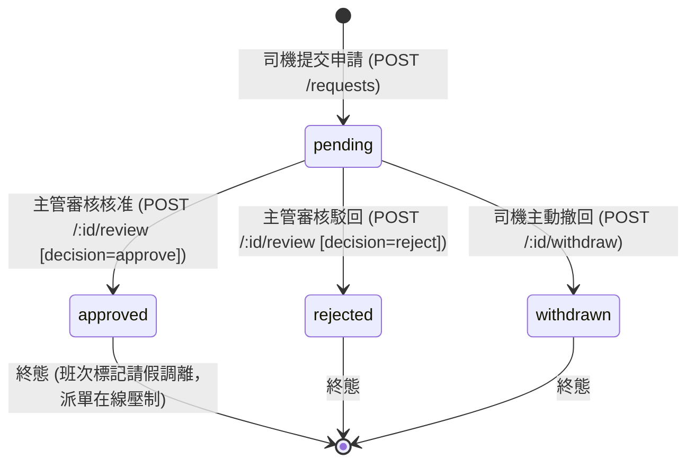
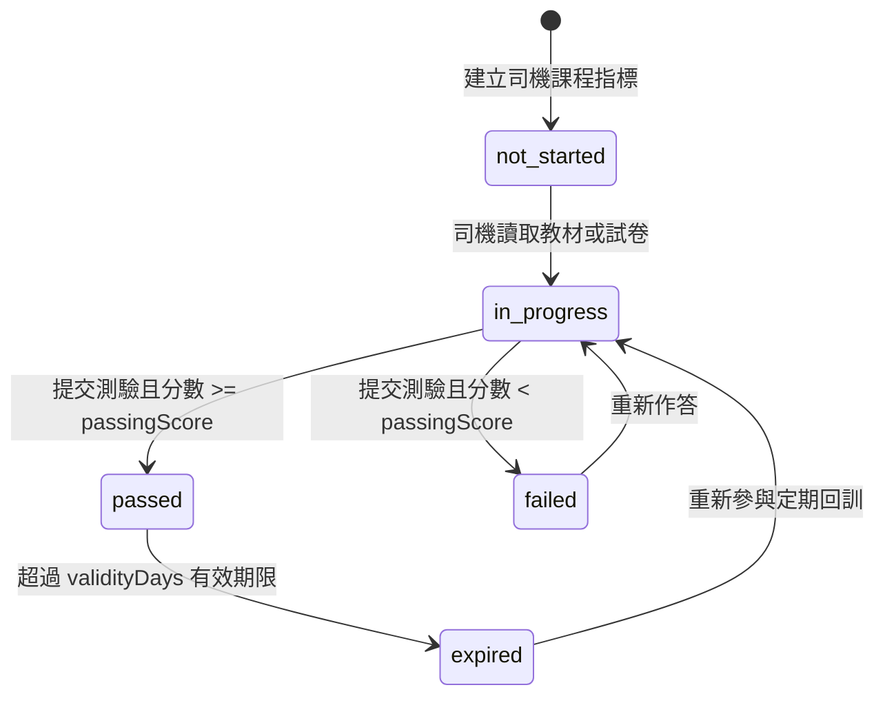

# System Remediation 20260906: Feature Contracts (請假／學院／Host 最小可實作契約)

- **文檔狀態**: Canonical Design Contract for System Remediation (Codex2 Review Addressed)
- **任務編號**: `SR-DESIGN-001`
- **Owner**: `Gemini2`
- **Reviewer**: `Codex2`
- **涵蓋缺口 (Gaps)**: `N01`, `N02`, `N03`
- **涵蓋能力 (Capabilities)**: `C012`, `C052`, `C059`, `C071`
- **規範追溯**:
  - `phase1_prd_detailed_v1.md` §9.4.7 (Shift & Attendance: 請假申請), §9.4.9 (Settings & Academy: 教學影片/SOP/測驗), §12.6 (Host 自車四項唯讀權限)
  - `phase1_service_contracts_v1.md` (API envelope, error structure)
  - `packages/contracts/src/index.ts` (`ApiSuccessEnvelope`, `ApiPageInfo`, `ApiListData`, `ShiftRecord`, `MAINTENANCE_STATUSES`)
  - `packages/contracts/src/iam-policy-catalog.ts` (IAM realms, actors, roles, scopes, resource constraints)
  - `packages/contracts/src/platform-presence.ts` (`PlatformPresenceRecord`, `PlatformEligibility`)
  - `infra/migrations/V0002__enum_types.sql` (`reg.training_status_t`, `reg.vehicle_form_t`)
  - `infra/migrations/V0004__regulatory_registry.sql` (`reg.vehicles`, `reg.driver_reg_profiles`, `reg.driver_training_records`)
  - `infra/migrations/V0011__phase1_runtime_snapshots.sql` (`crm.phase1_complaint_cases`, `ops.phase1_owned_orders`)
  - `infra/migrations/V0015__ops_driver_domains.sql` (`ops.phase1_driver_shifts`, `ops.phase1_maintenance_logs`, `ops.phase1_driver_matching_suppressions`)
  - `infra/migrations/V0018__platform_earnings.sql` (`ops.phase1_platform_earnings_ledger`)
  - `infra/migrations/V0027__service_product_and_vehicle_eligibility_extensions.sql` (`trainingRequired`)
  - `infra/migrations/V0084__standardise_currency_code_twd.sql` (TWD currency standard)

---

## 1. 核心架構原則與邊界約束 (Architectural Principles & Boundaries)

1. **統一遵循權威 API Envelope，禁止非標準結構**:
   - 全系統成功回應格式嚴格對齊 `packages/contracts/src/index.ts:728-734` 與 `apps/api/src/common/api-envelope.ts:14-24`：
     ```typescript
     export interface ApiSuccessEnvelope<T> {
       data: T;
       meta: {
         requestId: string;
         timestamp: string;
       };
     }
     ```
   - 分頁清單回應嚴格包含 `items: T[]` 與 `pageInfo: ApiPageInfo`（含 `page`, `pageSize`, `totalItems`, `totalPages`），禁止在頂層直接混合 `success: boolean` 或頂層 `requestId`/`timestamp`。

2. **沿用權威 DB 來源與資料模型，禁止虛假完成與自創財務政策**:
   - **排班與請假**: 班表底層為 `ops.phase1_driver_shifts`（`V0015__ops_driver_domains.sql:77-92`），班次狀態依循 `ShiftStatus` (`active`, `completed`, `abandoned`)。透過 `scheduled_start`/`scheduled_end` 與 `record` jsonb 註記請假調離（`leaveReassigned: true`），並連動 `ops.phase1_driver_matching_suppressions`。
   - **平台在線與派單資格**: 司機派單狀態由 `apps/api/src/modules/platform-presence/` 與 `packages/contracts/src/platform-presence.ts` 控制。司機進入請假區間時，其 `eligibility` 自動轉為 `"ineligible"`，並於 `ops.phase1_driver_matching_suppressions` 啟動派單壓制。
   - **學院完訓率與資格連動**: 廢除前端硬編碼或固定百分比 fixture（如 `FX_FLEET_TRAINING`）。作答紀錄落地至 `reg.driver_training_records`（`V0004:108-118`），司機總體培訓資格同步寫入 `reg.driver_reg_profiles.training_status`（`'pending' | 'passed' | 'expired' | 'waived'`），並直接驅動 `trainingRequired` 資格評估（`runtime-eligibility-evaluator.service.ts`）。
   - **Host 車主自車資料源**:
     - 車輛與物主: `reg.vehicles` 透過 `owner_partner_id` 綁定車主（`V0004:11`）。
     - 維保紀錄: 權威來源為 `ops.phase1_maintenance_logs`（`V0015:53-71`），狀態枚舉嚴格對齊 `MAINTENANCE_STATUSES`（含 `"scheduled" | "in_progress" | "completed" | "cancelled" | "overdue"`）。
     - 客訴案件: 權威來源為 `crm.phase1_complaint_cases`（`V0011:77-85`），以去識別化形式對外投影。
     - 收益來源與決策落點: 實際資料庫為 `ops.phase1_platform_earnings_ledger`（`V0018:5-20`），依 `driver_id`、`platform_code`、`period_date` 記帳。現行 schema 尚無車主分潤規則與車行抽成公式，因此 `grossRevenue` 由該車輛執行的已完成行程車資加總；`fleetCommission` 與 `netEarnings` 於本 Phase 1 最小契約中**明確標記為 `null` (unknown / pending settlement policy)**，交由下游 `SR-HOST-BE-001` 確立車主分潤結算規則，絕不建立第二套假財務模型。

3. **收斂 IAM 角色與 Scope 於既有 Catalog，不使用不存在的 Grant**:
   - 嚴格對齊 `packages/contracts/src/iam-policy-catalog.ts`：
     - **司機 (Driver)**: `actorType: "driver_user"`, realm `driver`, role `driver_user`。Scopes: `driver:read`, `driver:write`。Resource constraint: `kind: "driver"`, `actorId == driverId`。
     - **營運審核人員 (Ops Manager)**: `actorType: "ops_user"`, realm `ops`, role `ops_user`。Scopes: `driver:read`, `driver:write`, `dispatch:read`, `dispatch:write`。Resource constraint: `kind: "tenant"`。
     - **車行培訓管理員 (Fleet Admin)**: `actorType: "ops_user"` 或 `tenant_admin` / `tenant_ops_admin`，使用既有 `reports:read`, `driver:read`。
     - **車主 (Host)**: 採用 realm `partner`，身分對應 `core.partners.partner_type = 'individual_owner'`。授權路徑：車主透過 Partner 入口憑證登入，取得包含 `partnerId` 之 Claim。授權驗證使用既有 scopes `owned:read`, `reports:read`, `maintenance:read`，並強制綁定 Resource constraint: `kind: "object"`, `vehicle.owner_partner_id === identity.partnerId`。下游 `SR-CONTRACT-001` 與 `SR-HOST-BE-001` 僅在現有 catalog 框架內擴展專屬 Policy 定義。

4. **時間邊界與寬限期收斂**:
   - 請假申請允許的時間寬限期收斂為明確常數 `MAX_PAST_APPLICATION_GRACE_MS = 15 * 60 * 1000` (15 分鐘)。
   - 申請條件：`endTime > startTime` 且 `startTime >= now - 15 minutes`。超過 15 分鐘的過去時間申請一律拒絕並返回 `400 LEAVE_INVALID_TIME_RANGE`。

5. **下游任務依賴與 Migration 編號分配**:
   - `SR-CONTRACT-001`: 依本契約將型別落入 `@drts/contracts` 與 `@drts/api-client`。
   - `SR-LEAVE-BE-001`: 後端請假服務與 Migration `V0086__sr_driver_leave.sql`。
   - `SR-ACADEMY-BE-001`: 後端學院服務與 Migration `V0087__sr_driver_academy.sql`。
   - `SR-HOST-BE-001`: 後端 Host 自車投影服務與 Migration `V0088__sr_host_vehicle_access.sql`。
   - `SR-WIRE-001`: 各模組全域註冊與路由裝配。

---

## 2. Family 1: 請假工作流程契約 (Driver Leave Workflow)

### 2.1 追溯與問題定義

- **Gap ID**: `N01`（請假申請沒有完整工作流程）
- **Capability ID**: `C052`（司機／排班主管: 請假申請、審核與班表聯動）
- **PRD 參照**: §9.4.7 Shift & Attendance（3. 請假申請）
- **現狀差距**: 目前 `apps/api/src/modules/shift-attendance/` 僅具備基本打卡與排班查詢，缺少請假申請、撤回、審核、排班調離註記、派單資格聯動壓制與防護。

### 2.2 角色與 IAM 映射

| 角色                        | Realm    | Actor Type    | Role Code     | Required Scopes                                                  | Resource Constraint                     | 操作範圍                             |
| :-------------------------- | :------- | :------------ | :------------ | :--------------------------------------------------------------- | :-------------------------------------- | :----------------------------------- |
| **司機 (Driver)**           | `driver` | `driver_user` | `driver_user` | `driver:read`, `driver:write`                                    | `kind: "driver"`, `actorId == driverId` | 提交請假、查看自身假單、撤回待審假單 |
| **排班主管 (Ops Manager)**  | `ops`    | `ops_user`    | `ops_user`    | `driver:read`, `driver:write`, `dispatch:read`, `dispatch:write` | `kind: "tenant"`, Tenant boundary       | 查看轄下司機假單、核准/駁回假單      |
| **系統派單核心 (Dispatch)** | `system` | `system`      | `system`      | `system:internal`                                                | 無                                      | 連動派單壓制與在線資格阻擋           |

### 2.3 狀態機與生命週期 (State Machine)



**業務不變式 (Business Invariants)**:

1. **時間合法性與寬限期**:
   - `startTime < endTime`。
   - `startTime >= now - 15 minutes`（容許突發緊急請假之 15 分鐘寬限，超過 15 分鐘前之過去日期一律回傳 `400 LEAVE_INVALID_TIME_RANGE`）。
2. **重疊檢驗 (Overlap Prevention)**:
   - 同一司機在 `pending` 或 `approved` 狀態的時間區間不得與既有有效假單重疊（衝突時回傳 `409 LEAVE_OVERLAPPING_REQUEST`）。
3. **班表連動與調離標記 (Shift Reassignment Annotation)**:
   - 假單核准 (`approved`) 後，系統查詢 `ops.phase1_driver_shifts` 中該司機之排班：
     - 若 `scheduled_start < leaveEnd && scheduled_end > leaveStart`，該班次被判定為重疊。
     - 系統在該班次之 `record` jsonb 中注入註記：`{ "leaveReassigned": true, "reassignedReason": "DRIVER_ON_LEAVE", "leaveId": leave.leaveId }`。
     - 被標記班次的 ID 記錄於 `DriverLeaveRecord.impactedShiftIds`。
     - 前端班表 Read Model 顯示 `isOverlappingLeave: true` 與狀態標籤「請假調離」。
4. **出勤防護與可派在線連動 (Presence & Dispatch Eligibility Linkage)**:
   - 司機於請假生效期間呼叫 `POST /api/shift-attendance/clock-in`，系統直接拒絕並回傳 `409 DRIVER_ON_LEAVE`。
   - 司機於請假期間呼叫 `POST /api/platform-presence/online`，系統將 `PlatformPresenceRecord.eligibility` 設為 `"ineligible"`（或回傳 `409 DRIVER_ON_LEAVE`）。
   - **已上線司機進入請假區間**: 當現在時間進入核准請假起始點時，背景監控／派單調度器自動寫入 `ops.phase1_driver_matching_suppressions`（`driver_id`, `reason: 'DRIVER_ON_LEAVE'`, `effective_start`, `effective_end`），即時剔除於媒合候選人名單之外；司機端 App 收到推播通知提示請假生效並下線。

### 2.4 資料模型與 TypeScript 契約

```typescript
export type DriverLeaveType =
  | "annual" // 特休
  | "sick" // 病假
  | "personal" // 事假
  | "bereavement" // 喪假
  | "emergency"; // 緊急事假

export type DriverLeaveStatus =
  | "pending" // 待審核
  | "approved" // 已核准
  | "rejected" // 已駁回
  | "withdrawn"; // 已撤回

export interface DriverLeaveRecord {
  leaveId: string; // UUID
  driverId: string; // 司機識別碼
  leaveType: DriverLeaveType;
  startTime: string; // ISO 8601 UTC
  endTime: string; // ISO 8601 UTC
  reason: string; // 請假事由
  status: DriverLeaveStatus;
  reviewedByPrincipalId: string | null;
  reviewedAt: string | null; // ISO 8601 UTC
  reviewNotes: string | null; // 審核備註
  impactedShiftIds: string[]; // 連動受影響班次 ID 列表
  createdAt: string;
  updatedAt: string;
}

export interface CreateDriverLeaveCommand {
  leaveType: DriverLeaveType;
  startTime: string;
  endTime: string;
  reason: string;
}

export interface WithdrawDriverLeaveCommand {
  reason?: string;
}

export interface ReviewDriverLeaveCommand {
  decision: "approve" | "reject";
  reviewNotes?: string;
}

export interface DriverLeaveQueryFilter {
  driverId?: string;
  status?: DriverLeaveStatus;
  startTimeFrom?: string;
  endTimeTo?: string;
  page?: number;
  pageSize?: number;
}
```

### 2.5 API 路由與 Envelope 規格

#### 1. 建立請假申請

- **Method & Path**: `POST /api/driver-leave/requests`
- **Auth**: Realm `driver`, Actor `driver_user`, Scope `driver:write`
- **Request Body**: `CreateDriverLeaveCommand`
- **Success Response (201 Created)**:
  ```json
  {
    "data": {
      "leaveId": "lv_d82a1b5c-4f91-4c92-91d8-847291048123",
      "driverId": "driver_001",
      "leaveType": "personal",
      "startTime": "2026-09-10T08:00:00.000Z",
      "endTime": "2026-09-10T17:00:00.000Z",
      "reason": "Family urgent appointment",
      "status": "pending",
      "reviewedByPrincipalId": null,
      "reviewedAt": null,
      "reviewNotes": null,
      "impactedShiftIds": [],
      "createdAt": "2026-09-06T06:30:00.000Z",
      "updatedAt": "2026-09-06T06:30:00.000Z"
    },
    "meta": {
      "requestId": "req_lv_create_001",
      "timestamp": "2026-09-06T06:30:00.123Z"
    }
  }
  ```

#### 2. 查詢假單列表

- **Method & Path**: `GET /api/driver-leave/requests`
- **Auth**:
  - 司機 (`driver_user`): 強制過濾 `driverId = identity.actorId`。
  - 營運人員 (`ops_user`): 可依 `driverId`、`status`、時間區間查詢。
- **Success Response (200 OK)**:
  ```json
  {
    "data": {
      "items": [
        {
          "leaveId": "lv_d82a1b5c-4f91-4c92-91d8-847291048123",
          "driverId": "driver_001",
          "leaveType": "personal",
          "startTime": "2026-09-10T08:00:00.000Z",
          "endTime": "2026-09-10T17:00:00.000Z",
          "reason": "Family urgent appointment",
          "status": "pending",
          "reviewedByPrincipalId": null,
          "reviewedAt": null,
          "reviewNotes": null,
          "impactedShiftIds": [],
          "createdAt": "2026-09-06T06:30:00.000Z",
          "updatedAt": "2026-09-06T06:30:00.000Z"
        }
      ],
      "pageInfo": {
        "page": 1,
        "pageSize": 20,
        "totalItems": 1,
        "totalPages": 1
      }
    },
    "meta": {
      "requestId": "req_lv_list_001",
      "timestamp": "2026-09-06T06:31:00.000Z"
    }
  }
  ```

#### 3. 司機主動撤回假單

- **Method & Path**: `POST /api/driver-leave/requests/:leaveId/withdraw`
- **Auth**: Realm `driver`, Scope `driver:write`
- **Request Body**: `WithdrawDriverLeaveCommand`
- **Success Response (200 OK)**: 返回 `ApiSuccessEnvelope<DriverLeaveRecord>`（狀態更新為 `withdrawn`）。

#### 4. 主管審核假單 (核准 / 駁回)

- **Method & Path**: `POST /api/driver-leave/requests/:leaveId/review`
- **Auth**: Realm `ops`, Role `ops_user`, Scope `driver:write`
- **Request Body**: `ReviewDriverLeaveCommand`
- **Success Response (200 OK)**: 返回 `ApiSuccessEnvelope<DriverLeaveRecord>`（狀態更新為 `approved` 或 `rejected`，核准時包含 `impactedShiftIds`）。

### 2.6 錯誤代碼與 HTTP 映射

| Error Code                       | HTTP Status       | 觸發情境與說明                                                                 |
| :------------------------------- | :---------------- | :----------------------------------------------------------------------------- |
| `LEAVE_INVALID_TIME_RANGE`       | `400 Bad Request` | `endTime <= startTime`，日期格式無效，或請假起始時間早於當前時間 15 分鐘以上。 |
| `LEAVE_MISSING_REQUIRED_FIELDS`  | `400 Bad Request` | 未提供 `leaveType`、`startTime`、`endTime` 或 `reason`。                       |
| `LEAVE_FORBIDDEN_ACCESS`         | `403 Forbidden`   | 司機嘗試查看或撤回他人所屬之假單。                                             |
| `LEAVE_NOT_FOUND`                | `404 Not Found`   | 指定之 `leaveId` 不存在。                                                      |
| `LEAVE_OVERLAPPING_REQUEST`      | `409 Conflict`    | 申請時間與該司機既有之 `pending` 或 `approved` 假單區間重疊。                  |
| `LEAVE_INVALID_STATE_TRANSITION` | `409 Conflict`    | 嘗試對非 `pending` 狀態假單進行撤回或審核。                                    |
| `DRIVER_ON_LEAVE`                | `409 Conflict`    | 司機於請假生效期間嘗試出勤打卡 (`clock-in`) 或請求上線 (`online`)。            |

### 2.7 正負驗收條件 (Acceptance Criteria)

- **AC-LEAVE-POS-1 (司機申請與撤回)**: 司機提交合法時間區段（`startTime >= now - 15m` 且 `endTime > startTime`），狀態轉為 `pending`；在主管審核前可成功撤回為 `withdrawn`。
- **AC-LEAVE-POS-2 (主管審核與班表連動)**: 主管審核核准後，假單狀態為 `approved`；`ops.phase1_driver_shifts` 中重疊之班次標記 `leaveReassigned: true`，且其 ID 記錄於 `impactedShiftIds`。
- **AC-LEAVE-POS-3 (出勤與在線防護)**: 處於核准請假區段內的司機呼叫 `/api/shift-attendance/clock-in` 或 `/api/platform-presence/online`，系統回傳 `409 DRIVER_ON_LEAVE` 且設定 `eligibility: "ineligible"`。
- **AC-LEAVE-POS-4 (在線司機假期生效連動壓制)**: 司機原處於在線狀態，當系統時間進入核准假單起始點時，調度核心自動建立 `ops.phase1_driver_matching_suppressions` 紀錄，司機派單資格立即壓制，防止新單指派。
- **AC-LEAVE-NEG-1 (非法日期與逾期阻擋)**: 提交 `endTime <= startTime`、無效字串或早於現在時間超過 15 分鐘的申請，系統返回 `400 LEAVE_INVALID_TIME_RANGE`。
- **AC-LEAVE-NEG-2 (重疊假單阻擋)**: 司機提交與既有 `pending`/`approved` 假單重疊之區間，系統返回 `409 LEAVE_OVERLAPPING_REQUEST`。
- **AC-LEAVE-NEG-3 (越權隔離防護)**: 司機 A 嘗試撤回或查詢司機 B 之假單，系統返回 `403 LEAVE_FORBIDDEN_ACCESS` 或 `404 Not Found`。

---

## 3. Family 2: 學院與培訓驗證契約 (Driver Academy & Fleet Training)

### 3.1 追溯與問題定義

- **Gap ID**: `N02`（學院、測驗、完訓證據未落地）
- **Capability IDs**: `C059`（司機: 教學影片、SOP、測驗與完訓紀錄）、`C071`（車行訓練管理員: 看真完訓率與逾期名單）
- **PRD 參照**: §9.4.9 Settings & Academy（教學影片/SOP/小測驗、合規與安全訓練）
- **現狀差距**: 既有前端代碼使用 `FX_FLEET_TRAINING` 固定百分比，缺乏真實作答儲存、版本可追溯性與可派資格（`trainingRequired`）之數據連動。

### 3.2 角色與 IAM 映射

| 角色                             | Realm            | Actor Type                      | Role Code          | Required Scopes               | Resource Constraint                     | 操作範圍                                                     |
| :------------------------------- | :--------------- | :------------------------------ | :----------------- | :---------------------------- | :-------------------------------------- | :----------------------------------------------------------- |
| **司機 (Driver)**                | `driver`         | `driver_user`                   | `driver_user`      | `driver:read`, `driver:write` | `kind: "driver"`, `actorId == driverId` | 瀏覽課程、取得試卷、提交測驗、查詢個人完訓紀錄與答題歷史證據 |
| **車行管理員 (Fleet Admin)**     | `tenant` / `ops` | `ops_user` / `tenant_ops_admin` | `tenant_ops_admin` | `reports:read`, `driver:read` | `kind: "tenant"`, Tenant boundary       | 查詢車行完訓率看板、司機名冊、下鑽司機答題證據               |
| **平台營運/稽核 (Platform Ops)** | `platform`       | `platform_admin`                | `platform_admin`   | `reports:read`, `driver:read` | 全域                                    | 課程題庫版本管理與合規稽核                                   |

### 3.3 狀態機與生命週期 (State Machine)



**業務不變式 (Business Invariants)**:

1. **多課程完訓率與分母收斂 (Fleet Multi-Course Metrics Invariants)**:
   - **分母 ($N_{\text{total}}$)**: 該車行當前所有綁定之有效司機總人數（`reg.drivers`）。
   - **必修課程集 ($M_{\text{required}}$)**: 所有標記 `isRequired: true` 之課程代碼集合。
   - **單門課程統計 (`rows[]`)**:
     - `completed`: 該課程狀態為 `passed` 且未過期（`!isOverdue`）之司機數。
     - `total`: 該車行司機總數 $N_{\text{total}}$。
     - `pct`: $\text{round}((\text{completed} / \text{total}) \times 100)\%$。
   - **車行總體看板摘要 (`summary`)**:
     - **完訓司機數 ($N_{\text{passed\_all}}$)**: 於**所有必修課程**中皆為 `passed` 且未過期之唯一司機數。
     - **總完訓率 (`completionPct`)**: $\text{round}((N_{\text{passed\_all}} / N_{\text{total}}) \times 100)\%$（保證介於 0% 至 100%，絕不發生超過 100% 之異常）。
     - **待完訓人數 (`pendingHeadcount`)**: $(N_{\text{total}} - N_{\text{passed\_all}})$（非負整數字串）。
     - **逾期未完成人數 (`overdueIncomplete`)**: 至少有一門必修課程過期（`expired`）之唯一司機數。
2. **作答防弊與版本釘選 (Anti-Cheat & Version Pinning)**:
   - 學員端拉取試卷時，題目 JSON 絕不包含答案鍵值。
   - 提交答案時必須附帶 `courseVersion`。若後端在作答期間發布新版題庫（`course.version > submittedVersion`），後端回傳 `409 COURSE_VERSION_STALE` 要求司機重新確認最新內容，或依提交之版本快照評分並記錄於作答紀錄中。
   - 提交題目必須與該版本題目完全一致且不得有重複題號提交，違者回傳 `400 QUIZ_INCOMPLETE_OR_DUPLICATE_SUBMISSION`。
3. **耐久證據與回讀下鑽 (Evidence Traceability & Readback API)**:
   - 每次測驗作答產生唯一 `attemptId`，持久化紀錄各題所選答案、答題時間、得分與結果於 `DriverQuizAttemptRecord`。
   - 提供司機端專屬回讀 API（`GET /api/driver-academy/records` 與 `GET /api/driver-academy/courses/:id/attempts/:attemptId`）。
   - 提供車行端專屬下鑽 API（`GET /api/fleet-partner/training/drivers/:driverId/attempts/:attemptId`）。
4. **與監管資料庫及可派資格連動 (Regulatory DB & Dispatch Linkage)**:
   - 通過測驗時，系統於 `reg.driver_training_records`（`V0004:108-118`）插入一筆紀錄。
   - 若司機已通過所有必修課程，系統將 `reg.driver_reg_profiles.training_status`（`V0004:101`）更新為 `'passed'`；若有任一必修課過期，更新為 `'expired'`。
   - 派單資格評估引擎（`runtime-eligibility-evaluator.service.ts`）在車輛／服務產品具備 `trainingRequired: true` 時，強制檢查 `driver_reg_profiles.training_status === 'passed'`。未通過或過期者自動阻擋指派並輸出 `DRIVER_TRAINING_INCOMPLETE`。

### 3.4 資料模型與 TypeScript 契約

```typescript
export type TrainingStatus =
  | "not_started"
  | "in_progress"
  | "passed"
  | "failed"
  | "expired";

export interface AcademyModule {
  moduleId: string;
  title: string;
  type: "video" | "sop" | "article";
  contentUrl: string;
  durationMinutes: number;
}

export interface QuizQuestionOption {
  optionId: string;
  text: string;
}

export interface QuizQuestionPublic {
  questionId: string;
  prompt: string;
  options: QuizQuestionOption[];
}

export interface AcademyCourseSummary {
  courseId: string;
  courseCode: string;
  title: string;
  category: "compliance" | "service_quality" | "safety" | "operations";
  isRequired: boolean;
  validityDays: number | null;
  passingScore: number;
  version: number;
  modulesCount: number;
  userStatus?: TrainingStatus;
}

export interface AcademyCourseDetail extends AcademyCourseSummary {
  description: string;
  modules: AcademyModule[];
  questions: QuizQuestionPublic[];
}

export interface QuizSubmissionCommand {
  courseVersion: number;
  answers: Array<{
    questionId: string;
    selectedOptionId: string;
  }>;
}

export interface QuizResultRecord {
  attemptId: string;
  courseId: string;
  courseVersion: number;
  score: number;
  passed: boolean;
  attemptedAt: string;
  feedback?: string;
}

export interface DriverQuizAttemptDetail extends QuizResultRecord {
  driverId: string;
  answersSummary: Array<{
    questionId: string;
    selectedOptionId: string;
    isCorrect: boolean;
  }>;
}

export interface DriverTrainingRecord {
  recordId: string;
  driverId: string;
  courseId: string;
  courseCode: string;
  courseTitle: string;
  status: TrainingStatus;
  highestScore: number | null;
  passed: boolean;
  attemptsCount: number;
  completedAt: string | null;
  expiresAt: string | null;
  isOverdue: boolean;
  lastAttemptAt: string | null;
}

export interface FleetTrainingSummaryRow {
  course: string;
  en: string;
  completed: number;
  total: number;
  pct: number;
}

export interface FleetTrainingView {
  fleetPartnerId: string;
  rows: FleetTrainingSummaryRow[];
  summary: {
    completionPct: string; // e.g. "95%"
    pendingHeadcount: string; // e.g. "5"
    overdueIncomplete: number;
  };
  source: "authoritative";
}

export interface FleetDriverRosterItem {
  driverId: string;
  driverName: string;
  courseCode: string;
  status: TrainingStatus;
  score: number | null;
  completedAt: string | null;
  isOverdue: boolean;
  latestAttemptId: string | null;
}
```

### 3.5 API 路由與 Envelope 規格

#### 1. 司機查詢課程列表

- **Method & Path**: `GET /api/driver-academy/courses`
- **Auth**: Realm `driver`, Scope `driver:read`
- **Success Response (200 OK)**:
  ```json
  {
    "data": {
      "items": [
        {
          "courseId": "crs_basics_001",
          "courseCode": "platform_basics",
          "title": "平台合作基礎",
          "category": "compliance",
          "isRequired": true,
          "validityDays": 365,
          "passingScore": 80,
          "version": 1,
          "modulesCount": 3,
          "userStatus": "not_started"
        }
      ],
      "pageInfo": {
        "page": 1,
        "pageSize": 20,
        "totalItems": 1,
        "totalPages": 1
      }
    },
    "meta": {
      "requestId": "req_acad_list_001",
      "timestamp": "2026-09-06T06:35:00.000Z"
    }
  }
  ```

#### 2. 司機取得課程教材與試卷

- **Method & Path**: `GET /api/driver-academy/courses/:courseId`
- **Auth**: Realm `driver`, Scope `driver:read`
- **Success Response (200 OK)**: 返回 `ApiSuccessEnvelope<AcademyCourseDetail>`。

#### 3. 司機提交測驗答案

- **Method & Path**: `POST /api/driver-academy/courses/:courseId/quiz/submit`
- **Auth**: Realm `driver`, Scope `driver:write`
- **Request Body**: `QuizSubmissionCommand`
- **Success Response (200 OK)**:
  ```json
  {
    "data": {
      "attemptId": "att_9f81a742-1234-4567-8901-234567890123",
      "courseId": "crs_basics_001",
      "courseVersion": 1,
      "score": 100,
      "passed": true,
      "attemptedAt": "2026-09-06T06:36:12.000Z",
      "feedback": "恭喜！您已全數答對並通過測驗。"
    },
    "meta": {
      "requestId": "req_acad_sub_001",
      "timestamp": "2026-09-06T06:36:12.100Z"
    }
  }
  ```

#### 4. 司機查詢個人完訓紀錄列表

- **Method & Path**: `GET /api/driver-academy/records`
- **Auth**: Realm `driver`, Scope `driver:read`
- **Success Response (200 OK)**: 返回 `ApiSuccessEnvelope<ApiListData<DriverTrainingRecord>>`。

#### 5. 司機查詢個人作答歷史證據

- **Method & Path**: `GET /api/driver-academy/courses/:courseId/attempts/:attemptId`
- **Auth**: Realm `driver`, Scope `driver:read`
- **Success Response (200 OK)**: 返回 `ApiSuccessEnvelope<DriverQuizAttemptDetail>`。

#### 6. 車行管理員查詢完訓看板

- **Method & Path**: `GET /api/fleet-partner/training/summary`
- **Auth**: Realm `tenant` / `ops`, Role `tenant_ops_admin`, Scopes `reports:read`, `driver:read`
- **Success Response (200 OK)**:
  ```json
  {
    "data": {
      "fleetPartnerId": "partner_fleet_001",
      "rows": [
        {
          "course": "平台合作基礎",
          "en": "platform_basics",
          "completed": 10,
          "total": 10,
          "pct": 100
        }
      ],
      "summary": {
        "completionPct": "100%",
        "pendingHeadcount": "0",
        "overdueIncomplete": 0
      },
      "source": "authoritative"
    },
    "meta": {
      "requestId": "req_fleet_sum_001",
      "timestamp": "2026-09-06T06:37:00.000Z"
    }
  }
  ```

#### 7. 車行管理員查詢司機名冊

- **Method & Path**: `GET /api/fleet-partner/training/roster`
- **Auth**: Realm `tenant` / `ops`, Scopes `reports:read`, `driver:read`
- **Success Response (200 OK)**: 返回 `ApiSuccessEnvelope<ApiListData<FleetDriverRosterItem>>`。

#### 8. 車行管理員下鑽司機答題證據

- **Method & Path**: `GET /api/fleet-partner/training/drivers/:driverId/attempts/:attemptId`
- **Auth**: Realm `tenant` / `ops`, Scopes `reports:read`, `driver:read`
- **Success Response (200 OK)**: 返回 `ApiSuccessEnvelope<DriverQuizAttemptDetail>`。

### 3.6 錯誤代碼與 HTTP 映射

| Error Code                                | HTTP Status       | 觸發情境與說明                                                |
| :---------------------------------------- | :---------------- | :------------------------------------------------------------ |
| `QUIZ_INCOMPLETE_OR_DUPLICATE_SUBMISSION` | `400 Bad Request` | 提交題目未覆蓋所有試卷題目，或包含重複題號作答。              |
| `COURSE_VERSION_STALE`                    | `409 Conflict`    | 司機提交答案所基於之 `courseVersion` 早於目前最新發布之版本。 |
| `COURSE_NOT_FOUND`                        | `404 Not Found`   | 查詢之 `courseId` 不存在。                                    |
| `ACADEMY_FORBIDDEN_FLEET_ACCESS`          | `403 Forbidden`   | 車行嘗試存取其他車行之司機培訓紀錄或下鑽證據。                |
| `ATTEMPT_NOT_FOUND`                       | `404 Not Found`   | 指定之 `attemptId` 不存在或不屬於該使用者。                   |

### 3.7 正負驗收條件 (Acceptance Criteria)

- **AC-ACAD-POS-1 (測驗計分與版本記錄)**: 司機提交完整無重複題號之作答，後端依該 `courseVersion` 正確計分；分數 $\ge 80$ 時標記 `passed: true`，並將作答細節存入 `DriverQuizAttemptRecord`。
- **AC-ACAD-POS-2 (多課程看板聚合與邊界)**: 車行有多門必修課時，單一司機完成所有課程則完訓數計 1；若 1 位司機完成 2 門課，車行看板 `completionPct` 正確呈現 `100%`，`pendingHeadcount` 為 `"0"`，絕不溢出至 200% 或負數。
- **AC-ACAD-POS-3 (監管紀錄與資格連動)**: 司機通過必修課程後，`reg.driver_training_records` 新增紀錄，且 `reg.driver_reg_profiles.training_status` 同步更新為 `'passed'`；`runtime-eligibility-evaluator` 檢查 `trainingRequired` 順利放行。
- **AC-ACAD-POS-4 (完訓到期與可派阻擋)**: 課程超過有效期限後，狀態標記為 `expired`；`training_status` 降級為 `'expired'`，派單引擎於 `trainingRequired` 檢查時觸發 `softReasonCodes: ["DRIVER_TRAINING_INCOMPLETE"]` 阻擋派車。
- **AC-ACAD-NEG-1 (重複題號與缺漏作答阻擋)**: 司機提交 5 次相同題號之作答或遺漏題目，系統回傳 `400 QUIZ_INCOMPLETE_OR_DUPLICATE_SUBMISSION`，拒絕評分。
- **AC-ACAD-NEG-2 (過期版本作答阻擋)**: 司機在題庫改版後以舊版版本號提交，系統回傳 `409 COURSE_VERSION_STALE`。
- **AC-ACAD-NEG-3 (試卷防偷看)**: 學員拉取課程試卷 API，回應 JSON 嚴格不包含解答或正確選項標註。
- **AC-ACAD-NEG-4 (跨車行隔離)**: 車行 A 請求車行 B 司機之測驗證據，系統返回 `403 ACADEMY_FORBIDDEN_FLEET_ACCESS`。

---

## 4. Family 3: 車主 Host 自車受限唯讀投影契約 (Host Vehicle Ownership Restricted Projection)

### 4.1 追溯與問題定義

- **Gap ID**: `N03`（車主的受限自助入口尚未產品化）
- **Capability ID**: `C012`（車主 Host: 只看自有車輛收益／維保／任務／案件）
- **PRD 參照**: §12.6 Host（可查看: 自車收益、自車維保、自車任務、自車相關案件）
- **現狀差距**: 角色矩陣標記 partial / not productized。資料庫 `reg.vehicles` 雖有 `owner_partner_id`，但缺少專屬的唯讀投影模型、防越權探測防護與 PII 去識別化。

### 4.2 角色與 IAM 映射

| 項目                    | 規範說明                                                                                       |
| :---------------------- | :--------------------------------------------------------------------------------------------- |
| **Realm**               | `partner`                                                                                      |
| **Partner Type**        | `core.partner_type_t` 之 `'individual_owner'`                                                  |
| **Actor Type / Role**   | `actorType: "ops_user"` 或 Partner 身分，Role Code: `vehicle_owner`                            |
| **Required Scopes**     | 使用既有 Scopes: `owned:read`, `reports:read`, `maintenance:read`                              |
| **Resource Constraint** | `kind: "object"`, 強制校驗 `reg.vehicles.owner_partner_id === identity.partnerId`              |
| **憑證登入途徑**        | 車主透過 Partner 登入途徑（OIDC PKCE BFF 或 Partner API 憑證）登入，Token 包含合法 `partnerId` |
| **操作限制**            | **嚴格唯讀 (Strictly Read-Only)**，禁止任何 Mutation 請求                                      |

### 4.3 核心業務規則與安全防護 (Security Invariants)

1. **物主嚴格綁定與防探測枚舉 (Anti-Enumeration 404)**:
   - 後端在所有查詢自車資料之 SQL 中強制加入：`WHERE reg.vehicles.owner_partner_id = :authenticatedPartnerId`。
   - 若車主查詢非本人名下之 `vehicleId`，後端一律回傳 `404 HOST_VEHICLE_NOT_FOUND`，**嚴禁回傳 403**，以阻斷攻擊者枚舉合法車輛 ID。
2. **個資去識別化與隱私遮蔽 (PII Redaction)**:
   - **車身碼 (VIN)**: 僅呈現前 11 碼，後 6 碼遮蔽為星號（如 `1HGCR2F83HA******`）。
   - **行程 (Trips)**: 絕不透露乘客真實姓名、電話與詳細門牌地址，僅投影起訖行政區（如 `"信義區 → 內湖區"`）與金額。
   - **案件 (Cases)**: 屏蔽報案人個資，僅投影案件分類與去識別化之處理結論。
3. **收益權威來源與分潤決策落點 (Earnings Authoritative Mapping & Unknowns)**:
   - **資料源**: 既有權威表為 `ops.phase1_platform_earnings_ledger`（`V0018:5-20`）與 `ops.phase1_owned_orders`（`V0011`）。
   - **總車資 (grossRevenue)**: 統計該車輛名下已完成訂單之車資總和。
   - **分潤與抽成決策落點**: 因現行資料庫無車主合約抽成比例或分潤帳本，`fleetCommission` 與 `netEarnings` 於本最小契約**標記為 `null`，且 `settlementStatus` 標為 `"pending_policy"`**。交由下游實作任務 `SR-HOST-BE-001` 確立車隊抽成分潤政策，不憑空捏造財務公式。
4. **維保狀態枚舉收斂**:
   - 維保紀錄源自 `ops.phase1_maintenance_logs`（`V0015:53-71`）。
   - 狀態枚舉嚴格對齊 `packages/contracts/src/index.ts:6710-6716` 之 `MAINTENANCE_STATUSES`：`"scheduled" | "in_progress" | "completed" | "cancelled" | "overdue"`。

### 4.4 資料模型與 TypeScript 契約

```typescript
export interface HostVehicleSummary {
  vehicleId: string;
  plateNo: string;
  vinMasked: string; // 遮蔽後 6 碼
  vehicleForm: string; // sedan, mpv, etc.
  licenseClass: string; // taxi, rental, multi_taxi
  energyType: string; // fuel, electric, hybrid
  currentStatus: string; // active, maintenance, inactive
  operatingFleetName: string; // 營運車行名稱
  contractPeriod: {
    startAt: string;
    endAt: string;
    status: string;
  } | null;
}

export interface HostVehicleEarningsSummary {
  vehicleId: string;
  period: string; // YYYY-MM
  currency: "TWD";
  grossRevenue: number; // 該車產出之總車資
  platformFee: number; // 平台服務費
  fleetCommission: number | null; // 待車行分潤政策確定 (決策落點: SR-HOST-BE-001，暫為 null)
  netEarnings: number | null; // 車主淨分潤 (若未定 split 政策，為 null，不可自創偽數據)
  tripsCount: number; // 完成趟次
  operatingDays: number; // 出勤天數
  settlementStatus: "calculated" | "pending_policy";
}

export interface HostVehicleMaintenanceItem {
  maintenanceId: string;
  vehicleId: string;
  type: string;
  description: string;
  status: "scheduled" | "in_progress" | "completed" | "cancelled" | "overdue";
  scheduledAt: string | null;
  completedAt: string | null;
  cost: number | null;
  notesSummary: string | null;
}

export interface HostVehicleTripItem {
  tripId: string;
  vehicleId: string;
  startedAt: string;
  completedAt: string | null;
  areaSummary: string; // e.g. "大安區 → 南港區"
  distanceKm: number;
  fareAmount: number;
  status: string;
}

export interface HostVehicleCaseItem {
  caseId: string;
  vehicleId: string;
  category: "vehicle_condition" | "accident" | "equipment" | "service_feedback";
  status: "open" | "investigating" | "resolved" | "closed";
  reportedAt: string;
  resolvedAt: string | null;
  resolutionSummary: string | null;
}
```

### 4.5 API 路由與 Envelope 規格

#### 1. 查詢車主名下車輛列表

- **Method & Path**: `GET /api/host/vehicles`
- **Auth**: Realm `partner`, Scopes `owned:read`, Resource constraint: `vehicle.owner_partner_id === identity.partnerId`
- **Success Response (200 OK)**:
  ```json
  {
    "data": {
      "items": [
        {
          "vehicleId": "veh_host_001",
          "plateNo": "TDC-8899",
          "vinMasked": "1HGCR2F83HA******",
          "vehicleForm": "sedan",
          "licenseClass": "multi_taxi",
          "energyType": "electric",
          "currentStatus": "active",
          "operatingFleetName": "大都會多元車隊",
          "contractPeriod": {
            "startAt": "2026-01-01T00:00:00.000Z",
            "endAt": "2026-12-31T23:59:59.000Z",
            "status": "active"
          }
        }
      ],
      "pageInfo": {
        "page": 1,
        "pageSize": 20,
        "totalItems": 1,
        "totalPages": 1
      }
    },
    "meta": {
      "requestId": "req_host_veh_001",
      "timestamp": "2026-09-06T06:40:00.000Z"
    }
  }
  ```

#### 2. 查詢自車收益摘要

- **Method & Path**: `GET /api/host/vehicles/:vehicleId/earnings`
- **Auth**: Realm `partner`, Scopes `reports:read`, `owned:read`
- **Query Params**: `month` (e.g. `2026-08`)
- **Success Response (200 OK)**:
  ```json
  {
    "data": {
      "vehicleId": "veh_host_001",
      "period": "2026-08",
      "currency": "TWD",
      "grossRevenue": 84200,
      "platformFee": 12630,
      "fleetCommission": null,
      "netEarnings": null,
      "tripsCount": 182,
      "operatingDays": 26,
      "settlementStatus": "pending_policy"
    },
    "meta": {
      "requestId": "req_host_earn_001",
      "timestamp": "2026-09-06T06:40:10.000Z"
    }
  }
  ```

#### 3. 查詢自車維保紀錄

- **Method & Path**: `GET /api/host/vehicles/:vehicleId/maintenance`
- **Auth**: Realm `partner`, Scopes `maintenance:read`, `owned:read`
- **Success Response (200 OK)**: 返回 `ApiSuccessEnvelope<ApiListData<HostVehicleMaintenanceItem>>`。

#### 4. 查詢自車行程任務 (去識別化)

- **Method & Path**: `GET /api/host/vehicles/:vehicleId/trips`
- **Auth**: Realm `partner`, Scopes `owned:read`
- **Success Response (200 OK)**: 返回 `ApiSuccessEnvelope<ApiListData<HostVehicleTripItem>>`。

#### 5. 查詢自車相關案件 (去識別化)

- **Method & Path**: `GET /api/host/vehicles/:vehicleId/cases`
- **Auth**: Realm `partner`, Scopes `owned:read`
- **Success Response (200 OK)**: 返回 `ApiSuccessEnvelope<ApiListData<HostVehicleCaseItem>>`。

### 4.6 錯誤代碼與 HTTP 映射

| Error Code                    | HTTP Status              | 觸發情境與說明                                           |
| :---------------------------- | :----------------------- | :------------------------------------------------------- |
| `HOST_UNAUTHORIZED`           | `401 Unauthorized`       | 未帶有效 Token 或 Session 失效。                         |
| `HOST_FORBIDDEN`              | `403 Forbidden`          | 呼叫端無有效 Partner 授權。                              |
| `HOST_VEHICLE_NOT_FOUND`      | `404 Not Found`          | 車輛不存在，或該車輛不屬於該車主（防枚舉統一回傳 404）。 |
| `HOST_MUTATION_NOT_SUPPORTED` | `405 Method Not Allowed` | 車主嘗試發送 POST/PUT/DELETE 對自車資料進行寫入修改。    |

### 4.7 正負驗收條件 (Acceptance Criteria)

- **AC-HOST-POS-1 (多車查詢與遮蔽)**: 車主名下有車輛時，列表可正常回傳，VIN 後 6 碼以星號遮蔽；維保狀態正確對齊 `MAINTENANCE_STATUSES`（可包含 `overdue`）。
- **AC-HOST-POS-2 (行程與案件去識別化)**: 車主檢視行程僅呈現概括行政區與金額，絕無乘客電話或門牌個資；案件僅呈現處理結論。
- **AC-HOST-POS-3 (零營收與空資料兼容)**: 新車無行程或維保時，API 正常返回 200 與空陣列或零金額，不報錯崩潰。
- **AC-HOST-NEG-1 (跨車主隔離防探測)**: 車主 A 嘗試查詢車主 B 之車輛，後端回傳 `404 HOST_VEHICLE_NOT_FOUND`，阻斷 ID 探測。
- **AC-HOST-NEG-2 (嚴格禁止寫入)**: 車主嘗試發送寫入請求修改合約或收益，系統返回 `405 Method Not Allowed`。

---

## 5. 契約決策與下游落地落點對照表 (Decision Ledger & Execution Plan)

| 關鍵考量點                | 決策落點與權威對齊                                                                                                                                                                                                        | 對應任務與 Migration                                                                 |
| :------------------------ | :------------------------------------------------------------------------------------------------------------------------------------------------------------------------------------------------------------------------ | :----------------------------------------------------------------------------------- |
| **請假與班表連動模式**    | 班表底層為 `ops.phase1_driver_shifts`；請假核准後在 `record` jsonb 註記 `leaveReassigned: true`。在線司機進入假期啟動 `ops.phase1_driver_matching_suppressions`。出勤打卡與請求在線回傳 `409 DRIVER_ON_LEAVE`。           | `SR-LEAVE-BE-001`, `SR-LEAVE-FE-001`<br>Migration `V0086__sr_driver_leave.sql`       |
| **學院完訓率真值計算**    | 廢止 fixture，以 `reg.driver_training_records` 真實作答動態計算；多課程以「通過全部必修課」為司機完成分母，完訓率不溢出。連動 `reg.driver_reg_profiles.training_status` 與 `trainingRequired`。作答綁定 `courseVersion`。 | `SR-ACADEMY-BE-001`, `SR-ACADEMY-FE-001`<br>Migration `V0087__sr_driver_academy.sql` |
| **Host 車主身份與入口**   | 沿用 `partner` realm（對應 `individual_owner`），授權使用現有 `owned:read`, `reports:read`, `maintenance:read`。維保對齊 `ops.phase1_maintenance_logs`，案件對齊 `crm.phase1_complaint_cases`。                           | `SR-HOST-BE-001`, `SR-HOST-FE-001`<br>Migration `V0088__sr_host_vehicle_access.sql`  |
| **Host 收益與分潤規則**   | 權威來源為 `ops.phase1_platform_earnings_ledger`；`fleetCommission` 與 `netEarnings` 明確標註為 `null` (決策落點: `SR-HOST-BE-001` 分潤政策)，不建立假數據。                                                              | `SR-HOST-BE-001`                                                                     |
| **全域 API Envelope**     | 全面統一為權威 `ApiSuccessEnvelope<T>`（`{ data, meta: { requestId, timestamp } }`）與 `ApiListData<T>`。                                                                                                                 | `SR-CONTRACT-001`                                                                    |
| **全局整合與統一 Wiring** | 各模組只輸出獨立 module，由 `SR-WIRE-001` 統一於 `app.module.ts` 及各 App 導航列進行總裝配線。                                                                                                                            | `SR-WIRE-001`                                                                        |
