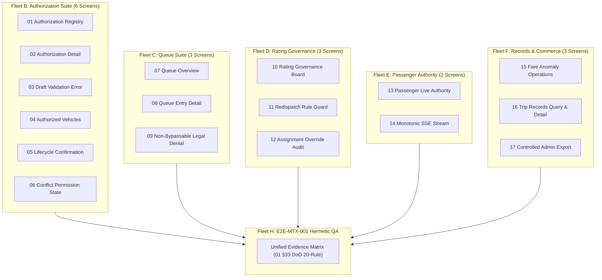

# E2E-MTX-001 Sidecar Acceptance Packet & Upstream Dependency Map

- **Task ID:** `E2E-MTX-001-SIDECAR-ACCEPTANCE`
- **Parent Task:** `E2E-MTX-001` (Fleet H: Cross-Surface Release QA)
- **Task Kind:** `sidecar` (`acceptance_packet`)
- **Owner:** `Gemini`
- **Reviewer:** `Claude2`
- **Date:** `2026-07-26`
- **Canonical Boundary:** Support artifact only. Does NOT mutate canonical truth (L1 specs, DB schemas, or production runtime contracts).

---

## 1. Executive Summary

This sidecar packet establishes the prerequisite dependency map, verification status, 17-screen coverage matrix, and 20-rule DoD acceptance checklist for parent task **`E2E-MTX-001`** (Fleet H: Cross-Surface Release QA).

All 7 required upstream prerequisite tasks across Fleets B through G (`MTX-AUTH-UI-001`, `MTX-QUEUE-003`, `P5-RATE-001`, `P5-PAX-001`, `P5-FARE-001`, `S3-VERIFY-001`, `P5-RET-UI-001`) have been verified as landed in canonical source control with associated unit/E2E test suites and sidecar evidence packages.

---

## 2. Upstream Dependency Map & Verification Status

| Dependency ID | Fleet | Functional Scope | Status | Verification Evidence / Artifact | Landed Commit SHA |
| :--- | :--- | :--- | :--- | :--- | :--- |
| `MTX-AUTH-UI-001` | Fleet B | Multi-Taxi Operating Authorization Admin UI (6-screen suite) | `VERIFIED` | `support/sidecars/MTX-AUTH-UI-001/handoff.md`<br>`tests/e2e/mtx-authorization-operations.spec.ts` | `54675de25` / `53ab9718d` |
| `MTX-QUEUE-003` | Fleet C | Ops Queue Operations & Read Model (3-screen suite) | `VERIFIED` | `support/sidecars/MTX-QUEUE-003/MTX-QUEUE-003-ACCEPTANCE.md`<br>`tests/e2e/ops-queue-semantics.spec.ts` | `d2115f116` |
| `P5-RATE-001` | Fleet D | Version-Safe Redispatch Guard & Rating Governance (3-screen suite) | `VERIFIED` | `support/sidecars/P5-RATE-001/P5-RATE-001-SIDECAR-ACCEPTANCE.md`<br>`apps/api/tests/integration/int-p5-redispatch-001-version-safe-redispatch.test.ts` | `a03e32ea2` |
| `P5-PAX-001` | Fleet E | Live Passenger Authority with Monotonic Status & SSE (2-screen suite) | `VERIFIED` | `support/sidecars/P5-PAX-001/preflight-and-acceptance.md`<br>`tests/e2e/p5-passenger-live-authority.spec.ts` | `ff6a64ac3` |
| `P5-FARE-001` | Fleet F | Fail-Closed Fare Anomaly & Fare Operations | `VERIFIED` | `support/sidecars/P5-FARE-ANOM-UI-001/`<br>`tests/e2e/p5-records-operations.spec.ts` | `ff0873269` |
| `S3-VERIFY-001` | Fleet G | Fleet G Verification, SOS Evidence & Security Scans | `VERIFIED` | `support/sidecars/S3-VERIFY-001/S3-VERIFY-001-EVIDENCE.md`<br>`tests/e2e/E2E-017-driver-sos-incident.sh` | `72d8d7420` |
| `P5-RET-UI-001` | Fleet F | P5 Trip Records Surface & Controlled Admin Export | `VERIFIED` | `support/sidecars/P5-RET-OPS-UI-001/VERIFICATION.md`<br>`tests/e2e/p5-records-operations.spec.ts` | `2711c366f` |

---

## 3. 17-Screen Fleets Execution Verification Matrix

The parent task `E2E-MTX-001` must execute end-to-end hermetic verification across all 17 screens specified in `10_full_17_screen_fleets_execution_tasks_20260724.md`:



---

## 4. E2E-MTX-001 Acceptance Checklist (20-Rule DoD Compliance)

When parent owner `Claude2` executes `E2E-MTX-001`, the following acceptance criteria must be satisfied to validate release readiness:

### A. Core E2E Verification Rules
- [ ] **AC-01 (Hermetic Execution):** All E2E test scenarios must run against local hermetic services (`apps/api`, ops web, admin web, driver app) using `tests/e2e/run-e2e-hermetic.sh`.
- [ ] **AC-02 (Multi-Taxi Authorization Seam):** Verify authorization grant, draft validation, vehicle association, and denial rules end-to-end (`tests/e2e/mtx-authorization-operations.spec.ts`).
- [ ] **AC-03 (Ops Queue Operations):** Verify queue overview, entry detail, and physical rank / taxi stand legal denial states (`tests/e2e/ops-queue-semantics.spec.ts`).
- [ ] **AC-04 (Version-Safe Redispatch):** Verify version-safe redispatch guard prevents stale state overwrites during driver reassignment.
- [ ] **AC-05 (Monotonic Passenger SSE):** Verify passenger authority transitions progress monotonically without sequence inversion (`tests/e2e/p5-passenger-live-authority.spec.ts`).
- [ ] **AC-06 (Fare Anomaly & Retention):** Verify fail-closed fare anomaly flags and audit log retention export (`tests/e2e/p5-records-operations.spec.ts`).
- [ ] **AC-07 (SOS Incident Reporting):** Verify SOS incident creation, payload validation, and attachment scan fail-closed behavior (`tests/e2e/E2E-017-driver-sos-incident.sh`).

### B. Evidence Matrix Schema Compliance
- [ ] **AC-08 (Evidence Matrix Completeness):** The release output must contain a unified evidence matrix covering all 17 screens and 7 dependency scopes.
- [ ] **AC-09 (Scenario Mapping):** Every row in the evidence matrix must specify:
  1. `Scenario ID`
  2. `Test Command / Execution Run URL`
  3. `Order / Authorization / Snapshot Identifiers`
  4. `API and DB Readback Verification`
  5. `UI Screenshot Path (where applicable)`
  6. `Expected vs. Actual Status & Reason Code`
  7. `Landed Commit SHA`
- [ ] **AC-10 (Readback Verification):** All state changes asserted in UI or E2E tests must be verified via direct API or DB readback queries.
- [ ] **AC-11 (Localization & Copy Rules):** All primary messages and denial reasons must display localized Traditional Chinese text; raw error codes serve only as secondary audit detail.

### C. Governance & Release Boundaries
- [ ] **AC-12 (No Canonical Mutation):** E2E test runs must not alter L1 canonical specs or production database schemas.
- [ ] **AC-13 (Release Recommendation Boundary):** Fleet H output provides release readiness recommendations only; it must not execute automatic deployment or production publishing.
- [ ] **AC-14 (Honest Blocker Reporting):** Any unresolved environmental or hardware dependencies (e.g. physical mobile device SOS replay, production p95 alert latency) must be explicitly flagged as external blockers without dummy fallbacks.
- [ ] **AC-15 (Reviewer Handoff):** Complete handoff to assigned reviewer `Claude2` with structured evidence packet.

---

## 5. Test Suite Execution Guide for Parent Task

To execute the verification suite for parent `E2E-MTX-001`:

```bash
# 1. Run unit test suites for core modules
pnpm --filter @drts/api test
pnpm --filter @drts/ops-console-web test
pnpm --filter @drts/platform-admin-web test

# 2. Run hermetic Playwright E2E suites
MAP_GEOFENCE_OPS_MOCK_API_PORT=3116 pnpm exec playwright test -c tests/e2e/mtx-authorization-operations.spec.ts
MAP_GEOFENCE_OPS_MOCK_API_PORT=3116 pnpm exec playwright test -c tests/e2e/ops-queue-semantics.spec.ts
MAP_GEOFENCE_OPS_MOCK_API_PORT=3116 pnpm exec playwright test -c tests/e2e/p5-passenger-live-authority.spec.ts
MAP_GEOFENCE_OPS_MOCK_API_PORT=3116 pnpm exec playwright test -c tests/e2e/p5-records-operations.spec.ts

# 3. Run shell E2E integration verification
bash tests/e2e/E2E-017-driver-sos-incident.sh
```

---

## 6. Handoff & Sign-Off

- **Packet Status:** `READY_FOR_REVIEW`
- **Owner Sign-Off:** Gemini
- **Assigned Reviewer:** Claude2
- **Next Step:** Reviewer (`Claude2`) reviews this support sidecar packet and approves for parent task `E2E-MTX-001` execution.
