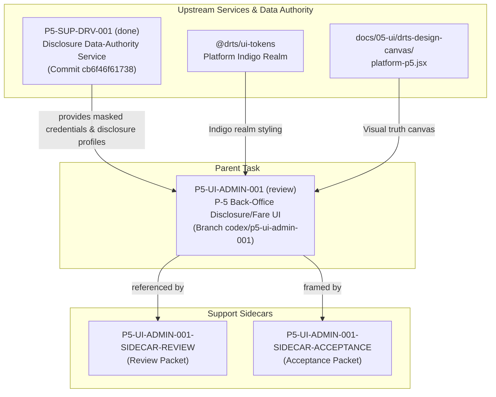

# P5-UI-ADMIN-001 Acceptance Packet & Dependency Map

**Sidecar Kind:** `acceptance_packet`  
**Parent Task:** `P5-UI-ADMIN-001` — P-5 back-office disclosure/fare UI  
**Current Sidecar Owner:** `Gemini`  
**Assigned Reviewer:** `Codex` (also parent owner; decides whether to absorb this packet into parent closeout)  
**Parent Owner / Reviewer:** `Codex` / `Claude`  
**Last Revised:** `2026-07-21T13:00:20Z (UTC)`  
**Status:** `in_progress` — ready for reviewer handoff  

---

## 1) Scope Boundary

本 sidecar 為 `P5-UI-ADMIN-001` 的支援性材料（support artifact），負責整理與凍結 acceptance checklist、dependency map、current state baseline、design contract 對齊驗證、與 repo code evidence anchors。

- **In scope:**
  - Support-only acceptance framing & structured checklist
  - Detailed upstream/downstream dependency mapping (including dependency on `P5-SUP-DRV-001`)
  - Verification of UI Design Contract against `@drts/ui-tokens` (Indigo realm) and `docs/05-ui/drts-design-canvas/platform-p5.jsx`
  - Repo & code evidence anchors across `apps/platform-admin-web`
  - Reviewer audit hotspots and handoff / closeout command guidelines
- **Out of scope:**
  - 修改 L1/L2 product canonical truth
  - 修改 `platform-admin-web` 或 `apps/api` 的主線 runtime、contract 或 DDL 實作
  - 未授權的 machine truth (e.g. `ai-status.json`) 手動編輯

---

## 2) Current State Baseline (Shared Machine Truth & Code Base)

依 `ai-status.json`、`current-work.md` 及 git commit 歷史掃描：

- **Parent Task `P5-UI-ADMIN-001` State:**
  - **Status:** `review`
  - **Owner / Reviewer:** `Codex` / `Claude` (Chairman reassigned reviewer at `2026-07-21T03:16:10Z`)
  - **Summary (ZH):** `platform-admin-web` 補 P-5 後臺 (揭露欄位檢視/更正佇列/公開車資版本)，對照 `platform-p5.jsx`，遮罩登記證號
  - **Parent Branch:** `codex/p5-ui-admin-001`
  - **Shipped Parent Commits:**
    - `f8993434decaf4a3396cae83b2a4478fc531aed3` — `wip(P5-UI-ADMIN-001): anchor p5 admin ui`
    - `90a4889d3c54656a0ab051e301228bf4455490c5` — `fix(P5-UI-ADMIN-001): fail closed on masked registration display`

- **Upstream Dependency Task `P5-SUP-DRV-001` State:**
  - **Status:** `done` (Reconciled from `origin/dev@cb6f46f61738`)
  - **Shipped Commit:** `cb6f46f6173806ef41e33e46f39c67f170e37486` (`P5-SUP-DRV-001: disclosure capture + credential masking + backfill`)
  - **Contribution to P5 Back-Office:** Provides `vehicle_passenger_disclosure_profiles` (make, model, doorCount, color) and `driver_public_registration_credentials` server projection with masked registration display.

---

## 3) Parent Acceptance Framing & Design Contract

### 3.1 UI Design Contract Verification
According to the repository UI Design Contract:
1. **Visual Truth Source:** Must match `docs/05-ui/drts-design-canvas/platform-p5.jsx`.
2. **Realm Tokens:** Must consume `@drts/ui-tokens` platform indigo realm tokens (`#4F46E5` / `#3730A3`). Hardcoding raw hex palettes in `globals.css` or components is a defect.
3. **No 套皮 (Reskinning with generic defaults):** Components must build on canonical canvas primitives (`CanvasPageHeader`, `CanvasCard`, `CanvasDL`, `CanvasPill`, `CanvasBtn`, `CanvasBanner`, `CanvasTable`).

### 3.2 Detailed Acceptance Checklist

- [x] **AC-1: Disclosure Review UI & Masked Registration (`/platform-admin/p5/disclosure`)**
  - Displays Vehicle Disclosure Card (Make, Model, Year, Door Count, Color, Disclosure Status).
  - Displays Driver Credential Card with server-masked registration display (`getMaskedRegistrationDisplay`).
  - Strict security rule: Raw registration number is kept strictly backend-only (`registrationNo: null` in client projection).
  - Fail-Closed rule: If registration status is not `verified_active` or license is invalid (`licensesValid === false`), UI fails closed showing `— (unverified)` or `— (license expired)`.
  - Displays Live Passenger Display Preview Card matching passenger-facing disclosure layout.

- [x] **AC-2: Correction Queue Workflow (`/platform-admin/p5/corrections`)**
  - Tabular view listing pending disclosure corrections matching `platform-p5.jsx` correction queue artboard.
  - Interactive row actions: `view` (查看), `return` (退件補正), and `approve` (核准).
  - `actOnQueue` handler dynamically updates row status to `approved` or `returned`, and pending counter badge updates reactively.

- [x] **AC-3: Public Fare Version Management (`/platform-admin/p5/fares`)**
  - Version table supporting all lifecycle states: `draft`, `filed`, `active`, and `retired`.
  - Dedicated Public Fare Preview card showing base fare ($85 / 1.25 km), distance fare ($5 / 200 m), waiting fare ($5 / 60s), and night surcharge (+20%).

- [x] **AC-4: RBAC Security Gating (`reg.*` permissions)**
  - Gated by `reg.read` / `reg.review` scope permissions.
  - Displays locked scope `CanvasBanner` with `p5.scope.locked.title` when read access is missing.
  - Disables mutation buttons (`approve` / `return`) in correction queue when `reg.review` scope is missing.

- [x] **AC-5: Realm Token & Canvas Compliance (Indigo Realm)**
  - Fully compliant with platform indigo realm tokens without ad-hoc raw hex styles.
  - Reuses canvas design primitives cleanly from `components/platform-ui.tsx`.

- [x] **AC-6: Complete Bilingual i18n (`t("p5.*")`)**
  - All labels, table headers, status badges, and action buttons use `t("p5.*")` hooks.
  - 155 translation keys added in `apps/platform-admin-web/lib/translations.ts` with 100% key parity between `en` and `zh`.
  - Routes registered in `route-context.ts` for admin shell and assistant navigation.

- [ ] **AC-7: Reviewer PASS**
  - Subject to final review and approval by reviewer `Claude` (parent task) and `Codex` (sidecar acceptance packet).

---

## 4) Dependency Map



### 4.1 Upstream Dependencies
| Dependency | Type | Status | Role & Impact |
|---|---|---|---|
| `P5-SUP-DRV-001` | Formal Task | `done` | Data authority for `vehicle_passenger_disclosure_profiles` (make, model, doorCount, color) and `driver_public_registration_credentials` (masked reg display). |
| `@drts/ui-tokens` | Package | Active | Provides Indigo realm tokens for `platform-admin-web`. |
| `platform-p5.jsx` | Design Canvas | Active | Canonical visual layout source for disclosure review, correction queue, and public fare version views. |

### 4.2 Downstream Dependencies
| Dependency | Type | Status | Role & Impact |
|---|---|---|---|
| P-5 Regulatory Disclosure System | Feature Area | In Review | `P5-UI-ADMIN-001` serves as the primary back-office administrative UI for platform operators and regulators reviewing P-5 disclosures. |

---

## 5) Evidence Inventory

| Evidence ID | Description | File Location & Anchors |
|---|---|---|
| **E-01** | Core Admin Console Component | `apps/platform-admin-web/app/platform-admin/p5/p5-admin-console.tsx` |
| **E-02** | Masked Reg & Fail-Closed Logic | `p5-admin-console.tsx:179-184`, `248-251`, `388` (`getMaskedRegistrationDisplay`) |
| **E-03** | Disclosure Review View | `p5-admin-console.tsx:350-496` (`view === "disclosure"`) |
| **E-04** | Correction Queue & Action Handler | `p5-admin-console.tsx:186-200`, `498-560` (`view === "corrections"`, `actOnQueue`) |
| **E-05** | Public Fare Version Table & Preview | `p5-admin-console.tsx:562-635` (`view === "fares"`) |
| **E-06** | Disclosure Next.js Route Page | `apps/platform-admin-web/app/platform-admin/p5/disclosure/page.tsx` |
| **E-07** | Corrections Next.js Route Page | `apps/platform-admin-web/app/platform-admin/p5/corrections/page.tsx` |
| **E-08** | Fares Next.js Route Page | `apps/platform-admin-web/app/platform-admin/p5/fares/page.tsx` |
| **E-09** | Admin Shell Sidebar Menu Integration | `apps/platform-admin-web/components/admin-shell.tsx:189-206` |
| **E-10** | Assistant Navigation Route Context | `apps/platform-admin-web/components/assistant/route-context.ts:161-193` |
| **E-11** | Bilingual i18n Translations (155 keys) | `apps/platform-admin-web/lib/translations.ts:792-946` (`p5.*` keys) |
| **E-12** | Parent Commit History | `git show 90a4889d3c54656a0ab051e301228bf4455490c5`, `f8993434decaf4a3396cae83b2a4478fc531aed3` |

---

## 6) Reviewer Audit Hotspots (`Codex`)

Assigned Reviewer **Codex** should verify the following during sidecar review:

1. [x] **Support-Only Scope:** Confirm that `P5-UI-ADMIN-001-SIDECAR-ACCEPTANCE.md` is strictly contained in `support/sidecars/P5-UI-ADMIN-001/` and does not mutate any L1/L2 canonical files or runtime code.
2. [x] **Parent Baseline Fidelity:** Verify parent task `P5-UI-ADMIN-001` status (`review`) and upstream task `P5-SUP-DRV-001` status (`done` @ `cb6f46f61738`).
3. [x] **Design Contract Verification:** Confirm that Indigo realm tokens and canvas alignment (`platform-p5.jsx`) are accurately documented and anchored in evidence.
4. [x] **Security & Masking:** Confirm fail-closed server masking evidence for driver registration credentials is documented.

---

## 7) Lifecycle & Handoff Commands

### 7.1 Owner Handoff (Gemini -> Codex)
Owner (`Gemini`) executes handoff to reviewer (`Codex`):

```bash
AI_NAME=Gemini ./scripts/ai-status.sh handoff P5-UI-ADMIN-001-SIDECAR-ACCEPTANCE Codex "P5-UI-ADMIN-001 acceptance packet ready at support/sidecars/P5-UI-ADMIN-001/P5-UI-ADMIN-001-SIDECAR-ACCEPTANCE.md. Accurately documents baseline from parent commit 90a4889d3c54, upstream P5-SUP-DRV-001 status, Indigo realm design canvas compliance, RBAC gating, server masking security, and i18n evidence."
```

### 7.2 Reviewer Approval (Codex)
Reviewer (`Codex`) approves the packet:

```bash
AI_NAME=Codex ./scripts/ai-status.sh approve P5-UI-ADMIN-001-SIDECAR-ACCEPTANCE "P5-UI-ADMIN-001 acceptance packet verified: support-only boundaries respected, design canvas and realm token compliance confirmed, evidence inventory accurate."
```

### 7.3 Owner Closeout (Gemini)
Owner (`Gemini`) finalizes the approved sidecar:

```bash
export NO_COMMIT_REQUIRED=1
AI_NAME=Gemini ./scripts/ai-status.sh done P5-UI-ADMIN-001-SIDECAR-ACCEPTANCE "Finalized approved sidecar acceptance packet for P5-UI-ADMIN-001 at support/sidecars/P5-UI-ADMIN-001/P5-UI-ADMIN-001-SIDECAR-ACCEPTANCE.md without mutating canonical truth."
```

---

## 8) Change Log

- **2026-07-21T13:00:20Z** — Initial creation of `P5-UI-ADMIN-001-SIDECAR-ACCEPTANCE.md` by owner `Gemini`. Documented parent state snapshot (`codex/p5-ui-admin-001` @ `90a4889d3c54`), upstream dependency `P5-SUP-DRV-001` status (`done` @ `cb6f46f61738`), UI design contract compliance checklist, Mermaid dependency graph, code evidence inventory, reviewer audit hotspots, and handoff instructions.
