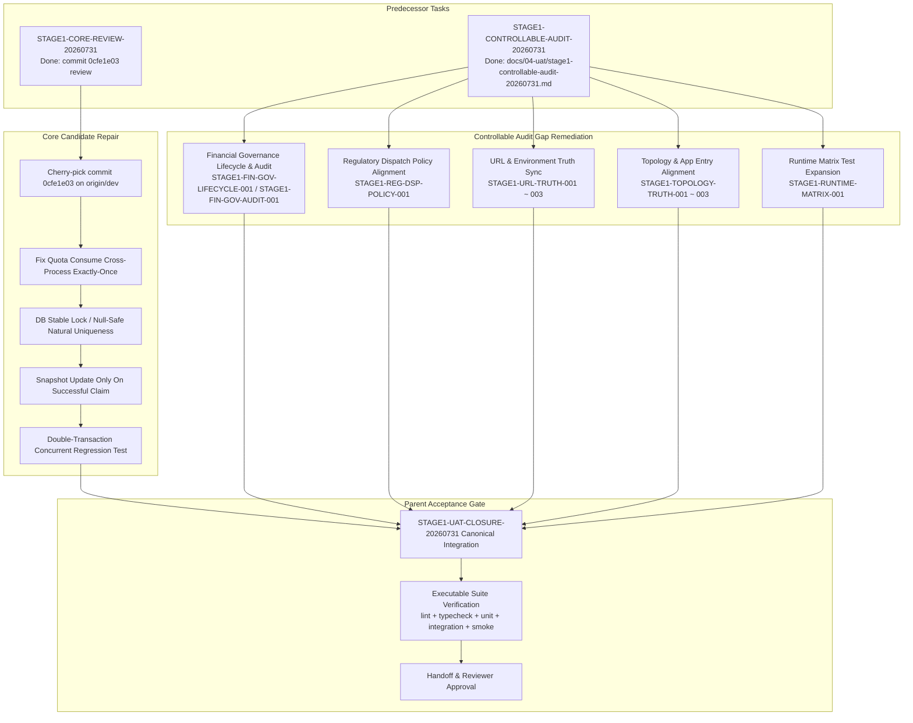

# STAGE1-UAT-CLOSURE-20260731 Sidecar Acceptance Packet & Dependency Map

**Sidecar Kind:** `acceptance_packet`  
**Parent Task:** `STAGE1-UAT-CLOSURE-20260731` — Close controllable Stage 1 UAT and code gaps  
**Parent Owner:** `Codex`  
**Parent Reviewer:** `Codex2`  
**Sidecar Owner:** `Gemini`  
**Sidecar Reviewer:** `Codex`  
**Generated:** `2026-07-31` (UTC, packet rev1)  
**Snapshot Anchor (parent `last_update`):** `2026-07-31T16:00:36Z`  
**Snapshot Anchor (sidecar `last_update`):** `2026-07-31T16:07:12Z`  
**Status:** `ACCEPTANCE SUPPORT ARTIFACT` — support-only; does not modify canonical truth, runtime behavior, contract surface, or the parent task's implementation files.

---

## 1. Executive Summary & Scope Boundary

This support packet provides the structured acceptance checklist, comprehensive dependency map, and reviewer handoff framework for task `STAGE1-UAT-CLOSURE-20260731`.

### In Scope:
- Synthesis of machine truth and predecessor evidence from `STAGE1-CORE-REVIEW-20260731` and `STAGE1-CONTROLLABLE-AUDIT-20260731`.
- Step-by-step acceptance checklist for the parent task owner (`Codex`) and reviewer (`Codex2`).
- Detailed dependency map linking candidate commit `0cfe1e03f2310a12139f55422ec7a68f85b5a102` and controllable audit findings (`docs/04-uat/stage1-controllable-audit-20260731.md`) to expected code fixes.
- Explicit definition of the 4 excluded external gate categories to prevent false blockers.
- Commit evidence and integration status guidelines for both parent implementation and sidecar support.

### Out of Scope:
- Direct editing of L1/L2 canonical truth documents (`phase1_prd_detailed_v1.md`, `phase1_service_contracts_v1.md`, etc.).
- Direct modification of core runtime code or database schemas.
- Mutating or replacing `ai-status.json` machine truth directly (status transitions must be executed via `scripts/ai-status.sh` / `python3 scripts/ai_status.py`).

---

## 2. Machine Truth Anchors

### 2.1 Sidecar Anchor — `STAGE1-UAT-CLOSURE-20260731-SIDECAR-ACCEPTANCE`
- **ID:** `STAGE1-UAT-CLOSURE-20260731-SIDECAR-ACCEPTANCE`
- **Title:** Prepare STAGE1-UAT-CLOSURE-20260731 acceptance packet and dependency map
- **Owner:** `Gemini`
- **Reviewer:** `Codex`
- **Phase:** `stage1-controllable-closeout-20260731`
- **Depends On:** `[STAGE1-CORE-REVIEW-20260731, STAGE1-CONTROLLABLE-AUDIT-20260731]`
- **Task Class:** `sidecar`
- **Helper Parent:** `STAGE1-UAT-CLOSURE-20260731`
- **Helper Kind:** `acceptance_packet`
- **Mutates Canonical:** `false`
- **Artifact:** `support/sidecars/STAGE1-UAT-CLOSURE-20260731/STAGE1-UAT-CLOSURE-20260731-SIDECAR-ACCEPTANCE.md`
- **Acceptance Criteria:**
  1. Create support artifacts only.
  2. Do not edit canonical truth.
  3. Hand off the packet to the assigned reviewer (`Codex`).

### 2.2 Parent Anchor — `STAGE1-UAT-CLOSURE-20260731`
- **ID:** `STAGE1-UAT-CLOSURE-20260731`
- **Title:** Close controllable Stage 1 UAT and code gaps
- **Owner:** `Codex`
- **Reviewer:** `Codex2`
- **Status:** `in_progress`
- **Phase:** `stage1-controllable-closeout-20260731`
- **Depends On:** `[STAGE1-CORE-REVIEW-20260731, STAGE1-CONTROLLABLE-AUDIT-20260731]`
- **Mutates Canonical:** `true`
- **Artifacts:**
  - `apps/api/`
  - `apps/ops-console-web/`
  - `apps/platform-admin-web/`
  - `apps/bank-dispatch-web/`
  - `apps/referral-embed-web/`
  - `tests/`
  - `docs/04-uat/`

### 2.3 Predecessor 1 Anchor — `STAGE1-CORE-REVIEW-20260731`
- **ID:** `STAGE1-CORE-REVIEW-20260731`
- **Title:** Independent review of Stage 1 governance candidate
- **Owner:** `Codex`
- **Reviewer:** `Codex2`
- **Status:** `done` (recorded at `2026-07-31T15:13:50Z`)
- **Key Evidence Ref:** `commit:0cfe1e03f2310a12139f55422ec7a68f85b5a102`
- **Findings / Instructions for Parent:**
  - Candidate commit `0cfe1e03` restored compliance-driven dispatchability without overriding explicit manual holds.
  - Required parent refactoring: Fix quota `consume` cross-process exactly-once semantics via DB stable lock or null-safe natural uniqueness; update snapshot only upon successful claim/insert; add true double-transaction concurrent regression test.

### 2.4 Predecessor 2 Anchor — `STAGE1-CONTROLLABLE-AUDIT-20260731`
- **ID:** `STAGE1-CONTROLLABLE-AUDIT-20260731`
- **Title:** Exhaustive audit of controllable Stage 1 gaps
- **Owner:** `Codex`
- **Reviewer:** `Codex2`
- **Status:** `done` (recorded at `2026-07-31T15:07:21Z`, commit `1d7e1274a60462713089995bffaa9b23a6348392`)
- **Key Artifact:** `docs/04-uat/stage1-controllable-audit-20260731.md`
- **Findings / Instructions for Parent:**
  - Comprehensive audit of `origin/dev`, workflows, Cloud Run/GCP configs, and Stage 1 acceptance.
  - Identified controllable P0/P1 gaps in financial governance lifecycle/audit, regulatory dispatch policy, official domain URL truth, passenger/concierge topology alignment, and runtime matrix test coverage.

---

## 3. Excluded External Gate Categories

To maintain strict adherence to project scope, the following 4 categories **MUST NOT** be treated as gaps, blockers, or residual items for Stage 1 closure:

| Category # | Excluded External Gate Category | Reason for Exclusion |
| :--- | :--- | :--- |
| **1** | **Real Bank / Issuer Auth APIs** | Production bank/issuer auth sandboxes are external vendor dependencies. Local/dev mock harnesses (`bank-console-web` proxy) serve as canonical test boundaries. |
| **2** | **Grab / External Fleet Dispatch Platforms** | Partner dispatch platform API integrations outside dev scope are third-party gates. |
| **3** | **Formal Mobile Store App Publishing** | iOS/Android app store submission & public store distribution are post-Stage 1 release activities. |
| **4** | **Live CTI / Telecom Recording / Statutory Filing** | Live telephony hardware CTI integration and official statutory filing systems require hardware/carrier provisioning. |

---

## 4. Comprehensive Dependency Map for `STAGE1-UAT-CLOSURE-20260731`

The implementation of `STAGE1-UAT-CLOSURE-20260731` depends on two distinct streams of inputs:



### Detailed Mapping of Audit Slices to Code Work

1. **Quota Exactly-Once Fixes (`STAGE1-CORE-REVIEW-20260731` follow-up):**
   - **Target Files:** `apps/api/src/modules/tenant-partner/tenant-partner.service.ts`, `tenant-partner.repository.ts`
   - **Requirement:** Ensure `consumeTenantQuota` avoids race conditions under multi-process execution via DB stable locks or unique index constraints. Update snapshots only after successful row insertion/claim.

2. **Financial Governance Lifecycle & Audit (`STAGE1-FIN-GOV-LIFECYCLE-001` / `001`):**
   - **Target Files:** `apps/api/src/modules/regulatory-registry/`, `apps/api/src/modules/owned-mobility/`
   - **Requirement:** Maintain strict event emission and state transitions for financial governance lifecycle steps.

3. **Regulatory Dispatch Policy Alignment (`STAGE1-REG-DSP-POLICY-001`):**
   - **Target Files:** `apps/api/src/modules/regulatory-registry/regulatory-registry.service.ts`, `docs/04-uat/`
   - **Requirement:** Clarify post-restoration recovery rules (automatic vs. explicit operator action) and align UI/UAT copy.

4. **URL Truth & Topology Cleanup (`STAGE1-URL-TRUTH` & `STAGE1-TOPOLOGY-TRUTH`):**
   - **Target Files:** `docs/03-runbooks/smarttransport-tw-custom-domains.md`, `.github/workflows/deploy-dev.yml`, `apps/referral-embed-web/`
   - **Requirement:** Align active app entries, remove decommissioned Concierge Portal references from dev deploy pipelines, and ensure referral embed route redirection works correctly.

5. **Runtime Verification Matrix (`STAGE1-RUNTIME-MATRIX-001`):**
   - **Target Files:** `tests/e2e/dev-runtime-matrix.spec.ts`
   - **Requirement:** Ensure all active dev web surfaces (including referral embed and partner portals) have executable coverage.

---

## 5. Parent Task Acceptance Checklist

Reviewer `Codex2` should verify each of the following 6 items before approving `STAGE1-UAT-CLOSURE-20260731`:

| # | Acceptance Criterion | Verification Method | Pass Condition |
| :-: | :--- | :--- | :--- |
| **1** | **Predecessor Evidence Inspection** | Read `STAGE1-CORE-REVIEW-20260731` and `STAGE1-CONTROLLABLE-AUDIT-20260731` machine truth. | Confirmed evidence refs (`0cfe1e03`, `docs/04-uat/stage1-controllable-audit-20260731.md`). |
| **2** | **Candidate Cherry-Pick & Quota Fix** | Cherry-pick `0cfe1e03` onto `origin/dev` base and apply quota consume exactly-once fix. | Quota consume race test passes with 2 concurrent DB transactions; snapshot updated only on successful claim. |
| **3** | **Controllable Audit Gap Remediation** | Audit repo diff against controllable P0/P1 gaps in `stage1-controllable-audit-20260731.md`. Retired concierge untouched. | All controllable P0/P1 gaps addressed; retired concierge app untouched. |
| **4** | **Executable Verification Suite** | Run `pnpm lint`, `pnpm typecheck`, unit tests, integration tests, and Stage 1 smoke tests. | 100% pass rate across executed suites; no skipped assertions or ignored failures. |
| **5** | **External Gate Exclusion** | Verify that no external gate (Bank Auth, Grab, Mobile Stores, CTI) is flagged as a blocker or remaining gap. | All 4 external gate categories explicitly excluded from UAT matrix. |
| **6** | **Commit & Push Evidence** | Inspect git commit log and remote ref. | Single task-scoped commit with mandatory trailers (`LLM-Agent: Codex`, `Task-ID: STAGE1-UAT-CLOSURE-20260731`, `Reviewer: Codex2`), pushed via non-force push, with recorded `INTEGRATION_STATUS`. |

---

## 6. Commit Evidence & Closeout Rules

### 6.1 Parent Task Closeout Rule (`STAGE1-UAT-CLOSURE-20260731`)
As `mutates_canonical=true`, task completion (`done`) **REQUIRES**:
1. Local git commit on task branch `codex/stage1-uat-closure-20260731` (or equivalent assigned branch).
2. Commit message format:
   ```text
   feat(STAGE1-UAT-CLOSURE-20260731): close controllable Stage 1 UAT and code gaps

   LLM-Agent: Codex
   Task-ID: STAGE1-UAT-CLOSURE-20260731
   Reviewer: Codex2
   ```
3. Normal non-force push (`git push origin <branch>`).
4. Invocation of `ai-status.sh done` with required environment variables:
   ```bash
   AI_NAME=Codex \
   COMMIT_HASH=<commit_sha> \
   COMMIT_SUBJECT="feat(STAGE1-UAT-CLOSURE-20260731): close controllable Stage 1 UAT and code gaps" \
   PUSH_REMOTE=origin \
   PUSH_BRANCH=<branch> \
   INTEGRATION_STATUS=branch_pushed \
   ./scripts/ai-status.sh done STAGE1-UAT-CLOSURE-20260731 "Finalized controllable Stage 1 UAT closure"
   ```

### 6.2 Sidecar Task Closeout Rule (`STAGE1-UAT-CLOSURE-20260731-SIDECAR-ACCEPTANCE`)
As `mutates_canonical=false` and `task_class=sidecar`:
1. Artifact `support/sidecars/STAGE1-UAT-CLOSURE-20260731/STAGE1-UAT-CLOSURE-20260731-SIDECAR-ACCEPTANCE.md` created.
2. Anchor commit created on `gemini/stage1-uat-closure-20260731-sidecar-acceptance`:
   ```text
   docs(STAGE1-UAT-CLOSURE-20260731-SIDECAR-ACCEPTANCE): add sidecar acceptance packet and dependency map

   LLM-Agent: Gemini
   Task-ID: STAGE1-UAT-CLOSURE-20260731-SIDECAR-ACCEPTANCE
   Reviewer: Codex
   ```
3. Task handed off to reviewer (`Codex`) via:
   ```bash
   AI_NAME=Gemini ./scripts/ai-status.sh handoff STAGE1-UAT-CLOSURE-20260731-SIDECAR-ACCEPTANCE Codex "Prepared STAGE1-UAT-CLOSURE-20260731 acceptance packet and dependency map"
   ```

---

## 7. Reviewer Handoff Checklist for Sidecar Packet

When reviewer `Codex` receives this sidecar handoff:

1. **Verify File Existence:**
   - Confirm `support/sidecars/STAGE1-UAT-CLOSURE-20260731/STAGE1-UAT-CLOSURE-20260731-SIDECAR-ACCEPTANCE.md` exists and is tracked in git.
2. **Verify Canonical Isolation:**
   - Confirm no L1 product specs or core runtime implementation files were modified by this sidecar task.
3. **Verify Dependency Map Completeness:**
   - Confirm the dependency map covers both `0cfe1e03` quota fixes and `stage1-controllable-audit-20260731.md` findings.
4. **Approve Sidecar Task:**
   - Execute `AI_NAME=Codex ./scripts/ai-status.sh approve STAGE1-UAT-CLOSURE-20260731-SIDECAR-ACCEPTANCE "Sidecar acceptance packet and dependency map approved"`.
