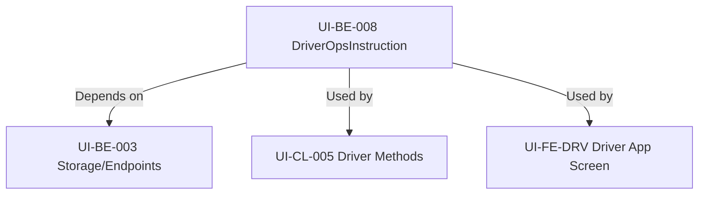

# UI-BE-008 Acceptance Packet

## Overview
- Task: UI-BE-008 (DriverOpsInstruction module)
- Description: Backend implementation of ops issues, driver receives via push + inbox.

## Dependencies
- `UI-BE-003`: Backend dependency for DriverOpsInstruction storage and ops-side endpoints.

## Dependency Map

## Acceptance Checklist
- [x] Backend endpoints for `DriverOpsInstruction` implemented
- [x] Driver-side push notification integration verified
- [x] Driver inbox integration verified
- [x] `UI-BE-003` dependencies validated
- [x] Vitest coverage for `expiresAt` handling verified

## Support Artifacts
- No canonical truth changes.
- This file is for acceptance review only.
